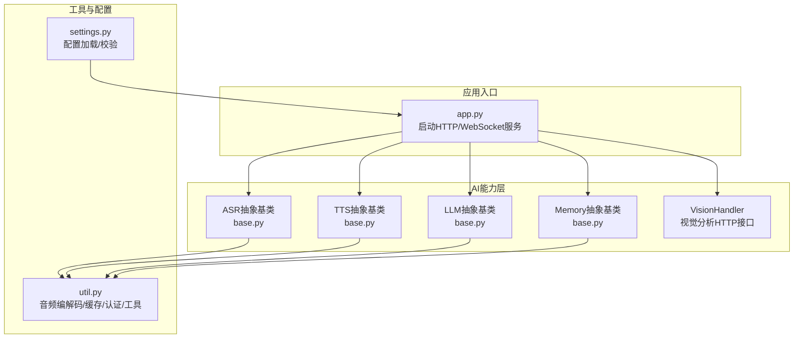
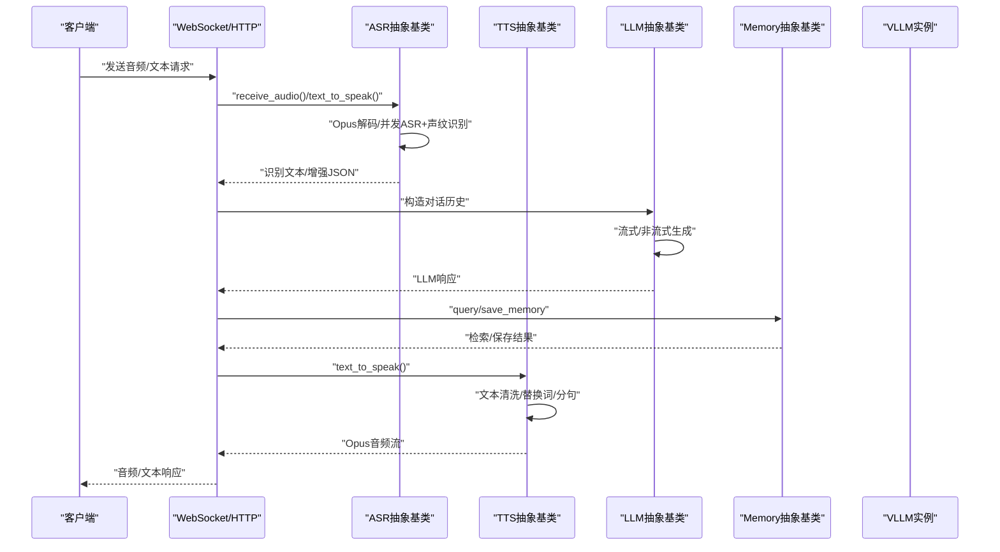
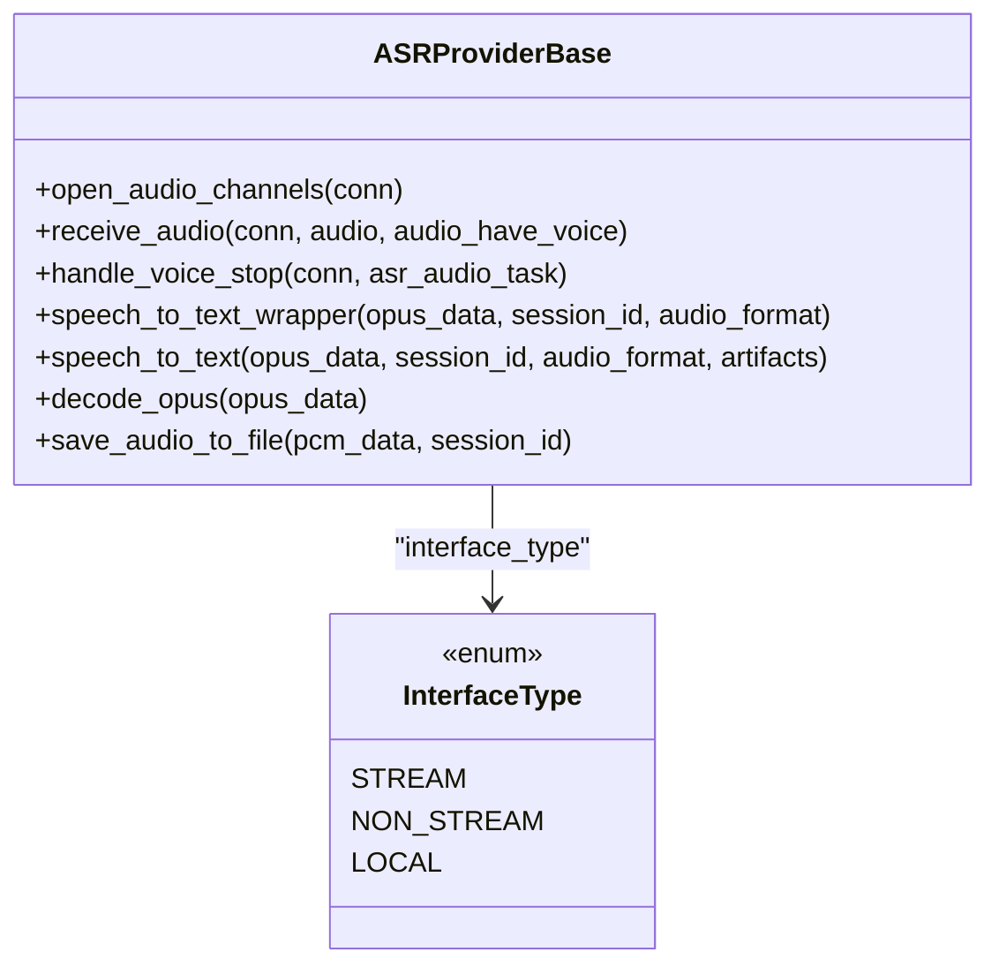
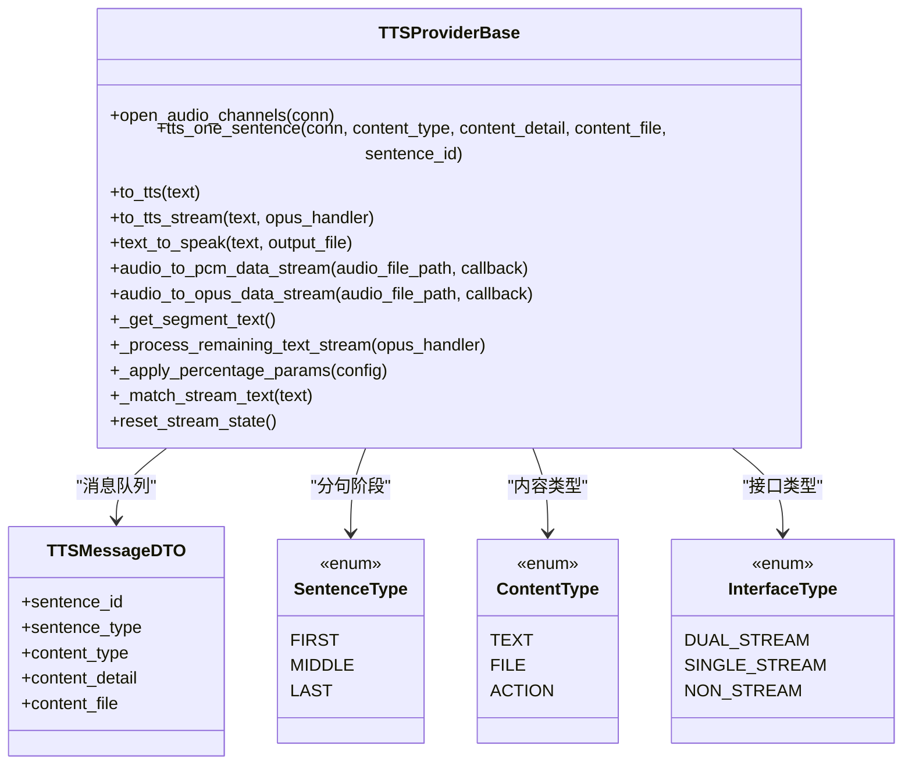
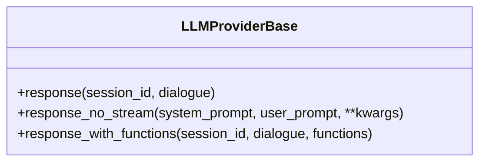
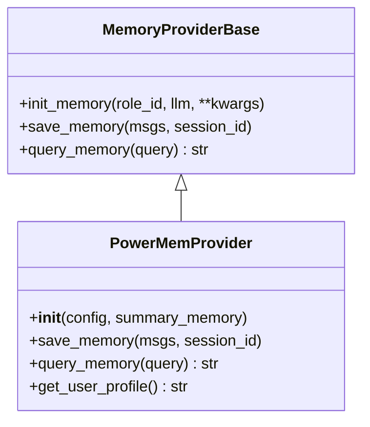
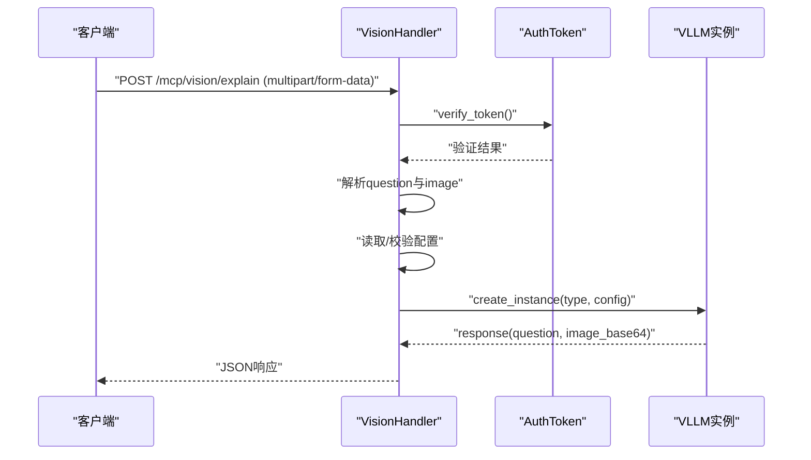
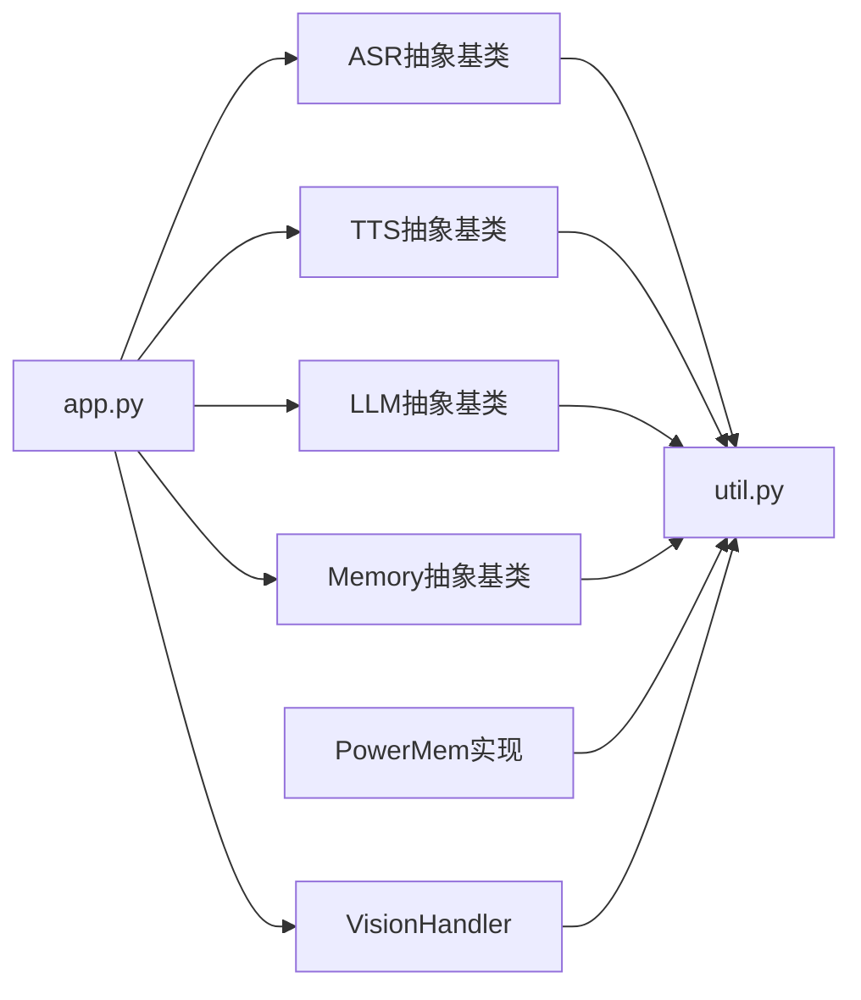

# AI能力模块

<cite>
**本文引用的文件**
- [app.py](file://main/xiaozhi-server/app.py)
- [settings.py](file://main/xiaozhi-server/config/settings.py)
- [util.py](file://main/xiaozhi-server/core/utils/util.py)
- [vision_handler.py](file://main/xiaozhi-server/core/api/vision_handler.py)
- [base.py（ASR抽象基类）](file://main/xiaozhi-server/core/providers/asr/base.py)
- [dto.py（ASR DTO）](file://main/xiaozhi-server/core/providers/asr/dto/dto.py)
- [base.py（TTS抽象基类）](file://main/xiaozhi-server/core/providers/tts/base.py)
- [dto.py（TTS DTO）](file://main/xiaozhi-server/core/providers/tts/dto/dto.py)
- [base.py（LLM抽象基类）](file://main/xiaozhi-server/core/providers/llm/base.py)
- [base.py（Memory抽象基类）](file://main/xiaozhi-server/core/providers/memory/base.py)
- [powermem.py](file://main/xiaozhi-server/core/providers/memory/powermem/powermem.py)
</cite>

## 目录
1. [简介](#简介)
2. [项目结构](#项目结构)
3. [核心组件](#核心组件)
4. [架构总览](#架构总览)
5. [详细组件分析](#详细组件分析)
6. [依赖关系分析](#依赖关系分析)
7. [性能考量](#性能考量)
8. [故障排查指南](#故障排查指南)
9. [结论](#结论)
10. [附录](#附录)

## 简介
本文件面向小智ESP32服务器的AI能力模块，系统性梳理语音识别（ASR）、语音合成（TTS）、大语言模型（LLM）、记忆系统（Memory）与视觉分析（Vision）的架构设计、多平台支持、流式处理、配置参数、API接口与使用示例。文档同时提供代码级架构图与流程图，帮助开发者快速理解与扩展。

## 项目结构
AI能力模块位于 main/xiaozhi-server/core 下，围绕 providers 与 utils 组织，形成“抽象基类 + 多实现 + 工具层”的清晰分层：
- providers/asr：ASR抽象基类与多提供商实现（阿里云、百度、讯飞、Vosk、OpenAI等）
- providers/tts：TTS抽象基类与多提供商实现（阿里云、腾讯、OpenAI、PaddleSpeech、FishSpeech等）
- providers/llm：LLM抽象基类与多提供商实现（OpenAI、Gemini、Ollama、Xinference等）
- providers/memory：Memory抽象基类与多实现（PowerMem、本地短记忆、报告仅记忆、无记忆）
- providers/vllm：视觉LLM（VLLM）封装与实例化
- api/vision_handler.py：MCP视觉分析HTTP接口
- utils：音频编解码、缓存、认证、工具函数
- config/settings.py：配置加载与校验入口

**图表来源**
- [app.py:46-130](file://main/xiaozhi-server/app.py#L46-L130)
- [base.py（ASR抽象基类）:32-382](file://main/xiaozhi-server/core/providers/asr/base.py#L32-L382)
- [base.py（TTS抽象基类）:33-637](file://main/xiaozhi-server/core/providers/tts/base.py#L33-L637)
- [base.py（LLM抽象基类）:7-35](file://main/xiaozhi-server/core/providers/llm/base.py#L7-L35)
- [base.py（Memory抽象基类）:8-29](file://main/xiaozhi-server/core/providers/memory/base.py#L8-L29)
- [vision_handler.py:20-183](file://main/xiaozhi-server/core/api/vision_handler.py#L20-L183)
- [util.py:1-609](file://main/xiaozhi-server/core/utils/util.py#L1-L609)
- [settings.py:1-34](file://main/xiaozhi-server/config/settings.py#L1-L34)

**章节来源**
- [app.py:46-130](file://main/xiaozhi-server/app.py#L46-L130)
- [settings.py:9-34](file://main/xiaozhi-server/config/settings.py#L9-L34)

## 核心组件
- ASR（语音识别）：抽象基类提供统一的音频接收、Opus解码、并发ASR与声纹识别、文本增强与上报流程；各提供商实现遵循统一接口，支持本地与云端。
- TTS（语音合成）：抽象基类提供文本清洗、替换词映射、分句断点、流式/非流式音频生成、Opus编码与播放队列；支持多家TTS提供商与音色定制。
- LLM（大语言模型）：抽象基类提供流式/非流式响应、函数调用占位实现；各提供商实现负责具体推理与工具调用。
- Memory（记忆系统）：抽象基类定义保存与查询接口；PowerMem实现支持异步/用户画像模式、智能记忆（遗忘曲线插件）与嵌入/LLM提供商配置。
- Vision（视觉分析）：HTTP接口封装JWT认证、图片校验、VLLM实例化与响应，支持从智控台动态拉取配置。

**章节来源**
- [base.py（ASR抽象基类）:32-382](file://main/xiaozhi-server/core/providers/asr/base.py#L32-L382)
- [base.py（TTS抽象基类）:33-637](file://main/xiaozhi-server/core/providers/tts/base.py#L33-L637)
- [base.py（LLM抽象基类）:7-35](file://main/xiaozhi-server/core/providers/llm/base.py#L7-L35)
- [base.py（Memory抽象基类）:8-29](file://main/xiaozhi-server/core/providers/memory/base.py#L8-L29)
- [powermem.py:23-450](file://main/xiaozhi-server/core/providers/memory/powermem/powermem.py#L23-L450)
- [vision_handler.py:20-183](file://main/xiaozhi-server/core/api/vision_handler.py#L20-L183)

## 架构总览
AI能力模块采用“事件驱动 + 流式处理 + 多提供商适配”的架构：
- 事件驱动：WebSocket/HTTP接收音频与文本，触发ASR/TTS/LLM/Memory/Vision处理链路。
- 流式处理：TTS与ASR均支持流式/非流式，结合队列与线程池实现高吞吐。
- 多提供商适配：抽象基类统一接口，具体提供商实现细节隔离，便于切换与扩展。

**图表来源**
- [base.py（ASR抽象基类）:62-180](file://main/xiaozhi-server/core/providers/asr/base.py#L62-L180)
- [base.py（TTS抽象基类）:193-258](file://main/xiaozhi-server/core/providers/tts/base.py#L193-L258)
- [base.py（LLM抽象基类）:8-35](file://main/xiaozhi-server/core/providers/llm/base.py#L8-L35)
- [base.py（Memory抽象基类）:16-28](file://main/xiaozhi-server/core/providers/memory/base.py#L16-L28)
- [vision_handler.py:126-130](file://main/xiaozhi-server/core/api/vision_handler.py#L126-L130)

## 详细组件分析

### 语音识别系统（ASR）
- 多平台支持：抽象基类统一处理Opus解码、并发ASR与声纹识别、WAV转换与上报；具体提供商实现（阿里云、百度、讯飞、Vosk、OpenAI等）遵循统一接口。
- 流式处理能力：支持非流式与本地/云端流式接口类型枚举；自动/手动模式下基于VAD触发识别，缓存音频帧并批量处理。
- 配置选项：音频格式（pcm/opus）、输出目录、磁盘空间检查、临时文件策略、删除音频文件开关等。

**图表来源**
- [base.py（ASR抽象基类）:32-382](file://main/xiaozhi-server/core/providers/asr/base.py#L32-L382)
- [dto.py（ASR DTO）:5-10](file://main/xiaozhi-server/core/providers/asr/dto/dto.py#L5-L10)

**章节来源**
- [base.py（ASR抽象基类）:62-180](file://main/xiaozhi-server/core/providers/asr/base.py#L62-L180)
- [dto.py（ASR DTO）:5-10](file://main/xiaozhi-server/core/providers/asr/dto/dto.py#L5-L10)

### 语音合成系统（TTS）
- 多提供商集成：抽象基类统一文本清洗、替换词映射、分句断点、流式/非流式生成、Opus编码与播放队列；支持阿里云、腾讯、OpenAI、PaddleSpeech、FishSpeech等。
- 音色定制与质量优化：支持百分比参数映射、采样率/帧长配置、删除音频文件策略、缓存与重试机制、字幕还原与滑动窗口替换词匹配。
- 配置选项：输出目录、超时时间、替换词、删除音频文件、音频文件类型、Opus编码器初始化等。

**图表来源**
- [base.py（TTS抽象基类）:33-637](file://main/xiaozhi-server/core/providers/tts/base.py#L33-L637)
- [dto.py（TTS DTO）:5-44](file://main/xiaozhi-server/core/providers/tts/dto/dto.py#L5-L44)

**章节来源**
- [base.py（TTS抽象基类）:193-258](file://main/xiaozhi-server/core/providers/tts/base.py#L193-L258)
- [dto.py（TTS DTO）:19-44](file://main/xiaozhi-server/core/providers/tts/dto/dto.py#L19-L44)

### 大语言模型（LLM）集成
- 架构设计：抽象基类提供统一的response接口与函数调用占位；具体提供商实现负责流式/非流式生成与工具调用。
- 模型选择策略：通过配置选择不同提供商与模型，支持OpenAI、Gemini、Ollama、Xinference等；函数调用能力按需启用。
- 性能优化：流式响应减少延迟，函数调用与对话历史管理降低上下文开销。

**图表来源**
- [base.py（LLM抽象基类）:7-35](file://main/xiaozhi-server/core/providers/llm/base.py#L7-L35)

**章节来源**
- [base.py（LLM抽象基类）:13-35](file://main/xiaozhi-server/core/providers/llm/base.py#L13-L35)

### 记忆系统（Memory）
- PowerMem智能记忆：支持异步/用户画像模式、智能记忆（遗忘曲线插件）、向量存储与嵌入/LLM提供商配置；提供保存与查询接口。
- 本地记忆与外部记忆接口：抽象基类定义统一接口，PowerMem实现作为外部记忆接口；其他实现可替换为本地短记忆或报告仅记忆。

**图表来源**
- [base.py（Memory抽象基类）:8-29](file://main/xiaozhi-server/core/providers/memory/base.py#L8-L29)
- [powermem.py:23-450](file://main/xiaozhi-server/core/providers/memory/powermem/powermem.py#L23-L450)

**章节来源**
- [base.py（Memory抽象基类）:16-28](file://main/xiaozhi-server/core/providers/memory/base.py#L16-L28)
- [powermem.py:177-281](file://main/xiaozhi-server/core/providers/memory/powermem/powermem.py#L177-L281)

### 视觉分析系统（多模态）
- 多模态处理能力：支持图片上传、Base64编码、VLLM实例化与响应；JWT认证与CORS处理。
- 应用场景：MCP视觉解释接口，支持从智控台动态拉取配置，选择默认视觉分析模块。

**图表来源**
- [vision_handler.py:47-159](file://main/xiaozhi-server/core/api/vision_handler.py#L47-L159)
- [util.py:522-537](file://main/xiaozhi-server/core/utils/util.py#L522-L537)

**章节来源**
- [vision_handler.py:47-159](file://main/xiaozhi-server/core/api/vision_handler.py#L47-L159)
- [util.py:522-537](file://main/xiaozhi-server/core/utils/util.py#L522-L537)

## 依赖关系分析
- 组件耦合与内聚：抽象基类提供稳定接口，具体实现低耦合；工具层（音频编解码、缓存、认证）跨模块复用。
- 外部依赖与集成点：ffmpeg、opuslib_next、pydub、PowerMem SDK、各类云厂商SDK；通过配置中心与动态实例化解耦。
- 潜在循环依赖：模块间通过抽象基类与工具函数间接交互，未发现直接循环依赖。

**图表来源**
- [app.py:78-83](file://main/xiaozhi-server/app.py#L78-L83)
- [base.py（ASR抽象基类）:32-382](file://main/xiaozhi-server/core/providers/asr/base.py#L32-L382)
- [base.py（TTS抽象基类）:33-637](file://main/xiaozhi-server/core/providers/tts/base.py#L33-L637)
- [base.py（LLM抽象基类）:7-35](file://main/xiaozhi-server/core/providers/llm/base.py#L7-L35)
- [base.py（Memory抽象基类）:8-29](file://main/xiaozhi-server/core/providers/memory/base.py#L8-L29)
- [powermem.py:23-450](file://main/xiaozhi-server/core/providers/memory/powermem/powermem.py#L23-L450)
- [vision_handler.py:20-183](file://main/xiaozhi-server/core/api/vision_handler.py#L20-L183)
- [util.py:1-609](file://main/xiaozhi-server/core/utils/util.py#L1-L609)

**章节来源**
- [app.py:78-83](file://main/xiaozhi-server/app.py#L78-L83)

## 性能考量
- 流式处理：ASR/TTS均支持流式，减少端到端延迟；TTS采用分句断点与滑动窗口替换词提升体验。
- 编解码与缓存：统一的Opus/PCM编解码与音频数据缓存，避免重复I/O；音频文件删除策略与磁盘空间检查保障稳定性。
- 并发与队列：ASR/TTS分别维护文本与音频队列，配合线程池与事件循环，提高吞吐。
- 外部依赖：ffmpeg与各类SDK的初始化成本与超时控制需纳入配置项。

[本节为通用指导，无需列出具体文件来源]

## 故障排查指南
- 配置文件检查：确保存在data/.config.yaml；若开启从API读取配置，避免本地与智控台配置混用。
- ffmpeg依赖：未正确安装将导致音频编解码失败，按提示安装依赖库。
- 认证与CORS：视觉分析接口需Bearer Token；GET请求用于健康检查。
- 音频格式与大小：图片大小限制与格式校验，避免非法文件导致异常。
- 日志与堆栈：异常捕获与详细堆栈记录，便于定位问题。

**章节来源**
- [settings.py:9-34](file://main/xiaozhi-server/config/settings.py#L9-L34)
- [util.py:157-218](file://main/xiaozhi-server/core/utils/util.py#L157-L218)
- [vision_handler.py:30-159](file://main/xiaozhi-server/core/api/vision_handler.py#L30-L159)

## 结论
小智ESP32服务器的AI能力模块通过抽象基类与多提供商实现，实现了ASR/TTS/LLM/Memory/Vision的高内聚、低耦合架构。流式处理、音频编解码与缓存、认证与CORS等工程化特性共同保障了生产环境的稳定性与可扩展性。建议在实际部署中结合业务需求选择合适的提供商与配置，并关注外部依赖与性能指标。

[本节为总结，无需列出具体文件来源]

## 附录

### 配置参数与API参考（摘要）
- 服务器与认证
  - auth_key：JWT密钥生成与校验；支持从配置文件、智控台密钥生成。
  - vision_explain：视觉分析接口地址；支持自动推断本地IP与端口。
- ASR
  - interface_type：STREAM/NON_STREAM/LOCAL
  - 输出目录与磁盘空间检查
  - 临时文件策略与删除音频文件开关
- TTS
  - output_dir、tts_timeout
  - correct_words：一次性正则替换词
  - delete_audio_file：是否删除生成的音频文件
  - Opus编码器初始化（采样率、通道、帧长）
- Memory（PowerMem）
  - enable_user_profile：用户画像模式开关
  - database_provider、llm_provider、embedding_provider
  - vector_store/llm/embedder配置与base_url映射
  - intelligent_memory插件配置
- Vision
  - selected_module.VLLM：默认视觉分析模块
  - VLLM[type]/VLLM[module]：模块类型与配置
  - JWT认证：Authorization Bearer Token
  - CORS：统一响应头添加

**章节来源**
- [app.py:57-109](file://main/xiaozhi-server/app.py#L57-L109)
- [util.py:522-537](file://main/xiaozhi-server/core/utils/util.py#L522-L537)
- [dto.py（ASR DTO）:5-10](file://main/xiaozhi-server/core/providers/asr/dto/dto.py#L5-L10)
- [dto.py（TTS DTO）:19-44](file://main/xiaozhi-server/core/providers/tts/dto/dto.py#L19-L44)
- [powermem.py:40-176](file://main/xiaozhi-server/core/providers/memory/powermem/powermem.py#L40-L176)
- [vision_handler.py:113-128](file://main/xiaozhi-server/core/api/vision_handler.py#L113-L128)