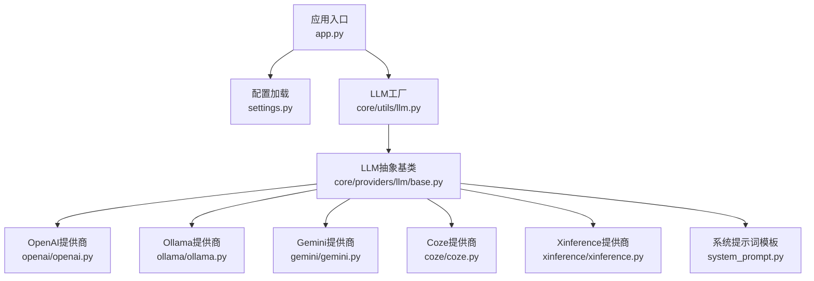
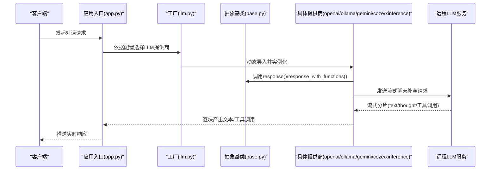
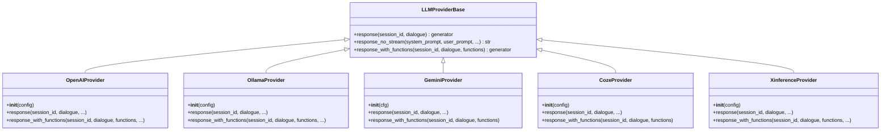
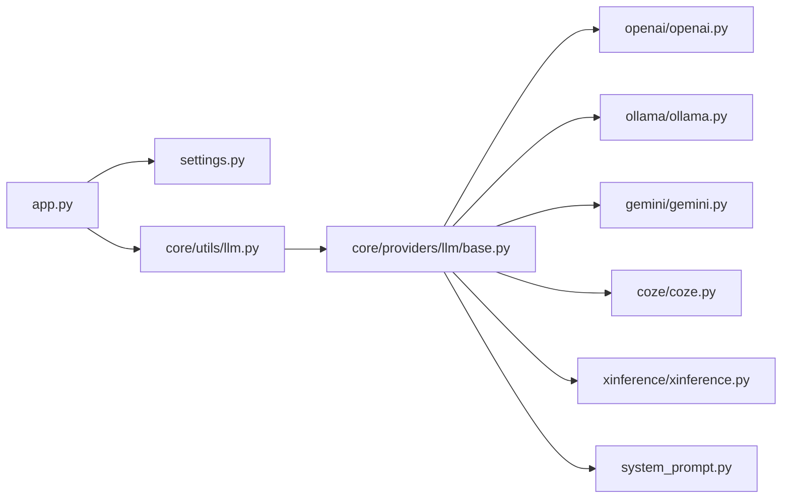

# 大语言模型集成

<cite>
**本文引用的文件**
- [app.py](file://main/xiaozhi-server/app.py)
- [settings.py](file://main/xiaozhi-server/config/settings.py)
- [llm.py](file://main/xiaozhi-server/core/utils/llm.py)
- [base.py](file://main/xiaozhi-server/core/providers/llm/base.py)
- [system_prompt.py](file://main/xiaozhi-server/core/providers/llm/system_prompt.py)
- [openai.py](file://main/xiaozhi-server/core/providers/llm/openai/openai.py)
- [ollama.py](file://main/xiaozhi-server/core/providers/llm/ollama/ollama.py)
- [gemini.py](file://main/xiaozhi-server/core/providers/llm/gemini/gemini.py)
- [coze.py](file://main/xiaozhi-server/core/providers/llm/coze/coze.py)
- [xinference.py](file://main/xiaozhi-server/core/providers/llm/xinference/xinference.py)
</cite>

## 目录
1. [简介](#简介)
2. [项目结构](#项目结构)
3. [核心组件](#核心组件)
4. [架构总览](#架构总览)
5. [组件详解](#组件详解)
6. [依赖关系分析](#依赖关系分析)
7. [性能考量](#性能考量)
8. [故障排查指南](#故障排查指南)
9. [结论](#结论)
10. [附录](#附录)

## 简介
本文件面向小智ESP32服务器的大语言模型（LLM）集成，系统性梳理多平台LLM提供商的架构设计与实现要点，覆盖OpenAI、Ollama、Xinference、Coze、Gemini等服务的对接方式与配置策略；对比本地推理与云端推理在模型部署、资源管理与性能优化方面的差异；总结系统提示词（System Prompt）的设计原则与最佳实践；阐明LLM调用的上下文管理、对话历史维护与多轮对话处理机制；并提供API调用示例、错误处理策略与成本优化方案。

## 项目结构
小智ESP32服务器后端采用模块化组织，LLM相关能力集中在“core/providers/llm”目录下，通过统一抽象基类与工厂工具实现多提供商适配。应用入口负责加载配置、启动网络服务与生命周期管理。

图示来源
- [app.py:1-160](file://main/xiaozhi-server/app.py#L1-L160)
- [settings.py:1-34](file://main/xiaozhi-server/config/settings.py#L1-L34)
- [llm.py:1-24](file://main/xiaozhi-server/core/utils/llm.py#L1-L24)
- [base.py:1-35](file://main/xiaozhi-server/core/providers/llm/base.py#L1-L35)
- [openai.py:1-179](file://main/xiaozhi-server/core/providers/llm/openai/openai.py#L1-L179)
- [ollama.py:1-172](file://main/xiaozhi-server/core/providers/llm/ollama/ollama.py#L1-L172)
- [gemini.py:1-214](file://main/xiaozhi-server/core/providers/llm/gemini/gemini.py#L1-L214)
- [coze.py:1-76](file://main/xiaozhi-server/core/providers/llm/coze/coze.py#L1-L76)
- [xinference.py:1-89](file://main/xiaozhi-server/core/providers/llm/xinference/xinference.py#L1-L89)
- [system_prompt.py:1-103](file://main/xiaozhi-server/core/providers/llm/system_prompt.py#L1-L103)

章节来源
- [app.py:1-160](file://main/xiaozhi-server/app.py#L1-L160)
- [settings.py:1-34](file://main/xiaozhi-server/config/settings.py#L1-L34)

## 核心组件
- 抽象基类：定义统一的响应接口与默认实现（非流式响应、函数调用包装），确保各提供商遵循一致的调用契约。
- 工厂工具：按配置动态导入并实例化指定LLM提供商类，屏蔽路径差异。
- 提示词模板：为函数调用场景生成标准化的系统提示，明确工具调用格式与流程。
- 具体提供商：分别封装OpenAI、Ollama、Gemini、Coze、Xinference的客户端初始化、请求参数构造、流式分片解析与工具调用返回。

章节来源
- [base.py:1-35](file://main/xiaozhi-server/core/providers/llm/base.py#L1-L35)
- [llm.py:1-24](file://main/xiaozhi-server/core/utils/llm.py#L1-L24)
- [system_prompt.py:1-103](file://main/xiaozhi-server/core/providers/llm/system_prompt.py#L1-L103)

## 架构总览
整体架构以“统一抽象 + 多提供商适配 + 工厂动态加载”为核心，结合系统提示词模板与上下文管理，支撑本地与云端两种推理路径。

图示来源
- [app.py:1-160](file://main/xiaozhi-server/app.py#L1-L160)
- [llm.py:1-24](file://main/xiaozhi-server/core/utils/llm.py#L1-L24)
- [base.py:1-35](file://main/xiaozhi-server/core/providers/llm/base.py#L1-L35)
- [openai.py:1-179](file://main/xiaozhi-server/core/providers/llm/openai/openai.py#L1-L179)
- [ollama.py:1-172](file://main/xiaozhi-server/core/providers/llm/ollama/ollama.py#L1-L172)
- [gemini.py:1-214](file://main/xiaozhi-server/core/providers/llm/gemini/gemini.py#L1-L214)
- [coze.py:1-76](file://main/xiaozhi-server/core/providers/llm/coze/coze.py#L1-L76)
- [xinference.py:1-89](file://main/xiaozhi-server/core/providers/llm/xinference/xinference.py#L1-L89)

## 组件详解

### 抽象基类与工厂
- 抽象基类定义了统一的响应接口与默认实现，便于在不支持函数调用的提供商上进行兼容处理。
- 工厂工具通过动态导入路径与模块名，按配置实例化对应提供商类，提升扩展性与可维护性。

图示来源
- [base.py:1-35](file://main/xiaozhi-server/core/providers/llm/base.py#L1-L35)
- [openai.py:1-179](file://main/xiaozhi-server/core/providers/llm/openai/openai.py#L1-L179)
- [ollama.py:1-172](file://main/xiaozhi-server/core/providers/llm/ollama/ollama.py#L1-L172)
- [gemini.py:1-214](file://main/xiaozhi-server/core/providers/llm/gemini/gemini.py#L1-L214)
- [coze.py:1-76](file://main/xiaozhi-server/core/providers/llm/coze/coze.py#L1-L76)
- [xinference.py:1-89](file://main/xiaozhi-server/core/providers/llm/xinference/xinference.py#L1-L89)

章节来源
- [base.py:1-35](file://main/xiaozhi-server/core/providers/llm/base.py#L1-L35)
- [llm.py:1-24](file://main/xiaozhi-server/core/utils/llm.py#L1-L24)

### OpenAI提供商
- 支持细粒度超时配置、可选参数归一化、自动禁用“思考模式”的域名白名单策略。
- 流式响应中对<think>标签进行过滤，保障输出整洁；函数调用模式下同时产出文本与工具调用分片。
- 提供response_no_stream与response_with_functions的完整实现。

章节来源
- [openai.py:1-179](file://main/xiaozhi-server/core/providers/llm/openai/openai.py#L1-L179)

### Ollama提供商
- 通过OpenAI兼容层对接Ollama，自动补齐/v1路径；针对qwen3模型在用户消息前注入/no_think指令。
- 自主缓冲与标签剔除逻辑，保证<think>标记不泄露到最终输出；函数调用模式下区分文本与工具调用分片。

章节来源
- [ollama.py:1-172](file://main/xiaozhi-server/core/providers/llm/ollama/ollama.py#L1-L172)

### Gemini提供商
- 支持HTTP/HTTPS代理连通性检测与环境变量设置，必要时复用HTTP代理作为HTTPS代理。
- 对话内容映射至Google Generative AI SDK的数据结构；函数调用通过function_call字段识别并转换为统一格式。
- 提供安全关闭流的方法，降低配额与资源占用。

章节来源
- [gemini.py:1-214](file://main/xiaozhi-server/core/providers/llm/gemini/gemini.py#L1-L214)

### Coze提供商
- 通过会话ID维护conversation_id映射，首次调用创建对话；后续复用同一会话。
- 函数调用模式下，首次调用时将工具描述拼接到用户消息前，形成系统提示词风格的引导；工具结果回填至用户消息以驱动多轮迭代。

章节来源
- [coze.py:1-76](file://main/xiaozhi-server/core/providers/llm/coze/coze.py#L1-L76)
- [system_prompt.py:1-103](file://main/xiaozhi-server/core/providers/llm/system_prompt.py#L1-L103)

### Xinference提供商
- 通过OpenAI兼容层对接Xinference，自动补齐/v1路径；与Ollama类似，对<think>标签进行过滤。
- 函数调用模式下，区分文本与工具调用分片并逐块产出。

章节来源
- [xinference.py:1-89](file://main/xiaozhi-server/core/providers/llm/xinference/xinference.py#L1-L89)

### 系统提示词（System Prompt）设计
- 明确工具调用格式与JSON风格标签，要求每次仅调用一个工具，步骤间基于上次结果迭代推进。
- 规定工具调用前后置条件与等待用户确认的流程，强调逐步验证与错误反馈。
- 通过模板函数将可用工具列表注入系统提示，确保模型在函数调用场景具备上下文。

章节来源
- [system_prompt.py:1-103](file://main/xiaozhi-server/core/providers/llm/system_prompt.py#L1-L103)

### 上下文管理与多轮对话
- OpenAI/Ollama/Xinference：以消息数组形式传递上下文，模型侧维护会话状态。
- Gemini：无需显式session_id，直接拼接对话内容；SDK内部管理生成状态。
- Coze：以session_id映射conversation_id，首次调用创建会话，后续复用；工具结果回填至用户消息以驱动下一步。

章节来源
- [openai.py:1-179](file://main/xiaozhi-server/core/providers/llm/openai/openai.py#L1-L179)
- [ollama.py:1-172](file://main/xiaozhi-server/core/providers/llm/ollama/ollama.py#L1-L172)
- [gemini.py:1-214](file://main/xiaozhi-server/core/providers/llm/gemini/gemini.py#L1-L214)
- [coze.py:1-76](file://main/xiaozhi-server/core/providers/llm/coze/coze.py#L1-L76)

## 依赖关系分析
- 应用入口依赖配置加载与网络服务；配置加载模块负责校验配置文件存在性与来源。
- LLM工厂依赖提供商目录结构与模块命名约定，动态导入对应实现。
- 各提供商均继承自统一抽象基类，遵循相同的响应接口与函数调用包装策略。

图示来源
- [app.py:1-160](file://main/xiaozhi-server/app.py#L1-L160)
- [settings.py:1-34](file://main/xiaozhi-server/config/settings.py#L1-L34)
- [llm.py:1-24](file://main/xiaozhi-server/core/utils/llm.py#L1-L24)
- [base.py:1-35](file://main/xiaozhi-server/core/providers/llm/base.py#L1-L35)
- [openai.py:1-179](file://main/xiaozhi-server/core/providers/llm/openai/openai.py#L1-L179)
- [ollama.py:1-172](file://main/xiaozhi-server/core/providers/llm/ollama/ollama.py#L1-L172)
- [gemini.py:1-214](file://main/xiaozhi-server/core/providers/llm/gemini/gemini.py#L1-L214)
- [coze.py:1-76](file://main/xiaozhi-server/core/providers/llm/coze/coze.py#L1-L76)
- [xinference.py:1-89](file://main/xiaozhi-server/core/providers/llm/xinference/xinference.py#L1-L89)
- [system_prompt.py:1-103](file://main/xiaozhi-server/core/providers/llm/system_prompt.py#L1-L103)

章节来源
- [app.py:1-160](file://main/xiaozhi-server/app.py#L1-L160)
- [settings.py:1-34](file://main/xiaozhi-server/config/settings.py#L1-L34)
- [llm.py:1-24](file://main/xiaozhi-server/core/utils/llm.py#L1-L24)

## 性能考量
- 本地推理（Ollama/Xinference）优势
  - 低延迟、可控带宽、隐私性强；适合边缘设备或内网部署。
  - 注意模型大小与显存/CPU占用，合理设置max_tokens与温度参数，避免长上下文导致内存压力。
- 云端推理（OpenAI/Gemini/Coze）优势
  - 稳定的吞吐与扩展性；适合高并发与复杂任务。
  - 关注网络抖动与超时配置，适当增大读超时；对函数调用频繁的场景，建议合并工具调用次数以降低往返开销。
- 通用优化
  - 流式输出：优先使用流式接口，尽早感知首字节时间（TTFT）。
  - 缓冲与标签剔除：对<think>等中间标记进行过滤，减少无效输出。
  - 代理与超时：Gemini场景建议启用代理连通性检测与环境变量设置；统一设置合理的连接/读取超时。
  - 日志与监控：记录Token消耗与错误码，辅助成本与质量评估。

## 故障排查指南
- 配置文件问题
  - 若未找到配置文件或混用不同来源配置，将触发异常提示；请按指引将API配置复制到data/.config.yaml并正确填写接口地址与密钥。
- 认证与密钥
  - 各提供商在初始化时会校验模型密钥；若为空或无效，日志会记录错误信息；请检查配置项并重新生成密钥。
- 代理与网络
  - Gemini代理不可用时会抛出运行时错误；请检查HTTP/HTTPS代理连通性，必要时复用HTTP代理作为HTTPS代理。
- 流式处理
  - 若出现分片解析异常，日志会记录错误；请检查模型返回格式与<think>标签处理逻辑。
- 会话与上下文
  - Coze需维护session_id到conversation_id的映射；首次调用会创建新会话，后续复用；若出现会话错乱，检查会话映射表更新逻辑。

章节来源
- [settings.py:1-34](file://main/xiaozhi-server/config/settings.py#L1-L34)
- [gemini.py:1-214](file://main/xiaozhi-server/core/providers/llm/gemini/gemini.py#L1-L214)
- [coze.py:1-76](file://main/xiaozhi-server/core/providers/llm/coze/coze.py#L1-L76)

## 结论
本集成方案通过统一抽象与工厂机制，实现了对OpenAI、Ollama、Xinference、Coze、Gemini等多提供商的无缝适配。配合系统提示词模板与上下文管理策略，既能满足本地推理的低延迟与隐私需求，也能发挥云端推理的稳定性与扩展性。建议在实际部署中结合业务场景选择合适的提供商与参数配置，并持续监控Token消耗与响应质量，以实现性能与成本的平衡。

## 附录
- API调用示例（路径参考）
  - OpenAI：[openai.py:91-136](file://main/xiaozhi-server/core/providers/llm/openai/openai.py#L91-L136)
  - Ollama：[ollama.py:27-93](file://main/xiaozhi-server/core/providers/llm/ollama/ollama.py#L27-L93)
  - Gemini：[gemini.py:128-203](file://main/xiaozhi-server/core/providers/llm/gemini/gemini.py#L128-L203)
  - Coze：[coze.py:30-76](file://main/xiaozhi-server/core/providers/llm/coze/coze.py#L30-L76)
  - Xinference：[xinference.py:33-89](file://main/xiaozhi-server/core/providers/llm/xinference/xinference.py#L33-L89)
- 错误处理策略
  - OpenAI：捕获分片解析异常并关闭流；记录Token消耗。
  - Ollama/Xinference：缓冲与标签剔除，异常时记录错误并继续处理后续分片。
  - Gemini：代理不可用时抛出运行时错误；提供安全关闭流的方法。
  - Coze：首次调用创建会话；工具结果回填至用户消息以驱动多轮。
- 成本优化方案
  - 控制上下文长度与max_tokens；合并工具调用减少往返；启用流式输出降低等待时间；合理设置温度与top_p以减少无效输出。