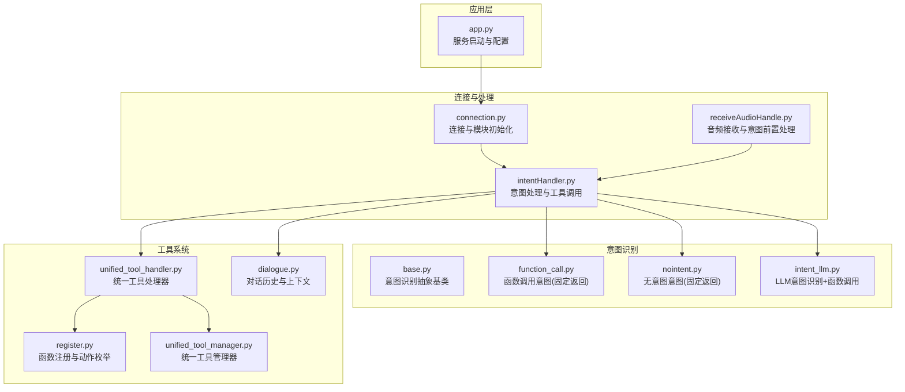
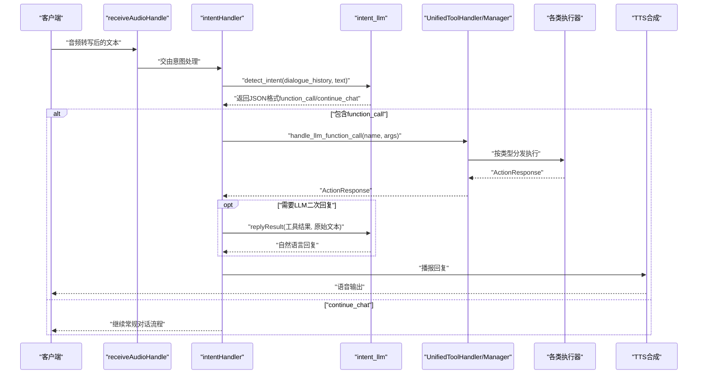
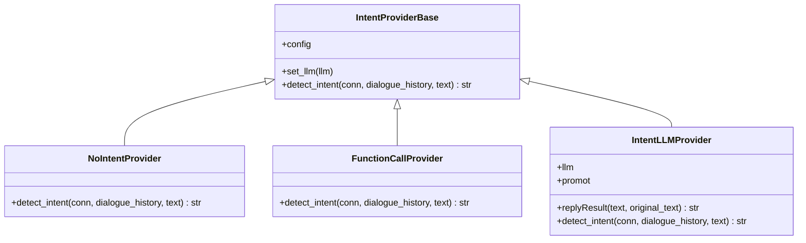
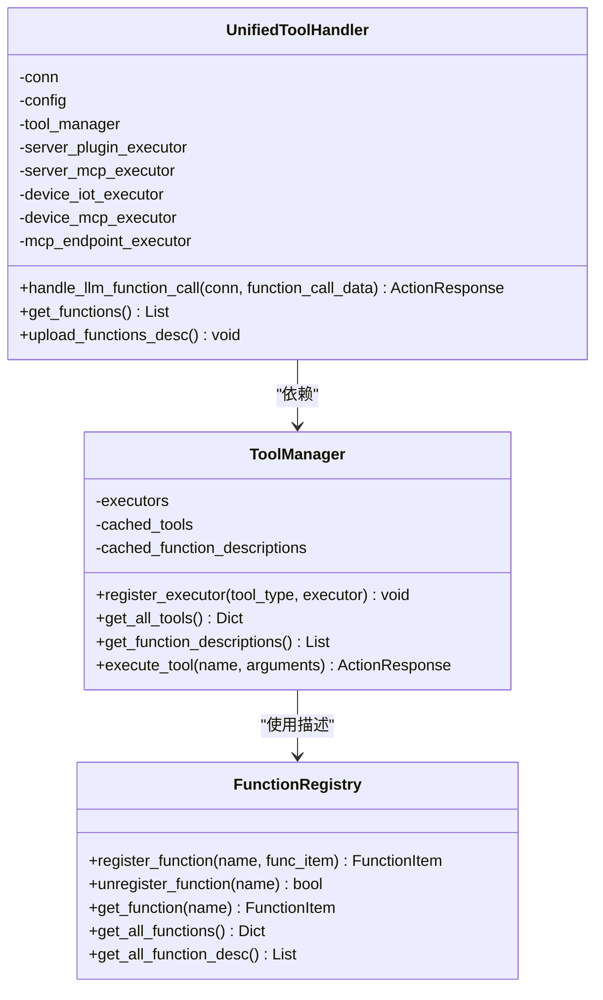
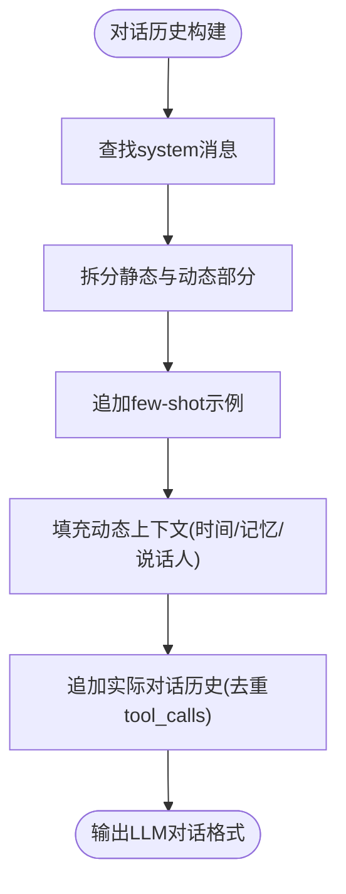
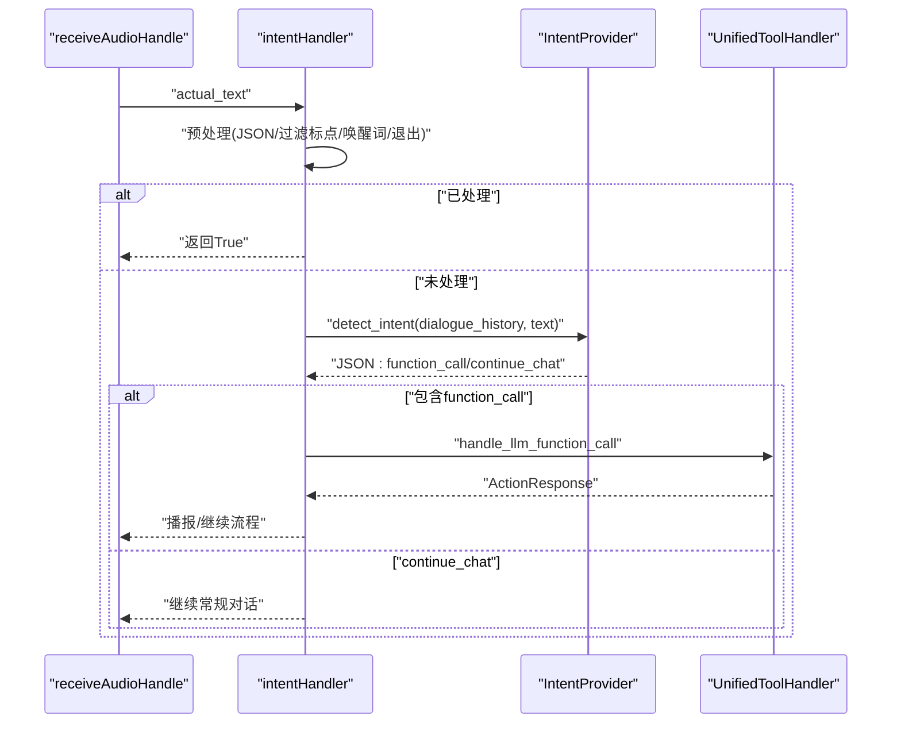
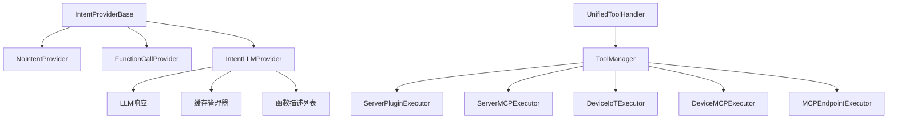

# 意图识别系统

<cite>
**本文引用的文件**
- [app.py](file://main/xiaozhi-server/app.py)
- [connection.py](file://main/xiaozhi-server/core/connection.py)
- [intentHandler.py](file://main/xiaozhi-server/core/handle/intentHandler.py)
- [receiveAudioHandle.py](file://main/xiaozhi-server/core/handle/receiveAudioHandle.py)
- [base.py](file://main/xiaozhi-server/core/providers/intent/base.py)
- [function_call.py](file://main/xiaozhi-server/core/providers/intent/function_call/function_call.py)
- [nointent.py](file://main/xiaozhi-server/core/providers/intent/nointent/nointent.py)
- [intent_llm.py](file://main/xiaozhi-server/core/providers/intent/intent_llm/intent_llm.py)
- [register.py](file://main/xiaozhi-server/plugins_func/register.py)
- [unified_tool_handler.py](file://main/xiaozhi-server/core/providers/tools/unified_tool_handler.py)
- [unified_tool_manager.py](file://main/xiaozhi-server/core/providers/tools/unified_tool_manager.py)
- [dialogue.py](file://main/xiaozhi-server/core/utils/dialogue.py)
- [settings.py](file://main/xiaozhi-server/config/settings.py)
- [global-tool-manager.md](file://main/xiaozhi-server/docs/refactor/global-tool-manager.md)
- [README_en.md](file://README_en.md)
</cite>

## 目录
1. [简介](#简介)
2. [项目结构](#项目结构)
3. [核心组件](#核心组件)
4. [架构总览](#架构总览)
5. [详细组件分析](#详细组件分析)
6. [依赖分析](#依赖分析)
7. [性能考虑](#性能考虑)
8. [故障排查指南](#故障排查指南)
9. [结论](#结论)
10. [附录](#附录)

## 简介
本文件面向小智ESP32服务器的“意图识别系统”，提供从架构设计到实现细节的完整技术文档。系统采用多层次意图识别策略：无意图识别（nointent）、基于LLM的意图识别（intent_llm）以及函数调用意图识别（function_call）。系统通过统一工具管理器对接多种工具来源（服务端插件、MCP客户端、IoT设备、MCP接入点等），实现从“意图识别—参数提取—工具调用—结果反馈”的闭环。

## 项目结构
围绕意图识别与工具调用的关键目录与文件如下：
- 应用入口与服务启动：app.py
- 连接与模块初始化：connection.py
- 意图处理流程：intentHandler.py、receiveAudioHandle.py
- 意图识别提供者基类与实现：base.py、function_call.py、nointent.py、intent_llm.py
- 工具注册与统一调用：register.py、unified_tool_handler.py、unified_tool_manager.py
- 对话历史与上下文：dialogue.py
- 配置与设置：settings.py
- 工具管理重构方案：global-tool-manager.md
- 平台说明与意图类型：README_en.md

图表来源
- [app.py:46-160](file://main/xiaozhi-server/app.py#L46-L160)
- [connection.py:887-900](file://main/xiaozhi-server/core/connection.py#L887-L900)
- [intentHandler.py:20-236](file://main/xiaozhi-server/core/handle/intentHandler.py#L20-L236)
- [receiveAudioHandle.py:79-96](file://main/xiaozhi-server/core/handle/receiveAudioHandle.py#L79-L96)
- [base.py:9-34](file://main/xiaozhi-server/core/providers/intent/base.py#L9-L34)
- [function_call.py:9-23](file://main/xiaozhi-server/core/providers/intent/function_call/function_call.py#L9-L23)
- [nointent.py:9-23](file://main/xiaozhi-server/core/providers/intent/nointent/nointent.py#L9-L23)
- [intent_llm.py:20-287](file://main/xiaozhi-server/core/providers/intent/intent_llm/intent_llm.py#L20-L287)
- [register.py:1-142](file://main/xiaozhi-server/plugins_func/register.py#L1-L142)
- [unified_tool_handler.py:19-243](file://main/xiaozhi-server/core/providers/tools/unified_tool_handler.py#L19-L243)
- [unified_tool_manager.py:9-125](file://main/xiaozhi-server/core/providers/tools/unified_tool_manager.py#L9-L125)
- [dialogue.py:25-174](file://main/xiaozhi-server/core/utils/dialogue.py#L25-L174)

章节来源
- [app.py:46-160](file://main/xiaozhi-server/app.py#L46-L160)
- [connection.py:887-900](file://main/xiaozhi-server/core/connection.py#L887-L900)

## 核心组件
- 意图识别抽象基类：定义detect_intent接口与LLM注入能力，约束各实现的一致行为。
- 无意图识别（nointent）：始终返回“继续聊天”意图，适用于无需意图识别的场景。
- 函数调用意图识别（function_call）：始终返回“继续聊天”，但允许LLM通过function calling完成意图；常与intent_llm配合使用。
- LLM意图识别（intent_llm）：动态生成系统提示词，结合函数描述与对话历史，输出标准化JSON格式的function_call或continue_chat/result_for_context。
- 统一工具处理器与管理器：负责工具注册、执行器分发、参数解析与结果合并，支撑意图识别后的工具调用闭环。
- 对话历史与上下文：维护Message与Dialogue，保证LLM输入的结构化与完整性，支持few-shot与动态上下文注入。

章节来源
- [base.py:9-34](file://main/xiaozhi-server/core/providers/intent/base.py#L9-L34)
- [nointent.py:9-23](file://main/xiaozhi-server/core/providers/intent/nointent/nointent.py#L9-L23)
- [function_call.py:9-23](file://main/xiaozhi-server/core/providers/intent/function_call/function_call.py#L9-L23)
- [intent_llm.py:20-287](file://main/xiaozhi-server/core/providers/intent/intent_llm/intent_llm.py#L20-L287)
- [unified_tool_handler.py:19-243](file://main/xiaozhi-server/core/providers/tools/unified_tool_handler.py#L19-L243)
- [unified_tool_manager.py:9-125](file://main/xiaozhi-server/core/providers/tools/unified_tool_manager.py#L9-L125)
- [dialogue.py:25-174](file://main/xiaozhi-server/core/utils/dialogue.py#L25-L174)

## 架构总览
系统以“音频输入—意图识别—工具调用—语音输出”为主线，结合对话历史与上下文，形成稳定的多轮交互闭环。LLM意图识别模块负责将自然语言转化为标准化的function_call结构；统一工具处理器根据工具类型路由到对应执行器；工具执行完成后，根据动作类型决定是否再次请求LLM生成回复。

图表来源
- [receiveAudioHandle.py:79-96](file://main/xiaozhi-server/core/handle/receiveAudioHandle.py#L79-L96)
- [intentHandler.py:66-214](file://main/xiaozhi-server/core/handle/intentHandler.py#L66-L214)
- [intent_llm.py:135-287](file://main/xiaozhi-server/core/providers/intent/intent_llm/intent_llm.py#L135-L287)
- [unified_tool_handler.py:139-184](file://main/xiaozhi-server/core/providers/tools/unified_tool_handler.py#L139-L184)
- [unified_tool_manager.py:73-102](file://main/xiaozhi-server/core/providers/tools/unified_tool_manager.py#L73-L102)

## 详细组件分析

### 意图识别提供者基类与实现
- 抽象基类IntentProviderBase：定义detect_intent接口，支持注入LLM实例并记录模型信息。
- 无意图识别（nointent）：固定返回“继续聊天”，适合无需意图识别的场景。
- 函数调用意图识别（function_call）：固定返回“继续聊天”，但允许LLM通过function calling完成意图；常与intent_llm配合。
- LLM意图识别（intent_llm）：动态生成系统提示词，整合函数描述、音乐与HomeAssistant设备信息、对话历史，输出标准化JSON；包含缓存、性能日志与错误兜底。

图表来源
- [base.py:9-34](file://main/xiaozhi-server/core/providers/intent/base.py#L9-L34)
- [nointent.py:9-23](file://main/xiaozhi-server/core/providers/intent/nointent/nointent.py#L9-L23)
- [function_call.py:9-23](file://main/xiaozhi-server/core/providers/intent/function_call/function_call.py#L9-L23)
- [intent_llm.py:20-287](file://main/xiaozhi-server/core/providers/intent/intent_llm/intent_llm.py#L20-L287)

章节来源
- [base.py:9-34](file://main/xiaozhi-server/core/providers/intent/base.py#L9-L34)
- [nointent.py:9-23](file://main/xiaozhi-server/core/providers/intent/nointent/nointent.py#L9-L23)
- [function_call.py:9-23](file://main/xiaozhi-server/core/providers/intent/function_call/function_call.py#L9-L23)
- [intent_llm.py:20-287](file://main/xiaozhi-server/core/providers/intent/intent_llm/intent_llm.py#L20-L287)

### 统一工具管理与执行
- 统一工具处理器（UnifiedToolHandler）：负责初始化各类执行器（服务端插件、MCP、IoT、MCP接入点），注册工具描述，处理单/多函数调用，合并响应。
- 统一工具管理器（ToolManager）：集中管理工具定义与执行器映射，提供工具查询、类型判定与执行。
- 函数注册与动作枚举（register.py）：定义工具类型、动作类型与返回封装，便于统一处理工具调用结果。

图表来源
- [unified_tool_handler.py:19-243](file://main/xiaozhi-server/core/providers/tools/unified_tool_handler.py#L19-L243)
- [unified_tool_manager.py:9-125](file://main/xiaozhi-server/core/providers/tools/unified_tool_manager.py#L9-L125)
- [register.py:104-142](file://main/xiaozhi-server/plugins_func/register.py#L104-L142)

章节来源
- [unified_tool_handler.py:19-243](file://main/xiaozhi-server/core/providers/tools/unified_tool_handler.py#L19-L243)
- [unified_tool_manager.py:9-125](file://main/xiaozhi-server/core/providers/tools/unified_tool_manager.py#L9-L125)
- [register.py:1-142](file://main/xiaozhi-server/plugins_func/register.py#L1-L142)

### 对话历史与上下文
- Message：封装角色、内容、工具调用ID等字段。
- Dialogue：提供对话历史的结构化输出，支持few-shot补全、动态上下文注入（时间、记忆、说话人信息）与system消息拆分。

图表来源
- [dialogue.py:94-174](file://main/xiaozhi-server/core/utils/dialogue.py#L94-L174)

章节来源
- [dialogue.py:25-174](file://main/xiaozhi-server/core/utils/dialogue.py#L25-L174)

### 音频输入与意图前置处理
- 接收音频处理（receiveAudioHandle）：在进入意图识别前，对打断、播放状态进行处理，并将原始文本交由意图处理流程。
- 意图处理（intentHandler）：预处理JSON格式输入、检查退出命令与唤醒词、调用LLM进行意图识别、解析function_call并执行工具调用。

图表来源
- [receiveAudioHandle.py:79-96](file://main/xiaozhi-server/core/handle/receiveAudioHandle.py#L79-L96)
- [intentHandler.py:20-214](file://main/xiaozhi-server/core/handle/intentHandler.py#L20-L214)
- [intent_llm.py:135-287](file://main/xiaozhi-server/core/providers/intent/intent_llm/intent_llm.py#L135-L287)
- [unified_tool_handler.py:139-184](file://main/xiaozhi-server/core/providers/tools/unified_tool_handler.py#L139-L184)

章节来源
- [receiveAudioHandle.py:79-96](file://main/xiaozhi-server/core/handle/receiveAudioHandle.py#L79-L96)
- [intentHandler.py:20-214](file://main/xiaozhi-server/core/handle/intentHandler.py#L20-L214)

## 依赖分析
- 模块耦合与职责分离：意图识别提供者与工具系统通过统一接口解耦；工具执行器按类型注册，便于扩展。
- 外部依赖与集成点：LLM（用于意图识别与回复生成）、MCP客户端（服务端与设备侧）、HomeAssistant设备列表、缓存系统（意图识别结果缓存）。
- 潜在循环依赖：当前实现通过接口与工厂注入避免循环依赖；工具管理重构文档提出全局工具管理器以减少重复初始化。

图表来源
- [base.py:9-34](file://main/xiaozhi-server/core/providers/intent/base.py#L9-L34)
- [intent_llm.py:20-287](file://main/xiaozhi-server/core/providers/intent/intent_llm/intent_llm.py#L20-L287)
- [unified_tool_handler.py:19-243](file://main/xiaozhi-server/core/providers/tools/unified_tool_handler.py#L19-L243)
- [unified_tool_manager.py:9-125](file://main/xiaozhi-server/core/providers/tools/unified_tool_manager.py#L9-L125)

章节来源
- [global-tool-manager.md:1-1023](file://main/xiaozhi-server/docs/refactor/global-tool-manager.md#L1-L1023)

## 性能考虑
- 缓存策略：LLM意图识别对“设备ID+文本”计算MD5作为缓存键，命中后直接返回，显著降低重复请求成本。
- 日志与计时：记录整体耗时、LLM调用耗时、预处理与后处理耗时，便于定位瓶颈。
- 工具调用超时：统一工具调用设置超时阈值，避免阻塞主线程。
- 对话历史截断：限制最近N条对话历史，平衡上下文质量与性能。
- 全局工具管理器重构：减少重复初始化MCP客户端与执行器，提升并发场景下的资源利用率。

章节来源
- [intent_llm.py:150-159](file://main/xiaozhi-server/core/providers/intent/intent_llm/intent_llm.py#L150-L159)
- [intent_llm.py:206-236](file://main/xiaozhi-server/core/providers/intent/intent_llm/intent_llm.py#L206-L236)
- [intentHandler.py:160-170](file://main/xiaozhi-server/core/handle/intentHandler.py#L160-L170)
- [intent_llm.py:190-199](file://main/xiaozhi-server/core/providers/intent/intent_llm/intent_llm.py#L190-L199)
- [global-tool-manager.md:18-46](file://main/xiaozhi-server/docs/refactor/global-tool-manager.md#L18-L46)

## 故障排查指南
- 意图识别失败：检查LLM是否正确注入、缓存是否异常、返回JSON格式是否符合要求。
- 工具调用超时或失败：查看工具类型与参数解析、执行器初始化状态、MCP接入点连通性。
- 对话历史异常：确认few-shot与实际历史的去重逻辑、tool_calls配对完整性。
- 配置问题：核对配置文件路径与读取逻辑，确保Intent与LLM模块正确选择。

章节来源
- [intentHandler.py:77-80](file://main/xiaozhi-server/core/handle/intentHandler.py#L77-L80)
- [unified_tool_handler.py:178-184](file://main/xiaozhi-server/core/providers/tools/unified_tool_handler.py#L178-L184)
- [dialogue.py:64-92](file://main/xiaozhi-server/core/utils/dialogue.py#L64-L92)
- [settings.py:9-34](file://main/xiaozhi-server/config/settings.py#L9-L34)

## 结论
小智ESP32服务器的意图识别系统通过“抽象基类+多实现+统一工具管理”的架构，实现了从自然语言到函数调用的稳定闭环。LLM意图识别模块承担语义理解与函数选择，工具系统提供灵活的执行器扩展，对话历史与上下文保障多轮一致性。未来可通过全局工具管理器进一步优化资源占用与并发性能。

## 附录

### 意图识别类型与平台说明
- 无意图识别（nointent）：免费，不执行意图识别，直接返回对话结果。
- 函数调用意图识别（function_call）：通过LLM function calling完成意图，速度快、效果好。
- LLM意图识别（intent_llm）：通过大模型识别意图并返回标准化JSON，通用性强。

章节来源
- [README_en.md:338-355](file://README_en.md#L338-L355)