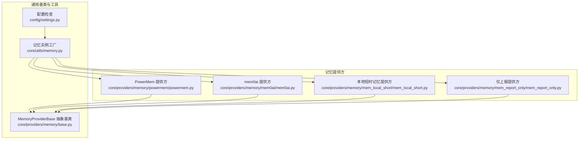
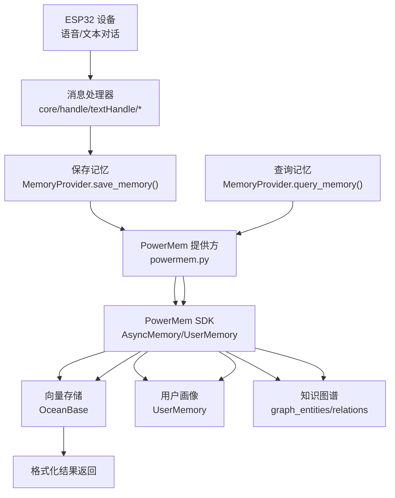
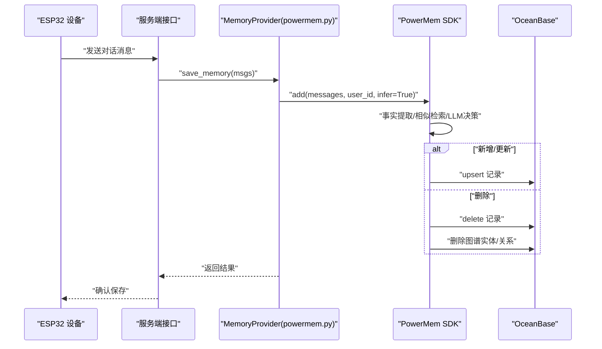
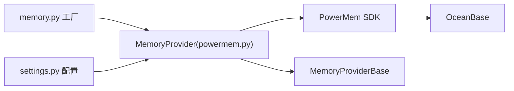

# 智能记忆系统

<cite>
**本文引用的文件**
- [PowerMem-1.1.0-Analysis.md](file://main/xiaozhi-server/docs/powermem/PowerMem-1.1.0-Analysis.md)
- [PowerMem-记忆处理原理详解.md](file://main/xiaozhi-server/docs/powermem/PowerMem-记忆处理原理详解.md)
- [PowerMemory-Intelligent-Processing-Flow.md](file://main/xiaozhi-server/docs/powermem/PowerMemory-Intelligent-Processing-Flow.md)
- [PowerMem-SQL生成原理详解.md](file://main/xiaozhi-server/docs/powermem/PowerMem-SQL生成原理详解.md)
- [PowerMem-Issues.md](file://main/xiaozhi-server/docs/powermem/PowerMem-Issues.md)
- [PowerMem-Metadata-Fields.md](file://main/xiaozhi-server/docs/powermem/PowerMem-Metadata-Fields.md)
- [powermem.py](file://main/xiaozhi-server/core/providers/memory/powermem/powermem.py)
- [base.py](file://main/xiaozhi-server/core/providers/memory/base.py)
- [memory.py](file://main/xiaozhi-server/core/utils/memory.py)
- [settings.py](file://main/xiaozhi-server/config/settings.py)
- [mem0ai.py](file://main/xiaozhi-server/core/providers/memory/mem0ai/mem0ai.py)
- [mem_local_short.py](file://main/xiaozhi-server/core/providers/memory/mem_local_short/mem_local_short.py)
- [mem_report_only.py](file://main/xiaozhi-server/core/providers/memory/mem_report_only/mem_report_only.py)
</cite>

## 目录
1. [简介](#简介)
2. [项目结构](#项目结构)
3. [核心组件](#核心组件)
4. [架构总览](#架构总览)
5. [详细组件分析](#详细组件分析)
6. [依赖分析](#依赖分析)
7. [性能考量](#性能考量)
8. [故障排查指南](#故障排查指南)
9. [结论](#结论)
10. [附录](#附录)

## 简介
本技术文档围绕小智ESP32服务器的智能记忆系统展开，重点阐述PowerMem智能记忆系统的核心架构与实现原理，涵盖记忆存储结构、检索算法与更新机制；对比不同记忆提供商（mem0ai、本地短时记忆、仅上报记忆、VolMem0等）的技术特性；说明记忆生命周期管理（创建、查询、更新、删除）；解释记忆分类体系、标签与语义检索能力；给出配置参数、性能优化与故障恢复机制，并提供API使用示例、最佳实践与常见问题解决方案。

## 项目结构
小智ESP32服务器采用模块化架构，记忆系统位于核心模块之下，通过统一的MemoryProviderBase抽象接口对接多种记忆提供商。PowerMem作为主要的记忆提供方，集成在内存管理与对话处理流程中，负责将用户对话转化为可检索的记忆，并支持用户画像抽取与知识图谱构建。

图表来源
- [powermem.py:23-176](file://main/xiaozhi-server/core/providers/memory/powermem/powermem.py#L23-L176)
- [mem0ai.py:11-31](file://main/xiaozhi-server/core/providers/memory/mem0ai/mem0ai.py#L11-L31)
- [mem_local_short.py:98-104](file://main/xiaozhi-server/core/providers/memory/mem_local_short/mem_local_short.py#L98-L104)
- [mem_report_only.py:10-20](file://main/xiaozhi-server/core/providers/memory/mem_report_only/mem_report_only.py#L10-L20)
- [base.py:8-29](file://main/xiaozhi-server/core/providers/memory/base.py#L8-L29)
- [memory.py:9-19](file://main/xiaozhi-server/core/utils/memory.py#L9-L19)
- [settings.py:9-34](file://main/xiaozhi-server/config/settings.py#L9-L34)

章节来源
- [powermem.py:1-450](file://main/xiaozhi-server/core/providers/memory/powermem/powermem.py#L1-L450)
- [base.py:1-29](file://main/xiaozhi-server/core/providers/memory/base.py#L1-L29)
- [memory.py:1-19](file://main/xiaozhi-server/core/utils/memory.py#L1-L19)
- [settings.py:1-34](file://main/xiaozhi-server/config/settings.py#L1-L34)

## 核心组件
- PowerMem提供方：封装PowerMem SDK，支持智能模式（infer=True）与简单模式（infer=False），具备事实提取、相似记忆检索、LLM决策与执行（新增/更新/删除）、用户画像抽取与知识图谱同步。
- mem0ai提供方：轻量级云端记忆服务，支持添加与检索，适合快速集成与演示。
- 本地短时记忆提供方：基于本地文件的短期记忆，通过LLM对对话进行摘要与结构化存储，适合隐私敏感或离线场景。
- 仅上报提供方：不进行记忆保存与检索，仅记录日志，适合合规或审计场景。

章节来源
- [powermem.py:177-450](file://main/xiaozhi-server/core/providers/memory/powermem/powermem.py#L177-L450)
- [mem0ai.py:32-117](file://main/xiaozhi-server/core/providers/memory/mem0ai/mem0ai.py#L32-L117)
- [mem_local_short.py:135-202](file://main/xiaozhi-server/core/providers/memory/mem_local_short/mem_local_short.py#L135-L202)
- [mem_report_only.py:14-20](file://main/xiaozhi-server/core/providers/memory/mem_report_only/mem_report_only.py#L14-L20)

## 架构总览
PowerMem在小智ESP32服务器中的位置如下：设备侧产生对话消息，经由服务端的消息处理器与记忆提供方，将对话转化为结构化记忆并持久化至向量数据库（OceanBase），同时可选地抽取用户画像并构建知识图谱。查询时，系统结合用户画像与向量检索结果，返回格式化的相关记忆。

图表来源
- [powermem.py:177-386](file://main/xiaozhi-server/core/providers/memory/powermem/powermem.py#L177-L386)
- [PowerMem-记忆处理原理详解.md:35-200](file://main/xiaozhi-server/docs/powermem/PowerMem-记忆处理原理详解.md#L35-L200)
- [PowerMem-Issues.md:91-175](file://main/xiaozhi-server/docs/powermem/PowerMem-Issues.md#L91-L175)

## 详细组件分析

### PowerMem智能记忆系统
PowerMem通过“智能模式”对对话进行事实提取、相似记忆检索与LLM决策，实现新增、更新、删除与跳过的智能合并；同时支持用户画像抽取与知识图谱同步。其核心流程如下：

图表来源
- [powermem.py:177-281](file://main/xiaozhi-server/core/providers/memory/powermem/powermem.py#L177-L281)
- [PowerMem-记忆处理原理详解.md:35-182](file://main/xiaozhi-server/docs/powermem/PowerMem-记忆处理原理详解.md#L35-L182)
- [PowerMem-SQL生成原理详解.md:9-26](file://main/xiaozhi-server/docs/powermem/PowerMem-SQL生成原理详解.md#L9-L26)

章节来源
- [PowerMem-记忆处理原理详解.md:35-696](file://main/xiaozhi-server/docs/powermem/PowerMem-记忆处理原理详解.md#L35-L696)
- [PowerMemory-Intelligent-Processing-Flow.md:9-346](file://main/xiaozhi-server/docs/powermem/PowerMemory-Intelligent-Processing-Flow.md#L9-L346)
- [PowerMem-SQL生成原理详解.md:1-996](file://main/xiaozhi-server/docs/powermem/PowerMem-SQL生成原理详解.md#L1-L996)
- [PowerMem-Issues.md:1-376](file://main/xiaozhi-server/docs/powermem/PowerMem-Issues.md#L1-L376)

### 记忆生命周期管理
- 创建：调用save_memory，格式化消息后通过PowerMem SDK的add接口写入，智能模式下会进行事实提取与LLM决策。
- 查询：调用query_memory，结合用户画像与向量检索，格式化返回最新记忆。
- 更新：智能模式下对已有记忆进行内容增强与时间信息合并；非智能模式下不更新。
- 删除：智能模式下若检测到矛盾信息，LLM决策删除；也可通过配置禁用智能插件以避免自动清理。

章节来源
- [powermem.py:177-386](file://main/xiaozhi-server/core/providers/memory/powermem/powermem.py#L177-L386)
- [PowerMem-记忆处理原理详解.md:498-631](file://main/xiaozhi-server/docs/powermem/PowerMem-记忆处理原理详解.md#L498-L631)
- [PowerMem-Issues.md:91-301](file://main/xiaozhi-server/docs/powermem/PowerMem-Issues.md#L91-L301)

### 记忆存储结构与检索
- 存储结构：memories（记忆表）、user_profiles（用户画像表）、graph_entities/relations（知识图谱实体与关系）。
- 检索流程：用户画像增强查询、向量检索与全文检索混合、RRF融合评分、格式化输出。
- 元数据：融合信息（_fusion_info）、质量评分（_quality_score）、融合评分（_fusion_score）、统计信息（search_count、last_searched_at）、向量相似度（_vector_similarity）。

章节来源
- [PowerMem-记忆处理原理详解.md:432-531](file://main/xiaozhi-server/docs/powermem/PowerMem-记忆处理原理详解.md#L432-L531)
- [PowerMem-Metadata-Fields.md:1-555](file://main/xiaozhi-server/docs/powermem/PowerMem-Metadata-Fields.md#L1-L555)

### 不同记忆提供商对比
- PowerMem：支持智能模式（事实提取+LLM决策+向量检索+用户画像+知识图谱），适合长期记忆与个性化服务。
- mem0ai：云端记忆服务，接口简洁，适合快速集成与演示。
- 本地短时记忆：基于本地文件与LLM摘要，适合隐私敏感与离线场景。
- 仅上报：不保存与检索记忆，仅记录日志，适合合规或审计场景。

章节来源
- [mem0ai.py:11-117](file://main/xiaozhi-server/core/providers/memory/mem0ai/mem0ai.py#L11-L117)
- [mem_local_short.py:98-202](file://main/xiaozhi-server/core/providers/memory/mem_local_short/mem_local_short.py#L98-L202)
- [mem_report_only.py:10-20](file://main/xiaozhi-server/core/providers/memory/mem_report_only/mem_report_only.py#L10-L20)

### 记忆分类体系、标签与语义检索
- 分类字段：memories表包含category字段，可用于语义分类与过滤。
- 标签管理：可通过metadata中的结构化信息辅助检索与过滤。
- 语义检索：基于向量嵌入与混合检索（向量+全文），支持RRF融合与阈值过滤。

章节来源
- [PowerMem-记忆处理原理详解.md:432-531](file://main/xiaozhi-server/docs/powermem/PowerMem-记忆处理原理详解.md#L432-L531)
- [PowerMem-Metadata-Fields.md:1-555](file://main/xiaozhi-server/docs/powermem/PowerMem-Metadata-Fields.md#L1-L555)

### 配置参数、性能优化与故障恢复
- 配置参数：enable_user_profile、database_provider、llm_provider、embedding_provider、vector_store、intelligent_memory等。
- 性能优化：缓存用户画像、向量嵌入复用、限制候选记忆数量、UPSER技术保证幂等与原子性。
- 故障恢复：SDK Bug修复（graph_store初始化）、缺失字段补齐（enabled、embedding_model_dims）、数据库密码类型修正；智能插件导致的自动清理可通过配置禁用。

章节来源
- [PowerMem-Issues.md:1-376](file://main/xiaozhi-server/docs/powermem/PowerMem-Issues.md#L1-L376)
- [PowerMem-记忆处理原理详解.md:533-631](file://main/xiaozhi-server/docs/powermem/PowerMem-记忆处理原理详解.md#L533-L631)

### API使用示例与最佳实践
- 使用示例：在服务端调用MemoryProvider.save_memory与query_memory，传入消息列表与查询字符串。
- 最佳实践：生产环境建议禁用智能模式以避免误删；启用用户画像模式以提升个性化；合理设置intelligent_memory参数以平衡遗忘与保留。

章节来源
- [powermem.py:177-386](file://main/xiaozhi-server/core/providers/memory/powermem/powermem.py#L177-L386)
- [PowerMem-1.1.0-Analysis.md:128-210](file://main/xiaozhi-server/docs/powermem/PowerMem-1.1.0-Analysis.md#L128-L210)

## 依赖分析
PowerMem提供方依赖于PowerMem SDK与OceanBase向量存储，同时在应用层通过MemoryProviderBase抽象实现统一接口，便于替换与扩展。

图表来源
- [powermem.py:40-176](file://main/xiaozhi-server/core/providers/memory/powermem/powermem.py#L40-L176)
- [base.py:8-29](file://main/xiaozhi-server/core/providers/memory/base.py#L8-L29)
- [memory.py:9-19](file://main/xiaozhi-server/core/utils/memory.py#L9-L19)
- [settings.py:9-34](file://main/xiaozhi-server/config/settings.py#L9-L34)

章节来源
- [powermem.py:1-450](file://main/xiaozhi-server/core/providers/memory/powermem/powermem.py#L1-L450)
- [base.py:1-29](file://main/xiaozhi-server/core/providers/memory/base.py#L1-L29)
- [memory.py:1-19](file://main/xiaozhi-server/core/utils/memory.py#L1-L19)
- [settings.py:1-34](file://main/xiaozhi-server/config/settings.py#L1-L34)

## 性能考量
- 智能模式成本：每次对话触发两次LLM调用（事实提取+记忆决策），延迟较高；适合重要长期记忆。
- 简单模式收益：无LLM调用，延迟低；适合临时对话与性能敏感场景。
- 缓存与复用：用户画像缓存、向量嵌入复用、限制候选记忆数量，显著降低延迟与Token消耗。
- 数据库层面：UPSER原子操作、索引自动维护，保障一致性与查询效率。

章节来源
- [PowerMem-记忆处理原理详解.md:533-631](file://main/xiaozhi-server/docs/powermem/PowerMem-记忆处理原理详解.md#L533-L631)
- [PowerMem-SQL生成原理详解.md:771-800](file://main/xiaozhi-server/docs/powermem/PowerMem-SQL生成原理详解.md#L771-L800)

## 故障排查指南
- 问题1：SDK Bug导致graph_store初始化错误
  - 现象：图谱表未创建，日志显示enable_graph=False
  - 解决：应用层monkey-patch，移除graph_store配置后手动创建MemoryGraph
- 问题2：缺少enabled字段
  - 现象：图谱未启用
  - 解决：在数据库配置中添加"enabled": true
- 问题3：缺少embedding_model_dims
  - 现象：OceanBase图谱存储报错
  - 解决：在graph_store.config中添加embedding_model_dims: 1536
- 问题4：数据库密码类型错误
  - 现象：输入应为字符串
  - 解决：确保密码为字符串类型
- 问题5：对话未挂断时旧记忆被自动删除
  - 现象：第一次查询即触发清理
  - 根因：智能插件基于艾宾浩斯遗忘曲线在查询时自动清理
  - 解决：禁用智能插件或调整遗忘曲线参数

章节来源
- [PowerMem-Issues.md:1-376](file://main/xiaozhi-server/docs/powermem/PowerMem-Issues.md#L1-L376)

## 结论
PowerMem为小智ESP32服务器提供了强大的智能记忆能力，支持事实提取、相似检索、LLM决策与用户画像抽取。在生产环境中，建议根据业务需求选择合适的模式（智能/简单），并通过合理的配置与优化策略平衡性能与准确性。同时，针对SDK已知问题与自动清理行为，应提前做好配置与监控，确保记忆系统的稳定性与可靠性。

## 附录
- 配置文件检查：确保data/.config.yaml存在且配置正确。
- 记忆提供方工厂：通过core/utils/memory.py动态加载指定的记忆提供方实现。
- API调用路径：save_memory与query_memory的具体实现参见各提供方文件。

章节来源
- [settings.py:9-34](file://main/xiaozhi-server/config/settings.py#L9-L34)
- [memory.py:9-19](file://main/xiaozhi-server/core/utils/memory.py#L9-L19)
- [powermem.py:177-386](file://main/xiaozhi-server/core/providers/memory/powermem/powermem.py#L177-L386)