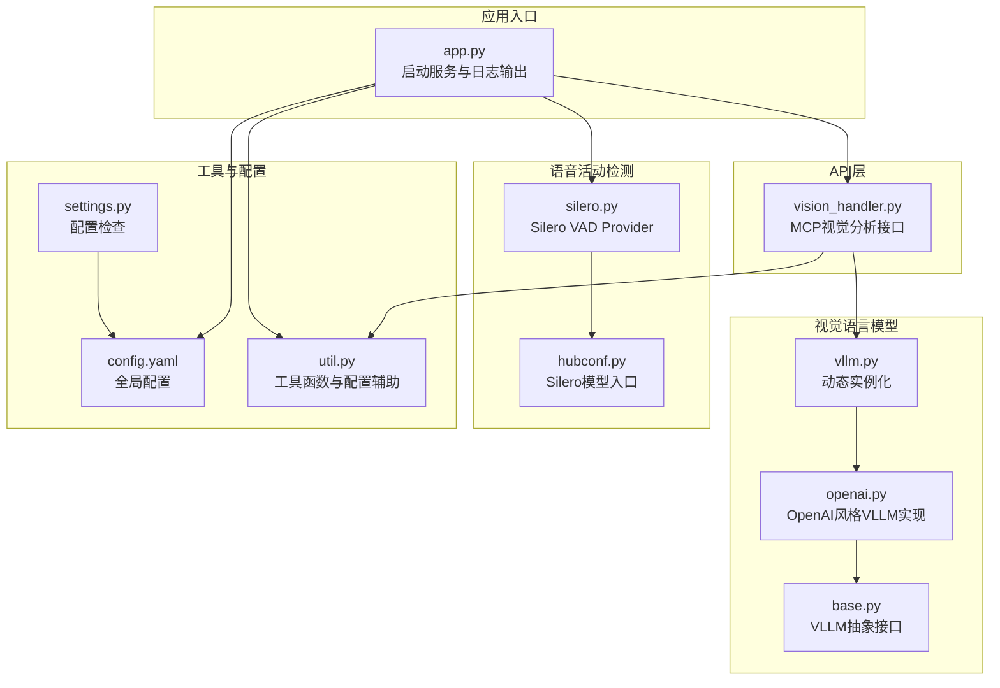
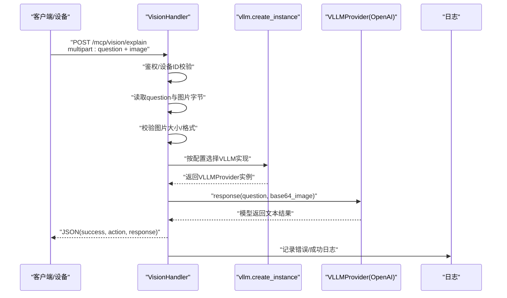
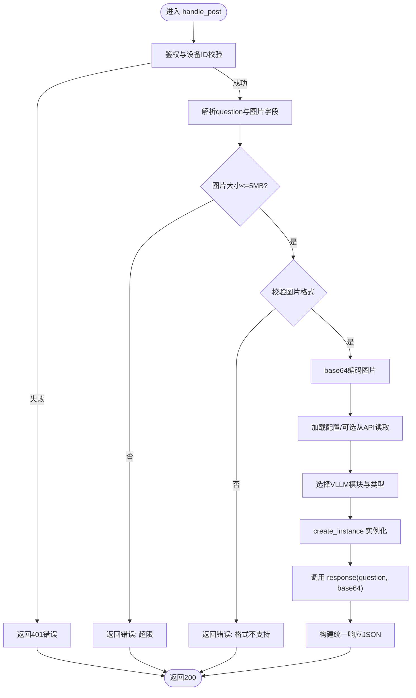
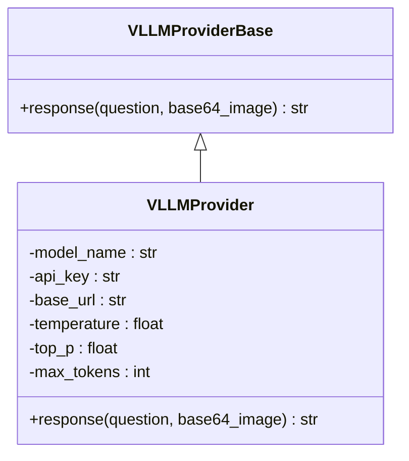
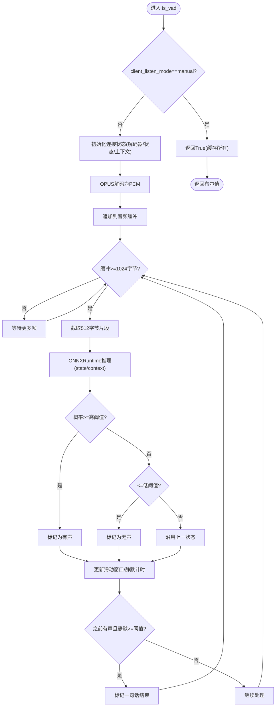
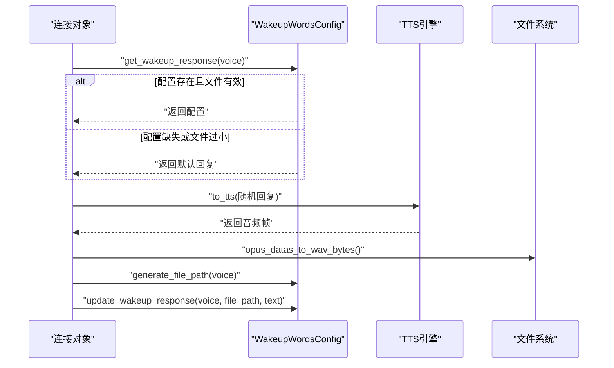
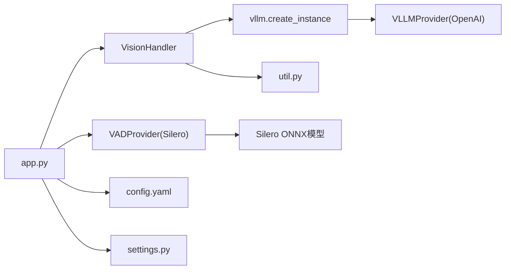

# 视觉分析系统

<cite>
**本文引用的文件**
- [vision_handler.py](file://main/xiaozhi-server/core/api/vision_handler.py)
- [silero.py](file://main/xiaozhi-server/core/providers/vad/silero.py)
- [silero_vad 模型入口](file://main/xiaozhi-server/models/snakers4_silero-vad/hubconf.py)
- [wakeup_word.py](file://main/xiaozhi-server/core/utils/wakeup_word.py)
- [vllm.py](file://main/xiaozhi-server/core/utils/vllm.py)
- [base.py](file://main/xiaozhi-server/core/providers/vllm/base.py)
- [openai.py](file://main/xiaozhi-server/core/providers/vllm/openai.py)
- [util.py](file://main/xiaozhi-server/core/utils/util.py)
- [settings.py](file://main/xiaozhi-server/config/settings.py)
- [config.yaml](file://main/xiaozhi-server/config.yaml)
- [app.py](file://main/xiaozhi-server/app.py)
- [SenseVoiceSmall 配置](file://main/xiaozhi-server/models/SenseVoiceSmall/config.yaml)
</cite>

## 目录
1. [简介](#简介)
2. [项目结构](#项目结构)
3. [核心组件](#核心组件)
4. [架构总览](#架构总览)
5. [详细组件分析](#详细组件分析)
6. [依赖分析](#依赖分析)
7. [性能考虑](#性能考虑)
8. [故障排查指南](#故障排查指南)
9. [结论](#结论)
10. [附录](#附录)

## 简介
本文件面向小智ESP32服务器的视觉分析系统，系统支持通过HTTP接口接收图像与问题，调用视觉语言模型（VLLM）进行图像理解与问答，同时提供语音活动检测（VAD）与唤醒词检测能力，支撑多模态交互闭环。本文将从架构设计、模块职责、数据流、API使用、性能优化与实际应用场景等方面进行系统化说明。

## 项目结构
围绕视觉分析系统的关键目录与文件如下：
- API层：处理HTTP请求与响应，负责鉴权、参数解析与返回封装
- VAD层：基于ONNXRuntime的Silero VAD实现，提供实时语音活动检测
- VLLM层：抽象的视觉语言模型适配器，当前实现对接OpenAI风格的视觉模型
- 工具与配置：统一工具函数、配置加载、唤醒词配置与模型配置
- 应用入口：启动HTTP/WebSocket服务，输出可视化调试信息

**图表来源**
- [app.py:46-131](file://main/xiaozhi-server/app.py#L46-L131)
- [vision_handler.py:47-159](file://main/xiaozhi-server/core/api/vision_handler.py#L47-L159)
- [vllm.py:15-23](file://main/xiaozhi-server/core/utils/vllm.py#L15-L23)
- [base.py:8-12](file://main/xiaozhi-server/core/providers/vllm/base.py#L8-L12)
- [openai.py:11-68](file://main/xiaozhi-server/core/providers/vllm/openai.py#L11-L68)
- [silero.py:13-121](file://main/xiaozhi-server/core/providers/vad/silero.py#L13-L121)
- [silero_vad 模型入口:26-56](file://main/xiaozhi-server/models/snakers4_silero-vad/hubconf.py#L26-L56)
- [util.py:522-537](file://main/xiaozhi-server/core/utils/util.py#L522-L537)
- [config.yaml:727-751](file://main/xiaozhi-server/config.yaml#L727-L751)
- [settings.py:9-33](file://main/xiaozhi-server/config/settings.py#L9-L33)

**章节来源**
- [app.py:46-131](file://main/xiaozhi-server/app.py#L46-L131)
- [config.yaml:727-751](file://main/xiaozhi-server/config.yaml#L727-L751)
- [settings.py:9-33](file://main/xiaozhi-server/config/settings.py#L9-L33)

## 核心组件
- 视觉分析API处理器：负责鉴权、请求解析、图像校验、调用VLLM并返回结果
- VLLM适配器：抽象接口与OpenAI风格实现，支持多供应商与多模型
- VAD提供者：基于ONNXRuntime的Silero VAD，支持双阈值与滑动窗口策略
- 唤醒词配置：基于MD5的唤醒词映射、文件锁与缓存，支持唤醒词回复生成与持久化
- 工具与配置：统一的URL生成、图像格式校验、配置检查与模块更新检测

**章节来源**
- [vision_handler.py:20-159](file://main/xiaozhi-server/core/api/vision_handler.py#L20-L159)
- [vllm.py:15-23](file://main/xiaozhi-server/core/utils/vllm.py#L15-L23)
- [base.py:8-12](file://main/xiaozhi-server/core/providers/vllm/base.py#L8-L12)
- [openai.py:11-68](file://main/xiaozhi-server/core/providers/vllm/openai.py#L11-L68)
- [silero.py:13-121](file://main/xiaozhi-server/core/providers/vad/silero.py#L13-L121)
- [wakeup_word.py:31-140](file://main/xiaozhi-server/core/utils/wakeup_word.py#L31-L140)
- [util.py:522-537](file://main/xiaozhi-server/core/utils/util.py#L522-L537)

## 架构总览
视觉分析系统采用“API网关—模型适配—语音/唤醒词”三层协作架构：
- API层接收设备侧或前端的MCP视觉请求，完成鉴权与参数校验
- VLLM层通过动态实例化机制选择具体模型实现，将图像与问题封装为多模态消息并调用模型
- VAD与唤醒词模块为语音输入侧提供活动检测与唤醒词识别，支撑多模态交互闭环

**图表来源**
- [vision_handler.py:47-159](file://main/xiaozhi-server/core/api/vision_handler.py#L47-L159)
- [vllm.py:15-23](file://main/xiaozhi-server/core/utils/vllm.py#L15-L23)
- [openai.py:42-68](file://main/xiaozhi-server/core/providers/vllm/openai.py#L42-L68)

## 详细组件分析

### 视觉分析API处理器（VisionHandler）
- 功能要点
  - 鉴权：支持测试客户端豁免与JWT校验，设备ID与token一致性检查
  - 请求解析：从multipart/form-data中读取问题与图片字段
  - 图像校验：限制最大5MB，校验常见图片魔数，确保格式合法
  - VLLM调用：动态选择VLLM实现，构造多模态消息并获取结果
  - 统一响应：返回success/action/response结构，支持CORS头
- 错误处理：捕获鉴权失败、参数缺失、格式错误与通用异常，统一返回JSON错误
- 性能与扩展：支持从API读取私有配置，便于远程动态调整VLLM供应商与模型

**图表来源**
- [vision_handler.py:47-159](file://main/xiaozhi-server/core/api/vision_handler.py#L47-L159)
- [util.py:540-567](file://main/xiaozhi-server/core/utils/util.py#L540-L567)

**章节来源**
- [vision_handler.py:20-159](file://main/xiaozhi-server/core/api/vision_handler.py#L20-L159)
- [util.py:522-537](file://main/xiaozhi-server/core/utils/util.py#L522-L537)

### VLLM适配器（抽象与OpenAI风格实现）
- 抽象接口：定义response(question, base64_image)规范
- OpenAI风格实现：支持自定义base_url与模型名，内置温度、采样等参数默认值，构造多模态消息并调用模型
- 动态实例化：根据配置中的selected_module.VLLM与具体type，动态导入并实例化对应类

**图表来源**
- [base.py:8-12](file://main/xiaozhi-server/core/providers/vllm/base.py#L8-L12)
- [openai.py:11-68](file://main/xiaozhi-server/core/providers/vllm/openai.py#L11-L68)
- [vllm.py:15-23](file://main/xiaozhi-server/core/utils/vllm.py#L15-L23)

**章节来源**
- [base.py:8-12](file://main/xiaozhi-server/core/providers/vllm/base.py#L8-L12)
- [openai.py:11-68](file://main/xiaozhi-server/core/providers/vllm/openai.py#L11-L68)
- [vllm.py:15-23](file://main/xiaozhi-server/core/utils/vllm.py#L15-L23)

### 语音活动检测（VAD）——Silero VAD
- 模型加载：通过ONNXRuntime加载ONNX模型，设置线程数为1，确保低资源占用
- 实时处理：每帧60ms，OPUS解码为PCM，滑动窗口与双阈值策略判断语音段
- 状态管理：为每个连接维护独立的解码器、状态与上下文，支持手动模式（不进行VAD，直接缓存）
- 静默检测：基于最小静默时长判断一句话结束，避免误判

**图表来源**
- [silero.py:58-121](file://main/xiaozhi-server/core/providers/vad/silero.py#L58-L121)

**章节来源**
- [silero.py:13-121](file://main/xiaozhi-server/core/providers/vad/silero.py#L13-L121)
- [silero_vad 模型入口:26-56](file://main/xiaozhi-server/models/snakers4_silero-vad/hubconf.py#L26-L56)

### 唤醒词检测与配置
- 配置管理：使用YAML文件存储唤醒词与回复，MD5哈希作为键，文件锁保证并发安全
- 文件路径生成：基于音色MD5生成wav文件路径，支持覆盖与删除旧文件
- 回复生成：TTS生成唤醒词回复，写入wav并更新配置，支持缓存与刷新策略
- 与语音处理联动：在语音输入阶段识别唤醒词，触发快速回复与会话重置

**图表来源**
- [wakeup_word.py:88-140](file://main/xiaozhi-server/core/utils/wakeup_word.py#L88-L140)

**章节来源**
- [wakeup_word.py:31-140](file://main/xiaozhi-server/core/utils/wakeup_word.py#L31-L140)

### 工具与配置辅助
- 视觉URL生成：支持本地IP自动探测与端口拼接，便于设备侧调用
- 图像格式校验：基于文件头魔数判断，支持JPEG/PNG/GIF/BMP/TIFF/WEBP
- 配置检查：确保data/.config.yaml存在，避免本地与远端配置冲突
- 模块更新检测：用于判断VAD/ASR/VLLM等模块类型变更，触发相应更新逻辑

**章节来源**
- [util.py:522-537](file://main/xiaozhi-server/core/utils/util.py#L522-L537)
- [util.py:540-567](file://main/xiaozhi-server/core/utils/util.py#L540-L567)
- [settings.py:9-33](file://main/xiaozhi-server/config/settings.py#L9-L33)

## 依赖分析
- 组件耦合
  - VisionHandler与VLLM适配器通过动态实例化解耦，便于替换供应商与模型
  - VAD与连接状态强耦合，通过连接属性隔离各会话状态
  - 唤醒词配置与TTS/文件系统耦合，形成闭环
- 外部依赖
  - ONNXRuntime用于推理，确保跨平台部署
  - OpenAI风格API用于视觉模型调用
  - opuslib_next用于音频编解码

**图表来源**
- [vision_handler.py:113-128](file://main/xiaozhi-server/core/api/vision_handler.py#L113-L128)
- [vllm.py:15-23](file://main/xiaozhi-server/core/utils/vllm.py#L15-L23)
- [openai.py:11-40](file://main/xiaozhi-server/core/providers/vllm/openai.py#L11-L40)
- [silero.py:17-25](file://main/xiaozhi-server/core/providers/vad/silero.py#L17-L25)
- [app.py:78-83](file://main/xiaozhi-server/app.py#L78-L83)
- [config.yaml:727-751](file://main/xiaozhi-server/config.yaml#L727-L751)
- [settings.py:9-33](file://main/xiaozhi-server/config/settings.py#L9-L33)

**章节来源**
- [vision_handler.py:113-128](file://main/xiaozhi-server/core/api/vision_handler.py#L113-L128)
- [vllm.py:15-23](file://main/xiaozhi-server/core/utils/vllm.py#L15-L23)
- [openai.py:11-40](file://main/xiaozhi-server/core/providers/vllm/openai.py#L11-L40)
- [silero.py:17-25](file://main/xiaozhi-server/core/providers/vad/silero.py#L17-L25)
- [app.py:78-83](file://main/xiaozhi-server/app.py#L78-L83)
- [config.yaml:727-751](file://main/xiaozhi-server/config.yaml#L727-L751)
- [settings.py:9-33](file://main/xiaozhi-server/config/settings.py#L9-L33)

## 性能考虑
- VAD线程与资源
  - ONNXRuntime线程数设为1，降低CPU占用，适合边缘设备
  - 每帧60ms，512字节片段，平衡延迟与精度
- 图像处理
  - 限制最大5MB，避免内存峰值过高
  - base64编码传输，便于HTTP上传与跨语言兼容
- 模型调用
  - OpenAI风格VLLM调用为同步阻塞，建议在高并发场景下引入队列与限流
  - 通过配置中心动态切换模型，减少重启成本
- 缓存与I/O
  - 唤醒词回复生成后写入文件，避免重复TTS
  - 配置文件使用文件锁，保障并发安全

[本节为通用性能建议，不直接分析具体文件]

## 故障排查指南
- 视觉分析接口
  - 401错误：检查Authorization头与Client-Id/Device-Id是否匹配
  - 图片过大/格式不支持：确认文件大小与魔数
  - 未设置默认VLLM模块：检查selected_module.VLLM配置
- VAD异常
  - OPUS解码错误：检查音频采样率与通道数是否为16kHz/单声道
  - ONNXRuntime推理失败：确认模型路径与ONNX版本
- 配置问题
  - 缺少data/.config.yaml：按提示创建并完善
  - 本地与远端配置冲突：遵循配置检查逻辑，避免混合配置

**章节来源**
- [vision_handler.py:142-155](file://main/xiaozhi-server/core/api/vision_handler.py#L142-L155)
- [silero.py:118-121](file://main/xiaozhi-server/core/providers/vad/silero.py#L118-L121)
- [settings.py:16-32](file://main/xiaozhi-server/config/settings.py#L16-L32)

## 结论
小智ESP32服务器的视觉分析系统通过清晰的分层设计实现了“图像理解+语音交互”的多模态能力。API层负责统一入口与鉴权，VLLM适配器提供灵活的模型扩展，VAD与唤醒词模块完善语音输入体验。配合配置中心与工具函数，系统具备良好的可维护性与可扩展性，适用于家庭与边缘场景的智能交互需求。

## 附录

### 视觉分析API使用示例（路径指引）
- 接口地址：由启动日志输出的“视觉分析接口是”提示，或通过工具函数生成
- 请求方式：POST multipart/form-data
  - 字段1：question（文本）
  - 字段2：image（图片文件）
- 鉴权：Authorization: Bearer <token>，并携带Client-Id与Device-Id
- 成功响应：包含success、action、response字段

**章节来源**
- [app.py:94-97](file://main/xiaozhi-server/app.py#L94-L97)
- [util.py:522-537](file://main/xiaozhi-server/core/utils/util.py#L522-L537)
- [vision_handler.py:47-159](file://main/xiaozhi-server/core/api/vision_handler.py#L47-L159)

### 语音活动检测（VAD）配置要点
- 阈值：高阈值与低阈值用于双阈值判断
- 最小静默时长：决定一句话结束的静默时长
- 模型路径：ONNX模型位于models/snakers4_silero-vad目录

**章节来源**
- [silero.py:27-38](file://main/xiaozhi-server/core/providers/vad/silero.py#L27-L38)
- [silero_vad 模型入口:42-47](file://main/xiaozhi-server/models/snakers4_silero-vad/hubconf.py#L42-L47)

### 唤醒词检测配置要点
- 唤醒词列表：配置文件中的wakeup_words
- 回复生成：TTS生成并写入wav，MD5作为键存储
- 缓存与刷新：支持缓存与定时刷新策略

**章节来源**
- [config.yaml:107-118](file://main/xiaozhi-server/config.yaml#L107-L118)
- [wakeup_word.py:88-140](file://main/xiaozhi-server/core/utils/wakeup_word.py#L88-L140)

### 视觉语言模型配置要点
- 供应商与模型：VLLM下配置type与模型名、base_url/api_key
- 选择模块：selected_module.VLLM指向具体实现

**章节来源**
- [config.yaml:727-751](file://main/xiaozhi-server/config.yaml#L727-L751)
- [openai.py:12-40](file://main/xiaozhi-server/core/providers/vllm/openai.py#L12-L40)