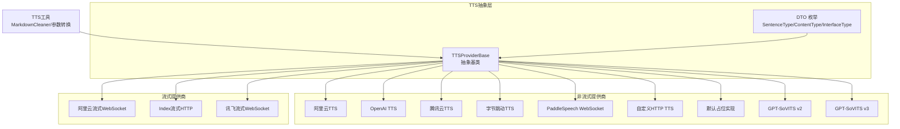
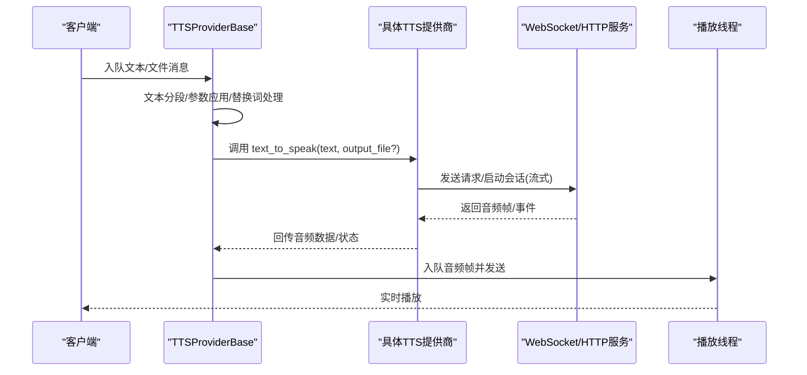
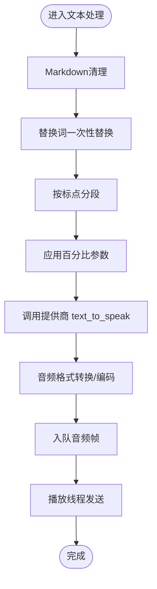
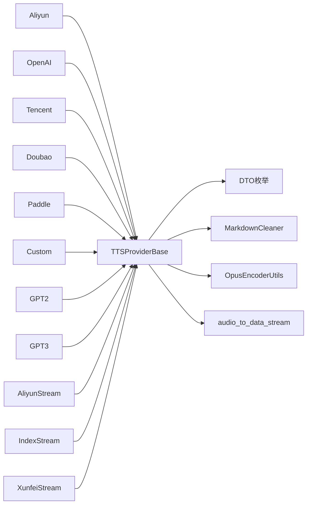

# 语音合成系统（TTS）

<cite>
**本文档引用的文件**
- [base.py](file://main/xiaozhi-server/core/providers/tts/base.py)
- [default.py](file://main/xiaozhi-server/core/providers/tts/default.py)
- [custom.py](file://main/xiaozhi-server/core/providers/tts/custom.py)
- [gpt_sovits_v2.py](file://main/xiaozhi-server/core/providers/tts/gpt_sovits_v2.py)
- [gpt_sovits_v3.py](file://main/xiaozhi-server/core/providers/tts/gpt_sovits_v3.py)
- [aliyun.py](file://main/xiaozhi-server/core/providers/tts/aliyun.py)
- [openai.py](file://main/xiaozhi-server/core/providers/tts/openai.py)
- [tencent.py](file://main/xiaozhi-server/core/providers/tts/tencent.py)
- [doubao.py](file://main/xiaozhi-server/core/providers/tts/doubao.py)
- [paddle_speech.py](file://main/xiaozhi-server/core/providers/tts/paddle_speech.py)
- [aliyun_stream.py](file://main/xiaozhi-server/core/providers/tts/aliyun_stream.py)
- [index_stream.py](file://main/xiaozhi-server/core/providers/tts/index_stream.py)
- [xunfei_stream.py](file://main/xiaozhi-server/core/providers/tts/xunfei_stream.py)
- [tts.py](file://main/xiaozhi-server/core/utils/tts.py)
- [dto.py](file://main/xiaozhi-server/core/providers/tts/dto/dto.py)
</cite>

## 目录
1. [简介](#简介)
2. [项目结构](#项目结构)
3. [核心组件](#核心组件)
4. [架构总览](#架构总览)
5. [详细组件分析](#详细组件分析)
6. [依赖关系分析](#依赖关系分析)
7. [性能考量](#性能考量)
8. [故障排查指南](#故障排查指南)
9. [结论](#结论)
10. [附录](#附录)

## 简介
本文件面向小智ESP32服务器的语音合成系统（TTS），系统支持多平台TTS提供商接入（阿里云、OpenAI、字节跳动、腾讯、讯飞、百度等），并提供流式与非流式两种合成模式。文档重点涵盖：
- 多平台TTS提供商的集成架构与技术差异
- GPT-SoVITS语音克隆技术的原理与配置要点
- 流式语音合成的实现机制（分片、实时播放、缓冲优化）
- 音色参数调节、语速语调控制、情感表达与方言支持
- TTS配置参数、音频格式转换、质量评估与性能优化最佳实践

## 项目结构
TTS模块位于后端工程的“core/providers/tts”目录，采用“抽象基类 + 多提供商实现”的分层设计，配合通用工具与消息模型，形成可扩展、可配置的TTS体系。

图示来源
- [base.py:33-637](file://main/xiaozhi-server/core/providers/tts/base.py#L33-L637)
- [dto.py:5-44](file://main/xiaozhi-server/core/providers/tts/dto/dto.py#L5-L44)
- [tts.py:44-171](file://main/xiaozhi-server/core/utils/tts.py#L44-L171)

章节来源
- [base.py:33-637](file://main/xiaozhi-server/core/providers/tts/base.py#L33-L637)
- [dto.py:5-44](file://main/xiaozhi-server/core/providers/tts/dto/dto.py#L5-L44)
- [tts.py:44-171](file://main/xiaozhi-server/core/utils/tts.py#L44-L171)

## 核心组件
- 抽象基类 TTSProviderBase：统一管理文本队列、音频队列、会话状态、参数应用、音频格式转换、上报与播放线程等。
- DTO 枚举：SentenceType（首句/中间/末句）、ContentType（文本/文件/动作）、InterfaceType（双流/单流/非流）。
- 工具模块：MarkdownCleaner（清理Markdown与表格/公式/链接等）、convert_percentage_to_range（百分比参数映射）。
- 具体提供商：阿里云、OpenAI、腾讯、字节跳动、讯飞、PaddleSpeech、自定义HTTP、GPT-SoVITS v2/v3等。

章节来源
- [base.py:33-637](file://main/xiaozhi-server/core/providers/tts/base.py#L33-L637)
- [dto.py:5-44](file://main/xiaozhi-server/core/providers/tts/dto/dto.py#L5-L44)
- [tts.py:44-171](file://main/xiaozhi-server/core/utils/tts.py#L44-L171)

## 架构总览
系统通过抽象基类统一调度，不同提供商实现各自“text_to_speak”方法；流式提供商额外维护WebSocket会话与监听任务，实现边合成边播放；非流式提供商直接下载/生成音频文件或字节流，再进行格式转换与播放。

图示来源
- [base.py:368-470](file://main/xiaozhi-server/core/providers/tts/base.py#L368-L470)
- [aliyun_stream.py:213-293](file://main/xiaozhi-server/core/providers/tts/aliyun_stream.py#L213-L293)
- [xunfei_stream.py:152-241](file://main/xiaozhi-server/core/providers/tts/xunfei_stream.py#L152-L241)

## 详细组件分析

### 抽象基类与通用流程
- 文本处理：Markdown清理、替换词一次性正则替换、跨分片滑动窗口匹配、按标点分段。
- 参数系统：通过“TTS_PARAM_CONFIG”批量将百分比参数映射到具体范围值。
- 队列与线程：文本优先队列与音频播放队列，分离处理与播放线程，支持会话级打断与上报。
- 音频转换：支持WAV/PCM/Opus互转，按连接采样率动态编码。

图示来源
- [base.py:123-192](file://main/xiaozhi-server/core/providers/tts/base.py#L123-L192)
- [base.py:368-470](file://main/xiaozhi-server/core/providers/tts/base.py#L368-L470)
- [tts.py:146-171](file://main/xiaozhi-server/core/utils/tts.py#L146-L171)

章节来源
- [base.py:123-192](file://main/xiaozhi-server/core/providers/tts/base.py#L123-L192)
- [base.py:368-470](file://main/xiaozhi-server/core/providers/tts/base.py#L368-L470)
- [tts.py:146-171](file://main/xiaozhi-server/core/utils/tts.py#L146-L171)

### 阿里云TTS（非流式）
- 特点：基于HTTP接口，支持Token鉴权与参数映射（音量/语速/音高）。
- 关键点：Token有效期检查与自动刷新；音频格式由“format”控制；支持私有音色。

章节来源
- [aliyun.py:88-213](file://main/xiaozhi-server/core/providers/tts/aliyun.py#L88-L213)

### OpenAI TTS（非流式）
- 特点：官方API，支持多种音色与语速控制；参数通过“speed”传递。
- 关键点：API Key校验；音频格式由“response_format”控制。

章节来源
- [openai.py:10-61](file://main/xiaozhi-server/core/providers/tts/openai.py#L10-L61)

### 腾讯云TTS（非流式）
- 特点：TC3-HMAC-SHA256签名；支持音量/语速参数；采样率按音色支持配置。
- 关键点：鉴权头动态生成；Base64音频解码后写入/返回。

章节来源
- [tencent.py:12-190](file://main/xiaozhi-server/core/providers/tts/tencent.py#L12-L190)

### 字节跳动TTS（非流式）
- 特点：基于AppID/Token/Cluster鉴权；支持音量/语速/音高比例参数。
- 关键点：Authorization头拼接；Base64音频解码。

章节来源
- [doubao.py:16-99](file://main/xiaozhi-server/core/providers/tts/doubao.py#L16-L99)

### PaddleSpeech（非流式，WebSocket）
- 特点：本地/远端WebSocket流式TTS；支持保存为WAV；PCM转WAV辅助。
- 关键点：会话开始/数据/结束三阶段；支持私有说话人ID。

章节来源
- [paddle_speech.py:18-157](file://main/xiaozhi-server/core/providers/tts/paddle_speech.py#L18-L157)

### 自定义HTTP TTS（非流式）
- 特点：通过URL与参数模板化文本；支持GET/POST；返回二进制音频。
- 关键点：参数JSON解析与“{prompt_text}”占位替换。

章节来源
- [custom.py:12-54](file://main/xiaozhi-server/core/providers/tts/custom.py#L12-L54)

### GPT-SoVITS v2/v3（非流式）
- 特点：支持参考音频/文本、top_k/top_p/温度、批处理阈值/大小、加速因子、重复惩罚、分桶/片段返回、并行推理等。
- 关键点：v2/v3参数命名差异；参考音频路径列表；返回音频二进制。

章节来源
- [gpt_sovits_v2.py:10-104](file://main/xiaozhi-server/core/providers/tts/gpt_sovits_v2.py#L10-L104)
- [gpt_sovits_v3.py:10-65](file://main/xiaozhi-server/core/providers/tts/gpt_sovits_v3.py#L10-L65)

### 阿里云流式WebSocket（双流）
- 特点：Start/Run/Stop三阶段；事件驱动（SynthesisStarted/SentenceEnd/SynthesisCompleted）；支持跨分片替换词滑动窗口。
- 关键点：会话复用与监控任务；音频PCM经Opus编码后入队。

章节来源
- [aliyun_stream.py:89-642](file://main/xiaozhi-server/core/providers/tts/aliyun_stream.py#L89-L642)

### Index流式HTTP（单流）
- 特点：单次请求返回PCM流，按固定帧大小切片编码为Opus；支持“最后片段”标记。
- 关键点：24kHz采样率专用编码器；PCM缓冲与帧对齐。

章节来源
- [index_stream.py:18-254](file://main/xiaozhi-server/core/providers/tts/index_stream.py#L18-L254)

### 讯飞流式WebSocket（双流）
- 特点：鉴权URL生成；Start/Run/Stop三态；Base64音频帧；口语化参数与分片策略。
- 关键点：序列号管理；错误码处理；音频帧解码与编码。

章节来源
- [xunfei_stream.py:62-568](file://main/xiaozhi-server/core/providers/tts/xunfei_stream.py#L62-L568)

### 默认与工具模块
- 默认实现：用于兜底提示“未配置TTS服务”。
- 工具模块：Markdown清理、百分比到范围映射、实例创建工厂。

章节来源
- [default.py:9-24](file://main/xiaozhi-server/core/providers/tts/default.py#L9-L24)
- [tts.py:33-42](file://main/xiaozhi-server/core/utils/tts.py#L33-L42)
- [tts.py:146-171](file://main/xiaozhi-server/core/utils/tts.py#L146-L171)

## 依赖关系分析
- 抽象基类依赖：消息DTO、音频工具、Opus编码器、Markdown清理、参数映射。
- 流式提供商：依赖WebSocket库与事件模型；需独立处理音频编码器以避免并发冲突。
- 非流式提供商：依赖HTTP库与鉴权（Token/签名）。

图示来源
- [base.py:1-30](file://main/xiaozhi-server/core/providers/tts/base.py#L1-L30)
- [dto.py:5-44](file://main/xiaozhi-server/core/providers/tts/dto/dto.py#L5-L44)
- [tts.py:44-171](file://main/xiaozhi-server/core/utils/tts.py#L44-L171)

章节来源
- [base.py:1-30](file://main/xiaozhi-server/core/providers/tts/base.py#L1-L30)
- [dto.py:5-44](file://main/xiaozhi-server/core/providers/tts/dto/dto.py#L5-L44)
- [tts.py:44-171](file://main/xiaozhi-server/core/utils/tts.py#L44-L171)

## 性能考量
- 并发与线程
  - 文本处理与音频播放分离线程，避免阻塞；流式监听任务独立运行，注意取消与清理。
  - 双流式中共享Opus编码器需避免并发访问导致断言失败，必要时使用独立编码器。
- 缓冲与帧对齐
  - 单流HTTP按固定帧大小切片，确保编码器输入对齐；不足一帧需补齐。
  - 流式WebSocket按事件驱动，及时消费音频帧，避免队列堆积。
- 采样率与格式
  - 非流式按连接采样率初始化编码器；流式按服务端返回采样率（如24kHz）配置编码器。
  - Opus帧大小与通道数需与服务端一致，避免解码异常。
- 重试与容错
  - 文本转语音最多重试N次；流式连接断开需重建并恢复会话状态。
- 参数映射
  - 百分比参数统一映射到目标范围，减少跨提供商差异带来的配置复杂度。

章节来源
- [base.py:304-324](file://main/xiaozhi-server/core/providers/tts/base.py#L304-L324)
- [index_stream.py:120-179](file://main/xiaozhi-server/core/providers/tts/index_stream.py#L120-L179)
- [aliyun_stream.py:489-506](file://main/xiaozhi-server/core/providers/tts/aliyun_stream.py#L489-L506)

## 故障排查指南
- 常见错误
  - Token/鉴权失败：检查AK/SK、AppID/Token、签名算法与时效；流式提供商需处理过期自动刷新。
  - 会话异常：确认Start/Run/Stop顺序；流式监听任务是否被取消或连接提前关闭。
  - 音频无声/失真：核对采样率、通道数、帧大小；检查Opus编码器初始化与回调。
  - 文本未发声：确认分段逻辑与标点识别；检查替换词滑动窗口是否正确匹配。
- 建议步骤
  - 开启详细日志，定位Provider与事件流转阶段。
  - 使用非流式to_tts方法验证服务端可用性与参数正确性。
  - 在流式模式下逐步降低参数（语速/音高等）以排除模型/网络问题。

章节来源
- [aliyun.py:134-172](file://main/xiaozhi-server/core/providers/tts/aliyun.py#L134-L172)
- [tencent.py:142-190](file://main/xiaozhi-server/core/providers/tts/tencent.py#L142-L190)
- [xunfei_stream.py:344-425](file://main/xiaozhi-server/core/providers/tts/xunfei_stream.py#L344-L425)
- [index_stream.py:120-179](file://main/xiaozhi-server/core/providers/tts/index_stream.py#L120-L179)

## 结论
本TTS系统通过抽象基类与统一DTO/工具模块，实现了多平台、多模式（流式/非流式）的灵活集成。各提供商在参数映射、鉴权方式与事件模型上存在差异，但均遵循统一的消息与播放流程。结合流式WebSocket与HTTP单流的差异化实现，系统可在低延迟与高兼容之间灵活取舍。建议在生产环境优先采用流式方案，并针对不同提供商进行参数与缓冲优化。

## 附录

### 配置参数与最佳实践
- 通用参数
  - 输出目录、音频格式、采样率、删除临时文件、超时时间、替换词列表。
- 百分比参数映射
  - 使用“ttsVolume/ttsRate/ttsPitch”等键，系统自动映射到具体范围。
- 流式参数
  - 阿里云/讯飞：Start/Run/Stop三阶段；事件名与状态码需严格处理。
  - Index：固定帧大小与24kHz采样率；“最后片段”标记。
- 音色与方言
  - 各提供商音色ID/名称不同，需按提供商文档配置；方言/口音通过音色或参数控制。
- 音频格式转换
  - 非流式：WAV/PCM/Opus互转；流式：按服务端返回格式编码。
- 质量评估
  - 通过主观评测与客观指标（如RMS/频谱一致性）结合评估；对比不同提供商与参数组合。

章节来源
- [base.py:570-576](file://main/xiaozhi-server/core/providers/tts/base.py#L570-L576)
- [aliyun_stream.py:332-376](file://main/xiaozhi-server/core/providers/tts/aliyun_stream.py#L332-L376)
- [xunfei_stream.py:273-321](file://main/xiaozhi-server/core/providers/tts/xunfei_stream.py#L273-L321)
- [index_stream.py:180-193](file://main/xiaozhi-server/core/providers/tts/index_stream.py#L180-L193)

### GPT-SoVITS语音克隆配置要点
- 参考音频与文本
  - v2：ref_audio_path/ref_text/prompt_lang/text_lang；v3：refer_wav_path/prompt_text/prompt_language/text_language。
- 生成参数
  - top_k/top_p/temperature、batch_size/batch_threshold、speed_factor、seed、repetition_penalty、并行推理开关。
- 返回与分片
  - 支持分桶/片段返回；可启用流式模式（视服务端支持）。
- 训练与优化
  - 参考音频质量与长度直接影响克隆效果；建议使用清晰、稳定的单人录音；参数调优以自然度与稳定性为目标。

章节来源
- [gpt_sovits_v2.py:10-104](file://main/xiaozhi-server/core/providers/tts/gpt_sovits_v2.py#L10-L104)
- [gpt_sovits_v3.py:10-65](file://main/xiaozhi-server/core/providers/tts/gpt_sovits_v3.py#L10-L65)