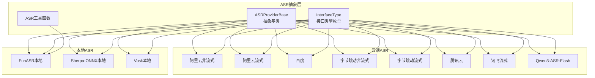
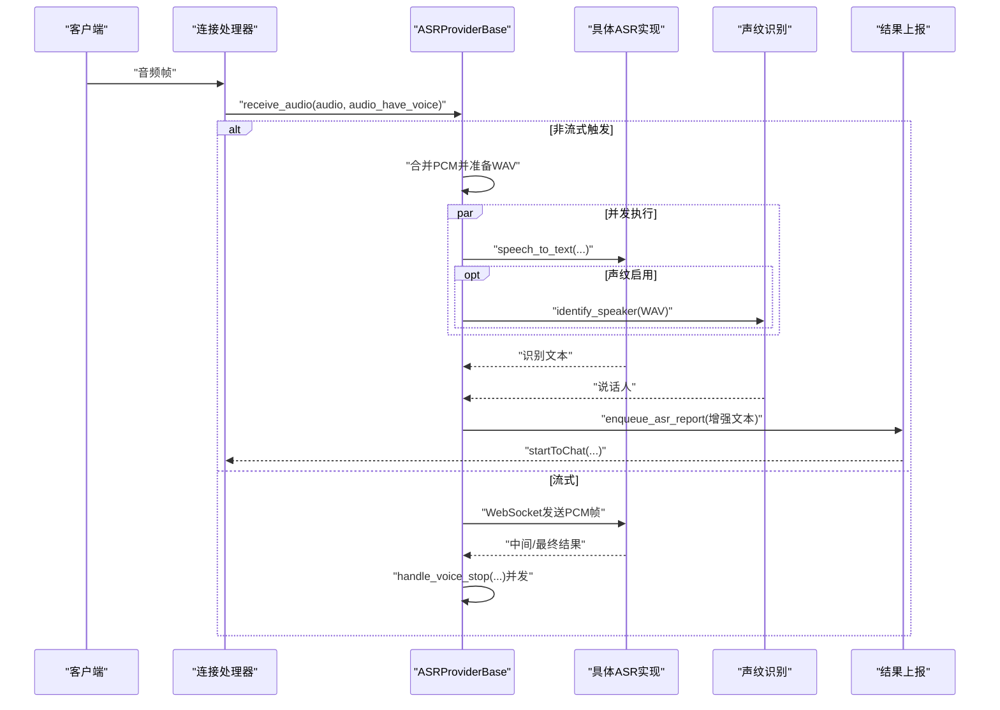
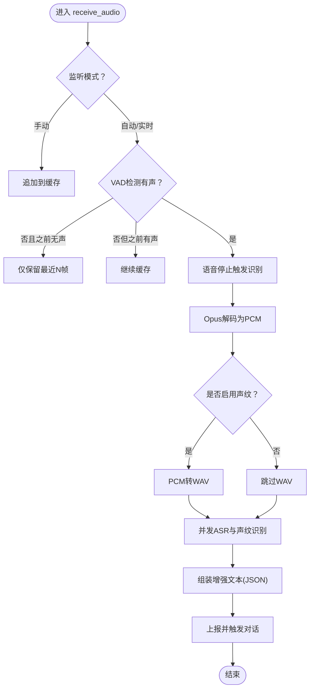
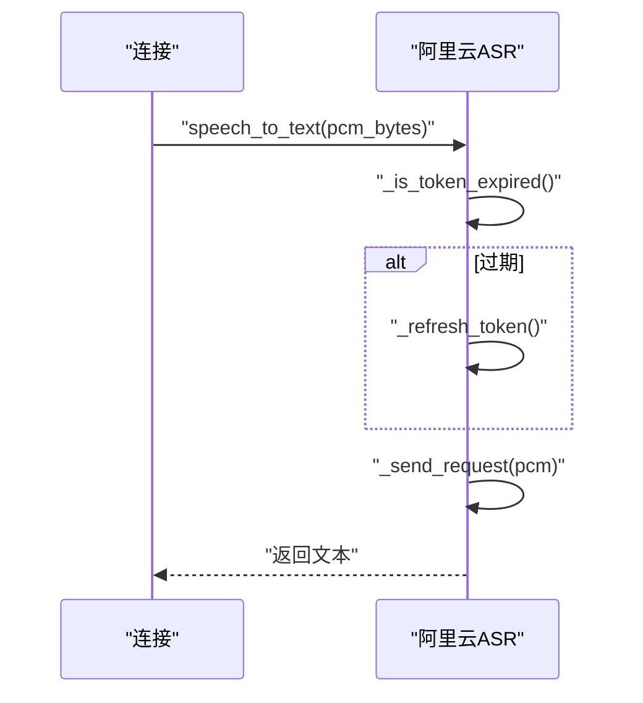
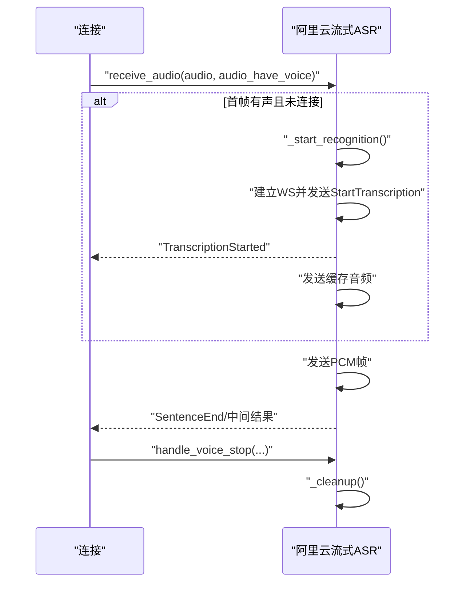
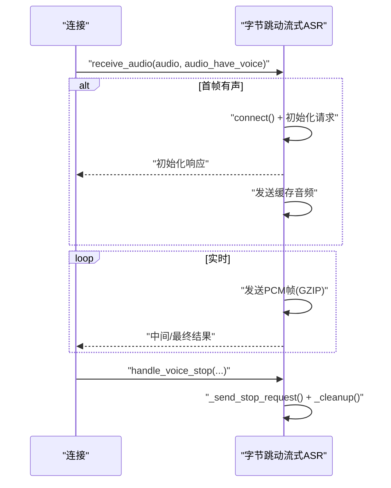
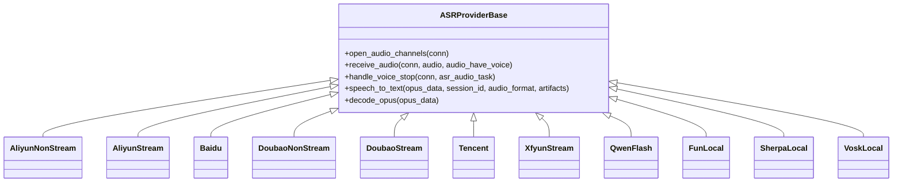

# 语音识别系统（ASR）

<cite>
**本文引用的文件**
- [ASR基类](file://main/xiaozhi-server/core/providers/asr/base.py)
- [阿里云ASR（非流式）](file://main/xiaozhi-server/core/providers/asr/aliyun.py)
- [阿里云ASR（流式）](file://main/xiaozhi-server/core/providers/asr/aliyun_stream.py)
- [百度ASR](file://main/xiaozhi-server/core/providers/asr/baidu.py)
- [字节跳动ASR（非流式）](file://main/xiaozhi-server/core/providers/asr/doubao.py)
- [字节跳动ASR（流式）](file://main/xiaozhi-server/core/providers/asr/doubao_stream.py)
- [腾讯云ASR](file://main/xiaozhi-server/core/providers/asr/tencent.py)
- [讯飞ASR（流式）](file://main/xiaozhi-server/core/providers/asr/xunfei_stream.py)
- [Qwen3-ASR-Flash](file://main/xiaozhi-server/core/providers/asr/qwen3_asr_flash.py)
- [FunASR（本地）](file://main/xiaozhi-server/core/providers/asr/fun_local.py)
- [Sherpa-ONNX（本地）](file://main/xiaozhi-server/core/providers/asr/sherpa_onnx_local.py)
- [Vosk（本地）](file://main/xiaozhi-server/core/providers/asr/vosk.py)
- [ASR工具函数](file://main/xiaozhi-server/core/providers/asr/utils.py)
- [接口类型枚举](file://main/xiaozhi-server/core/providers/asr/dto/dto.py)
- [应用入口](file://main/xiaozhi-server/app.py)
- [配置加载](file://main/xiaozhi-server/config/settings.py)
</cite>

## 目录
1. [简介](#简介)
2. [项目结构](#项目结构)
3. [核心组件](#核心组件)
4. [架构总览](#架构总览)
5. [详细组件分析](#详细组件分析)
6. [依赖关系分析](#依赖关系分析)
7. [性能考量](#性能考量)
8. [故障排查指南](#故障排查指南)
9. [结论](#结论)
10. [附录](#附录)

## 简介
本文件面向小智ESP32服务器的语音识别系统（ASR），系统支持多平台云端ASR（阿里云、百度、字节跳动、腾讯、通义千问）与本地ASR（FunASR、Sherpa-ONNX、Vosk）。文档涵盖：
- 多平台ASR集成架构与配置要点
- 本地ASR部署与优化策略
- 流式语音识别的实现原理与延迟优化
- ASR配置参数、音频格式支持、语言模型选择与准确率优化
- API调用流程、错误处理与性能监控方案

## 项目结构
ASR相关代码集中在 Xiaozhi Server 的 providers/asr 子模块，采用“抽象基类 + 多实现”的设计，统一了云端与本地ASR的接入方式。

图表来源
- [ASR基类:32-382](file://main/xiaozhi-server/core/providers/asr/base.py#L32-L382)
- [阿里云ASR（非流式）:90-237](file://main/xiaozhi-server/core/providers/asr/aliyun.py#L90-L237)
- [阿里云ASR（流式）:71-347](file://main/xiaozhi-server/core/providers/asr/aliyun_stream.py#L71-L347)
- [百度ASR:13-75](file://main/xiaozhi-server/core/providers/asr/baidu.py#L13-L75)
- [字节跳动ASR（非流式）:83-261](file://main/xiaozhi-server/core/providers/asr/doubao.py#L83-L261)
- [字节跳动ASR（流式）:19-444](file://main/xiaozhi-server/core/providers/asr/doubao_stream.py#L19-L444)
- [腾讯云ASR:18-228](file://main/xiaozhi-server/core/providers/asr/tencent.py#L18-L228)
- [讯飞ASR（流式）:30-354](file://main/xiaozhi-server/core/providers/asr/xunfei_stream.py#L30-L354)
- [Qwen3-ASR-Flash:12-112](file://main/xiaozhi-server/core/providers/asr/qwen3_asr_flash.py#L12-L112)
- [FunASR（本地）:40-109](file://main/xiaozhi-server/core/providers/asr/fun_local.py#L40-L109)
- [Sherpa-ONNX（本地）:37-151](file://main/xiaozhi-server/core/providers/asr/sherpa_onnx_local.py#L37-L151)
- [Vosk（本地）:13-92](file://main/xiaozhi-server/core/providers/asr/vosk.py#L13-L92)
- [接口类型枚举:5-10](file://main/xiaozhi-server/core/providers/asr/dto/dto.py#L5-L10)
- [ASR工具函数:28-80](file://main/xiaozhi-server/core/providers/asr/utils.py#L28-L80)

章节来源
- [ASR基类:32-382](file://main/xiaozhi-server/core/providers/asr/base.py#L32-L382)
- [接口类型枚举:5-10](file://main/xiaozhi-server/core/providers/asr/dto/dto.py#L5-L10)

## 核心组件
- 抽象基类 ASRProviderBase：统一音频接收、Opus解码、PCM-WAV转换、并发ASR与声纹识别、结果上报与性能统计；定义异步 speech_to_text 接口。
- 云端ASR实现：阿里云（非流式/流式）、百度、字节跳动（非流式/流式）、腾讯云、讯飞（流式）、通义千问（非流式）。
- 本地ASR实现：FunASR、Sherpa-ONNX、Vosk。
- 工具函数：FunASR结果标签解析（语种、情绪等）。

章节来源
- [ASR基类:32-382](file://main/xiaozhi-server/core/providers/asr/base.py#L32-L382)
- [ASR工具函数:28-80](file://main/xiaozhi-server/core/providers/asr/utils.py#L28-L80)

## 架构总览
系统通过统一的音频通道与优先队列，将来自客户端的音频帧按VAD与监听模式进行缓存与触发，随后并发调用ASR与可选的声纹识别，并将结果上报至对话处理流程。

图表来源
- [ASR基类:62-180](file://main/xiaozhi-server/core/providers/asr/base.py#L62-L180)
- [阿里云ASR（流式）:129-284](file://main/xiaozhi-server/core/providers/asr/aliyun_stream.py#L129-L284)
- [字节跳动ASR（流式）:163-262](file://main/xiaozhi-server/core/providers/asr/doubao_stream.py#L163-L262)
- [讯飞ASR（流式）:195-257](file://main/xiaozhi-server/core/providers/asr/xunfei_stream.py#L195-L257)

## 详细组件分析

### 抽象基类与通用流程
- 音频通道与优先队列：独立线程从连接队列取出音频，保证处理顺序与稳定性。
- 音频接收与VAD联动：根据监听模式与静音窗口策略决定何时触发识别。
- Opus解码与PCM-WAV转换：统一将Opus解码为PCM，必要时转WAV供声纹识别。
- 并发ASR与声纹识别：使用 asyncio.gather 并发等待，提升吞吐。
- 结果增强与上报：将说话人信息注入JSON，上报至对话处理链路。

图表来源
- [ASR基类:62-180](file://main/xiaozhi-server/core/providers/asr/base.py#L62-L180)

章节来源
- [ASR基类:32-382](file://main/xiaozhi-server/core/providers/asr/base.py#L32-L382)

### 阿里云ASR（非流式）
- 接口类型：非流式
- 认证：支持AccessKey直刷Token与长期Token；Token过期自动刷新
- 参数：format=wav、sample_rate=16k、启用标点预测与反向文字正则
- 请求：HTTPS POST，octet-stream，同步返回结果

图表来源
- [阿里云ASR（非流式）:118-237](file://main/xiaozhi-server/core/providers/asr/aliyun.py#L118-L237)

章节来源
- [阿里云ASR（非流式）:90-237](file://main/xiaozhi-server/core/providers/asr/aliyun.py#L90-L237)

### 阿里云ASR（流式）
- 接口类型：流式
- 通道：WebSocket，支持内网/公网主机切换
- 交互：StartTranscription → 缓存音频 → 中间/最终结果 → StopTranscription
- 状态机：server_ready、is_processing、_is_stopping 控制发送节奏与清理

图表来源
- [阿里云ASR（流式）:129-284](file://main/xiaozhi-server/core/providers/asr/aliyun_stream.py#L129-L284)

章节来源
- [阿里云ASR（流式）:71-347](file://main/xiaozhi-server/core/providers/asr/aliyun_stream.py#L71-L347)

### 百度ASR
- 接口类型：非流式
- 客户端：AipSpeech
- 参数：dev_pid（方言/语种）、16k PCM
- 错误处理：err_no/err_msg

章节来源
- [百度ASR:13-75](file://main/xiaozhi-server/core/providers/asr/baidu.py#L13-L75)

### 字节跳动ASR（非流式）
- 接口类型：非流式
- 通道：WebSocket
- 协议：自定义二进制头 + GZIP压缩 + JSON负载
- 分段：按16kHz、16bit、单声道计算分片大小
- 错误码：1000成功，1013无有效语音

章节来源
- [字节跳动ASR（非流式）:83-261](file://main/xiaozhi-server/core/providers/asr/doubao.py#L83-L261)

### 字节跳动ASR（流式）
- 接口类型：流式
- 多语种：可通过配置启用多语种模式
- 协议：自定义二进制头 + GZIP + JSON
- 结果：utterances中间结果、最终text
- 停止：发送空音频帧作为结束标记

图表来源
- [字节跳动ASR（流式）:163-262](file://main/xiaozhi-server/core/providers/asr/doubao_stream.py#L163-L262)

章节来源
- [字节跳动ASR（流式）:19-444](file://main/xiaozhi-server/core/providers/asr/doubao_stream.py#L19-L444)

### 腾讯云ASR
- 接口类型：非流式
- 认证：TC3-HMAC-SHA256签名
- 参数：16k_zh、PCM/WAV/MP3
- 错误处理：Response.Error

章节来源
- [腾讯云ASR:18-228](file://main/xiaozhi-server/core/providers/asr/tencent.py#L18-L228)

### 讯飞ASR（流式）
- 接口类型：流式
- 认证：RFC1123时间 + HMAC-SHA256
- 参数：domain/language/accent/result编码
- 帧状态：首帧/继续/结束
- 结果：payload.result.ws[].cw[].w 拼接

章节来源
- [讯飞ASR（流式）:30-354](file://main/xiaozhi-server/core/providers/asr/xunfei_stream.py#L30-L354)

### Qwen3-ASR-Flash
- 接口类型：非流式
- 特性：DashScope MultiModalConversation，支持流式响应
- 选项：enable_lid、enable_itn、language、context
- 文件输入：优先临时文件

章节来源
- [Qwen3-ASR-Flash:12-112](file://main/xiaozhi-server/core/providers/asr/qwen3_asr_flash.py#L12-L112)

### 本地ASR

#### FunASR（本地）
- 接口类型：LOCAL
- 模型：AutoModel，支持VAD与ITN
- 内存要求：≥2GB
- 重试：最多2次，失败返回空文本

章节来源
- [FunASR（本地）:40-109](file://main/xiaozhi-server/core/providers/asr/fun_local.py#L40-L109)

#### Sherpa-ONNX（本地）
- 接口类型：LOCAL
- 模型：SenseVoice/Paraformer（ONNX）
- 下载：ModelScope自动下载模型文件
- 输入：WAV文件（requires_file=True）

章节来源
- [Sherpa-ONNX（本地）:37-151](file://main/xiaozhi-server/core/providers/asr/sherpa_onnx_local.py#L37-L151)

#### Vosk（本地）
- 接口类型：LOCAL
- 模型：vosk.Model，KaldiRecognizer
- 采样率：16kHz
- 分块：2000字节

章节来源
- [Vosk（本地）:13-92](file://main/xiaozhi-server/core/providers/asr/vosk.py#L13-L92)

### ASR工具函数
- FunASR结果标签过滤：提取语种、情绪、内容，映射情绪表情

章节来源
- [ASR工具函数:28-80](file://main/xiaozhi-server/core/providers/asr/utils.py#L28-L80)

## 依赖关系分析
- 抽象与实现：所有云端/本地ASR均继承 ASRProviderBase，遵循统一接口。
- 音频编解码：统一使用 opuslib_next 解码Opus，必要时转换WAV。
- 并发与队列：连接侧维护优先队列与异步处理线程，避免阻塞。
- 错误与清理：各流式实现均提供 _cleanup 与 close，确保资源释放。

图表来源
- [ASR基类:32-382](file://main/xiaozhi-server/core/providers/asr/base.py#L32-L382)
- [阿里云ASR（非流式）:90-237](file://main/xiaozhi-server/core/providers/asr/aliyun.py#L90-L237)
- [阿里云ASR（流式）:71-347](file://main/xiaozhi-server/core/providers/asr/aliyun_stream.py#L71-L347)
- [百度ASR:13-75](file://main/xiaozhi-server/core/providers/asr/baidu.py#L13-L75)
- [字节跳动ASR（非流式）:83-261](file://main/xiaozhi-server/core/providers/asr/doubao.py#L83-L261)
- [字节跳动ASR（流式）:19-444](file://main/xiaozhi-server/core/providers/asr/doubao_stream.py#L19-L444)
- [腾讯云ASR:18-228](file://main/xiaozhi-server/core/providers/asr/tencent.py#L18-L228)
- [讯飞ASR（流式）:30-354](file://main/xiaozhi-server/core/providers/asr/xunfei_stream.py#L30-L354)
- [Qwen3-ASR-Flash:12-112](file://main/xiaozhi-server/core/providers/asr/qwen3_asr_flash.py#L12-L112)
- [FunASR（本地）:40-109](file://main/xiaozhi-server/core/providers/asr/fun_local.py#L40-L109)
- [Sherpa-ONNX（本地）:37-151](file://main/xiaozhi-server/core/providers/asr/sherpa_onnx_local.py#L37-L151)
- [Vosk（本地）:13-92](file://main/xiaozhi-server/core/providers/asr/vosk.py#L13-L92)

## 性能考量
- 流式识别延迟优化
  - 首帧/中间帧发送时机：确保 TranscriptionStarted 后再发送缓存音频，减少等待。
  - 分片大小：按采样率与位深计算，避免过大导致抖动。
  - 停止帧：发送空音频帧作为结束标记，缩短最终结果等待。
- 非流式识别
  - 合理的PCM-WAV转换与文件落盘策略，避免磁盘空间不足。
  - 云端ASR建议开启标点预测与反向文字正则，提升可读性。
- 本地识别
  - FunASR需≥2GB内存；Sherpa-ONNX自动下载模型，首次启动有网络与磁盘IO开销。
  - Vosk按2000字节分块识别，适合低资源环境。
- 并发与资源
  - 并发ASR与声纹识别，注意CPU/GPU与内存占用。
  - 流式实现需及时清理WebSocket与解码器资源，防止句柄泄漏。

[本节为通用指导，无需特定文件引用]

## 故障排查指南
- 常见错误与定位
  - Token过期：阿里云/字节跳动/讯飞等均支持认证，检查过期时间与刷新逻辑。
  - WebSocket连接问题：检查URL、认证头、ping/timeout配置与服务端状态。
  - 音频格式不匹配：确保采样率16kHz、单声道、16bit；Opus需正确解码。
  - 本地模型缺失：Sherpa-ONNX/Vosk需确认模型路径与文件完整性。
- 日志与监控
  - 统一日志：ASRProviderBase记录识别耗时、异常堆栈与磁盘空间不足。
  - 结果增强：将说话人信息注入JSON，便于下游追踪。
- 清理与恢复
  - 流式ASR提供 _cleanup/close，确保关闭WS与释放解码器。
  - 非流式文件清理：临时文件与持久文件按配置删除策略处理。

章节来源
- [阿里云ASR（流式）:306-347](file://main/xiaozhi-server/core/providers/asr/aliyun_stream.py#L306-L347)
- [字节跳动ASR（流式）:422-444](file://main/xiaozhi-server/core/providers/asr/doubao_stream.py#L422-L444)
- [讯飞ASR（流式）:298-354](file://main/xiaozhi-server/core/providers/asr/xunfei_stream.py#L298-L354)
- [ASR基类:310-329](file://main/xiaozhi-server/core/providers/asr/base.py#L310-L329)

## 结论
本系统通过统一的抽象层与多实现策略，实现了对多家云端ASR与本地ASR的无缝集成。结合流式与非流式两种模式，可在不同场景下平衡延迟与准确率。建议：
- 低延迟场景优先流式（阿里云/字节跳动/讯飞）
- 高准确率与离线需求优先本地（FunASR/Sherpa-ONNX/Vosk）
- 合理配置音频参数与并发策略，保障稳定性与性能

[本节为总结，无需特定文件引用]

## 附录

### ASR配置参数与接口类型对照
- 阿里云（非流式）：appkey、token/AccessKey、输出目录、标点/ITN开关
- 阿里云（流式）：appkey、token/AccessKey、host、max_sentence_silence、输出目录
- 百度：app_id、api_key、secret_key、dev_pid、输出目录
- 字节跳动（非流式）：appid、cluster、access_token、boosting/correct表、输出目录
- 字节跳动（流式）：appid、access_token、resource_id、workflow、result_type、多语种开关、输出目录
- 腾讯云：secret_id、secret_key、输出目录
- 讯飞：app_id、api_key、api_secret、domain/language/accent、输出目录
- 通义千问：api_key、model_name、enable_lid、enable_itn、language、context、输出目录
- 本地ASR：模型目录、输出目录、（FunASR）内存阈值、（Sherpa-ONNX）模型类型、（Vosk）模型路径

章节来源
- [阿里云ASR（非流式）:90-144](file://main/xiaozhi-server/core/providers/asr/aliyun.py#L90-L144)
- [阿里云ASR（流式）:71-108](file://main/xiaozhi-server/core/providers/asr/aliyun_stream.py#L71-L108)
- [百度ASR:13-31](file://main/xiaozhi-server/core/providers/asr/baidu.py#L13-L31)
- [字节跳动ASR（非流式）:83-102](file://main/xiaozhi-server/core/providers/asr/doubao.py#L83-L102)
- [字节跳动ASR（流式）:19-67](file://main/xiaozhi-server/core/providers/asr/doubao_stream.py#L19-L67)
- [腾讯云ASR:18-33](file://main/xiaozhi-server/core/providers/asr/tencent.py#L18-L33)
- [讯飞ASR（流式）:30-60](file://main/xiaozhi-server/core/providers/asr/xunfei_stream.py#L30-L60)
- [Qwen3-ASR-Flash:12-36](file://main/xiaozhi-server/core/providers/asr/qwen3_asr_flash.py#L12-L36)
- [FunASR（本地）:40-65](file://main/xiaozhi-server/core/providers/asr/fun_local.py#L40-L65)
- [Sherpa-ONNX（本地）:37-98](file://main/xiaozhi-server/core/providers/asr/sherpa_onnx_local.py#L37-L98)
- [Vosk（本地）:13-28](file://main/xiaozhi-server/core/providers/asr/vosk.py#L13-L28)

### 音频格式与采样参数
- 通用：16kHz、单声道、16bit
- Opus：按960采样点（60ms）解码为PCM帧
- WAV：PCM转WAV用于声纹识别
- Vosk：16kHz，2000字节分块

章节来源
- [ASR基类:348-382](file://main/xiaozhi-server/core/providers/asr/base.py#L348-L382)
- [字节跳动ASR（流式）:56-66](file://main/xiaozhi-server/core/providers/asr/doubao_stream.py#L56-L66)
- [Vosk（本地）:66-82](file://main/xiaozhi-server/core/providers/asr/vosk.py#L66-L82)

### API调用与错误处理流程
- 非流式：speech_to_textWrapper → 具体ASR实现 → 返回文本与文件路径
- 流式：receive_audio → WebSocket发送 → 接收中间/最终结果 → handle_voice_stop → 并发ASR与声纹 → 上报
- 错误处理：捕获异常、记录日志、清理资源、返回空文本或None

章节来源
- [ASR基类:272-329](file://main/xiaozhi-server/core/providers/asr/base.py#L272-L329)
- [阿里云ASR（流式）:199-284](file://main/xiaozhi-server/core/providers/asr/aliyun_stream.py#L199-L284)
- [字节跳动ASR（流式）:163-262](file://main/xiaozhi-server/core/providers/asr/doubao_stream.py#L163-L262)
- [讯飞ASR（流式）:195-257](file://main/xiaozhi-server/core/providers/asr/xunfei_stream.py#L195-L257)