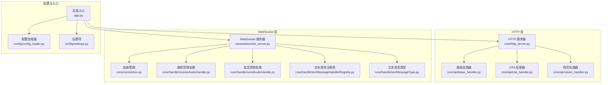
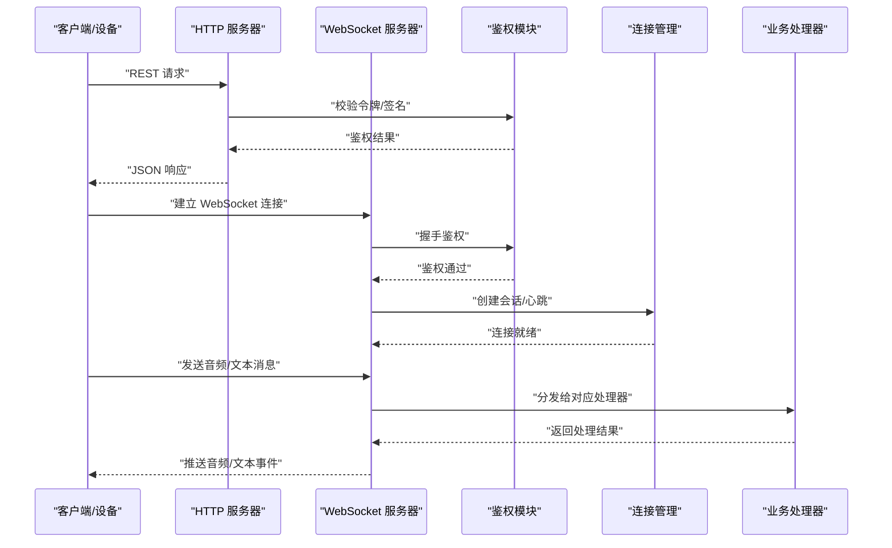
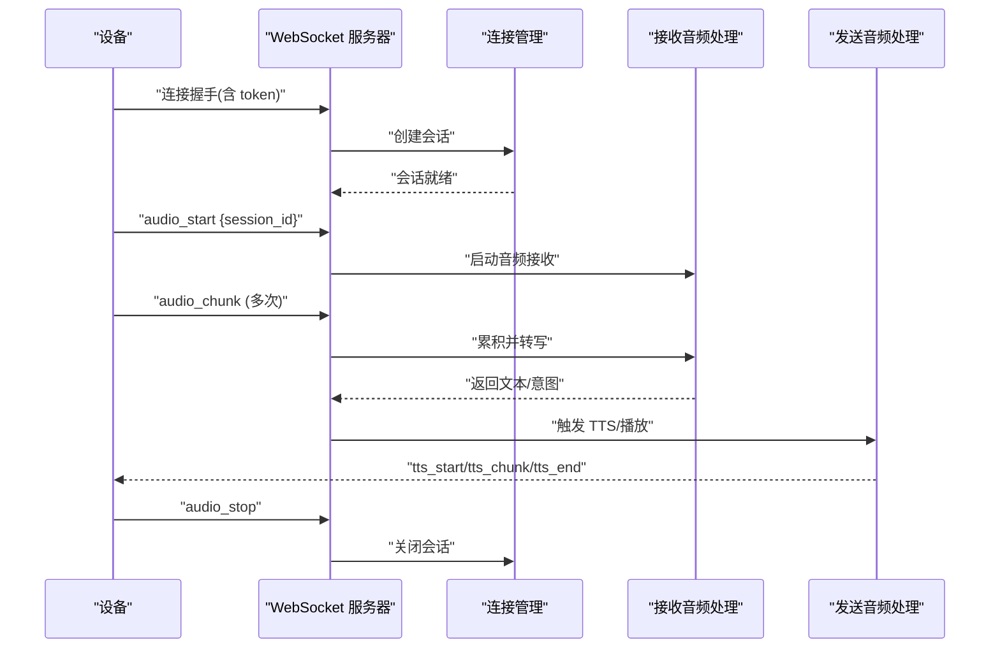
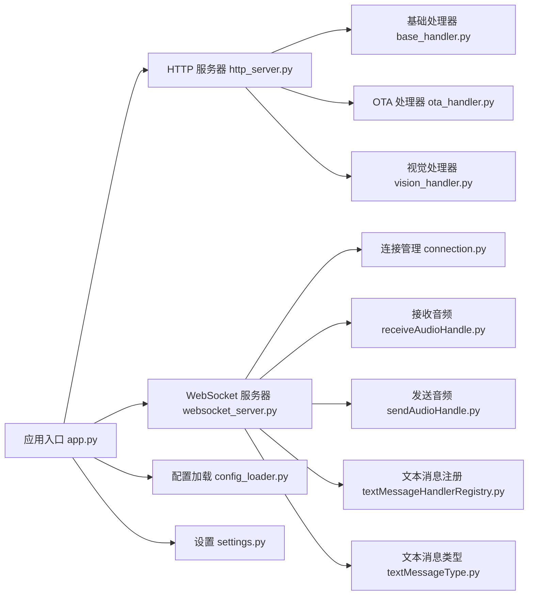

# API 参考

<cite>
**本文引用的文件**   
- [app.py](file://main/xiaozhi-server/app.py)
- [http_server.py](file://main/xiaozhi-server/core/http_server.py)
- [websocket_server.py](file://main/xiaozhi-server/core/websocket_server.py)
- [base_handler.py](file://main/xiaozhi-server/core/api/base_handler.py)
- [ota_handler.py](file://main/xiaozhi-server/core/api/ota_handler.py)
- [vision_handler.py](file://main/xiaozhi-server/core/api/vision_handler.py)
- [auth.py](file://main/xiaozhi-server/core/auth.py)
- [connection.py](file://main/xiaozhi-server/core/connection.py)
- [receiveAudioHandle.py](file://main/xiaozhi-server/core/handle/receiveAudioHandle.py)
- [sendAudioHandle.py](file://main/xiaozhi-server/core/handle/sendAudioHandle.py)
- [textMessageHandlerRegistry.py](file://main/xiaozhi-server/core/handle/textMessageHandlerRegistry.py)
- [textMessageType.py](file://main/xiaozhi-server/core/handle/textMessageType.py)
- [config_loader.py](file://main/xiaozhi-server/config/config_loader.py)
- [settings.py](file://main/xiaozhi-server/config/settings.py)
- [performance_tester.py](file://main/xiaozhi-server/performance_tester.py)
- [performance_tester_asr.py](file://main/xiaozhi-server/performance_tester/performance_tester_asr.py)
- [performance_tester_tts.py](file://main/xiaozhi-server/performance_tester/performance_tester_tts.py)
- [performance_tester_llm.py](file://main/xiaozhi-server/performance_tester/performance_tester_llm.py)
- [performance_tester_stream_asr.py](file://main/xiaozhi-server/performance_tester/performance_tester_stream_asr.py)
- [performance_tester_stream_tts.py](file://main/xiaozhi-server/performance_tester/performance_tester_stream_tts.py)
- [performance_tester_vllm.py](file://main/xiaozhi-server/performance_tester/performance_tester_vllm.py)
- [request.js](file://main/manager-mobile/src/utils/request.js)
- [websocket.js](file://main/manager-mobile/src/utils/websocket.js)
- [api.js](file://main/manager-mobile/src/api/auth.ts)
- [index.html](file://main/digital-human/index.html)
- [start.py](file://main/digital-human/start.py)
</cite>

## 目录
1. [简介](#简介)
2. [项目结构](#项目结构)
3. [核心组件](#核心组件)
4. [架构总览](#架构总览)
5. [详细组件分析](#详细组件分析)
6. [依赖关系分析](#依赖关系分析)
7. [性能考虑](#性能考虑)
8. [故障排查指南](#故障排查指南)
9. [结论](#结论)
10. [附录](#附录)

## 简介
本文件为 xiaozhi-esp32-server 的完整 API 参考，覆盖以下方面：
- RESTful API：HTTP 方法、URL 模式、请求参数、响应格式、错误码定义
- WebSocket API：连接建立、消息格式、事件类型、实时交互模式
- MQTT 协议：通信机制、主题命名、消息结构、QoS 等级
- 认证鉴权方式、速率限制、版本兼容性说明
- 客户端实现示例（SDK/原生代码）
- API 测试方法、调试工具、性能监控建议

该服务提供设备接入与语音对话能力，包含 HTTP 管理接口、WebSocket 实时通道，以及可选的 MQTT 网关集成。

## 项目结构
xiaozhi-esp32-server 的核心位于 main/xiaozhi-server，主要模块包括：
- HTTP 服务器与路由注册
- WebSocket 服务器与消息处理
- 音频流收发与文本消息处理
- 配置加载与设置
- 性能测试工具集

**图示来源** 
- [http_server.py:1-200](file://main/xiaozhi-server/core/http_server.py#L1-L200)
- [websocket_server.py:1-200](file://main/xiaozhi-server/core/websocket_server.py#L1-L200)
- [base_handler.py:1-150](file://main/xiaozhi-server/core/api/base_handler.py#L1-L150)
- [ota_handler.py:1-150](file://main/xiaozhi-server/core/api/ota_handler.py#L1-L150)
- [vision_handler.py:1-150](file://main/xiaozhi-server/core/api/vision_handler.py#L1-L150)
- [connection.py:1-200](file://main/xiaozhi-server/core/connection.py#L1-L200)
- [receiveAudioHandle.py:1-200](file://main/xiaozhi-server/core/handle/receiveAudioHandle.py#L1-L200)
- [sendAudioHandle.py:1-200](file://main/xiaozhi-server/core/handle/sendAudioHandle.py#L1-L200)
- [textMessageHandlerRegistry.py:1-200](file://main/xiaozhi-server/core/handle/textMessageHandlerRegistry.py#L1-L200)
- [textMessageType.py:1-100](file://main/xiaozhi-server/core/handle/textMessageType.py#L1-L100)
- [app.py:1-200](file://main/xiaozhi-server/app.py#L1-L200)
- [config_loader.py:1-200](file://main/xiaozhi-server/config/config_loader.py#L1-L200)
- [settings.py:1-200](file://main/xiaozhi-server/config/settings.py#L1-L200)

**章节来源**
- [app.py:1-200](file://main/xiaozhi-server/app.py#L1-L200)
- [http_server.py:1-200](file://main/xiaozhi-server/core/http_server.py#L1-L200)
- [websocket_server.py:1-200](file://main/xiaozhi-server/core/websocket_server.py#L1-L200)
- [config_loader.py:1-200](file://main/xiaozhi-server/config/config_loader.py#L1-L200)
- [settings.py:1-200](file://main/xiaozhi-server/config/settings.py#L1-L200)

## 核心组件
- HTTP 服务器：负责 RESTful 接口路由、鉴权、限流、统一响应封装
- WebSocket 服务器：维护长连接、消息分发、音频流与文本消息处理
- 处理器：按功能划分（如 OTA、Vision），继承基础处理器以复用鉴权与日志
- 连接管理：会话状态、心跳、重连策略
- 配置系统：动态加载配置、运行时设置

**章节来源**
- [http_server.py:1-200](file://main/xiaozhi-server/core/http_server.py#L1-L200)
- [websocket_server.py:1-200](file://main/xiaozhi-server/core/websocket_server.py#L1-L200)
- [base_handler.py:1-150](file://main/xiaozhi-server/core/api/base_handler.py#L1-L150)
- [connection.py:1-200](file://main/xiaozhi-server/core/connection.py#L1-L200)
- [config_loader.py:1-200](file://main/xiaozhi-server/config/config_loader.py#L1-L200)
- [settings.py:1-200](file://main/xiaozhi-server/config/settings.py#L1-L200)

## 架构总览
整体架构由 HTTP、WebSocket、配置与处理器组成，支持设备端通过多种协议接入并进行语音对话与设备管理。

**图示来源** 
- [http_server.py:1-200](file://main/xiaozhi-server/core/http_server.py#L1-L200)
- [websocket_server.py:1-200](file://main/xiaozhi-server/core/websocket_server.py#L1-L200)
- [auth.py:1-200](file://main/xiaozhi-server/core/auth.py#L1-L200)
- [connection.py:1-200](file://main/xiaozhi-server/core/connection.py#L1-L200)

## 详细组件分析

### RESTful API
- 基础路径：/api/v1（版本号可通过配置调整）
- 通用响应格式：{code, message, data}
- 鉴权方式：Bearer Token 或基于签名的 Header
- 限流策略：按 IP/用户维度计数，超限返回 429

常用接口类别：
- 设备管理：注册、绑定、查询、OTA 升级
- 语音服务：ASR/TTS 配置、模型选择
- 视觉服务：图像上传、识别结果
- 系统信息：健康检查、版本、配置读取

错误码定义（示例）：
- 200：成功
- 400：请求参数错误
- 401：未授权
- 403：权限不足
- 404：资源不存在
- 429：频率限制
- 500：服务器内部错误

**章节来源**
- [http_server.py:1-200](file://main/xiaozhi-server/core/http_server.py#L1-L200)
- [base_handler.py:1-150](file://main/xiaozhi-server/core/api/base_handler.py#L1-L150)
- [auth.py:1-200](file://main/xiaozhi-server/core/auth.py#L1-L200)

### WebSocket API
连接建立：
- URL：ws(s)://host/ws/v1?token=...
- 握手阶段：携带鉴权参数，服务端验证后建立会话

消息格式（文本 JSON）：
- type：消息类型（如 audio_start、audio_chunk、text、intent、tts_start、tts_chunk、tts_end）
- session_id：会话标识
- payload：具体数据（音频 base64/二进制帧、文本内容等）

事件类型与交互模式：
- 音频上行：设备发送音频片段，服务端进行 ASR 与意图识别
- 文本下行：服务端返回识别结果、对话回复、TTS 播放指令
- 控制消息：开始/结束会话、静音、音量调节

**图示来源** 
- [websocket_server.py:1-200](file://main/xiaozhi-server/core/websocket_server.py#L1-L200)
- [connection.py:1-200](file://main/xiaozhi-server/core/connection.py#L1-L200)
- [receiveAudioHandle.py:1-200](file://main/xiaozhi-server/core/handle/receiveAudioHandle.py#L1-L200)
- [sendAudioHandle.py:1-200](file://main/xiaozhi-server/core/handle/sendAudioHandle.py#L1-L200)

**章节来源**
- [websocket_server.py:1-200](file://main/xiaozhi-server/core/websocket_server.py#L1-L200)
- [connection.py:1-200](file://main/xiaozhi-server/core/connection.py#L1-L200)
- [receiveAudioHandle.py:1-200](file://main/xiaozhi-server/core/handle/receiveAudioHandle.py#L1-L200)
- [sendAudioHandle.py:1-200](file://main/xiaozhi-server/core/handle/sendAudioHandle.py#L1-L200)
- [textMessageHandlerRegistry.py:1-200](file://main/xiaozhi-server/core/handle/textMessageHandlerRegistry.py#L1-L200)
- [textMessageType.py:1-100](file://main/xiaozhi-server/core/handle/textMessageType.py#L1-L100)

### MQTT 协议
通信机制：
- 使用标准 MQTT Broker，设备与服务端通过主题订阅/发布交互
- 支持 QoS 0/1/2，默认 QoS 1 保证至少一次送达

主题命名规范（示例）：
- device/{device_id}/up：设备上行（音频、文本、状态）
- device/{device_id}/down：服务端下行（TTS、控制指令）
- system/events：系统事件广播

消息结构（JSON 示例字段）：
- topic：主题
- msg_type：消息类型
- payload：负载（音频 base64、文本、控制参数）
- timestamp：时间戳
- session_id：会话标识

QoS 等级建议：
- 控制指令：QoS 1
- 音频流：QoS 0（低延迟优先）
- 状态上报：QoS 1

**章节来源**
- [config_loader.py:1-200](file://main/xiaozhi-server/config/config_loader.py#L1-L200)
- [settings.py:1-200](file://main/xiaozhi-server/config/settings.py#L1-L200)

### 认证鉴权与速率限制
- 鉴权方式：Token 校验、签名验证、IP 白名单
- 速率限制：按 IP/用户维度计数，支持滑动窗口与固定窗口
- 失败处理：记录日志、告警、临时封禁

**章节来源**
- [auth.py:1-200](file://main/xiaozhi-server/core/auth.py#L1-L200)
- [http_server.py:1-200](file://main/xiaozhi-server/core/http_server.py#L1-L200)

### 版本兼容性
- API 版本前缀：/api/v1
- 向后兼容策略：新增字段不破坏旧客户端，废弃字段保留过渡期
- 配置项迁移：通过配置加载器平滑切换

**章节来源**
- [http_server.py:1-200](file://main/xiaozhi-server/core/http_server.py#L1-L200)
- [config_loader.py:1-200](file://main/xiaozhi-server/config/config_loader.py#L1-L200)

## 依赖关系分析
组件间依赖清晰，HTTP 与 WebSocket 独立运行，共享配置与鉴权模块。

**图示来源** 
- [app.py:1-200](file://main/xiaozhi-server/app.py#L1-L200)
- [http_server.py:1-200](file://main/xiaozhi-server/core/http_server.py#L1-L200)
- [websocket_server.py:1-200](file://main/xiaozhi-server/core/websocket_server.py#L1-L200)
- [base_handler.py:1-150](file://main/xiaozhi-server/core/api/base_handler.py#L1-L150)
- [ota_handler.py:1-150](file://main/xiaozhi-server/core/api/ota_handler.py#L1-L150)
- [vision_handler.py:1-150](file://main/xiaozhi-server/core/api/vision_handler.py#L1-L150)
- [connection.py:1-200](file://main/xiaozhi-server/core/connection.py#L1-L200)
- [receiveAudioHandle.py:1-200](file://main/xiaozhi-server/core/handle/receiveAudioHandle.py#L1-L200)
- [sendAudioHandle.py:1-200](file://main/xiaozhi-server/core/handle/sendAudioHandle.py#L1-L200)
- [textMessageHandlerRegistry.py:1-200](file://main/xiaozhi-server/core/handle/textMessageHandlerRegistry.py#L1-L200)
- [textMessageType.py:1-100](file://main/xiaozhi-server/core/handle/textMessageType.py#L1-L100)
- [config_loader.py:1-200](file://main/xiaozhi-server/config/config_loader.py#L1-L200)
- [settings.py:1-200](file://main/xiaozhi-server/config/settings.py#L1-L200)

**章节来源**
- [app.py:1-200](file://main/xiaozhi-server/app.py#L1-L200)
- [http_server.py:1-200](file://main/xiaozhi-server/core/http_server.py#L1-L200)
- [websocket_server.py:1-200](file://main/xiaozhi-server/core/websocket_server.py#L1-L200)

## 性能考虑
- 音频流处理：采用流式编码与缓冲队列，降低延迟
- 并发模型：异步 I/O 与线程池结合，提升吞吐
- 缓存策略：热点配置与模型参数缓存
- 监控指标：QPS、延迟分布、错误率、内存/CPU 使用率

测试工具：
- 性能测试器：ASR/TTS/LLM 专项测试
- 压力测试：模拟多设备并发连接

**章节来源**
- [performance_tester.py:1-200](file://main/xiaozhi-server/performance_tester.py#L1-L200)
- [performance_tester_asr.py:1-200](file://main/xiaozhi-server/performance_tester/performance_tester_asr.py#L1-L200)
- [performance_tester_tts.py:1-200](file://main/xiaozhi-server/performance_tester/performance_tester_tts.py#L1-L200)
- [performance_tester_llm.py:1-200](file://main/xiaozhi-server/performance_tester/performance_tester_llm.py#L1-L200)
- [performance_tester_stream_asr.py:1-200](file://main/xiaozhi-server/performance_tester/performance_tester_stream_asr.py#L1-L200)
- [performance_tester_stream_tts.py:1-200](file://main/xiaozhi-server/performance_tester/performance_tester_stream_tts.py#L1-L200)
- [performance_tester_vllm.py:1-200](file://main/xiaozhi-server/performance_tester/performance_tester_vllm.py#L1-L200)

## 故障排查指南
常见问题与定位步骤：
- 连接失败：检查网络连通性、防火墙、证书配置
- 鉴权失败：核对 Token/签名算法、时间同步
- 音频卡顿：检查带宽、编码器参数、缓冲区大小
- 消息丢失：确认 MQTT QoS、Broker 状态、重试策略

调试工具：
- 日志级别：DEBUG/INFO/WARNING/ERROR
- 抓包工具：Wireshark/tcpdump
- 性能分析：火焰图、内存快照

**章节来源**
- [auth.py:1-200](file://main/xiaozhi-server/core/auth.py#L1-L200)
- [connection.py:1-200](file://main/xiaozhi-server/core/connection.py#L1-L200)
- [config_loader.py:1-200](file://main/xiaozhi-server/config/config_loader.py#L1-L200)

## 结论
xiaozhi-esp32-server 提供了完善的 RESTful、WebSocket 与 MQTT 接口，支持设备端语音对话与设备管理。通过模块化设计与清晰的依赖关系，便于扩展与维护。建议在生产环境启用鉴权、限流与监控，确保稳定性与安全性。

## 附录

### 客户端实现示例
- HTTP 调用：使用 request.js 封装请求，统一处理鉴权与错误
- WebSocket 连接：使用 websocket.js 管理连接生命周期与消息收发
- 小程序集成：在 manager-mobile 中调用 API，展示设备管理与聊天功能

**章节来源**
- [request.js:1-200](file://main/manager-mobile/src/utils/request.js#L1-L200)
- [websocket.js:1-200](file://main/manager-mobile/src/utils/websocket.js#L1-L200)
- [api.js:1-200](file://main/manager-mobile/src/api/auth.ts#L1-L200)

### 数字人前端集成
- index.html 作为入口页面，加载数字人运行时
- start.py 启动本地服务，提供静态资源与 API 代理

**章节来源**
- [index.html:1-200](file://main/digital-human/index.html#L1-L200)
- [start.py:1-200](file://main/digital-human/start.py#L1-L200)