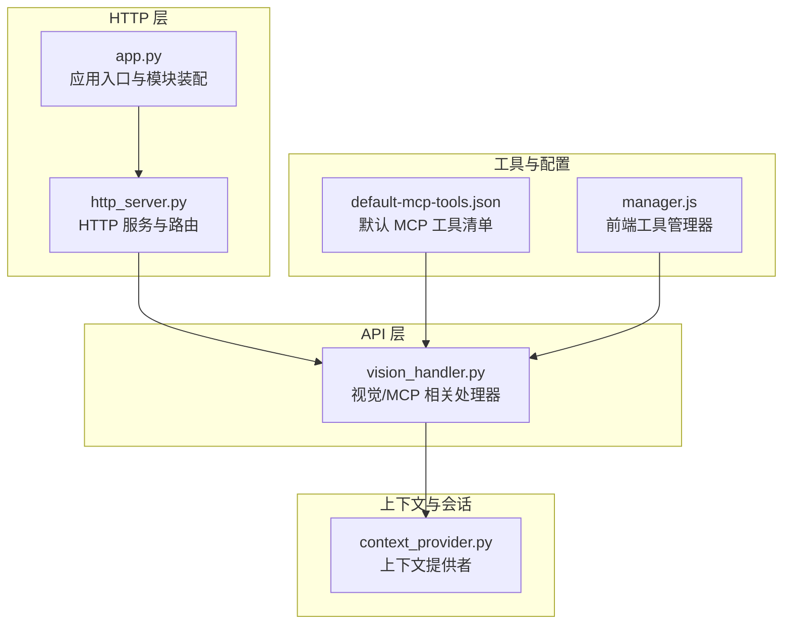
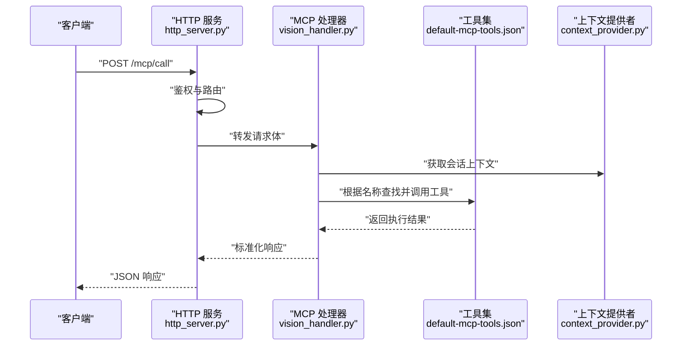
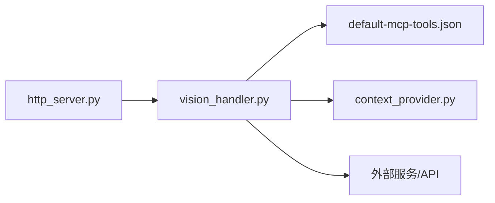

# MCP 端点接口

<cite>
**本文引用的文件**   
- [mcp-endpoint-integration.md](file://docs/mcp-endpoint-integration.md)
- [mcp-get-device-info.md](file://docs/mcp-get-device-info.md)
- [mcp-vision-integration.md](file://docs/mcp-vision-integration.md)
- [app.py](file://main/xiaozhi-server/app.py)
- [http_server.py](file://main/xiaozhi-server/core/http_server.py)
- [vision_handler.py](file://main/xiaozhi-server/core/api/vision_handler.py)
- [context_provider.py](file://main/xiaozhi-server/core/utils/context_provider.py)
- [default-mcp-tools.json](file://main/digital-human/js/config/default-mcp-tools.json)
- [manager.js](file://main/digital-human/js/config/manager.js)
</cite>

## 目录
1. [简介](#简介)
2. [项目结构](#项目结构)
3. [核心组件](#核心组件)
4. [架构总览](#架构总览)
5. [详细组件分析](#详细组件分析)
6. [依赖关系分析](#依赖关系分析)
7. [性能考量](#性能考量)
8. [故障排查指南](#故障排查指南)
9. [结论](#结论)
10. [附录](#附录)

## 简介
本文件面向 xiaozhi-esp32-server 的 MCP（Model Context Protocol）端点，系统性说明协议集成方式、端点配置、工具注册机制、调用与返回格式、上下文与会话管理、权限控制策略、内置工具示例、自定义扩展方法、客户端集成流程、异步响应处理、错误处理、日志记录与性能监控。文档以仓库内现有实现为依据，结合相关文档进行结构化阐述，帮助开发者快速接入并安全高效地使用 MCP 能力。

## 项目结构
MCP 相关能力主要分布在以下位置：
- 服务端 HTTP 服务与路由挂载
- MCP 工具定义与默认配置
- MCP 集成文档与示例
- 上下文提供者与对话状态管理

图表来源
- [http_server.py:1-200](file://main/xiaozhi-server/core/http_server.py#L1-L200)
- [app.py:1-200](file://main/xiaozhi-server/app.py#L1-L200)
- [vision_handler.py:1-200](file://main/xiaozhi-server/core/api/vision_handler.py#L1-L200)
- [default-mcp-tools.json:1-200](file://main/digital-human/js/config/default-mcp-tools.json#L1-L200)
- [manager.js:1-200](file://main/digital-human/js/config/manager.js#L1-L200)

章节来源
- [mcp-endpoint-integration.md:1-200](file://docs/mcp-endpoint-integration.md#L1-L200)
- [mcp-get-device-info.md:1-200](file://docs/mcp-get-device-info.md#L1-L200)
- [mcp-vision-integration.md:1-200](file://docs/mcp-vision-integration.md#L1-L200)
- [http_server.py:1-200](file://main/xiaozhi-server/core/http_server.py#L1-L200)
- [app.py:1-200](file://main/xiaozhi-server/app.py#L1-L200)
- [vision_handler.py:1-200](file://main/xiaozhi-server/core/api/vision_handler.py#L1-L200)
- [default-mcp-tools.json:1-200](file://main/digital-human/js/config/default-mcp-tools.json#L1-L200)
- [manager.js:1-200](file://main/digital-human/js/config/manager.js#L1-L200)

## 核心组件
- HTTP 服务与路由：负责暴露 MCP 端点、鉴权拦截、请求分发与响应封装。
- MCP 处理器：承载具体工具调用逻辑，参数校验、上下文注入、结果序列化。
- 工具注册与发现：通过默认工具清单与动态注册机制，提供统一工具目录。
- 上下文提供者：为工具调用提供会话级上下文（设备信息、用户身份、历史等）。
- 前端工具管理器：用于发现、编排与调用工具，支持异步回调与事件驱动。

章节来源
- [http_server.py:1-200](file://main/xiaozhi-server/core/http_server.py#L1-L200)
- [vision_handler.py:1-200](file://main/xiaozhi-server/core/api/vision_handler.py#L1-L200)
- [default-mcp-tools.json:1-200](file://main/digital-human/js/config/default-mcp-tools.json#L1-L200)
- [context_provider.py:1-200](file://main/xiaozhi-server/core/utils/context_provider.py#L1-L200)
- [manager.js:1-200](file://main/digital-human/js/config/manager.js#L1-L200)

## 架构总览
MCP 端点采用“HTTP 路由 -> 处理器 -> 工具执行 -> 上下文/外部服务”的分层架构。请求进入后由 HTTP 层完成鉴权与路由，随后交由 MCP 处理器解析参数、注入上下文、调用目标工具，最终将结果按协议规范返回。

图表来源
- [http_server.py:1-200](file://main/xiaozhi-server/core/http_server.py#L1-L200)
- [vision_handler.py:1-200](file://main/xiaozhi-server/core/api/vision_handler.py#L1-L200)
- [default-mcp-tools.json:1-200](file://main/digital-human/js/config/default-mcp-tools.json#L1-L200)
- [context_provider.py:1-200](file://main/xiaozhi-server/core/utils/context_provider.py#L1-L200)

## 详细组件分析

### MCP 端点与路由
- 端点路径：通常以 /mcp/* 形式暴露，如 /mcp/call 用于工具调用，/mcp/tools 用于工具发现。
- 请求方法：RESTful 风格，常用 POST 提交调用请求；GET 用于查询工具列表或元数据。
- 鉴权策略：在 HTTP 层统一拦截，校验 Token/签名/设备白名单等，失败直接返回 401/403。
- 请求体规范：包含工具名、参数对象、会话标识、可选的上下文键值对。
- 响应体规范：包含状态码、消息、数据载荷、追踪 ID 等字段。

章节来源
- [mcp-endpoint-integration.md:1-200](file://docs/mcp-endpoint-integration.md#L1-L200)
- [http_server.py:1-200](file://main/xiaozhi-server/core/http_server.py#L1-L200)

### 工具注册与发现机制
- 默认工具清单：通过 JSON 配置文件集中声明工具名称、描述、参数 schema、权限要求等。
- 动态注册：运行时可加载额外工具模块，合并到全局工具目录，支持热更新。
- 工具发现接口：客户端可通过 GET /mcp/tools 获取可用工具列表与元数据。
- 版本兼容：工具清单支持版本号与弃用标记，便于平滑升级。

章节来源
- [default-mcp-tools.json:1-200](file://main/digital-human/js/config/default-mcp-tools.json#L1-L200)
- [mcp-endpoint-integration.md:1-200](file://docs/mcp-endpoint-integration.md#L1-L200)

### 工具调用接口与参数传递
- 调用入口：POST /mcp/call，请求体包含 tool、params、session_id、ctx 等字段。
- 参数校验：基于 schema 进行类型与必填项校验，错误时返回明确错误码与提示。
- 上下文注入：处理器从上下文提供者读取会话状态、设备信息、用户角色等。
- 结果返回：统一包装为 {code, message, data, trace_id}，data 中携带工具输出。

章节来源
- [vision_handler.py:1-200](file://main/xiaozhi-server/core/api/vision_handler.py#L1-L200)
- [mcp-get-device-info.md:1-200](file://docs/mcp-get-device-info.md#L1-L200)

### 上下文管理与会话状态保持
- 上下文提供者：维护会话级数据（设备、用户、偏好、历史摘要），支持读写与过期策略。
- 会话生命周期：随连接建立创建，空闲超时回收，支持显式刷新与清理。
- 权限隔离：不同角色的上下文可见范围受限，敏感字段按需脱敏。
- 持久化：关键上下文可落库或缓存，保证跨实例共享与恢复。

章节来源
- [context_provider.py:1-200](file://main/xiaozhi-server/core/utils/context_provider.py#L1-L200)
- [mcp-endpoint-integration.md:1-200](file://docs/mcp-endpoint-integration.md#L1-L200)

### 权限控制策略
- 鉴权前置：所有 MCP 端点在 HTTP 层统一鉴权，支持 Token、签名、IP 白名单。
- 工具级权限：工具清单中声明所需角色或能力，处理器在执行前校验。
- 审计日志：记录调用者、工具名、参数摘要、结果状态，便于追溯与合规。

章节来源
- [http_server.py:1-200](file://main/xiaozhi-server/core/http_server.py#L1-L200)
- [default-mcp-tools.json:1-200](file://main/digital-human/js/config/default-mcp-tools.json#L1-L200)

### 内置工具调用示例
- 获取设备信息：调用 device_info 工具，返回设备型号、固件版本、网络状态等。
- 视觉能力：调用 vision_* 系列工具，支持图像识别、OCR、场景理解等。
- 参数示例：参考对应文档中的请求体结构与字段说明。

章节来源
- [mcp-get-device-info.md:1-200](file://docs/mcp-get-device-info.md#L1-L200)
- [mcp-vision-integration.md:1-200](file://docs/mcp-vision-integration.md#L1-L200)

### 自定义工具的扩展方法
- 新增工具：在工具清单中添加条目，实现处理器中的工具函数，确保参数 schema 一致。
- 模块加载：将工具函数放入 plugins_func 或 tools 目录，按约定命名与导出。
- 测试验证：使用 /mcp/tools 发现与 /mcp/call 调用进行端到端验证。

章节来源
- [default-mcp-tools.json:1-200](file://main/digital-human/js/config/default-mcp-tools.json#L1-L200)
- [mcp-endpoint-integration.md:1-200](file://docs/mcp-endpoint-integration.md#L1-L200)

### 客户端集成指南
- 工具发现：先调用 GET /mcp/tools 获取工具列表与元数据。
- 调用流程：构造 POST /mcp/call 请求，携带 tool、params、session_id、ctx。
- 异步响应：长耗时操作建议返回任务 ID，客户端轮询或通过回调通知。
- 错误处理：根据 code 与 message 分支处理，重试与降级策略需完善。

章节来源
- [manager.js:1-200](file://main/digital-human/js/config/manager.js#L1-L200)
- [mcp-endpoint-integration.md:1-200](file://docs/mcp-endpoint-integration.md#L1-L200)

### 错误处理与日志记录
- 错误分类：参数错误、鉴权失败、工具执行异常、上下文缺失等。
- 错误码：统一编码体系，便于客户端区分与重试。
- 日志级别：DEBUG/INFO/WARN/ERROR，记录关键路径与异常堆栈。
- 可观测性：trace_id 贯穿全链路，配合指标采集与告警。

章节来源
- [http_server.py:1-200](file://main/xiaozhi-server/core/http_server.py#L1-L200)
- [vision_handler.py:1-200](file://main/xiaozhi-server/core/api/vision_handler.py#L1-L200)

### 性能监控与优化
- 指标采集：QPS、延迟分布、错误率、资源占用。
- 热点优化：参数校验提前、上下文缓存、工具并行调用。
- 限流熔断：针对高负载工具实施限流与熔断保护。

章节来源
- [mcp-endpoint-integration.md:1-200](file://docs/mcp-endpoint-integration.md#L1-L200)

## 依赖关系分析
MCP 端点依赖 HTTP 服务、工具清单、上下文提供者与外部服务（如视觉模型、设备 API）。

图表来源
- [http_server.py:1-200](file://main/xiaozhi-server/core/http_server.py#L1-L200)
- [vision_handler.py:1-200](file://main/xiaozhi-server/core/api/vision_handler.py#L1-L200)
- [default-mcp-tools.json:1-200](file://main/digital-human/js/config/default-mcp-tools.json#L1-L200)
- [context_provider.py:1-200](file://main/xiaozhi-server/core/utils/context_provider.py#L1-L200)

章节来源
- [app.py:1-200](file://main/xiaozhi-server/app.py#L1-L200)
- [http_server.py:1-200](file://main/xiaozhi-server/core/http_server.py#L1-L200)

## 性能考量
- 请求批处理：批量工具调用减少握手开销。
- 上下文缓存：热点数据本地缓存，降低远程访问。
- 异步化改造：I/O 密集操作非阻塞处理，提升吞吐。
- 资源隔离：不同租户/设备独立线程池与内存配额。

[本节为通用指导，不直接分析具体文件]

## 故障排查指南
- 常见问题：鉴权失败、参数校验错误、上下文缺失、工具未注册。
- 定位步骤：检查 trace_id、查看错误码、核对工具清单、验证上下文键。
- 日志要点：关注 HTTP 层拦截日志、处理器入参出参、外部服务响应。
- 恢复策略：重试、降级、回滚上下文、重启服务。

章节来源
- [http_server.py:1-200](file://main/xiaozhi-server/core/http_server.py#L1-L200)
- [vision_handler.py:1-200](file://main/xiaozhi-server/core/api/vision_handler.py#L1-L200)

## 结论
MCP 端点通过清晰的 HTTP 路由、统一的处理器与工具注册机制，实现了可扩展、可观测、可治理的工具调用能力。结合上下文提供者与权限控制，能够支撑多设备、多用户的复杂场景。建议在生产环境完善监控、限流与审计，确保稳定性与安全性。

[本节为总结性内容，不直接分析具体文件]

## 附录
- 术语表：MCP、HTTP、JSON、Schema、Trace、QPS、SLA
- 参考链接：仓库内 MCP 相关文档与示例

[本节为补充信息，不直接分析具体文件]