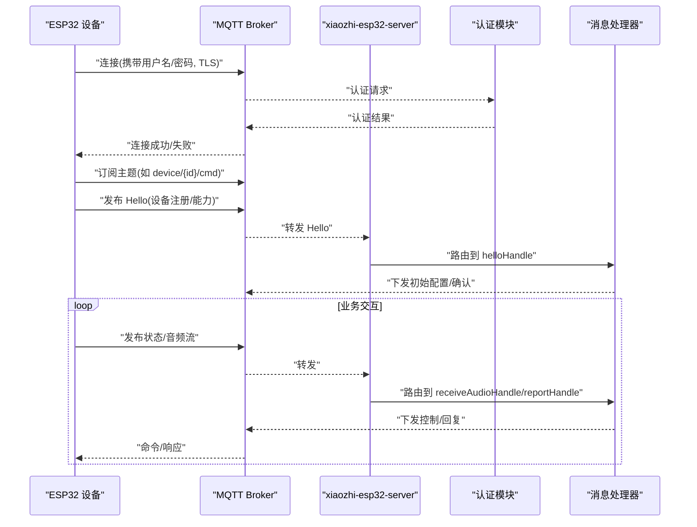
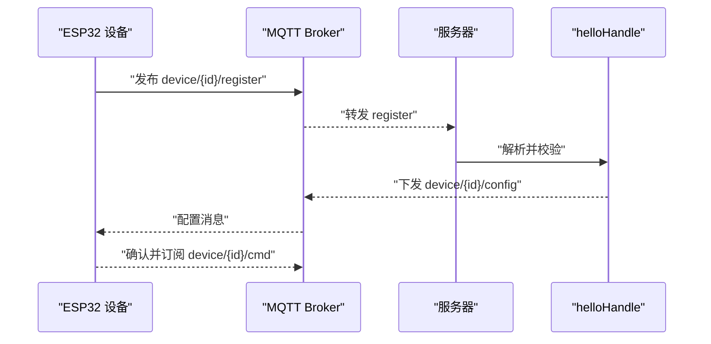
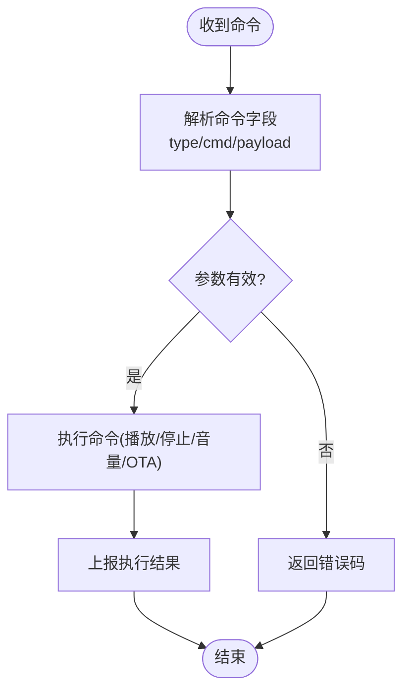
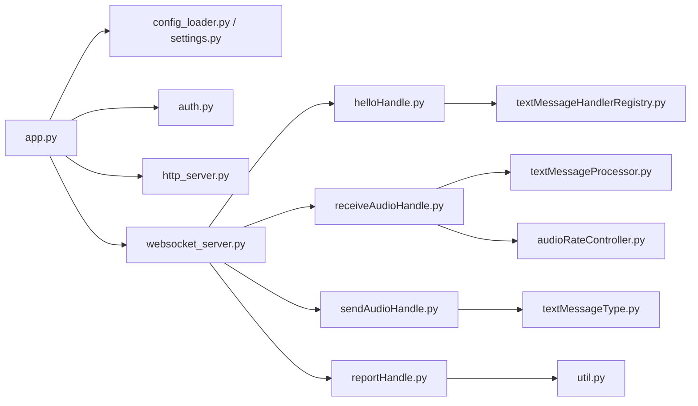

# MQTT 协议

<cite>
**本文引用的文件**   
- [mqtt-gateway-architecture-analysis.md](file://docs/custom/mqtt-gateway-architecture-analysis.md)
- [thread-pool-and-connection-optimization.md](file://docs/custom/thread-pool-and-connection-optimization.md)
- [app.py](file://main/xiaozhi-server/app.py)
- [config_loader.py](file://main/xiaozhi-server/config/config_loader.py)
- [settings.py](file://main/xiaozhi-server/config/settings.py)
- [auth.py](file://main/xiaozhi-server/core/auth.py)
- [websocket_server.py](file://main/xiaozhi-server/core/websocket_server.py)
- [http_server.py](file://main/xiaozhi-server/core/http_server.py)
- [receiveAudioHandle.py](file://main/xiaozhi-server/core/handle/receiveAudioHandle.py)
- [sendAudioHandle.py](file://main/xiaozhi-server/core/handle/sendAudioHandle.py)
- [reportHandle.py](file://main/xiaozhi-server/core/handle/reportHandle.py)
- [helloHandle.py](file://main/xiaozhi-server/core/handle/helloHandle.py)
- [textMessageHandlerRegistry.py](file://main/xiaozhi-server/core/handle/textMessageHandlerRegistry.py)
- [textMessageProcessor.py](file://main/xiaozhi-server/core/handle/textMessageProcessor.py)
- [textMessageType.py](file://main/xiaozhi-server/core/handle/textMessageType.py)
- [audioRateController.py](file://main/xiaozhi-server/core/utils/audioRateController.py)
- [util.py](file://main/xiaozhi-server/core/utils/util.py)
- [docker-compose.yml](file://main/xiaozhi-server/docker-compose.yml)
</cite>

## 目录
1. [简介](#简介)
2. [项目结构](#项目结构)
3. [核心组件](#核心组件)
4. [架构总览](#架构总览)
5. [详细组件分析](#详细组件分析)
6. [依赖关系分析](#依赖关系分析)
7. [性能考虑](#性能考虑)
8. [故障排查指南](#故障排查指南)
9. [结论](#结论)
10. [附录](#附录)

## 简介
本技术文档围绕 xiaozhi-esp32-server 的 MQTT 协议集成，系统性阐述 MQTT 网关架构设计、主题命名规范、消息格式定义与处理流程。重点覆盖设备注册、配置下发、状态上报、命令控制等核心能力，并给出 QoS 等级选择、保留消息与遗嘱消息的配置建议。同时说明安全认证机制（用户名/密码、TLS）、访问控制列表（ACL）策略，以及客户端实现要点（订阅主题、发布消息、回调处理）。最后提供性能调优、连接池管理与故障恢复策略，帮助读者在生产环境中稳定部署与运维。

## 项目结构
MQTT 相关能力主要分布在以下位置：
- 自定义设计与优化文档：位于 docs/custom 下，包含 MQTT 网关架构分析与线程池/连接优化方案。
- 服务器入口与配置加载：main/xiaozhi-server/app.py、config/config_loader.py、config/settings.py。
- 核心模块：core/auth.py（认证）、core/websocket_server.py（WebSocket 服务）、core/http_server.py（HTTP API）。
- 消息处理管线：core/handle 下的音频接收/发送、报告、Hello 握手、文本消息处理器与类型定义。
- 工具与辅助：core/utils 下的音频速率控制、通用工具函数。
- 容器编排：docker-compose.yml（用于本地或测试环境快速启动）。

```mermaid
graph TB
subgraph "服务器进程"
APP["应用入口 app.py"]
CFG["配置加载 config_loader.py / settings.py"]
AUTH["认证 auth.py"]
HTTP["HTTP 服务 http_server.py"]
WS["WebSocket 服务 websocket_server.py"]
HANDLERS["消息处理器 handle/*"]
UTILS["工具 utils/*"]
end
subgraph "外部系统"
MQTT_BROKER["MQTT Broker"]
DEVICE["ESP32 设备"]
MANAGER_API["管理端 API"]
end
APP --> CFG
APP --> AUTH
APP --> HTTP
APP --> WS
WS --> HANDLERS
HANDLERS --> UTILS
DEVICE <- --> MQTT_BROKER
MANAGER_API <- --> HTTP
APP -. 可选 .-> MQTT_BROKER
```

图表来源
- [app.py](file://main/xiaozhi-server/app.py)
- [config_loader.py](file://main/xiaozhi-server/config/config_loader.py)
- [settings.py](file://main/xiaozhi-server/config/settings.py)
- [auth.py](file://main/xiaozhi-server/core/auth.py)
- [http_server.py](file://main/xiaozhi-server/core/http_server.py)
- [websocket_server.py](file://main/xiaozhi-server/core/websocket_server.py)
- [receiveAudioHandle.py](file://main/xiaozhi-server/core/handle/receiveAudioHandle.py)
- [sendAudioHandle.py](file://main/xiaozhi-server/core/handle/sendAudioHandle.py)
- [reportHandle.py](file://main/xiaozhi-server/core/handle/reportHandle.py)
- [helloHandle.py](file://main/xiaozhi-server/core/handle/helloHandle.py)
- [textMessageHandlerRegistry.py](file://main/xiaozhi-server/core/handle/textMessageHandlerRegistry.py)
- [textMessageProcessor.py](file://main/xiaozhi-server/core/handle/textMessageProcessor.py)
- [textMessageType.py](file://main/xiaozhi-server/core/handle/textMessageType.py)
- [audioRateController.py](file://main/xiaozhi-server/core/utils/audioRateController.py)
- [util.py](file://main/xiaozhi-server/core/utils/util.py)

章节来源
- [mqtt-gateway-architecture-analysis.md](file://docs/custom/mqtt-gateway-architecture-analysis.md)
- [thread-pool-and-connection-optimization.md](file://docs/custom/thread-pool-and-connection-optimization.md)
- [app.py](file://main/xiaozhi-server/app.py)
- [config_loader.py](file://main/xiaozhi-server/config/config_loader.py)
- [settings.py](file://main/xiaozhi-server/config/settings.py)

## 核心组件
- 应用入口与生命周期管理：负责初始化配置、加载模块、启动 HTTP/WebSocket 服务，并在需要时桥接 MQTT。
- 配置加载与设置：集中管理 MQTT Broker 地址、端口、TLS、认证、QoS、保留/遗嘱等参数。
- 认证与安全：统一鉴权逻辑，支持用户名/密码校验与 TLS 证书验证。
- 消息处理管线：按消息类型路由到对应处理器（音频、文本、报告、握手等），保证高内聚低耦合。
- 工具与辅助：音频编码/解码、速率控制、时间戳与日志等。

章节来源
- [app.py](file://main/xiaozhi-server/app.py)
- [config_loader.py](file://main/xiaozhi-server/config/config_loader.py)
- [settings.py](file://main/xiaozhi-server/config/settings.py)
- [auth.py](file://main/xiaozhi-server/core/auth.py)
- [receiveAudioHandle.py](file://main/xiaozhi-server/core/handle/receiveAudioHandle.py)
- [sendAudioHandle.py](file://main/xiaozhi-server/core/handle/sendAudioHandle.py)
- [reportHandle.py](file://main/xiaozhi-server/core/handle/reportHandle.py)
- [helloHandle.py](file://main/xiaozhi-server/core/handle/helloHandle.py)
- [textMessageHandlerRegistry.py](file://main/xiaozhi-server/core/handle/textMessageHandlerRegistry.py)
- [textMessageProcessor.py](file://main/xiaozhi-server/core/handle/textMessageProcessor.py)
- [textMessageType.py](file://main/xiaozhi-server/core/handle/textMessageType.py)
- [audioRateController.py](file://main/xiaozhi-server/core/utils/audioRateController.py)
- [util.py](file://main/xiaozhi-server/core/utils/util.py)

## 架构总览
MQTT 网关作为设备与服务器之间的消息总线，承担以下职责：
- 设备接入与身份认证：设备通过 MQTT 连接并进行认证，成功后建立会话。
- 主题路由与分发：根据主题前缀与设备标识将消息路由至相应处理器。
- 配置下发与状态同步：服务器向设备下发配置，设备上报运行状态与事件。
- 命令控制与响应：服务器下发控制指令，设备执行后回传结果。
- 安全与可靠性：TLS 加密传输、QoS 保障、保留消息与遗嘱消息提升稳定性。



图表来源
- [app.py](file://main/xiaozhi-server/app.py)
- [auth.py](file://main/xiaozhi-server/core/auth.py)
- [helloHandle.py](file://main/xiaozhi-server/core/handle/helloHandle.py)
- [receiveAudioHandle.py](file://main/xiaozhi-server/core/handle/receiveAudioHandle.py)
- [reportHandle.py](file://main/xiaozhi-server/core/handle/reportHandle.py)

## 详细组件分析

### 主题命名规范
- 设备标识：使用唯一设备 ID（如 MAC 或序列号）作为主题路径中的段。
- 方向约定：
  - 设备 -> 服务器：device/{id}/up
  - 服务器 -> 设备：device/{id}/down
- 功能域划分：
  - 注册/握手：device/{id}/register
  - 配置下发：device/{id}/config
  - 状态上报：device/{id}/status
  - 命令控制：device/{id}/cmd
  - 音频上行：device/{id}/audio/up
  - 音频下行：device/{id}/audio/down
- 保留消息：
  - 在线状态：device/{id}/status（retain=true）
  - 最新配置：device/{id}/config（retain=true）
- QoS 建议：
  - 控制命令：QoS 1（至少一次）
  - 状态上报：QoS 0（最多一次）
  - 音频数据：QoS 0（实时性优先）
  - 注册/握手：QoS 1（确保到达）

章节来源
- [mqtt-gateway-architecture-analysis.md](file://docs/custom/mqtt-gateway-architecture-analysis.md)

### 消息格式定义
- 公共头部：
  - msg_id：消息唯一标识（UUID 或自增序列）
  - ts：时间戳（毫秒）
  - src：来源（设备 ID）
  - dst：目标（服务器或设备 ID）
  - type：消息类型（字符串枚举）
  - payload：业务负载（JSON）
- 典型消息类型：
  - register：设备注册（含设备能力、固件版本）
  - config：配置下发（TTS/ASR/LLM 参数、网络设置）
  - status：状态上报（电量、信号、运行模式）
  - cmd：命令控制（播放、停止、音量、OTA）
  - audio_up/down：音频帧（二进制或 base64 编码，附带采样率、码率）
  - report：运行报告（错误码、耗时、资源占用）

章节来源
- [textMessageType.py](file://main/xiaozhi-server/core/handle/textMessageType.py)
- [textMessageProcessor.py](file://main/xiaozhi-server/core/handle/textMessageProcessor.py)
- [receiveAudioHandle.py](file://main/xiaozhi-server/core/handle/receiveAudioHandle.py)
- [sendAudioHandle.py](file://main/xiaozhi-server/core/handle/sendAudioHandle.py)
- [reportHandle.py](file://main/xiaozhi-server/core/handle/reportHandle.py)
- [helloHandle.py](file://main/xiaozhi-server/core/handle/helloHandle.py)

### 设备注册流程
- 设备连接后发布 register 消息，携带设备基本信息与能力集。
- 服务器校验设备身份与权限，返回配置或拒绝。
- 设备收到配置后进入就绪状态，开始订阅命令主题。



图表来源
- [helloHandle.py](file://main/xiaozhi-server/core/handle/helloHandle.py)
- [textMessageProcessor.py](file://main/xiaozhi-server/core/handle/textMessageProcessor.py)

章节来源
- [helloHandle.py](file://main/xiaozhi-server/core/handle/helloHandle.py)
- [textMessageProcessor.py](file://main/xiaozhi-server/core/handle/textMessageProcessor.py)

### 配置下发与状态上报
- 配置下发：服务器通过 device/{id}/config 推送 TTS/ASR/LLM 参数、网络与功能开关。
- 状态上报：设备周期性或事件触发上报 device/{id}/status，包含电量、信号、运行模式等。
- 保留消息：status 与 config 建议使用 retain=true，便于新设备上线快速获取最新状态与配置。

章节来源
- [reportHandle.py](file://main/xiaozhi-server/core/handle/reportHandle.py)
- [receiveAudioHandle.py](file://main/xiaozhi-server/core/handle/receiveAudioHandle.py)

### 命令控制与音频流
- 命令控制：服务器通过 device/{id}/cmd 下发控制指令（播放、停止、音量、OTA），设备执行后回报结果。
- 音频流：设备通过 device/{id}/audio/up 上传音频帧，服务器处理后通过 device/{id}/audio/down 下发合成语音。
- 速率控制：音频发送需遵循采样率与码率限制，避免阻塞与丢包。



图表来源
- [sendAudioHandle.py](file://main/xiaozhi-server/core/handle/sendAudioHandle.py)
- [receiveAudioHandle.py](file://main/xiaozhi-server/core/handle/receiveAudioHandle.py)
- [audioRateController.py](file://main/xiaozhi-server/core/utils/audioRateController.py)

章节来源
- [sendAudioHandle.py](file://main/xiaozhi-server/core/handle/sendAudioHandle.py)
- [receiveAudioHandle.py](file://main/xiaozhi-server/core/handle/receiveAudioHandle.py)
- [audioRateController.py](file://main/xiaozhi-server/core/utils/audioRateController.py)

### 文本消息处理器与类型
- 文本消息处理器注册表：统一管理不同消息类型的处理器，支持动态扩展。
- 文本消息处理器：负责解析、校验、路由与响应，确保类型安全与可扩展性。
- 消息类型定义：集中定义所有支持的文本消息类型，便于前后端一致。

章节来源
- [textMessageHandlerRegistry.py](file://main/xiaozhi-server/core/handle/textMessageHandlerRegistry.py)
- [textMessageProcessor.py](file://main/xiaozhi-server/core/handle/textMessageProcessor.py)
- [textMessageType.py](file://main/xiaozhi-server/core/handle/textMessageType.py)

### 安全认证与 TLS
- 认证机制：支持用户名/密码认证，结合 ACL 控制主题读写权限。
- TLS 加密：启用 TLS 证书验证，确保传输安全；服务端与客户端均需配置证书链。
- 访问控制列表：按设备 ID 或用户组配置订阅/发布权限，最小化暴露面。

章节来源
- [auth.py](file://main/xiaozhi-server/core/auth.py)
- [settings.py](file://main/xiaozhi-server/config/settings.py)
- [config_loader.py](file://main/xiaozhi-server/config/config_loader.py)

### 客户端实现示例（要点）
- 连接与认证：
  - 使用 MQTT 客户端库（如 paho-mqtt）建立连接，设置用户名/密码与 TLS。
  - 配置遗嘱消息（Last Will）以反映离线状态。
- 订阅主题：
  - 订阅 device/{id}/cmd 与 device/{id}/config，处理 QoS 与回调。
- 发布消息：
  - 发布 register、status、audio/up 等消息，设置 retain 与 QoS。
- 回调处理：
  - on_message 中解析消息类型并路由到对应业务逻辑。
  - on_connect/on_disconnect 中处理重连与状态同步。

章节来源
- [util.py](file://main/xiaozhi-server/core/utils/util.py)
- [settings.py](file://main/xiaozhi-server/config/settings.py)

## 依赖关系分析
MQTT 网关与服务器内部模块的依赖关系如下：
- 应用入口依赖配置加载与认证模块。
- WebSocket/HTTP 服务与消息处理器解耦，通过消息总线（MQTT）进行通信。
- 工具模块为音频处理与通用功能提供支持。



图表来源
- [app.py](file://main/xiaozhi-server/app.py)
- [config_loader.py](file://main/xiaozhi-server/config/config_loader.py)
- [settings.py](file://main/xiaozhi-server/config/settings.py)
- [auth.py](file://main/xiaozhi-server/core/auth.py)
- [http_server.py](file://main/xiaozhi-server/core/http_server.py)
- [websocket_server.py](file://main/xiaozhi-server/core/websocket_server.py)
- [helloHandle.py](file://main/xiaozhi-server/core/handle/helloHandle.py)
- [receiveAudioHandle.py](file://main/xiaozhi-server/core/handle/receiveAudioHandle.py)
- [sendAudioHandle.py](file://main/xiaozhi-server/core/handle/sendAudioHandle.py)
- [reportHandle.py](file://main/xiaozhi-server/core/handle/reportHandle.py)
- [textMessageHandlerRegistry.py](file://main/xiaozhi-server/core/handle/textMessageHandlerRegistry.py)
- [textMessageProcessor.py](file://main/xiaozhi-server/core/handle/textMessageProcessor.py)
- [textMessageType.py](file://main/xiaozhi-server/core/handle/textMessageType.py)
- [audioRateController.py](file://main/xiaozhi-server/core/utils/audioRateController.py)
- [util.py](file://main/xiaozhi-server/core/utils/util.py)

章节来源
- [app.py](file://main/xiaozhi-server/app.py)
- [config_loader.py](file://main/xiaozhi-server/config/config_loader.py)
- [settings.py](file://main/xiaozhi-server/config/settings.py)
- [auth.py](file://main/xiaozhi-server/core/auth.py)
- [http_server.py](file://main/xiaozhi-server/core/http_server.py)
- [websocket_server.py](file://main/xiaozhi-server/core/websocket_server.py)
- [helloHandle.py](file://main/xiaozhi-server/core/handle/helloHandle.py)
- [receiveAudioHandle.py](file://main/xiaozhi-server/core/handle/receiveAudioHandle.py)
- [sendAudioHandle.py](file://main/xiaozhi-server/core/handle/sendAudioHandle.py)
- [reportHandle.py](file://main/xiaozhi-server/core/handle/reportHandle.py)
- [textMessageHandlerRegistry.py](file://main/xiaozhi-server/core/handle/textMessageHandlerRegistry.py)
- [textMessageProcessor.py](file://main/xiaozhi-server/core/handle/textMessageProcessor.py)
- [textMessageType.py](file://main/xiaozhi-server/core/handle/textMessageType.py)
- [audioRateController.py](file://main/xiaozhi-server/core/utils/audioRateController.py)
- [util.py](file://main/xiaozhi-server/core/utils/util.py)

## 性能考虑
- 连接池管理：复用 MQTT 连接，减少握手开销；按设备维度维护连接池。
- 线程池与异步：使用线程池处理音频编解码与 I/O 操作，避免阻塞主循环。
- QoS 与保留消息：合理选择 QoS，利用 retain 降低重复请求。
- 背压与限流：对音频流实施速率控制，防止缓冲区溢出。
- 监控与指标：记录连接数、消息吞吐、延迟与错误率，指导容量规划。

章节来源
- [thread-pool-and-connection-optimization.md](file://docs/custom/thread-pool-and-connection-optimization.md)
- [audioRateController.py](file://main/xiaozhi-server/core/utils/audioRateController.py)
- [util.py](file://main/xiaozhi-server/core/utils/util.py)

## 故障排查指南
- 连接失败：检查 Broker 地址、端口、TLS 证书与认证凭据。
- 认证失败：核对用户名/密码与 ACL 权限，查看认证日志。
- 消息丢失：确认 QoS 设置与 retain 配置，检查网络抖动与 Broker 负载。
- 音频卡顿：调整采样率与码率，启用速率控制与缓冲策略。
- 设备离线：检查遗嘱消息与心跳机制，确认设备侧重连逻辑。

章节来源
- [auth.py](file://main/xiaozhi-server/core/auth.py)
- [settings.py](file://main/xiaozhi-server/config/settings.py)
- [util.py](file://main/xiaozhi-server/core/utils/util.py)

## 结论
MQTT 协议在 xiaozhi-esp32-server 中作为设备与服务器之间的可靠通信桥梁，通过清晰的主题命名、标准化的消息格式与完善的认证安全机制，实现了设备注册、配置下发、状态上报与命令控制等核心功能。结合合理的 QoS、保留消息与遗嘱配置，以及连接池、线程池与速率控制等性能优化手段，可在大规模设备场景下保持稳定与高效。建议在生产环境中严格遵循本文规范，并结合监控与告警体系持续优化。

## 附录
- 快速启动：使用 docker-compose.yml 启动本地环境，便于开发与调试。
- 参考文档：docs/custom 下的 MQTT 网关架构分析与线程池/连接优化文档。

章节来源
- [docker-compose.yml](file://main/xiaozhi-server/docker-compose.yml)
- [mqtt-gateway-architecture-analysis.md](file://docs/custom/mqtt-gateway-architecture-analysis.md)
- [thread-pool-and-connection-optimization.md](file://docs/custom/thread-pool-and-connection-optimization.md)