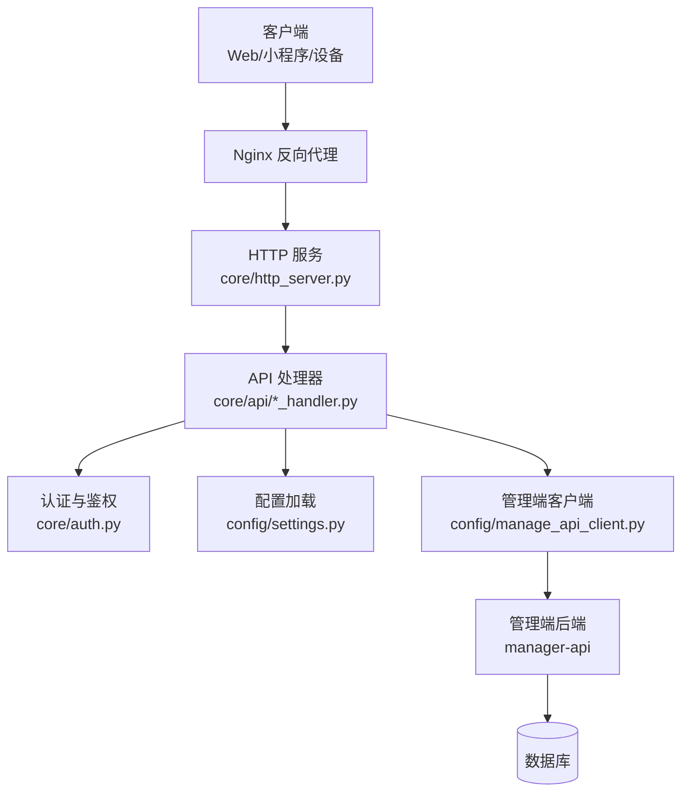
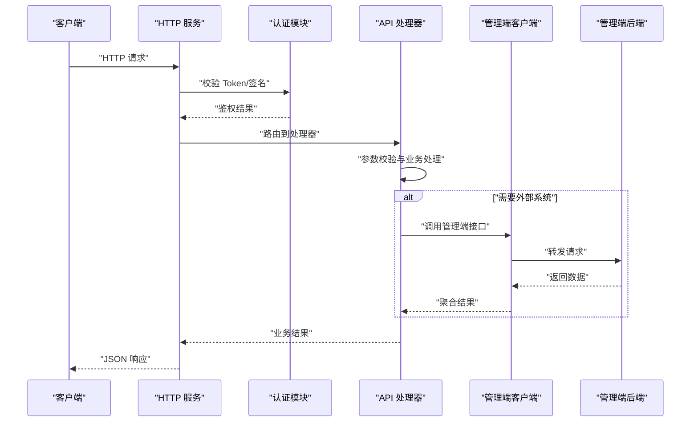
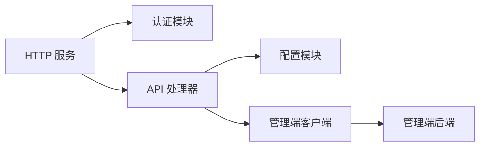

# RESTful API

<cite>
**本文引用的文件**
- [main.py](file://main/main.py)
- [http_server.py](file://main/xiaozhi-server/core/http_server.py)
- [base_handler.py](file://main/xiaozhi-server/core/api/base_handler.py)
- [ota_handler.py](file://main/xiaozhi-server/core/api/ota_handler.py)
- [vision_handler.py](file://main/xiaozhi-server/core/api/vision_handler.py)
- [auth.py](file://main/xiaozhi-server/core/auth.py)
- [manage_api_client.py](file://main/xiaozhi-server/config/manage_api_client.py)
- [settings.py](file://main/xiaozhi-server/config/settings.py)
- [app.py](file://main/xiaozhi-server/app.py)
- [start.sh](file://main/xiaozhi-server/start.sh)
- [Dockerfile](file://main/xiaozhi-server/Dockerfile)
- [docker-compose.yml](file://main/xiaozhi-server/docker-compose.yml)
- [manager-api 接入真实微信支付 V3 实现方案.md](file://main/manager-api/docs/manager-api 接入真实微信支付 V3 实现方案.md)
- [payment-flow-current.html](file://docs/diagrams/payment-flow-current.html)
- [payment-flow-improved.html](file://docs/diagrams/payment-flow-improved.html)
- [voice-clone-architecture.md](file://docs/custom/voice-clone-architecture.md)
- [mcp-get-device-info.md](file://docs/mcp-get-device-info.md)
- [index-stream-integration.md](file://docs/index-stream-integration.md)
</cite>

## 目录
1. [简介](#简介)
2. [项目结构](#项目结构)
3. [核心组件](#核心组件)
4. [架构总览](#架构总览)
5. [详细组件分析](#详细组件分析)
6. [依赖关系分析](#依赖关系分析)
7. [性能考虑](#性能考虑)
8. [故障排查指南](#故障排查指南)
9. [结论](#结论)
10. [附录](#附录)

## 简介
本文件为 xiaozhi-esp32-server 的 RESTful API 接口文档，覆盖用户认证、设备管理、知识库管理、语音克隆、支付系统等核心模块。文档包含：
- HTTP 接口的 URL 路径、请求方法（GET/POST/PUT/DELETE）
- 请求参数与响应格式
- 错误码定义与处理策略
- 接口版本管理、速率限制与安全防护措施
- Swagger/OpenAPI 规范的使用方法与调试技巧

说明：本项目同时提供 WebSocket 能力用于实时音视频流，REST API 主要用于配置、管理与控制面操作。

## 项目结构
xiaozhi-esp32-server 采用多模块组织方式：
- main/xiaozhi-server：服务端核心，包含 HTTP 服务、API 处理器、认证、配置加载等
- manager-api：管理端后端（Java），提供业务管理接口（如支付、设备、知识库等）
- manager-web：管理端前端（Vue）
- miniprogram / egg-miniprogram：小程序客户端
- docs：部署与集成文档、架构图与流程图

图表来源
- [http_server.py](file://main/xiaozhi-server/core/http_server.py)
- [base_handler.py](file://main/xiaozhi-server/core/api/base_handler.py)
- [auth.py](file://main/xiaozhi-server/core/auth.py)
- [settings.py](file://main/xiaozhi-server/config/settings.py)
- [manage_api_client.py](file://main/xiaozhi-server/config/manage_api_client.py)

章节来源
- [http_server.py](file://main/xiaozhi-server/core/http_server.py)
- [base_handler.py](file://main/xiaozhi-server/core/api/base_handler.py)
- [settings.py](file://main/xiaozhi-server/config/settings.py)
- [manage_api_client.py](file://main/xiaozhi-server/config/manage_api_client.py)

## 核心组件
- HTTP 服务：基于 Python 的轻量 HTTP 服务器，负责路由分发与请求生命周期管理
- API 处理器：按功能划分的处理器模块（OTA、视觉、基础基类等）
- 认证与鉴权：统一认证入口，校验 Token/签名等
- 配置加载：集中读取运行时配置（端口、鉴权开关、第三方服务地址等）
- 管理端客户端：封装对 manager-api 的调用，作为 REST 网关或代理

章节来源
- [http_server.py](file://main/xiaozhi-server/core/http_server.py)
- [base_handler.py](file://main/xiaozhi-server/core/api/base_handler.py)
- [auth.py](file://main/xiaozhi-server/core/auth.py)
- [settings.py](file://main/xiaozhi-server/config/settings.py)
- [manage_api_client.py](file://main/xiaozhi-server/config/manage_api_client.py)

## 架构总览
REST API 的典型调用链路如下：
- 客户端通过 Nginx 进入 HTTP 服务
- HTTP 服务根据路由分发给对应处理器
- 处理器执行认证、参数校验、业务逻辑
- 必要时调用管理端后端（manager-api）完成复杂业务（支付、知识库、设备管理等）
- 返回统一 JSON 响应

图表来源
- [http_server.py](file://main/xiaozhi-server/core/http_server.py)
- [base_handler.py](file://main/xiaozhi-server/core/api/base_handler.py)
- [auth.py](file://main/xiaozhi-server/core/auth.py)
- [manage_api_client.py](file://main/xiaozhi-server/config/manage_api_client.py)

## 详细组件分析

### 认证与鉴权
- 认证入口：统一在认证模块中校验 Token、签名或会话状态
- 鉴权策略：支持基于角色或资源的访问控制
- 安全建议：强制 HTTPS、Token 过期时间、刷新机制、IP 白名单

章节来源
- [auth.py](file://main/xiaozhi-server/core/auth.py)
- [settings.py](file://main/xiaozhi-server/config/settings.py)

### OTA 升级接口
- 功能：设备固件版本查询、下载链接生成、升级状态上报
- 典型流程：客户端查询版本 -> 服务端返回最新版本信息 -> 客户端下载并安装 -> 上报升级结果

章节来源
- [ota_handler.py](file://main/xiaozhi-server/core/api/ota_handler.py)

### 视觉相关接口
- 功能：图像上传、识别结果获取、模型配置更新
- 注意：大文件上传需配合分片与断点续传；敏感图片需脱敏存储

章节来源
- [vision_handler.py](file://main/xiaozhi-server/core/api/vision_handler.py)

### 基础处理器
- 功能：通用请求解析、错误封装、日志记录、限流与重试
- 设计模式：抽象基类统一行为，具体处理器继承扩展

章节来源
- [base_handler.py](file://main/xiaozhi-server/core/api/base_handler.py)

### 管理端客户端
- 功能：封装对 manager-api 的调用，包括鉴权、重试、超时、错误映射
- 使用场景：支付下单、订单查询、知识库增删改查、设备管理

章节来源
- [manage_api_client.py](file://main/xiaozhi-server/config/manage_api_client.py)

### 应用启动与配置
- 启动脚本：初始化环境变量、加载配置、启动 HTTP 服务
- Docker 化：镜像构建、端口暴露、健康检查

章节来源
- [app.py](file://main/xiaozhi-server/app.py)
- [start.sh](file://main/xiaozhi-server/start.sh)
- [Dockerfile](file://main/xiaozhi-server/Dockerfile)
- [docker-compose.yml](file://main/xiaozhi-server/docker-compose.yml)

## 依赖关系分析
- HTTP 服务依赖认证模块进行鉴权
- API 处理器依赖配置模块获取运行时参数
- 管理端客户端依赖网络库与错误处理库
- 外部依赖：Nginx、数据库、第三方服务（ASR/TTS/LLM）

图表来源
- [http_server.py](file://main/xiaozhi-server/core/http_server.py)
- [base_handler.py](file://main/xiaozhi-server/core/api/base_handler.py)
- [auth.py](file://main/xiaozhi-server/core/auth.py)
- [settings.py](file://main/xiaozhi-server/config/settings.py)
- [manage_api_client.py](file://main/xiaozhi-server/config/manage_api_client.py)

章节来源
- [http_server.py](file://main/xiaozhi-server/core/http_server.py)
- [base_handler.py](file://main/xiaozhi-server/core/api/base_handler.py)
- [auth.py](file://main/xiaozhi-server/core/auth.py)
- [settings.py](file://main/xiaozhi-server/config/settings.py)
- [manage_api_client.py](file://main/xiaozhi-server/config/manage_api_client.py)

## 性能考虑
- 连接池：数据库与外部服务调用使用连接池减少握手开销
- 缓存：热点数据（如配置、模型元信息）使用内存缓存
- 异步处理：长耗时任务（语音识别、TTS）异步队列处理
- 限流：接口级限流与全局限流结合，防止滥用
- 压缩：Gzip/Brotli 压缩传输，减少带宽占用

## 故障排查指南
- 常见问题：
  - 认证失败：检查 Token 是否有效、是否过期、签名是否正确
  - 超时：检查外部服务可用性、网络延迟、超时配置
  - 权限不足：检查角色与资源权限映射
- 日志定位：查看 HTTP 服务日志、处理器日志、管理端客户端日志
- 工具建议：使用 curl、Postman、Swagger UI 进行接口调试

章节来源
- [auth.py](file://main/xiaozhi-server/core/auth.py)
- [manage_api_client.py](file://main/xiaozhi-server/config/manage_api_client.py)

## 结论
xiaozhi-esp32-server 的 REST API 以模块化、可扩展为核心设计原则，通过统一的认证、配置与错误处理机制，确保接口的一致性与可维护性。结合管理端后端，可实现完整的业务闭环（支付、设备、知识库等）。在生产环境中，建议启用 HTTPS、限流、监控与告警，保障稳定性与安全性。

## 附录

### 接口版本管理
- 版本前缀：建议在 URL 中使用 /api/v1/ 前缀区分版本
- 兼容性：向后兼容变更，废弃接口保留过渡期
- 文档同步：每次版本发布更新 OpenAPI 文档

### 速率限制
- 全局限流：按 IP 或用户维度限制 QPS
- 接口限流：针对高负载接口单独设置阈值
- 降级策略：超限返回 429 并提示重试间隔

### 安全防护措施
- HTTPS：强制 TLS 加密
- 输入校验：严格类型与长度校验，防注入
- 输出过滤：敏感字段脱敏
- 审计日志：关键操作记录审计

### Swagger/OpenAPI 使用方法
- 生成规范：从代码注解或路由定义生成 OpenAPI 文档
- 在线调试：使用 Swagger UI 进行接口测试
- 客户端生成：基于 OpenAPI 生成 SDK

### 调试技巧
- 本地环境：使用 docker-compose 快速搭建
- 日志级别：调整日志级别便于问题定位
- 抓包分析：使用 Wireshark/tcpdump 分析网络流量

章节来源
- [settings.py](file://main/xiaozhi-server/config/settings.py)
- [start.sh](file://main/xiaozhi-server/start.sh)
- [Dockerfile](file://main/xiaozhi-server/Dockerfile)
- [docker-compose.yml](file://main/xiaozhi-server/docker-compose.yml)