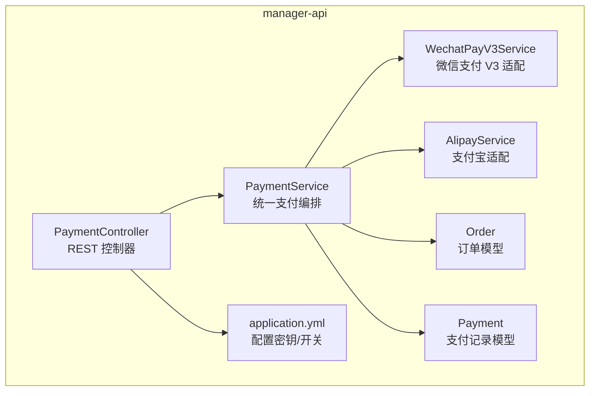
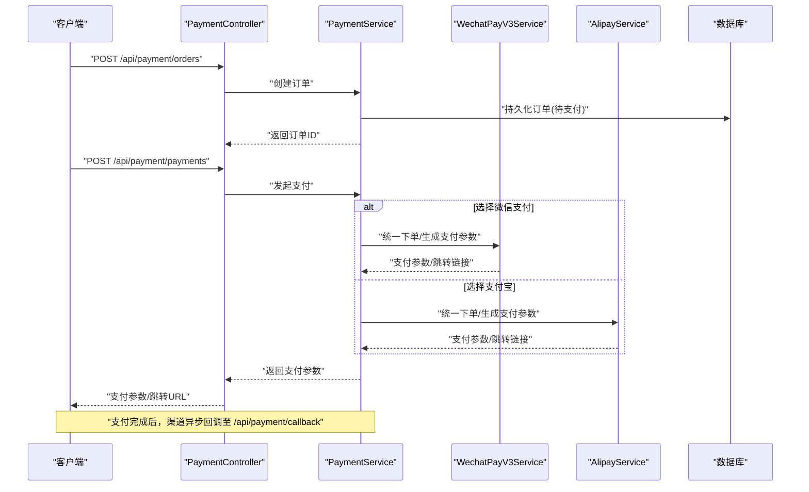
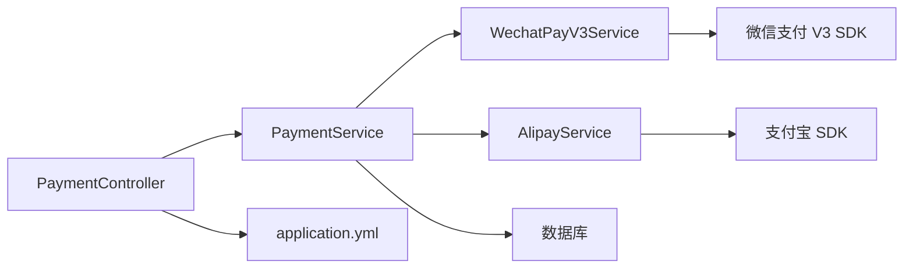

# 支付系统 API

<cite>
**本文引用的文件**   
- [manager-api/README.md](file://main/manager-api/README.md)
- [manager-api/pom.xml](file://main/manager-api/pom.xml)
- [manager-api/src/main/java/xiaozhi/controller/PaymentController.java](file://main/manager-api/src/main/java/xiaozhi/controller/PaymentController.java)
- [manager-api/src/main/java/xiaozhi/service/PaymentService.java](file://main/manager-api/src/main/java/xiaozhi/service/PaymentService.java)
- [manager-api/src/main/java/xiaozhi/service/WechatPayV3Service.java](file://main/manager-api/src/main/java/xiaozhi/service/WechatPayV3Service.java)
- [manager-api/src/main/java/xiaozhi/service/AlipayService.java](file://main/manager-api/src/main/java/xiaozhi/service/AlipayService.java)
- [manager-api/src/main/java/xiaozhi/model/Order.java](file://main/manager-api/src/main/java/xiaozhi/model/Order.java)
- [manager-api/src/main/java/xiaozhi/model/Payment.java](file://main/manager-api/src/main/java/xiaozhi/model/Payment.java)
- [manager-api/src/main/resources/application.yml](file://main/manager-api/src/main/resources/application.yml)
- [manager-api/docs/接入真实微信支付 V3 实现方案.md](file://main/manager-api/docs/接入真实微信支付 V3 实现方案.md)
- [plans/wechat-pay-v3-real-impl.md](file://plans/wechat-pay-v3-real-impl.md)
</cite>

## 目录
1. [简介](#简介)
2. [项目结构](#项目结构)
3. [核心组件](#核心组件)
4. [架构总览](#架构总览)
5. [详细组件分析](#详细组件分析)
6. [依赖分析](#依赖分析)
7. [性能考虑](#性能考虑)
8. [故障排查指南](#故障排查指南)
9. [结论](#结论)
10. [附录：API 规范与示例](#附录api-规范与示例)

## 简介
本文件为支付系统模块的 RESTful API 文档，覆盖订单创建、支付发起、支付回调、退款处理、支付状态同步、对账与财务报表等能力。重点说明微信支付 V3 集成、支付宝集成以及安全签名验证与异常处理策略，并提供接口 URL、HTTP 方法、请求参数与响应格式的完整说明及示例。

## 项目结构
支付相关代码位于 manager-api 子项目中，采用分层架构：控制器层暴露 REST 接口，服务层封装业务逻辑与第三方支付渠道适配，模型层定义订单与支付实体，配置文件管理密钥与渠道开关。

**图示来源** 
- [manager-api/src/main/java/xiaozhi/controller/PaymentController.java](file://main/manager-api/src/main/java/xiaozhi/controller/PaymentController.java)
- [manager-api/src/main/java/xiaozhi/service/PaymentService.java](file://main/manager-api/src/main/java/xiaozhi/service/PaymentService.java)
- [manager-api/src/main/java/xiaozhi/service/WechatPayV3Service.java](file://main/manager-api/src/main/java/xiaozhi/service/WechatPayV3Service.java)
- [manager-api/src/main/java/xiaozhi/service/AlipayService.java](file://main/manager-api/src/main/java/xiaozhi/service/AlipayService.java)
- [manager-api/src/main/java/xiaozhi/model/Order.java](file://main/manager-api/src/main/java/xiaozhi/model/Order.java)
- [manager-api/src/main/java/xiaozhi/model/Payment.java](file://main/manager-api/src/main/java/xiaozhi/model/Payment.java)
- [manager-api/src/main/resources/application.yml](file://main/manager-api/src/main/resources/application.yml)

**章节来源**
- [manager-api/README.md](file://main/manager-api/README.md)
- [manager-api/pom.xml](file://main/manager-api/pom.xml)

## 核心组件
- PaymentController：对外暴露统一的支付相关 REST 接口，包括订单创建、支付发起、支付回调、退款、状态查询与对账报表。
- PaymentService：统一编排支付流程，负责幂等校验、订单状态机流转、渠道选择与结果聚合。
- WechatPayV3Service：对接微信支付 V3 开放接口，完成下单、支付通知验签、退款申请与查询。
- AlipayService：对接支付宝开放平台，完成下单、异步通知验签、退款与查询。
- Order/Payment：订单与支付记录的数据模型，承载金额、渠道、状态、流水号等关键信息。
- application.yml：集中管理各渠道密钥、证书路径、回调地址与功能开关。

**章节来源**
- [manager-api/src/main/java/xiaozhi/controller/PaymentController.java](file://main/manager-api/src/main/java/xiaozhi/controller/PaymentController.java)
- [manager-api/src/main/java/xiaozhi/service/PaymentService.java](file://main/manager-api/src/main/java/xiaozhi/service/PaymentService.java)
- [manager-api/src/main/java/xiaozhi/service/WechatPayV3Service.java](file://main/manager-api/src/main/java/xiaozhi/service/WechatPayV3Service.java)
- [manager-api/src/main/java/xiaozhi/service/AlipayService.java](file://main/manager-api/src/main/java/xiaozhi/service/AlipayService.java)
- [manager-api/src/main/java/xiaozhi/model/Order.java](file://main/manager-api/src/main/java/xiaozhi/model/Order.java)
- [manager-api/src/main/java/xiaozhi/model/Payment.java](file://main/manager-api/src/main/java/xiaozhi/model/Payment.java)
- [manager-api/src/main/resources/application.yml](file://main/manager-api/src/main/resources/application.yml)

## 架构总览
支付系统采用“统一入口 + 多渠道适配”的架构模式。客户端通过 PaymentController 调用统一接口，PaymentService 根据渠道配置路由到具体适配器（微信 V3、支付宝），并负责状态同步与对账数据准备。

**图示来源** 
- [manager-api/src/main/java/xiaozhi/controller/PaymentController.java](file://main/manager-api/src/main/java/xiaozhi/controller/PaymentController.java)
- [manager-api/src/main/java/xiaozhi/service/PaymentService.java](file://main/manager-api/src/main/java/xiaozhi/service/PaymentService.java)
- [manager-api/src/main/java/xiaozhi/service/WechatPayV3Service.java](file://main/manager-api/src/main/java/xiaozhi/service/WechatPayV3Service.java)
- [manager-api/src/main/java/xiaozhi/service/AlipayService.java](file://main/manager-api/src/main/java/xiaozhi/service/AlipayService.java)

## 详细组件分析

### 控制器层：PaymentController
职责
- 暴露统一 REST 接口：订单创建、支付发起、支付回调、退款、状态查询、对账与报表。
- 输入校验与鉴权前置处理。
- 将请求委派给 PaymentService 进行业务编排。

典型接口
- 订单创建：POST /api/payment/orders
- 支付发起：POST /api/payment/payments
- 支付回调：POST /api/payment/callback
- 退款申请：POST /api/payment/refunds
- 状态查询：GET /api/payment/orders/{orderId}/status
- 对账下载：GET /api/payment/reconciliation
- 财务报表：GET /api/payment/report

安全与异常
- 所有回调接口需进行渠道签名验证与时间戳校验。
- 统一异常码与错误消息，避免泄露敏感信息。

**章节来源**
- [manager-api/src/main/java/xiaozhi/controller/PaymentController.java](file://main/manager-api/src/main/java/xiaozhi/controller/PaymentController.java)

### 服务层：PaymentService
职责
- 统一支付编排：订单状态机、幂等控制、渠道选择、结果聚合。
- 与渠道适配器交互，获取下单参数与处理回调。
- 对账与报表数据准备。

关键流程
- 创建订单：校验参数、生成唯一订单号、落库。
- 发起支付：根据渠道配置生成对应支付参数，返回给前端或 SDK。
- 处理回调：验签、更新订单与支付记录、触发后续业务事件。
- 退款处理：校验原支付成功、调用渠道退款接口、记录退款流水。
- 状态同步：定时任务或主动查询渠道订单状态，保证最终一致性。

**章节来源**
- [manager-api/src/main/java/xiaozhi/service/PaymentService.java](file://main/manager-api/src/main/java/xiaozhi/service/PaymentService.java)

### 微信支付 V3 适配：WechatPayV3Service
职责
- 对接微信支付 V3 开放接口：统一下单、支付通知验签、退款申请与查询。
- 使用商户证书与 APIv3 密钥进行签名与解密。
- 处理微信侧异步通知与重试机制。

要点
- 签名算法：RSA-SHA256 或 ECDSA-SHA256（按配置）。
- 证书管理：商户私钥、平台证书自动更新。
- 回调验签：严格校验签名、时间戳与序列号。

**章节来源**
- [manager-api/src/main/java/xiaozhi/service/WechatPayV3Service.java](file://main/manager-api/src/main/java/xiaozhi/service/WechatPayV3Service.java)
- [manager-api/docs/接入真实微信支付 V3 实现方案.md](file://main/manager-api/docs/接入真实微信支付 V3 实现方案.md)
- [plans/wechat-pay-v3-real-impl.md](file://plans/wechat-pay-v3-real-impl.md)

### 支付宝适配：AlipayService
职责
- 对接支付宝开放平台：统一下单、异步通知验签、退款与查询。
- 使用应用私钥与支付宝公钥进行签名与验签。
- 处理支付宝异步通知与幂等处理。

要点
- 签名算法：RSA2（SHA256）。
- 证书模式：可选，优先使用公钥证书。
- 回调验签：严格校验 sign、sign_type、时间戳。

**章节来源**
- [manager-api/src/main/java/xiaozhi/service/AlipayService.java](file://main/manager-api/src/main/java/xiaozhi/service/AlipayService.java)

### 数据模型：Order 与 Payment
- Order：订单编号、用户标识、商品描述、金额、币种、渠道、状态、创建时间、更新时间。
- Payment：支付流水号、订单编号、渠道、交易号、金额、状态、回调数据摘要、处理时间。

关系
- 一个订单可对应多条支付尝试（含失败与重试）。
- 支付记录关联订单，用于对账与审计。

**章节来源**
- [manager-api/src/main/java/xiaozhi/model/Order.java](file://main/manager-api/src/main/java/xiaozhi/model/Order.java)
- [manager-api/src/main/java/xiaozhi/model/Payment.java](file://main/manager-api/src/main/java/xiaozhi/model/Payment.java)

## 依赖分析
- 外部依赖：微信支付 V3 SDK、支付宝 SDK、数据库驱动、HTTP 客户端。
- 内部依赖：控制器依赖服务层；服务层依赖渠道适配器；适配器依赖各自 SDK。
- 配置依赖：application.yml 中集中管理密钥、证书路径、回调地址与开关。

**图示来源** 
- [manager-api/src/main/java/xiaozhi/controller/PaymentController.java](file://main/manager-api/src/main/java/xiaozhi/controller/PaymentController.java)
- [manager-api/src/main/java/xiaozhi/service/PaymentService.java](file://main/manager-api/src/main/java/xiaozhi/service/PaymentService.java)
- [manager-api/src/main/java/xiaozhi/service/WechatPayV3Service.java](file://main/manager-api/src/main/java/xiaozhi/service/WechatPayV3Service.java)
- [manager-api/src/main/java/xiaozhi/service/AlipayService.java](file://main/manager-api/src/main/java/xiaozhi/service/AlipayService.java)
- [manager-api/src/main/resources/application.yml](file://main/manager-api/src/main/resources/application.yml)

**章节来源**
- [manager-api/pom.xml](file://main/manager-api/pom.xml)
- [manager-api/src/main/resources/application.yml](file://main/manager-api/src/main/resources/application.yml)

## 性能考虑
- 幂等性设计：基于订单号与支付流水号的唯一约束，避免重复处理。
- 异步处理：支付回调与对账任务采用队列或异步线程池，降低主链路延迟。
- 连接池与超时：合理配置 HTTP 客户端与数据库连接池，设置超时与重试策略。
- 缓存热点：对频繁读取的配置与字典数据进行本地缓存。
- 限流与熔断：对第三方渠道调用增加限流与熔断保护，防止雪崩。

[本节为通用指导，不直接分析具体文件]

## 故障排查指南
常见问题
- 回调验签失败：检查签名算法、密钥与证书是否正确，确认时间戳与随机串。
- 订单状态不一致：核对渠道交易号与本地流水号，执行状态同步任务。
- 退款失败：确认原支付成功且未全额退款，检查退款金额与原因。
- 对账差异：比对渠道账单与本地流水，定位差异原因并补录。

排查步骤
- 查看日志：回调验签、下单、退款、对账的关键日志。
- 核对配置：application.yml 中的密钥、证书路径与回调地址。
- 复现问题：使用测试环境模拟渠道回调与异常场景。
- 修复与回归：修复后回归测试，确保幂等与一致性。

**章节来源**
- [manager-api/src/main/java/xiaozhi/service/WechatPayV3Service.java](file://main/manager-api/src/main/java/xiaozhi/service/WechatPayV3Service.java)
- [manager-api/src/main/java/xiaozhi/service/AlipayService.java](file://main/manager-api/src/main/java/xiaozhi/service/AlipayService.java)
- [manager-api/src/main/resources/application.yml](file://main/manager-api/src/main/resources/application.yml)

## 结论
支付系统通过统一控制器与服务编排，结合微信 V3 与支付宝适配器，实现了高内聚、低耦合的支付能力。严格的签名验签与幂等设计保障了安全性与一致性。对账与报表接口为财务运营提供了数据支撑。建议在生产环境完善监控告警与审计日志，持续优化性能与稳定性。

[本节为总结，不直接分析具体文件]

## 附录：API 规范与示例

### 订单创建
- URL：/api/payment/orders
- 方法：POST
- 请求体字段：
  - order_no：订单号（必填）
  - user_id：用户标识（必填）
  - amount：金额（必填，单位：分）
  - currency：币种（默认 CNY）
  - description：商品描述（必填）
  - channel：支付渠道（wechat/alipay，必填）
- 响应体字段：
  - code：状态码（0 成功，非 0 失败）
  - message：提示信息
  - data：{ order_no, status }

示例
- 请求示例：{"order_no":"ORD202501010001","user_id":"U1001","amount":100,"currency":"CNY","description":"订阅月卡","channel":"wechat"}
- 响应示例：{"code":0,"message":"success","data":{"order_no":"ORD202501010001","status":"pending"}}

**章节来源**
- [manager-api/src/main/java/xiaozhi/controller/PaymentController.java](file://main/manager-api/src/main/java/xiaozhi/controller/PaymentController.java)
- [manager-api/src/main/java/xiaozhi/service/PaymentService.java](file://main/manager-api/src/main/java/xiaozhi/service/PaymentService.java)

### 支付发起
- URL：/api/payment/payments
- 方法：POST
- 请求体字段：
  - order_no：订单号（必填）
  - channel：支付渠道（wechat/alipay，必填）
  - client_ip：客户端 IP（可选）
- 响应体字段：
  - code：状态码
  - message：提示信息
  - data：{ payment_params, redirect_url }

示例
- 请求示例：{"order_no":"ORD202501010001","channel":"wechat","client_ip":"192.168.1.1"}
- 响应示例：{"code":0,"message":"success","data":{"payment_params":{"mweb_url":"https://pay.weixin.qq.com/wap/pay?..."},"redirect_url":"https://pay.weixin.qq.com/wap/pay?..."}}

**章节来源**
- [manager-api/src/main/java/xiaozhi/controller/PaymentController.java](file://main/manager-api/src/main/java/xiaozhi/controller/PaymentController.java)
- [manager-api/src/main/java/xiaozhi/service/PaymentService.java](file://main/manager-api/src/main/java/xiaozhi/service/PaymentService.java)

### 支付回调
- URL：/api/payment/callback
- 方法：POST
- 请求头：
  - X-Channel-Sign：渠道签名（必填）
  - X-Channel-Timestamp：时间戳（必填）
  - X-Channel-Nonce：随机串（必填）
- 请求体：渠道原始回调报文（JSON）
- 响应体字段：
  - code：状态码（0 表示已接收处理）
  - message：提示信息
  - data：{ order_no, status }

示例
- 请求头：X-Channel-Sign=abc123..., X-Channel-Timestamp=1700000000, X-Channel-Nonce=xyz
- 请求体：{"out_trade_no":"ORD202501010001","transaction_id":"WX42...","amount":100,"trade_state":"SUCCESS"}
- 响应示例：{"code":0,"message":"success","data":{"order_no":"ORD202501010001","status":"paid"}}

**章节来源**
- [manager-api/src/main/java/xiaozhi/controller/PaymentController.java](file://main/manager-api/src/main/java/xiaozhi/controller/PaymentController.java)
- [manager-api/src/main/java/xiaozhi/service/WechatPayV3Service.java](file://main/manager-api/src/main/java/xiaozhi/service/WechatPayV3Service.java)
- [manager-api/src/main/java/xiaozhi/service/AlipayService.java](file://main/manager-api/src/main/java/xiaozhi/service/AlipayService.java)

### 退款申请
- URL：/api/payment/refunds
- 方法：POST
- 请求体字段：
  - order_no：订单号（必填）
  - refund_no：退款单号（必填）
  - amount：退款金额（必填，单位：分）
  - reason：退款原因（必填）
- 响应体字段：
  - code：状态码
  - message：提示信息
  - data：{ refund_no, status }

示例
- 请求示例：{"order_no":"ORD202501010001","refund_no":"REF202501010001","amount":100,"reason":"用户取消订阅"}
- 响应示例：{"code":0,"message":"success","data":{"refund_no":"REF202501010001","status":"processing"}}

**章节来源**
- [manager-api/src/main/java/xiaozhi/controller/PaymentController.java](file://main/manager-api/src/main/java/xiaozhi/controller/PaymentController.java)
- [manager-api/src/main/java/xiaozhi/service/PaymentService.java](file://main/manager-api/src/main/java/xiaozhi/service/PaymentService.java)

### 状态查询
- URL：/api/payment/orders/{orderId}/status
- 方法：GET
- 路径参数：
  - orderId：订单号（必填）
- 响应体字段：
  - code：状态码
  - message：提示信息
  - data：{ order_no, status, payment_status, transaction_id }

示例
- 响应示例：{"code":0,"message":"success","data":{"order_no":"ORD202501010001","status":"paid","payment_status":"success","transaction_id":"WX42..."}}

**章节来源**
- [manager-api/src/main/java/xiaozhi/controller/PaymentController.java](file://main/manager-api/src/main/java/xiaozhi/controller/PaymentController.java)
- [manager-api/src/main/java/xiaozhi/service/PaymentService.java](file://main/manager-api/src/main/java/xiaozhi/service/PaymentService.java)

### 对账下载
- URL：/api/payment/reconciliation
- 方法：GET
- 查询参数：
  - date：对账日期（YYYY-MM-DD，必填）
  - channel：渠道（wechat/alipay，可选）
- 响应体字段：
  - code：状态码
  - message：提示信息
  - data：{ download_url, file_name }

示例
- 请求示例：/api/payment/reconciliation?date=2025-01-01&channel=wechat
- 响应示例：{"code":0,"message":"success","data":{"download_url":"https://cdn.example.com/reconciliation/2025-01-01_wechat.csv","file_name":"2025-01-01_wechat.csv"}}

**章节来源**
- [manager-api/src/main/java/xiaozhi/controller/PaymentController.java](file://main/manager-api/src/main/java/xiaozhi/controller/PaymentController.java)
- [manager-api/src/main/java/xiaozhi/service/PaymentService.java](file://main/manager-api/src/main/java/xiaozhi/service/PaymentService.java)

### 财务报表
- URL：/api/payment/report
- 方法：GET
- 查询参数：
  - start_date：开始日期（YYYY-MM-DD，必填）
  - end_date：结束日期（YYYY-MM-DD，必填）
  - channel：渠道（可选）
  - group_by：分组维度（day/month/channel，可选）
- 响应体字段：
  - code：状态码
  - message：提示信息
  - data：{ total_orders, total_amount, paid_orders, paid_amount, refund_orders, refund_amount }

示例
- 请求示例：/api/payment/report?start_date=2025-01-01&end_date=2025-01-31&group_by=month
- 响应示例：{"code":0,"message":"success","data":{"total_orders":1200,"total_amount":120000,"paid_orders":1150,"paid_amount":115000,"refund_orders":50,"refund_amount":5000}}

**章节来源**
- [manager-api/src/main/java/xiaozhi/controller/PaymentController.java](file://main/manager-api/src/main/java/xiaozhi/controller/PaymentController.java)
- [manager-api/src/main/java/xiaozhi/service/PaymentService.java](file://main/manager-api/src/main/java/xiaozhi/service/PaymentService.java)

### 安全签名验证
- 回调验签：
  - 微信支付 V3：使用商户私钥与 APIv3 密钥，校验签名与时间戳。
  - 支付宝：使用应用私钥与支付宝公钥，校验 RSA2 签名。
- 请求签名（可选）：
  - 客户端对请求体进行签名，服务端验签后处理。
- 防重放：
  - 校验时间戳与随机串，拒绝过期请求。

**章节来源**
- [manager-api/src/main/java/xiaozhi/service/WechatPayV3Service.java](file://main/manager-api/src/main/java/xiaozhi/service/WechatPayV3Service.java)
- [manager-api/src/main/java/xiaozhi/service/AlipayService.java](file://main/manager-api/src/main/java/xiaozhi/service/AlipayService.java)
- [manager-api/src/main/resources/application.yml](file://main/manager-api/src/main/resources/application.yml)

### 异常处理
- 统一错误码：
  - 0：成功
  - 1001：参数错误
  - 1002：签名失败
  - 1003：订单不存在
  - 1004：支付失败
  - 1005：退款失败
  - 1006：对账失败
- 错误响应格式：
  - {"code":错误码,"message":"错误描述","data":null}

**章节来源**
- [manager-api/src/main/java/xiaozhi/controller/PaymentController.java](file://main/manager-api/src/main/java/xiaozhi/controller/PaymentController.java)
- [manager-api/src/main/java/xiaozhi/service/PaymentService.java](file://main/manager-api/src/main/java/xiaozhi/service/PaymentService.java)