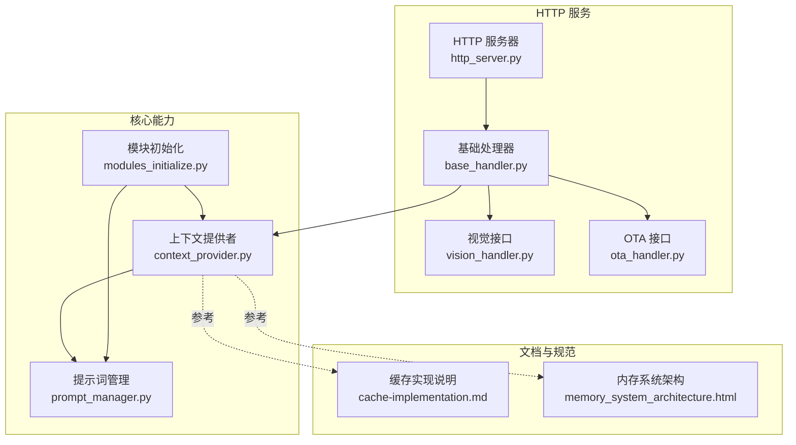
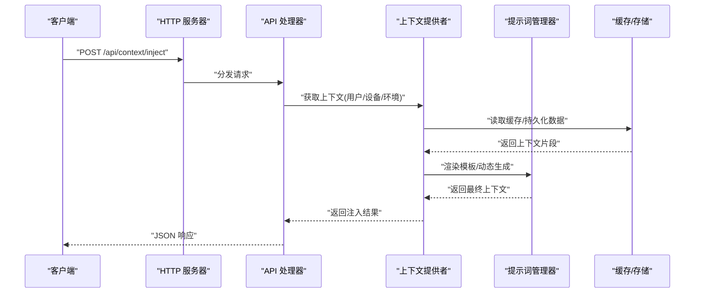
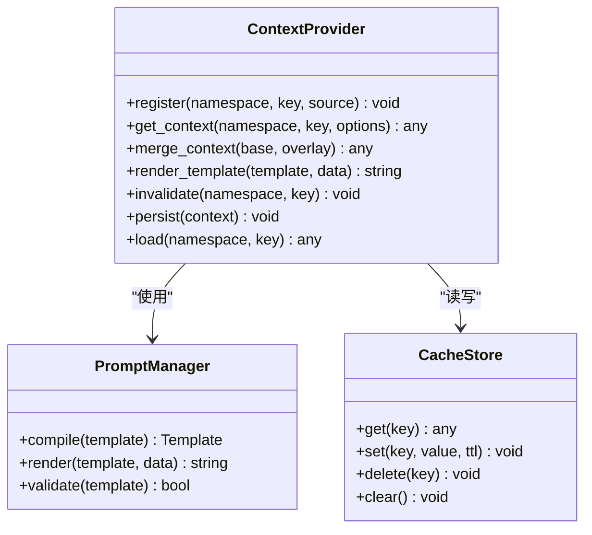
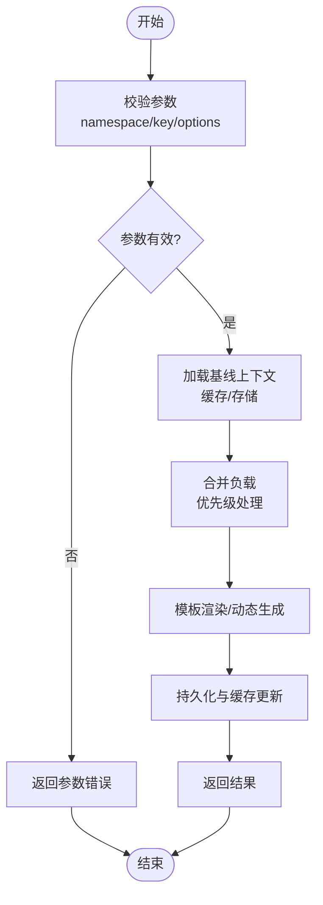
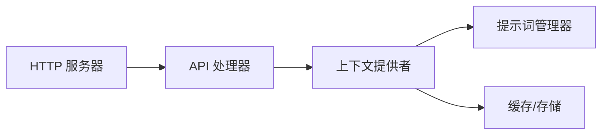

# 上下文提供者 API

<cite>
**本文引用的文件**
- [context_provider.py](file://main/xiaozhi-server/core/utils/context_provider.py)
- [http_server.py](file://main/xiaozhi-server/core/http_server.py)
- [base_handler.py](file://main/xiaozhi-server/core/api/base_handler.py)
- [vision_handler.py](file://main/xiaozhi-server/core/api/vision_handler.py)
- [ota_handler.py](file://main/xiaozhi-server/core/api/ota_handler.py)
- [prompt_manager.py](file://main/xiaozhi-server/core/utils/prompt_manager.py)
- [modules_initialize.py](file://main/xiaozhi-server/core/utils/modules_initialize.py)
- [cache-implementation.md](file://main/xiaozhi-server/docs/cache-implementation.md)
- [memory_system_architecture.html](file://main/xiaozhi-server/docs/memory_system_architecture.html)
</cite>

## 目录
1. [简介](#简介)
2. [项目结构](#项目结构)
3. [核心组件](#核心组件)
4. [架构总览](#架构总览)
5. [详细组件分析](#详细组件分析)
6. [依赖关系分析](#依赖关系分析)
7. [性能考虑](#性能考虑)
8. [故障排查指南](#故障排查指南)
9. [结论](#结论)
10. [附录](#附录)

## 简介
本文件为“智能体上下文提供者”功能的 RESTful API 文档，覆盖上下文的配置、注册、调用、注入与提取机制，以及缓存与持久化策略和调试工具。目标读者包括后端开发者、集成方与运维人员，旨在帮助快速理解并正确使用上下文提供者能力。

## 项目结构
与上下文提供者相关的代码主要位于 xiaozhi-server 的 core 层：
- utils 层提供上下文提供者实现与工具（如 context_provider.py、prompt_manager.py）
- api 层暴露 HTTP 接口（base_handler.py 及具体 handler）
- http_server.py 负责路由与中间件装配
- modules_initialize.py 负责模块初始化与上下文相关能力的启动
- docs 包含缓存实现与内存系统架构说明

图表来源
- [http_server.py](file://main/xiaozhi-server/core/http_server.py)
- [base_handler.py](file://main/xiaozhi-server/core/api/base_handler.py)
- [vision_handler.py](file://main/xiaozhi-server/core/api/vision_handler.py)
- [ota_handler.py](file://main/xiaozhi-server/core/api/ota_handler.py)
- [context_provider.py](file://main/xiaozhi-server/core/utils/context_provider.py)
- [prompt_manager.py](file://main/xiaozhi-server/core/utils/prompt_manager.py)
- [modules_initialize.py](file://main/xiaozhi-server/core/utils/modules_initialize.py)
- [cache-implementation.md](file://main/xiaozhi-server/docs/cache-implementation.md)
- [memory_system_architecture.html](file://main/xiaozhi-server/docs/memory_system_architecture.html)

章节来源
- [context_provider.py](file://main/xiaozhi-server/core/utils/context_provider.py)
- [http_server.py](file://main/xiaozhi-server/core/http_server.py)
- [base_handler.py](file://main/xiaozhi-server/core/api/base_handler.py)
- [prompt_manager.py](file://main/xiaozhi-server/core/utils/prompt_manager.py)
- [modules_initialize.py](file://main/xiaozhi-server/core/utils/modules_initialize.py)

## 核心组件
- 上下文提供者（Context Provider）
  - 职责：统一获取与组装上下文数据（用户信息、设备状态、环境变量等），支持动态内容生成与模板渲染。
  - 关键能力：上下文注册、上下文读取、上下文合并与优先级处理、缓存与持久化。
- 提示词管理器（Prompt Manager）
  - 职责：管理提示词模板与变量替换，配合上下文提供者完成最终提示词构建。
- HTTP 服务与处理器
  - 职责：对外暴露 RESTful 接口，接收请求参数，调用上下文提供者进行注入或提取，返回标准化响应。
- 模块初始化
  - 职责：在应用启动时加载上下文提供者、提示词模板、缓存策略等。

章节来源
- [context_provider.py](file://main/xiaozhi-server/core/utils/context_provider.py)
- [prompt_manager.py](file://main/xiaozhi-server/core/utils/prompt_manager.py)
- [modules_initialize.py](file://main/xiaozhi-server/core/utils/modules_initialize.py)

## 架构总览
上下文提供者通过 HTTP 接口被上层业务调用，内部与提示词管理器、缓存与持久化子系统协作，形成“请求→处理器→上下文提供者→数据源→响应”的闭环。

图表来源
- [http_server.py](file://main/xiaozhi-server/core/http_server.py)
- [base_handler.py](file://main/xiaozhi-server/core/api/base_handler.py)
- [context_provider.py](file://main/xiaozhi-server/core/utils/context_provider.py)
- [prompt_manager.py](file://main/xiaozhi-server/core/utils/prompt_manager.py)
- [cache-implementation.md](file://main/xiaozhi-server/docs/cache-implementation.md)

## 详细组件分析

### 上下文提供者（Context Provider）
- 功能要点
  - 上下文注册：允许外部模块注册上下文来源（用户、设备、环境、第三方服务等）。
  - 上下文读取：按命名空间与键值获取上下文片段，支持多级合并与优先级。
  - 动态生成：结合提示词模板与运行时数据生成最终上下文。
  - 缓存与持久化：读路径优先命中缓存，写路径同步更新持久化；支持失效策略。
- 数据结构约定
  - 用户信息：用户标识、昵称、角色、权限、偏好设置等。
  - 设备状态：设备 ID、型号、在线状态、位置、传感器数据等。
  - 环境变量：时区、语言、运行模式、特性开关等。
  - 扩展字段：由注册方自定义，需遵循统一的命名空间与类型约束。
- 错误处理
  - 参数校验失败：返回明确的错误码与字段级错误信息。
  - 数据源不可用：降级到默认值或空上下文，记录告警日志。
  - 缓存/存储异常：重试与回退策略，确保一致性。

图表来源
- [context_provider.py](file://main/xiaozhi-server/core/utils/context_provider.py)
- [prompt_manager.py](file://main/xiaozhi-server/core/utils/prompt_manager.py)
- [cache-implementation.md](file://main/xiaozhi-server/docs/cache-implementation.md)

章节来源
- [context_provider.py](file://main/xiaozhi-server/core/utils/context_provider.py)
- [prompt_manager.py](file://main/xiaozhi-server/core/utils/prompt_manager.py)

### HTTP 接口设计（RESTful）
以下为建议的上下文提供者 RESTful 接口定义（以 JSON 为主）：
- 注入上下文
  - 方法：POST
  - 路径：/api/context/inject
  - 请求体：{ namespace, key, payload, options }
  - 响应：{ code, message, data: { merged_context, rendered_prompt } }
- 读取上下文
  - 方法：GET
  - 路径：/api/context/{namespace}/{key}
  - 查询参数：version, include_cache
  - 响应：{ code, message, data: { context, cache_hit } }
- 删除上下文
  - 方法：DELETE
  - 路径：/api/context/{namespace}/{key}
  - 响应：{ code, message, data: { deleted } }
- 批量操作
  - 方法：POST
  - 路径：/api/context/batch
  - 请求体：{ actions: [ { op, namespace, key, payload } ] }
  - 响应：{ code, message, data: { results } }
- 调试与诊断
  - 方法：GET
  - 路径：/api/context/debug
  - 查询参数：namespace, key, trace
  - 响应：{ code, message, data: { trace, cache_stats, render_log } }

注意：以上接口为设计建议，实际实现以代码为准。若未实现对应端点，请根据 base_handler 与 http_server 的路由机制扩展。

章节来源
- [base_handler.py](file://main/xiaozhi-server/core/api/base_handler.py)
- [http_server.py](file://main/xiaozhi-server/core/http_server.py)

### 上下文注入与提取流程
- 注入流程
  - 接收请求参数，校验命名空间与键合法性。
  - 从缓存/存储读取基线上下文，叠加新负载。
  - 使用提示词管理器渲染模板，生成最终上下文。
  - 写入缓存与持久化，返回合并结果。
- 提取流程
  - 根据命名空间与键查找上下文。
  - 优先命中缓存，未命中则从存储加载。
  - 可选执行模板渲染与动态生成。
  - 返回上下文与缓存命中标志。

图表来源
- [context_provider.py](file://main/xiaozhi-server/core/utils/context_provider.py)
- [prompt_manager.py](file://main/xiaozhi-server/core/utils/prompt_manager.py)
- [cache-implementation.md](file://main/xiaozhi-server/docs/cache-implementation.md)

章节来源
- [context_provider.py](file://main/xiaozhi-server/core/utils/context_provider.py)
- [prompt_manager.py](file://main/xiaozhi-server/core/utils/prompt_manager.py)

### 缓存与持久化策略
- 缓存策略
  - 读路径：先查内存缓存，再查分布式/本地存储，最后回源。
  - 写路径：同步更新缓存与存储，保证强一致或最终一致（可配置）。
  - 失效：支持 TTL、事件失效与手动清理。
- 持久化
  - 结构化存储上下文片段，支持版本控制与变更追踪。
  - 跨进程/节点共享（如需）采用集中式存储。
- 一致性
  - 读写分离场景下，通过版本号或时间戳避免脏读。
  - 冲突解决采用覆盖策略或合并策略（可配置）。

章节来源
- [cache-implementation.md](file://main/xiaozhi-server/docs/cache-implementation.md)
- [memory_system_architecture.html](file://main/xiaozhi-server/docs/memory_system_architecture.html)

### 调试工具
- 调试接口
  - 查看上下文 Trace：包含加载、合并、渲染、缓存命中等步骤。
  - 缓存统计：命中率、延迟、容量使用情况。
  - 渲染日志：模板变量解析过程与异常堆栈。
- 使用建议
  - 开发阶段开启详细日志，生产环境按需启用。
  - 对高频键设置采样率，避免日志风暴。

章节来源
- [base_handler.py](file://main/xiaozhi-server/core/api/base_handler.py)
- [context_provider.py](file://main/xiaozhi-server/core/utils/context_provider.py)

## 依赖关系分析
- 模块耦合
  - HTTP 处理器依赖上下文提供者与提示词管理器。
  - 上下文提供者依赖缓存与存储抽象，便于替换实现。
- 外部依赖
  - 存储后端（内存/Redis/数据库）可通过配置切换。
  - 模板引擎用于提示词渲染。
- 潜在循环依赖
  - 通过接口解耦与初始化顺序控制避免循环。

图表来源
- [http_server.py](file://main/xiaozhi-server/core/http_server.py)
- [base_handler.py](file://main/xiaozhi-server/core/api/base_handler.py)
- [context_provider.py](file://main/xiaozhi-server/core/utils/context_provider.py)
- [prompt_manager.py](file://main/xiaozhi-server/core/utils/prompt_manager.py)

章节来源
- [http_server.py](file://main/xiaozhi-server/core/http_server.py)
- [base_handler.py](file://main/xiaozhi-server/core/api/base_handler.py)
- [context_provider.py](file://main/xiaozhi-server/core/utils/context_provider.py)
- [prompt_manager.py](file://main/xiaozhi-server/core/utils/prompt_manager.py)

## 性能考虑
- 缓存命中率优化：合理设置 TTL、热点键预热、分层缓存。
- 模板渲染开销：预编译模板、减少动态变量计算。
- I/O 异步化：存储访问采用异步或连接池，降低阻塞。
- 批处理：批量注入/读取减少网络往返。
- 监控与限流：对高频接口设置速率限制与熔断保护。

[本节为通用指导，不直接分析具体文件]

## 故障排查指南
- 常见问题
  - 参数校验失败：检查 namespace/key 格式与必填字段。
  - 缓存未命中：确认缓存键一致性与 TTL 设置。
  - 模板渲染错误：核对模板语法与变量映射。
  - 存储不可用：检查后端健康状态与连接配置。
- 定位手段
  - 使用调试接口获取 Trace 与缓存统计。
  - 查看日志中的错误堆栈与警告信息。
  - 逐步缩小范围：先验证存储，再验证缓存，最后验证模板。

章节来源
- [base_handler.py](file://main/xiaozhi-server/core/api/base_handler.py)
- [context_provider.py](file://main/xiaozhi-server/core/utils/context_provider.py)

## 结论
上下文提供者通过统一的注册、读取、合并与渲染机制，为智能体提供稳定、可扩展的上下文能力。配合缓存与持久化策略，保障数据一致性与高性能。调试工具帮助快速定位问题，提升开发与运维效率。

[本节为总结性内容，不直接分析具体文件]

## 附录
- 术语表
  - 命名空间：上下文分组，便于隔离不同来源的数据。
  - 键：命名空间内的唯一标识。
  - 负载：待注入的上下文片段。
  - 模板：提示词模板，用于动态生成最终上下文。
- 最佳实践
  - 明确命名空间与键的语义，避免冲突。
  - 合理划分上下文粒度，减少不必要的数据传输。
  - 使用版本控制与变更追踪，便于回溯与回滚。

[本节为补充信息，不直接分析具体文件]