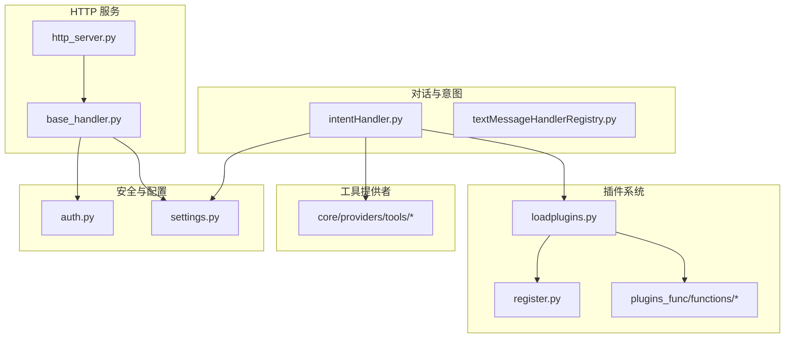
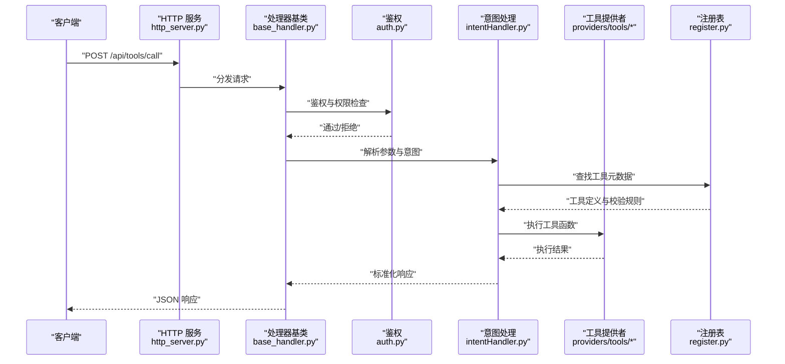
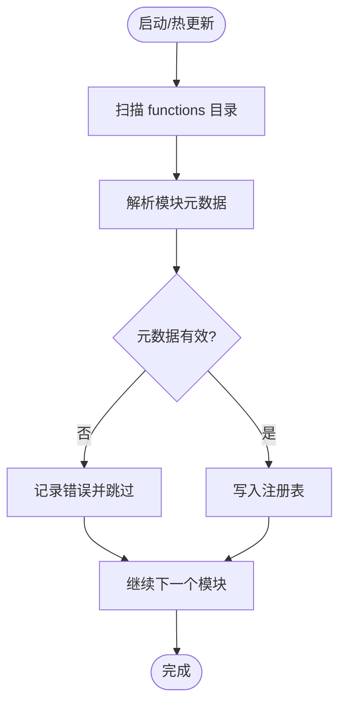
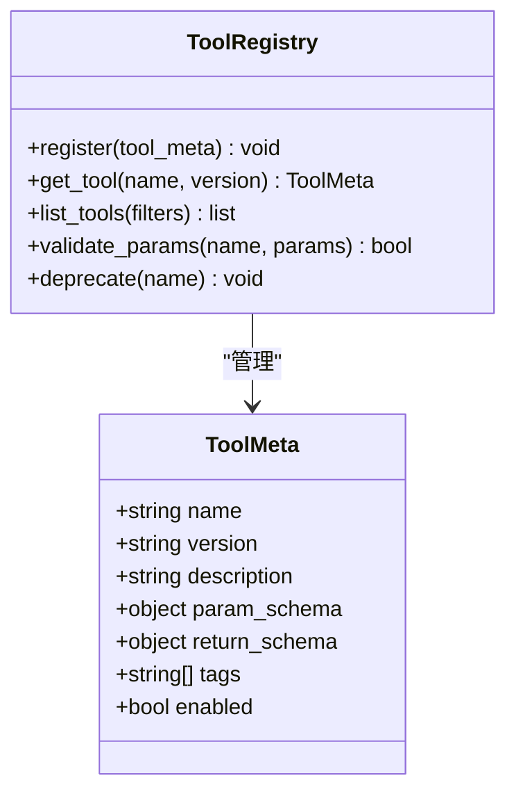
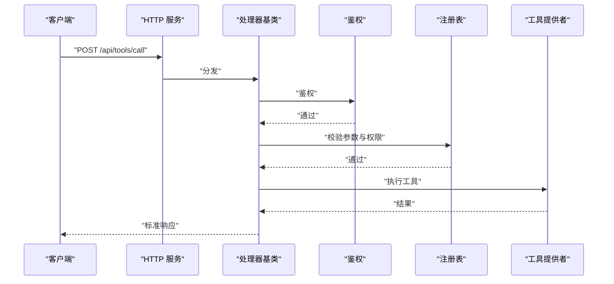
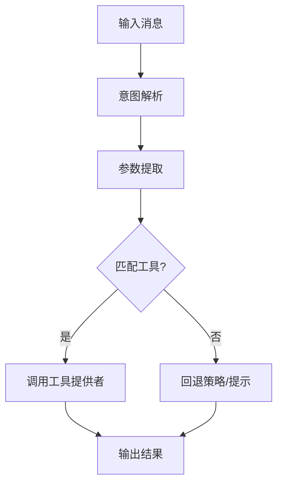
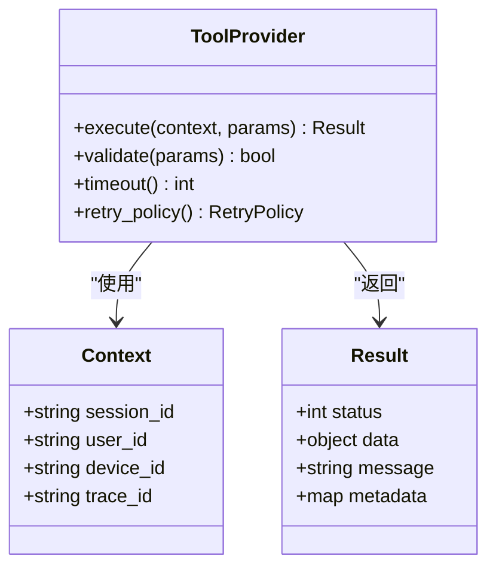
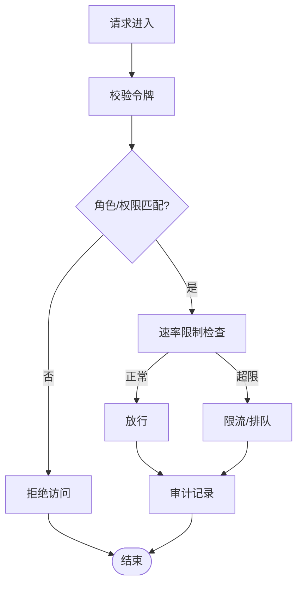
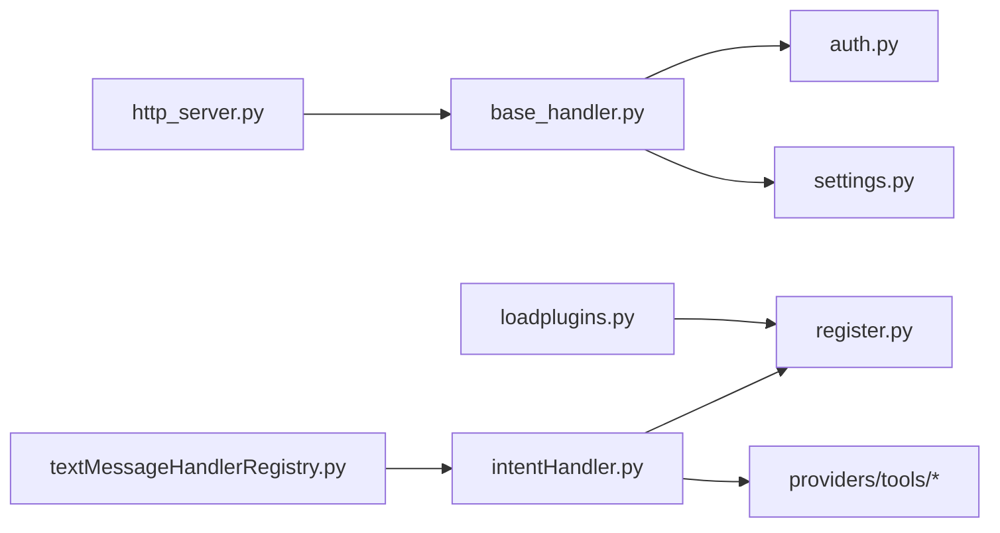

# 工具函数 API

<cite>
**本文引用的文件**   
- [loadplugins.py](file://main/xiaozhi-server/plugins_func/loadplugins.py)
- [register.py](file://main/xiaozhi-server/plugins_func/register.py)
- [functions/目录说明](file://main/xiaozhi-server/plugins_func/functions)
- [http_server.py](file://main/xiaozhi-server/core/http_server.py)
- [base_handler.py](file://main/xiaozhi-server/core/api/base_handler.py)
- [tools/目录说明](file://main/xiaozhi-server/core/providers/tools)
- [intentHandler.py](file://main/xiaozhi-server/core/handle/intentHandler.py)
- [textMessageHandlerRegistry.py](file://main/xiaozhi-server/core/handle/textMessageHandlerRegistry.py)
- [auth.py](file://main/xiaozhi-server/core/auth.py)
- [settings.py](file://main/xiaozhi-server/config/settings.py)
</cite>

## 目录
1. [简介](#简介)
2. [项目结构](#项目结构)
3. [核心组件](#核心组件)
4. [架构总览](#架构总览)
5. [详细组件分析](#详细组件分析)
6. [依赖关系分析](#依赖关系分析)
7. [性能考虑](#性能考虑)
8. [故障排查指南](#故障排查指南)
9. [结论](#结论)
10. [附录：API 规范与示例](#附录api-规范与示例)

## 简介
本文件为“智能体工具函数管理”的 RESTful API 文档，覆盖工具函数的注册、配置、发现、调用、权限控制与测试调试等能力。目标是帮助开发者快速理解并集成工具函数到系统中，确保安全性与可维护性。

## 项目结构
- 插件加载与注册
  - 插件扫描与动态加载入口位于 plugins_func 目录，负责从 functions 子目录自动发现并加载工具函数。
- HTTP 服务与 API 基础
  - core/http_server.py 提供 HTTP 服务；core/api/base_handler.py 定义统一处理器基类，便于扩展 REST 接口。
- 工具提供者与执行
  - core/providers/tools 目录承载工具提供者抽象与实现；意图处理层（handle）在对话流程中触发工具调用。
- 认证与安全
  - core/auth.py 提供鉴权与访问控制；config/settings.py 集中管理配置项（如开关、白名单、超时等）。

**图表来源** 
- [http_server.py](file://main/xiaozhi-server/core/http_server.py)
- [base_handler.py](file://main/xiaozhi-server/core/api/base_handler.py)
- [loadplugins.py](file://main/xiaozhi-server/plugins_func/loadplugins.py)
- [register.py](file://main/xiaozhi-server/plugins_func/register.py)
- [intentHandler.py](file://main/xiaozhi-server/core/handle/intentHandler.py)
- [textMessageHandlerRegistry.py](file://main/xiaozhi-server/core/handle/textMessageHandlerRegistry.py)
- [auth.py](file://main/xiaozhi-server/core/auth.py)
- [settings.py](file://main/xiaozhi-server/config/settings.py)

**章节来源**
- [loadplugins.py](file://main/xiaozhi-server/plugins_func/loadplugins.py)
- [register.py](file://main/xiaozhi-server/plugins_func/register.py)
- [http_server.py](file://main/xiaozhi-server/core/http_server.py)
- [base_handler.py](file://main/xiaozhi-server/core/api/base_handler.py)
- [intentHandler.py](file://main/xiaozhi-server/core/handle/intentHandler.py)
- [textMessageHandlerRegistry.py](file://main/xiaozhi-server/core/handle/textMessageHandlerRegistry.py)
- [auth.py](file://main/xiaozhi-server/core/auth.py)
- [settings.py](file://main/xiaozhi-server/config/settings.py)

## 核心组件
- 插件加载器（loadplugins.py）
  - 职责：扫描 functions 目录，按约定发现工具函数模块，完成导入与初始化。
  - 关键点：支持热更新、错误隔离、失败回滚。
- 注册表（register.py）
  - 职责：维护工具函数元数据（名称、描述、参数 schema、权限标签、版本等），提供查询与校验。
- HTTP 服务与处理器（http_server.py, base_handler.py）
  - 职责：暴露 REST 接口，统一鉴权、参数校验、响应封装。
- 工具提供者（core/providers/tools/*）
  - 职责：定义工具调用契约、执行上下文、结果标准化。
- 意图与消息路由（intentHandler.py, textMessageHandlerRegistry.py）
  - 职责：将自然语言或结构化指令解析为工具调用请求，驱动执行。
- 鉴权与配置（auth.py, settings.py）
  - 职责：访问控制、权限校验、功能开关、限流与审计。

**章节来源**
- [loadplugins.py](file://main/xiaozhi-server/plugins_func/loadplugins.py)
- [register.py](file://main/xiaozhi-server/plugins_func/register.py)
- [http_server.py](file://main/xiaozhi-server/core/http_server.py)
- [base_handler.py](file://main/xiaozhi-server/core/api/base_handler.py)
- [intentHandler.py](file://main/xiaozhi-server/core/handle/intentHandler.py)
- [textMessageHandlerRegistry.py](file://main/xiaozhi-server/core/handle/textMessageHandlerRegistry.py)
- [auth.py](file://main/xiaozhi-server/core/auth.py)
- [settings.py](file://main/xiaozhi-server/config/settings.py)

## 架构总览
下图展示一次典型的工具函数调用链路：客户端通过 HTTP 发起调用，服务端进行鉴权与参数校验，随后由意图处理器解析并路由至工具提供者执行，最终返回标准化结果。

**图表来源** 
- [http_server.py](file://main/xiaozhi-server/core/http_server.py)
- [base_handler.py](file://main/xiaozhi-server/core/api/base_handler.py)
- [auth.py](file://main/xiaozhi-server/core/auth.py)
- [intentHandler.py](file://main/xiaozhi-server/core/handle/intentHandler.py)
- [register.py](file://main/xiaozhi-server/plugins_func/register.py)

## 详细组件分析

### 插件加载与自动发现（loadplugins.py）
- 自动发现机制
  - 扫描指定目录（plugins_func/functions），识别符合约定的模块文件。
  - 读取模块内声明的工具函数元数据，构建注册表条目。
- 动态加载
  - 支持运行时重新扫描与增量加载，避免重启服务。
  - 对加载失败的模块进行隔离与告警，不影响其他插件。
- 生命周期
  - 初始化阶段：加载所有可用插件，建立索引。
  - 运行阶段：按需刷新插件列表，支持热更新。

**图表来源** 
- [loadplugins.py](file://main/xiaozhi-server/plugins_func/loadplugins.py)

**章节来源**
- [loadplugins.py](file://main/xiaozhi-server/plugins_func/loadplugins.py)

### 工具函数注册表（register.py）
- 元数据结构
  - 字段建议：名称、版本、描述、参数 Schema、返回值 Schema、权限标签、是否启用、作者与维护者信息。
- 校验与查询
  - 提供按名称查询、按标签过滤、按版本匹配等方法。
  - 参数校验基于 Schema 进行类型与必填项检查。
- 变更管理
  - 支持新增、禁用、废弃标记；保留历史版本以便兼容。

**图表来源** 
- [register.py](file://main/xiaozhi-server/plugins_func/register.py)

**章节来源**
- [register.py](file://main/xiaozhi-server/plugins_func/register.py)

### HTTP 服务与处理器（http_server.py, base_handler.py）
- 统一入口
  - 所有工具相关接口集中在 /api/tools 路径下。
- 处理器基类
  - 提供鉴权拦截、参数校验、异常捕获、日志记录、响应封装。
- 典型接口
  - 列出工具：GET /api/tools/list
  - 获取工具详情：GET /api/tools/{name}/detail
  - 调用工具：POST /api/tools/call
  - 测试工具：POST /api/tools/test
  - 刷新插件：POST /api/tools/refresh

**图表来源** 
- [http_server.py](file://main/xiaozhi-server/core/http_server.py)
- [base_handler.py](file://main/xiaozhi-server/core/api/base_handler.py)
- [register.py](file://main/xiaozhi-server/plugins_func/register.py)

**章节来源**
- [http_server.py](file://main/xiaozhi-server/core/http_server.py)
- [base_handler.py](file://main/xiaozhi-server/core/api/base_handler.py)

### 意图与消息路由（intentHandler.py, textMessageHandlerRegistry.py）
- 意图解析
  - 将用户输入或结构化消息转换为工具调用请求，包括参数提取与类型转换。
- 路由策略
  - 根据工具名称与标签选择合适实现，支持多版本并行。
- 与注册表协作
  - 每次调用前校验工具存在性与启用状态。

**图表来源** 
- [intentHandler.py](file://main/xiaozhi-server/core/handle/intentHandler.py)
- [textMessageHandlerRegistry.py](file://main/xiaozhi-server/core/handle/textMessageHandlerRegistry.py)

**章节来源**
- [intentHandler.py](file://main/xiaozhi-server/core/handle/intentHandler.py)
- [textMessageHandlerRegistry.py](file://main/xiaozhi-server/core/handle/textMessageHandlerRegistry.py)

### 工具提供者与执行（core/providers/tools/*）
- 契约定义
  - 统一的执行接口：接收上下文与参数，返回标准化结果。
- 上下文管理
  - 包含会话 ID、用户标识、设备信息、追踪 ID 等。
- 错误处理
  - 区分业务错误与系统错误，提供重试与降级策略。

**图表来源** 
- [core/providers/tools/*](file://main/xiaozhi-server/core/providers/tools)

**章节来源**
- [core/providers/tools/*](file://main/xiaozhi-server/core/providers/tools)

### 权限控制与访问限制（auth.py, settings.py）
- 鉴权流程
  - 基于令牌或会话的身份验证，结合角色与权限标签控制访问。
- 访问限制
  - 支持 IP 白名单、速率限制、操作审计。
- 配置项
  - 工具开关、默认超时、最大并发、缓存策略等。

**图表来源** 
- [auth.py](file://main/xiaozhi-server/core/auth.py)
- [settings.py](file://main/xiaozhi-server/config/settings.py)

**章节来源**
- [auth.py](file://main/xiaozhi-server/core/auth.py)
- [settings.py](file://main/xiaozhi-server/config/settings.py)

## 依赖关系分析
- 插件系统与注册表
  - loadplugins.py 依赖 register.py 提供的注册能力，二者共同维护工具元数据。
- HTTP 服务与鉴权
  - http_server.py 与 base_handler.py 组合提供统一入口，auth.py 作为横切关注点。
- 意图与工具提供者
  - intentHandler.py 与 providers/tools/* 解耦，通过注册表进行绑定。
- 配置中心
  - settings.py 贯穿各模块，提供全局开关与阈值。

**图表来源** 
- [loadplugins.py](file://main/xiaozhi-server/plugins_func/loadplugins.py)
- [register.py](file://main/xiaozhi-server/plugins_func/register.py)
- [http_server.py](file://main/xiaozhi-server/core/http_server.py)
- [base_handler.py](file://main/xiaozhi-server/core/api/base_handler.py)
- [auth.py](file://main/xiaozhi-server/core/auth.py)
- [settings.py](file://main/xiaozhi-server/config/settings.py)
- [intentHandler.py](file://main/xiaozhi-server/core/handle/intentHandler.py)
- [textMessageHandlerRegistry.py](file://main/xiaozhi-server/core/handle/textMessageHandlerRegistry.py)

**章节来源**
- [loadplugins.py](file://main/xiaozhi-server/plugins_func/loadplugins.py)
- [register.py](file://main/xiaozhi-server/plugins_func/register.py)
- [http_server.py](file://main/xiaozhi-server/core/http_server.py)
- [base_handler.py](file://main/xiaozhi-server/core/api/base_handler.py)
- [auth.py](file://main/xiaozhi-server/core/auth.py)
- [settings.py](file://main/xiaozhi-server/config/settings.py)
- [intentHandler.py](file://main/xiaozhi-server/core/handle/intentHandler.py)
- [textMessageHandlerRegistry.py](file://main/xiaozhi-server/core/handle/textMessageHandlerRegistry.py)

## 性能考虑
- 插件加载
  - 采用懒加载与增量扫描，减少启动时间；失败模块隔离避免级联影响。
- 参数校验
  - 基于 Schema 的预校验降低无效调用开销。
- 并发与超时
  - 设置合理的超时与重试策略，避免长尾请求阻塞。
- 缓存与幂等
  - 对只读工具启用结果缓存；对写操作保证幂等性。

[本节为通用指导，不直接分析具体文件]

## 故障排查指南
- 常见问题
  - 插件加载失败：检查模块命名与元数据格式，查看加载日志。
  - 权限拒绝：确认令牌有效性与角色权限标签匹配。
  - 参数校验失败：对照工具元数据的参数 Schema 修正请求。
  - 调用超时：调整超时配置或优化工具实现。
- 调试接口
  - 使用测试接口模拟调用，观察中间态日志与错误堆栈。
  - 启用详细日志级别，定位问题根因。

**章节来源**
- [auth.py](file://main/xiaozhi-server/core/auth.py)
- [settings.py](file://main/xiaozhi-server/config/settings.py)

## 结论
通过插件化与注册表机制，系统实现了工具函数的自动发现、动态加载与统一管理。RESTful API 提供了清晰的注册、配置、调用与测试能力，配合鉴权与配置中心保障安全性与稳定性。开发者可据此快速扩展与集成新的工具函数。

[本节为总结，不直接分析具体文件]

## 附录：API 规范与示例

### 接口总览
- 列出工具
  - 方法：GET
  - 路径：/api/tools/list
  - 鉴权：需要
  - 参数：可选过滤器（名称、标签、版本）
  - 返回：工具列表（名称、版本、描述、标签、启用状态）
- 获取工具详情
  - 方法：GET
  - 路径：/api/tools/{name}/detail
  - 鉴权：需要
  - 返回：工具元数据（参数 Schema、返回值 Schema、权限标签、版本信息）
- 调用工具
  - 方法：POST
  - 路径：/api/tools/call
  - 鉴权：需要
  - 请求体：{ "tool": "名称", "version": "版本", "params": {} }
  - 返回：{ "status": 整数, "data": 对象, "message": "字符串", "metadata": 映射 }
- 测试工具
  - 方法：POST
  - 路径：/api/tools/test
  - 鉴权：需要
  - 请求体：{ "tool": "名称", "version": "版本", "params": {}, "dry_run": 布尔 }
  - 返回：测试结果（参数校验结果、模拟执行结果、耗时）
- 刷新插件
  - 方法：POST
  - 路径：/api/tools/refresh
  - 鉴权：管理员
  - 返回：刷新结果（成功数量、失败数量、错误明细）

### 工具函数定义格式
- 元数据字段
  - 名称：唯一标识
  - 版本：语义化版本
  - 描述：用途说明
  - 参数 Schema：JSON Schema 或自定义结构
  - 返回值 Schema：JSON Schema 或自定义结构
  - 权限标签：用于访问控制
  - 启用状态：是否可用
- 参数规范
  - 类型：字符串、数字、布尔、数组、对象
  - 必填：标记必填字段
  - 校验：范围、正则、枚举等
- 返回值结构
  - 状态码：成功/失败
  - 数据：业务数据
  - 消息：提示信息
  - 元数据：追踪 ID、耗时等

### 权限控制与访问限制
- 鉴权方式
  - 令牌校验、会话验证、IP 白名单
- 权限模型
  - 基于角色的访问控制（RBAC）
  - 工具级权限标签
- 访问限制
  - 速率限制、并发限制、超时控制
- 审计与日志
  - 记录调用轨迹、参数摘要、结果摘要

### 测试与调试
- 单元测试
  - 针对工具实现编写用例，覆盖边界条件
- 集成测试
  - 通过测试接口模拟端到端调用
- 调试技巧
  - 启用详细日志、追踪 ID 关联、断点调试

[本节为规范说明，不直接分析具体文件]