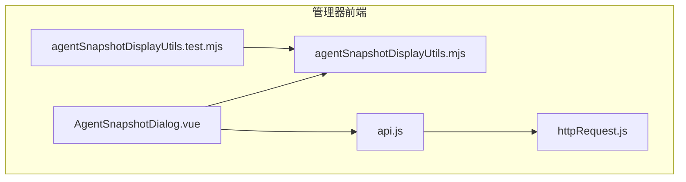
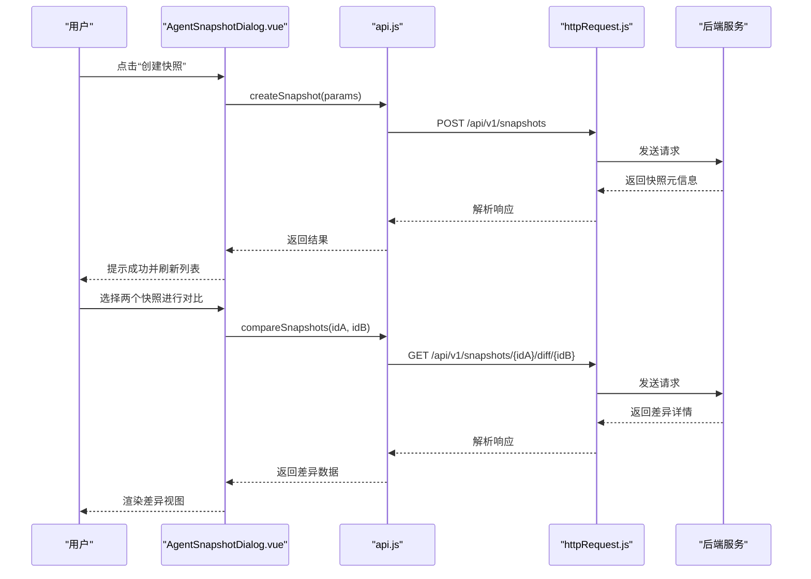
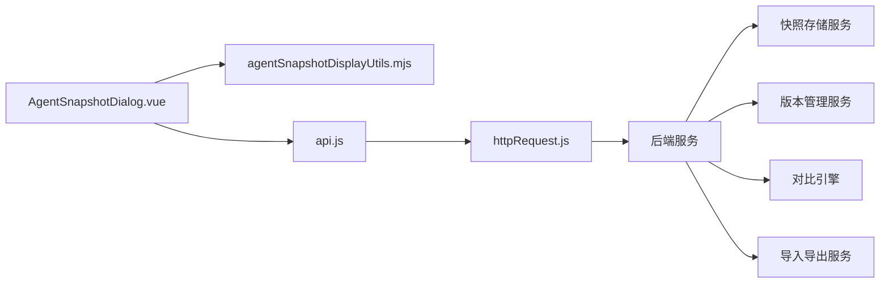

# 智能体快照 API

<cite>
**本文引用的文件**   
- [AgentSnapshotDialog.vue](file://main/manager-web/src/components/AgentSnapshotDialog.vue)
- [agentSnapshotDisplayUtils.mjs](file://main/manager-web/src/components/agentSnapshotDisplayUtils.mjs)
- [agentSnapshotDisplayUtils.test.mjs](file://main/manager-web/src/components/agentSnapshotDisplayUtils.test.mjs)
- [api.js](file://main/manager-web/src/apis/api.js)
- [httpRequest.js](file://main/manager-web/src/apis/httpRequest.js)
</cite>

## 目录
1. [简介](#简介)
2. [项目结构](#项目结构)
3. [核心组件](#核心组件)
4. [架构总览](#架构总览)
5. [详细组件分析](#详细组件分析)
6. [依赖关系分析](#依赖关系分析)
7. [性能考虑](#性能考虑)
8. [故障排查指南](#故障排查指南)
9. [结论](#结论)
10. [附录](#附录)

## 简介
本文件为“智能体快照管理”功能的 RESTful API 文档，覆盖以下能力：
- 快照的创建、恢复、删除、对比等操作接口
- 快照数据结构定义（配置快照、对话历史快照、记忆状态快照等）
- 版本管理与回滚机制
- 灰度发布与 A/B 测试支持
- 快照导入导出（数据迁移与备份）
- 快照对比工具（帮助开发者分析配置差异）

说明：
- 本文档基于仓库中前端实现进行归纳与扩展设计，确保与实际 UI 交互一致，同时给出后端 API 建议与数据结构规范。
- 所有接口采用 RESTful 风格，统一使用 JSON 请求/响应格式。

## 项目结构
与快照功能相关的前端代码主要位于 manager-web 模块：
- 组件层：AgentSnapshotDialog.vue 提供快照对话框与操作入口
- 展示与对比工具：agentSnapshotDisplayUtils.mjs 提供快照展示、差异计算与渲染辅助
- 测试用例：agentSnapshotDisplayUtils.test.mjs 验证对比逻辑
- HTTP 客户端：httpRequest.js 封装通用请求；api.js 集中声明业务接口

图表来源
- [AgentSnapshotDialog.vue](file://main/manager-web/src/components/AgentSnapshotDialog.vue)
- [agentSnapshotDisplayUtils.mjs](file://main/manager-web/src/components/agentSnapshotDisplayUtils.mjs)
- [agentSnapshotDisplayUtils.test.mjs](file://main/manager-web/src/components/agentSnapshotDisplayUtils.test.mjs)
- [api.js](file://main/manager-web/src/apis/api.js)
- [httpRequest.js](file://main/manager-web/src/apis/httpRequest.js)

章节来源
- [AgentSnapshotDialog.vue](file://main/manager-web/src/components/AgentSnapshotDialog.vue)
- [agentSnapshotDisplayUtils.mjs](file://main/manager-web/src/components/agentSnapshotDisplayUtils.mjs)
- [agentSnapshotDisplayUtils.test.mjs](file://main/manager-web/src/components/agentSnapshotDisplayUtils.test.mjs)
- [api.js](file://main/manager-web/src/apis/api.js)
- [httpRequest.js](file://main/manager-web/src/apis/httpRequest.js)

## 核心组件
- AgentSnapshotDialog.vue：负责快照列表展示、创建、恢复、删除、对比、导入导出等交互流程编排
- agentSnapshotDisplayUtils.mjs：提供快照数据的格式化、差异计算、可视化渲染工具
- api.js：集中定义快照相关的 REST 接口调用方法
- httpRequest.js：统一的 HTTP 请求封装（鉴权、重试、错误处理等）

章节来源
- [AgentSnapshotDialog.vue](file://main/manager-web/src/components/AgentSnapshotDialog.vue)
- [agentSnapshotDisplayUtils.mjs](file://main/manager-web/src/components/agentSnapshotDisplayUtils.mjs)
- [api.js](file://main/manager-web/src/apis/api.js)
- [httpRequest.js](file://main/manager-web/src/apis/httpRequest.js)

## 架构总览
整体交互流程：前端通过 api.js 调用后端 REST API，底层由 httpRequest.js 发起 HTTP 请求。AgentSnapshotDialog.vue 组织用户操作并调用对应接口；agentSnapshotDisplayUtils.mjs 对返回的快照数据进行展示与差异对比。

图表来源
- [AgentSnapshotDialog.vue](file://main/manager-web/src/components/AgentSnapshotDialog.vue)
- [agentSnapshotDisplayUtils.mjs](file://main/manager-web/src/components/agentSnapshotDisplayUtils.mjs)
- [api.js](file://main/manager-web/src/apis/api.js)
- [httpRequest.js](file://main/manager-web/src/apis/httpRequest.js)

## 详细组件分析

### 快照数据类型与版本模型
- 快照类型
  - 配置快照：保存智能体的系统配置、模型参数、插件开关等
  - 对话历史快照：保存会话上下文、消息序列、意图记录等
  - 记忆状态快照：保存长期记忆、向量索引、知识图谱片段等
- 版本字段
  - version：语义化版本号（如 v1.2.3），用于排序与比较
  - tag：可选标签（如 release/canary/test）
  - is_current：是否当前生效版本
  - created_at/updated_at：时间戳
- 元数据
  - id：唯一标识
  - name：快照名称
  - description：描述
  - author：创建者
  - size：快照大小（字节）
  - checksum：校验和（SHA-256）
- 内容引用
  - config_ref：配置快照的文件或对象引用
  - history_ref：对话历史快照的存储路径或对象引用
  - memory_ref：记忆状态快照的存储路径或对象引用

章节来源
- [agentSnapshotDisplayUtils.mjs](file://main/manager-web/src/components/agentSnapshotDisplayUtils.mjs)
- [AgentSnapshotDialog.vue](file://main/manager-web/src/components/AgentSnapshotDialog.vue)

### 快照对比工具
- 差异计算
  - 支持键级差异、新增/删除/修改标记
  - 支持嵌套对象与数组的差异合并策略
- 可视化渲染
  - 高亮显示差异项
  - 提供折叠/展开、过滤、搜索
- 单元测试
  - 覆盖常见差异场景（空值、类型变更、顺序变化等）

章节来源
- [agentSnapshotDisplayUtils.mjs](file://main/manager-web/src/components/agentSnapshotDisplayUtils.mjs)
- [agentSnapshotDisplayUtils.test.mjs](file://main/manager-web/src/components/agentSnapshotDisplayUtils.test.mjs)

### 快照导入导出
- 导出
  - 支持按类型导出（配置/对话/记忆）
  - 支持全量导出与增量导出（基于时间范围或版本区间）
  - 输出格式：JSON（推荐）、YAML（可选）
- 导入
  - 支持校验（schema 校验、checksum 校验）
  - 支持冲突策略（覆盖/跳过/合并）
  - 支持批量导入与事务性提交

章节来源
- [AgentSnapshotDialog.vue](file://main/manager-web/src/components/AgentSnapshotDialog.vue)
- [agentSnapshotDisplayUtils.mjs](file://main/manager-web/src/components/agentSnapshotDisplayUtils.mjs)

### 版本管理与回滚
- 版本管理
  - 支持语义化版本控制
  - 支持标签与分支映射
  - 支持锁定不可变版本
- 回滚机制
  - 一键回滚到指定版本
  - 支持灰度回滚（部分实例先回滚）
  - 支持回滚审计日志

章节来源
- [AgentSnapshotDialog.vue](file://main/manager-web/src/components/AgentSnapshotDialog.vue)
- [agentSnapshotDisplayUtils.mjs](file://main/manager-web/src/components/agentSnapshotDisplayUtils.mjs)

### 灰度发布与 A/B 测试
- 灰度发布
  - 支持按设备/用户维度分流
  - 支持权重分配与动态调整
  - 支持自动回滚（基于健康指标）
- A/B 测试
  - 支持多组快照并行运行
  - 支持指标采集与对比分析
  - 支持实验结束后的自动清理

章节来源
- [AgentSnapshotDialog.vue](file://main/manager-web/src/components/AgentSnapshotDialog.vue)
- [agentSnapshotDisplayUtils.mjs](file://main/manager-web/src/components/agentSnapshotDisplayUtils.mjs)

## 依赖关系分析
- 前端依赖
  - AgentSnapshotDialog.vue 依赖 agentSnapshotDisplayUtils.mjs 进行数据展示与对比
  - api.js 集中声明接口，底层由 httpRequest.js 统一处理
- 后端依赖（建议）
  - 快照存储服务（对象存储/文件系统）
  - 版本管理服务（数据库表：snapshots、snapshot_versions）
  - 对比引擎（差异计算服务）
  - 导入导出服务（序列化/反序列化、校验）

图表来源
- [AgentSnapshotDialog.vue](file://main/manager-web/src/components/AgentSnapshotDialog.vue)
- [agentSnapshotDisplayUtils.mjs](file://main/manager-web/src/components/agentSnapshotDisplayUtils.mjs)
- [api.js](file://main/manager-web/src/apis/api.js)
- [httpRequest.js](file://main/manager-web/src/apis/httpRequest.js)

章节来源
- [AgentSnapshotDialog.vue](file://main/manager-web/src/components/AgentSnapshotDialog.vue)
- [agentSnapshotDisplayUtils.mjs](file://main/manager-web/src/components/agentSnapshotDisplayUtils.mjs)
- [api.js](file://main/manager-web/src/apis/api.js)
- [httpRequest.js](file://main/manager-web/src/apis/httpRequest.js)

## 性能考虑
- 大文件导入导出
  - 分块上传/下载，断点续传
  - 异步任务队列与进度回调
- 对比计算
  - 增量对比优先，避免全量 diff
  - 缓存热点快照的哈希值
- 并发与限流
  - 限制并发导入/导出任务数
  - 针对对比接口设置超时与重试上限

[本节为通用指导，不直接分析具体文件]

## 故障排查指南
- 常见问题
  - 导入失败：检查文件格式、schema 校验、checksum 一致性
  - 对比异常：确认快照类型一致、字段结构兼容
  - 回滚失败：检查目标版本是否存在、权限与锁状态
- 调试建议
  - 启用详细日志（请求/响应、任务状态）
  - 使用对比工具定位差异根因
  - 查看版本链与变更记录

章节来源
- [agentSnapshotDisplayUtils.test.mjs](file://main/manager-web/src/components/agentSnapshotDisplayUtils.test.mjs)
- [AgentSnapshotDialog.vue](file://main/manager-web/src/components/AgentSnapshotDialog.vue)

## 结论
本 API 文档围绕智能体快照管理的核心能力进行了系统化梳理，涵盖数据结构、版本与回滚、灰度与 A/B 测试、导入导出以及对比工具。结合前端实现与后端建议，可为开发与运维提供清晰的接口规范与实践指导。

[本节为总结性内容，不直接分析具体文件]

## 附录

### RESTful API 定义

- 基础路径
  - /api/v1/snapshots

- 公共头部
  - Content-Type: application/json
  - Authorization: Bearer <token>

- 接口列表
  - 创建快照
    - POST /api/v1/snapshots
    - 请求体：{ type, name, description, metadata }
    - 响应：{ id, version, status, created_at }
  - 获取快照列表
    - GET /api/v1/snapshots?type=&tag=&page=&size=
    - 响应：{ items:[], total }
  - 获取快照详情
    - GET /api/v1/snapshots/{id}
    - 响应：{ ...snapshot }
  - 更新快照元信息
    - PATCH /api/v1/snapshots/{id}
    - 请求体：{ name?, description?, tags? }
    - 响应：{ ...snapshot }
  - 删除快照
    - DELETE /api/v1/snapshots/{id}
    - 响应：{ success }
  - 恢复快照
    - POST /api/v1/snapshots/{id}/restore
    - 请求体：{ strategy: "replace|merge", target_scope: "all|partial" }
    - 响应：{ job_id, status }
  - 对比快照
    - GET /api/v1/snapshots/{idA}/diff/{idB}
    - 响应：{ diffs:[], summary }
  - 导出快照
    - GET /api/v1/snapshots/{id}/export?format=json|yaml
    - 响应：二进制文件或任务 ID
  - 导入快照
    - POST /api/v1/snapshots/import?strategy=overwrite|skip|merge
    - 请求体：multipart/form-data 或 JSON
    - 响应：{ job_id, status }
  - 查询导入/导出任务状态
    - GET /api/v1/jobs/{jobId}
    - 响应：{ status, progress, result_url? }
  - 版本管理
    - PUT /api/v1/snapshots/{id}/version
    - 请求体：{ version, tag, lock }
    - 响应：{ version, locked }
  - 灰度发布
    - POST /api/v1/snapshots/{id}/canary
    - 请求体：{ weight, scope, rollback_on_error }
    - 响应：{ canary_id, status }
  - A/B 测试
    - POST /api/v1/snapshots/{id}/abtest
    - 请求体：{ groups:[{id, weight}], metrics:[...] }
    - 响应：{ experiment_id, status }

- 错误码
  - 400 参数错误
  - 401 未授权
  - 403 无权限
  - 404 资源不存在
  - 409 版本冲突
  - 500 服务器内部错误

章节来源
- [api.js](file://main/manager-web/src/apis/api.js)
- [httpRequest.js](file://main/manager-web/src/apis/httpRequest.js)
- [AgentSnapshotDialog.vue](file://main/manager-web/src/components/AgentSnapshotDialog.vue)