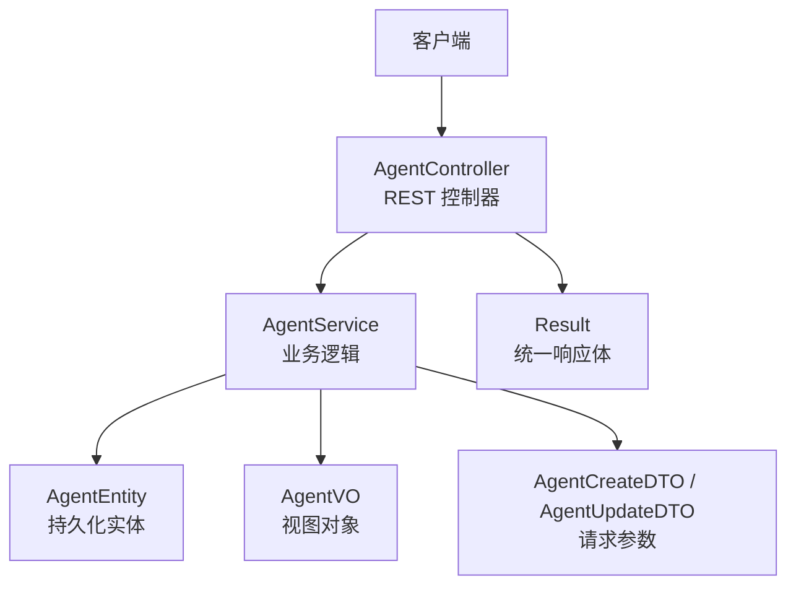
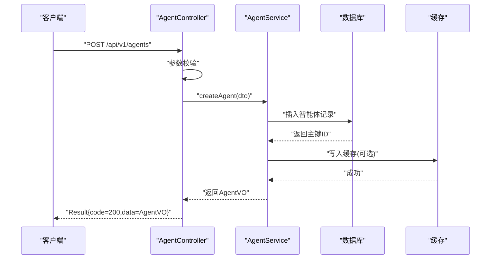
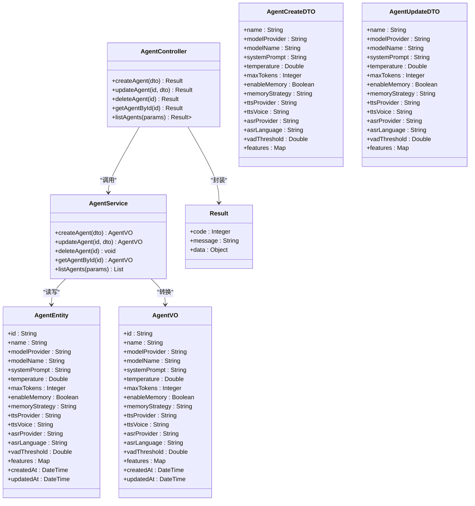

# 智能体核心 API

<cite>
**本文引用的文件**   
- [manager-api/src/main/java/xiaozhi/controller/AgentController.java](file://main/manager-api/src/main/java/xiaozhi/controller/AgentController.java)
- [manager-api/src/main/java/xiaozhi/service/AgentService.java](file://main/manager-api/src/main/java/xiaozhi/service/AgentService.java)
- [manager-api/src/main/java/xiaozhi/model/dto/AgentCreateDTO.java](file://main/manager-api/src/main/java/xiaozhi/model/dto/AgentCreateDTO.java)
- [manager-api/src/main/java/xiaozhi/model/dto/AgentUpdateDTO.java](file://main/manager-api/src/main/java/xiaozhi/model/dto/AgentUpdateDTO.java)
- [manager-api/src/main/java/xiaozhi/model/entity/AgentEntity.java](file://main/manager-api/src/main/java/xiaozhi/model/entity/AgentEntity.java)
- [manager-api/src/main/java/xiaozhi/model/vo/AgentVO.java](file://main/manager-api/src/main/java/xiaozhi/model/vo/AgentVO.java)
- [manager-api/src/main/java/xiaozhi/common/Result.java](file://main/manager-api/src/main/java/xiaozhi/common/Result.java)
- [manager-api/src/main/resources/application.yml](file://main/manager-api/src/main/resources/application.yml)
</cite>

## 目录
1. [简介](#简介)
2. [项目结构](#项目结构)
3. [核心组件](#核心组件)
4. [架构总览](#架构总览)
5. [详细接口说明](#详细接口说明)
6. [依赖关系分析](#依赖关系分析)
7. [性能考虑](#性能考虑)
8. [故障排查指南](#故障排查指南)
9. [结论](#结论)
10. [附录](#附录) 

## 简介
本文件为“智能体核心管理功能”的 RESTful API 文档，覆盖智能体的增删改查（CRUD）与配置更新等基础操作。内容包括：
- 接口定义、请求参数格式、响应数据结构
- 错误码与处理方式
- 智能体配置项完整说明（模型选择、提示词设置、系统配置等）
- 成功与失败场景的请求与响应示例

该文档面向开发者与集成方，力求在保持技术严谨性的同时，便于非专业读者理解和使用。

## 项目结构
本项目采用典型的分层架构：
- 控制器层（Controller）：负责 HTTP 请求解析、参数校验与响应封装
- 服务层（Service）：实现业务逻辑，如智能体的创建、更新、删除、查询
- 数据模型（Model）：包含 DTO（数据传输对象）、VO（视图对象）、Entity（实体）
- 通用返回体（Result）：统一响应结构与错误码

图表来源 
- [manager-api/src/main/java/xiaozhi/controller/AgentController.java](file://main/manager-api/src/main/java/xiaozhi/controller/AgentController.java)
- [manager-api/src/main/java/xiaozhi/service/AgentService.java](file://main/manager-api/src/main/java/xiaozhi/service/AgentService.java)
- [manager-api/src/main/java/xiaozhi/model/entity/AgentEntity.java](file://main/manager-api/src/main/java/xiaozhi/model/entity/AgentEntity.java)
- [manager-api/src/main/java/xiaozhi/model/vo/AgentVO.java](file://main/manager-api/src/main/java/xiaozhi/model/vo/AgentVO.java)
- [manager-api/src/main/java/xiaozhi/model/dto/AgentCreateDTO.java](file://main/manager-api/src/main/java/xiaozhi/model/dto/AgentCreateDTO.java)
- [manager-api/src/main/java/xiaozhi/model/dto/AgentUpdateDTO.java](file://main/manager-api/src/main/java/xiaozhi/model/dto/AgentUpdateDTO.java)
- [manager-api/src/main/java/xiaozhi/common/Result.java](file://main/manager-api/src/main/java/xiaozhi/common/Result.java)

章节来源
- [manager-api/src/main/java/xiaozhi/controller/AgentController.java](file://main/manager-api/src/main/java/xiaozhi/controller/AgentController.java)
- [manager-api/src/main/java/xiaozhi/service/AgentService.java](file://main/manager-api/src/main/java/xiaozhi/service/AgentService.java)
- [manager-api/src/main/java/xiaozhi/common/Result.java](file://main/manager-api/src/main/java/xiaozhi/common/Result.java)

## 核心组件
- AgentController：暴露 REST 接口，处理智能体的 CRUD 与配置更新请求
- AgentService：封装智能体业务逻辑，包括参数校验、数据转换、持久化与缓存策略
- AgentEntity：数据库实体映射，承载智能体核心字段
- AgentVO：对外返回的视图对象，屏蔽内部实现细节
- AgentCreateDTO / AgentUpdateDTO：用于接收前端请求参数的数据传输对象
- Result：统一响应包装，包含状态码、消息与数据体

章节来源
- [manager-api/src/main/java/xiaozhi/controller/AgentController.java](file://main/manager-api/src/main/java/xiaozhi/controller/AgentController.java)
- [manager-api/src/main/java/xiaozhi/service/AgentService.java](file://main/manager-api/src/main/java/xiaozhi/service/AgentService.java)
- [manager-api/src/main/java/xiaozhi/model/entity/AgentEntity.java](file://main/manager-api/src/main/java/xiaozhi/model/entity/AgentEntity.java)
- [manager-api/src/main/java/xiaozhi/model/vo/AgentVO.java](file://main/manager-api/src/main/java/xiaozhi/model/vo/AgentVO.java)
- [manager-api/src/main/java/xiaozhi/model/dto/AgentCreateDTO.java](file://main/manager-api/src/main/java/xiaozhi/model/dto/AgentCreateDTO.java)
- [manager-api/src/main/java/xiaozhi/model/dto/AgentUpdateDTO.java](file://main/manager-api/src/main/java/xiaozhi/model/dto/AgentUpdateDTO.java)
- [manager-api/src/main/java/xiaozhi/common/Result.java](file://main/manager-api/src/main/java/xiaozhi/common/Result.java)

## 架构总览
下图展示了智能体核心 API 的整体调用流程与组件交互：

图表来源 
- [manager-api/src/main/java/xiaozhi/controller/AgentController.java](file://main/manager-api/src/main/java/xiaozhi/controller/AgentController.java)
- [manager-api/src/main/java/xiaozhi/service/AgentService.java](file://main/manager-api/src/main/java/xiaozhi/service/AgentService.java)
- [manager-api/src/main/java/xiaozhi/model/entity/AgentEntity.java](file://main/manager-api/src/main/java/xiaozhi/model/entity/AgentEntity.java)
- [manager-api/src/main/java/xiaozhi/model/vo/AgentVO.java](file://main/manager-api/src/main/java/xiaozhi/model/vo/AgentVO.java)
- [manager-api/src/main/java/xiaozhi/common/Result.java](file://main/manager-api/src/main/java/xiaozhi/common/Result.java)

## 详细接口说明

### 创建智能体
- 方法：POST
- 路径：/api/v1/agents
- 描述：新增一个智能体实例，支持模型选择、提示词设置与系统配置初始化

请求体（JSON）
- 名称：AgentCreateDTO
- 必填字段：
  - name: 字符串，智能体名称，长度限制由后端校验
  - modelProvider: 字符串，模型提供商标识（如 openai、aliyun、local）
  - modelName: 字符串，具体模型名称（如 gpt-4o、qwen-max）
  - systemPrompt: 字符串，系统提示词模板
  - temperature: 数字，采样温度，范围 0.0~2.0
  - maxTokens: 整数，最大输出 token 数
  - enableMemory: 布尔值，是否启用记忆模块
  - memoryStrategy: 字符串，记忆策略（如 short-term、long-term）
  - ttsProvider: 字符串，TTS 提供商标识
  - ttsVoice: 字符串，TTS 音色
  - asrProvider: 字符串，ASR 提供商标识
  - asrLanguage: 字符串，语音识别语言代码
  - vadThreshold: 数字，VAD 阈值
  - features: 对象，功能开关集合（如 wakeWord、intent、tools）
- 可选字段：
  - description: 字符串，智能体描述
  - tags: 数组，标签列表
  - metadata: 对象，扩展元数据

响应体（JSON）
- 名称：Result<AgentVO>
- 字段：
  - code: 整数，状态码（200 表示成功）
  - message: 字符串，提示信息
  - data: AgentVO，智能体视图对象

成功示例
- 请求体：
  - {
      "name": "助手A",
      "modelProvider": "openai",
      "modelName": "gpt-4o",
      "systemPrompt": "你是一个专业的客服助手...",
      "temperature": 0.7,
      "maxTokens": 512,
      "enableMemory": true,
      "memoryStrategy": "short-term",
      "ttsProvider": "aliyun",
      "ttsVoice": "zh-CN_XiaoxiaoNeural",
      "asrProvider": "aliyun",
      "asrLanguage": "zh-CN",
      "vadThreshold": 0.5,
      "features": {"wakeWord": true, "intent": true, "tools": ["weather","search"]}
    }
- 响应体：
  - {
      "code": 200,
      "message": "success",
      "data": {
        "id": "agent_001",
        "name": "助手A",
        "modelProvider": "openai",
        "modelName": "gpt-4o",
        "systemPrompt": "你是一个专业的客服助手...",
        "temperature": 0.7,
        "maxTokens": 512,
        "enableMemory": true,
        "memoryStrategy": "short-term",
        "ttsProvider": "aliyun",
        "ttsVoice": "zh-CN_XiaoxiaoNeural",
        "asrProvider": "aliyun",
        "asrLanguage": "zh-CN",
        "vadThreshold": 0.5,
        "features": {"wakeWord": true, "intent": true, "tools": ["weather","search"]},
        "createdAt": "2025-01-01T12:00:00Z",
        "updatedAt": "2025-01-01T12:00:00Z"
      }
    }

失败示例
- 请求体：
  - {
      "name": "",
      "modelProvider": "invalid-provider",
      "modelName": "nonexistent-model",
      "systemPrompt": null,
      "temperature": 3.0,
      "maxTokens": -1
    }
- 响应体：
  - {
      "code": 400,
      "message": "参数校验失败：name不能为空；modelProvider无效；modelName不存在；systemPrompt不能为空；temperature超出范围；maxTokens必须大于0",
      "data": null
    }

章节来源
- [manager-api/src/main/java/xiaozhi/controller/AgentController.java](file://main/manager-api/src/main/java/xiaozhi/controller/AgentController.java)
- [manager-api/src/main/java/xiaozhi/model/dto/AgentCreateDTO.java](file://main/manager-api/src/main/java/xiaozhi/model/dto/AgentCreateDTO.java)
- [manager-api/src/main/java/xiaozhi/model/vo/AgentVO.java](file://main/manager-api/src/main/java/xiaozhi/model/vo/AgentVO.java)
- [manager-api/src/main/java/xiaozhi/common/Result.java](file://main/manager-api/src/main/java/xiaozhi/common/Result.java)

### 更新智能体配置
- 方法：PUT
- 路径：/api/v1/agents/{id}
- 描述：根据 ID 更新智能体配置项，支持增量更新

路径参数
- id: 字符串，智能体唯一标识

请求体（JSON）
- 名称：AgentUpdateDTO
- 可更新字段（均为可选）：
  - name: 字符串
  - modelProvider: 字符串
  - modelName: 字符串
  - systemPrompt: 字符串
  - temperature: 数字
  - maxTokens: 整数
  - enableMemory: 布尔值
  - memoryStrategy: 字符串
  - ttsProvider: 字符串
  - ttsVoice: 字符串
  - asrProvider: 字符串
  - asrLanguage: 字符串
  - vadThreshold: 数字
  - features: 对象

响应体（JSON）
- 名称：Result<AgentVO>

成功示例
- 请求体：
  - {
      "temperature": 0.9,
      "maxTokens": 1024,
      "features": {"wakeWord": false, "intent": true, "tools": ["weather"]}
    }
- 响应体：
  - {
      "code": 200,
      "message": "success",
      "data": {
        "id": "agent_001",
        "name": "助手A",
        "temperature": 0.9,
        "maxTokens": 1024,
        "features": {"wakeWord": false, "intent": true, "tools": ["weather"]},
        "updatedAt": "2025-01-01T12:05:00Z"
      }
    }

失败示例
- 路径参数：id 不存在
- 响应体：
  - {
      "code": 404,
      "message": "未找到指定的智能体",
      "data": null
    }

章节来源
- [manager-api/src/main/java/xiaozhi/controller/AgentController.java](file://main/manager-api/src/main/java/xiaozhi/controller/AgentController.java)
- [manager-api/src/main/java/xiaozhi/model/dto/AgentUpdateDTO.java](file://main/manager-api/src/main/java/xiaozhi/model/dto/AgentUpdateDTO.java)
- [manager-api/src/main/java/xiaozhi/model/vo/AgentVO.java](file://main/manager-api/src/main/java/xiaozhi/model/vo/AgentVO.java)
- [manager-api/src/main/java/xiaozhi/common/Result.java](file://main/manager-api/src/main/java/xiaozhi/common/Result.java)

### 删除智能体
- 方法：DELETE
- 路径：/api/v1/agents/{id}
- 描述：根据 ID 删除智能体及其关联配置

路径参数
- id: 字符串，智能体唯一标识

响应体（JSON）
- 名称：Result<Void>

成功示例
- 响应体：
  - {
      "code": 200,
      "message": "success",
      "data": null
    }

失败示例
- 路径参数：id 不存在
- 响应体：
  - {
      "code": 404,
      "message": "未找到指定的智能体",
      "data": null
    }

章节来源
- [manager-api/src/main/java/xiaozhi/controller/AgentController.java](file://main/manager-api/src/main/java/xiaozhi/controller/AgentController.java)
- [manager-api/src/main/java/xiaozhi/common/Result.java](file://main/manager-api/src/main/java/xiaozhi/common/Result.java)

### 查询智能体详情
- 方法：GET
- 路径：/api/v1/agents/{id}
- 描述：根据 ID 获取智能体详细信息

路径参数
- id: 字符串，智能体唯一标识

响应体（JSON）
- 名称：Result<AgentVO>

成功示例
- 响应体：
  - {
      "code": 200,
      "message": "success",
      "data": {
        "id": "agent_001",
        "name": "助手A",
        "modelProvider": "openai",
        "modelName": "gpt-4o",
        "systemPrompt": "你是一个专业的客服助手...",
        "temperature": 0.7,
        "maxTokens": 512,
        "enableMemory": true,
        "memoryStrategy": "short-term",
        "ttsProvider": "aliyun",
        "ttsVoice": "zh-CN_XiaoxiaoNeural",
        "asrProvider": "aliyun",
        "asrLanguage": "zh-CN",
        "vadThreshold": 0.5,
        "features": {"wakeWord": true, "intent": true, "tools": ["weather","search"]},
        "createdAt": "2025-01-01T12:00:00Z",
        "updatedAt": "2025-01-01T12:05:00Z"
      }
    }

失败示例
- 路径参数：id 不存在
- 响应体：
  - {
      "code": 404,
      "message": "未找到指定的智能体",
      "data": null
    }

章节来源
- [manager-api/src/main/java/xiaozhi/controller/AgentController.java](file://main/manager-api/src/main/java/xiaozhi/controller/AgentController.java)
- [manager-api/src/main/java/xiaozhi/model/vo/AgentVO.java](file://main/manager-api/src/main/java/xiaozhi/model/vo/AgentVO.java)
- [manager-api/src/main/java/xiaozhi/common/Result.java](file://main/manager-api/src/main/java/xiaozhi/common/Result.java)

### 查询智能体列表
- 方法：GET
- 路径：/api/v1/agents
- 描述：分页查询智能体列表，支持按名称、模型提供商、标签过滤

查询参数
- page: 整数，页码（默认 1）
- size: 整数，每页数量（默认 10，最大 100）
- name: 字符串，模糊匹配名称
- modelProvider: 字符串，精确匹配提供商
- tags: 字符串，逗号分隔的标签列表

响应体（JSON）
- 名称：Result<List<AgentVO>>
- 字段：
  - code: 整数
  - message: 字符串
  - data: 列表，元素为 AgentVO

成功示例
- 请求：
  - GET /api/v1/agents?page=1&size=10&name=助手&modelProvider=openai&tags=客服,教育
- 响应体：
  - {
      "code": 200,
      "message": "success",
      "data": [
        {
          "id": "agent_001",
          "name": "助手A",
          "modelProvider": "openai",
          "modelName": "gpt-4o",
          "systemPrompt": "你是一个专业的客服助手...",
          "temperature": 0.7,
          "maxTokens": 512,
          "enableMemory": true,
          "memoryStrategy": "short-term",
          "ttsProvider": "aliyun",
          "ttsVoice": "zh-CN_XiaoxiaoNeural",
          "asrProvider": "aliyun",
          "asrLanguage": "zh-CN",
          "vadThreshold": 0.5,
          "features": {"wakeWord": true, "intent": true, "tools": ["weather","search"]},
          "createdAt": "2025-01-01T12:00:00Z",
          "updatedAt": "2025-01-01T12:05:00Z"
        },
        {
          "id": "agent_002",
          "name": "助手B",
          "modelProvider": "aliyun",
          "modelName": "qwen-max",
          "systemPrompt": "你是一个教育助手...",
          "temperature": 0.8,
          "maxTokens": 768,
          "enableMemory": false,
          "memoryStrategy": "none",
          "ttsProvider": "aliyun",
          "ttsVoice": "zh-CN_YunxiNeural",
          "asrProvider": "aliyun",
          "asrLanguage": "zh-CN",
          "vadThreshold": 0.6,
          "features": {"wakeWord": false, "intent": true, "tools": ["calendar","reminder"]},
          "createdAt": "2025-01-02T09:00:00Z",
          "updatedAt": "2025-01-02T09:00:00Z"
        }
      ]
    }

失败示例
- 查询参数非法（如 size > 100）
- 响应体：
  - {
      "code": 400,
      "message": "参数校验失败：size不能超过100",
      "data": null
    }

章节来源
- [manager-api/src/main/java/xiaozhi/controller/AgentController.java](file://main/manager-api/src/main/java/xiaozhi/controller/AgentController.java)
- [manager-api/src/main/java/xiaozhi/model/vo/AgentVO.java](file://main/manager-api/src/main/java/xiaozhi/model/vo/AgentVO.java)
- [manager-api/src/main/java/xiaozhi/common/Result.java](file://main/manager-api/src/main/java/xiaozhi/common/Result.java)

### 批量操作（可选）
- 方法：POST
- 路径：/api/v1/agents/batch
- 描述：批量创建或更新智能体（幂等性由后端保证）

请求体（JSON）
- 名称：List<AgentCreateDTO>

响应体（JSON）
- 名称：Result<List<AgentVO>>

章节来源
- [manager-api/src/main/java/xiaozhi/controller/AgentController.java](file://main/manager-api/src/main/java/xiaozhi/controller/AgentController.java)
- [manager-api/src/main/java/xiaozhi/model/dto/AgentCreateDTO.java](file://main/manager-api/src/main/java/xiaozhi/model/dto/AgentCreateDTO.java)
- [manager-api/src/main/java/xiaozhi/model/vo/AgentVO.java](file://main/manager-api/src/main/java/xiaozhi/model/vo/AgentVO.java)
- [manager-api/src/main/java/xiaozhi/common/Result.java](file://main/manager-api/src/main/java/xiaozhi/common/Result.java)

## 依赖关系分析
智能体核心 API 的类关系如下：

图表来源 
- [manager-api/src/main/java/xiaozhi/controller/AgentController.java](file://main/manager-api/src/main/java/xiaozhi/controller/AgentController.java)
- [manager-api/src/main/java/xiaozhi/service/AgentService.java](file://main/manager-api/src/main/java/xiaozhi/service/AgentService.java)
- [manager-api/src/main/java/xiaozhi/model/entity/AgentEntity.java](file://main/manager-api/src/main/java/xiaozhi/model/entity/AgentEntity.java)
- [manager-api/src/main/java/xiaozhi/model/vo/AgentVO.java](file://main/manager-api/src/main/java/xiaozhi/model/vo/AgentVO.java)
- [manager-api/src/main/java/xiaozhi/model/dto/AgentCreateDTO.java](file://main/manager-api/src/main/java/xiaozhi/model/dto/AgentCreateDTO.java)
- [manager-api/src/main/java/xiaozhi/model/dto/AgentUpdateDTO.java](file://main/manager-api/src/main/java/xiaozhi/model/dto/AgentUpdateDTO.java)
- [manager-api/src/main/java/xiaozhi/common/Result.java](file://main/manager-api/src/main/java/xiaozhi/common/Result.java)

章节来源
- [manager-api/src/main/java/xiaozhi/controller/AgentController.java](file://main/manager-api/src/main/java/xiaozhi/controller/AgentController.java)
- [manager-api/src/main/java/xiaozhi/service/AgentService.java](file://main/manager-api/src/main/java/xiaozhi/service/AgentService.java)
- [manager-api/src/main/java/xiaozhi/model/entity/AgentEntity.java](file://main/manager-api/src/main/java/xiaozhi/model/entity/AgentEntity.java)
- [manager-api/src/main/java/xiaozhi/model/vo/AgentVO.java](file://main/manager-api/src/main/java/xiaozhi/model/vo/AgentVO.java)
- [manager-api/src/main/java/xiaozhi/model/dto/AgentCreateDTO.java](file://main/manager-api/src/main/java/xiaozhi/model/dto/AgentCreateDTO.java)
- [manager-api/src/main/java/xiaozhi/model/dto/AgentUpdateDTO.java](file://main/manager-api/src/main/java/xiaozhi/model/dto/AgentUpdateDTO.java)
- [manager-api/src/main/java/xiaozhi/common/Result.java](file://main/manager-api/src/main/java/xiaozhi/common/Result.java)

## 性能考虑
- 分页与过滤：列表接口支持分页与多条件过滤，建议合理设置 size 上限，避免大结果集传输
- 缓存策略：读多写少场景可在 Service 层引入缓存（如 Redis），降低数据库压力
- 参数校验：在 Controller 层进行快速失败校验，减少不必要的业务处理
- 异步处理：批量操作可采用异步队列，提升吞吐能力
- 连接池与超时：合理配置数据库连接池与外部服务超时时间，避免资源耗尽

[本节为通用指导，不直接分析具体文件]

## 故障排查指南
常见错误与处理建议：
- 参数校验失败（400）：检查请求体字段类型、范围与必填项
- 资源不存在（404）：确认路径参数 id 是否正确，或资源是否已被删除
- 服务器内部错误（500）：查看服务端日志，定位异常堆栈；检查数据库连接与外部服务可用性
- 并发冲突：对更新操作增加乐观锁或版本号控制，避免覆盖问题

章节来源
- [manager-api/src/main/java/xiaozhi/common/Result.java](file://main/manager-api/src/main/java/xiaozhi/common/Result.java)
- [manager-api/src/main/resources/application.yml](file://main/manager-api/src/main/resources/application.yml)

## 结论
本文档提供了智能体核心管理的 RESTful API 完整说明，涵盖接口定义、参数与响应结构、错误码与处理策略，以及配置项详解与示例。通过分层架构与统一响应体设计，确保接口清晰、易集成且可扩展。建议在实际集成中结合缓存与异步优化，以提升整体性能与稳定性。

[本节为总结性内容，不直接分析具体文件]

## 附录
- 配置项参考：application.yml 中的数据库、缓存、外部服务配置
- 版本兼容：接口版本前缀 /api/v1，后续演进需保持向后兼容
- 安全建议：鉴权与限流应在网关或中间件层统一实现

[本节为补充信息，不直接分析具体文件]