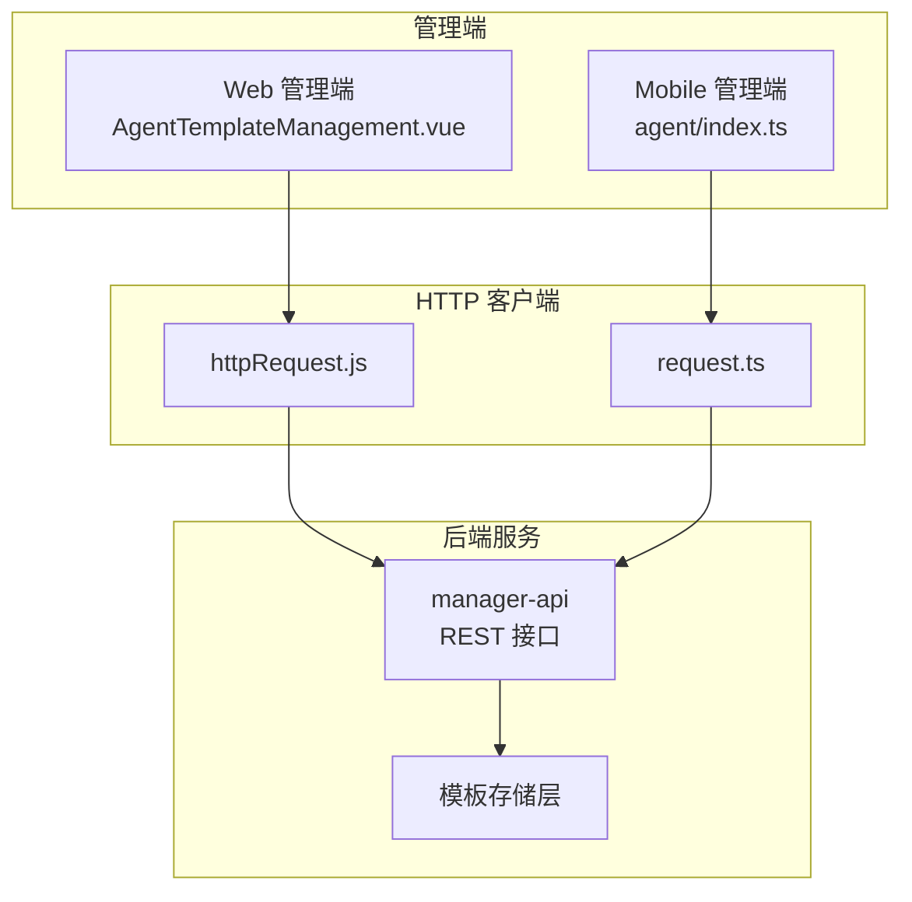
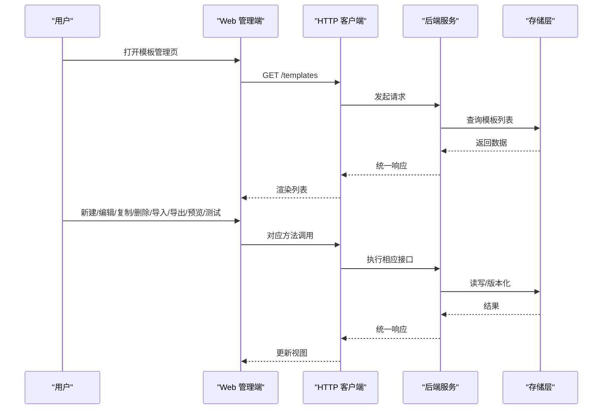
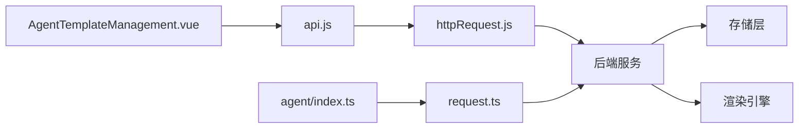

# 智能体模板 API

<cite>
**本文引用的文件**   
- [AgentTemplateManagement.vue](file://main/manager-web/src/views/AgentTemplateManagement.vue)
- [api.js](file://main/manager-web/src/apis/api.js)
- [httpRequest.js](file://main/manager-web/src/apis/httpRequest.js)
- [agent/index.ts](file://main/manager-mobile/src/api/agent/index.ts)
- [request.ts](file://main/manager-mobile/src/http/request/request.ts)
- [TemplateQuickConfig.vue](file://main/manager-web/src/views/TemplateQuickConfig.vue)
</cite>

## 目录
1. [简介](#简介)
2. [项目结构](#项目结构)
3. [核心组件](#核心组件)
4. [架构总览](#架构总览)
5. [详细组件分析](#详细组件分析)
6. [依赖分析](#依赖分析)
7. [性能考虑](#性能考虑)
8. [故障排查指南](#故障排查指南)
9. [结论](#结论)
10. [附录](#附录)

## 简介
本文件为“智能体模板管理”功能的 RESTful API 文档，覆盖模板的创建、复制、修改、删除、导入导出、版本管理与预览测试等能力。文档面向开发者与集成方，提供接口定义、数据结构说明、调用示例与最佳实践，帮助快速完成模板全生命周期管理。

## 项目结构
- 前端管理端（Web）：通过 Vue 页面发起 HTTP 请求，调用后端模板管理接口。
- 移动端管理端（Manager Mobile）：通过 TypeScript 封装的请求模块访问同一套后端接口。
- 后端服务：由 manager-api 提供 REST 接口，负责模板数据的持久化、校验、版本控制与批量操作。

图表来源
- [AgentTemplateManagement.vue](file://main/manager-web/src/views/AgentTemplateManagement.vue)
- [api.js](file://main/manager-web/src/apis/api.js)
- [httpRequest.js](file://main/manager-web/src/apis/httpRequest.js)
- [agent/index.ts](file://main/manager-mobile/src/api/agent/index.ts)
- [request.ts](file://main/manager-mobile/src/http/request/request.ts)

章节来源
- [AgentTemplateManagement.vue](file://main/manager-web/src/views/AgentTemplateManagement.vue)
- [api.js](file://main/manager-web/src/apis/api.js)
- [httpRequest.js](file://main/manager-web/src/apis/httpRequest.js)
- [agent/index.ts](file://main/manager-mobile/src/api/agent/index.ts)
- [request.ts](file://main/manager-mobile/src/http/request/request.ts)

## 核心组件
- 模板模型（Template）
  - id: 模板唯一标识
  - name: 模板名称
  - version: 版本号（语义化或自增）
  - content: 模板内容（支持变量替换、条件逻辑、预设配置）
  - metadata: 元数据（描述、标签、作者、更新时间等）
  - status: 状态（草稿、已发布、已归档）
  - created_at / updated_at: 时间戳
- 变量与占位符
  - 使用约定占位符（如 ${var}）进行动态替换
  - 支持嵌套对象与数组遍历
- 条件逻辑
  - 基于上下文变量进行分支渲染
- 预设配置
  - 默认参数、TTS/ASR/LLM 等能力开关与参数

章节来源
- [AgentTemplateManagement.vue](file://main/manager-web/src/views/AgentTemplateManagement.vue)
- [TemplateQuickConfig.vue](file://main/manager-web/src/views/TemplateQuickConfig.vue)

## 架构总览
模板管理的整体流程包括：
- 前端通过统一的 HTTP 客户端发起请求
- 后端对请求进行鉴权、参数校验、业务处理
- 模板数据在存储层进行 CRUD 与版本管理
- 返回统一响应格式供前端展示与交互

图表来源
- [AgentTemplateManagement.vue](file://main/manager-web/src/views/AgentTemplateManagement.vue)
- [api.js](file://main/manager-web/src/apis/api.js)
- [httpRequest.js](file://main/manager-web/src/apis/httpRequest.js)
- [agent/index.ts](file://main/manager-mobile/src/api/agent/index.ts)
- [request.ts](file://main/manager-mobile/src/http/request/request.ts)

## 详细组件分析

### 模板列表与分页
- 接口
  - GET /api/templates
  - 查询参数：page, size, keyword, status, tags
  - 响应：包含模板列表、总数、分页信息
- 行为
  - 支持关键词模糊搜索、按状态筛选、标签过滤
  - 返回字段：id, name, version, status, created_at, updated_at

章节来源
- [AgentTemplateManagement.vue](file://main/manager-web/src/views/AgentTemplateManagement.vue)
- [api.js](file://main/manager-web/src/apis/api.js)

### 模板详情与版本
- 接口
  - GET /api/templates/{id}
  - GET /api/templates/{id}/versions
  - 响应：模板详情、版本历史（含 diff）
- 行为
  - 支持查看指定版本的完整内容与变更对比

章节来源
- [AgentTemplateManagement.vue](file://main/manager-web/src/views/AgentTemplateManagement.vue)

### 模板创建与更新
- 接口
  - POST /api/templates
  - PUT /api/templates/{id}
  - 请求体：name, content, metadata, status
- 行为
  - 创建时自动生成初始版本
  - 更新时生成新版本并保留历史

章节来源
- [AgentTemplateManagement.vue](file://main/manager-web/src/views/AgentTemplateManagement.vue)
- [TemplateQuickConfig.vue](file://main/manager-web/src/views/TemplateQuickConfig.vue)

### 模板复制
- 接口
  - POST /api/templates/{id}/copy
  - 请求体：可选的新名称、新状态
- 行为
  - 复制模板内容、元数据与默认配置
  - 新版本独立存在，不影响原模板

章节来源
- [AgentTemplateManagement.vue](file://main/manager-web/src/views/AgentTemplateManagement.vue)

### 模板删除
- 接口
  - DELETE /api/templates/{id}
- 行为
  - 软删除或硬删除（取决于策略）
  - 删除前检查是否被其他资源引用

章节来源
- [AgentTemplateManagement.vue](file://main/manager-web/src/views/AgentTemplateManagement.vue)

### 模板导入与导出
- 接口
  - POST /api/templates/import
  - GET /api/templates/export?ids=...
- 行为
  - 导入：支持 JSON/YAML 批量导入，校验结构与变量合法性
  - 导出：按 ID 列表导出模板集合，便于迁移与备份

章节来源
- [AgentTemplateManagement.vue](file://main/manager-web/src/views/AgentTemplateManagement.vue)

### 模板预览与测试
- 接口
  - GET /api/templates/{id}/preview
  - POST /api/templates/{id}/test
- 行为
  - 预览：渲染模板内容，应用变量与条件逻辑
  - 测试：模拟运行环境，输出渲染结果与耗时统计

章节来源
- [AgentTemplateManagement.vue](file://main/manager-web/src/views/AgentTemplateManagement.vue)
- [TemplateQuickConfig.vue](file://main/manager-web/src/views/TemplateQuickConfig.vue)

### 批量操作
- 接口
  - POST /api/templates/batch
  - 请求体：{ actions: [{ op: "create|update|delete|copy", data }] }
- 行为
  - 原子性事务或逐条执行（可配置）
  - 返回每条操作的执行结果与错误信息

章节来源
- [AgentTemplateManagement.vue](file://main/manager-web/src/views/AgentTemplateManagement.vue)

### 变量与条件逻辑引擎
- 变量替换
  - 支持 ${var} 语法，递归解析嵌套对象
  - 缺失变量时采用默认值或报错策略
- 条件逻辑
  - 基于布尔表达式选择分支
  - 支持 AND/OR/NOT 组合

章节来源
- [TemplateQuickConfig.vue](file://main/manager-web/src/views/TemplateQuickConfig.vue)

### 预设配置
- 内容
  - TTS/ASR/LLM 等能力开关与参数
  - 运行时环境变量注入
- 作用
  - 统一模板运行环境，确保一致性

章节来源
- [TemplateQuickConfig.vue](file://main/manager-web/src/views/TemplateQuickConfig.vue)

## 依赖分析
- 前端依赖
  - Web 管理端通过 api.js 与 httpRequest.js 发起请求
  - Mobile 管理端通过 agent/index.ts 与 request.ts 封装请求
- 后端依赖
  - 模板存储层（数据库/对象存储）
  - 模板渲染引擎（变量替换、条件逻辑）
  - 版本控制与审计日志

图表来源
- [AgentTemplateManagement.vue](file://main/manager-web/src/views/AgentTemplateManagement.vue)
- [api.js](file://main/manager-web/src/apis/api.js)
- [httpRequest.js](file://main/manager-web/src/apis/httpRequest.js)
- [agent/index.ts](file://main/manager-mobile/src/api/agent/index.ts)
- [request.ts](file://main/manager-mobile/src/http/request/request.ts)

章节来源
- [AgentTemplateManagement.vue](file://main/manager-web/src/views/AgentTemplateManagement.vue)
- [api.js](file://main/manager-web/src/apis/api.js)
- [httpRequest.js](file://main/manager-web/src/apis/httpRequest.js)
- [agent/index.ts](file://main/manager-mobile/src/api/agent/index.ts)
- [request.ts](file://main/manager-mobile/src/http/request/request.ts)

## 性能考虑
- 列表分页与懒加载：避免一次性加载大量模板数据
- 缓存策略：对静态模板内容与常用变量进行缓存
- 批量操作优化：服务端合并写入，减少往返次数
- 渲染引擎优化：预编译模板片段，减少重复计算

[本节为通用指导，不直接分析具体文件]

## 故障排查指南
- 常见问题
  - 变量未定义导致渲染失败：检查变量名与作用域
  - 条件逻辑表达式语法错误：验证布尔表达式
  - 导入失败：确认文件格式与字段完整性
- 定位步骤
  - 查看前端网络请求与响应
  - 检查后端日志中的校验错误与异常堆栈
  - 使用预览/测试接口逐步缩小问题范围

章节来源
- [AgentTemplateManagement.vue](file://main/manager-web/src/views/AgentTemplateManagement.vue)
- [TemplateQuickConfig.vue](file://main/manager-web/src/views/TemplateQuickConfig.vue)

## 结论
智能体模板管理 API 提供了完整的模板生命周期管理能力，涵盖创建、复制、修改、删除、导入导出、版本管理与预览测试。通过统一的请求封装与清晰的接口契约，开发者可以快速集成与扩展模板功能。建议在生产环境中启用严格的参数校验、完善的日志记录与合理的缓存策略，以提升稳定性与性能。

[本节为总结性内容，不直接分析具体文件]

## 附录
- 最佳实践
  - 使用语义化版本号管理模板迭代
  - 将敏感配置放入环境变量而非模板内容
  - 对批量操作增加幂等性与重试机制
  - 在预览/测试阶段充分覆盖边界条件

[本节为通用指导，不直接分析具体文件]