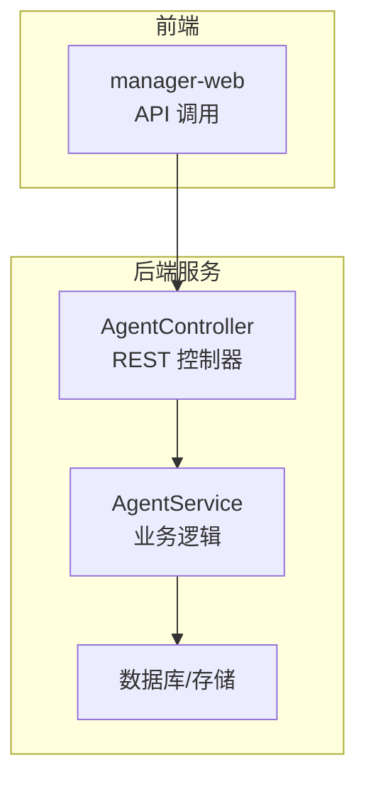
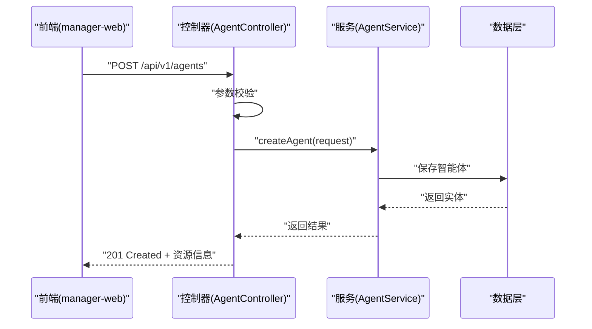
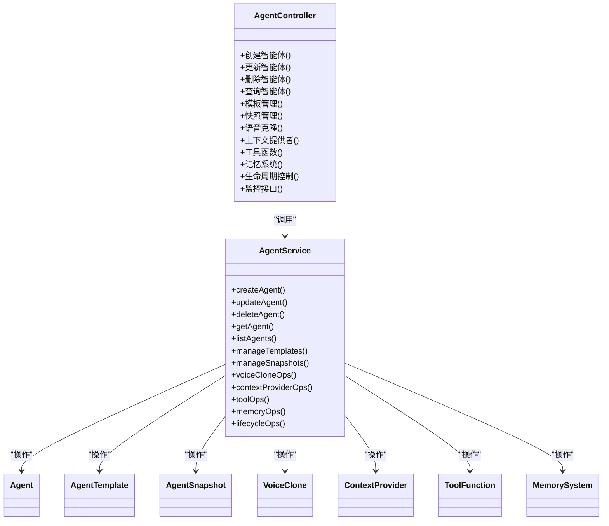

# 智能体管理 API

<cite>
**本文引用的文件**   
- [manager-api/src/main/java/xiaozhi/controller/AgentController.java](file://main/manager-api/src/main/java/xiaozhi/controller/AgentController.java)
- [manager-api/src/main/java/xiaozhi/service/AgentService.java](file://main/manager-api/src/main/java/xiaozhi/service/AgentService.java)
- [manager-api/src/main/java/xiaozhi/model/Agent.java](file://main/manager-api/src/main/java/xiaozhi/model/Agent.java)
- [manager-api/src/main/java/xiaozhi/model/AgentTemplate.java](file://main/manager-api/src/main/java/xiaozhi/model/AgentTemplate.java)
- [manager-api/src/main/java/xiaozhi/model/AgentSnapshot.java](file://main/manager-api/src/main/java/xiaozhi/model/AgentSnapshot.java)
- [manager-api/src/main/java/xiaozhi/model/VoiceClone.java](file://main/manager-api/src/main/java/xiaozhi/model/VoiceClone.java)
- [manager-api/src/main/java/xiaozhi/model/ContextProvider.java](file://main/manager-api/src/main/java/xiaozhi/model/ContextProvider.java)
- [manager-api/src/main/java/xiaozhi/model/ToolFunction.java](file://main/manager-api/src/main/java/xiaozhi/model/ToolFunction.java)
- [manager-api/src/main/java/xiaozhi/model/MemorySystem.java](file://main/manager-api/src/main/java/xiaozhi/model/MemorySystem.java)
- [manager-api/src/main/resources/application.yml](file://main/manager-api/src/main/resources/application.yml)
- [manager-web/src/apis/module/agent.js](file://main/manager-web/src/apis/module/agent.js)
- [manager-web/src/views/AgentTemplateManagement.vue](file://main/manager-web/src/views/AgentTemplateManagement.vue)
- [manager-web/src/components/AgentSnapshotDialog.vue](file://main/manager-web/src/components/AgentSnapshotDialog.vue)
- [manager-web/src/components/VoiceCloneDialog.vue](file://main/manager-web/src/components/VoiceCloneDialog.vue)
- [manager-web/src/components/ContextProviderDialog.vue](file://main/manager-web/src/components/ContextProviderDialog.vue)
</cite>

## 目录
1. [简介](#简介)
2. [项目结构](#项目结构)
3. [核心组件](#核心组件)
4. [架构总览](#架构总览)
5. [详细组件分析](#详细组件分析)
6. [依赖关系分析](#依赖关系分析)
7. [性能考虑](#性能考虑)
8. [故障排查指南](#故障排查指南)
9. [结论](#结论)
10. [附录](#附录)

## 简介
本文件为“智能体管理模块”的 RESTful API 文档，覆盖智能体的创建与配置、模板管理、快照管理、语音克隆等能力，并说明上下文提供者、工具函数、记忆系统等高级功能。文档包含接口路径、HTTP 方法、请求参数、响应格式、示例以及生命周期管理与数据持久化说明，同时提供部署与监控相关接口指引。

## 项目结构
智能体管理 API 位于后端服务 manager-api 中，前端调用通过 manager-web 的 API 模块发起。核心控制器负责路由与校验，服务层实现业务逻辑，模型定义数据结构与校验规则。

图表来源 
- [manager-api/src/main/java/xiaozhi/controller/AgentController.java](file://main/manager-api/src/main/java/xiaozhi/controller/AgentController.java)
- [manager-api/src/main/java/xiaozhi/service/AgentService.java](file://main/manager-api/src/main/java/xiaozhi/service/AgentService.java)

章节来源
- [manager-api/src/main/java/xiaozhi/controller/AgentController.java](file://main/manager-api/src/main/java/xiaozhi/controller/AgentController.java)
- [manager-api/src/main/java/xiaozhi/service/AgentService.java](file://main/manager-api/src/main/java/xiaozhi/service/AgentService.java)

## 核心组件
- AgentController：暴露 REST 接口，处理智能体、模板、快照、语音克隆、上下文提供者、工具函数、记忆系统等相关请求。
- AgentService：封装业务逻辑，协调数据访问、校验、转换与事务。
- 数据模型：Agent、AgentTemplate、AgentSnapshot、VoiceClone、ContextProvider、ToolFunction、MemorySystem 等实体定义。

章节来源
- [manager-api/src/main/java/xiaozhi/controller/AgentController.java](file://main/manager-api/src/main/java/xiaozhi/controller/AgentController.java)
- [manager-api/src/main/java/xiaozhi/service/AgentService.java](file://main/manager-api/src/main/java/xiaozhi/service/AgentService.java)
- [manager-api/src/main/java/xiaozhi/model/Agent.java](file://main/manager-api/src/main/java/xiaozhi/model/Agent.java)
- [manager-api/src/main/java/xiaozhi/model/AgentTemplate.java](file://main/manager-api/src/main/java/xiaozhi/model/AgentTemplate.java)
- [manager-api/src/main/java/xiaozhi/model/AgentSnapshot.java](file://main/manager-api/src/main/java/xiaozhi/model/AgentSnapshot.java)
- [manager-api/src/main/java/xiaozhi/model/VoiceClone.java](file://main/manager-api/src/main/java/xiaozhi/model/VoiceClone.java)
- [manager-api/src/main/java/xiaozhi/model/ContextProvider.java](file://main/manager-api/src/main/java/xiaozhi/model/ContextProvider.java)
- [manager-api/src/main/java/xiaozhi/model/ToolFunction.java](file://main/manager-api/src/main/java/xiaozhi/model/ToolFunction.java)
- [manager-api/src/main/java/xiaozhi/model/MemorySystem.java](file://main/manager-api/src/main/java/xiaozhi/model/MemorySystem.java)

## 架构总览
整体采用前后端分离架构：前端通过 HTTP 调用后端 REST 接口；控制器进行参数校验与路由分发；服务层执行业务逻辑并与数据层交互；数据持久化由数据库或对象存储完成。

图表来源 
- [manager-api/src/main/java/xiaozhi/controller/AgentController.java](file://main/manager-api/src/main/java/xiaozhi/controller/AgentController.java)
- [manager-api/src/main/java/xiaozhi/service/AgentService.java](file://main/manager-api/src/main/java/xiaozhi/service/AgentService.java)

## 详细组件分析

### 智能体管理（CRUD）
- 创建智能体
  - 路径与方法：POST /api/v1/agents
  - 请求体字段：名称、描述、基础配置（LLM/TTS/ASR）、上下文提供者、工具函数、记忆系统、初始模板等
  - 响应：201 Created，返回智能体 ID、名称、状态、时间戳
  - 错误码：400（参数校验失败）、409（名称冲突）
- 查询智能体列表
  - 路径与方法：GET /api/v1/agents
  - 查询参数：page、size、name、status、createdAt 范围
  - 响应：分页结果，含 items 数组与 total
- 获取智能体详情
  - 路径与方法：GET /api/v1/agents/{id}
  - 响应：完整配置与关联资源引用
- 更新智能体
  - 路径与方法：PUT /api/v1/agents/{id}
  - 请求体：可更新的字段集（增量更新）
  - 响应：200 OK，返回更新后的实体
- 删除智能体
  - 路径与方法：DELETE /api/v1/agents/{id}
  - 响应：204 No Content
- 启用/禁用智能体
  - 路径与方法：PATCH /api/v1/agents/{id}/status
  - 请求体：{ status: "active" | "inactive" }
  - 响应：200 OK，返回新状态

章节来源
- [manager-api/src/main/java/xiaozhi/controller/AgentController.java](file://main/manager-api/src/main/java/xiaozhi/controller/AgentController.java)
- [manager-api/src/main/java/xiaozhi/service/AgentService.java](file://main/manager-api/src/main/java/xiaozhi/service/AgentService.java)
- [manager-api/src/main/java/xiaozhi/model/Agent.java](file://main/manager-api/src/main/java/xiaozhi/model/Agent.java)

### 智能体模板管理
- 创建模板
  - 路径与方法：POST /api/v1/templates
  - 请求体：模板名称、默认配置、变量占位符、适用场景标签
  - 响应：201 Created，返回模板 ID
- 查询模板列表
  - 路径与方法：GET /api/v1/templates
  - 查询参数：tag、keyword、page、size
  - 响应：分页结果
- 获取模板详情
  - 路径与方法：GET /api/v1/templates/{id}
  - 响应：模板结构与默认值
- 更新模板
  - 路径与方法：PUT /api/v1/templates/{id}
  - 请求体：变更字段
  - 响应：200 OK
- 删除模板
  - 路径与方法：DELETE /api/v1/templates/{id}
  - 响应：204 No Content
- 使用模板创建智能体
  - 路径与方法：POST /api/v1/agents/from-template
  - 请求体：templateId、覆盖参数
  - 响应：201 Created，返回新建智能体

章节来源
- [manager-api/src/main/java/xiaozhi/controller/AgentController.java](file://main/manager-api/src/main/java/xiaozhi/controller/AgentController.java)
- [manager-api/src/main/java/xiaozhi/service/AgentService.java](file://main/manager-api/src/main/java/xiaozhi/service/AgentService.java)
- [manager-api/src/main/java/xiaozhi/model/AgentTemplate.java](file://main/manager-api/src/main/java/xiaozhi/model/AgentTemplate.java)

### 智能体快照管理
- 创建快照
  - 路径与方法：POST /api/v1/agents/{id}/snapshots
  - 请求体：快照名称、备注、是否包含配置与记忆
  - 响应：201 Created，返回快照 ID 与版本
- 查询快照列表
  - 路径与方法：GET /api/v1/agents/{id}/snapshots
  - 查询参数：page、size、createdAfter
  - 响应：分页结果
- 获取快照详情
  - 路径与方法：GET /api/v1/agents/{id}/snapshots/{snapshotId}
  - 响应：快照元数据与内容摘要
- 回滚到快照
  - 路径与方法：POST /api/v1/agents/{id}/snapshots/{snapshotId}/rollback
  - 请求体：确认标志
  - 响应：200 OK，返回恢复后的智能体状态
- 删除快照
  - 路径与方法：DELETE /api/v1/agents/{id}/snapshots/{snapshotId}
  - 响应：204 No Content

章节来源
- [manager-api/src/main/java/xiaozhi/controller/AgentController.java](file://main/manager-api/src/main/java/xiaozhi/controller/AgentController.java)
- [manager-api/src/main/java/xiaozhi/service/AgentService.java](file://main/manager-api/src/main/java/xiaozhi/service/AgentService.java)
- [manager-api/src/main/java/xiaozhi/model/AgentSnapshot.java](file://main/manager-api/src/main/java/xiaozhi/model/AgentSnapshot.java)

### 语音克隆
- 上传语音样本
  - 路径与方法：POST /api/v1/voice-clones/upload
  - 请求体：multipart/form-data，音频文件、说话人标识、语言
  - 响应：201 Created，返回样本 ID 与处理状态
- 训练语音模型
  - 路径与方法：POST /api/v1/voice-clones/{sampleId}/train
  - 请求体：训练参数（时长、质量、采样率）
  - 响应：202 Accepted，返回任务 ID
- 查询训练状态
  - 路径与方法：GET /api/v1/voice-clones/tasks/{taskId}
  - 响应：任务进度、状态、错误信息
- 绑定语音模型到智能体
  - 路径与方法：PATCH /api/v1/agents/{id}/voice-model
  - 请求体：voiceModelId
  - 响应：200 OK，返回更新后的 TTS 配置
- 删除语音样本或模型
  - 路径与方法：DELETE /api/v1/voice-clones/{id}
  - 响应：204 No Content

章节来源
- [manager-api/src/main/java/xiaozhi/controller/AgentController.java](file://main/manager-api/src/main/java/xiaozhi/controller/AgentController.java)
- [manager-api/src/main/java/xiaozhi/service/AgentService.java](file://main/manager-api/src/main/java/xiaozhi/service/AgentService.java)
- [manager-api/src/main/java/xiaozhi/model/VoiceClone.java](file://main/manager-api/src/main/java/xiaozhi/model/VoiceClone.java)

### 上下文提供者
- 新增上下文提供者
  - 路径与方法：POST /api/v1/agents/{id}/context-providers
  - 请求体：providerType、配置键值对、优先级
  - 响应：201 Created，返回提供者 ID
- 查询上下文提供者列表
  - 路径与方法：GET /api/v1/agents/{id}/context-providers
  - 查询参数：type、priority
  - 响应：分页结果
- 更新上下文提供者
  - 路径与方法：PUT /api/v1/agents/{id}/context-providers/{providerId}
  - 请求体：变更字段
  - 响应：200 OK
- 删除上下文提供者
  - 路径与方法：DELETE /api/v1/agents/{id}/context-providers/{providerId}
  - 响应：204 No Content

章节来源
- [manager-api/src/main/java/xiaozhi/controller/AgentController.java](file://main/manager-api/src/main/java/xiaozhi/controller/AgentController.java)
- [manager-api/src/main/java/xiaozhi/service/AgentService.java](file://main/manager-api/src/main/java/xiaozhi/service/AgentService.java)
- [manager-api/src/main/java/xiaozhi/model/ContextProvider.java](file://main/manager-api/src/main/java/xiaozhi/model/ContextProvider.java)

### 工具函数
- 注册工具函数
  - 路径与方法：POST /api/v1/agents/{id}/tools
  - 请求体：toolName、schema、执行入口、权限限制
  - 响应：201 Created，返回工具 ID
- 查询工具函数列表
  - 路径与方法：GET /api/v1/agents/{id}/tools
  - 查询参数：category、enabled
  - 响应：分页结果
- 更新工具函数
  - 路径与方法：PUT /api/v1/agents/{id}/tools/{toolId}
  - 请求体：变更字段
  - 响应：200 OK
- 删除工具函数
  - 路径与方法：DELETE /api/v1/agents/{id}/tools/{toolId}
  - 响应：204 No Content

章节来源
- [manager-api/src/main/java/xiaozhi/controller/AgentController.java](file://main/manager-api/src/main/java/xiaozhi/controller/AgentController.java)
- [manager-api/src/main/java/xiaozhi/service/AgentService.java](file://main/manager-api/src/main/java/xiaozhi/service/AgentService.java)
- [manager-api/src/main/java/xiaozhi/model/ToolFunction.java](file://main/manager-api/src/main/java/xiaozhi/model/ToolFunction.java)

### 记忆系统
- 初始化记忆系统
  - 路径与方法：POST /api/v1/agents/{id}/memory/init
  - 请求体：策略类型、容量上限、保留策略
  - 响应：201 Created，返回记忆系统 ID
- 写入记忆条目
  - 路径与方法：POST /api/v1/agents/{id}/memory/entries
  - 请求体：content、tags、importance、ttl
  - 响应：201 Created，返回条目 ID
- 查询记忆条目
  - 路径与方法：GET /api/v1/agents/{id}/memory/entries
  - 查询参数：tag、dateRange、limit
  - 响应：分页结果
- 更新/删除记忆条目
  - 路径与方法：PUT /api/v1/agents/{id}/memory/entries/{entryId}
  - 路径与方法：DELETE /api/v1/agents/{id}/memory/entries/{entryId}
  - 响应：200/204
- 清理过期记忆
  - 路径与方法：POST /api/v1/agents/{id}/memory/cleanup
  - 请求体：策略开关
  - 响应：200 OK，返回清理统计

章节来源
- [manager-api/src/main/java/xiaozhi/controller/AgentController.java](file://main/manager-api/src/main/java/xiaozhi/controller/AgentController.java)
- [manager-api/src/main/java/xiaozhi/service/AgentService.java](file://main/manager-api/src/main/java/xiaozhi/service/AgentService.java)
- [manager-api/src/main/java/xiaozhi/model/MemorySystem.java](file://main/manager-api/src/main/java/xiaozhi/model/MemorySystem.java)

### 智能体生命周期与部署
- 启动智能体
  - 路径与方法：POST /api/v1/agents/{id}/start
  - 响应：200 OK，返回运行状态
- 停止智能体
  - 路径与方法：POST /api/v1/agents/{id}/stop
  - 响应：200 OK，返回停止状态
- 重启智能体
  - 路径与方法：POST /api/v1/agents/{id}/restart
  - 响应：200 OK，返回重启状态
- 查看运行状态
  - 路径与方法：GET /api/v1/agents/{id}/status
  - 响应：状态、负载、最近日志摘要

章节来源
- [manager-api/src/main/java/xiaozhi/controller/AgentController.java](file://main/manager-api/src/main/java/xiaozhi/controller/AgentController.java)
- [manager-api/src/main/java/xiaozhi/service/AgentService.java](file://main/manager-api/src/main/java/xiaozhi/service/AgentService.java)

### 监控与健康检查
- 健康检查
  - 路径与方法：GET /health
  - 响应：200 OK，服务状态
- 指标采集
  - 路径与方法：GET /metrics
  - 响应：文本指标（QPS、延迟、错误率）
- 日志查询
  - 路径与方法：GET /api/v1/agents/{id}/logs
  - 查询参数：level、startTime、endTime、limit
  - 响应：日志条目列表

章节来源
- [manager-api/src/main/java/xiaozhi/controller/AgentController.java](file://main/manager-api/src/main/java/xiaozhi/controller/AgentController.java)

## 依赖关系分析
控制器与服务层解耦，服务层依赖数据模型与外部服务（如 TTS/ASR/LLM）。前端通过统一 API 模块调用，避免硬编码路径。

图表来源 
- [manager-api/src/main/java/xiaozhi/controller/AgentController.java](file://main/manager-api/src/main/java/xiaozhi/controller/AgentController.java)
- [manager-api/src/main/java/xiaozhi/service/AgentService.java](file://main/manager-api/src/main/java/xiaozhi/service/AgentService.java)
- [manager-api/src/main/java/xiaozhi/model/Agent.java](file://main/manager-api/src/main/java/xiaozhi/model/Agent.java)
- [manager-api/src/main/java/xiaozhi/model/AgentTemplate.java](file://main/manager-api/src/main/java/xiaozhi/model/AgentTemplate.java)
- [manager-api/src/main/java/xiaozhi/model/AgentSnapshot.java](file://main/manager-api/src/main/java/xiaozhi/model/AgentSnapshot.java)
- [manager-api/src/main/java/xiaozhi/model/VoiceClone.java](file://main/manager-api/src/main/java/xiaozhi/model/VoiceClone.java)
- [manager-api/src/main/java/xiaozhi/model/ContextProvider.java](file://main/manager-api/src/main/java/xiaozhi/model/ContextProvider.java)
- [manager-api/src/main/java/xiaozhi/model/ToolFunction.java](file://main/manager-api/src/main/java/xiaozhi/model/ToolFunction.java)
- [manager-api/src/main/java/xiaozhi/model/MemorySystem.java](file://main/manager-api/src/main/java/xiaozhi/model/MemorySystem.java)

章节来源
- [manager-api/src/main/java/xiaozhi/controller/AgentController.java](file://main/manager-api/src/main/java/xiaozhi/controller/AgentController.java)
- [manager-api/src/main/java/xiaozhi/service/AgentService.java](file://main/manager-api/src/main/java/xiaozhi/service/AgentService.java)

## 性能考虑
- 分页与过滤：列表接口支持 page/size 与常用过滤条件，减少数据传输量。
- 异步任务：语音克隆训练等耗时操作采用异步任务，返回任务 ID 供轮询。
- 缓存策略：模板与上下文提供者配置可缓存，降低重复解析开销。
- 连接池与限流：对外部 LLM/TTS/ASR 调用应设置超时与重试策略，避免雪崩。
- 日志与指标：通过 /metrics 与日志接口进行观测，定位瓶颈。

## 故障排查指南
- 参数校验失败：检查请求体字段类型与必填项，参考错误码 400。
- 资源不存在：确认路径中的 id/snapshotId/providerId 是否正确，返回 404。
- 名称冲突：创建时名称唯一性校验失败，返回 409。
- 任务失败：语音克隆任务状态异常，查看任务详情与错误信息。
- 服务不可用：健康检查 /health 返回异常，检查依赖服务与配置。

章节来源
- [manager-api/src/main/java/xiaozhi/controller/AgentController.java](file://main/manager-api/src/main/java/xiaozhi/controller/AgentController.java)
- [manager-api/src/main/java/xiaozhi/service/AgentService.java](file://main/manager-api/src/main/java/xiaozhi/service/AgentService.java)

## 结论
本 API 文档覆盖了智能体全生命周期的管理能力，包括创建与配置、模板与快照、语音克隆、上下文提供者、工具函数与记忆系统等高级特性。通过清晰的接口设计与完善的监控手段，便于快速集成与稳定运行。建议在生产环境启用健康检查与指标采集，结合日志与告警保障服务质量。

## 附录
- 前端调用示例与页面组件参考：
  - 智能体模板管理页面：[manager-web/src/views/AgentTemplateManagement.vue](file://main/manager-web/src/views/AgentTemplateManagement.vue)
  - 快照对话框：[manager-web/src/components/AgentSnapshotDialog.vue](file://main/manager-web/src/components/AgentSnapshotDialog.vue)
  - 语音克隆对话框：[manager-web/src/components/VoiceCloneDialog.vue](file://main/manager-web/src/components/VoiceCloneDialog.vue)
  - 上下文提供者对话框：[manager-web/src/components/ContextProviderDialog.vue](file://main/manager-web/src/components/ContextProviderDialog.vue)
  - 前端 API 模块：[manager-web/src/apis/module/agent.js](file://main/manager-web/src/apis/module/agent.js)
- 后端配置：
  - 应用配置：[manager-api/src/main/resources/application.yml](file://main/manager-api/src/main/resources/application.yml)

章节来源
- [manager-web/src/apis/module/agent.js](file://main/manager-web/src/apis/module/agent.js)
- [manager-web/src/views/AgentTemplateManagement.vue](file://main/manager-web/src/views/AgentTemplateManagement.vue)
- [manager-web/src/components/AgentSnapshotDialog.vue](file://main/manager-web/src/components/AgentSnapshotDialog.vue)
- [manager-web/src/components/VoiceCloneDialog.vue](file://main/manager-web/src/components/VoiceCloneDialog.vue)
- [manager-web/src/components/ContextProviderDialog.vue](file://main/manager-web/src/components/ContextProviderDialog.vue)
- [manager-api/src/main/resources/application.yml](file://main/manager-api/src/main/resources/application.yml)