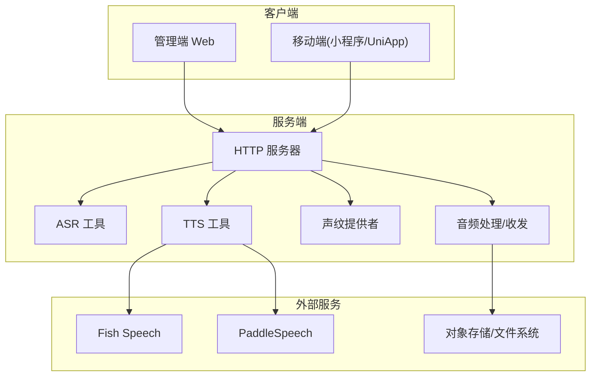
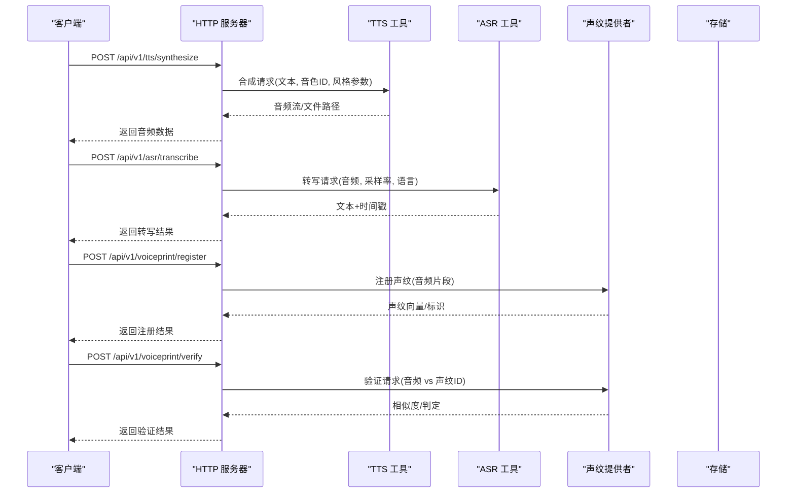
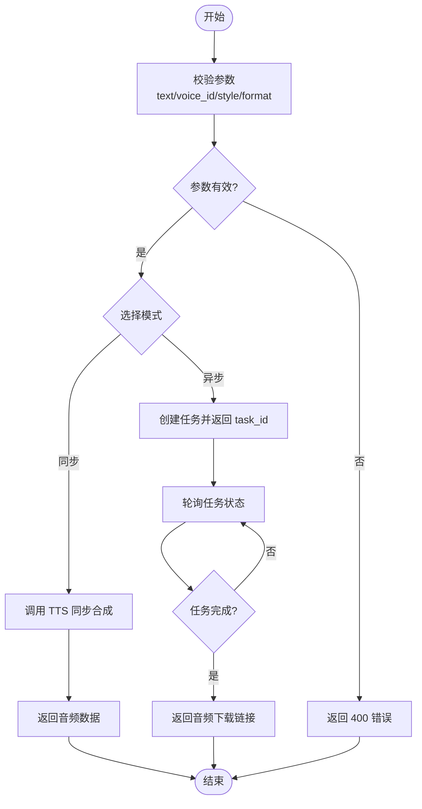
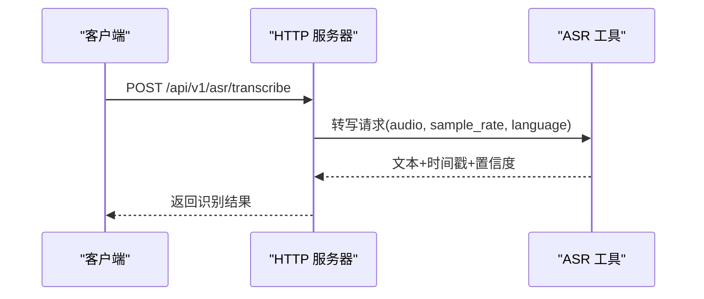
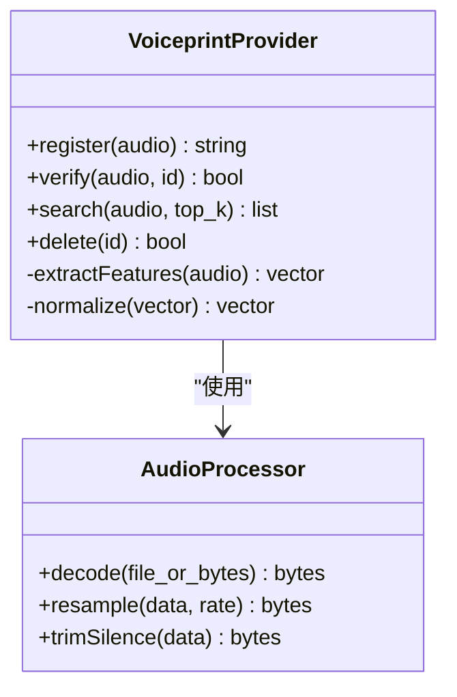
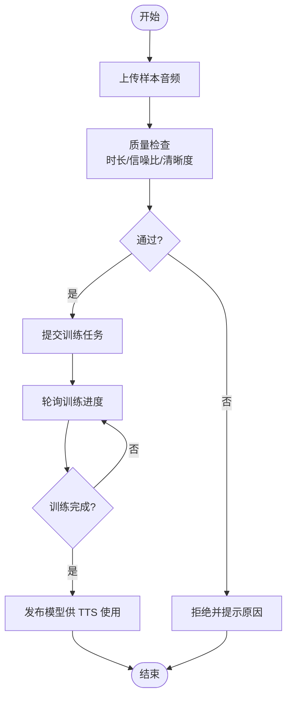
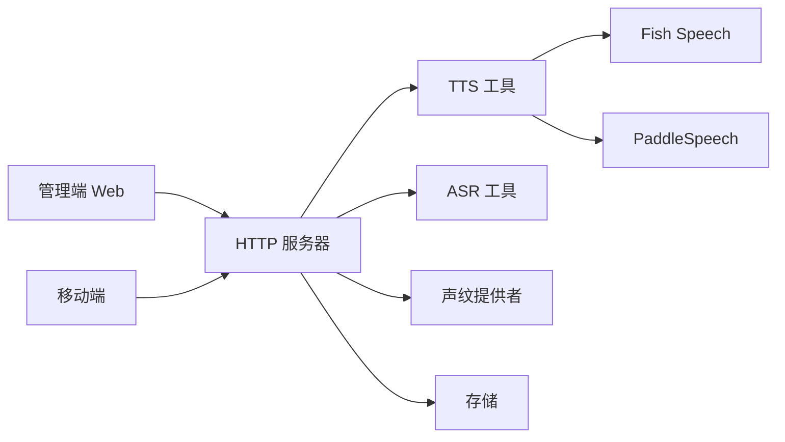

# 智能体语音 API

<cite>
**本文档引用的文件**
- [README.md](file://README.md)
- [app.py](file://main/xiaozhi-server/app.py)
- [http_server.py](file://main/xiaozhi-server/core/http_server.py)
- [voiceprint_provider.py](file://main/xiaozhi-server/core/utils/voiceprint_provider.py)
- [tts.py](file://main/xiaozhi-server/core/utils/tts.py)
- [asr.py](file://main/xiaozhi-server/core/utils/asr.py)
- [receiveAudioHandle.py](file://main/xiaozhi-server/core/handle/receiveAudioHandle.py)
- [sendAudioHandle.py](file://main/xiaozhi-server/core/handle/sendAudioHandle.py)
- [performance_tester_tts.py](file://main/xiaozhi-server/performance_tester/performance_tester_tts.py)
- [performance_tester_asr.py](file://main/xiaozhi-server/performance_tester/performance_tester_asr.py)
- [fish-speech-integration.md](file://docs/fish-speech-integration.md)
- [paddlespeech-deploy.md](file://docs/paddlespeech-deploy.md)
- [VoiceCloneManagement.vue](file://main/manager-web/src/views/VoiceCloneManagement.vue)
- [VoicePrint.vue](file://main/manager-web/src/views/VoicePrint.vue)
- [VoiceResourceManagement.vue](file://main/manager-web/src/views/VoiceResourceManagement.vue)
- [api.js](file://main/manager-web/src/apis/api.js)
- [request.js](file://main/manager-mobile/src/utils/request.js)
- [audio.js](file://main/miniprogram/utils/audio.js)
- [websocket.js](file://main/miniprogram/utils/websocket.js)
</cite>

## 目录
1. [简介](#简介)
2. [项目结构](#项目结构)
3. [核心组件](#核心组件)
4. [架构总览](#架构总览)
5. [详细组件分析](#详细组件分析)
6. [依赖分析](#依赖分析)
7. [性能考虑](#性能考虑)
8. [故障排查指南](#故障排查指南)
9. [结论](#结论)
10. [附录](#附录)

## 简介
本文件为“智能体语音”相关功能的 RESTful API 文档，覆盖语音克隆、声纹识别、音色管理等能力。内容包含：
- 接口定义与调用流程（上传、处理、存储格式要求）
- 语音模型训练与部署接口说明
- 自定义音色与说话风格支持
- 语音质量评估与调试工具
- 完整的音频文件处理示例与最佳实践

本仓库包含服务端（Python）、管理端 Web（Vue）、移动端（小程序/UniApp）以及多种 TTS/ASR 集成方案。API 设计以 HTTP 为主，结合 WebSocket 用于实时流式交互。

## 项目结构
与语音相关的代码主要分布在以下模块：
- 服务端：HTTP 服务入口、TTS/ASR 工具、音频处理与发送/接收处理器、声纹提供者
- 管理端 Web：语音克隆、声纹、资源管理的页面与 API 封装
- 移动端：音频采集、上传、WebSocket 通信与播放
- 文档与部署：第三方 TTS/ASR 集成与部署指南

图表来源
- [http_server.py:1-200](file://main/xiaozhi-server/core/http_server.py#L1-L200)
- [tts.py:1-200](file://main/xiaozhi-server/core/utils/tts.py#L1-L200)
- [asr.py:1-200](file://main/xiaozhi-server/core/utils/asr.py#L1-L200)
- [voiceprint_provider.py:1-200](file://main/xiaozhi-server/core/utils/voiceprint_provider.py#L1-L200)
- [receiveAudioHandle.py:1-200](file://main/xiaozhi-server/core/handle/receiveAudioHandle.py#L1-L200)
- [sendAudioHandle.py:1-200](file://main/xiaozhi-server/core/handle/sendAudioHandle.py#L1-L200)

章节来源
- [README.md:1-200](file://README.md#L1-L200)
- [app.py:1-200](file://main/xiaozhi-server/app.py#L1-L200)

## 核心组件
- HTTP 服务器：提供 RESTful 接口，路由到具体处理器；同时承载 WebSocket 入口用于流式语音交互
- TTS 工具：封装不同 TTS 后端（如 Fish Speech、PaddleSpeech），统一输入文本与参数，输出音频流或文件
- ASR 工具：封装不同 ASR 后端，统一输入音频，输出文本与时间戳等元数据
- 声纹提供者：负责声纹特征提取、注册、比对与匹配
- 音频处理与收发：负责音频编码/解码、分片、缓存、延迟控制与网络传输

章节来源
- [http_server.py:1-200](file://main/xiaozhi-server/core/http_server.py#L1-L200)
- [tts.py:1-200](file://main/xiaozhi-server/core/utils/tts.py#L1-L200)
- [asr.py:1-200](file://main/xiaozhi-server/core/utils/asr.py#L1-L200)
- [voiceprint_provider.py:1-200](file://main/xiaozhi-server/core/utils/voiceprint_provider.py#L1-L200)
- [receiveAudioHandle.py:1-200](file://main/xiaozhi-server/core/handle/receiveAudioHandle.py#L1-L200)
- [sendAudioHandle.py:1-200](file://main/xiaozhi-server/core/handle/sendAudioHandle.py#L1-L200)

## 架构总览
整体采用“前端-HTTP-服务-外部引擎”的分层架构。REST 接口负责资源管理与批量任务，WebSocket 负责低延迟的实时语音流。TTS/ASR 通过插件化方式接入，便于扩展与替换。

图表来源
- [http_server.py:1-200](file://main/xiaozhi-server/core/http_server.py#L1-L200)
- [tts.py:1-200](file://main/xiaozhi-server/core/utils/tts.py#L1-L200)
- [asr.py:1-200](file://main/xiaozhi-server/core/utils/asr.py#L1-L200)
- [voiceprint_provider.py:1-200](file://main/xiaozhi-server/core/utils/voiceprint_provider.py#L1-L200)

## 详细组件分析

### 语音合成（TTS）接口
- 功能：将文本转换为语音，支持多后端（Fish Speech、PaddleSpeech），可指定音色 ID、语速、语调、情感等风格参数
- 典型接口
  - 同步合成：POST /api/v1/tts/synthesize
  - 异步任务：POST /api/v1/tts/tasks（提交后轮询状态）
  - 查询任务：GET /api/v1/tts/tasks/{task_id}
  - 下载音频：GET /api/v1/tts/audio/{file_id}
- 输入参数
  - text: 待合成文本
  - voice_id: 音色标识（系统内置或自定义）
  - style: 说话风格（如温柔、欢快、严肃等）
  - speed/pitch/emotion: 可选参数，控制语速、音高、情感强度
  - format: 输出格式（wav/mp3/opus），默认 wav
- 输出
  - 同步：直接返回音频二进制或 base64
  - 异步：返回 task_id，后续轮询获取结果
- 错误码
  - 400 参数错误（文本为空、格式不支持）
  - 404 音色不存在
  - 500 后端服务异常

图表来源
- [tts.py:1-200](file://main/xiaozhi-server/core/utils/tts.py#L1-L200)
- [http_server.py:1-200](file://main/xiaozhi-server/core/http_server.py#L1-L200)

章节来源
- [tts.py:1-200](file://main/xiaozhi-server/core/utils/tts.py#L1-L200)
- [http_server.py:1-200](file://main/xiaozhi-server/core/http_server.py#L1-L200)

### 语音识别（ASR）接口
- 功能：将音频转为文本，支持多种 ASR 后端，返回文本与时间戳
- 典型接口
  - 同步转写：POST /api/v1/asr/transcribe
  - 流式转写：WS /ws/asr/stream（长连接，持续推送识别结果）
- 输入参数
  - audio: 音频二进制或文件路径
  - sample_rate: 采样率（如 16k/48k）
  - language: 语言（zh/en/mix）
  - format: 输入格式（wav/mp3/opus）
- 输出
  - 文本、时间戳、置信度
- 错误码
  - 400 音频格式不支持或损坏
  - 500 ASR 后端异常

图表来源
- [asr.py:1-200](file://main/xiaozhi-server/core/utils/asr.py#L1-L200)
- [http_server.py:1-200](file://main/xiaozhi-server/core/http_server.py#L1-L200)

章节来源
- [asr.py:1-200](file://main/xiaozhi-server/core/utils/asr.py#L1-L200)
- [http_server.py:1-200](file://main/xiaozhi-server/core/http_server.py#L1-L200)

### 声纹识别接口
- 功能：声纹注册、验证、检索与删除
- 典型接口
  - 注册：POST /api/v1/voiceprint/register
  - 验证：POST /api/v1/voiceprint/verify
  - 检索：POST /api/v1/voiceprint/search
  - 删除：DELETE /api/v1/voiceprint/{id}
- 输入参数
  - audio: 音频片段（建议 3-10 秒，清晰人声）
  - id: 声纹唯一标识（注册时生成）
  - threshold: 阈值（0~1，默认 0.7）
- 输出
  - 注册：返回声纹 ID
  - 验证：返回相似度与判定结果
  - 检索：返回候选列表及相似度
- 错误码
  - 400 音频无效或过短
  - 404 声纹 ID 不存在
  - 500 声纹服务异常

图表来源
- [voiceprint_provider.py:1-200](file://main/xiaozhi-server/core/utils/voiceprint_provider.py#L1-L200)

章节来源
- [voiceprint_provider.py:1-200](file://main/xiaozhi-server/core/utils/voiceprint_provider.py#L1-L200)

### 音色管理接口
- 功能：音色资源的增删改查、预览与批量导入
- 典型接口
  - 列表：GET /api/v1/voices
  - 详情：GET /api/v1/voices/{id}
  - 新增：POST /api/v1/voices
  - 更新：PUT /api/v1/voices/{id}
  - 删除：DELETE /api/v1/voices/{id}
  - 预览：GET /api/v1/voices/{id}/preview
  - 批量导入：POST /api/v1/voices/import
- 输入参数
  - name/description: 名称与描述
  - audio_samples: 参考音频（多个片段，用于训练或克隆）
  - style_tags: 风格标签（如温柔、活泼）
- 输出
  - 列表：分页结果
  - 详情：元数据与预览链接
  - 导入：任务 ID，后续轮询进度

章节来源
- [VoiceResourceManagement.vue:1-200](file://main/manager-web/src/views/VoiceResourceManagement.vue#L1-L200)
- [api.js:1-200](file://main/manager-web/src/apis/api.js#L1-L200)

### 语音克隆接口
- 功能：基于少量样本快速克隆音色，支持在线训练与离线训练两种模式
- 典型接口
  - 提交训练：POST /api/v1/voiceclone/train
  - 查询进度：GET /api/v1/voiceclone/tasks/{task_id}
  - 发布模型：POST /api/v1/voiceclone/models/{model_id}/publish
  - 停用模型：POST /api/v1/voiceclone/models/{model_id}/deprecate
- 输入参数
  - samples: 参考音频（建议 5-10 条，每条 3-10 秒）
  - config: 训练配置（学习率、迭代次数、设备）
  - model_name: 模型名称与版本
- 输出
  - 任务 ID，进度百分比，最终模型 ID
- 错误码
  - 400 样本不足或质量不达标
  - 500 训练服务异常

图表来源
- [VoiceCloneManagement.vue:1-200](file://main/manager-web/src/views/VoiceCloneManagement.vue#L1-L200)
- [api.js:1-200](file://main/manager-web/src/apis/api.js#L1-L200)

章节来源
- [VoiceCloneManagement.vue:1-200](file://main/manager-web/src/views/VoiceCloneManagement.vue#L1-L200)
- [api.js:1-200](file://main/manager-web/src/apis/api.js#L1-L200)

### 实时语音交互（WebSocket）
- 功能：双向流式语音交互，适用于对话场景
- 典型端点
  - WS /ws/chat：建立连接，发送/接收音频帧
  - WS /ws/asr/stream：仅 ASR 流式识别
- 协议要点
  - 客户端发送音频帧（Opus/WAV 分片）
  - 服务端返回 TTS 音频帧或 ASR 文本增量
  - 心跳包维持连接，超时断开

章节来源
- [websocket.js:1-200](file://main/miniprogram/utils/websocket.js#L1-L200)
- [receiveAudioHandle.py:1-200](file://main/xiaozhi-server/core/handle/receiveAudioHandle.py#L1-L200)
- [sendAudioHandle.py:1-200](file://main/xiaozhi-server/core/handle/sendAudioHandle.py#L1-L200)

## 依赖分析
- 外部 TTS/ASR 服务：Fish Speech、PaddleSpeech 等通过配置切换
- 存储：对象存储或本地文件系统，用于保存音频与模型文件
- 前端：管理端 Web 与移动端通过 HTTP/WebSocket 与服务端交互

图表来源
- [fish-speech-integration.md:1-200](file://docs/fish-speech-integration.md#L1-L200)
- [paddlespeech-deploy.md:1-200](file://docs/paddlespeech-deploy.md#L1-L200)
- [http_server.py:1-200](file://main/xiaozhi-server/core/http_server.py#L1-L200)

章节来源
- [fish-speech-integration.md:1-200](file://docs/fish-speech-integration.md#L1-L200)
- [paddlespeech-deploy.md:1-200](file://docs/paddlespeech-deploy.md#L1-L200)

## 性能考虑
- 音频格式与压缩
  - 推荐使用 Opus 进行流式传输，降低带宽占用
  - 静态音频建议使用 MP3/AAC，平衡音质与体积
- 采样率与比特率
  - ASR 推荐 16kHz，TTS 输出 24kHz/48kHz 根据需求选择
  - 比特率建议 64-128kbps（MP3），Opus 动态码率
- 并发与队列
  - 大文件处理与训练任务应走异步队列，避免阻塞主线程
- 缓存策略
  - 常用音色与模板结果可缓存，减少重复计算
- 监控与指标
  - 记录合成/转写耗时、失败率、内存/CPU 使用率

[本节为通用指导，无需特定文件引用]

## 故障排查指南
- 常见问题
  - 音频格式不支持：确认上传文件的容器与编码
  - 采样率不匹配：在 ASR/TTS 前进行重采样
  - 噪声过大：增加降噪预处理，提升信噪比
  - 训练失败：检查样本数量与质量，调整学习率与迭代次数
- 调试工具
  - 性能测试器：TTS/ASR 基准测试脚本
  - 日志与指标：查看服务端日志与监控面板
- 定位步骤
  - 复现问题，收集请求与响应
  - 检查中间件与后端服务健康状态
  - 逐步隔离问题（网络、编码、模型、存储）

章节来源
- [performance_tester_tts.py:1-200](file://main/xiaozhi-server/performance_tester/performance_tester_tts.py#L1-L200)
- [performance_tester_asr.py:1-200](file://main/xiaozhi-server/performance_tester/performance_tester_asr.py#L1-L200)

## 结论
本 API 体系围绕“上传-处理-存储-回放”的完整链路，提供统一的 TTS/ASR/声纹/音色管理能力。通过模块化设计与外部服务解耦，便于扩展与替换。建议在生产环境启用异步任务、缓存与监控，确保稳定性与性能。

[本节为总结性内容，无需特定文件引用]

## 附录

### 音频文件格式与处理规范
- 输入格式
  - 推荐：WAV（PCM 16bit，单声道，16kHz/48kHz）
  - 兼容：MP3/Opus（需正确解码）
- 输出格式
  - 流式：Opus 分片
  - 静态：WAV/MP3/AAC
- 处理建议
  - 静音裁剪、增益归一化、降噪
  - 分片大小建议 20-40ms（约 320-640 字节@16kHz）

章节来源
- [audio.js:1-200](file://main/miniprogram/utils/audio.js#L1-L200)

### 最佳实践
- 样本采集
  - 安静环境，近距离录音，避免回声与背景噪声
  - 多样化语句，覆盖不同音调与语速
- 模型训练
  - 分批训练，小步长迭代，早停策略防止过拟合
  - 定期评估集验证，保留最优权重
- 部署上线
  - 灰度发布，A/B 对比效果
  - 设置回滚机制与熔断保护

[本节为通用指导，无需特定文件引用]