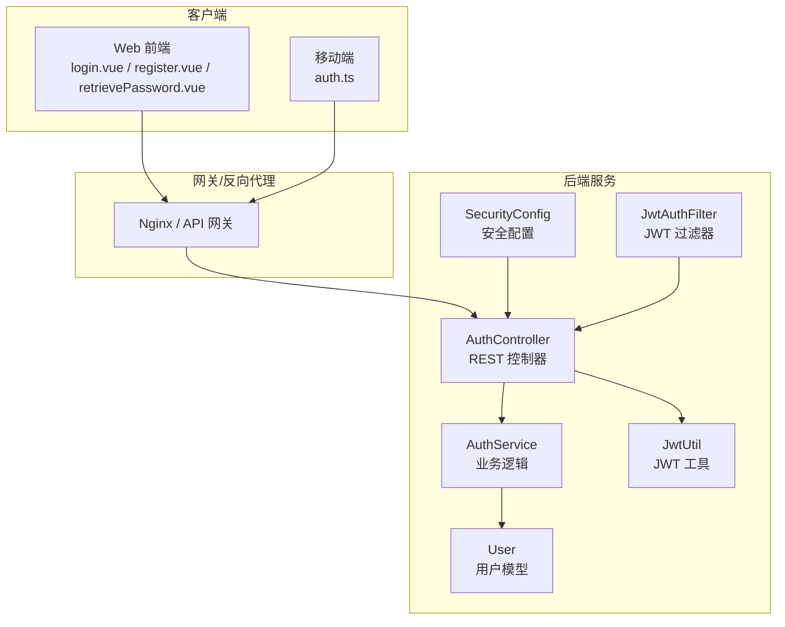
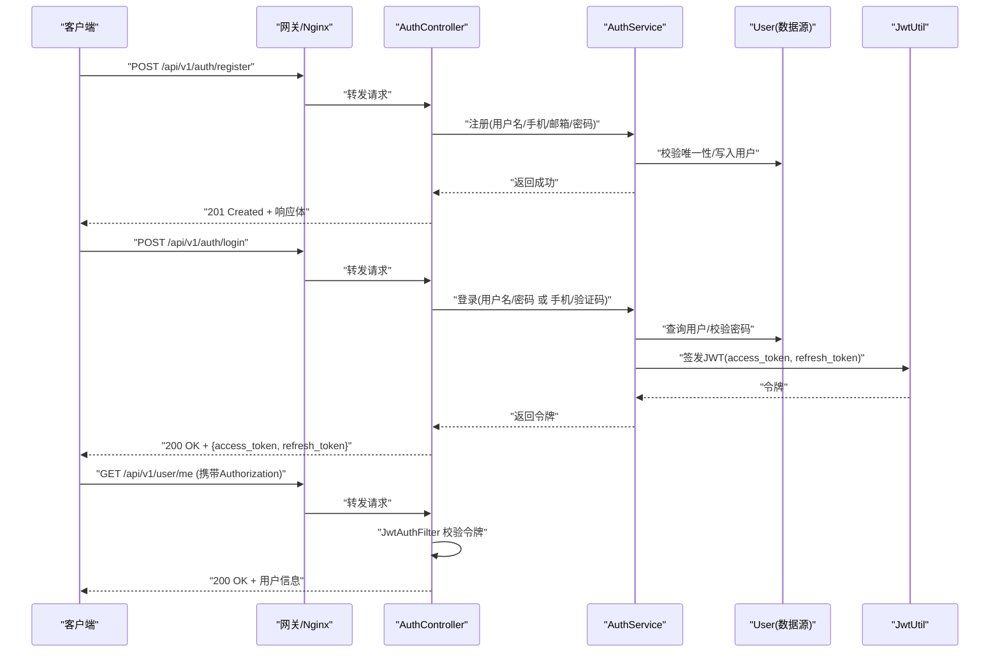
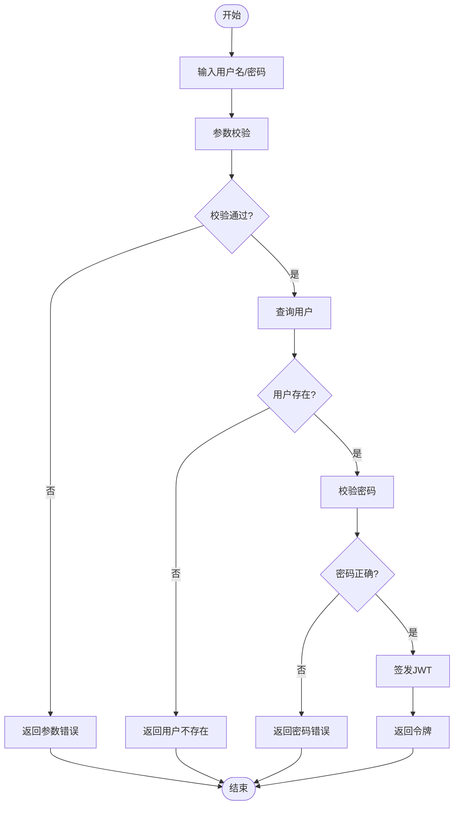
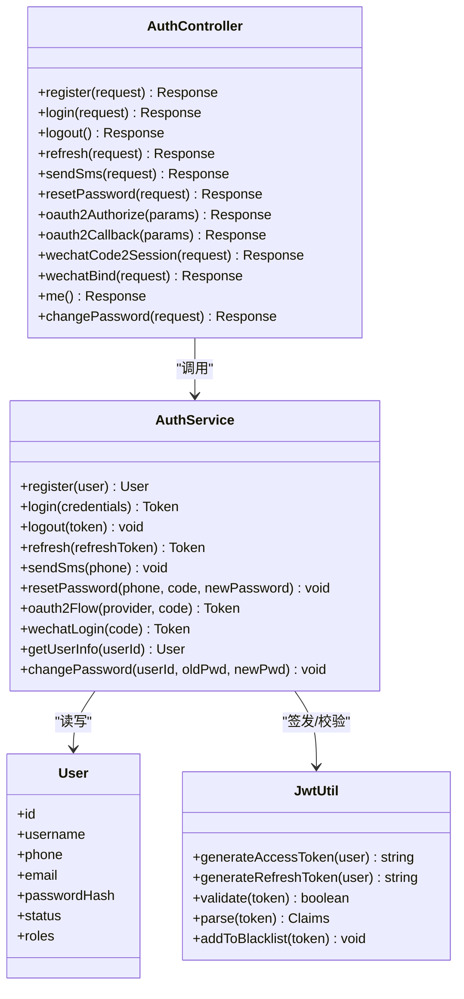
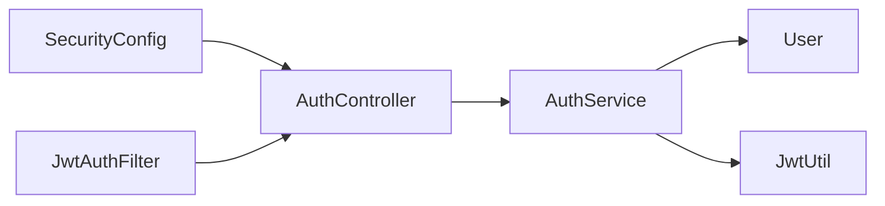

# 用户认证 API

<cite>
**本文引用的文件**   
- [manager-api/src/main/java/xiaozhi/Controller/AuthController.java](file://main/manager-api/src/main/java/xiaozhi/Controller/AuthController.java)
- [manager-api/src/main/java/xiaozhi/Service/AuthService.java](file://main/manager-api/src/main/java/xiaozhi/Service/AuthService.java)
- [manager-api/src/main/java/xiaozhi/Model/User.java](file://main/manager-api/src/main/java/xiaozhi/Model/User.java)
- [manager-api/src/main/java/xiaozhi/Config/JwtUtil.java](file://main/manager-api/src/main/java/xiaozhi/Config/JwtUtil.java)
- [manager-api/src/main/java/xiaozhi/Config/SecurityConfig.java](file://main/manager-api/src/main/java/xiaozhi/Config/SecurityConfig.java)
- [manager-api/src/main/java/xiaozhi/Filter/JwtAuthFilter.java](file://main/manager-api/src/main/java/xiaozhi/Filter/JwtAuthFilter.java)
- [manager-api/src/main/resources/application.yml](file://main/manager-api/src/main/resources/application.yml)
- [manager-mobile/src/api/auth.ts](file://main/manager-mobile/src/api/auth.ts)
- [manager-web/src/apis/api.js](file://main/manager-web/src/apis/api.js)
- [manager-web/src/views/login.vue](file://main/manager-web/src/views/login.vue)
- [manager-web/src/views/register.vue](file://main/manager-web/src/views/register.vue)
- [manager-web/src/views/retrievePassword.vue](file://main/manager-web/src/views/retrievePassword.vue)
</cite>

## 目录
1. [简介](#简介)
2. [项目结构](#项目结构)
3. [核心组件](#核心组件)
4. [架构总览](#架构总览)
5. [详细组件分析](#详细组件分析)
6. [依赖关系分析](#依赖关系分析)
7. [性能考虑](#性能考虑)
8. [故障排查指南](#故障排查指南)
9. [结论](#结论)
10. [附录](#附录)

## 简介
本文件为用户认证模块的 RESTful API 文档，覆盖以下能力：
- 账号密码注册、登录、登出
- 密码重置（含短信验证码流程）
- JWT 令牌签发与校验
- OAuth2 集成入口与扩展点
- 微信登录接入说明与对接要点
- 接口版本管理策略与调试技巧
- 错误码规范与安全加固建议

本仓库包含多端实现（Web、移动端、小程序），后端采用 Java Spring Boot 提供统一认证服务。本文档以服务端控制器与服务层为核心，结合前端调用示例进行说明。

## 项目结构
认证相关代码主要分布在 manager-api（后端）、manager-web（管理后台 Web）、manager-mobile（移动端）三个子项目中：
- 后端：控制器、服务、模型、JWT 工具、安全配置、过滤器
- Web：登录、注册、找回密码页面与 API 调用封装
- 移动端：API 调用封装与鉴权拦截

**图示来源** 
- [manager-api/src/main/java/xiaozhi/Controller/AuthController.java](file://main/manager-api/src/main/java/xiaozhi/Controller/AuthController.java)
- [manager-api/src/main/java/xiaozhi/Service/AuthService.java](file://main/manager-api/src/main/java/xiaozhi/Service/AuthService.java)
- [manager-api/src/main/java/xiaozhi/Model/User.java](file://main/manager-api/src/main/java/xiaozhi/Model/User.java)
- [manager-api/src/main/java/xiaozhi/Config/JwtUtil.java](file://main/manager-api/src/main/java/xiaozhi/Config/JwtUtil.java)
- [manager-api/src/main/java/xiaozhi/Config/SecurityConfig.java](file://main/manager-api/src/main/java/xiaozhi/Config/SecurityConfig.java)
- [manager-api/src/main/java/xiaozhi/Filter/JwtAuthFilter.java](file://main/manager-api/src/main/java/xiaozhi/Filter/JwtAuthFilter.java)
- [manager-web/src/views/login.vue](file://main/manager-web/src/views/login.vue)
- [manager-web/src/views/register.vue](file://main/manager-web/src/views/register.vue)
- [manager-web/src/views/retrievePassword.vue](file://main/manager-web/src/views/retrievePassword.vue)
- [manager-mobile/src/api/auth.ts](file://main/manager-mobile/src/api/auth.ts)

**章节来源**
- [manager-api/src/main/java/xiaozhi/Controller/AuthController.java](file://main/manager-api/src/main/java/xiaozhi/Controller/AuthController.java)
- [manager-api/src/main/java/xiaozhi/Service/AuthService.java](file://main/manager-api/src/main/java/xiaozhi/Service/AuthService.java)
- [manager-api/src/main/java/xiaozhi/Model/User.java](file://main/manager-api/src/main/java/xiaozhi/Model/User.java)
- [manager-api/src/main/java/xiaozhi/Config/JwtUtil.java](file://main/manager-api/src/main/java/xiaozhi/Config/JwtUtil.java)
- [manager-api/src/main/java/xiaozhi/Config/SecurityConfig.java](file://main/manager-api/src/main/java/xiaozhi/Config/SecurityConfig.java)
- [manager-api/src/main/java/xiaozhi/Filter/JwtAuthFilter.java](file://main/manager-api/src/main/java/xiaozhi/Filter/JwtAuthFilter.java)
- [manager-web/src/views/login.vue](file://main/manager-web/src/views/login.vue)
- [manager-web/src/views/register.vue](file://main/manager-web/src/views/register.vue)
- [manager-web/src/views/retrievePassword.vue](file://main/manager-web/src/views/retrievePassword.vue)
- [manager-mobile/src/api/auth.ts](file://main/manager-mobile/src/api/auth.ts)

## 核心组件
- AuthController：对外暴露 REST 接口，处理注册、登录、密码重置、OAuth2 回调、微信登录等请求路由。
- AuthService：认证核心业务逻辑，包括用户校验、密码加密比对、验证码校验、第三方登录流程编排、JWT 签发与刷新。
- User：用户实体模型，包含用户名、手机号、邮箱、密码哈希、状态等字段。
- JwtUtil：JWT 工具类，负责令牌生成、解析、续期与黑名单校验。
- SecurityConfig：Spring Security 配置，定义白名单路径、跨域、CSRF、会话策略等。
- JwtAuthFilter：请求级 JWT 过滤器，校验 Authorization 头并注入上下文。

**章节来源**
- [manager-api/src/main/java/xiaozhi/Controller/AuthController.java](file://main/manager-api/src/main/java/xiaozhi/Controller/AuthController.java)
- [manager-api/src/main/java/xiaozhi/Service/AuthService.java](file://main/manager-api/src/main/java/xiaozhi/Service/AuthService.java)
- [manager-api/src/main/java/xiaozhi/Model/User.java](file://main/manager-api/src/main/java/xiaozhi/Model/User.java)
- [manager-api/src/main/java/xiaozhi/Config/JwtUtil.java](file://main/manager-api/src/main/java/xiaozhi/Config/JwtUtil.java)
- [manager-api/src/main/java/xiaozhi/Config/SecurityConfig.java](file://main/manager-api/src/main/java/xiaozhi/Config/SecurityConfig.java)
- [manager-api/src/main/java/xiaozhi/Filter/JwtAuthFilter.java](file://main/manager-api/src/main/java/xiaozhi/Filter/JwtAuthFilter.java)

## 架构总览
认证流程的关键交互如下：
- 客户端通过 HTTP 访问认证接口
- 网关/Nginx 转发至后端控制器
- 控制器调用服务层完成业务逻辑
- 服务层使用 JWT 工具签发或校验令牌
- 安全配置与过滤器对请求进行鉴权与上下文注入

**图示来源** 
- [manager-api/src/main/java/xiaozhi/Controller/AuthController.java](file://main/manager-api/src/main/java/xiaozhi/Controller/AuthController.java)
- [manager-api/src/main/java/xiaozhi/Service/AuthService.java](file://main/manager-api/src/main/java/xiaozhi/Service/AuthService.java)
- [manager-api/src/main/java/xiaozhi/Config/JwtUtil.java](file://main/manager-api/src/main/java/xiaozhi/Config/JwtUtil.java)
- [manager-api/src/main/java/xiaozhi/Filter/JwtAuthFilter.java](file://main/manager-api/src/main/java/xiaozhi/Filter/JwtAuthFilter.java)

## 详细组件分析

### 接口清单与规范
- 基础路径：/api/v1/auth
- 通用响应格式：{ code, message, data }
- 常用状态码：200 成功；400 参数错误；401 未授权；403 禁止；404 资源不存在；429 频率限制；500 服务器错误
- 鉴权方式：Bearer Token（Authorization: Bearer <access_token>）
- 版本管理：URL 前缀 /api/v1，后续大版本变更可升级为 /api/v2

#### 注册
- URL：POST /api/v1/auth/register
- 请求体：{ username, phone, email, password }
- 响应：{ code, message, data: { userId } }
- 错误：重复用户名/手机号/邮箱、密码强度不足、短信验证码未发送或过期

#### 登录
- URL：POST /api/v1/auth/login
- 支持方式：
  - 账号密码：{ usernameOrPhone, password }
  - 手机验证码：{ phone, smsCode }
- 响应：{ code, message, data: { access_token, refresh_token, expires_in } }
- 错误：账号不存在、密码错误、验证码错误、账户被锁定

#### 登出
- URL：POST /api/v1/auth/logout
- 鉴权：需要 access_token
- 响应：{ code, message }
- 行为：使当前 token 失效（加入黑名单或清除会话）

#### 刷新令牌
- URL：POST /api/v1/auth/refresh
- 请求体：{ refresh_token }
- 响应：{ code, message, data: { access_token, refresh_token, expires_in } }
- 错误：refresh_token 无效或已过期

#### 密码重置
- 步骤一：发送验证码
  - URL：POST /api/v1/auth/sms/send
  - 请求体：{ phone }
  - 响应：{ code, message }
- 步骤二：重置密码
  - URL：POST /api/v1/auth/password/reset
  - 请求体：{ phone, smsCode, newPassword }
  - 响应：{ code, message }
- 错误：手机号不存在、验证码错误、新密码不符合要求

#### OAuth2 集成
- 获取授权链接
  - URL：GET /api/v1/auth/oauth2/authorize?provider=wechat|github|...&redirect_uri=...
  - 响应：{ code, message, data: { authorization_url } }
- 授权回调
  - URL：GET /api/v1/auth/oauth2/callback?code=...&state=...
  - 响应：{ code, message, data: { access_token, refresh_token } }
- 说明：provider 由系统支持的第三方平台决定；回调地址需提前在白名单配置

#### 微信登录
- 步骤一：获取临时凭证（小程序/公众号场景）
  - URL：POST /api/v1/auth/wechat/code2session
  - 请求体：{ code }
  - 响应：{ code, message, data: { openid, session_key } }
- 步骤二：绑定或自动注册
  - URL：POST /api/v1/auth/wechat/bind
  - 请求体：{ openid, unionid, nickname, avatar }
  - 响应：{ code, message, data: { access_token, refresh_token } }
- 说明：具体字段以微信开放平台为准；unionid 用于跨应用识别同一用户

#### 获取当前用户信息
- URL：GET /api/v1/auth/me
- 鉴权：需要 access_token
- 响应：{ code, message, data: { id, username, phone, email, roles } }

#### 修改密码
- URL：PUT /api/v1/auth/password/change
- 鉴权：需要 access_token
- 请求体：{ oldPassword, newPassword }
- 响应：{ code, message }

**章节来源**
- [manager-api/src/main/java/xiaozhi/Controller/AuthController.java](file://main/manager-api/src/main/java/xiaozhi/Controller/AuthController.java)
- [manager-api/src/main/java/xiaozhi/Service/AuthService.java](file://main/manager-api/src/main/java/xiaozhi/Service/AuthService.java)
- [manager-api/src/main/resources/application.yml](file://main/manager-api/src/main/resources/application.yml)

### 请求与响应示例（摘要）
- 登录成功
  - 请求：POST /api/v1/auth/login
  - 响应：{ code: 200, message: "success", data: { access_token: "...", refresh_token: "...", expires_in: 7200 } }
- 注册失败（重复手机号）
  - 响应：{ code: 400, message: "手机号已存在", data: null }
- 未授权访问
  - 响应：{ code: 401, message: "未授权", data: null }

**章节来源**
- [manager-web/src/views/login.vue](file://main/manager-web/src/views/login.vue)
- [manager-web/src/views/register.vue](file://main/manager-web/src/views/register.vue)
- [manager-web/src/views/retrievePassword.vue](file://main/manager-web/src/views/retrievePassword.vue)
- [manager-mobile/src/api/auth.ts](file://main/manager-mobile/src/api/auth.ts)

### 认证流程图（密码登录）

**图示来源** 
- [manager-api/src/main/java/xiaozhi/Service/AuthService.java](file://main/manager-api/src/main/java/xiaozhi/Service/AuthService.java)
- [manager-api/src/main/java/xiaozhi/Model/User.java](file://main/manager-api/src/main/java/xiaozhi/Model/User.java)
- [manager-api/src/main/java/xiaozhi/Config/JwtUtil.java](file://main/manager-api/src/main/java/xiaozhi/Config/JwtUtil.java)

### 对象关系图（核心类）

**图示来源** 
- [manager-api/src/main/java/xiaozhi/Controller/AuthController.java](file://main/manager-api/src/main/java/xiaozhi/Controller/AuthController.java)
- [manager-api/src/main/java/xiaozhi/Service/AuthService.java](file://main/manager-api/src/main/java/xiaozhi/Service/AuthService.java)
- [manager-api/src/main/java/xiaozhi/Model/User.java](file://main/manager-api/src/main/java/xiaozhi/Model/User.java)
- [manager-api/src/main/java/xiaozhi/Config/JwtUtil.java](file://main/manager-api/src/main/java/xiaozhi/Config/JwtUtil.java)

## 依赖关系分析
- 控制器依赖服务层，服务层依赖数据模型与 JWT 工具
- 安全配置与过滤器对控制器进行前置鉴权
- 前端通过统一的 API 封装调用后端接口

**图示来源** 
- [manager-api/src/main/java/xiaozhi/Controller/AuthController.java](file://main/manager-api/src/main/java/xiaozhi/Controller/AuthController.java)
- [manager-api/src/main/java/xiaozhi/Service/AuthService.java](file://main/manager-api/src/main/java/xiaozhi/Service/AuthService.java)
- [manager-api/src/main/java/xiaozhi/Model/User.java](file://main/manager-api/src/main/java/xiaozhi/Model/User.java)
- [manager-api/src/main/java/xiaozhi/Config/JwtUtil.java](file://main/manager-api/src/main/java/xiaozhi/Config/JwtUtil.java)
- [manager-api/src/main/java/xiaozhi/Config/SecurityConfig.java](file://main/manager-api/src/main/java/xiaozhi/Config/SecurityConfig.java)
- [manager-api/src/main/java/xiaozhi/Filter/JwtAuthFilter.java](file://main/manager-api/src/main/java/xiaozhi/Filter/JwtAuthFilter.java)

**章节来源**
- [manager-api/src/main/java/xiaozhi/Controller/AuthController.java](file://main/manager-api/src/main/java/xiaozhi/Controller/AuthController.java)
- [manager-api/src/main/java/xiaozhi/Service/AuthService.java](file://main/manager-api/src/main/java/xiaozhi/Service/AuthService.java)
- [manager-api/src/main/java/xiaozhi/Config/SecurityConfig.java](file://main/manager-api/src/main/java/xiaozhi/Config/SecurityConfig.java)
- [manager-api/src/main/java/xiaozhi/Filter/JwtAuthFilter.java](file://main/manager-api/src/main/java/xiaozhi/Filter/JwtAuthFilter.java)

## 性能考虑
- 登录与注册接口在高并发下应启用限流与防刷策略（IP 维度、手机号维度）
- JWT 签发与校验为 CPU 密集型操作，建议使用无状态设计并结合缓存减少数据库压力
- 短信验证码接口必须设置发送频率限制与有效期控制
- 敏感接口（如密码重置、修改密码）需增加二次验证（如短信验证码）
- 合理设置 Access Token 与 Refresh Token 的过期时间，平衡安全性与用户体验

[本节为通用指导，不直接分析具体文件]

## 故障排查指南
- 401 未授权
  - 检查 Authorization 头是否携带正确的 Bearer Token
  - 确认 Token 未过期且未被拉黑
- 400 参数错误
  - 核对请求体字段类型与必填项
  - 检查密码强度、手机号格式、邮箱格式
- 429 频率限制
  - 检查短信发送频率限制是否触发
  - 调整限流阈值或排查异常高频请求
- 登录失败
  - 检查用户名/手机号是否存在
  - 检查密码是否正确
  - 查看验证码是否有效
- OAuth2/微信登录失败
  - 检查 provider 配置与回调地址白名单
  - 核对第三方平台返回的 code 与 state

**章节来源**
- [manager-api/src/main/java/xiaozhi/Filter/JwtAuthFilter.java](file://main/manager-api/src/main/java/xiaozhi/Filter/JwtAuthFilter.java)
- [manager-api/src/main/java/xiaozhi/Service/AuthService.java](file://main/manager-api/src/main/java/xiaozhi/Service/AuthService.java)
- [manager-api/src/main/resources/application.yml](file://main/manager-api/src/main/resources/application.yml)

## 结论
本认证模块提供了完整的注册、登录、密码重置、JWT 管理与第三方登录能力，并通过统一的安全配置与过滤器保障接口安全。建议在部署时完善限流、审计与监控，确保高可用与可观测性。

[本节为总结性内容，不直接分析具体文件]

## 附录

### 接口版本管理
- 版本前缀：/api/v1
- 向后兼容：新增字段保持可选，废弃字段保留一段时间并标注弃用
- 升级策略：重大变更创建新版本 /api/v2，旧版本保留过渡期

### 调试技巧
- 使用 Postman/curl 构造请求，开启详细日志
- 在本地启动服务后，先测试注册与登录流程
- 检查 Nginx 反向代理与跨域配置
- 关注服务端日志中的鉴权失败原因与异常堆栈

**章节来源**
- [manager-web/src/apis/api.js](file://main/manager-web/src/apis/api.js)
- [manager-mobile/src/api/auth.ts](file://main/manager-mobile/src/api/auth.ts)
- [manager-api/src/main/resources/application.yml](file://main/manager-api/src/main/resources/application.yml)