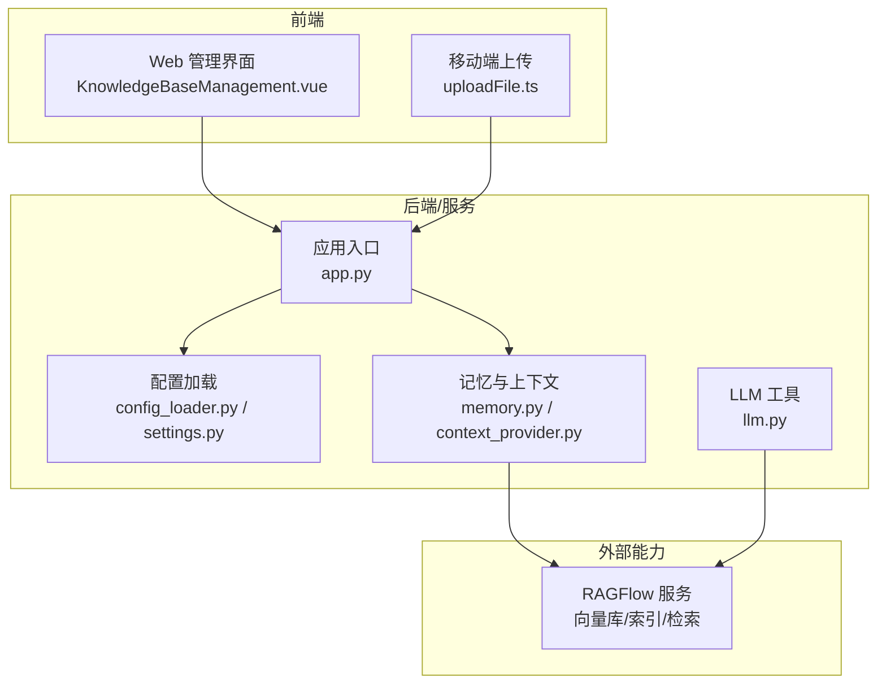
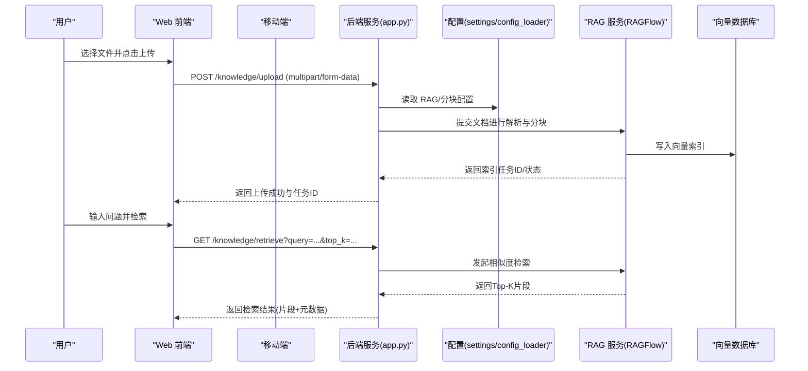
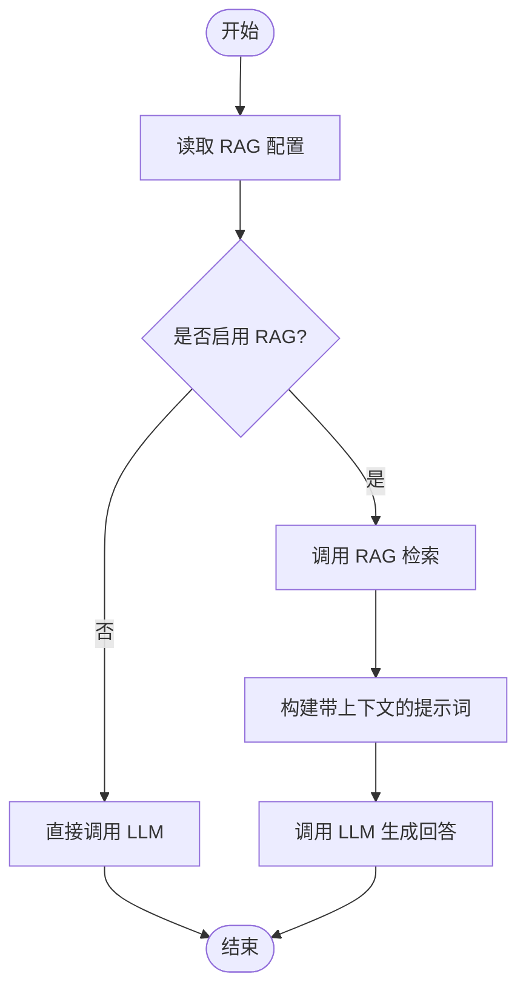
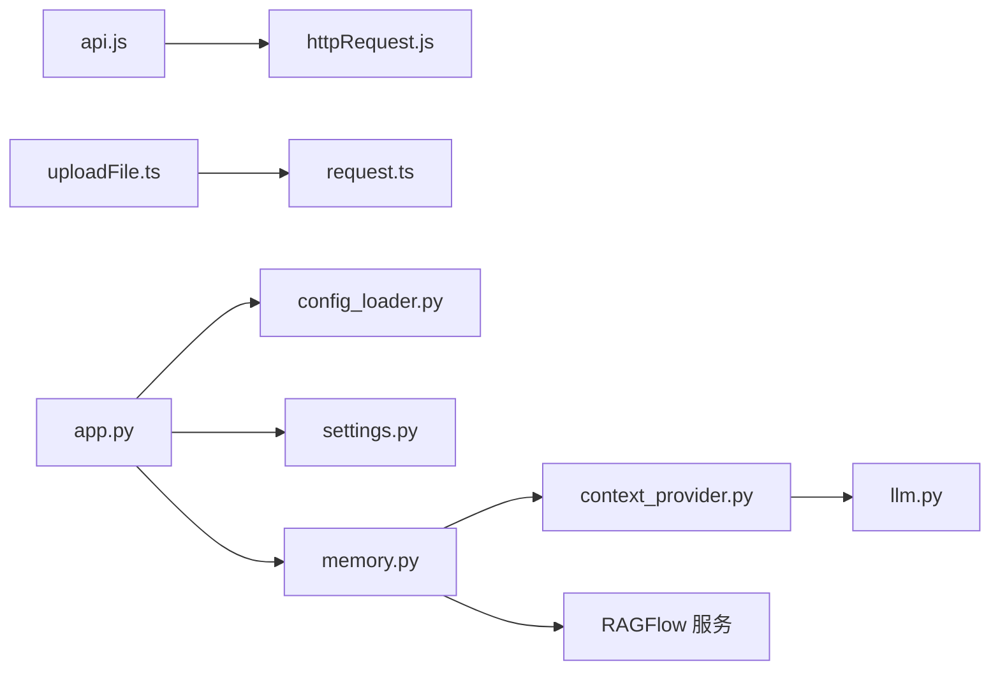

# 知识库 API

<cite>
**本文档引用的文件**   
- [ragflow-integration.md](file://docs/ragflow-integration.md)
- [KnowledgeBaseManagement.vue](file://main/manager-web/src/views/KnowledgeBaseManagement.vue)
- [KnowledgeBaseItem.vue](file://main/manager-web/src/views/KnowledgeBaseItem.vue)
- [KnowledgeBaseDialog.vue](file://main/manager-web/src/components/KnowledgeBaseDialog.vue)
- [api.js](file://main/manager-web/src/apis/api.js)
- [httpRequest.js](file://main/manager-web/src/apis/httpRequest.js)
- [uploadFile.ts](file://main/manager-mobile/src/utils/uploadFile.ts)
- [request.ts](file://main/manager-mobile/src/http/request/index.ts)
- [config_loader.py](file://main/xiaozhi-server/config/config_loader.py)
- [settings.py](file://main/xiaozhi-server/config/settings.py)
- [memory.py](file://main/xiaozhi-server/core/utils/memory.py)
- [context_provider.py](file://main/xiaozhi-server/core/utils/context_provider.py)
- [llm.py](file://main/xiaozhi-server/core/utils/llm.py)
- [app.py](file://main/xiaozhi-server/app.py)
</cite>

## 目录
1. [简介](#简介)
2. [项目结构](#项目结构)
3. [核心组件](#核心组件)
4. [架构总览](#架构总览)
5. [详细组件分析](#详细组件分析)
6. [依赖分析](#依赖分析)
7. [性能考虑](#性能考虑)
8. [故障排查指南](#故障排查指南)
9. [结论](#结论)
10. [附录](#附录)

## 简介
本文件为知识库管理模块的 RESTful API 文档，覆盖知识文档的上传、解析、索引、检索等接口，并说明 RAG 集成、向量数据库操作、文档分块策略、批量导入与性能调优建议。该模块由前端（Web/移动端）与管理后端组成，通过 HTTP 接口与服务器端能力交互；RAG 能力通过外部服务（如 RAGFlow）或内部工具链完成向量化与检索增强生成。

## 项目结构
知识库相关的前端页面与组件位于 manager-web 与 manager-mobile 中，负责上传、列表展示、详情查看与对话检索；服务端配置与上下文提供器位于 xiaozhi-server 的配置与 utils 目录；RAG 集成参考文档位于 docs/ragflow-integration.md。

图表来源
- [KnowledgeBaseManagement.vue](file://main/manager-web/src/views/KnowledgeBaseManagement.vue)
- [uploadFile.ts](file://main/manager-mobile/src/utils/uploadFile.ts)
- [config_loader.py](file://main/xiaozhi-server/config/config_loader.py)
- [settings.py](file://main/xiaozhi-server/config/settings.py)
- [memory.py](file://main/xiaozhi-server/core/utils/memory.py)
- [context_provider.py](file://main/xiaozhi-server/core/utils/context_provider.py)
- [llm.py](file://main/xiaozhi-server/core/utils/llm.py)
- [app.py](file://main/xiaozhi-server/app.py)
- [ragflow-integration.md](file://docs/ragflow-integration.md)

章节来源
- [KnowledgeBaseManagement.vue](file://main/manager-web/src/views/KnowledgeBaseManagement.vue)
- [KnowledgeBaseItem.vue](file://main/manager-web/src/views/KnowledgeBaseItem.vue)
- [KnowledgeBaseDialog.vue](file://main/manager-web/src/components/KnowledgeBaseDialog.vue)
- [api.js](file://main/manager-web/src/apis/api.js)
- [httpRequest.js](file://main/manager-web/src/apis/httpRequest.js)
- [uploadFile.ts](file://main/manager-mobile/src/utils/uploadFile.ts)
- [request.ts](file://main/manager-mobile/src/http/request/index.ts)
- [config_loader.py](file://main/xiaozhi-server/config/config_loader.py)
- [settings.py](file://main/xiaozhi-server/config/settings.py)
- [memory.py](file://main/xiaozhi-server/core/utils/memory.py)
- [context_provider.py](file://main/xiaozhi-server/core/utils/context_provider.py)
- [llm.py](file://main/xiaozhi-server/core/utils/llm.py)
- [app.py](file://main/xiaozhi-server/app.py)
- [ragflow-integration.md](file://docs/ragflow-integration.md)

## 核心组件
- 前端上传与展示
  - Web 端：知识库列表、新增/编辑对话框、单条知识详情与检索入口。
  - 移动端：统一的文件上传封装，支持进度与错误处理。
- 后端配置与上下文
  - 配置加载与设置项读取，控制 RAG 开关、向量库连接、分块策略等。
  - 上下文提供者负责在对话时注入相关知识片段。
- RAG 集成
  - 通过 RAGFlow 或其他向量服务进行文档切分、向量化、索引构建与相似度检索。

章节来源
- [KnowledgeBaseManagement.vue](file://main/manager-web/src/views/KnowledgeBaseManagement.vue)
- [KnowledgeBaseDialog.vue](file://main/manager-web/src/components/KnowledgeBaseDialog.vue)
- [KnowledgeBaseItem.vue](file://main/manager-web/src/views/KnowledgeBaseItem.vue)
- [uploadFile.ts](file://main/manager-mobile/src/utils/uploadFile.ts)
- [config_loader.py](file://main/xiaozhi-server/config/config_loader.py)
- [settings.py](file://main/xiaozhi-server/config/settings.py)
- [memory.py](file://main/xiaozhi-server/core/utils/memory.py)
- [context_provider.py](file://main/xiaozhi-server/core/utils/context_provider.py)
- [ragflow-integration.md](file://docs/ragflow-integration.md)

## 架构总览
知识库管理采用“前端调用 + 后端编排 + 外部 RAG 服务”的分层架构。前端负责用户交互与文件上传；后端统一接收请求、校验参数、调度任务（解析/分块/向量化/索引），并通过上下文提供器将检索结果注入到 LLM 的提示词中。

图表来源
- [app.py](file://main/xiaozhi-server/app.py)
- [config_loader.py](file://main/xiaozhi-server/config/config_loader.py)
- [settings.py](file://main/xiaozhi-server/config/settings.py)
- [ragflow-integration.md](file://docs/ragflow-integration.md)

## 详细组件分析

### 上传接口
- 路径与方法
  - POST /knowledge/upload
- 请求头
  - Content-Type: multipart/form-data
- 请求体字段
  - file: 二进制文件（支持常见文档格式）
  - knowledge_id: 可选，关联的知识集标识
  - tags: 可选，标签数组
- 响应体
  - code: 状态码
  - message: 提示信息
  - data: { task_id, status }
- 示例
  - 请求示例
    - 使用表单上传一个 PDF 文件，附带 knowledge_id 与 tags
  - 响应示例
    - { "code": 0, "message": "上传成功", "data": { "task_id": "u_123456", "status": "queued" } }

章节来源
- [KnowledgeBaseManagement.vue](file://main/manager-web/src/views/KnowledgeBaseManagement.vue)
- [KnowledgeBaseDialog.vue](file://main/manager-web/src/components/KnowledgeBaseDialog.vue)
- [api.js](file://main/manager-web/src/apis/api.js)
- [httpRequest.js](file://main/manager-web/src/apis/httpRequest.js)
- [uploadFile.ts](file://main/manager-mobile/src/utils/uploadFile.ts)
- [request.ts](file://main/manager-mobile/src/http/request/index.ts)

### 解析与索引接口
- 路径与方法
  - POST /knowledge/parse
  - POST /knowledge/index
- 请求体字段
  - task_id: 上传返回的任务ID
  - options: { chunk_size, overlap, strategy }
- 响应体
  - code: 状态码
  - message: 提示信息
  - data: { status, progress, chunks_count }
- 示例
  - 请求示例
    - { "task_id": "u_123456", "options": { "chunk_size": 500, "overlap": 50, "strategy": "semantic" } }
  - 响应示例
    - { "code": 0, "message": "解析完成", "data": { "status": "done", "progress": 100, "chunks_count": 42 } }

章节来源
- [KnowledgeBaseManagement.vue](file://main/manager-web/src/views/KnowledgeBaseManagement.vue)
- [KnowledgeBaseDialog.vue](file://main/manager-web/src/components/KnowledgeBaseDialog.vue)
- [ragflow-integration.md](file://docs/ragflow-integration.md)

### 检索接口
- 路径与方法
  - GET /knowledge/retrieve
- 查询参数
  - query: 检索文本
  - top_k: 返回片段数量（默认 5）
  - knowledge_id: 限定知识集
  - filters: 可选过滤条件（tags、时间范围等）
- 响应体
  - code: 状态码
  - message: 提示信息
  - data: { results: [{ text, score, metadata }] }
- 示例
  - 请求示例
    - GET /knowledge/retrieve?query=设备绑定流程&top_k=3&knowledge_id=k_001
  - 响应示例
    - { "code": 0, "message": "检索成功", "data": { "results": [ { "text": "...", "score": 0.92, "metadata": { "source": "doc.pdf", "page": 3 } }, ... ] } }

章节来源
- [KnowledgeBaseItem.vue](file://main/manager-web/src/views/KnowledgeBaseItem.vue)
- [ragflow-integration.md](file://docs/ragflow-integration.md)

### RAG 集成与上下文注入
- 功能说明
  - 在对话过程中，根据用户问题从向量库检索相关片段，拼接至系统提示词，提升回答准确性。
- 关键流程
  - 读取配置（是否启用 RAG、向量库地址、模型参数）
  - 调用 RAG 服务进行检索
  - 将 Top-K 片段注入上下文提供者
  - 传递给 LLM 生成最终答案
- 配置项
  - rag_enabled: 是否启用 RAG
  - vector_db_url: 向量库连接地址
  - embedding_model: 嵌入模型名称
  - chunk_strategy: 分块策略（固定长度/语义分块）
  - retrieval_top_k: 默认检索片段数

图表来源
- [config_loader.py](file://main/xiaozhi-server/config/config_loader.py)
- [settings.py](file://main/xiaozhi-server/config/settings.py)
- [memory.py](file://main/xiaozhi-server/core/utils/memory.py)
- [context_provider.py](file://main/xiaozhi-server/core/utils/context_provider.py)
- [llm.py](file://main/xiaozhi-server/core/utils/llm.py)
- [ragflow-integration.md](file://docs/ragflow-integration.md)

章节来源
- [memory.py](file://main/xiaozhi-server/core/utils/memory.py)
- [context_provider.py](file://main/xiaozhi-server/core/utils/context_provider.py)
- [llm.py](file://main/xiaozhi-server/core/utils/llm.py)
- [config_loader.py](file://main/xiaozhi-server/config/config_loader.py)
- [settings.py](file://main/xiaozhi-server/config/settings.py)
- [ragflow-integration.md](file://docs/ragflow-integration.md)

### 批量导入接口
- 路径与方法
  - POST /knowledge/batch_import
- 请求体字段
  - files: 文件数组（每个包含 name、content/base64、metadata）
  - options: { chunk_size, overlap, strategy }
- 响应体
  - code: 状态码
  - message: 提示信息
  - data: { total, success, failed, task_ids: [...] }
- 示例
  - 请求示例
    - { "files": [{ "name": "a.pdf", "content": "base64...", "metadata": { "tags": ["设备","绑定"] } }, ...], "options": { "chunk_size": 500, "overlap": 50, "strategy": "semantic" } }
  - 响应示例
    - { "code": 0, "message": "批量导入完成", "data": { "total": 10, "success": 9, "failed": 1, "task_ids": ["u_1001","u_1002",...] } }

章节来源
- [KnowledgeBaseManagement.vue](file://main/manager-web/src/views/KnowledgeBaseManagement.vue)
- [KnowledgeBaseDialog.vue](file://main/manager-web/src/components/KnowledgeBaseDialog.vue)
- [ragflow-integration.md](file://docs/ragflow-integration.md)

### 更新与版本机制
- 功能说明
  - 对已有知识集进行增量更新或全量重建，确保索引一致性。
- 常用接口
  - PUT /knowledge/update
  - DELETE /knowledge/delete
- 请求体字段
  - knowledge_id: 目标知识集
  - action: update/rebuild
  - files: 可选，待更新的文件列表
- 响应体
  - code: 状态码
  - message: 提示信息
  - data: { status, task_id }

章节来源
- [KnowledgeBaseManagement.vue](file://main/manager-web/src/views/KnowledgeBaseManagement.vue)
- [KnowledgeBaseDialog.vue](file://main/manager-web/src/components/KnowledgeBaseDialog.vue)

## 依赖分析
- 前端依赖
  - api.js 定义知识库相关接口路径与参数映射
  - httpRequest.js 统一请求封装（超时、重试、鉴权）
  - uploadFile.ts 移动端文件上传封装
  - request.ts 移动端 HTTP 请求基础能力
- 后端依赖
  - app.py 作为应用入口，路由分发与中间件处理
  - config_loader.py / settings.py 读取运行期配置
  - memory.py / context_provider.py 管理上下文与记忆注入
  - llm.py 调用大模型生成回答
- 外部依赖
  - RAGFlow 服务提供向量库与检索能力

图表来源
- [api.js](file://main/manager-web/src/apis/api.js)
- [httpRequest.js](file://main/manager-web/src/apis/httpRequest.js)
- [uploadFile.ts](file://main/manager-mobile/src/utils/uploadFile.ts)
- [request.ts](file://main/manager-mobile/src/http/request/index.ts)
- [app.py](file://main/xiaozhi-server/app.py)
- [config_loader.py](file://main/xiaozhi-server/config/config_loader.py)
- [settings.py](file://main/xiaozhi-server/config/settings.py)
- [memory.py](file://main/xiaozhi-server/core/utils/memory.py)
- [context_provider.py](file://main/xiaozhi-server/core/utils/context_provider.py)
- [llm.py](file://main/xiaozhi-server/core/utils/llm.py)

章节来源
- [api.js](file://main/manager-web/src/apis/api.js)
- [httpRequest.js](file://main/manager-web/src/apis/httpRequest.js)
- [uploadFile.ts](file://main/manager-mobile/src/utils/uploadFile.ts)
- [request.ts](file://main/manager-mobile/src/http/request/index.ts)
- [app.py](file://main/xiaozhi-server/app.py)
- [config_loader.py](file://main/xiaozhi-server/config/config_loader.py)
- [settings.py](file://main/xiaozhi-server/config/settings.py)
- [memory.py](file://main/xiaozhi-server/core/utils/memory.py)
- [context_provider.py](file://main/xiaozhi-server/core/utils/context_provider.py)
- [llm.py](file://main/xiaozhi-server/core/utils/llm.py)

## 性能考虑
- 分块策略
  - 固定长度分块：简单快速，适合结构化文本
  - 语义分块：更精准但计算开销较大，适合长文档与复杂内容
- 向量库优化
  - 合理设置 chunk_size 与 overlap，平衡召回率与存储成本
  - 使用合适的 embedding 模型与索引算法（HNSW/IVF）
- 检索优化
  - top_k 不宜过大，避免噪声引入
  - 结合过滤器（tags、时间）缩小搜索空间
- 并发与批处理
  - 批量导入时使用异步任务队列，避免阻塞主线程
  - 对大文件分片上传与断点续传

[本节为通用指导，不直接分析具体文件]

## 故障排查指南
- 上传失败
  - 检查文件大小与类型限制
  - 确认网络与鉴权配置
- 解析/索引失败
  - 查看任务状态与日志
  - 验证 RAG 服务连通性与权限
- 检索结果不准确
  - 调整 top_k 与过滤条件
  - 优化分块策略与嵌入模型
- 上下文未注入
  - 检查 RAG 开关与配置项
  - 确认上下文提供器初始化顺序

章节来源
- [KnowledgeBaseManagement.vue](file://main/manager-web/src/views/KnowledgeBaseManagement.vue)
- [KnowledgeBaseDialog.vue](file://main/manager-web/src/components/KnowledgeBaseDialog.vue)
- [config_loader.py](file://main/xiaozhi-server/config/config_loader.py)
- [settings.py](file://main/xiaozhi-server/config/settings.py)
- [memory.py](file://main/xiaozhi-server/core/utils/memory.py)
- [context_provider.py](file://main/xiaozhi-server/core/utils/context_provider.py)
- [ragflow-integration.md](file://docs/ragflow-integration.md)

## 结论
知识库管理模块通过清晰的前后端分层与 RAG 集成，实现了文档上传、解析、索引与检索的完整闭环。合理的分块策略与向量库配置是提升检索质量的关键；批量导入与异步任务可显著提升吞吐与用户体验。建议在上线前进行性能测试与容量规划，持续优化分块与检索参数。

[本节为总结性内容，不直接分析具体文件]

## 附录
- 接口清单
  - POST /knowledge/upload
  - POST /knowledge/parse
  - POST /knowledge/index
  - GET /knowledge/retrieve
  - POST /knowledge/batch_import
  - PUT /knowledge/update
  - DELETE /knowledge/delete
- 配置项参考
  - rag_enabled
  - vector_db_url
  - embedding_model
  - chunk_strategy
  - retrieval_top_k

[本节为补充信息，不直接分析具体文件]