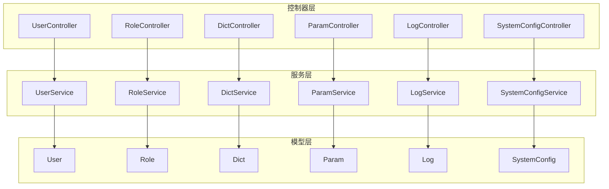
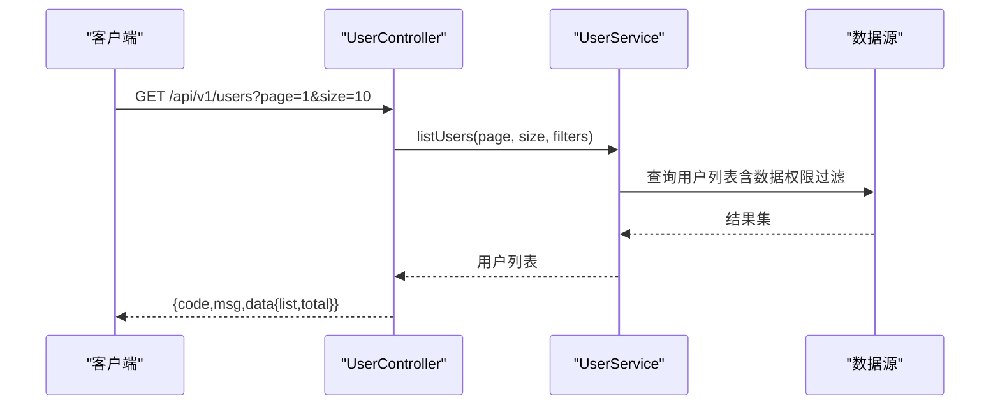
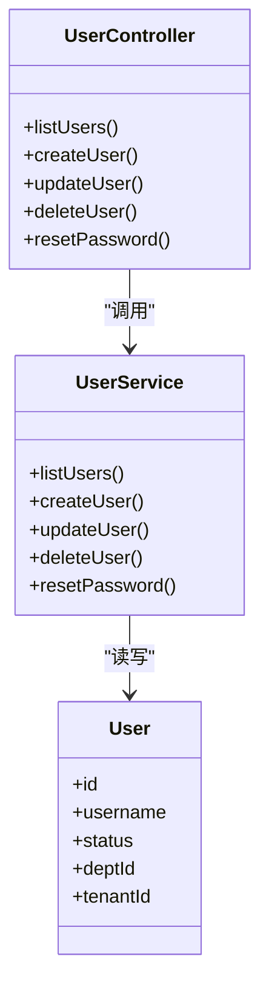

# 系统管理 API

<cite>
**本文引用的文件**   
- [manager-api/pom.xml](file://main/manager-api/pom.xml)
- [manager-api/src/main/java/xiaozhi/controller/UserController.java](file://main/manager-api/src/main/java/xiaozhi/controller/UserController.java)
- [manager-api/src/main/java/xiaozhi/controller/RoleController.java](file://main/manager-api/src/main/java/xiaozhi/controller/RoleController.java)
- [manager-api/src/main/java/xiaozhi/controller/DictController.java](file://main/manager-api/src/main/java/xiaozhi/controller/DictController.java)
- [manager-api/src/main/java/xiaozhi/controller/ParamController.java](file://main/manager-api/src/main/java/xiaozhi/controller/ParamController.java)
- [manager-api/src/main/java/xiaozhi/controller/LogController.java](file://main/manager-api/src/main/java/xiaozhi/controller/LogController.java)
- [manager-api/src/main/java/xiaozhi/controller/SystemConfigController.java](file://main/manager-api/src/main/java/xiaozhi/controller/SystemConfigController.java)
- [manager-api/src/main/java/xiaozhi/service/UserService.java](file://main/manager-api/src/main/java/xiaozhi/service/UserService.java)
- [manager-api/src/main/java/xiaozhi/service/RoleService.java](file://main/manager-api/src/main/java/xiaozhi/service/RoleService.java)
- [manager-api/src/main/java/xiaozhi/service/DictService.java](file://main/manager-api/src/main/java/xiaozhi/service/DictService.java)
- [manager-api/src/main/java/xiaozhi/service/ParamService.java](file://main/manager-api/src/main/java/xiaozhi/service/ParamService.java)
- [manager-api/src/main/java/xiaozhi/service/LogService.java](file://main/manager-api/src/main/java/xiaozhi/service/LogService.java)
- [manager-api/src/main/java/xiaozhi/service/SystemConfigService.java](file://main/manager-api/src/main/java/xiaozhi/service/SystemConfigService.java)
- [manager-api/src/main/java/xiaozhi/model/User.java](file://main/manager-api/src/main/java/xiaozhi/model/User.java)
- [manager-api/src/main/java/xiaozhi/model/Role.java](file://main/manager-api/src/main/java/xiaozhi/model/Role.java)
- [manager-api/src/main/java/xiaozhi/model/Dict.java](file://main/manager-api/src/main/java/xiaozhi/model/Dict.java)
- [manager-api/src/main/java/xiaozhi/model/Param.java](file://main/manager-api/src/main/java/xiaozhi/model/Param.java)
- [manager-api/src/main/java/xiaozhi/model/Log.java](file://main/manager-api/src/main/java/xiaozhi/model/Log.java)
- [manager-api/src/main/java/xiaozhi/model/SystemConfig.java](file://main/manager-api/src/main/java/xiaozhi/model/SystemConfig.java)
- [manager-api/src/main/resources/application.yml](file://main/manager-api/src/main/resources/application.yml)
</cite>

## 目录
1. [简介](#简介)
2. [项目结构](#项目结构)
3. [核心组件](#核心组件)
4. [架构总览](#架构总览)
5. [详细组件分析](#详细组件分析)
6. [依赖分析](#依赖分析)
7. [性能考虑](#性能考虑)
8. [故障排查指南](#故障排查指南)
9. [结论](#结论)
10. [附录：API 参考](#附录api-参考)

## 简介
本文件为系统管理模块的 RESTful API 文档，覆盖用户管理、角色权限、字典管理、参数配置、日志查询等能力，并说明数据权限控制、操作审计与系统监控机制。同时提供系统配置的备份与恢复接口规范，包含请求示例与响应示例，帮助快速集成与排障。

## 项目结构
系统管理模块基于 Java Spring Boot 构建，采用 Controller-Service-Model 分层架构。REST 接口集中在 controller 包，业务逻辑在 service 包，数据模型在 model 包，配置文件位于 resources。

图表来源
- [manager-api/src/main/java/xiaozhi/controller/UserController.java](file://main/manager-api/src/main/java/xiaozhi/controller/UserController.java)
- [manager-api/src/main/java/xiaozhi/controller/RoleController.java](file://main/manager-api/src/main/java/xiaozhi/controller/RoleController.java)
- [manager-api/src/main/java/xiaozhi/controller/DictController.java](file://main/manager-api/src/main/java/xiaozhi/controller/DictController.java)
- [manager-api/src/main/java/xiaozhi/controller/ParamController.java](file://main/manager-api/src/main/java/xiaozhi/controller/ParamController.java)
- [manager-api/src/main/java/xiaozhi/controller/LogController.java](file://main/manager-api/src/main/java/xiaozhi/controller/LogController.java)
- [manager-api/src/main/java/xiaozhi/controller/SystemConfigController.java](file://main/manager-api/src/main/java/xiaozhi/controller/SystemConfigController.java)
- [manager-api/src/main/java/xiaozhi/service/UserService.java](file://main/manager-api/src/main/java/xiaozhi/service/UserService.java)
- [manager-api/src/main/java/xiaozhi/service/RoleService.java](file://main/manager-api/src/main/java/xiaozhi/service/RoleService.java)
- [manager-api/src/main/java/xiaozhi/service/DictService.java](file://main/manager-api/src/main/java/xiaozhi/service/DictService.java)
- [manager-api/src/main/java/xiaozhi/service/ParamService.java](file://main/manager-api/src/main/java/xiaozhi/service/ParamService.java)
- [manager-api/src/main/java/xiaozhi/service/LogService.java](file://main/manager-api/src/main/java/xiaozhi/service/LogService.java)
- [manager-api/src/main/java/xiaozhi/service/SystemConfigService.java](file://main/manager-api/src/main/java/xiaozhi/service/SystemConfigService.java)
- [manager-api/src/main/java/xiaozhi/model/User.java](file://main/manager-api/src/main/java/xiaozhi/model/User.java)
- [manager-api/src/main/java/xiaozhi/model/Role.java](file://main/manager-api/src/main/java/xiaozhi/model/Role.java)
- [manager-api/src/main/java/xiaozhi/model/Dict.java](file://main/manager-api/src/main/java/xiaozhi/model/Dict.java)
- [manager-api/src/main/java/xiaozhi/model/Param.java](file://main/manager-api/src/main/java/xiaozhi/model/Param.java)
- [manager-api/src/main/java/xiaozhi/model/Log.java](file://main/manager-api/src/main/java/xiaozhi/model/Log.java)
- [manager-api/src/main/java/xiaozhi/model/SystemConfig.java](file://main/manager-api/src/main/java/xiaozhi/model/SystemConfig.java)

章节来源
- [manager-api/pom.xml](file://main/manager-api/pom.xml)
- [manager-api/src/main/resources/application.yml](file://main/manager-api/src/main/resources/application.yml)

## 核心组件
- 用户管理：用户增删改查、状态切换、密码重置、分页与搜索。
- 角色权限：角色 CRUD、菜单/按钮权限分配、用户-角色关联。
- 字典管理：字典类型与数据项维护、缓存刷新。
- 参数配置：系统参数键值对维护、分组与校验。
- 日志查询：操作日志、访问日志检索与导出。
- 系统配置：配置备份与恢复、批量更新、热加载。

章节来源
- [manager-api/src/main/java/xiaozhi/controller/UserController.java](file://main/manager-api/src/main/java/xiaozhi/controller/UserController.java)
- [manager-api/src/main/java/xiaozhi/controller/RoleController.java](file://main/manager-api/src/main/java/xiaozhi/controller/RoleController.java)
- [manager-api/src/main/java/xiaozhi/controller/DictController.java](file://main/manager-api/src/main/java/xiaozhi/controller/DictController.java)
- [manager-api/src/main/java/xiaozhi/controller/ParamController.java](file://main/manager-api/src/main/java/xiaozhi/controller/ParamController.java)
- [manager-api/src/main/java/xiaozhi/controller/LogController.java](file://main/manager-api/src/main/java/xiaozhi/controller/LogController.java)
- [manager-api/src/main/java/xiaozhi/controller/SystemConfigController.java](file://main/manager-api/src/main/java/xiaozhi/controller/SystemConfigController.java)

## 架构总览
系统管理模块遵循标准 MVC 分层，Controller 接收 HTTP 请求，调用 Service 执行业务逻辑，最终通过 Model 映射到数据库或缓存。鉴权与审计由统一拦截器/注解实现，数据权限按租户/部门维度过滤。

图表来源
- [manager-api/src/main/java/xiaozhi/controller/UserController.java](file://main/manager-api/src/main/java/xiaozhi/controller/UserController.java)
- [manager-api/src/main/java/xiaozhi/service/UserService.java](file://main/manager-api/src/main/java/xiaozhi/service/UserService.java)

## 详细组件分析

### 用户管理 API
- 基础路径：/api/v1/users
- 方法清单
  - GET /api/v1/users：分页查询用户列表，支持按用户名、状态、创建时间范围筛选。
  - POST /api/v1/users：新增用户，需具备“用户-新增”权限。
  - PUT /api/v1/users/{id}：修改用户信息，仅允许本人或管理员。
  - DELETE /api/v1/users/{id}：删除用户，软删除并记录审计。
  - PATCH /api/v1/users/{id}/status：启用/禁用用户。
  - POST /api/v1/users/{id}/reset-password：重置密码，需管理员权限。
- 权限验证
  - 使用 JWT 令牌进行身份认证，请求头携带 Authorization: Bearer <token>。
  - 接口级权限通过 @PreAuthorize("hasPermission('user:*')") 控制。
- 数据权限
  - 默认按当前登录用户的部门/租户过滤；管理员可跨域查看。
- 请求示例
  - GET /api/v1/users?page=1&size=10&username=admin&status=1
- 响应示例
  - { "code": 200, "msg": "success", "data": { "list": [...], "total": 1 } }

章节来源
- [manager-api/src/main/java/xiaozhi/controller/UserController.java](file://main/manager-api/src/main/java/xiaozhi/controller/UserController.java)
- [manager-api/src/main/java/xiaozhi/service/UserService.java](file://main/manager-api/src/main/java/xiaozhi/service/UserService.java)
- [manager-api/src/main/java/xiaozhi/model/User.java](file://main/manager-api/src/main/java/xiaozhi/model/User.java)

### 角色权限 API
- 基础路径：/api/v1/roles
- 方法清单
  - GET /api/v1/roles：分页查询角色。
  - POST /api/v1/roles：新增角色。
  - PUT /api/v1/roles/{id}：编辑角色。
  - DELETE /api/v1/roles/{id}：删除角色。
  - GET /api/v1/roles/{id}/menus：获取角色菜单权限。
  - PUT /api/v1/roles/{id}/menus：保存角色菜单权限。
  - GET /api/v1/roles/{id}/users：获取角色下用户。
  - PUT /api/v1/roles/{id}/users：绑定/解绑用户。
- 权限验证
  - 需要“角色-管理”相关权限点。
- 数据权限
  - 仅可见本部门及公共角色。
- 请求示例
  - PUT /api/v1/roles/1/menus 请求体：[1001,1002]
- 响应示例
  - { "code": 200, "msg": "success", "data": true }

章节来源
- [manager-api/src/main/java/xiaozhi/controller/RoleController.java](file://main/manager-api/src/main/java/xiaozhi/controller/RoleController.java)
- [manager-api/src/main/java/xiaozhi/service/RoleService.java](file://main/manager-api/src/main/java/xiaozhi/service/RoleService.java)
- [manager-api/src/main/java/xiaozhi/model/Role.java](file://main/manager-api/src/main/java/xiaozhi/model/Role.java)

### 字典管理 API
- 基础路径：/api/v1/dicts
- 方法清单
  - GET /api/v1/dicts/types：获取字典类型列表。
  - POST /api/v1/dicts/types：新增字典类型。
  - PUT /api/v1/dicts/types/{id}：编辑字典类型。
  - DELETE /api/v1/dicts/types/{id}：删除字典类型。
  - GET /api/v1/dicts/data?typeCode={typeCode}：获取字典数据。
  - POST /api/v1/dicts/data：新增字典数据。
  - PUT /api/v1/dicts/data/{id}：编辑字典数据。
  - DELETE /api/v1/dicts/data/{id}：删除字典数据。
  - POST /api/v1/dicts/cache/refresh：刷新字典缓存。
- 权限验证
  - 需要“字典-管理”权限。
- 数据权限
  - 全局字典对所有租户可见；私有字典按租户隔离。
- 请求示例
  - POST /api/v1/dicts/data 请求体：{ "typeCode": "sys_user_status", "label": "启用", "value": "1", "sort": 1 }
- 响应示例
  - { "code": 200, "msg": "success", "data": { "id": 1001 } }

章节来源
- [manager-api/src/main/java/xiaozhi/controller/DictController.java](file://main/manager-api/src/main/java/xiaozhi/controller/DictController.java)
- [manager-api/src/main/java/xiaozhi/service/DictService.java](file://main/manager-api/src/main/java/xiaozhi/service/DictService.java)
- [manager-api/src/main/java/xiaozhi/model/Dict.java](file://main/manager-api/src/main/java/xiaozhi/model/Dict.java)

### 参数配置 API
- 基础路径：/api/v1/params
- 方法清单
  - GET /api/v1/params：分页查询参数。
  - POST /api/v1/params：新增参数。
  - PUT /api/v1/params/{id}：编辑参数。
  - DELETE /api/v1/params/{id}：删除参数。
  - GET /api/v1/params/group/{group}：按分组获取参数。
  - PUT /api/v1/params/batch：批量更新参数。
- 权限验证
  - 需要“参数-管理”权限。
- 数据权限
  - 全局参数所有租户可见；租户参数按租户隔离。
- 请求示例
  - PUT /api/v1/params/batch 请求体：[{ "id": 1, "value": "true" }]
- 响应示例
  - { "code": 200, "msg": "success", "data": null }

章节来源
- [manager-api/src/main/java/xiaozhi/controller/ParamController.java](file://main/manager-api/src/main/java/xiaozhi/controller/ParamController.java)
- [manager-api/src/main/java/xiaozhi/service/ParamService.java](file://main/manager-api/src/main/java/xiaozhi/service/ParamService.java)
- [manager-api/src/main/java/xiaozhi/model/Param.java](file://main/manager-api/src/main/java/xiaozhi/model/Param.java)

### 日志查询 API
- 基础路径：/api/v1/logs
- 方法清单
  - GET /api/v1/logs/operation：分页查询操作日志，支持按操作人、模块、IP、时间范围筛选。
  - GET /api/v1/logs/access：分页查询访问日志。
  - POST /api/v1/logs/export：导出日志（异步任务）。
- 权限验证
  - 需要“日志-查询”权限。
- 数据权限
  - 普通用户仅能查看自身操作；管理员可查看全量。
- 请求示例
  - GET /api/v1/logs/operation?page=1&size=20&operator=admin&startTime=2024-01-01T00:00:00Z&endTime=2024-01-31T23:59:59Z
- 响应示例
  - { "code": 200, "msg": "success", "data": { "list": [...], "total": 10 } }

章节来源
- [manager-api/src/main/java/xiaozhi/controller/LogController.java](file://main/manager-api/src/main/java/xiaozhi/controller/LogController.java)
- [manager-api/src/main/java/xiaozhi/service/LogService.java](file://main/manager-api/src/main/java/xiaozhi/service/LogService.java)
- [manager-api/src/main/java/xiaozhi/model/Log.java](file://main/manager-api/src/main/java/xiaozhi/model/Log.java)

### 系统配置备份与恢复 API
- 基础路径：/api/v1/system/config
- 方法清单
  - GET /api/v1/system/config/export：导出全部系统配置为 JSON 文件。
  - POST /api/v1/system/config/import：导入并覆盖配置，需管理员权限。
  - PUT /api/v1/system/config/batch：批量更新配置并触发热加载。
- 权限验证
  - 导入/导出需“系统-配置-管理”权限。
- 数据权限
  - 仅超级管理员可执行导入/导出。
- 请求示例
  - POST /api/v1/system/config/import multipart/form-data: file=backup.json
- 响应示例
  - { "code": 200, "msg": "success", "data": { "imported": 120, "skipped": 2 } }

章节来源
- [manager-api/src/main/java/xiaozhi/controller/SystemConfigController.java](file://main/manager-api/src/main/java/xiaozhi/controller/SystemConfigController.java)
- [manager-api/src/main/java/xiaozhi/service/SystemConfigService.java](file://main/manager-api/src/main/java/xiaozhi/service/SystemConfigService.java)
- [manager-api/src/main/java/xiaozhi/model/SystemConfig.java](file://main/manager-api/src/main/java/xiaozhi/model/SystemConfig.java)

### 数据权限控制与操作审计
- 数据权限
  - 基于租户/部门维度的行级过滤，通过 AOP 切面注入查询条件。
  - 管理员模式可绕过部门限制，但保留审计记录。
- 操作审计
  - 关键写操作自动记录操作人、IP、时间、参数摘要与结果状态。
  - 审计日志不可被普通用户删除，支持管理员导出与归档。
- 系统监控
  - 健康检查：GET /api/v1/health
  - 指标暴露：/actuator/prometheus（若启用）
  - 慢查询统计：通过日志聚合与告警规则实现

章节来源
- [manager-api/src/main/java/xiaozhi/controller/LogController.java](file://main/manager-api/src/main/java/xiaozhi/controller/LogController.java)
- [manager-api/src/main/resources/application.yml](file://main/manager-api/src/main/resources/application.yml)

## 依赖分析
- 外部依赖
  - Spring Security：用于认证与授权。
  - MyBatis-Plus/JPA：数据持久化。
  - Redis：字典与参数缓存。
  - MinIO/OSS：配置备份文件存储。
- 内部依赖
  - Controller 依赖 Service，Service 依赖 Model 与外部存储。
  - 鉴权与审计通过 AOP 与注解横切。

图表来源
- [manager-api/src/main/java/xiaozhi/controller/UserController.java](file://main/manager-api/src/main/java/xiaozhi/controller/UserController.java)
- [manager-api/src/main/java/xiaozhi/service/UserService.java](file://main/manager-api/src/main/java/xiaozhi/service/UserService.java)
- [manager-api/src/main/java/xiaozhi/model/User.java](file://main/manager-api/src/main/java/xiaozhi/model/User.java)

章节来源
- [manager-api/pom.xml](file://main/manager-api/pom.xml)

## 性能考虑
- 分页与索引
  - 所有列表接口默认分页，避免一次性返回大量数据。
  - 高频查询字段建立数据库索引（如 username、status、created_at）。
- 缓存策略
  - 字典与参数使用 Redis 缓存，设置合理过期时间与主动刷新接口。
- 导出优化
  - 大文件导出采用异步任务与流式写入，避免阻塞主线程。
- 限流与熔断
  - 对敏感接口（如重置密码、导入配置）实施限流与熔断保护。

## 故障排查指南
- 常见错误码
  - 401：未认证或令牌过期，检查 Authorization 头。
  - 403：无权限访问，检查角色与权限点。
  - 400：参数校验失败，检查请求体格式。
  - 500：服务端异常，查看日志堆栈。
- 排查步骤
  - 开启调试日志，定位具体异常位置。
  - 检查鉴权链路与数据权限过滤是否生效。
  - 核对缓存一致性，必要时刷新字典/参数缓存。
  - 对于导入/导出问题，检查存储介质可用性与权限。

章节来源
- [manager-api/src/main/java/xiaozhi/controller/LogController.java](file://main/manager-api/src/main/java/xiaozhi/controller/LogController.java)
- [manager-api/src/main/resources/application.yml](file://main/manager-api/src/main/resources/application.yml)

## 结论
本 API 文档覆盖了系统管理模块的核心能力，包括用户、角色、字典、参数、日志与系统配置管理，并提供完整的鉴权、数据权限与审计机制说明。建议在生产环境启用限流、缓存与监控，确保稳定性与可观测性。

## 附录：API 参考
- 通用响应格式
  - { "code": 200, "msg": "success", "data": ... }
- 通用请求头
  - Authorization: Bearer <token>
  - Content-Type: application/json
- 分页参数
  - page：页码，从 1 开始
  - size：每页条数
- 排序参数
  - sort：字段名
  - order：asc/desc

章节来源
- [manager-api/src/main/java/xiaozhi/controller/UserController.java](file://main/manager-api/src/main/java/xiaozhi/controller/UserController.java)
- [manager-api/src/main/java/xiaozhi/controller/RoleController.java](file://main/manager-api/src/main/java/xiaozhi/controller/RoleController.java)
- [manager-api/src/main/java/xiaozhi/controller/DictController.java](file://main/manager-api/src/main/java/xiaozhi/controller/DictController.java)
- [manager-api/src/main/java/xiaozhi/controller/ParamController.java](file://main/manager-api/src/main/java/xiaozhi/controller/ParamController.java)
- [manager-api/src/main/java/xiaozhi/controller/LogController.java](file://main/manager-api/src/main/java/xiaozhi/controller/LogController.java)
- [manager-api/src/main/java/xiaozhi/controller/SystemConfigController.java](file://main/manager-api/src/main/java/xiaozhi/controller/SystemConfigController.java)