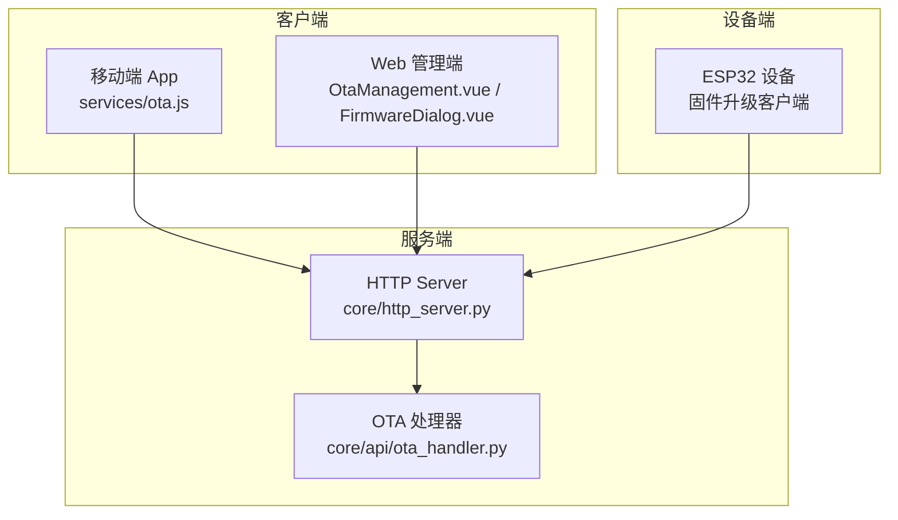
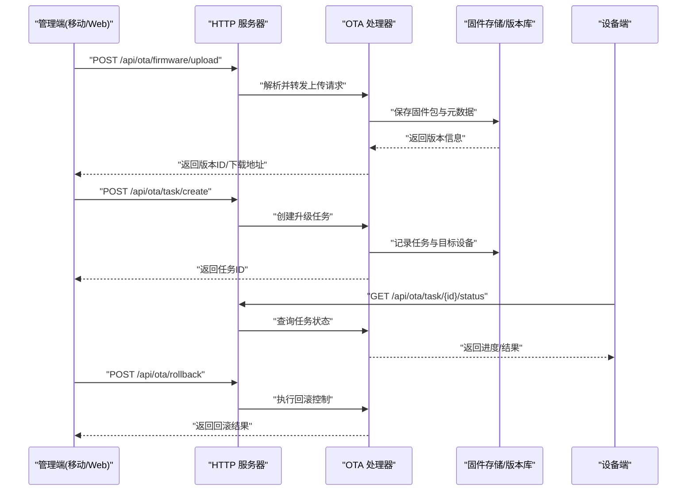
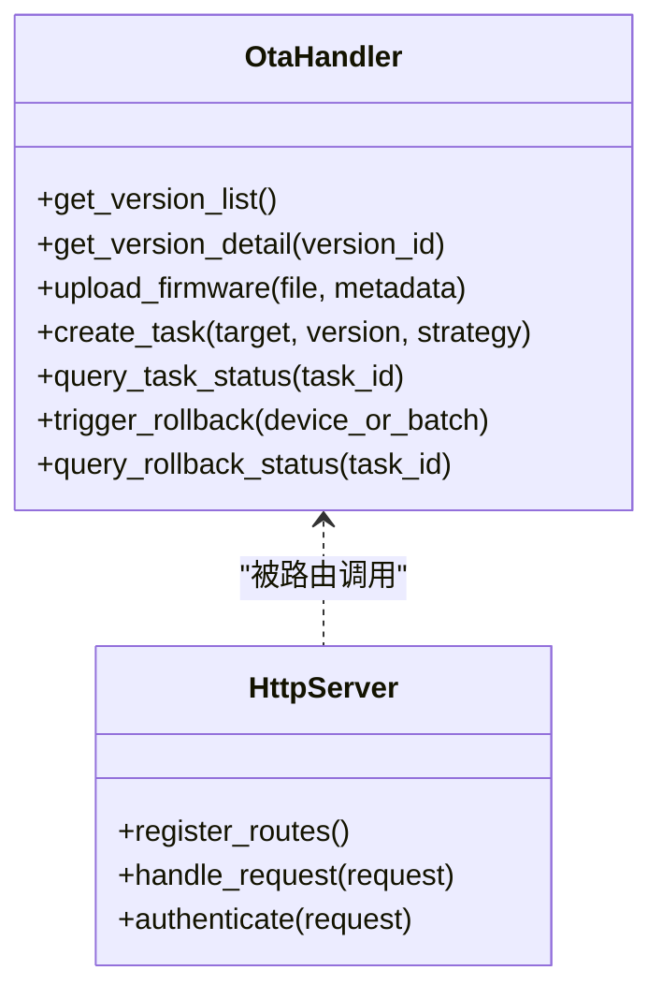
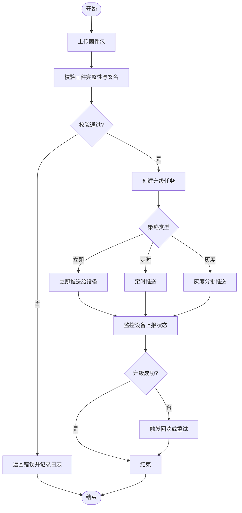
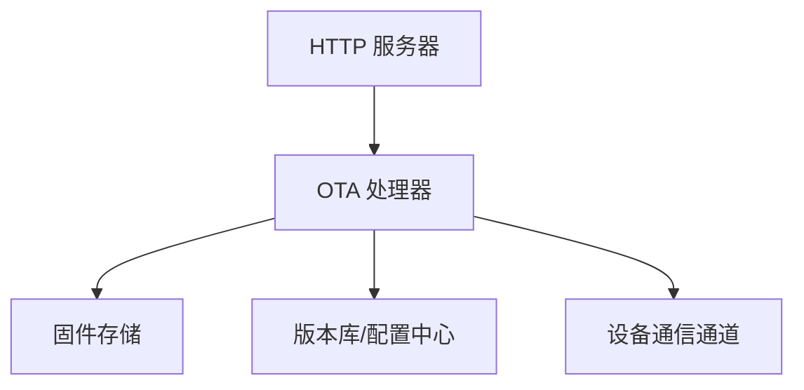

# OTA 升级 API

<cite>
**本文档引用的文件**   
- [ota_handler.py](file://main/xiaozhi-server/core/api/ota_handler.py)
- [http_server.py](file://main/xiaozhi-server/core/http_server.py)
- [ota.js](file://main/manager-mobile/src/services/ota.js)
- [OtaManagement.vue](file://main/manager-web/src/views/OtaManagement.vue)
- [FirmwareDialog.vue](file://main/manager-web/src/components/FirmwareDialog.vue)
- [ota-upgrade-guide.md](file://docs/ota-upgrade-guide.md)
</cite>

## 目录
1. [简介](#简介)
2. [项目结构](#项目结构)
3. [核心组件](#核心组件)
4. [架构总览](#架构总览)
5. [详细组件分析](#详细组件分析)
6. [依赖关系分析](#依赖关系分析)
7. [性能考虑](#性能考虑)
8. [故障排查指南](#故障排查指南)
9. [结论](#结论)
10. [附录](#附录)

## 简介
本文件为 OTA 固件升级功能的 RESTful API 文档，覆盖固件版本管理、升级任务创建与执行、进度查询、回滚控制等接口。文档包含：
- 接口 URL、HTTP 方法、请求参数与响应格式
- 固件包格式规范、升级流程、失败处理机制
- 完整的请求与响应示例
- 版本兼容性校验与安全验证策略
- 批量升级与灰度发布策略建议

## 项目结构
OTA 相关能力主要分布在以下模块：
- 服务端 HTTP 接口实现：core/api/ota_handler.py 与 core/http_server.py
- 管理端（移动端）调用封装：manager-mobile/src/services/ota.js
- 管理端（Web 端）界面与交互：manager-web/src/views/OtaManagement.vue、manager-web/src/components/FirmwareDialog.vue
- 升级操作指南：docs/ota-upgrade-guide.md

**图示来源** 
- [http_server.py](file://main/xiaozhi-server/core/http_server.py)
- [ota_handler.py](file://main/xiaozhi-server/core/api/ota_handler.py)
- [ota.js](file://main/manager-mobile/src/services/ota.js)
- [OtaManagement.vue](file://main/manager-web/src/views/OtaManagement.vue)
- [FirmwareDialog.vue](file://main/manager-web/src/components/FirmwareDialog.vue)

**章节来源**
- [ota_handler.py](file://main/xiaozhi-server/core/api/ota_handler.py)
- [http_server.py](file://main/xiaozhi-server/core/http_server.py)
- [ota.js](file://main/manager-mobile/src/services/ota.js)
- [OtaManagement.vue](file://main/manager-web/src/views/OtaManagement.vue)
- [FirmwareDialog.vue](file://main/manager-web/src/components/FirmwareDialog.vue)
- [ota-upgrade-guide.md](file://docs/ota-upgrade-guide.md)

## 核心组件
- OTA 处理器（ota_handler.py）：定义并实现 OTA 相关的 REST 接口逻辑，包括版本列表获取、固件上传、升级任务下发、状态查询、回滚控制等。
- HTTP 服务器（http_server.py）：负责路由注册、请求解析、鉴权与错误统一处理，将 OTA 请求转发至 ota_handler。
- 管理端服务层（ota.js）：封装对 OTA 接口的调用，提供统一的请求构造、重试与错误提示。
- 管理端页面（OtaManagement.vue、FirmwareDialog.vue）：提供固件上传、版本选择、任务下发、进度展示与回滚操作的 UI。

**章节来源**
- [ota_handler.py](file://main/xiaozhi-server/core/api/ota_handler.py)
- [http_server.py](file://main/xiaozhi-server/core/http_server.py)
- [ota.js](file://main/manager-mobile/src/services/ota.js)
- [OtaManagement.vue](file://main/manager-web/src/views/OtaManagement.vue)
- [FirmwareDialog.vue](file://main/manager-web/src/components/FirmwareDialog.vue)

## 架构总览
下图展示了从管理端或设备端发起 OTA 请求到服务端处理的完整流程，以及关键的数据流向。

**图示来源** 
- [http_server.py](file://main/xiaozhi-server/core/http_server.py)
- [ota_handler.py](file://main/xiaozhi-server/core/api/ota_handler.py)

## 详细组件分析

### OTA 处理器（REST 接口）
- 版本管理
  - 获取版本列表：用于前端展示可升级的目标版本及兼容信息
  - 获取版本详情：查看某版本的元数据（如适用设备、兼容性、签名信息等）
- 固件上传
  - 上传固件包：接收二进制固件包与必要元数据，进行校验与持久化
- 升级任务
  - 创建升级任务：指定目标设备/分组、目标版本、策略（立即/定时/灰度）
  - 查询任务状态：支持按任务 ID 或设备维度查询进度与结果
- 回滚控制
  - 触发回滚：对指定设备或批次执行回滚到上一稳定版本
  - 回滚状态查询：查看回滚任务执行进度与结果

**图示来源** 
- [ota_handler.py](file://main/xiaozhi-server/core/api/ota_handler.py)
- [http_server.py](file://main/xiaozhi-server/core/http_server.py)

**章节来源**
- [ota_handler.py](file://main/xiaozhi-server/core/api/ota_handler.py)
- [http_server.py](file://main/xiaozhi-server/core/http_server.py)

### 管理端服务层（移动端）
- 封装 OTA 接口调用：统一构建请求头、参数与错误处理
- 支持重试与超时控制：提升弱网环境下的稳定性
- 提供进度轮询与事件回调：便于在 UI 中实时展示升级状态

**章节来源**
- [ota.js](file://main/manager-mobile/src/services/ota.js)

### 管理端页面（Web 端）
- 固件上传与版本选择：通过对话框组件完成固件包上传与版本确认
- 任务下发与进度展示：列表展示任务状态，支持刷新与导出日志
- 回滚操作：对异常设备进行一键回滚，并提供二次确认

**章节来源**
- [OtaManagement.vue](file://main/manager-web/src/views/OtaManagement.vue)
- [FirmwareDialog.vue](file://main/manager-web/src/components/FirmwareDialog.vue)

### 升级流程与失败处理

**图示来源** 
- [ota_handler.py](file://main/xiaozhi-server/core/api/ota_handler.py)
- [ota-upgrade-guide.md](file://docs/ota-upgrade-guide.md)

**章节来源**
- [ota_handler.py](file://main/xiaozhi-server/core/api/ota_handler.py)
- [ota-upgrade-guide.md](file://docs/ota-upgrade-guide.md)

## 依赖关系分析
- 路由与控制器耦合：http_server.py 负责路由注册与鉴权，将请求分发到 ota_handler.py 的具体实现，降低耦合度。
- 外部依赖：固件存储（对象存储或本地文件系统）、版本库（数据库或配置中心）、设备通信通道（HTTP/MQTT）。
- 安全依赖：签名校验、访问令牌、传输加密（HTTPS）。

**图示来源** 
- [http_server.py](file://main/xiaozhi-server/core/http_server.py)
- [ota_handler.py](file://main/xiaozhi-server/core/api/ota_handler.py)

**章节来源**
- [http_server.py](file://main/xiaozhi-server/core/http_server.py)
- [ota_handler.py](file://main/xiaozhi-server/core/api/ota_handler.py)

## 性能考虑
- 大文件上传优化：分片上传、断点续传、并发校验与去重
- 任务调度优化：异步队列处理任务创建与推送，避免阻塞主线程
- 状态查询优化：增量更新与缓存策略，减少频繁轮询压力
- 灰度发布优化：按设备标签或地域分批推送，限制并发度

[本节为通用指导，不直接分析具体文件]

## 故障排查指南
- 常见问题
  - 固件上传失败：检查文件格式、大小限制、签名校验与权限
  - 任务创建失败：核对目标设备有效性、版本兼容性与策略参数
  - 升级中断：关注网络波动、设备电量与存储空间
  - 回滚失败：确认回滚目标版本可用性与设备当前状态
- 定位手段
  - 查看服务端日志与错误码
  - 使用任务状态查询接口追踪进度
  - 通过设备侧日志与上报信息进行交叉验证

**章节来源**
- [ota_handler.py](file://main/xiaozhi-server/core/api/ota_handler.py)
- [ota-upgrade-guide.md](file://docs/ota-upgrade-guide.md)

## 结论
本 API 文档围绕 OTA 固件升级的核心流程展开，涵盖版本管理、任务下发、进度查询与回滚控制等关键环节。通过清晰的接口定义、严格的校验与安全的传输策略，确保升级过程的可控与可靠。结合灰度发布与批量升级策略，可在大规模设备管理中平衡效率与风险。

[本节为总结性内容，不直接分析具体文件]

## 附录

### 接口清单与示例
以下为 OTA 相关 REST 接口的常用路径与方法说明（以实际实现为准）：
- 版本管理
  - GET /api/ota/version/list：获取版本列表
  - GET /api/ota/version/{version_id}：获取版本详情
- 固件上传
  - POST /api/ota/firmware/upload：上传固件包（multipart/form-data）
- 升级任务
  - POST /api/ota/task/create：创建升级任务
  - GET /api/ota/task/{task_id}/status：查询任务状态
- 回滚控制
  - POST /api/ota/rollback：触发回滚
  - GET /api/ota/rollback/{task_id}/status：查询回滚状态

请求与响应示例（概念性）：
- 上传固件
  - 请求：POST /api/ota/firmware/upload，表单字段包含 file、metadata（版本号、适用设备、签名等）
  - 响应：{ "code": 0, "data": { "version_id": "v1.2.3", "download_url": "https://..." } }
- 创建任务
  - 请求：POST /api/ota/task/create，JSON 包含 target（设备ID或分组）、version_id、strategy（immediate/scheduled/gray）
  - 响应：{ "code": 0, "data": { "task_id": "t001" } }
- 查询状态
  - 请求：GET /api/ota/task/t001/status
  - 响应：{ "code": 0, "data": { "progress": 60, "status": "upgrading", "error": null } }
- 触发回滚
  - 请求：POST /api/ota/rollback，JSON 包含 device_ids 或 batch_id
  - 响应：{ "code": 0, "data": { "rollback_task_id": "r001" } }

[本节为概念性示例，不直接引用代码片段]

### 固件包格式与兼容性
- 包格式：建议使用压缩归档（如 .zip/.tar.gz），内部包含固件镜像、校验文件与元数据描述
- 元数据：至少包含版本号、适用设备型号、最低系统版本、签名算法与值
- 兼容性：服务端需校验设备型号与最低系统版本，拒绝不兼容的升级

**章节来源**
- [ota-upgrade-guide.md](file://docs/ota-upgrade-guide.md)

### 安全验证
- 传输安全：强制 HTTPS，证书校验
- 身份认证：API 访问令牌或会话校验
- 固件签名：服务端校验固件签名，防止篡改与伪造

**章节来源**
- [http_server.py](file://main/xiaozhi-server/core/http_server.py)
- [ota_handler.py](file://main/xiaozhi-server/core/api/ota_handler.py)

### 批量升级与灰度发布策略
- 批量升级：按设备分组或标签批量下发任务，支持限流与失败重试
- 灰度发布：小比例设备先行验证，逐步扩大范围；支持按地域、机型或用户群体划分
- 回滚策略：灰度阶段出现异常时快速回滚受影响批次，保障整体稳定性

**章节来源**
- [ota_handler.py](file://main/xiaozhi-server/core/api/ota_handler.py)
- [ota-upgrade-guide.md](file://docs/ota-upgrade-guide.md)