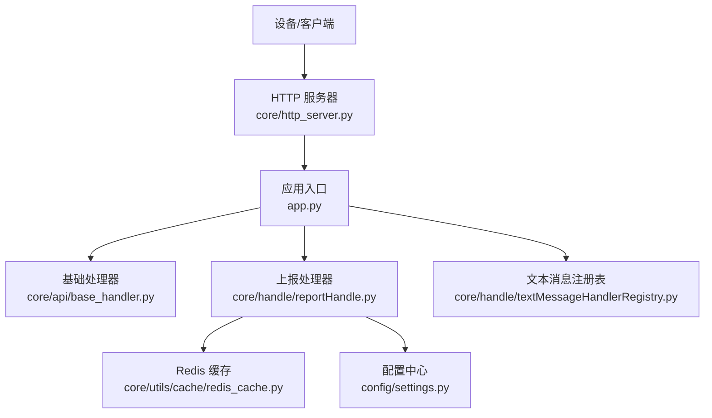
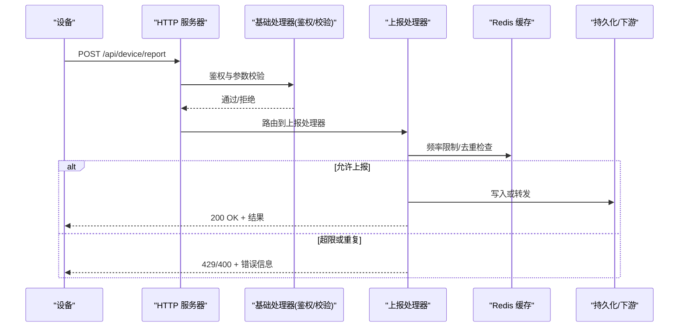
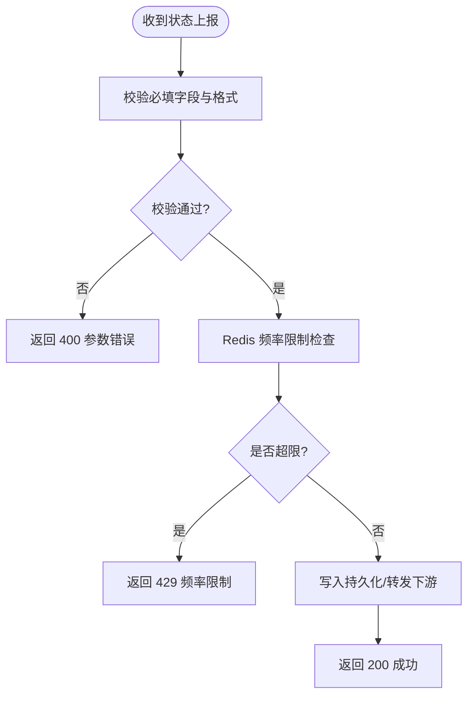
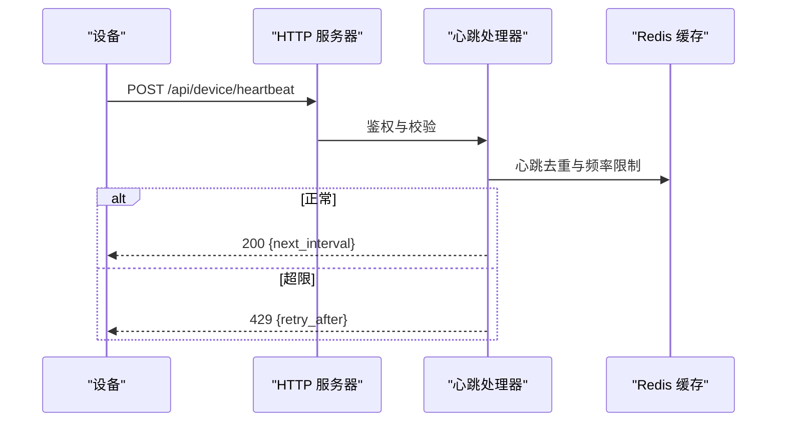
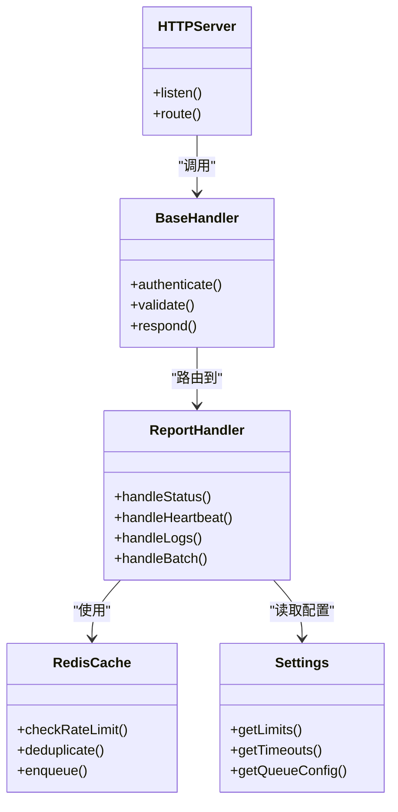

# 设备上报 API

<cite>
**本文引用的文件**   
- [xiaozhi-server/app.py](file://main/xiaozhi-server/app.py)
- [xiaozhi-server/core/http_server.py](file://main/xiaozhi-server/core/http_server.py)
- [xiaozhi-server/core/api/base_handler.py](file://main/xiaozhi-server/core/api/base_handler.py)
- [xiaozhi-server/core/handle/reportHandle.py](file://main/xiaozhi-server/core/handle/reportHandle.py)
- [xiaozhi-server/core/handle/textMessageHandlerRegistry.py](file://main/xiaozhi-server/core/handle/textMessageHandlerRegistry.py)
- [xiaozhi-server/core/utils/cache/redis_cache.py](file://main/xiaozhi-server/core/utils/cache/redis_cache.py)
- [xiaozhi-server/config/settings.py](file://main/xiaozhi-server/config/settings.py)
</cite>

## 目录
1. [简介](#简介)
2. [项目结构](#项目结构)
3. [核心组件](#核心组件)
4. [架构总览](#架构总览)
5. [详细组件分析](#详细组件分析)
6. [依赖关系分析](#依赖关系分析)
7. [性能考虑](#性能考虑)
8. [故障排查指南](#故障排查指南)
9. [结论](#结论)
10. [附录](#附录)

## 简介
本文件为“设备数据上报”相关 RESTful API 的权威文档，覆盖设备状态上报、心跳检测、日志上传等接口的 URL 路径、HTTP 方法、请求参数与响应格式。同时给出数据结构说明、频率限制建议、缓存策略、批量上报与异步处理优化方案，以及完整的请求/响应示例与异常处理规范，帮助客户端快速集成并稳定运行。

## 项目结构
与设备上报相关的后端实现主要位于 xiaozhi-server 模块中：
- HTTP 服务入口与路由注册在 http_server 与 app 中
- 上报业务逻辑集中在 reportHandle 及文本消息处理器注册表
- 缓存与限流通过 Redis 缓存工具与配置项控制
- 基础处理器提供统一的鉴权、校验与错误封装

图表来源 
- [xiaozhi-server/core/http_server.py](file://main/xiaozhi-server/core/http_server.py)
- [xiaozhi-server/app.py](file://main/xiaozhi-server/app.py)
- [xiaozhi-server/core/api/base_handler.py](file://main/xiaozhi-server/core/api/base_handler.py)
- [xiaozhi-server/core/handle/reportHandle.py](file://main/xiaozhi-server/core/handle/reportHandle.py)
- [xiaozhi-server/core/handle/textMessageHandlerRegistry.py](file://main/xiaozhi-server/core/handle/textMessageHandlerRegistry.py)
- [xiaozhi-server/core/utils/cache/redis_cache.py](file://main/xiaozhi-server/core/utils/cache/redis_cache.py)
- [xiaozhi-server/config/settings.py](file://main/xiaozhi-server/config/settings.py)

章节来源
- [xiaozhi-server/core/http_server.py](file://main/xiaozhi-server/core/http_server.py)
- [xiaozhi-server/app.py](file://main/xiaozhi-server/app.py)

## 核心组件
- HTTP 服务器：负责监听端口、解析请求、分发到具体处理器
- 基础处理器：统一鉴权、参数校验、错误码封装、响应格式化
- 上报处理器：处理设备状态、心跳、日志等上报数据的接收、校验、落库或转发
- 文本消息注册表：按消息类型路由到对应处理器（如心跳、日志）
- 缓存层：基于 Redis 的速率限制、去重、短期缓存
- 配置中心：读取上报频率、超时、队列大小等运行时参数

章节来源
- [xiaozhi-server/core/api/base_handler.py](file://main/xiaozhi-server/core/api/base_handler.py)
- [xiaozhi-server/core/handle/reportHandle.py](file://main/xiaozhi-server/core/handle/reportHandle.py)
- [xiaozhi-server/core/handle/textMessageHandlerRegistry.py](file://main/xiaozhi-server/core/handle/textMessageHandlerRegistry.py)
- [xiaozhi-server/core/utils/cache/redis_cache.py](file://main/xiaozhi-server/core/utils/cache/redis_cache.py)
- [xiaozhi-server/config/settings.py](file://main/xiaozhi-server/config/settings.py)

## 架构总览
设备端通过 HTTP 接口将状态、心跳、日志等数据上报至服务端。服务端完成鉴权与校验后，进入上报处理器进行业务处理；高频数据通过 Redis 做限流与去重，必要时写入持久化存储或转发给下游系统。

图表来源 
- [xiaozhi-server/core/http_server.py](file://main/xiaozhi-server/core/http_server.py)
- [xiaozhi-server/core/api/base_handler.py](file://main/xiaozhi-server/core/api/base_handler.py)
- [xiaozhi-server/core/handle/reportHandle.py](file://main/xiaozhi-server/core/handle/reportHandle.py)
- [xiaozhi-server/core/utils/cache/redis_cache.py](file://main/xiaozhi-server/core/utils/cache/redis_cache.py)

## 详细组件分析

### 通用响应格式
- 成功响应
  - 状态码：200
  - 返回体：包含 code、message、data 字段
- 失败响应
  - 状态码：4xx/5xx
  - 返回体：包含 code、message、trace_id（可选）

章节来源
- [xiaozhi-server/core/api/base_handler.py](file://main/xiaozhi-server/core/api/base_handler.py)

### 设备状态上报
- URL：/api/device/report
- 方法：POST
- 鉴权：需要设备令牌或签名（由基础处理器校验）
- 请求体字段
  - device_id：设备唯一标识（必填）
  - timestamp：上报时间戳（毫秒，必填）
  - status：设备状态（在线/离线/故障等，必填）
  - battery：电量百分比（可选）
  - signal：信号强度（可选）
  - firmware_version：固件版本（可选）
  - extra：扩展字段（可选）
- 响应
  - 成功：200，data 中包含接受确认与序列号
  - 失败：400（参数错误）、401（未授权）、429（频率限制）

图表来源 
- [xiaozhi-server/core/handle/reportHandle.py](file://main/xiaozhi-server/core/handle/reportHandle.py)
- [xiaozhi-server/core/utils/cache/redis_cache.py](file://main/xiaozhi-server/core/utils/cache/redis_cache.py)

章节来源
- [xiaozhi-server/core/handle/reportHandle.py](file://main/xiaozhi-server/core/handle/reportHandle.py)

### 心跳检测
- URL：/api/device/heartbeat
- 方法：POST
- 鉴权：同状态上报
- 请求体字段
  - device_id：设备唯一标识（必填）
  - timestamp：时间戳（毫秒，必填）
  - uptime：设备运行时长（秒，可选）
  - cpu_usage：CPU 使用率（可选）
  - memory_usage：内存使用率（可选）
- 响应
  - 成功：200，data 中包含下次心跳间隔（秒）
  - 失败：400、401、429

图表来源 
- [xiaozhi-server/core/handle/textMessageHandlerRegistry.py](file://main/xiaozhi-server/core/handle/textMessageHandlerRegistry.py)
- [xiaozhi-server/core/utils/cache/redis_cache.py](file://main/xiaozhi-server/core/utils/cache/redis_cache.py)

章节来源
- [xiaozhi-server/core/handle/textMessageHandlerRegistry.py](file://main/xiaozhi-server/core/handle/textMessageHandlerRegistry.py)

### 日志上传
- URL：/api/device/logs
- 方法：POST
- 鉴权：同状态上报
- 请求体字段
  - device_id：设备唯一标识（必填）
  - level：日志级别（info/warn/error/debug，必填）
  - message：日志内容（必填，长度限制）
  - stack_trace：堆栈信息（可选）
  - tags：标签数组（可选）
- 响应
  - 成功：200，data 中包含 log_id
  - 失败：400、401、429

章节来源
- [xiaozhi-server/core/handle/reportHandle.py](file://main/xiaozhi-server/core/handle/reportHandle.py)

### 批量上报
- URL：/api/device/batch-report
- 方法：POST
- 鉴权：同状态上报
- 请求体字段
  - items：上报项数组（必填）
    - type：上报类型（status/heartbeat/log，必填）
    - payload：各类型对应的载荷（参考上述单条接口）
- 响应
  - 成功：200，data 中包含 accepted、rejected、errors
  - 失败：400、401、429

章节来源
- [xiaozhi-server/core/handle/reportHandle.py](file://main/xiaozhi-server/core/handle/reportHandle.py)

### 异步处理与队列
- 对于高吞吐场景，上报处理器可将数据入队（例如 Redis List），由后台消费者异步处理
- 客户端可立即获得 202 Accepted，并在后续轮询获取处理结果
- 队列配置（名称、容量、重试次数）由配置中心管理

章节来源
- [xiaozhi-server/config/settings.py](file://main/xiaozhi-server/config/settings.py)
- [xiaozhi-server/core/utils/cache/redis_cache.py](file://main/xiaozhi-server/core/utils/cache/redis_cache.py)

## 依赖关系分析
- HTTP 服务器依赖应用入口进行路由分发
- 基础处理器为所有上报接口提供统一的鉴权与错误封装
- 上报处理器依赖缓存层进行频率限制与去重
- 配置中心提供运行时参数（如频率限制阈值、超时、队列大小）

图表来源 
- [xiaozhi-server/core/http_server.py](file://main/xiaozhi-server/core/http_server.py)
- [xiaozhi-server/core/api/base_handler.py](file://main/xiaozhi-server/core/api/base_handler.py)
- [xiaozhi-server/core/handle/reportHandle.py](file://main/xiaozhi-server/core/handle/reportHandle.py)
- [xiaozhi-server/core/utils/cache/redis_cache.py](file://main/xiaozhi-server/core/utils/cache/redis_cache.py)
- [xiaozhi-server/config/settings.py](file://main/xiaozhi-server/config/settings.py)

章节来源
- [xiaozhi-server/core/http_server.py](file://main/xiaozhi-server/core/http_server.py)
- [xiaozhi-server/core/api/base_handler.py](file://main/xiaozhi-server/core/api/base_handler.py)
- [xiaozhi-server/core/handle/reportHandle.py](file://main/xiaozhi-server/core/handle/reportHandle.py)
- [xiaozhi-server/core/utils/cache/redis_cache.py](file://main/xiaozhi-server/core/utils/cache/redis_cache.py)
- [xiaozhi-server/config/settings.py](file://main/xiaozhi-server/config/settings.py)

## 性能考虑
- 频率限制：基于 Redis 的滑动窗口或固定窗口计数，避免瞬时峰值打爆后端
- 去重策略：对相同 device_id+timestamp 的上报进行去重，减少重复处理
- 批量化：优先使用批量上报接口，降低网络开销与序列化成本
- 异步化：对非实时性强的处理（如日志落盘）采用队列异步消费
- 连接池：数据库与外部服务调用使用连接池，避免频繁握手
- 压缩传输：大体积日志启用 gzip 压缩，减少带宽占用

[本节为通用指导，不直接分析具体文件]

## 故障排查指南
- 常见错误码
  - 400：参数缺失或格式错误（检查必填字段、类型、长度）
  - 401：鉴权失败（检查设备令牌、签名算法、时间戳偏差）
  - 429：频率限制（检查上报频率、退避重试策略）
  - 500：服务端内部错误（查看 trace_id 与服务端日志）
- 排查步骤
  - 开启调试日志，记录请求体与响应体
  - 检查 Redis 连接与键空间（频率限制键是否存在）
  - 核对配置项（超时、队列大小、限流阈值）
  - 验证设备时间与服务器时间同步（NTP）

章节来源
- [xiaozhi-server/core/api/base_handler.py](file://main/xiaozhi-server/core/api/base_handler.py)
- [xiaozhi-server/core/utils/cache/redis_cache.py](file://main/xiaozhi-server/core/utils/cache/redis_cache.py)
- [xiaozhi-server/config/settings.py](file://main/xiaozhi-server/config/settings.py)

## 结论
本 API 设计围绕设备状态、心跳与日志三类上报场景，结合鉴权、校验、频率限制与异步处理，确保高并发下的稳定性与可扩展性。建议客户端遵循批量上报与异步模式，配合合理的重试与退避策略，以获得最佳体验。

[本节为总结性内容，不直接分析具体文件]

## 附录

### 请求与响应示例
- 设备状态上报
  - 请求示例
    - POST /api/device/report
    - 请求体：{device_id, timestamp, status, battery, signal, firmware_version, extra}
  - 响应示例
    - 200 OK：{code: 0, message: "success", data: {seq_no}}
    - 400 Bad Request：{code: 400, message: "参数错误"}
    - 429 Too Many Requests：{code: 429, message: "频率限制", retry_after: 5}
- 心跳检测
  - 请求示例
    - POST /api/device/heartbeat
    - 请求体：{device_id, timestamp, uptime, cpu_usage, memory_usage}
  - 响应示例
    - 200 OK：{code: 0, message: "success", data: {next_interval: 30}}
    - 429 Too Many Requests：{code: 429, message: "频率限制", retry_after: 10}
- 日志上传
  - 请求示例
    - POST /api/device/logs
    - 请求体：{device_id, level, message, stack_trace, tags}
  - 响应示例
    - 200 OK：{code: 0, message: "success", data: {log_id}}
    - 400 Bad Request：{code: 400, message: "参数错误"}
- 批量上报
  - 请求示例
    - POST /api/device/batch-report
    - 请求体：{items: [{type, payload}, ...]}
  - 响应示例
    - 200 OK：{code: 0, message: "success", data: {accepted, rejected, errors}}

[本节为示例说明，不直接分析具体文件]

### 数据校验规则
- device_id：非空，字符串，长度上限
- timestamp：非空，数字，毫秒时间戳
- status：枚举值（在线/离线/故障）
- level：枚举值（info/warn/error/debug）
- message：非空，字符串，长度上限
- 其他可选字段需满足类型与范围约束

章节来源
- [xiaozhi-server/core/api/base_handler.py](file://main/xiaozhi-server/core/api/base_handler.py)

### 频率限制与缓存策略
- 频率限制：基于 Redis 计数器，按 device_id 维度限制单位时间内最大上报次数
- 去重：同一 device_id+timestamp 的上报视为重复，直接丢弃
- 短期缓存：心跳 next_interval 与最近一次状态缓存，用于快速判断与合并

章节来源
- [xiaozhi-server/core/utils/cache/redis_cache.py](file://main/xiaozhi-server/core/utils/cache/redis_cache.py)
- [xiaozhi-server/config/settings.py](file://main/xiaozhi-server/config/settings.py)