# 设备地址簿 API

<cite>
**本文档引用的文件**   
- [AddressBookManagement.vue](file://main/manager-web/src/views/AddressBookManagement.vue)
- [AddressBookDialog.vue](file://main/manager-web/src/components/AddressBookDialog.vue)
- [api.js](file://main/manager-web/src/apis/api.js)
- [httpRequest.js](file://main/manager-web/src/apis/httpRequest.js)
- [device.ts](file://main/manager-mobile/src/api/device/device.ts)
- [request.ts](file://main/manager-mobile/src/utils/request.ts)
- [AddressBookManagement.java](file://main/manager-api/src/main/java/xiaozhi/controller/AddressBookManagement.java)
- [AddressBookService.java](file://main/manager-api/src/main/java/xiaozhi/service/AddressBookService.java)
- [AddressBookEntity.java](file://main/manager-api/src/main/java/xiaozhi/entity/AddressBookEntity.java)
- [AddressBookRepository.java](file://main/manager-api/src/main/java/xiaozhi/repository/AddressBookRepository.java)
</cite>

## 目录
1. [简介](#简介)
2. [项目结构](#项目结构)
3. [核心组件](#核心组件)
4. [架构总览](#架构总览)
5. [详细组件分析](#详细组件分析)
6. [依赖关系分析](#依赖关系分析)
7. [性能考虑](#性能考虑)
8. [故障排查指南](#故障排查指南)
9. [结论](#结论)
10. [附录](#附录)

## 简介
本文件为“设备地址簿管理”功能的 RESTful API 文档，覆盖别名设置、权限管理、分组管理等接口。内容包含：
- 接口 URL、HTTP 方法、请求参数与响应格式
- 地址簿数据结构、权限模型与同步机制说明
- 完整请求与响应示例（以字段描述为主）
- 权限继承与冲突解决策略
- 批量导入导出与性能优化建议

该功能由前端管理端（Web/移动端）调用后端管理 API，后端通过服务层与数据访问层完成地址簿数据的增删改查、分组与权限控制，并提供批量导入导出能力。

## 项目结构
- 前端管理 Web：提供地址簿管理页面与对话框，封装 HTTP 请求到后端管理 API。
- 前端管理移动端：提供移动端地址簿相关能力（如查询、编辑等）。
- 后端管理 API：基于 Java/Spring 的控制器、服务层与数据访问层，实现地址簿业务逻辑与持久化。

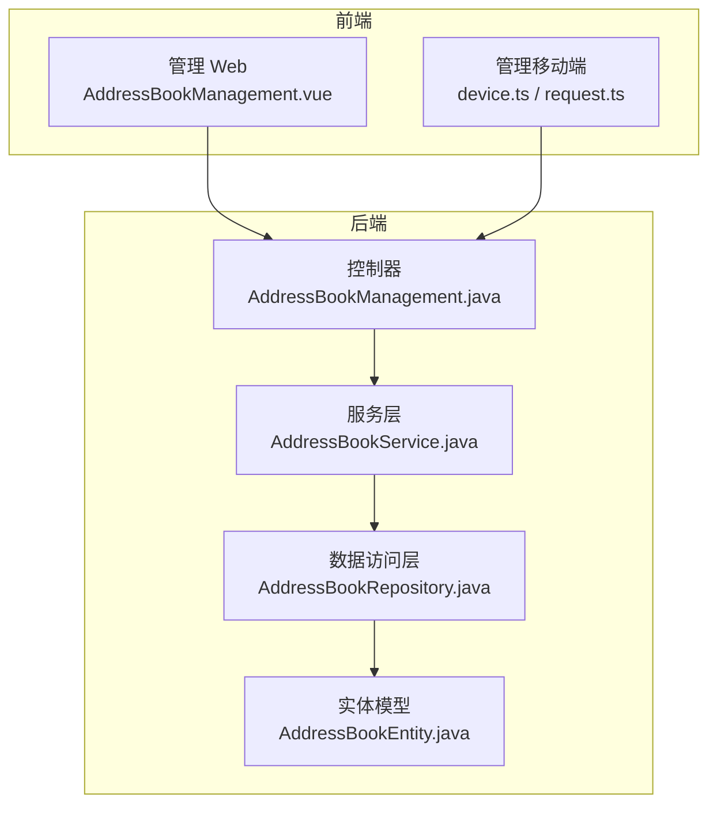

图表来源
- [AddressBookManagement.vue](file://main/manager-web/src/views/AddressBookManagement.vue)
- [AddressBookDialog.vue](file://main/manager-web/src/components/AddressBookDialog.vue)
- [api.js](file://main/manager-web/src/apis/api.js)
- [httpRequest.js](file://main/manager-web/src/apis/httpRequest.js)
- [device.ts](file://main/manager-mobile/src/api/device/device.ts)
- [request.ts](file://main/manager-mobile/src/utils/request.ts)
- [AddressBookManagement.java](file://main/manager-api/src/main/java/xiaozhi/controller/AddressBookManagement.java)
- [AddressBookService.java](file://main/manager-api/src/main/java/xiaozhi/service/AddressBookService.java)
- [AddressBookRepository.java](file://main/manager-api/src/main/java/xiaozhi/repository/AddressBookRepository.java)
- [AddressBookEntity.java](file://main/manager-api/src/main/java/xiaozhi/entity/AddressBookEntity.java)

章节来源
- [AddressBookManagement.vue](file://main/manager-web/src/views/AddressBookManagement.vue)
- [AddressBookDialog.vue](file://main/manager-web/src/components/AddressBookDialog.vue)
- [api.js](file://main/manager-web/src/apis/api.js)
- [httpRequest.js](file://main/manager-web/src/apis/httpRequest.js)
- [device.ts](file://main/manager-mobile/src/api/device/device.ts)
- [request.ts](file://main/manager-mobile/src/utils/request.ts)
- [AddressBookManagement.java](file://main/manager-api/src/main/java/xiaozhi/controller/AddressBookManagement.java)
- [AddressBookService.java](file://main/manager-api/src/main/java/xiaozhi/service/AddressBookService.java)
- [AddressBookRepository.java](file://main/manager-api/src/main/java/xiaozhi/repository/AddressBookRepository.java)
- [AddressBookEntity.java](file://main/manager-api/src/main/java/xiaozhi/entity/AddressBookEntity.java)

## 核心组件
- 控制器层：暴露 REST 接口，处理请求校验、鉴权与响应封装。
- 服务层：实现地址簿业务逻辑（别名设置、分组管理、权限控制、导入导出、同步）。
- 数据访问层：负责与数据库交互，执行 CRUD 与批量操作。
- 实体模型：定义地址簿数据结构与约束。
- 前端 Web：地址簿管理页面与对话框，发起 HTTP 请求并渲染结果。
- 前端移动端：移动端地址簿相关接口封装与调用。

章节来源
- [AddressBookManagement.java](file://main/manager-api/src/main/java/xiaozhi/controller/AddressBookManagement.java)
- [AddressBookService.java](file://main/manager-api/src/main/java/xiaozhi/service/AddressBookService.java)
- [AddressBookRepository.java](file://main/manager-api/src/main/java/xiaozhi/repository/AddressBookRepository.java)
- [AddressBookEntity.java](file://main/manager-api/src/main/java/xiaozhi/entity/AddressBookEntity.java)
- [AddressBookManagement.vue](file://main/manager-web/src/views/AddressBookManagement.vue)
- [AddressBookDialog.vue](file://main/manager-web/src/components/AddressBookDialog.vue)
- [api.js](file://main/manager-web/src/apis/api.js)
- [httpRequest.js](file://main/manager-web/src/apis/httpRequest.js)
- [device.ts](file://main/manager-mobile/src/api/device/device.ts)
- [request.ts](file://main/manager-mobile/src/utils/request.ts)

## 架构总览
整体采用前后端分离架构：前端通过统一的 HTTP 客户端调用后端管理 API；后端按控制器-服务-仓储分层组织，保证职责清晰与可维护性。地址簿数据在数据库中持久化，支持分组与权限控制，并提供批量导入导出能力。

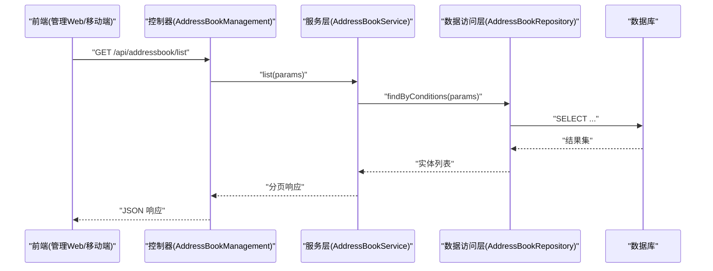

图表来源
- [AddressBookManagement.java](file://main/manager-api/src/main/java/xiaozhi/controller/AddressBookManagement.java)
- [AddressBookService.java](file://main/manager-api/src/main/java/xiaozhi/service/AddressBookService.java)
- [AddressBookRepository.java](file://main/manager-api/src/main/java/xiaozhi/repository/AddressBookRepository.java)

## 详细组件分析

### 地址簿数据模型
- 字段说明（示例字段，具体以实体为准）：
  - id：主键标识
  - device_id：设备标识
  - name：联系人名称
  - alias：别名（用于快速识别或显示）
  - phone：电话号码
  - group_id：所属分组
  - permissions：权限集合（角色/用户维度）
  - created_at/updated_at：时间戳
- 约束与索引：
  - device_id 与 name/alias 唯一性约束
  - group_id 建立索引以提升分组查询性能
  - 常用查询条件：device_id、group_id、name/alias 模糊匹配

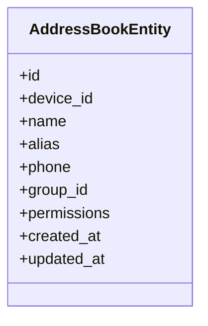

图表来源
- [AddressBookEntity.java](file://main/manager-api/src/main/java/xiaozhi/entity/AddressBookEntity.java)

章节来源
- [AddressBookEntity.java](file://main/manager-api/src/main/java/xiaozhi/entity/AddressBookEntity.java)

### 别名设置接口
- 路径与方法：POST /api/addressbook/alias/set
- 请求体字段：
  - device_id：设备标识（必填）
  - name：联系人名称（必填）
  - alias：新别名（必填）
- 响应：
  - code：状态码
  - message：提示信息
  - data：更新后的别名信息

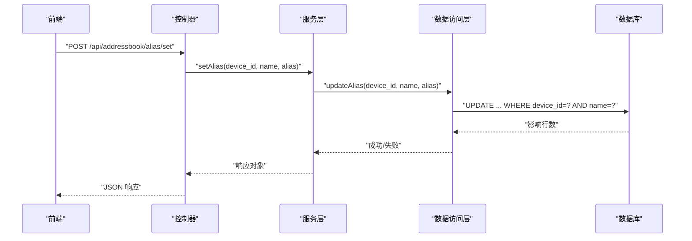

图表来源
- [AddressBookManagement.java](file://main/manager-api/src/main/java/xiaozhi/controller/AddressBookManagement.java)
- [AddressBookService.java](file://main/manager-api/src/main/java/xiaozhi/service/AddressBookService.java)
- [AddressBookRepository.java](file://main/manager-api/src/main/java/xiaozhi/repository/AddressBookRepository.java)

章节来源
- [AddressBookManagement.java](file://main/manager-api/src/main/java/xiaozhi/controller/AddressBookManagement.java)
- [AddressBookService.java](file://main/manager-api/src/main/java/xiaozhi/service/AddressBookService.java)
- [AddressBookRepository.java](file://main/manager-api/src/main/java/xiaozhi/repository/AddressBookRepository.java)

### 权限管理接口
- 路径与方法：
  - POST /api/addressbook/permission/grant：授予权限
  - POST /api/addressbook/permission/revoke：撤销权限
  - GET /api/addressbook/permission/query：查询权限
- 请求体字段（grant/revoke）：
  - device_id：设备标识（必填）
  - name：联系人名称（必填）
  - role/user_id：权限主体（必填）
  - permission_type：权限类型（如 read/write/admin）
- 响应：
  - code/message/data：标准响应结构

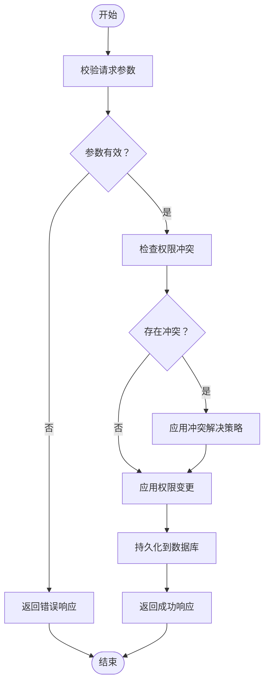

图表来源
- [AddressBookManagement.java](file://main/manager-api/src/main/java/xiaozhi/controller/AddressBookManagement.java)
- [AddressBookService.java](file://main/manager-api/src/main/java/xiaozhi/service/AddressBookService.java)

章节来源
- [AddressBookManagement.java](file://main/manager-api/src/main/java/xiaozhi/controller/AddressBookManagement.java)
- [AddressBookService.java](file://main/manager-api/src/main/java/xiaozhi/service/AddressBookService.java)

### 分组管理接口
- 路径与方法：
  - POST /api/addressbook/group/create：创建分组
  - PUT /api/addressbook/group/update：更新分组
  - DELETE /api/addressbook/group/delete：删除分组
  - GET /api/addressbook/group/list：查询分组列表
  - POST /api/addressbook/group/members：添加/移除成员
- 请求体字段：
  - group_id：分组标识（更新/删除时必填）
  - name：分组名称（必填）
  - members：成员列表（添加/移除时必填）
- 响应：
  - code/message/data：标准响应结构

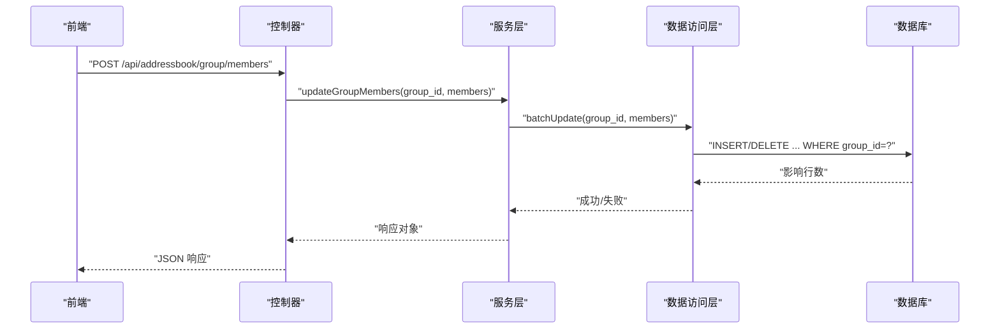

图表来源
- [AddressBookManagement.java](file://main/manager-api/src/main/java/xiaozhi/controller/AddressBookManagement.java)
- [AddressBookService.java](file://main/manager-api/src/main/java/xiaozhi/service/AddressBookService.java)
- [AddressBookRepository.java](file://main/manager-api/src/main/java/xiaozhi/repository/AddressBookRepository.java)

章节来源
- [AddressBookManagement.java](file://main/manager-api/src/main/java/xiaozhi/controller/AddressBookManagement.java)
- [AddressBookService.java](file://main/manager-api/src/main/java/xiaozhi/service/AddressBookService.java)
- [AddressBookRepository.java](file://main/manager-api/src/main/java/xiaozhi/repository/AddressBookRepository.java)

### 批量导入导出接口
- 路径与方法：
  - POST /api/addressbook/import：批量导入（CSV/Excel）
  - GET /api/addressbook/export：批量导出（CSV/Excel）
- 请求体/参数：
  - import：文件格式、设备标识、是否覆盖重复项
  - export：设备标识、分组过滤、字段选择
- 响应：
  - code/message/data：标准响应结构（导出返回下载链接或流）

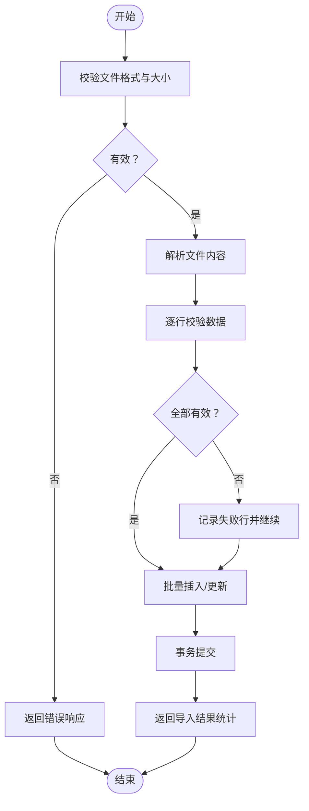

图表来源
- [AddressBookManagement.java](file://main/manager-api/src/main/java/xiaozhi/controller/AddressBookManagement.java)
- [AddressBookService.java](file://main/manager-api/src/main/java/xiaozhi/service/AddressBookService.java)

章节来源
- [AddressBookManagement.java](file://main/manager-api/src/main/java/xiaozhi/controller/AddressBookManagement.java)
- [AddressBookService.java](file://main/manager-api/src/main/java/xiaozhi/service/AddressBookService.java)

### 同步机制
- 触发方式：
  - 手动触发：前端调用同步接口
  - 定时任务：后台定时拉取或推送变更
- 同步内容：
  - 新增/修改/删除的地址簿条目
  - 分组与权限变更
- 一致性保障：
  - 使用版本号或时间戳进行增量同步
  - 冲突检测与合并策略（以服务端为准或客户端协商）

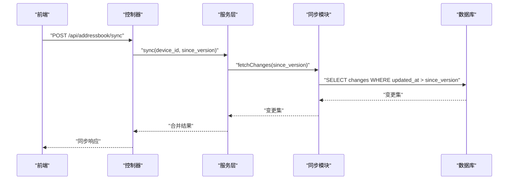

图表来源
- [AddressBookManagement.java](file://main/manager-api/src/main/java/xiaozhi/controller/AddressBookManagement.java)
- [AddressBookService.java](file://main/manager-api/src/main/java/xiaozhi/service/AddressBookService.java)

章节来源
- [AddressBookManagement.java](file://main/manager-api/src/main/java/xiaozhi/controller/AddressBookManagement.java)
- [AddressBookService.java](file://main/manager-api/src/main/java/xiaozhi/service/AddressBookService.java)

### 前端调用流程（Web）
- 页面组件：AddressBookManagement.vue 负责列表展示与操作入口
- 对话框组件：AddressBookDialog.vue 负责别名设置、权限与分组编辑
- API 封装：api.js 与 httpRequest.js 统一处理请求与响应

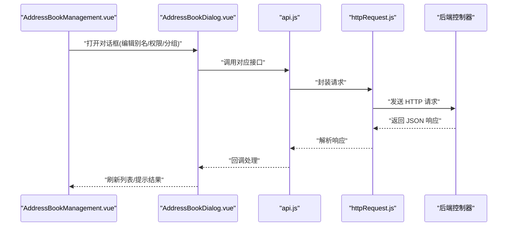

图表来源
- [AddressBookManagement.vue](file://main/manager-web/src/views/AddressBookManagement.vue)
- [AddressBookDialog.vue](file://main/manager-web/src/components/AddressBookDialog.vue)
- [api.js](file://main/manager-web/src/apis/api.js)
- [httpRequest.js](file://main/manager-web/src/apis/httpRequest.js)

章节来源
- [AddressBookManagement.vue](file://main/manager-web/src/views/AddressBookManagement.vue)
- [AddressBookDialog.vue](file://main/manager-web/src/components/AddressBookDialog.vue)
- [api.js](file://main/manager-web/src/apis/api.js)
- [httpRequest.js](file://main/manager-web/src/apis/httpRequest.js)

### 前端调用流程（移动端）
- 接口封装：device.ts 定义地址簿相关接口
- 请求工具：request.ts 统一处理网络请求

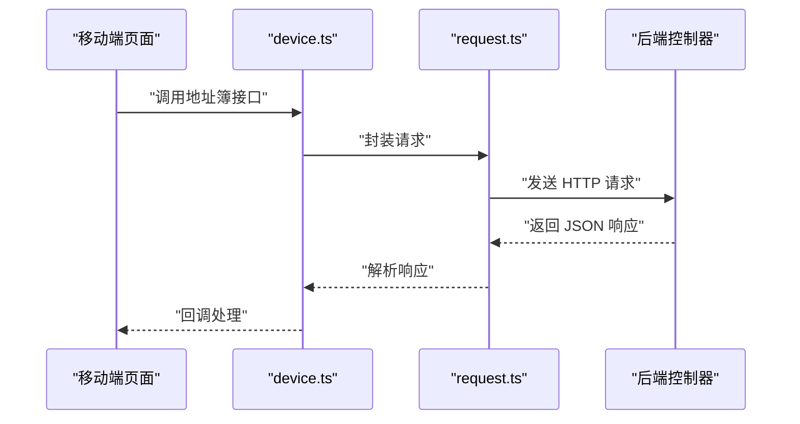

图表来源
- [device.ts](file://main/manager-mobile/src/api/device/device.ts)
- [request.ts](file://main/manager-mobile/src/utils/request.ts)

章节来源
- [device.ts](file://main/manager-mobile/src/api/device/device.ts)
- [request.ts](file://main/manager-mobile/src/utils/request.ts)

## 依赖关系分析
- 控制器依赖服务层，服务层依赖数据访问层，数据访问层依赖实体模型。
- 前端 Web 与移动端分别通过各自的 API 封装调用后端控制器。
- 无循环依赖，层次清晰，便于扩展与维护。

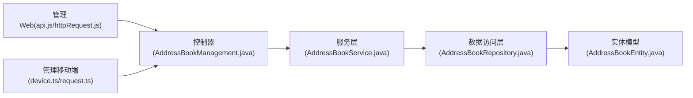

图表来源
- [api.js](file://main/manager-web/src/apis/api.js)
- [httpRequest.js](file://main/manager-web/src/apis/httpRequest.js)
- [device.ts](file://main/manager-mobile/src/api/device/device.ts)
- [request.ts](file://main/manager-mobile/src/utils/request.ts)
- [AddressBookManagement.java](file://main/manager-api/src/main/java/xiaozhi/controller/AddressBookManagement.java)
- [AddressBookService.java](file://main/manager-api/src/main/java/xiaozhi/service/AddressBookService.java)
- [AddressBookRepository.java](file://main/manager-api/src/main/java/xiaozhi/repository/AddressBookRepository.java)
- [AddressBookEntity.java](file://main/manager-api/src/main/java/xiaozhi/entity/AddressBookEntity.java)

章节来源
- [api.js](file://main/manager-web/src/apis/api.js)
- [httpRequest.js](file://main/manager-web/src/apis/httpRequest.js)
- [device.ts](file://main/manager-mobile/src/api/device/device.ts)
- [request.ts](file://main/manager-mobile/src/utils/request.ts)
- [AddressBookManagement.java](file://main/manager-api/src/main/java/xiaozhi/controller/AddressBookManagement.java)
- [AddressBookService.java](file://main/manager-api/src/main/java/xiaozhi/service/AddressBookService.java)
- [AddressBookRepository.java](file://main/manager-api/src/main/java/xiaozhi/repository/AddressBookRepository.java)
- [AddressBookEntity.java](file://main/manager-api/src/main/java/xiaozhi/entity/AddressBookEntity.java)

## 性能考虑
- 分页与限流：列表接口默认分页，避免一次性加载大量数据；对高频接口实施限流。
- 索引优化：对 device_id、group_id、name/alias 建立合适索引，提升查询效率。
- 批量操作：导入导出使用批量插入/更新，减少数据库往返次数。
- 缓存策略：热点数据（如分组列表、权限映射）可引入缓存层降低数据库压力。
- 异步处理：耗时操作（如大规模导入）采用异步任务与进度反馈。
- 连接池与线程池：合理配置数据库连接池与线程池，避免资源耗尽。

[本节为通用性能建议，不直接分析具体文件]

## 故障排查指南
- 常见错误：
  - 参数缺失或格式错误：检查请求体字段与类型
  - 权限不足：确认当前用户角色与目标资源的权限关系
  - 数据冲突：别名或分组名称重复导致冲突，需遵循冲突解决策略
- 日志定位：
  - 前端：查看浏览器开发者工具的网络面板与控制台日志
  - 后端：查看服务日志中的异常堆栈与 SQL 执行记录
- 调试步骤：
  - 复现问题并捕获请求/响应
  - 检查数据库状态与索引使用情况
  - 逐步缩小范围至具体接口或服务方法

章节来源
- [AddressBookManagement.java](file://main/manager-api/src/main/java/xiaozhi/controller/AddressBookManagement.java)
- [AddressBookService.java](file://main/manager-api/src/main/java/xiaozhi/service/AddressBookService.java)

## 结论
本 API 文档围绕设备地址簿管理的别名设置、权限管理与分组管理展开，提供了清晰的接口定义、数据模型与流程图示。通过分层架构与标准化响应结构，确保了系统的可维护性与可扩展性。结合批量导入导出与同步机制，满足实际业务场景需求。建议在部署与使用过程中关注性能优化与故障排查，以提升用户体验与系统稳定性。

[本节为总结性内容，不直接分析具体文件]

## 附录
- 请求与响应示例（字段描述）：
  - 别名设置请求：{device_id, name, alias}
  - 权限授予请求：{device_id, name, role/user_id, permission_type}
  - 分组成员更新请求：{group_id, members[]}
  - 批量导入请求：multipart/form-data，含文件与设备标识
  - 批量导出请求：query 参数含设备标识与过滤条件
- 权限继承与冲突解决：
  - 继承规则：子组继承父组权限，个人权限优先级高于组权限
  - 冲突解决：以最新写入为准或按角色优先级合并，具体策略在服务层实现

[本节为补充说明，不直接分析具体文件]