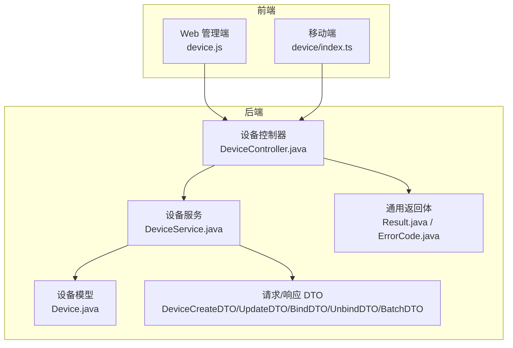
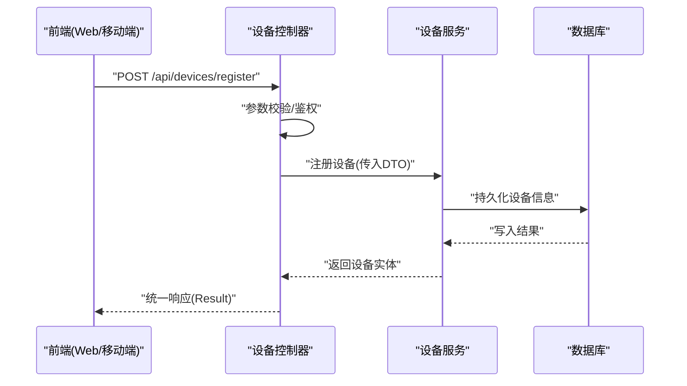
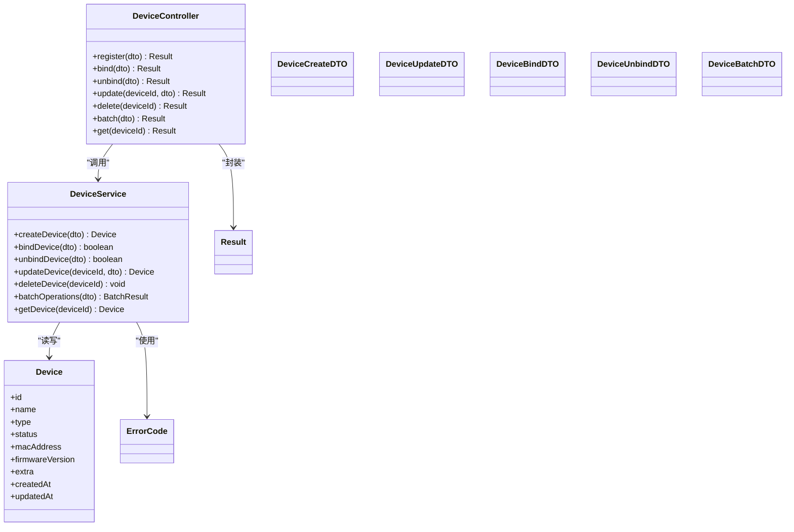

# 设备基础管理 API

<cite>
**本文档引用的文件**   
- [manager-api/src/main/java/xiaozhi/controller/DeviceController.java](file://main/manager-api/src/main/java/xiaozhi/controller/DeviceController.java)
- [manager-api/src/main/java/xiaozhi/service/DeviceService.java](file://main/manager-api/src/main/java/xiaozhi/service/DeviceService.java)
- [manager-api/src/main/java/xiaozhi/model/Device.java](file://main/manager-api/src/main/java/xiaozhi/model/Device.java)
- [manager-api/src/main/java/xiaozhi/dto/DeviceCreateDTO.java](file://main/manager-api/src/main/java/xiaozhi/dto/DeviceCreateDTO.java)
- [manager-api/src/main/java/xiaozhi/dto/DeviceUpdateDTO.java](file://main/manager-api/src/main/java/xiaozhi/dto/DeviceUpdateDTO.java)
- [manager-api/src/main/java/xiaozhi/dto/DeviceBindDTO.java](file://main/manager-api/src/main/java/xiaozhi/dto/DeviceBindDTO.java)
- [manager-api/src/main/java/xiaozhi/dto/DeviceUnbindDTO.java](file://main/manager-api/src/main/java/xiaozhi/dto/DeviceUnbindDTO.java)
- [manager-api/src/main/java/xiaozhi/dto/DeviceBatchDTO.java](file://main/manager-api/src/main/java/xiaozhi/dto/DeviceBatchDTO.java)
- [manager-api/src/main/java/xiaozhi/common/Result.java](file://main/manager-api/src/main/java/xiaozhi/common/Result.java)
- [manager-api/src/main/java/xiaozhi/common/ErrorCode.java](file://main/manager-api/src/main/java/xiaozhi/common/ErrorCode.java)
- [manager-web/src/apis/module/device.js](file://main/manager-web/src/apis/module/device.js)
- [manager-mobile/src/api/device/index.ts](file://main/manager-mobile/src/api/device/index.ts)
</cite>

## 目录
1. [简介](#简介)
2. [项目结构](#项目结构)
3. [核心组件](#核心组件)
4. [架构总览](#架构总览)
5. [详细接口说明](#详细接口说明)
6. [依赖关系分析](#依赖关系分析)
7. [性能考虑](#性能考虑)
8. [故障排查指南](#故障排查指南)
9. [结论](#结论)
10. [附录](#附录)

## 简介
本文件为“设备基础管理”功能的 RESTful API 文档，覆盖设备注册、绑定、解绑、更新、删除等核心能力，并给出请求路径、HTTP 方法、参数与响应格式、错误处理与数据校验规则。同时提供批量操作接口与性能优化建议，帮助前后端快速集成与稳定运行。

## 项目结构
后端采用 Java（Spring Boot）分层架构：控制器层暴露 REST 接口，服务层实现业务逻辑，模型与 DTO 承载数据结构；前端包含 Web 管理端与移动端，分别通过统一 HTTP 客户端调用后端接口。

图表来源
- [manager-api/src/main/java/xiaozhi/controller/DeviceController.java](file://main/manager-api/src/main/java/xiaozhi/controller/DeviceController.java)
- [manager-api/src/main/java/xiaozhi/service/DeviceService.java](file://main/manager-api/src/main/java/xiaozhi/service/DeviceService.java)
- [manager-api/src/main/java/xiaozhi/model/Device.java](file://main/manager-api/src/main/java/xiaozhi/model/Device.java)
- [manager-api/src/main/java/xiaozhi/dto/DeviceCreateDTO.java](file://main/manager-api/src/main/java/xiaozhi/dto/DeviceCreateDTO.java)
- [manager-api/src/main/java/xiaozhi/dto/DeviceUpdateDTO.java](file://main/manager-api/src/main/java/xiaozhi/dto/DeviceUpdateDTO.java)
- [manager-api/src/main/java/xiaozhi/dto/DeviceBindDTO.java](file://main/manager-api/src/main/java/xiaozhi/dto/DeviceBindDTO.java)
- [manager-api/src/main/java/xiaozhi/dto/DeviceUnbindDTO.java](file://main/manager-api/src/main/java/xiaozhi/dto/DeviceUnbindDTO.java)
- [manager-api/src/main/java/xiaozhi/dto/DeviceBatchDTO.java](file://main/manager-api/src/main/java/xiaozhi/dto/DeviceBatchDTO.java)
- [manager-api/src/main/java/xiaozhi/common/Result.java](file://main/manager-api/src/main/java/xiaozhi/common/Result.java)
- [manager-api/src/main/java/xiaozhi/common/ErrorCode.java](file://main/manager-api/src/main/java/xiaozhi/common/ErrorCode.java)
- [manager-web/src/apis/module/device.js](file://main/manager-web/src/apis/module/device.js)
- [manager-mobile/src/api/device/index.ts](file://main/manager-mobile/src/api/device/index.ts)

章节来源
- [manager-api/src/main/java/xiaozhi/controller/DeviceController.java](file://main/manager-api/src/main/java/xiaozhi/controller/DeviceController.java)
- [manager-api/src/main/java/xiaozhi/service/DeviceService.java](file://main/manager-api/src/main/java/xiaozhi/service/DeviceService.java)
- [manager-api/src/main/java/xiaozhi/model/Device.java](file://main/manager-api/src/main/java/xiaozhi/model/Device.java)
- [manager-api/src/main/java/xiaozhi/dto/DeviceCreateDTO.java](file://main/manager-api/src/main/java/xiaozhi/dto/DeviceCreateDTO.java)
- [manager-api/src/main/java/xiaozhi/dto/DeviceUpdateDTO.java](file://main/manager-api/src/main/java/xiaozhi/dto/DeviceUpdateDTO.java)
- [manager-api/src/main/java/xiaozhi/dto/DeviceBindDTO.java](file://main/manager-api/src/main/java/xiaozhi/dto/DeviceBindDTO.java)
- [manager-api/src/main/java/xiaozhi/dto/DeviceUnbindDTO.java](file://main/manager-api/src/main/java/xiaozhi/dto/DeviceUnbindDTO.java)
- [manager-api/src/main/java/xiaozhi/dto/DeviceBatchDTO.java](file://main/manager-api/src/main/java/xiaozhi/dto/DeviceBatchDTO.java)
- [manager-api/src/main/java/xiaozhi/common/Result.java](file://main/manager-api/src/main/java/xiaozhi/common/Result.java)
- [manager-api/src/main/java/xiaozhi/common/ErrorCode.java](file://main/manager-api/src/main/java/xiaozhi/common/ErrorCode.java)
- [manager-web/src/apis/module/device.js](file://main/manager-web/src/apis/module/device.js)
- [manager-mobile/src/api/device/index.ts](file://main/manager-mobile/src/api/device/index.ts)

## 核心组件
- 控制器层：定义设备相关 REST 路由，负责参数校验、权限检查、调用服务层并封装统一响应。
- 服务层：实现设备注册、绑定、解绑、更新、删除、批量操作等业务逻辑，处理状态流转与异常。
- 数据模型：设备实体字段、枚举状态、时间戳等。
- DTO：用于接收请求参数与返回数据的结构化对象。
- 通用返回体：统一成功/失败结构与错误码。

章节来源
- [manager-api/src/main/java/xiaozhi/controller/DeviceController.java](file://main/manager-api/src/main/java/xiaozhi/controller/DeviceController.java)
- [manager-api/src/main/java/xiaozhi/service/DeviceService.java](file://main/manager-api/src/main/java/xiaozhi/service/DeviceService.java)
- [manager-api/src/main/java/xiaozhi/model/Device.java](file://main/manager-api/src/main/java/xiaozhi/model/Device.java)
- [manager-api/src/main/java/xiaozhi/dto/DeviceCreateDTO.java](file://main/manager-api/src/main/java/xiaozhi/dto/DeviceCreateDTO.java)
- [manager-api/src/main/java/xiaozhi/dto/DeviceUpdateDTO.java](file://main/manager-api/src/main/java/xiaozhi/dto/DeviceUpdateDTO.java)
- [manager-api/src/main/java/xiaozhi/dto/DeviceBindDTO.java](file://main/manager-api/src/main/java/xiaozhi/dto/DeviceBindDTO.java)
- [manager-api/src/main/java/xiaozhi/dto/DeviceUnbindDTO.java](file://main/manager-api/src/main/java/xiaozhi/dto/DeviceUnbindDTO.java)
- [manager-api/src/main/java/xiaozhi/dto/DeviceBatchDTO.java](file://main/manager-api/src/main/java/xiaozhi/dto/DeviceBatchDTO.java)
- [manager-api/src/main/java/xiaozhi/common/Result.java](file://main/manager-api/src/main/java/xiaozhi/common/Result.java)
- [manager-api/src/main/java/xiaozhi/common/ErrorCode.java](file://main/manager-api/src/main/java/xiaozhi/common/ErrorCode.java)

## 架构总览
设备管理 API 的请求链路遵循标准 MVC 模式：前端发起 HTTP 请求至控制器，控制器进行入参校验与鉴权后交由服务层执行业务逻辑，服务层读写设备模型并通过统一返回体封装结果。

图表来源
- [manager-api/src/main/java/xiaozhi/controller/DeviceController.java](file://main/manager-api/src/main/java/xiaozhi/controller/DeviceController.java)
- [manager-api/src/main/java/xiaozhi/service/DeviceService.java](file://main/manager-api/src/main/java/xiaozhi/service/DeviceService.java)
- [manager-api/src/main/java/xiaozhi/model/Device.java](file://main/manager-api/src/main/java/xiaozhi/model/Device.java)
- [manager-api/src/main/java/xiaozhi/common/Result.java](file://main/manager-api/src/main/java/xiaozhi/common/Result.java)

## 详细接口说明

### 公共约定
- 基础路径：/api/devices
- 认证方式：在请求头携带 Token（示例：Authorization: Bearer <token>）
- 统一响应体：Result<T>
  - code：业务错误码（数字）
  - message：提示信息
  - data：业务数据（可为对象或数组）
- 常见错误码：见 ErrorCode 定义

章节来源
- [manager-api/src/main/java/xiaozhi/common/Result.java](file://main/manager-api/src/main/java/xiaozhi/common/Result.java)
- [manager-api/src/main/java/xiaozhi/common/ErrorCode.java](file://main/manager-api/src/main/java/xiaozhi/common/ErrorCode.java)

### 设备注册
- URL：POST /api/devices/register
- 描述：新增一台设备并完成初始注册
- 请求体：DeviceCreateDTO
  - deviceName：设备名称（必填，长度限制由服务端校验）
  - deviceType：设备类型（必填，枚举值由服务端定义）
  - macAddress：MAC 地址（可选，唯一性约束）
  - firmwareVersion：固件版本（可选）
  - extra：扩展字段（可选，JSON）
- 响应体：Result<Device>
- 错误处理：
  - 参数缺失或格式错误：返回对应错误码与提示
  - MAC 重复：返回冲突错误码
- 示例
  - 请求示例
    - Content-Type: application/json
    - Authorization: Bearer <token>
    - Body: { "deviceName": "客厅音箱", "deviceType": "speaker", "macAddress": "AA:BB:CC:DD:EE:FF", "firmwareVersion": "v1.2.3" }
  - 响应示例
    - { "code": 0, "message": "success", "data": { "id": "d1", "name": "客厅音箱", "type": "speaker", "status": "registered", "createdAt": "2024-01-01T00:00:00Z" } }

章节来源
- [manager-api/src/main/java/xiaozhi/controller/DeviceController.java](file://main/manager-api/src/main/java/xiaozhi/controller/DeviceController.java)
- [manager-api/src/main/java/xiaozhi/dto/DeviceCreateDTO.java](file://main/manager-api/src/main/java/xiaozhi/dto/DeviceCreateDTO.java)
- [manager-api/src/main/java/xiaozhi/model/Device.java](file://main/manager-api/src/main/java/xiaozhi/model/Device.java)
- [manager-api/src/main/java/xiaozhi/common/Result.java](file://main/manager-api/src/main/java/xiaozhi/common/Result.java)

### 设备绑定
- URL：POST /api/devices/bind
- 描述：将已注册设备绑定到指定用户或租户
- 请求体：DeviceBindDTO
  - deviceId：设备ID（必填）
  - userId：用户ID（必填）
  - bindSource：绑定来源（可选，如扫码、手动输入）
- 响应体：Result<Boolean>
- 错误处理：
  - 设备不存在：返回未找到错误码
  - 设备已被其他用户绑定：返回冲突错误码
- 示例
  - 请求示例
    - Body: { "deviceId": "d1", "userId": "u1", "bindSource": "scan" }
  - 响应示例
    - { "code": 0, "message": "success", "data": true }

章节来源
- [manager-api/src/main/java/xiaozhi/controller/DeviceController.java](file://main/manager-api/src/main/java/xiaozhi/controller/DeviceController.java)
- [manager-api/src/main/java/xiaozhi/dto/DeviceBindDTO.java](file://main/manager-api/src/main/java/xiaozhi/dto/DeviceBindDTO.java)
- [manager-api/src/main/java/xiaozhi/common/Result.java](file://main/manager-api/src/main/java/xiaozhi/common/Result.java)

### 设备解绑
- URL：POST /api/devices/unbind
- 描述：解除设备与用户的绑定关系
- 请求体：DeviceUnbindDTO
  - deviceId：设备ID（必填）
  - userId：用户ID（必填）
- 响应体：Result<Boolean>
- 错误处理：
  - 绑定关系不存在：返回未找到错误码
  - 非绑定人操作：返回权限错误码
- 示例
  - 请求示例
    - Body: { "deviceId": "d1", "userId": "u1" }
  - 响应示例
    - { "code": 0, "message": "success", "data": true }

章节来源
- [manager-api/src/main/java/xiaozhi/controller/DeviceController.java](file://main/manager-api/src/main/java/xiaozhi/controller/DeviceController.java)
- [manager-api/src/main/java/xiaozhi/dto/DeviceUnbindDTO.java](file://main/manager-api/src/main/java/xiaozhi/dto/DeviceUnbindDTO.java)
- [manager-api/src/main/java/xiaozhi/common/Result.java](file://main/manager-api/src/main/java/xiaozhi/common/Result.java)

### 设备更新
- URL：PUT /api/devices/{deviceId}
- 描述：更新设备基本信息与配置
- 路径参数：deviceId（必填）
- 请求体：DeviceUpdateDTO
  - deviceName：设备名称（可选）
  - firmwareVersion：固件版本（可选）
  - extra：扩展字段（可选，JSON）
- 响应体：Result<Device>
- 错误处理：
  - 设备不存在：返回未找到错误码
  - 参数非法：返回参数错误码
- 示例
  - 请求示例
    - PUT /api/devices/d1
    - Body: { "deviceName": "卧室音箱", "firmwareVersion": "v1.3.0" }
  - 响应示例
    - { "code": 0, "message": "success", "data": { "id": "d1", "name": "卧室音箱", "type": "speaker", "status": "bound", "updatedAt": "2024-01-02T00:00:00Z" } }

章节来源
- [manager-api/src/main/java/xiaozhi/controller/DeviceController.java](file://main/manager-api/src/main/java/xiaozhi/controller/DeviceController.java)
- [manager-api/src/main/java/xiaozhi/dto/DeviceUpdateDTO.java](file://main/manager-api/src/main/java/xiaozhi/dto/DeviceUpdateDTO.java)
- [manager-api/src/main/java/xiaozhi/model/Device.java](file://main/manager-api/src/main/java/xiaozhi/model/Device.java)
- [manager-api/src/main/java/xiaozhi/common/Result.java](file://main/manager-api/src/main/java/xiaozhi/common/Result.java)

### 设备删除
- URL：DELETE /api/devices/{deviceId}
- 描述：删除设备记录（含绑定关系清理）
- 路径参数：deviceId（必填）
- 响应体：Result<Void>
- 错误处理：
  - 设备不存在：返回未找到错误码
  - 权限不足：返回权限错误码
- 示例
  - 请求示例
    - DELETE /api/devices/d1
  - 响应示例
    - { "code": 0, "message": "success", "data": null }

章节来源
- [manager-api/src/main/java/xiaozhi/controller/DeviceController.java](file://main/manager-api/src/main/java/xiaozhi/controller/DeviceController.java)
- [manager-api/src/main/java/xiaozhi/common/Result.java](file://main/manager-api/src/main/java/xiaozhi/common/Result.java)

### 批量操作
- URL：POST /api/devices/batch
- 描述：批量执行设备操作（注册、绑定、解绑、更新、删除）
- 请求体：DeviceBatchDTO
  - operations：操作列表（必填）
    - type：操作类型（register/bind/unbind/update/delete，必填）
    - payload：具体操作参数（根据 type 不同而不同）
- 响应体：Result<BatchResult>
  - successCount：成功数量
  - failedCount：失败数量
  - errors：失败明细（错误项索引与原因）
- 错误处理：
  - 部分失败不影响整体成功，返回明细
  - 参数非法：返回参数错误码
- 示例
  - 请求示例
    - Body: {
        "operations": [
          { "type": "register", "payload": { "deviceName": "厨房音箱", "deviceType": "speaker", "macAddress": "11:22:33:44:55:66" } },
          { "type": "bind", "payload": { "deviceId": "d2", "userId": "u1" } }
        ]
      }
  - 响应示例
    - { "code": 0, "message": "success", "data": { "successCount": 2, "failedCount": 0, "errors": [] } }

章节来源
- [manager-api/src/main/java/xiaozhi/controller/DeviceController.java](file://main/manager-api/src/main/java/xiaozhi/controller/DeviceController.java)
- [manager-api/src/main/java/xiaozhi/dto/DeviceBatchDTO.java](file://main/manager-api/src/main/java/xiaozhi/dto/DeviceBatchDTO.java)
- [manager-api/src/main/java/xiaozhi/common/Result.java](file://main/manager-api/src/main/java/xiaozhi/common/Result.java)

### 设备信息查询（补充）
- URL：GET /api/devices/{deviceId}
- 描述：获取设备详情
- 路径参数：deviceId（必填）
- 响应体：Result<Device>
- 错误处理：设备不存在时返回未找到错误码

章节来源
- [manager-api/src/main/java/xiaozhi/controller/DeviceController.java](file://main/manager-api/src/main/java/xiaozhi/controller/DeviceController.java)
- [manager-api/src/main/java/xiaozhi/model/Device.java](file://main/manager-api/src/main/java/xiaozhi/model/Device.java)
- [manager-api/src/main/java/xiaozhi/common/Result.java](file://main/manager-api/src/main/java/xiaozhi/common/Result.java)

## 依赖关系分析
设备管理模块的类与依赖关系如下：

图表来源
- [manager-api/src/main/java/xiaozhi/controller/DeviceController.java](file://main/manager-api/src/main/java/xiaozhi/controller/DeviceController.java)
- [manager-api/src/main/java/xiaozhi/service/DeviceService.java](file://main/manager-api/src/main/java/xiaozhi/service/DeviceService.java)
- [manager-api/src/main/java/xiaozhi/model/Device.java](file://main/manager-api/src/main/java/xiaozhi/model/Device.java)
- [manager-api/src/main/java/xiaozhi/dto/DeviceCreateDTO.java](file://main/manager-api/src/main/java/xiaozhi/dto/DeviceCreateDTO.java)
- [manager-api/src/main/java/xiaozhi/dto/DeviceUpdateDTO.java](file://main/manager-api/src/main/java/xiaozhi/dto/DeviceUpdateDTO.java)
- [manager-api/src/main/java/xiaozhi/dto/DeviceBindDTO.java](file://main/manager-api/src/main/java/xiaozhi/dto/DeviceBindDTO.java)
- [manager-api/src/main/java/xiaozhi/dto/DeviceUnbindDTO.java](file://main/manager-api/src/main/java/xiaozhi/dto/DeviceUnbindDTO.java)
- [manager-api/src/main/java/xiaozhi/dto/DeviceBatchDTO.java](file://main/manager-api/src/main/java/xiaozhi/dto/DeviceBatchDTO.java)
- [manager-api/src/main/java/xiaozhi/common/Result.java](file://main/manager-api/src/main/java/xiaozhi/common/Result.java)
- [manager-api/src/main/java/xiaozhi/common/ErrorCode.java](file://main/manager-api/src/main/java/xiaozhi/common/ErrorCode.java)

## 性能考虑
- 批量接口优先：对大规模设备操作建议使用批量接口，减少网络往返与事务开销。
- 幂等性设计：注册与绑定接口应具备幂等性，避免重复提交导致的数据不一致。
- 分页与过滤：查询接口应支持分页与条件过滤，降低单次响应体积。
- 缓存策略：热点设备信息可引入缓存（如 Redis），提高读取性能。
- 异步处理：耗时操作（如批量导入）可采用异步任务与回调通知。
- 连接池与超时：合理设置数据库连接池与 HTTP 超时，避免资源耗尽。

[本节为通用指导，不直接分析具体文件]

## 故障排查指南
- 常见问题
  - 参数校验失败：检查请求体字段是否齐全、类型是否符合要求。
  - 设备不存在：确认 deviceId 是否正确，是否存在软删除或权限隔离。
  - 绑定冲突：确认设备未被其他用户绑定，或先解绑再绑定。
  - 权限不足：检查 Token 是否有效、是否具备相应角色或租户权限。
- 定位步骤
  - 查看统一响应体的 code 与 message，对照错误码表定位问题。
  - 开启调试日志，追踪控制器与服务层的调用链。
  - 核对数据库记录与缓存一致性。
- 重试与降级
  - 对网络抖动导致的失败进行指数退避重试。
  - 关键路径增加降级策略（如只读缓存）。

章节来源
- [manager-api/src/main/java/xiaozhi/common/ErrorCode.java](file://main/manager-api/src/main/java/xiaozhi/common/ErrorCode.java)
- [manager-api/src/main/java/xiaozhi/common/Result.java](file://main/manager-api/src/main/java/xiaozhi/common/Result.java)

## 结论
本 API 文档围绕设备注册、绑定、解绑、更新、删除与批量操作提供了完整的接口规范、数据模型与错误处理机制。通过统一的返回体与错误码体系，确保前后端协作一致性与稳定性。结合性能优化建议与故障排查指南，可有效提升系统可用性与开发效率。

[本节为总结，不直接分析具体文件]

## 附录

### 设备状态管理
- 状态枚举
  - registered：已注册未绑定
  - bound：已绑定
  - offline：离线
  - error：异常
- 状态流转
  - 注册后为 registered
  - 绑定成功后转为 bound
  - 心跳检测或上报状态可更新为 offline/error
  - 修复后可恢复为 bound

章节来源
- [manager-api/src/main/java/xiaozhi/model/Device.java](file://main/manager-api/src/main/java/xiaozhi/model/Device.java)

### 权限控制
- 鉴权方式：基于 Token 的访问控制
- 资源级权限：仅允许设备所有者或管理员执行绑定、解绑、更新、删除等操作
- 租户隔离：多租户场景下按租户维度隔离设备数据

章节来源
- [manager-api/src/main/java/xiaozhi/controller/DeviceController.java](file://main/manager-api/src/main/java/xiaozhi/controller/DeviceController.java)
- [manager-api/src/main/java/xiaozhi/common/ErrorCode.java](file://main/manager-api/src/main/java/xiaozhi/common/ErrorCode.java)

### 数据验证规则
- 必填字段校验：如 deviceId、userId、deviceType 等
- 格式校验：MAC 地址、版本号、邮箱等格式
- 唯一性校验：MAC 地址全局唯一
- 长度与范围：字符串长度、枚举值范围

章节来源
- [manager-api/src/main/java/xiaozhi/dto/DeviceCreateDTO.java](file://main/manager-api/src/main/java/xiaozhi/dto/DeviceCreateDTO.java)
- [manager-api/src/main/java/xiaozhi/dto/DeviceUpdateDTO.java](file://main/manager-api/src/main/java/xiaozhi/dto/DeviceUpdateDTO.java)
- [manager-api/src/main/java/xiaozhi/dto/DeviceBindDTO.java](file://main/manager-api/src/main/java/xiaozhi/dto/DeviceBindDTO.java)
- [manager-api/src/main/java/xiaozhi/dto/DeviceUnbindDTO.java](file://main/manager-api/src/main/java/xiaozhi/dto/DeviceUnbindDTO.java)
- [manager-api/src/main/java/xiaozhi/dto/DeviceBatchDTO.java](file://main/manager-api/src/main/java/xiaozhi/dto/DeviceBatchDTO.java)

### 前端调用参考
- Web 管理端：通过 device.js 调用设备相关接口
- 移动端：通过 device/index.ts 调用设备相关接口

章节来源
- [manager-web/src/apis/module/device.js](file://main/manager-web/src/apis/module/device.js)
- [manager-mobile/src/api/device/index.ts](file://main/manager-mobile/src/api/device/index.ts)