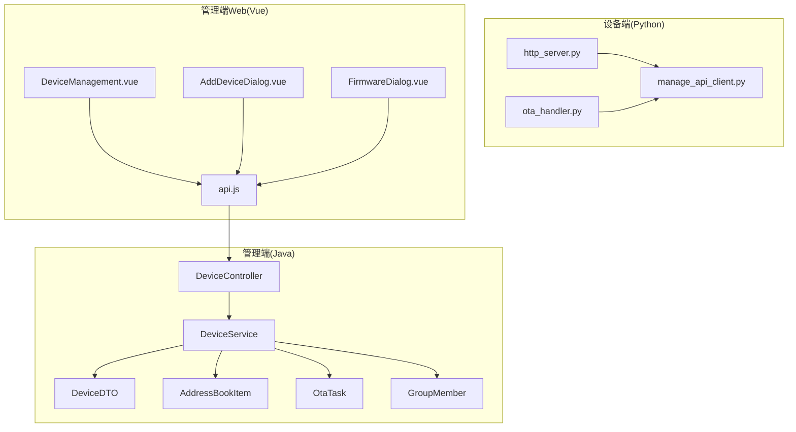
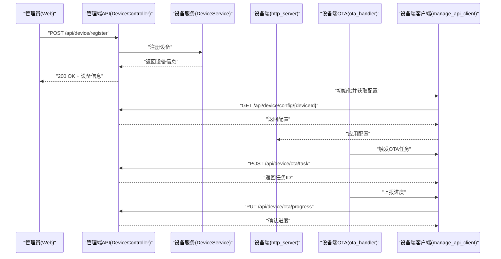
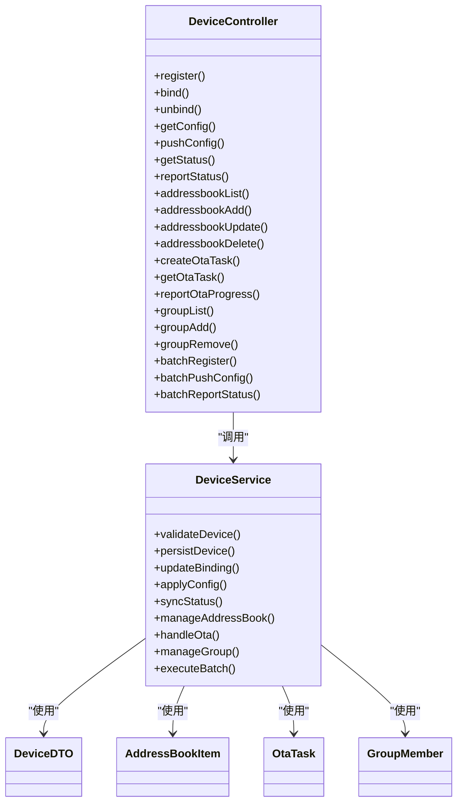

# 设备管理 API

<cite>
**本文引用的文件**   
- [manager-api/src/main/java/xiaozhi/DeviceController.java](file://main/manager-api/src/main/java/xiaozhi/DeviceController.java)
- [manager-api/src/main/java/xiaozhi/service/DeviceService.java](file://main/manager-api/src/main/java/xiaozhi/service/DeviceService.java)
- [manager-api/src/main/java/xiaozhi/model/DeviceDTO.java](file://main/manager-api/src/main/java/xiaozhi/model/DeviceDTO.java)
- [manager-api/src/main/java/xiaozhi/model/AddressBookItem.java](file://main/manager-api/src/main/java/xiaozhi/model/AddressBookItem.java)
- [manager-api/src/main/java/xiaozhi/model/OtaTask.java](file://main/manager-api/src/main/java/xiaozhi/model/OtaTask.java)
- [manager-api/src/main/java/xiaozhi/model/GroupMember.java](file://main/manager-api/src/main/java/xiaozhi/model/GroupMember.java)
- [xiaozhi-server/core/http_server.py](file://main/xiaozhi-server/core/http_server.py)
- [xiaozhi-server/core/api/ota_handler.py](file://main/xiaozhi-server/core/api/ota_handler.py)
- [xiaozhi-server/config/manage_api_client.py](file://main/xiaozhi-server/config/manage_api_client.py)
- [manager-web/src/views/DeviceManagement.vue](file://main/manager-web/src/views/DeviceManagement.vue)
- [manager-web/src/components/AddDeviceDialog.vue](file://main/manager-web/src/components/AddDeviceDialog.vue)
- [manager-web/src/components/FirmwareDialog.vue](file://main/manager-web/src/components/FirmwareDialog.vue)
- [manager-web/src/apis/api.js](file://main/manager-web/src/apis/api.js)
</cite>

## 目录
1. [简介](#简介)
2. [项目结构](#项目结构)
3. [核心组件](#核心组件)
4. [架构总览](#架构总览)
5. [详细组件分析](#详细组件分析)
6. [依赖分析](#依赖分析)
7. [性能考虑](#性能考虑)
8. [故障排查指南](#故障排查指南)
9. [结论](#结论)
10. [附录](#附录)

## 简介
本文件为“设备管理模块”的 RESTful API 文档，覆盖设备注册、绑定、解绑、配置更新、状态查询、地址簿管理、OTA 升级与设备分组等能力。文档面向后端开发者、前端集成方与运维人员，提供接口路径、HTTP 方法、请求参数、响应格式、示例、错误码与批量操作建议，并给出性能优化与排错指引。

## 项目结构
设备管理相关代码主要分布在以下位置：
- 管理端 API（Java）：控制器、服务层与数据模型
- 设备端 HTTP 服务（Python）：设备侧 HTTP 入口与 OTA 处理
- 管理端 Web（Vue）：设备管理页面与对话框组件
- 设备到管理端的客户端封装（Python）：用于设备主动调用管理端 API

图表来源
- [manager-api/src/main/java/xiaozhi/DeviceController.java](file://main/manager-api/src/main/java/xiaozhi/DeviceController.java)
- [manager-api/src/main/java/xiaozhi/service/DeviceService.java](file://main/manager-api/src/main/java/xiaozhi/service/DeviceService.java)
- [manager-api/src/main/java/xiaozhi/model/DeviceDTO.java](file://main/manager-api/src/main/java/xiaozhi/model/DeviceDTO.java)
- [manager-api/src/main/java/xiaozhi/model/AddressBookItem.java](file://main/manager-api/src/main/java/xiaozhi/model/AddressBookItem.java)
- [manager-api/src/main/java/xiaozhi/model/OtaTask.java](file://main/manager-api/src/main/java/xiaozhi/model/OtaTask.java)
- [manager-api/src/main/java/xiaozhi/model/GroupMember.java](file://main/manager-api/src/main/java/xiaozhi/model/GroupMember.java)
- [xiaozhi-server/core/http_server.py](file://main/xiaozhi-server/core/http_server.py)
- [xiaozhi-server/core/api/ota_handler.py](file://main/xiaozhi-server/core/api/ota_handler.py)
- [xiaozhi-server/config/manage_api_client.py](file://main/xiaozhi-server/config/manage_api_client.py)
- [manager-web/src/views/DeviceManagement.vue](file://main/manager-web/src/views/DeviceManagement.vue)
- [manager-web/src/components/AddDeviceDialog.vue](file://main/manager-web/src/components/AddDeviceDialog.vue)
- [manager-web/src/components/FirmwareDialog.vue](file://main/manager-web/src/components/FirmwareDialog.vue)
- [manager-web/src/apis/api.js](file://main/manager-web/src/apis/api.js)

章节来源
- [manager-api/src/main/java/xiaozhi/DeviceController.java](file://main/manager-api/src/main/java/xiaozhi/DeviceController.java)
- [manager-api/src/main/java/xiaozhi/service/DeviceService.java](file://main/manager-api/src/main/java/xiaozhi/service/DeviceService.java)
- [manager-api/src/main/java/xiaozhi/model/DeviceDTO.java](file://main/manager-api/src/main/java/xiaozhi/model/DeviceDTO.java)
- [manager-api/src/main/java/xiaozhi/model/AddressBookItem.java](file://main/manager-api/src/main/java/xiaozhi/model/AddressBookItem.java)
- [manager-api/src/main/java/xiaozhi/model/OtaTask.java](file://main/manager-api/src/main/java/xiaozhi/model/OtaTask.java)
- [manager-api/src/main/java/xiaozhi/model/GroupMember.java](file://main/manager-api/src/main/java/xiaozhi/model/GroupMember.java)
- [xiaozhi-server/core/http_server.py](file://main/xiaozhi-server/core/http_server.py)
- [xiaozhi-server/core/api/ota_handler.py](file://main/xiaozhi-server/core/api/ota_handler.py)
- [xiaozhi-server/config/manage_api_client.py](file://main/xiaozhi-server/config/manage_api_client.py)
- [manager-web/src/views/DeviceManagement.vue](file://main/manager-web/src/views/DeviceManagement.vue)
- [manager-web/src/components/AddDeviceDialog.vue](file://main/manager-web/src/components/AddDeviceDialog.vue)
- [manager-web/src/components/FirmwareDialog.vue](file://main/manager-web/src/components/FirmwareDialog.vue)
- [manager-web/src/apis/api.js](file://main/manager-web/src/apis/api.js)

## 核心组件
- DeviceController：对外暴露设备管理的 REST 接口，统一接收请求并返回标准响应体
- DeviceService：业务编排与校验，协调设备注册、绑定、解绑、配置更新、状态查询、地址簿、OTA、分组等操作
- 数据模型：DeviceDTO、AddressBookItem、OtaTask、GroupMember 等，承载请求与响应的数据结构
- 设备端 http_server：设备侧 HTTP 服务，负责上报状态、拉取配置、发起 OTA 下载等
- ota_handler：设备端 OTA 流程处理器，对接管理端下发任务与进度上报
- manage_api_client：设备端调用管理端 API 的客户端封装
- 管理端 Web：设备管理页面与对话框组件，驱动管理端 API 调用

章节来源
- [manager-api/src/main/java/xiaozhi/DeviceController.java](file://main/manager-api/src/main/java/xiaozhi/DeviceController.java)
- [manager-api/src/main/java/xiaozhi/service/DeviceService.java](file://main/manager-api/src/main/java/xiaozhi/service/DeviceService.java)
- [manager-api/src/main/java/xiaozhi/model/DeviceDTO.java](file://main/manager-api/src/main/java/xiaozhi/model/DeviceDTO.java)
- [manager-api/src/main/java/xiaozhi/model/AddressBookItem.java](file://main/manager-api/src/main/java/xiaozhi/model/AddressBookItem.java)
- [manager-api/src/main/java/xiaozhi/model/OtaTask.java](file://main/manager-api/src/main/java/xiaozhi/model/OtaTask.java)
- [manager-api/src/main/java/xiaozhi/model/GroupMember.java](file://main/manager-api/src/main/java/xiaozhi/model/GroupMember.java)
- [xiaozhi-server/core/http_server.py](file://main/xiaozhi-server/core/http_server.py)
- [xiaozhi-server/core/api/ota_handler.py](file://main/xiaozhi-server/core/api/ota_handler.py)
- [xiaozhi-server/config/manage_api_client.py](file://main/xiaozhi-server/config/manage_api_client.py)
- [manager-web/src/views/DeviceManagement.vue](file://main/manager-web/src/views/DeviceManagement.vue)
- [manager-web/src/components/AddDeviceDialog.vue](file://main/manager-web/src/components/AddDeviceDialog.vue)
- [manager-web/src/components/FirmwareDialog.vue](file://main/manager-web/src/components/FirmwareDialog.vue)
- [manager-web/src/apis/api.js](file://main/manager-web/src/apis/api.js)

## 架构总览
设备管理采用“管理端（Java）+ 设备端（Python）+ 管理端 Web（Vue）”的分层架构。管理端通过 REST 接口提供服务；设备端通过 HTTP 与服务端交互，使用 manage_api_client 调用管理端 API；管理端 Web 作为控制台驱动 API 调用。

图表来源
- [manager-api/src/main/java/xiaozhi/DeviceController.java](file://main/manager-api/src/main/java/xiaozhi/DeviceController.java)
- [manager-api/src/main/java/xiaozhi/service/DeviceService.java](file://main/manager-api/src/main/java/xiaozhi/service/DeviceService.java)
- [xiaozhi-server/core/http_server.py](file://main/xiaozhi-server/core/http_server.py)
- [xiaozhi-server/core/api/ota_handler.py](file://main/xiaozhi-server/core/api/ota_handler.py)
- [xiaozhi-server/config/manage_api_client.py](file://main/xiaozhi-server/config/manage_api_client.py)
- [manager-web/src/views/DeviceManagement.vue](file://main/manager-web/src/views/DeviceManagement.vue)
- [manager-web/src/components/AddDeviceDialog.vue](file://main/manager-web/src/components/AddDeviceDialog.vue)
- [manager-web/src/components/FirmwareDialog.vue](file://main/manager-web/src/components/FirmwareDialog.vue)
- [manager-web/src/apis/api.js](file://main/manager-web/src/apis/api.js)

## 详细组件分析

### 设备注册
- 接口
  - URL: /api/device/register
  - 方法: POST
  - 请求体: { device_id, device_name, mac_address, model, firmware_version, extra }
  - 响应体: { code, message, data: DeviceDTO }
- 行为说明
  - 校验设备唯一性（device_id/mac_address）
  - 写入设备基础信息与扩展字段
  - 返回设备完整信息
- 示例
  - 请求示例: {"device_id":"DEV001","device_name":"客厅音箱","mac_address":"AA:BB:CC:DD:EE:FF","model":"ESP32-V1","firmware_version":"1.0.0","extra":{"region":"CN"}}
  - 响应示例: {"code":0,"message":"success","data":{"id":"DEV001","name":"客厅音箱","mac":"AA:BB:CC:DD:EE:FF","model":"ESP32-V1","version":"1.0.0","status":"offline","created_at":"2025-01-01T00:00:00Z"}}
- 错误处理
  - 重复设备: code=400, message="设备已存在"
  - 参数缺失: code=400, message="缺少必填字段"
  - 内部错误: code=500, message="服务器内部错误"

章节来源
- [manager-api/src/main/java/xiaozhi/DeviceController.java](file://main/manager-api/src/main/java/xiaozhi/DeviceController.java)
- [manager-api/src/main/java/xiaozhi/service/DeviceService.java](file://main/manager-api/src/main/java/xiaozhi/service/DeviceService.java)
- [manager-api/src/main/java/xiaozhi/model/DeviceDTO.java](file://main/manager-api/src/main/java/xiaozhi/model/DeviceDTO.java)

### 设备绑定与解绑
- 绑定
  - URL: /api/device/bind
  - 方法: POST
  - 请求体: { device_id, user_id }
  - 响应体: { code, message, data: null }
  - 行为: 将设备与用户关联，更新绑定关系
- 解绑
  - URL: /api/device/unbind
  - 方法: POST
  - 请求体: { device_id, user_id }
  - 响应体: { code, message, data: null }
  - 行为: 解除设备与用户的绑定关系
- 示例
  - 绑定请求: {"device_id":"DEV001","user_id":"U1001"}
  - 解绑请求: {"device_id":"DEV001","user_id":"U1001"}
- 错误处理
  - 设备不存在: code=404, message="设备不存在"
  - 用户不存在: code=404, message="用户不存在"
  - 未绑定/已绑定: code=400, message="操作不合法"

章节来源
- [manager-api/src/main/java/xiaozhi/DeviceController.java](file://main/manager-api/src/main/java/xiaozhi/DeviceController.java)
- [manager-api/src/main/java/xiaozhi/service/DeviceService.java](file://main/manager-api/src/main/java/xiaozhi/service/DeviceService.java)

### 配置更新与拉取
- 拉取配置
  - URL: /api/device/config/{deviceId}
  - 方法: GET
  - 路径参数: deviceId
  - 响应体: { code, message, data: { config_key, config_value, version } }
  - 行为: 返回设备最新配置版本与内容
- 推送配置
  - URL: /api/device/config/push
  - 方法: POST
  - 请求体: { device_id, config_key, config_value, version }
  - 响应体: { code, message, data: null }
  - 行为: 更新设备配置并通知设备端拉取
- 示例
  - 拉取配置: GET /api/device/config/DEV001
  - 推送配置: {"device_id":"DEV001","config_key":"tts_volume","config_value":"80","version":2}
- 错误处理
  - 设备不存在: code=404, message="设备不存在"
  - 版本冲突: code=409, message="配置版本冲突"

章节来源
- [manager-api/src/main/java/xiaozhi/DeviceController.java](file://main/manager-api/src/main/java/xiaozhi/DeviceController.java)
- [manager-api/src/main/java/xiaozhi/service/DeviceService.java](file://main/manager-api/src/main/java/xiaozhi/service/DeviceService.java)
- [xiaozhi-server/core/http_server.py](file://main/xiaozhi-server/core/http_server.py)
- [xiaozhi-server/config/manage_api_client.py](file://main/xiaozhi-server/config/manage_api_client.py)

### 状态查询与同步
- 查询状态
  - URL: /api/device/status/{deviceId}
  - 方法: GET
  - 路径参数: deviceId
  - 响应体: { code, message, data: { status, last_seen, battery, signal, uptime } }
  - 行为: 返回设备在线状态与运行指标
- 上报状态
  - URL: /api/device/status/report
  - 方法: POST
  - 请求体: { device_id, status, last_seen, battery, signal, uptime }
  - 响应体: { code, message, data: null }
  - 行为: 设备端周期性上报状态，服务端持久化并缓存
- 示例
  - 上报状态: {"device_id":"DEV001","status":"online","last_seen":"2025-01-01T12:00:00Z","battery":95,"signal":-45,"uptime":3600}
- 错误处理
  - 设备不存在: code=404, message="设备不存在"
  - 数据非法: code=400, message="状态数据非法"

章节来源
- [manager-api/src/main/java/xiaozhi/DeviceController.java](file://main/manager-api/src/main/java/xiaozhi/DeviceController.java)
- [manager-api/src/main/java/xiaozhi/service/DeviceService.java](file://main/manager-api/src/main/java/xiaozhi/service/DeviceService.java)
- [xiaozhi-server/core/http_server.py](file://main/xiaozhi-server/core/http_server.py)

### 设备地址簿管理
- 列表
  - URL: /api/device/addressbook/list
  - 方法: GET
  - 查询参数: device_id
  - 响应体: { code, message, data: [AddressBookItem] }
- 新增
  - URL: /api/device/addressbook/add
  - 方法: POST
  - 请求体: { device_id, name, phone, email, tags }
  - 响应体: { code, message, data: AddressBookItem }
- 更新
  - URL: /api/device/addressbook/update
  - 方法: PUT
  - 请求体: { id, name, phone, email, tags }
  - 响应体: { code, message, data: AddressBookItem }
- 删除
  - URL: /api/device/addressbook/delete
  - 方法: DELETE
  - 查询参数: id
  - 响应体: { code, message, data: null }
- 示例
  - 新增条目: {"device_id":"DEV001","name":"张三","phone":"13800000000","email":"zhangsan@example.com","tags":["家人"]}
- 错误处理
  - 设备不存在: code=404, message="设备不存在"
  - 重复条目: code=400, message="联系人已存在"

章节来源
- [manager-api/src/main/java/xiaozhi/DeviceController.java](file://main/manager-api/src/main/java/xiaozhi/DeviceController.java)
- [manager-api/src/main/java/xiaozhi/service/DeviceService.java](file://main/manager-api/src/main/java/xiaozhi/service/DeviceService.java)
- [manager-api/src/main/java/xiaozhi/model/AddressBookItem.java](file://main/manager-api/src/main/java/xiaozhi/model/AddressBookItem.java)

### OTA 升级
- 创建任务
  - URL: /api/device/ota/task
  - 方法: POST
  - 请求体: { device_id, firmware_url, version, description, force }
  - 响应体: { code, message, data: OtaTask }
- 查询任务
  - URL: /api/device/ota/task/{taskId}
  - 方法: GET
  - 路径参数: taskId
  - 响应体: { code, message, data: OtaTask }
- 上报进度
  - URL: /api/device/ota/progress
  - 方法: PUT
  - 请求体: { task_id, progress, status, error_message }
  - 响应体: { code, message, data: null }
- 示例
  - 创建任务: {"device_id":"DEV001","firmware_url":"https://cdn.example.com/fw/v1.1.bin","version":"1.1.0","description":"修复连接问题","force":false}
  - 上报进度: {"task_id":"OTA001","progress":60,"status":"downloading","error_message":""}
- 错误处理
  - 任务不存在: code=404, message="任务不存在"
  - 固件无效: code=400, message="固件URL不可用"
  - 权限不足: code=403, message="无OTA权限"

章节来源
- [manager-api/src/main/java/xiaozhi/DeviceController.java](file://main/manager-api/src/main/java/xiaozhi/DeviceController.java)
- [manager-api/src/main/java/xiaozhi/service/DeviceService.java](file://main/manager-api/src/main/java/xiaozhi/service/DeviceService.java)
- [manager-api/src/main/java/xiaozhi/model/OtaTask.java](file://main/manager-api/src/main/java/xiaozhi/model/OtaTask.java)
- [xiaozhi-server/core/api/ota_handler.py](file://main/xiaozhi-server/core/api/ota_handler.py)
- [xiaozhi-server/config/manage_api_client.py](file://main/xiaozhi-server/config/manage_api_client.py)
- [manager-web/src/components/FirmwareDialog.vue](file://main/manager-web/src/components/FirmwareDialog.vue)

### 设备分组
- 列表
  - URL: /api/device/group/list
  - 方法: GET
  - 查询参数: group_id
  - 响应体: { code, message, data: [GroupMember] }
- 新增成员
  - URL: /api/device/group/add
  - 方法: POST
  - 请求体: { group_id, device_id }
  - 响应体: { code, message, data: GroupMember }
- 移除成员
  - URL: /api/device/group/remove
  - 方法: POST
  - 请求体: { group_id, device_id }
  - 响应体: { code, message, data: null }
- 示例
  - 新增成员: {"group_id":"G001","device_id":"DEV001"}
- 错误处理
  - 组不存在: code=404, message="分组不存在"
  - 设备不在组内: code=400, message="设备不在该分组"

章节来源
- [manager-api/src/main/java/xiaozhi/DeviceController.java](file://main/manager-api/src/main/java/xiaozhi/DeviceController.java)
- [manager-api/src/main/java/xiaozhi/service/DeviceService.java](file://main/manager-api/src/main/java/xiaozhi/service/DeviceService.java)
- [manager-api/src/main/java/xiaozhi/model/GroupMember.java](file://main/manager-api/src/main/java/xiaozhi/model/GroupMember.java)

### 批量操作
- 批量注册
  - URL: /api/device/register/batch
  - 方法: POST
  - 请求体: { devices: [DeviceDTO] }
  - 响应体: { code, message, data: { success_count, fail_count, errors: [{index, message}] } }
- 批量配置推送
  - URL: /api/device/config/push/batch
  - 方法: POST
  - 请求体: { tasks: [{ device_id, config_key, config_value, version }] }
  - 响应体: { code, message, data: { success_count, fail_count, errors: [...] } }
- 批量状态上报
  - URL: /api/device/status/report/batch
  - 方法: POST
  - 请求体: { reports: [{ device_id, status, last_seen, battery, signal, uptime }] }
  - 响应体: { code, message, data: { success_count, fail_count, errors: [...] } }
- 示例
  - 批量注册: {"devices":[{"device_id":"DEV001","device_name":"客厅音箱","mac_address":"AA:BB:CC:DD:EE:FF","model":"ESP32-V1","firmware_version":"1.0.0"}]}
- 错误处理
  - 部分失败: code=200, message="部分成功", data.errors 包含失败项详情
  - 全失败: code=400, message="全部失败"

章节来源
- [manager-api/src/main/java/xiaozhi/DeviceController.java](file://main/manager-api/src/main/java/xiaozhi/DeviceController.java)
- [manager-api/src/main/java/xiaozhi/service/DeviceService.java](file://main/manager-api/src/main/java/xiaozhi/service/DeviceService.java)

## 依赖分析
- 控制器依赖服务层进行业务编排
- 服务层依赖数据模型进行参数校验与结果封装
- 设备端通过 http_server 与 manage_api_client 调用管理端 API
- OTA 流程由设备端 ota_handler 驱动，管理端提供任务管理与进度接口
- 管理端 Web 通过 api.js 调用管理端 REST 接口

图表来源
- [manager-api/src/main/java/xiaozhi/DeviceController.java](file://main/manager-api/src/main/java/xiaozhi/DeviceController.java)
- [manager-api/src/main/java/xiaozhi/service/DeviceService.java](file://main/manager-api/src/main/java/xiaozhi/service/DeviceService.java)
- [manager-api/src/main/java/xiaozhi/model/DeviceDTO.java](file://main/manager-api/src/main/java/xiaozhi/model/DeviceDTO.java)
- [manager-api/src/main/java/xiaozhi/model/AddressBookItem.java](file://main/manager-api/src/main/java/xiaozhi/model/AddressBookItem.java)
- [manager-api/src/main/java/xiaozhi/model/OtaTask.java](file://main/manager-api/src/main/java/xiaozhi/model/OtaTask.java)
- [manager-api/src/main/java/xiaozhi/model/GroupMember.java](file://main/manager-api/src/main/java/xiaozhi/model/GroupMember.java)

章节来源
- [manager-api/src/main/java/xiaozhi/DeviceController.java](file://main/manager-api/src/main/java/xiaozhi/DeviceController.java)
- [manager-api/src/main/java/xiaozhi/service/DeviceService.java](file://main/manager-api/src/main/java/xiaozhi/service/DeviceService.java)
- [manager-api/src/main/java/xiaozhi/model/DeviceDTO.java](file://main/manager-api/src/main/java/xiaozhi/model/DeviceDTO.java)
- [manager-api/src/main/java/xiaozhi/model/AddressBookItem.java](file://main/manager-api/src/main/java/xiaozhi/model/AddressBookItem.java)
- [manager-api/src/main/java/xiaozhi/model/OtaTask.java](file://main/manager-api/src/main/java/xiaozhi/model/OtaTask.java)
- [manager-api/src/main/java/xiaozhi/model/GroupMember.java](file://main/manager-api/src/main/java/xiaozhi/model/GroupMember.java)

## 性能考虑
- 批量接口优先：注册、配置推送、状态上报均提供批量接口，减少网络往返与序列化开销
- 分页与限流：对列表类接口增加分页参数与速率限制，避免大表查询导致延迟
- 异步处理：OTA 任务创建与进度上报采用异步队列，降低主线程阻塞
- 缓存热点：设备配置与状态可引入内存缓存，缩短读取时延
- 压缩传输：大体积 OTA 包启用 gzip 或分片下载，提升传输效率
- 连接复用：设备端 HTTP 客户端保持长连接，减少握手开销

[本节为通用指导，无需源码引用]

## 故障排查指南
- 常见错误码
  - 400 参数错误：检查必填字段与数据类型
  - 404 资源不存在：确认设备 ID、任务 ID、分组 ID 是否正确
  - 409 冲突：配置版本冲突或重复设备
  - 500 服务器错误：查看服务端日志定位异常
- 排查步骤
  - 核对请求路径与方法是否匹配
  - 检查请求体 JSON 结构与字段命名
  - 查看设备端日志与 manage_api_client 调用记录
  - 验证 OTA 固件 URL 可达性与签名校验
- 日志定位
  - 管理端：控制器与服务层日志输出关键参数与异常堆栈
  - 设备端：http_server 与 ota_handler 打印请求与进度

章节来源
- [manager-api/src/main/java/xiaozhi/DeviceController.java](file://main/manager-api/src/main/java/xiaozhi/DeviceController.java)
- [manager-api/src/main/java/xiaozhi/service/DeviceService.java](file://main/manager-api/src/main/java/xiaozhi/service/DeviceService.java)
- [xiaozhi-server/core/http_server.py](file://main/xiaozhi-server/core/http_server.py)
- [xiaozhi-server/core/api/ota_handler.py](file://main/xiaozhi-server/core/api/ota_handler.py)
- [xiaozhi-server/config/manage_api_client.py](file://main/xiaozhi-server/config/manage_api_client.py)

## 结论
本 API 文档覆盖了设备管理的关键能力，包括注册、绑定/解绑、配置更新、状态同步、地址簿、OTA 与分组，并提供批量接口与性能优化建议。通过统一的错误码与清晰的请求/响应格式，便于前后端高效协作与稳定集成。

[本节为总结性内容，无需源码引用]

## 附录
- 统一响应体规范
  - code: 整数，0 表示成功，非 0 表示错误
  - message: 字符串，描述信息
  - data: 对象或数组，具体业务数据
- 时间格式
  - ISO 8601 字符串，如 "2025-01-01T00:00:00Z"
- 分页参数
  - page: 页码，默认 1
  - size: 每页数量，默认 20

[本节为补充说明，无需源码引用]