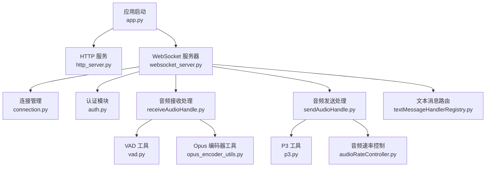
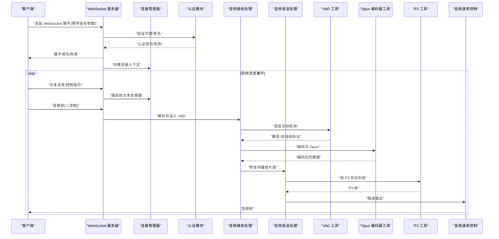
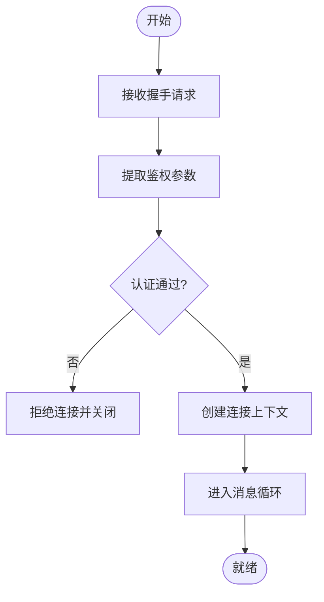
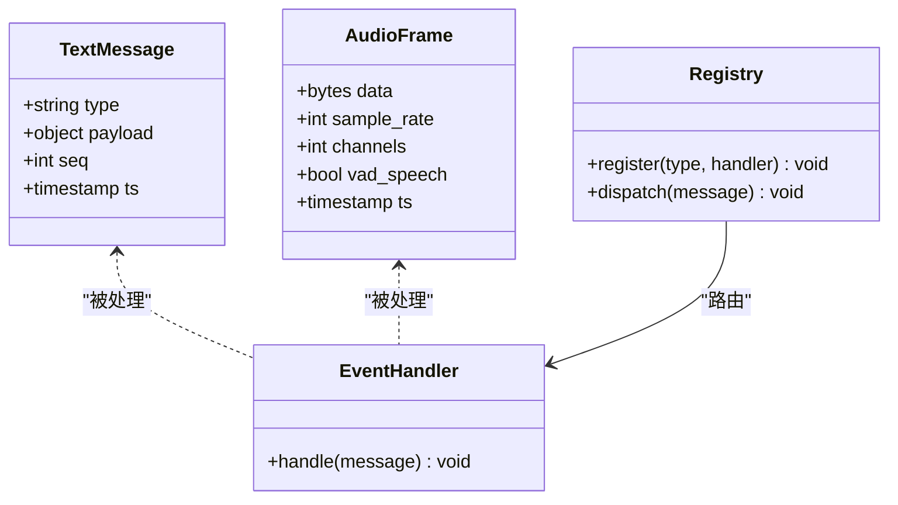
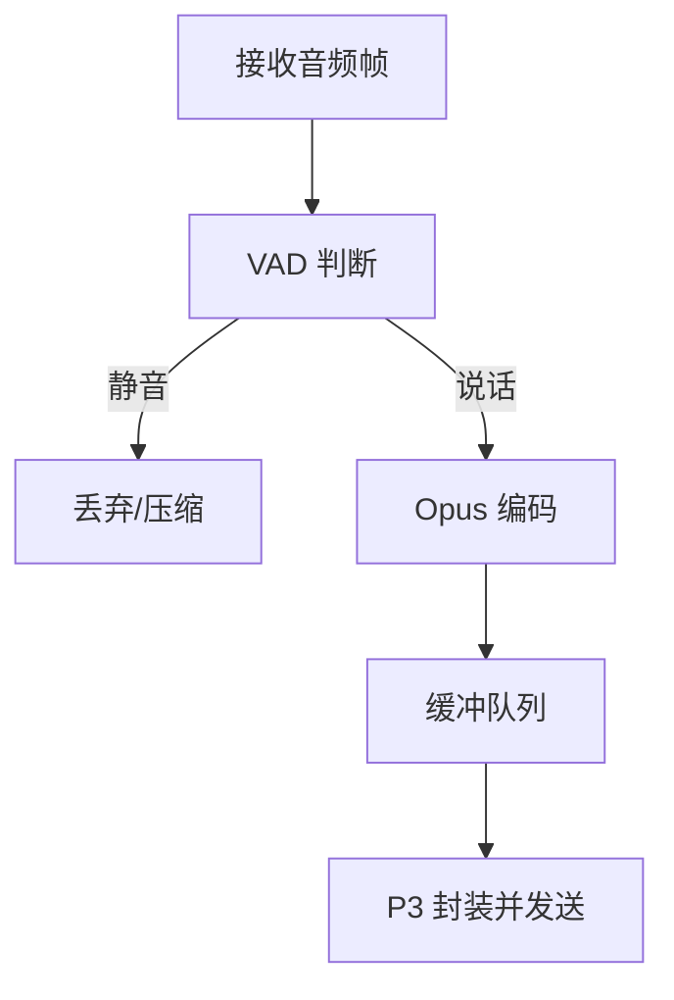
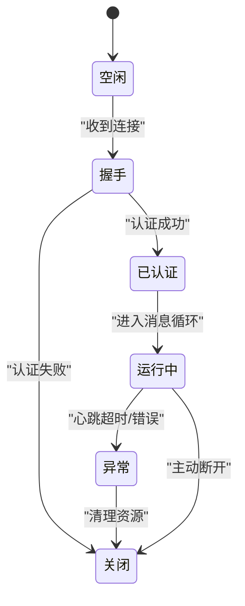
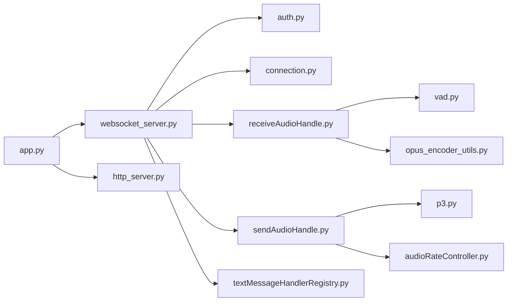

# WebSocket API

<cite>
**本文引用的文件**   
- [websocket_server.py](file://main/xiaozhi-server/core/websocket_server.py)
- [connection.py](file://main/xiaozhi-server/core/connection.py)
- [auth.py](file://main/xiaozhi-server/core/auth.py)
- [receiveAudioHandle.py](file://main/xiaozhi-server/core/handle/receiveAudioHandle.py)
- [sendAudioHandle.py](file://main/xiaozhi-server/core/handle/sendAudioHandle.py)
- [textMessageHandlerRegistry.py](file://main/xiaozhi-server/core/handle/textMessageHandlerRegistry.py)
- [opus_encoder_utils.py](file://main/xiaozhi-server/core/utils/opus_encoder_utils.py)
- [audioRateController.py](file://main/xiaozhi-server/core/utils/audioRateController.py)
- [p3.py](file://main/xiaozhi-server/core/utils/p3.py)
- [vad.py](file://main/xiaozhi-server/core/utils/vad.py)
- [app.py](file://main/xiaozhi-server/app.py)
- [http_server.py](file://main/xiaozhi-server/core/http_server.py)
</cite>

## 目录
1. [简介](#简介)
2. [项目结构](#项目结构)
3. [核心组件](#核心组件)
4. [架构总览](#架构总览)
5. [详细组件分析](#详细组件分析)
6. [依赖关系分析](#依赖关系分析)
7. [性能考量](#性能考量)
8. [故障排查指南](#故障排查指南)
9. [结论](#结论)
10. [附录](#附录)

## 简介
本技术文档面向 xiaozhi-esp32-server 的 WebSocket API，覆盖连接建立与握手、身份认证、消息格式与事件类型、实时语音通信的数据流与编码、流式传输机制、连接状态管理、心跳检测与断线重连策略，以及客户端实现示例、错误处理、性能优化与监控指标。读者可据此完成服务端对接或客户端集成。

## 项目结构
WebSocket 相关能力集中在 Python 后端服务中，关键路径如下：
- WebSocket 服务器入口与连接生命周期管理
- 认证与鉴权
- 音频接收与发送处理
- 文本消息路由与处理器注册
- 音频编解码与速率控制工具
- VAD（语音活动检测）与 P3 协议工具
- 应用启动与 HTTP 辅助服务

**图示来源** 
- [app.py](file://main/xiaozhi-server/app.py)
- [http_server.py](file://main/xiaozhi-server/core/http_server.py)
- [websocket_server.py](file://main/xiaozhi-server/core/websocket_server.py)
- [connection.py](file://main/xiaozhi-server/core/connection.py)
- [auth.py](file://main/xiaozhi-server/core/auth.py)
- [receiveAudioHandle.py](file://main/xiaozhi-server/core/handle/receiveAudioHandle.py)
- [sendAudioHandle.py](file://main/xiaozhi-server/core/handle/sendAudioHandle.py)
- [textMessageHandlerRegistry.py](file://main/xiaozhi-server/core/handle/textMessageHandlerRegistry.py)
- [vad.py](file://main/xiaozhi-server/core/utils/vad.py)
- [opus_encoder_utils.py](file://main/xiaozhi-server/core/utils/opus_encoder_utils.py)
- [p3.py](file://main/xiaozhi-server/core/utils/p3.py)
- [audioRateController.py](file://main/xiaozhi-server/core/utils/audioRateController.py)

**章节来源**
- [app.py](file://main/xiaozhi-server/app.py)
- [http_server.py](file://main/xiaozhi-server/core/http_server.py)
- [websocket_server.py](file://main/xiaozhi-server/core/websocket_server.py)

## 核心组件
- WebSocket 服务器：负责监听端口、接受连接、握手升级、分发消息到对应处理器、维护连接上下文。
- 连接管理器：封装单个连接的读写循环、心跳、超时、断线重连触发点。
- 认证模块：在握手阶段校验令牌或签名，决定连接是否允许进入业务通道。
- 音频处理管线：接收端进行 VAD 分段、Opus 编码；发送端根据 P3 协议打包并限速输出。
- 文本消息路由：基于消息类型将文本消息分发给具体处理器，支持扩展注册。
- 工具库：VAD、Opus 编码、P3 协议、音频速率控制等。

**章节来源**
- [websocket_server.py](file://main/xiaozhi-server/core/websocket_server.py)
- [connection.py](file://main/xiaozhi-server/core/connection.py)
- [auth.py](file://main/xiaozhi-server/core/auth.py)
- [receiveAudioHandle.py](file://main/xiaozhi-server/core/handle/receiveAudioHandle.py)
- [sendAudioHandle.py](file://main/xiaozhi-server/core/handle/sendAudioHandle.py)
- [textMessageHandlerRegistry.py](file://main/xiaozhi-server/core/handle/textMessageHandlerRegistry.py)
- [vad.py](file://main/xiaozhi-server/core/utils/vad.py)
- [opus_encoder_utils.py](file://main/xiaozhi-server/core/utils/opus_encoder_utils.py)
- [p3.py](file://main/xiaozhi-server/core/utils/p3.py)
- [audioRateController.py](file://main/xiaozhi-server/core/utils/audioRateController.py)

## 架构总览
下图展示从客户端连接到实时语音交互的关键流程，包括握手认证、文本与音频消息路由、VAD 与 Opus 编码、P3 协议发送与速率控制。

**图示来源** 
- [websocket_server.py](file://main/xiaozhi-server/core/websocket_server.py)
- [connection.py](file://main/xiaozhi-server/core/connection.py)
- [auth.py](file://main/xiaozhi-server/core/auth.py)
- [receiveAudioHandle.py](file://main/xiaozhi-server/core/handle/receiveAudioHandle.py)
- [sendAudioHandle.py](file://main/xiaozhi-server/core/handle/sendAudioHandle.py)
- [vad.py](file://main/xiaozhi-server/core/utils/vad.py)
- [opus_encoder_utils.py](file://main/xiaozhi-server/core/utils/opus_encoder_utils.py)
- [p3.py](file://main/xiaozhi-server/core/utils/p3.py)
- [audioRateController.py](file://main/xiaozhi-server/core/utils/audioRateController.py)

## 详细组件分析

### WebSocket 连接建立与握手
- 握手阶段：客户端通过标准 WebSocket 握手请求连接，可在查询参数或头部携带鉴权信息（如 token、设备标识、时间戳与签名）。
- 认证流程：服务器在握手后调用认证模块校验凭证，失败则立即关闭连接；成功后建立连接上下文，初始化会话状态。
- 握手响应：成功时返回标准 101 Switching Protocols，后续进入消息循环。

**图示来源** 
- [websocket_server.py](file://main/xiaozhi-server/core/websocket_server.py)
- [auth.py](file://main/xiaozhi-server/core/auth.py)
- [connection.py](file://main/xiaozhi-server/core/connection.py)

**章节来源**
- [websocket_server.py](file://main/xiaozhi-server/core/websocket_server.py)
- [auth.py](file://main/xiaozhi-server/core/auth.py)
- [connection.py](file://main/xiaozhi-server/core/connection.py)

### 身份认证机制
- 支持的鉴权方式：令牌校验、设备签名、时间戳防重放等。
- 校验要点：令牌有效性、权限范围、设备绑定关系、过期时间。
- 失败处理：记录审计日志、返回明确错误码、限制重试频率。

**章节来源**
- [auth.py](file://main/xiaozhi-server/core/auth.py)

### 消息格式定义与事件类型
- 文本消息：采用 JSON 结构，包含消息类型、负载数据、序列号等字段。常见类型包括系统控制、对话指令、状态上报、配置更新等。
- 音频消息：二进制帧，通常以 Opus 编码，附带元数据（采样率、声道数、时间戳、VAD 标记）。
- 事件类型：连接状态变更、VAD 状态切换、TTS 播放进度、错误告警、设备能力协商等。
- 路由机制：文本消息通过注册表分发至具体处理器，支持动态扩展。

**图示来源** 
- [textMessageHandlerRegistry.py](file://main/xiaozhi-server/core/handle/textMessageHandlerRegistry.py)
- [receiveAudioHandle.py](file://main/xiaozhi-server/core/handle/receiveAudioHandle.py)
- [sendAudioHandle.py](file://main/xiaozhi-server/core/handle/sendAudioHandle.py)

**章节来源**
- [textMessageHandlerRegistry.py](file://main/xiaozhi-server/core/handle/textMessageHandlerRegistry.py)
- [receiveAudioHandle.py](file://main/xiaozhi-server/core/handle/receiveAudioHandle.py)
- [sendAudioHandle.py](file://main/xiaozhi-server/core/handle/sendAudioHandle.py)

### 实时语音通信数据流与编码
- 接收端：客户端上传音频帧，服务器进行 VAD 判断，非静音段送入 ASR 或下游处理；静音段可丢弃以降低带宽。
- 编码格式：默认使用 Opus，采样率通常为 16kHz，单声道；可根据设备能力协商调整。
- 发送端：TTS 生成音频后，按 P3 协议封装，通过速率控制器平滑输出，避免抖动。
- 流式传输：边收边发，降低端到端延迟；必要时引入缓冲队列与背压控制。

**图示来源** 
- [receiveAudioHandle.py](file://main/xiaozhi-server/core/handle/receiveAudioHandle.py)
- [sendAudioHandle.py](file://main/xiaozhi-server/core/handle/sendAudioHandle.py)
- [vad.py](file://main/xiaozhi-server/core/utils/vad.py)
- [opus_encoder_utils.py](file://main/xiaozhi-server/core/utils/opus_encoder_utils.py)
- [p3.py](file://main/xiaozhi-server/core/utils/p3.py)
- [audioRateController.py](file://main/xiaozhi-server/core/utils/audioRateController.py)

**章节来源**
- [receiveAudioHandle.py](file://main/xiaozhi-server/core/handle/receiveAudioHandle.py)
- [sendAudioHandle.py](file://main/xiaozhi-server/core/handle/sendAudioHandle.py)
- [vad.py](file://main/xiaozhi-server/core/utils/vad.py)
- [opus_encoder_utils.py](file://main/xiaozhi-server/core/utils/opus_encoder_utils.py)
- [p3.py](file://main/xiaozhi-server/core/utils/p3.py)
- [audioRateController.py](file://main/xiaozhi-server/core/utils/audioRateController.py)

### 连接状态管理与心跳检测
- 状态机：空闲、握手、已认证、运行中、异常、关闭。
- 心跳：周期性 Ping/Pong 或轻量文本消息，维持链路活跃；超时未响应判定为断开。
- 断线重连：客户端侧实现指数退避重连；服务端侧清理资源、释放句柄、重置统计。

**图示来源** 
- [connection.py](file://main/xiaozhi-server/core/connection.py)
- [websocket_server.py](file://main/xiaozhi-server/core/websocket_server.py)

**章节来源**
- [connection.py](file://main/xiaozhi-server/core/connection.py)
- [websocket_server.py](file://main/xiaozhi-server/core/websocket_server.py)

### 客户端实现示例（步骤说明）
- 建立连接：构造 WebSocket URL，附加鉴权参数（token、设备ID、时间戳、签名），发起握手。
- 发送消息：先发送文本控制消息（如开始录音、设置采样率），随后持续发送音频帧。
- 处理事件：监听文本事件（对话结果、状态通知）与音频事件（TTS 播放进度、错误码）。
- 心跳与重连：定时发送心跳；断线后按指数退避策略重连，恢复会话上下文。
- 错误处理：捕获网络异常、认证失败、编码错误，记录日志并提示用户。

[本节为概念性说明，不直接分析具体文件，故无“章节来源”]

## 依赖关系分析
- WebSocket 服务器依赖认证模块与连接管理器，负责握手与生命周期。
- 音频处理管线依赖 VAD、Opus 编码、P3 协议与速率控制工具。
- 文本消息路由依赖处理器注册表，便于扩展新的事件类型。
- 应用启动聚合 HTTP 与 WebSocket 服务，提供统一入口。

**图示来源** 
- [websocket_server.py](file://main/xiaozhi-server/core/websocket_server.py)
- [auth.py](file://main/xiaozhi-server/core/auth.py)
- [connection.py](file://main/xiaozhi-server/core/connection.py)
- [receiveAudioHandle.py](file://main/xiaozhi-server/core/handle/receiveAudioHandle.py)
- [sendAudioHandle.py](file://main/xiaozhi-server/core/handle/sendAudioHandle.py)
- [textMessageHandlerRegistry.py](file://main/xiaozhi-server/core/handle/textMessageHandlerRegistry.py)
- [vad.py](file://main/xiaozhi-server/core/utils/vad.py)
- [opus_encoder_utils.py](file://main/xiaozhi-server/core/utils/opus_encoder_utils.py)
- [p3.py](file://main/xiaozhi-server/core/utils/p3.py)
- [audioRateController.py](file://main/xiaozhi-server/core/utils/audioRateController.py)
- [app.py](file://main/xiaozhi-server/app.py)
- [http_server.py](file://main/xiaozhi-server/core/http_server.py)

**章节来源**
- [websocket_server.py](file://main/xiaozhi-server/core/websocket_server.py)
- [app.py](file://main/xiaozhi-server/app.py)
- [http_server.py](file://main/xiaozhi-server/core/http_server.py)

## 性能考量
- 音频编码：优先使用硬件加速的 Opus 编码，减少 CPU 占用；合理设置比特率与帧长平衡延迟与质量。
- VAD 阈值：调优静音检测阈值，减少无效数据传输，降低带宽与处理开销。
- 缓冲与背压：发送端使用有界队列，避免内存暴涨；接收端按需消费，防止积压。
- 心跳间隔：根据网络环境动态调整心跳周期，避免频繁探测造成拥塞。
- 并发模型：I/O 密集型任务采用异步或线程池，避免阻塞主循环。
- 监控指标：连接数、消息吞吐、编码耗时、丢包率、端到端延迟、CPU/内存使用率。

[本节为通用指导，不直接分析具体文件，故无“章节来源”]

## 故障排查指南
- 握手失败：检查鉴权参数是否正确、签名算法是否一致、时间戳是否过期。
- 音频卡顿：确认 VAD 阈值、Opus 编码参数、P3 帧大小与速率控制是否匹配。
- 连接中断：查看心跳超时、网络抖动、服务端资源不足；检查连接状态机与清理逻辑。
- 文本路由异常：核对消息类型注册、处理器实现、字段校验规则。
- 日志定位：启用详细日志，记录握手、认证、编码、发送、心跳等关键节点。

**章节来源**
- [auth.py](file://main/xiaozhi-server/core/auth.py)
- [receiveAudioHandle.py](file://main/xiaozhi-server/core/handle/receiveAudioHandle.py)
- [sendAudioHandle.py](file://main/xiaozhi-server/core/handle/sendAudioHandle.py)
- [connection.py](file://main/xiaozhi-server/core/connection.py)
- [textMessageHandlerRegistry.py](file://main/xiaozhi-server/core/handle/textMessageHandlerRegistry.py)

## 结论
xiaozhi-esp32-server 的 WebSocket API 提供了完整的实时语音通信能力，涵盖握手认证、消息路由、音频编码与流式传输、连接状态管理与心跳机制。通过合理的参数调优与监控指标采集，可实现低延迟、高可靠的语音交互体验。建议客户端严格遵循协议规范，完善错误处理与重连策略，确保生产环境的稳定性。

[本节为总结性内容，不直接分析具体文件，故无“章节来源”]

## 附录
- 协议参考：WebSocket RFC 6455、Opus 编码规范、P3 协议定义。
- 最佳实践：最小化消息体积、批量处理、异步 I/O、资源回收。
- 测试建议：模拟弱网、高并发、异常输入，验证鲁棒性与性能。

[本节为补充信息，不直接分析具体文件，故无“章节来源”]