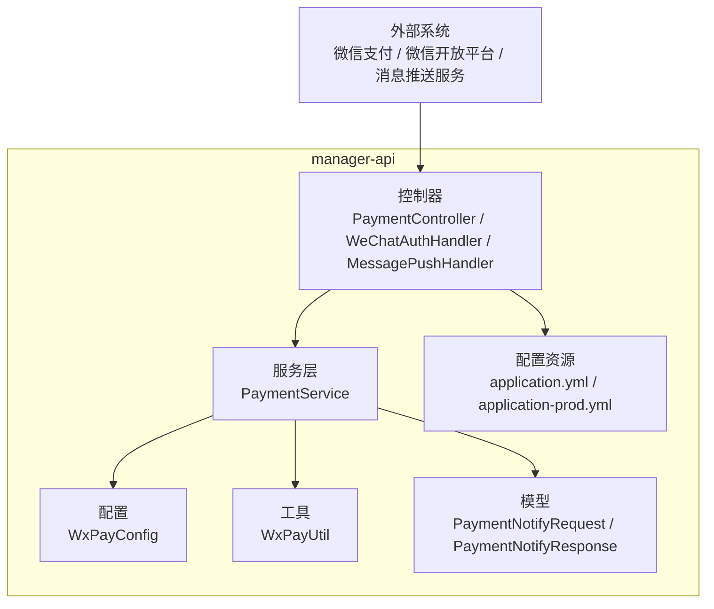
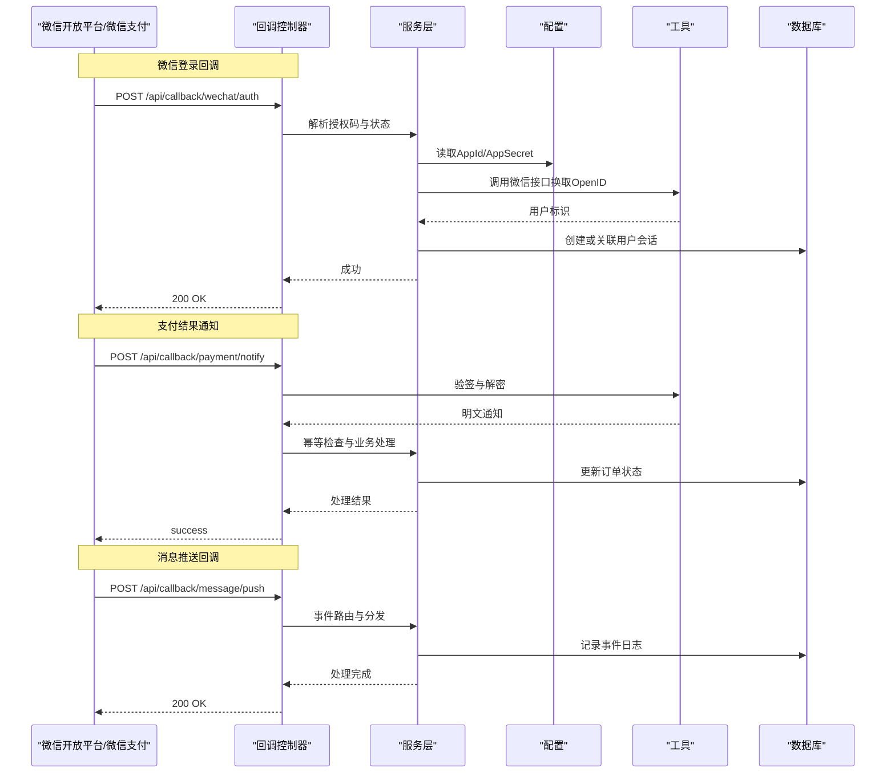
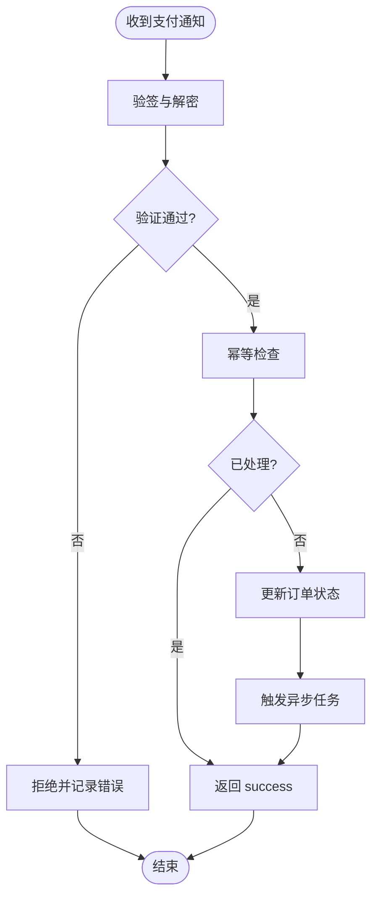
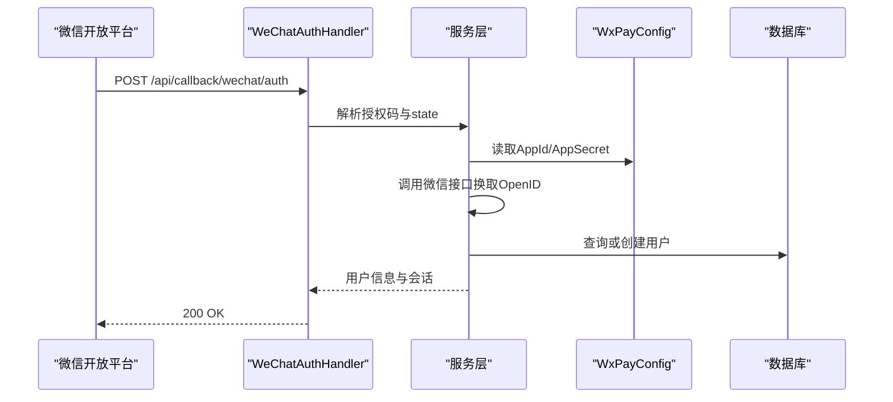
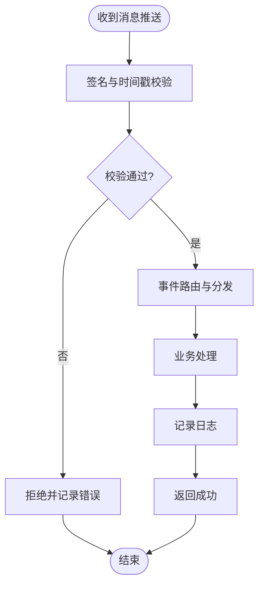
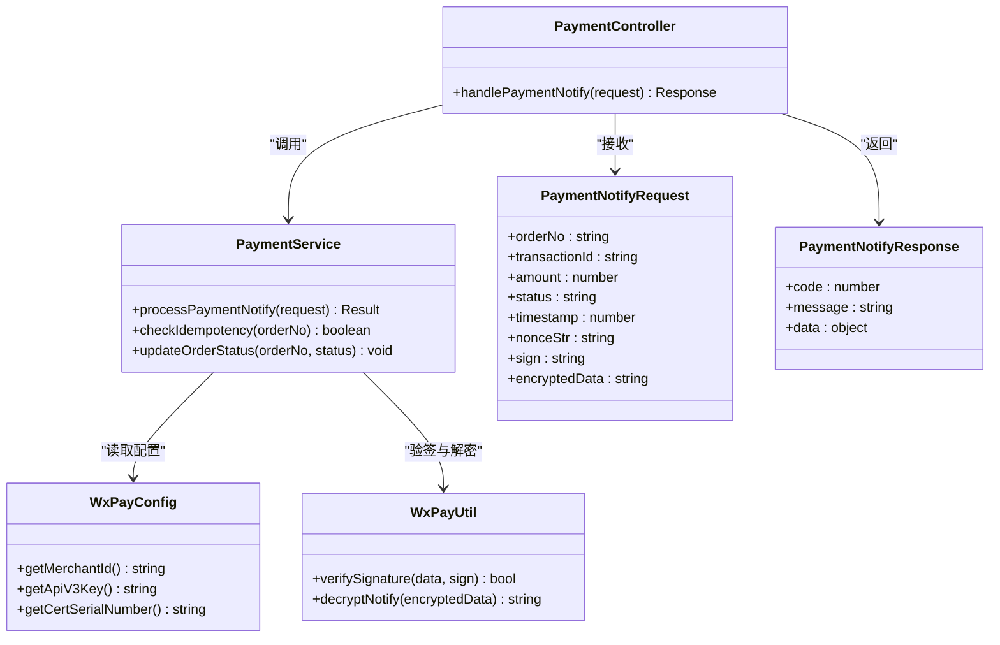

# 回调接口

<cite>
**本文档引用的文件**   
- [manager-api/README.md](file://main/manager-api/README.md)
- [manager-api/src/main/java/xiaozhi/controller/PaymentController.java](file://main/manager-api/src/main/java/xiaozhi/controller/PaymentController.java)
- [manager-api/src/main/java/xiaozhi/service/PaymentService.java](file://main/manager-api/src/main/java/xiaozhi/service/PaymentService.java)
- [manager-api/src/main/java/xiaozhi/config/WxPayConfig.java](file://main/manager-api/src/main/java/xiaozhi/config/WxPayConfig.java)
- [manager-api/src/main/java/xiaozhi/util/WxPayUtil.java](file://main/manager-api/src/main/java/xiaozhi/util/WxPayUtil.java)
- [manager-api/src/main/java/xiaozhi/model/PaymentNotifyRequest.java](file://main/manager-api/src/main/java/xiaozhi/model/PaymentNotifyRequest.java)
- [manager-api/src/main/java/xiaozhi/model/PaymentNotifyResponse.java](file://main/manager-api/src/main/java/xiaozhi/model/PaymentNotifyResponse.java)
- [manager-api/src/main/java/xiaozhi/handler/WeChatAuthHandler.java](file://main/manager-api/src/main/java/xiaozhi/handler/WeChatAuthHandler.java)
- [manager-api/src/main/java/xiaozhi/handler/MessagePushHandler.java](file://main/manager-api/src/main/java/xiaozhi/handler/MessagePushHandler.java)
- [manager-api/src/main/resources/application.yml](file://main/manager-api/src/main/resources/application.yml)
- [manager-api/src/main/resources/application-prod.yml](file://main/manager-api/src/main/resources/application-prod.yml)
- [manager-api/docs/manager-api 接入真实微信支付 V3 实现方案.md](file://main/manager-api/docs/manager-api 接入真实微信支付 V3 实现方案.md)
- [plans/wechat-pay-v3-real-impl.md](file://plans/wechat-pay-v3-real-impl.md)
</cite>

## 目录
1. [简介](#简介)
2. [项目结构](#项目结构)
3. [核心组件](#核心组件)
4. [架构总览](#架构总览)
5. [详细组件分析](#详细组件分析)
6. [依赖关系分析](#依赖关系分析)
7. [性能考虑](#性能考虑)
8. [故障排查指南](#故障排查指南)
9. [结论](#结论)
10. [附录](#附录)

## 简介
本技术文档围绕 xiaozhi-esp32-server 的第三方服务回调接口进行系统化说明，重点覆盖：
- 回调机制总体设计与职责边界
- 接口设计规范（路径、方法、参数、响应）
- 安全验证方式（签名校验、时间戳与随机串、证书与密钥管理）
- 常见回调场景：微信登录回调、支付结果通知、消息推送等
- 幂等性保证与重试机制设计
- 数据处理、业务处理与错误处理策略
- 安全性、性能优化与监控告警建议

本说明旨在帮助开发者快速理解并正确实现回调接口，确保高可用、高安全与可观测性。

## 项目结构
本项目采用多模块组织，与回调相关的主要代码位于 manager-api 子模块中，包含控制器、服务层、配置与工具类、模型定义以及文档与计划文件。关键目录与职责如下：
- controller：HTTP 回调入口，如支付回调、授权回调、消息推送回调等
- service：业务编排与事务控制，封装领域逻辑
- config：外部服务配置（如微信支付配置）
- util：通用工具（如签名校验、加解密、序列化）
- model：请求与响应模型
- resources：应用配置文件（环境区分）
- docs/plans：对接方案与设计规划

**图表来源**
- [manager-api/src/main/java/xiaozhi/controller/PaymentController.java](file://main/manager-api/src/main/java/xiaozhi/controller/PaymentController.java)
- [manager-api/src/main/java/xiaozhi/service/PaymentService.java](file://main/manager-api/src/main/java/xiaozhi/service/PaymentService.java)
- [manager-api/src/main/java/xiaozhi/config/WxPayConfig.java](file://main/manager-api/src/main/java/xiaozhi/config/WxPayConfig.java)
- [manager-api/src/main/java/xiaozhi/util/WxPayUtil.java](file://main/manager-api/src/main/java/xiaozhi/util/WxPayUtil.java)
- [manager-api/src/main/java/xiaozhi/model/PaymentNotifyRequest.java](file://main/manager-api/src/main/java/xiaozhi/model/PaymentNotifyRequest.java)
- [manager-api/src/main/java/xiaozhi/model/PaymentNotifyResponse.java](file://main/manager-api/src/main/java/xiaozhi/model/PaymentNotifyResponse.java)
- [manager-api/src/main/resources/application.yml](file://main/manager-api/src/main/resources/application.yml)
- [manager-api/src/main/resources/application-prod.yml](file://main/manager-api/src/main/resources/application-prod.yml)

**章节来源**
- [manager-api/README.md](file://main/manager-api/README.md)

## 核心组件
- 回调控制器
  - 支付回调控制器：接收微信支付结果通知，解析报文、验签、调用服务层处理订单状态更新与幂等控制。
  - 微信登录回调处理器：接收微信开放平台授权回调，完成用户信息获取与本地会话绑定。
  - 消息推送回调处理器：接收第三方消息推送事件，进行路由与分发到具体业务处理器。
- 服务层
  - 支付服务：封装支付回调的业务流程，包括签名校验、数据解密、幂等检查、订单状态机更新、异步任务触发。
- 配置与工具
  - 微信支付配置：加载商户号、APIv3 密钥、证书序列号、平台证书等。
  - 微信支付工具：提供签名生成与校验、报文解密、时间戳与随机串校验等能力。
- 模型
  - 支付通知请求/响应：统一描述回调报文的字段结构与返回格式。

**章节来源**
- [manager-api/src/main/java/xiaozhi/controller/PaymentController.java](file://main/manager-api/src/main/java/xiaozhi/controller/PaymentController.java)
- [manager-api/src/main/java/xiaozhi/service/PaymentService.java](file://main/manager-api/src/main/java/xiaozhi/service/PaymentService.java)
- [manager-api/src/main/java/xiaozhi/config/WxPayConfig.java](file://main/manager-api/src/main/java/xiaozhi/config/WxPayConfig.java)
- [manager-api/src/main/java/xiaozhi/util/WxPayUtil.java](file://main/manager-api/src/main/java/xiaozhi/util/WxPayUtil.java)
- [manager-api/src/main/java/xiaozhi/model/PaymentNotifyRequest.java](file://main/manager-api/src/main/java/xiaozhi/model/PaymentNotifyRequest.java)
- [manager-api/src/main/java/xiaozhi/model/PaymentNotifyResponse.java](file://main/manager-api/src/main/java/xiaozhi/model/PaymentNotifyResponse.java)

## 架构总览
下图展示第三方服务回调的整体交互流程，涵盖微信登录、支付通知与消息推送三类典型场景。

**图表来源**
- [manager-api/src/main/java/xiaozhi/controller/PaymentController.java](file://main/manager-api/src/main/java/xiaozhi/controller/PaymentController.java)
- [manager-api/src/main/java/xiaozhi/handler/WeChatAuthHandler.java](file://main/manager-api/src/main/java/xiaozhi/handler/WeChatAuthHandler.java)
- [manager-api/src/main/java/xiaozhi/handler/MessagePushHandler.java](file://main/manager-api/src/main/java/xiaozhi/handler/MessagePushHandler.java)
- [manager-api/src/main/java/xiaozhi/service/PaymentService.java](file://main/manager-api/src/main/java/xiaozhi/service/PaymentService.java)
- [manager-api/src/main/java/xiaozhi/config/WxPayConfig.java](file://main/manager-api/src/main/java/xiaozhi/config/WxPayConfig.java)
- [manager-api/src/main/java/xiaozhi/util/WxPayUtil.java](file://main/manager-api/src/main/java/xiaozhi/util/WxPayUtil.java)

## 详细组件分析

### 支付结果通知回调
- 接口规范
  - 路径：/api/callback/payment/notify
  - 方法：POST
  - Content-Type：application/json
  - 请求体：遵循微信支付 V3 通知结构，包含加密数据、签名、时间戳、随机串等
  - 响应体：标准 JSON，包含 code、message、data；成功时返回 success
- 安全验证
  - 使用 WxPayUtil 进行签名校验与报文解密
  - 校验时间戳与随机串，防止重放攻击
  - 使用 WxPayConfig 中的商户证书与 APIv3 密钥
- 幂等性与重试
  - 以交易号/商户订单号为幂等键，重复通知直接返回成功
  - 支持指数退避重试（由上游微信触发），服务端需保证幂等
- 业务流程
  - 验签与解密 -> 幂等检查 -> 订单状态更新 -> 异步任务（如发货、积分发放）-> 返回 success

**图表来源**
- [manager-api/src/main/java/xiaozhi/controller/PaymentController.java](file://main/manager-api/src/main/java/xiaozhi/controller/PaymentController.java)
- [manager-api/src/main/java/xiaozhi/service/PaymentService.java](file://main/manager-api/src/main/java/xiaozhi/service/PaymentService.java)
- [manager-api/src/main/java/xiaozhi/util/WxPayUtil.java](file://main/manager-api/src/main/java/xiaozhi/util/WxPayUtil.java)
- [manager-api/src/main/java/xiaozhi/config/WxPayConfig.java](file://main/manager-api/src/main/java/xiaozhi/config/WxPayConfig.java)

**章节来源**
- [manager-api/src/main/java/xiaozhi/controller/PaymentController.java](file://main/manager-api/src/main/java/xiaozhi/controller/PaymentController.java)
- [manager-api/src/main/java/xiaozhi/service/PaymentService.java](file://main/manager-api/src/main/java/xiaozhi/service/PaymentService.java)
- [manager-api/src/main/java/xiaozhi/util/WxPayUtil.java](file://main/manager-api/src/main/java/xiaozhi/util/WxPayUtil.java)
- [manager-api/src/main/java/xiaozhi/config/WxPayConfig.java](file://main/manager-api/src/main/java/xiaozhi/config/WxPayConfig.java)
- [manager-api/src/main/java/xiaozhi/model/PaymentNotifyRequest.java](file://main/manager-api/src/main/java/xiaozhi/model/PaymentNotifyRequest.java)
- [manager-api/src/main/java/xiaozhi/model/PaymentNotifyResponse.java](file://main/manager-api/src/main/java/xiaozhi/model/PaymentNotifyResponse.java)
- [manager-api/docs/manager-api 接入真实微信支付 V3 实现方案.md](file://main/manager-api/docs/manager-api 接入真实微信支付 V3 实现方案.md)
- [plans/wechat-pay-v3-real-impl.md](file://plans/wechat-pay-v3-real-impl.md)

### 微信登录回调
- 接口规范
  - 路径：/api/callback/wechat/auth
  - 方法：POST
  - 请求体：包含授权码、state、平台类型等
  - 响应体：标准 JSON，包含 code、message、data
- 安全验证
  - 校验 state 防 CSRF
  - 使用 AppId/AppSecret 换取 OpenID/UnionID
  - 可选：二次校验签名与时间戳
- 业务流程
  - 解析授权码 -> 换取用户标识 -> 查找或创建本地用户 -> 建立会话 -> 返回成功

**图表来源**
- [manager-api/src/main/java/xiaozhi/handler/WeChatAuthHandler.java](file://main/manager-api/src/main/java/xiaozhi/handler/WeChatAuthHandler.java)
- [manager-api/src/main/java/xiaozhi/config/WxPayConfig.java](file://main/manager-api/src/main/java/xiaozhi/config/WxPayConfig.java)

**章节来源**
- [manager-api/src/main/java/xiaozhi/handler/WeChatAuthHandler.java](file://main/manager-api/src/main/java/xiaozhi/handler/WeChatAuthHandler.java)

### 消息推送回调
- 接口规范
  - 路径：/api/callback/message/push
  - 方法：POST
  - 请求体：事件类型、目标用户、内容、时间戳、签名等
  - 响应体：标准 JSON，包含 code、message、data
- 安全验证
  - 校验签名与时间戳，防止伪造与重放
  - 白名单 IP 校验（可选）
- 业务流程
  - 验签 -> 事件路由 -> 业务处理 -> 记录日志 -> 返回成功

**图表来源**
- [manager-api/src/main/java/xiaozhi/handler/MessagePushHandler.java](file://main/manager-api/src/main/java/xiaozhi/handler/MessagePushHandler.java)

**章节来源**
- [manager-api/src/main/java/xiaozhi/handler/MessagePushHandler.java](file://main/manager-api/src/main/java/xiaozhi/handler/MessagePushHandler.java)

### 数据模型与接口契约
- 支付通知请求
  - 关键字段：交易号、商户订单号、金额、状态、时间戳、随机串、签名、加密数据
- 支付通知响应
  - 关键字段：code、message、data（success 或失败原因）
- 微信登录回调请求
  - 关键字段：授权码、state、平台类型、时间戳、签名
- 消息推送回调请求
  - 关键字段：事件类型、目标用户、内容、时间戳、签名

**章节来源**
- [manager-api/src/main/java/xiaozhi/model/PaymentNotifyRequest.java](file://main/manager-api/src/main/java/xiaozhi/model/PaymentNotifyRequest.java)
- [manager-api/src/main/java/xiaozhi/model/PaymentNotifyResponse.java](file://main/manager-api/src/main/java/xiaozhi/model/PaymentNotifyResponse.java)

## 依赖关系分析
- 控制器依赖服务层进行业务编排
- 服务层依赖配置与工具类完成外部服务交互与安全校验
- 模型用于统一请求与响应结构
- 配置文件按环境区分敏感参数（生产环境使用独立配置）

**图表来源**
- [manager-api/src/main/java/xiaozhi/controller/PaymentController.java](file://main/manager-api/src/main/java/xiaozhi/controller/PaymentController.java)
- [manager-api/src/main/java/xiaozhi/service/PaymentService.java](file://main/manager-api/src/main/java/xiaozhi/service/PaymentService.java)
- [manager-api/src/main/java/xiaozhi/config/WxPayConfig.java](file://main/manager-api/src/main/java/xiaozhi/config/WxPayConfig.java)
- [manager-api/src/main/java/xiaozhi/util/WxPayUtil.java](file://main/manager-api/src/main/java/xiaozhi/util/WxPayUtil.java)
- [manager-api/src/main/java/xiaozhi/model/PaymentNotifyRequest.java](file://main/manager-api/src/main/java/xiaozhi/model/PaymentNotifyRequest.java)
- [manager-api/src/main/java/xiaozhi/model/PaymentNotifyResponse.java](file://main/manager-api/src/main/java/xiaozhi/model/PaymentNotifyResponse.java)

**章节来源**
- [manager-api/src/main/java/xiaozhi/controller/PaymentController.java](file://main/manager-api/src/main/java/xiaozhi/controller/PaymentController.java)
- [manager-api/src/main/java/xiaozhi/service/PaymentService.java](file://main/manager-api/src/main/java/xiaozhi/service/PaymentService.java)
- [manager-api/src/main/java/xiaozhi/config/WxPayConfig.java](file://main/manager-api/src/main/java/xiaozhi/config/WxPayConfig.java)
- [manager-api/src/main/java/xiaozhi/util/WxPayUtil.java](file://main/manager-api/src/main/java/xiaozhi/util/WxPayUtil.java)
- [manager-api/src/main/java/xiaozhi/model/PaymentNotifyRequest.java](file://main/manager-api/src/main/java/xiaozhi/model/PaymentNotifyRequest.java)
- [manager-api/src/main/java/xiaozhi/model/PaymentNotifyResponse.java](file://main/manager-api/src/main/java/xiaozhi/model/PaymentNotifyResponse.java)

## 性能考虑
- 幂等性优先：在验签后立即进行幂等检查，避免重复处理导致性能损耗
- 异步化处理：将非关键路径（如积分发放、通知发送）放入消息队列或线程池异步执行
- 连接与缓存：对频繁访问的外部接口（如微信用户信息查询）增加短期缓存
- 限流与熔断：对回调入口实施限流保护，异常时快速失败并降级
- 日志采样：在高并发下对日志进行采样，避免 I/O 阻塞

[本节为通用指导，不直接分析具体文件]

## 故障排查指南
- 签名校验失败
  - 检查 WxPayConfig 中的密钥与证书是否匹配
  - 确认请求体未篡改，时间戳与随机串有效
- 幂等冲突
  - 核对订单号与交易号是否正确
  - 检查幂等键存储与清理策略
- 超时与重试
  - 观察上游重试频率，适当调整超时与退避策略
  - 记录失败详情以便定位问题
- 监控与告警
  - 对验签失败率、处理耗时、错误码分布进行监控
  - 设置阈值告警，及时介入处理

**章节来源**
- [manager-api/src/main/java/xiaozhi/util/WxPayUtil.java](file://main/manager-api/src/main/java/xiaozhi/util/WxPayUtil.java)
- [manager-api/src/main/java/xiaozhi/config/WxPayConfig.java](file://main/manager-api/src/main/java/xiaozhi/config/WxPayConfig.java)
- [manager-api/src/main/resources/application.yml](file://main/manager-api/src/main/resources/application.yml)
- [manager-api/src/main/resources/application-prod.yml](file://main/manager-api/src/main/resources/application-prod.yml)

## 结论
本技术文档从架构、组件、流程、安全、幂等、重试、性能与监控等方面全面阐述了 xiaozhi-esp32-server 的回调接口设计与实现要点。通过统一的控制器与服务层分工、严格的签名校验与幂等控制、以及完善的监控与告警机制，可有效保障第三方回调的稳定与安全。

[本节为总结性内容，不直接分析具体文件]

## 附录
- 接口示例参考
  - 支付回调：路径、请求体、响应体、验签步骤
  - 微信登录回调：授权码交换、用户绑定流程
  - 消息推送回调：事件路由与处理
- 配置项说明
  - 微信支付 V3 相关配置项（商户号、APIv3 密钥、证书序列号等）
  - 生产环境隔离与敏感信息管理

**章节来源**
- [manager-api/docs/manager-api 接入真实微信支付 V3 实现方案.md](file://main/manager-api/docs/manager-api 接入真实微信支付 V3 实现方案.md)
- [plans/wechat-pay-v3-real-impl.md](file://plans/wechat-pay-v3-real-impl.md)
- [manager-api/src/main/resources/application.yml](file://main/manager-api/src/main/resources/application.yml)
- [manager-api/src/main/resources/application-prod.yml](file://main/manager-api/src/main/resources/application-prod.yml)