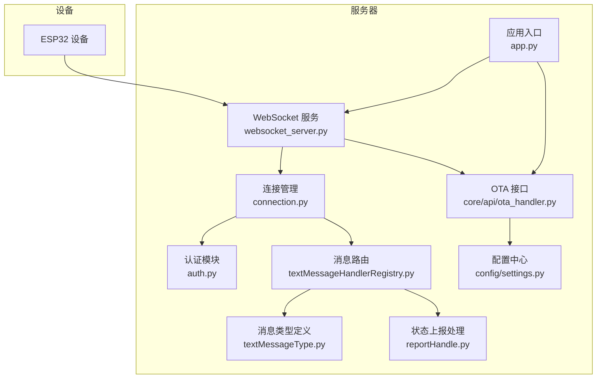
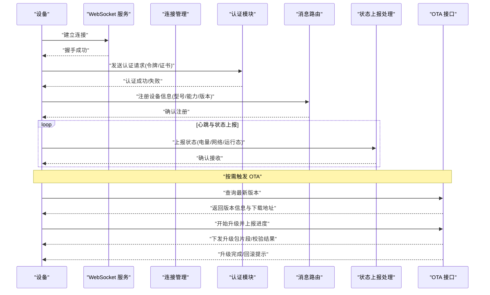
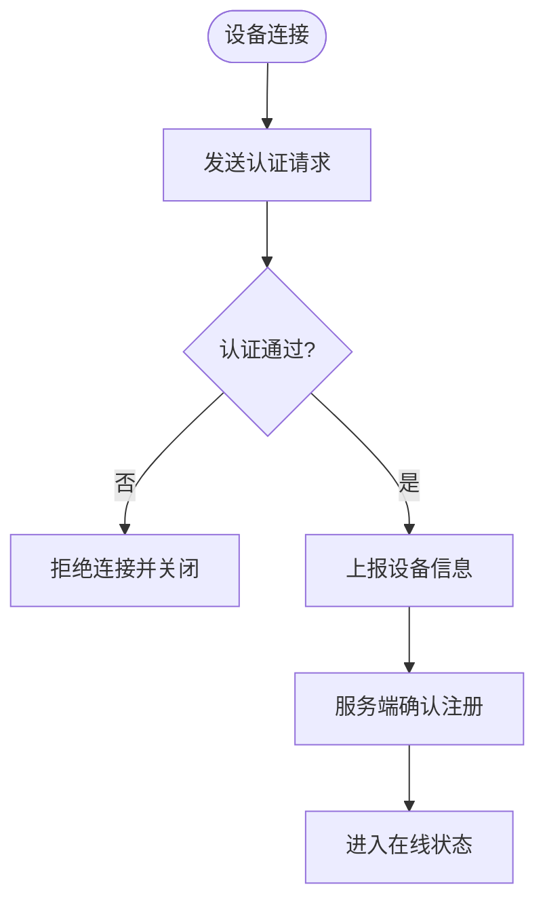
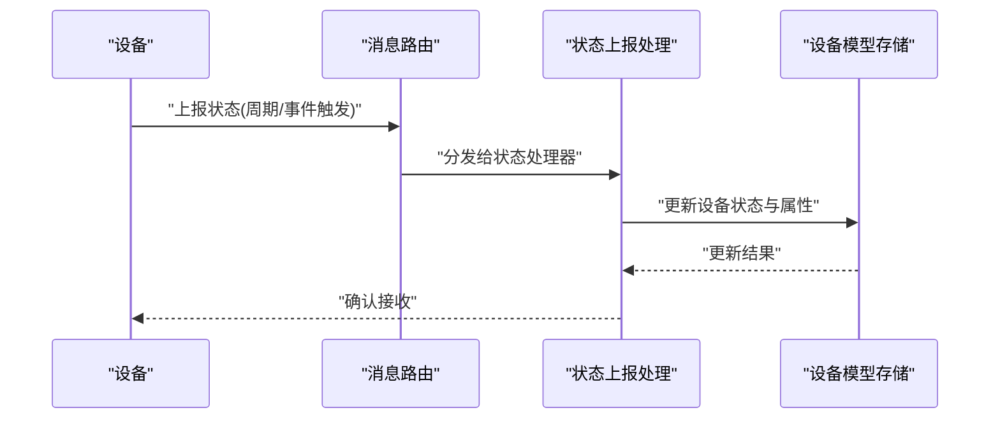
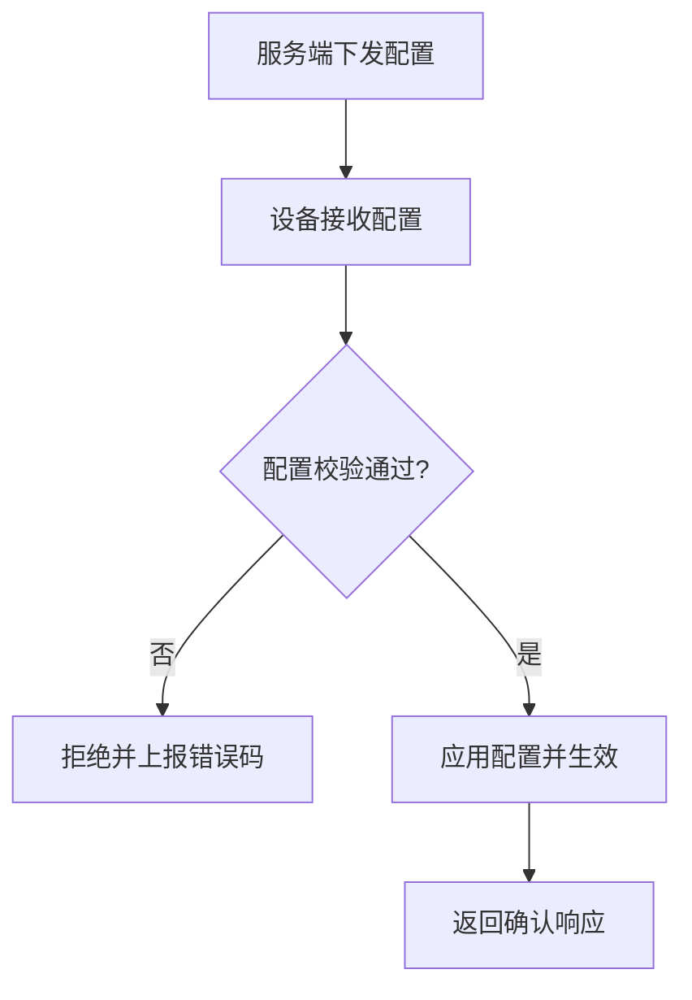
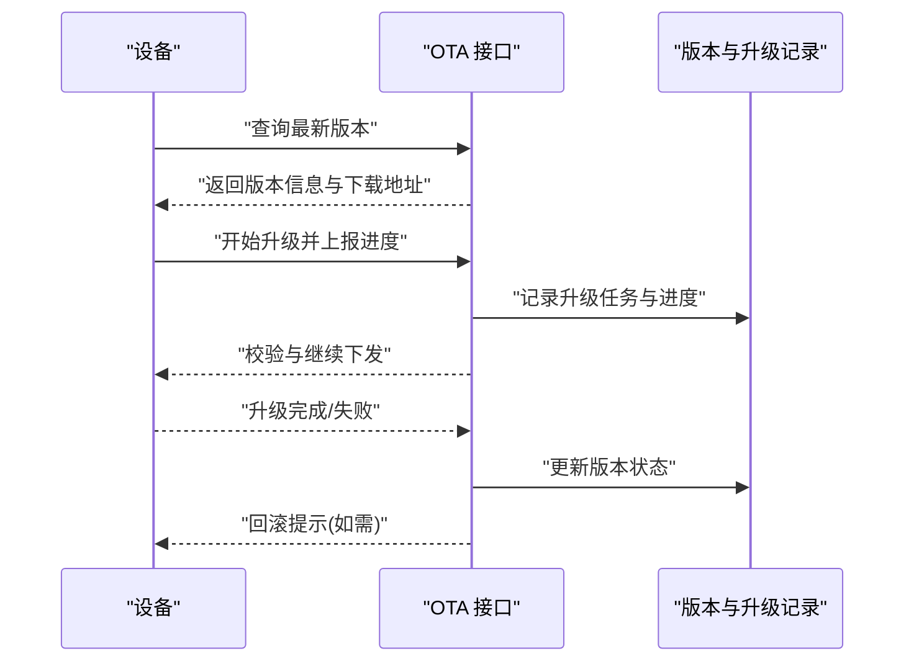
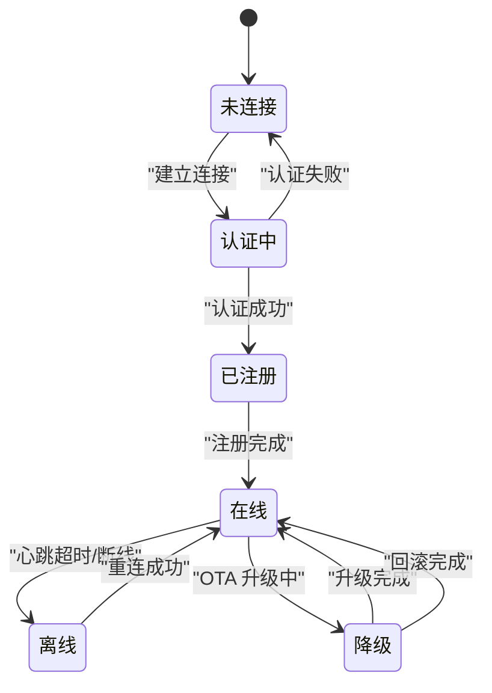
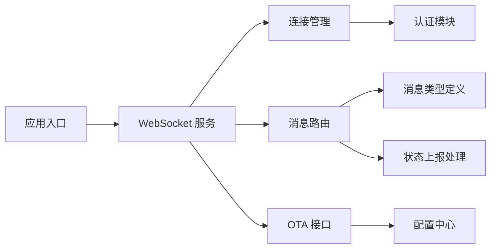

# 设备接口

<cite>
**本文档引用的文件**
- [xiaozhi-server/core/websocket_server.py](file://main/xiaozhi-server/core/websocket_server.py)
- [xiaozhi-server/core/connection.py](file://main/xiaozhi-server/core/connection.py)
- [xiaozhi-server/core/auth.py](file://main/xiaozhi-server/core/auth.py)
- [xiaozhi-server/core/handle/reportHandle.py](file://main/xiaozhi-server/core/handle/reportHandle.py)
- [xiaozhi-server/core/handle/textMessageHandlerRegistry.py](file://main/xiaozhi-server/core/handle/textMessageHandlerRegistry.py)
- [xiaozhi-server/core/handle/textMessageType.py](file://main/xiaozhi-server/core/handle/textMessageType.py)
- [xiaozhi-server/core/api/ota_handler.py](file://main/xiaozhi-server/core/api/ota_handler.py)
- [xiaozhi-server/config/settings.py](file://main/xiaozhi-server/config/settings.py)
- [xiaozhi-server/app.py](file://main/xiaozhi-server/app.py)
- [docs/ota-upgrade-guide.md](file://docs/ota-upgrade-guide.md)
</cite>

## 目录
1. [简介](#简介)
2. [项目结构](#项目结构)
3. [核心组件](#核心组件)
4. [架构总览](#架构总览)
5. [详细组件分析](#详细组件分析)
6. [依赖关系分析](#依赖关系分析)
7. [性能考虑](#性能考虑)
8. [故障排查指南](#故障排查指南)
9. [结论](#结论)
10. [附录](#附录)

## 简介
本技术文档面向 xiaozhi-esp32-server 的设备侧接口，覆盖设备注册与认证、设备信息同步、状态上报、配置更新、OTA 固件升级、生命周期管理、在线状态维护与离线处理策略。文档同时给出设备端实现建议（初始化连接、上报状态、接收指令），并说明安全与加密、异常处理等关键要点，帮助开发者快速集成与稳定运行。

## 项目结构
与设备接口相关的核心代码集中在 xiaozhi-server 模块中：
- WebSocket 服务与连接管理：websocket_server.py、connection.py
- 设备认证：auth.py
- 文本消息路由与处理器注册：textMessageHandlerRegistry.py、textMessageType.py
- 设备状态上报处理：reportHandle.py
- OTA 升级接口：core/api/ota_handler.py
- 全局配置：config/settings.py
- 应用入口：app.py
- OTA 使用指南：docs/ota-upgrade-guide.md

**图表来源**
- [xiaozhi-server/core/websocket_server.py](file://main/xiaozhi-server/core/websocket_server.py)
- [xiaozhi-server/core/connection.py](file://main/xiaozhi-server/core/connection.py)
- [xiaozhi-server/core/auth.py](file://main/xiaozhi-server/core/auth.py)
- [xiaozhi-server/core/handle/textMessageHandlerRegistry.py](file://main/xiaozhi-server/core/handle/textMessageHandlerRegistry.py)
- [xiaozhi-server/core/handle/textMessageType.py](file://main/xiaozhi-server/core/handle/textMessageType.py)
- [xiaozhi-server/core/handle/reportHandle.py](file://main/xiaozhi-server/core/handle/reportHandle.py)
- [xiaozhi-server/core/api/ota_handler.py](file://main/xiaozhi-server/core/api/ota_handler.py)
- [xiaozhi-server/config/settings.py](file://main/xiaozhi-server/config/settings.py)
- [xiaozhi-server/app.py](file://main/xiaozhi-server/app.py)

**章节来源**
- [xiaozhi-server/core/websocket_server.py](file://main/xiaozhi-server/core/websocket_server.py)
- [xiaozhi-server/core/connection.py](file://main/xiaozhi-server/core/connection.py)
- [xiaozhi-server/core/auth.py](file://main/xiaozhi-server/core/auth.py)
- [xiaozhi-server/core/handle/reportHandle.py](file://main/xiaozhi-server/core/handle/reportHandle.py)
- [xiaozhi-server/core/handle/textMessageHandlerRegistry.py](file://main/xiaozhi-server/core/handle/textMessageHandlerRegistry.py)
- [xiaozhi-server/core/handle/textMessageType.py](file://main/xiaozhi-server/core/handle/textMessageType.py)
- [xiaozhi-server/core/api/ota_handler.py](file://main/xiaozhi-server/core/api/ota_handler.py)
- [xiaozhi-server/config/settings.py](file://main/xiaozhi-server/config/settings.py)
- [xiaozhi-server/app.py](file://main/xiaozhi-server/app.py)

## 核心组件
- WebSocket 服务：负责设备连接建立、心跳保活、消息收发与错误恢复。
- 连接管理：维护设备会话、在线状态、超时检测与重连策略。
- 认证模块：校验设备身份令牌或证书，确保接入合法性。
- 消息路由：基于消息类型将文本消息分发到对应处理器。
- 状态上报处理：解析设备上报的状态与属性，更新设备模型与在线状态。
- OTA 接口：提供版本查询、升级包下发、进度上报与回滚控制。
- 配置中心：集中管理设备能力、协议版本、功能开关与默认参数。
- 应用入口：启动服务、加载配置、注册路由与中间件。

**章节来源**
- [xiaozhi-server/core/websocket_server.py](file://main/xiaozhi-server/core/websocket_server.py)
- [xiaozhi-server/core/connection.py](file://main/xiaozhi-server/core/connection.py)
- [xiaozhi-server/core/auth.py](file://main/xiaozhi-server/core/auth.py)
- [xiaozhi-server/core/handle/textMessageHandlerRegistry.py](file://main/xiaozhi-server/core/handle/textMessageHandlerRegistry.py)
- [xiaozhi-server/core/handle/textMessageType.py](file://main/xiaozhi-server/core/handle/textMessageType.py)
- [xiaozhi-server/core/handle/reportHandle.py](file://main/xiaozhi-server/core/handle/reportHandle.py)
- [xiaozhi-server/core/api/ota_handler.py](file://main/xiaozhi-server/core/api/ota_handler.py)
- [xiaozhi-server/config/settings.py](file://main/xiaozhi-server/config/settings.py)
- [xiaozhi-server/app.py](file://main/xiaozhi-server/app.py)

## 架构总览
设备通过 WebSocket 与服务端建立长连接，完成认证后进入在线状态。服务端根据消息类型进行路由处理，设备周期性上报状态，服务端更新设备模型；当需要下发配置或触发 OTA 时，服务端通过同一通道推送指令，设备按协议执行并反馈结果。

**图表来源**
- [xiaozhi-server/core/websocket_server.py](file://main/xiaozhi-server/core/websocket_server.py)
- [xiaozhi-server/core/connection.py](file://main/xiaozhi-server/core/connection.py)
- [xiaozhi-server/core/auth.py](file://main/xiaozhi-server/core/auth.py)
- [xiaozhi-server/core/handle/textMessageHandlerRegistry.py](file://main/xiaozhi-server/core/handle/textMessageHandlerRegistry.py)
- [xiaozhi-server/core/handle/reportHandle.py](file://main/xiaozhi-server/core/handle/reportHandle.py)
- [xiaozhi-server/core/api/ota_handler.py](file://main/xiaozhi-server/core/api/ota_handler.py)

## 详细组件分析

### 设备注册与认证流程
- 设备连接后首先发起认证请求，携带设备标识与鉴权凭据（如令牌或证书）。
- 认证通过后，设备上报自身信息（型号、硬件能力、协议版本、固件版本等）以完成注册。
- 服务端记录设备会话、能力与版本，并返回注册确认。

**图表来源**
- [xiaozhi-server/core/auth.py](file://main/xiaozhi-server/core/auth.py)
- [xiaozhi-server/core/connection.py](file://main/xiaozhi-server/core/connection.py)
- [xiaozhi-server/core/handle/textMessageHandlerRegistry.py](file://main/xiaozhi-server/core/handle/textMessageHandlerRegistry.py)
- [xiaozhi-server/core/handle/textMessageType.py](file://main/xiaozhi-server/core/handle/textMessageType.py)

**章节来源**
- [xiaozhi-server/core/auth.py](file://main/xiaozhi-server/core/auth.py)
- [xiaozhi-server/core/connection.py](file://main/xiaozhi-server/core/connection.py)
- [xiaozhi-server/core/handle/textMessageHandlerRegistry.py](file://main/xiaozhi-server/core/handle/textMessageHandlerRegistry.py)
- [xiaozhi-server/core/handle/textMessageType.py](file://main/xiaozhi-server/core/handle/textMessageType.py)

### 设备信息同步与状态上报
- 设备周期性上报运行状态（如电量、网络质量、任务状态、传感器数据等）。
- 服务端解析并更新设备模型，用于前端展示与策略决策。
- 支持增量同步与全量刷新两种模式，避免频繁传输冗余数据。

**图表来源**
- [xiaozhi-server/core/handle/reportHandle.py](file://main/xiaozhi-server/core/handle/reportHandle.py)
- [xiaozhi-server/core/handle/textMessageHandlerRegistry.py](file://main/xiaozhi-server/core/handle/textMessageHandlerRegistry.py)
- [xiaozhi-server/core/handle/textMessageType.py](file://main/xiaozhi-server/core/handle/textMessageType.py)

**章节来源**
- [xiaozhi-server/core/handle/reportHandle.py](file://main/xiaozhi-server/core/handle/reportHandle.py)
- [xiaozhi-server/core/handle/textMessageHandlerRegistry.py](file://main/xiaozhi-server/core/handle/textMessageHandlerRegistry.py)
- [xiaozhi-server/core/handle/textMessageType.py](file://main/xiaozhi-server/core/handle/textMessageType.py)

### 配置更新与指令下发
- 服务端可主动下发配置项（如功能开关、参数阈值、语言设置等）。
- 设备收到配置后需立即生效或按策略延迟生效，并返回确认。
- 支持批量配置与差异更新，减少带宽占用。

**图表来源**
- [xiaozhi-server/core/handle/textMessageHandlerRegistry.py](file://main/xiaozhi-server/core/handle/textMessageHandlerRegistry.py)
- [xiaozhi-server/core/handle/textMessageType.py](file://main/xiaozhi-server/core/handle/textMessageType.py)

**章节来源**
- [xiaozhi-server/core/handle/textMessageHandlerRegistry.py](file://main/xiaozhi-server/core/handle/textMessageHandlerRegistry.py)
- [xiaozhi-server/core/handle/textMessageType.py](file://main/xiaozhi-server/core/handle/textMessageType.py)

### OTA 固件升级接口
- 设备查询最新版本，服务端返回版本信息与下载链接。
- 设备开始升级并周期性上报进度，服务端校验与记录。
- 升级完成后设备重启并上报新版本；若失败则触发回滚机制。

**图表来源**
- [xiaozhi-server/core/api/ota_handler.py](file://main/xiaozhi-server/core/api/ota_handler.py)
- [docs/ota-upgrade-guide.md](file://docs/ota-upgrade-guide.md)

**章节来源**
- [xiaozhi-server/core/api/ota_handler.py](file://main/xiaozhi-server/core/api/ota_handler.py)
- [docs/ota-upgrade-guide.md](file://docs/ota-upgrade-guide.md)

### 设备生命周期管理与在线状态维护
- 生命周期阶段：未连接、认证中、已注册、在线、离线、降级/回滚。
- 心跳保活：设备定时发送心跳，服务端检测超时并标记离线。
- 离线处理：缓存待下发指令，重连后补发；必要时通知上层业务。

**图表来源**
- [xiaozhi-server/core/connection.py](file://main/xiaozhi-server/core/connection.py)
- [xiaozhi-server/core/websocket_server.py](file://main/xiaozhi-server/core/websocket_server.py)

**章节来源**
- [xiaozhi-server/core/connection.py](file://main/xiaozhi-server/core/connection.py)
- [xiaozhi-server/core/websocket_server.py](file://main/xiaozhi-server/core/websocket_server.py)

### 设备端实现示例（指导）
- 初始化连接：建立 WebSocket 连接，保存服务端地址与端口，设置重试与退避策略。
- 认证流程：构造认证请求，携带设备标识与凭据，处理成功/失败分支。
- 上报状态：周期性或事件驱动上报状态，包含必要字段与校验逻辑。
- 接收指令：监听服务端下发的配置与 OTA 指令，按协议执行并反馈结果。
- 异常处理：捕获网络异常、认证失败、升级失败等场景，进行日志记录与恢复。

[本节为通用实现指导，不直接分析具体文件，故无“章节来源”]

## 依赖关系分析
- WebSocket 服务依赖连接管理与认证模块，负责设备接入与鉴权。
- 消息路由依赖消息类型定义，将文本消息分发至对应处理器。
- 状态上报处理依赖设备模型存储，更新设备状态与属性。
- OTA 接口依赖配置中心获取版本信息与升级策略。
- 应用入口统一启动各模块，完成服务装配。

**图表来源**
- [xiaozhi-server/app.py](file://main/xiaozhi-server/app.py)
- [xiaozhi-server/core/websocket_server.py](file://main/xiaozhi-server/core/websocket_server.py)
- [xiaozhi-server/core/connection.py](file://main/xiaozhi-server/core/connection.py)
- [xiaozhi-server/core/auth.py](file://main/xiaozhi-server/core/auth.py)
- [xiaozhi-server/core/handle/textMessageHandlerRegistry.py](file://main/xiaozhi-server/core/handle/textMessageHandlerRegistry.py)
- [xiaozhi-server/core/handle/textMessageType.py](file://main/xiaozhi-server/core/handle/textMessageType.py)
- [xiaozhi-server/core/handle/reportHandle.py](file://main/xiaozhi-server/core/handle/reportHandle.py)
- [xiaozhi-server/core/api/ota_handler.py](file://main/xiaozhi-server/core/api/ota_handler.py)
- [xiaozhi-server/config/settings.py](file://main/xiaozhi-server/config/settings.py)

**章节来源**
- [xiaozhi-server/app.py](file://main/xiaozhi-server/app.py)
- [xiaozhi-server/core/websocket_server.py](file://main/xiaozhi-server/core/websocket_server.py)
- [xiaozhi-server/core/connection.py](file://main/xiaozhi-server/core/connection.py)
- [xiaozhi-server/core/auth.py](file://main/xiaozhi-server/core/auth.py)
- [xiaozhi-server/core/handle/textMessageHandlerRegistry.py](file://main/xiaozhi-server/core/handle/textMessageHandlerRegistry.py)
- [xiaozhi-server/core/handle/textMessageType.py](file://main/xiaozhi-server/core/handle/textMessageType.py)
- [xiaozhi-server/core/handle/reportHandle.py](file://main/xiaozhi-server/core/handle/reportHandle.py)
- [xiaozhi-server/core/api/ota_handler.py](file://main/xiaozhi-server/core/api/ota_handler.py)
- [xiaozhi-server/config/settings.py](file://main/xiaozhi-server/config/settings.py)

## 性能考虑
- 心跳间隔与超时阈值应合理配置，避免误判离线与资源浪费。
- 状态上报采用增量更新与批量化策略，降低带宽与 CPU 消耗。
- OTA 升级支持断点续传与分片校验，提升大文件传输的稳定性。
- 消息路由与处理器设计应避免阻塞，采用异步处理与队列缓冲。
- 配置中心缓存热点配置，减少重复查询与数据库压力。

[本节为通用性能建议，不直接分析具体文件，故无“章节来源”]

## 故障排查指南
- 认证失败：检查设备标识与凭据是否正确，查看认证模块日志与错误码。
- 连接中断：确认网络连通性、防火墙与代理设置，检查心跳超时配置。
- 状态上报异常：核对上报字段与协议版本，验证服务端解析逻辑。
- OTA 升级失败：检查版本兼容性、下载链接有效性、校验失败原因与回滚策略。
- 配置下发无效：确认配置格式与权限，检查设备端应用逻辑与生效策略。

**章节来源**
- [xiaozhi-server/core/auth.py](file://main/xiaozhi-server/core/auth.py)
- [xiaozhi-server/core/connection.py](file://main/xiaozhi-server/core/connection.py)
- [xiaozhi-server/core/handle/reportHandle.py](file://main/xiaozhi-server/core/handle/reportHandle.py)
- [xiaozhi-server/core/api/ota_handler.py](file://main/xiaozhi-server/core/api/ota_handler.py)

## 结论
xiaozhi-esp32-server 的设备接口围绕 WebSocket 长连接构建，涵盖认证、注册、状态上报、配置下发与 OTA 升级等核心能力。通过清晰的消息路由与处理器分工，系统具备良好的扩展性与可维护性。设备端需严格遵循协议规范，完善异常处理与恢复策略，以确保稳定可靠的设备接入与管理。

[本节为总结性内容，不直接分析具体文件，故无“章节来源”]

## 附录
- 协议版本与兼容性：设备与服务端需协商协议版本，确保字段兼容与行为一致。
- 安全与加密：建议使用 TLS 加密传输，结合令牌或证书进行强认证。
- 日志与监控：完善设备端与服务端日志，便于问题定位与性能优化。
- 回滚机制：OTA 升级失败时自动回滚至上一稳定版本，保障设备可用性。

[本节为补充信息，不直接分析具体文件，故无“章节来源”]