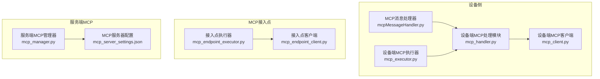
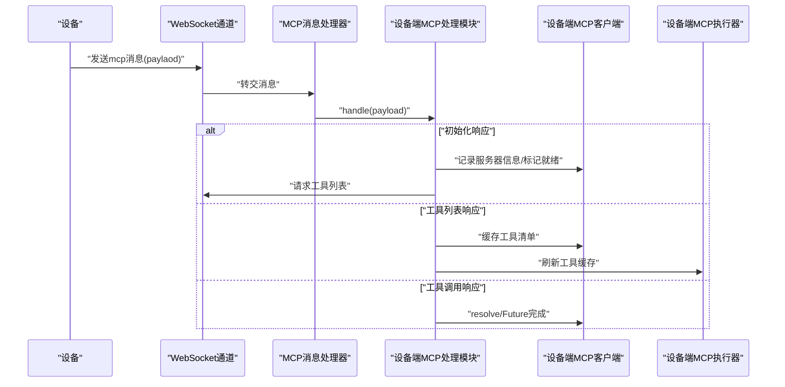
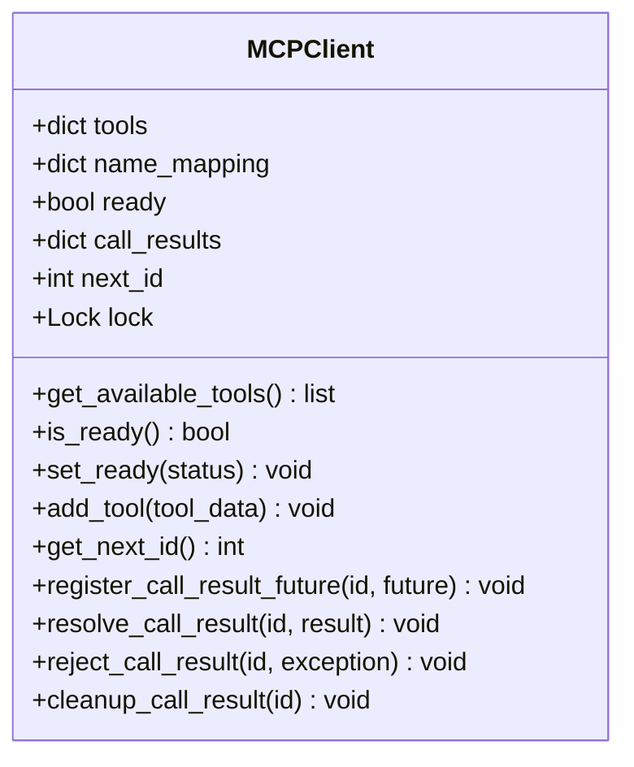
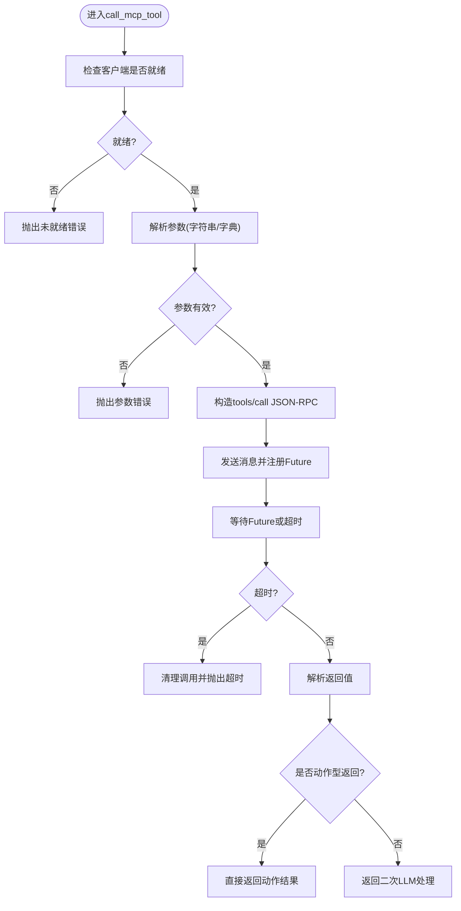
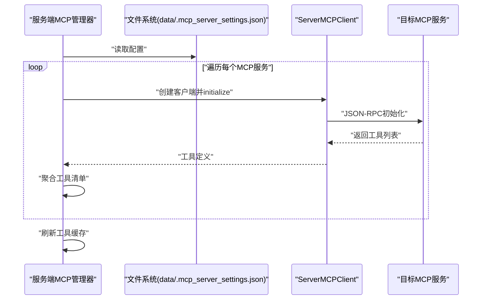
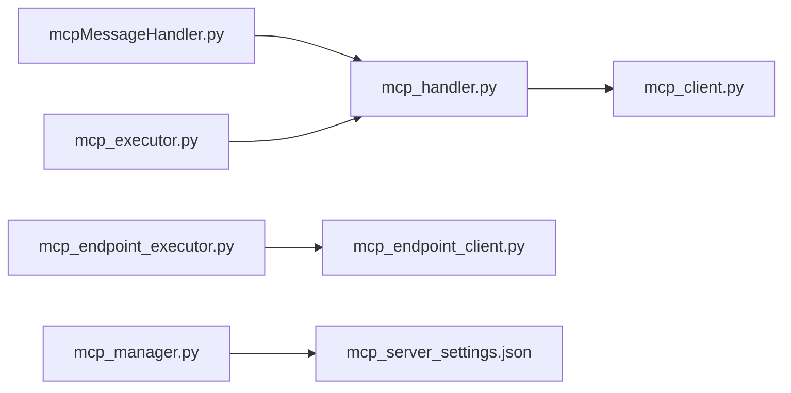

# MCP协议概述

<cite>
**本文引用的文件**
- [mcp_server_settings.json](file://main/xiaozhi-server/mcp_server_settings.json)
- [mcpMessageHandler.py](file://main/xiaozhi-server/core/handle/textHandler/mcpMessageHandler.py)
- [mcp_handler.py](file://main/xiaozhi-server/core/providers/tools/device_mcp/mcp_handler.py)
- [mcp_client.py](file://main/xiaozhi-server/core/providers/tools/device_mcp/mcp_client.py)
- [mcp_executor.py](file://main/xiaozhi-server/core/providers/tools/device_mcp/mcp_executor.py)
- [mcp_endpoint_client.py](file://main/xiaozhi-server/core/providers/tools/mcp_endpoint/mcp_endpoint_client.py)
- [mcp_endpoint_executor.py](file://main/xiaozhi-server/core/providers/tools/mcp_endpoint/mcp_endpoint_executor.py)
- [mcp_manager.py](file://main/xiaozhi-server/core/providers/tools/server_mcp/mcp_manager.py)
- [mcp-endpoint-integration.md](file://docs/mcp-endpoint-integration.md)
- [mcp-get-device-info.md](file://docs/mcp-get-device-info.md)
- [mcp-vision-integration.md](file://docs/mcp-vision-integration.md)
</cite>

## 目录
1. [引言](#引言)
2. [项目结构](#项目结构)
3. [核心组件](#核心组件)
4. [架构总览](#架构总览)
5. [详细组件分析](#详细组件分析)
6. [依赖关系分析](#依赖关系分析)
7. [性能考量](#性能考量)
8. [故障排查指南](#故障排查指南)
9. [结论](#结论)
10. [附录](#附录)

## 引言
本文件系统性梳理 Model Context Protocol（MCP）在小智ESP32服务器中的设计与实现，覆盖协议理念、消息格式、传输模式、服务器配置、典型使用流程与最佳实践。MCP在本项目中承担“设备侧工具能力扩展”和“服务端MCP工具聚合”的双重角色：一方面通过WebSocket与设备侧MCP客户端交互，动态发现并调用工具；另一方面通过服务端MCP管理器聚合外部MCP服务，统一暴露为系统可用工具集，供上层意图识别与工具调度使用。

## 项目结构
围绕MCP的关键实现分布在以下模块：
- 设备侧MCP客户端与工具执行链路：消息入口、工具客户端、工具执行器、工具调用支持模块
- MCP接入点：接入点客户端、接入点工具执行器、接入点工具调用支持
- 服务端MCP管理器：集中加载外部MCP服务配置、初始化与工具聚合、重试与清理
- 文档与配置：MCP接入点使用指南、设备信息注入指南、视觉MCP集成指南、MCP服务器配置文件

图表来源
- [mcpMessageHandler.py:1-22](file://main/xiaozhi-server/core/handle/textHandler/mcpMessageHandler.py#L1-L22)
- [mcp_handler.py:1-404](file://main/xiaozhi-server/core/providers/tools/device_mcp/mcp_handler.py#L1-L404)
- [mcp_client.py:1-94](file://main/xiaozhi-server/core/providers/tools/device_mcp/mcp_client.py#L1-L94)
- [mcp_executor.py:1-93](file://main/xiaozhi-server/core/providers/tools/device_mcp/mcp_executor.py#L1-L93)
- [mcp_endpoint_client.py:1-113](file://main/xiaozhi-server/core/providers/tools/mcp_endpoint/mcp_endpoint_client.py#L1-L113)
- [mcp_endpoint_executor.py:1-98](file://main/xiaozhi-server/core/providers/tools/mcp_endpoint/mcp_endpoint_executor.py#L1-L98)
- [mcp_manager.py:1-194](file://main/xiaozhi-server/core/providers/tools/server_mcp/mcp_manager.py#L1-L194)
- [mcp_server_settings.json:1-57](file://main/xiaozhi-server/mcp_server_settings.json#L1-L57)

章节来源
- [mcpMessageHandler.py:1-22](file://main/xiaozhi-server/core/handle/textHandler/mcpMessageHandler.py#L1-L22)
- [mcp_handler.py:1-404](file://main/xiaozhi-server/core/providers/tools/device_mcp/mcp_handler.py#L1-L404)
- [mcp_client.py:1-94](file://main/xiaozhi-server/core/providers/tools/device_mcp/mcp_client.py#L1-L94)
- [mcp_executor.py:1-93](file://main/xiaozhi-server/core/providers/tools/device_mcp/mcp_executor.py#L1-L93)
- [mcp_endpoint_client.py:1-113](file://main/xiaozhi-server/core/providers/tools/mcp_endpoint/mcp_endpoint_client.py#L1-L113)
- [mcp_endpoint_executor.py:1-98](file://main/xiaozhi-server/core/providers/tools/mcp_endpoint/mcp_endpoint_executor.py#L1-L98)
- [mcp_manager.py:1-194](file://main/xiaozhi-server/core/providers/tools/server_mcp/mcp_manager.py#L1-L194)
- [mcp_server_settings.json:1-57](file://main/xiaozhi-server/mcp_server_settings.json#L1-L57)

## 核心组件
- 设备侧MCP客户端与工具管理
  - 维护工具清单、名称映射、调用结果Future、并发安全锁与缓存
  - 提供工具可用性查询、工具列表获取、工具调用与结果解析
- 设备侧MCP消息处理
  - 将设备上报的payload分发至处理模块，触发初始化、工具列表拉取、工具调用响应处理
- 设备侧MCP工具执行器
  - 将意图识别结果转化为工具调用，封装返回值，支持直接动作或二次LLM处理
- MCP接入点客户端与执行器
  - 通过WebSocket连接接入点，管理工具清单与调用，支持动作型返回
- 服务端MCP管理器
  - 加载外部MCP服务配置，批量初始化客户端，聚合工具，提供带重试的工具调用与清理
- MCP服务器配置文件
  - 定义多种传输模式（stdio、sse、streamable-http），支持命令行启动或URL直连

章节来源
- [mcp_client.py:1-94](file://main/xiaozhi-server/core/providers/tools/device_mcp/mcp_client.py#L1-L94)
- [mcp_handler.py:1-404](file://main/xiaozhi-server/core/providers/tools/device_mcp/mcp_handler.py#L1-L404)
- [mcp_executor.py:1-93](file://main/xiaozhi-server/core/providers/tools/device_mcp/mcp_executor.py#L1-L93)
- [mcp_endpoint_client.py:1-113](file://main/xiaozhi-server/core/providers/tools/mcp_endpoint/mcp_endpoint_client.py#L1-L113)
- [mcp_endpoint_executor.py:1-98](file://main/xiaozhi-server/core/providers/tools/mcp_endpoint/mcp_endpoint_executor.py#L1-L98)
- [mcp_manager.py:1-194](file://main/xiaozhi-server/core/providers/tools/server_mcp/mcp_manager.py#L1-L194)
- [mcp_server_settings.json:1-57](file://main/xiaozhi-server/mcp_server_settings.json#L1-L57)

## 架构总览
MCP在小智ESP32服务器中的作用与价值：
- 设备侧：通过WebSocket与设备建立长连接，按JSON-RPC 2.0规范交换MCP消息，动态发现工具并调用，提升设备能力可扩展性
- 服务端：集中管理多路外部MCP服务，统一暴露为系统工具集，便于跨服务工具编排与复用
- 与其它通信协议的区别：MCP聚焦“工具上下文与能力”，强调“声明式工具定义 + JSON-RPC调用”，相较REST更贴合“工具即能力”的语义

图表来源
- [mcpMessageHandler.py:18-22](file://main/xiaozhi-server/core/handle/textHandler/mcpMessageHandler.py#L18-L22)
- [mcp_handler.py:118-236](file://main/xiaozhi-server/core/providers/tools/device_mcp/mcp_handler.py#L118-L236)

章节来源
- [mcpMessageHandler.py:1-22](file://main/xiaozhi-server/core/handle/textHandler/mcpMessageHandler.py#L1-L22)
- [mcp_handler.py:1-404](file://main/xiaozhi-server/core/providers/tools/device_mcp/mcp_handler.py#L1-L404)

## 详细组件分析

### 设备侧MCP客户端与工具管理
- 数据结构与职责
  - 工具字典：sanitized_name -> tool_data
  - 名称映射：sanitized_name <-> 原始名称
  - 并发控制：异步锁保护状态变更
  - 调用结果：Future集合，按id解析/拒绝/清理
  - 缓存：工具列表缓存，新增工具时失效
- 关键方法
  - is_ready/set_ready：状态机
  - add_tool/get_available_tools：工具清单维护与缓存
  - get_next_id/register_call_result_future/resolve/reject/cleanup：调用生命周期管理
- 错误处理
  - 工具不存在、客户端未就绪、JSON解析失败、超时等均有明确分支与日志

图表来源
- [mcp_client.py:12-94](file://main/xiaozhi-server/core/providers/tools/device_mcp/mcp_client.py#L12-L94)

章节来源
- [mcp_client.py:1-94](file://main/xiaozhi-server/core/providers/tools/device_mcp/mcp_client.py#L1-L94)

### 设备侧MCP消息处理与工具调用
- 消息处理流程
  - 初始化：收到id=1的result后记录服务器信息，随后请求工具列表
  - 工具列表：逐条解析工具定义，写入客户端并支持分页cursor继续拉取
  - 工具调用：构造tools/call请求，等待Future完成或超时
- 参数解析与容错
  - 支持字符串参数（含多JSON对象合并）、字典参数
  - 对异常进行分类处理，避免崩溃传播
- 返回值策略
  - 若返回包含特定结构的动作字段，直接按动作型返回；否则走二次LLM处理路径

图表来源
- [mcp_handler.py:296-404](file://main/xiaozhi-server/core/providers/tools/device_mcp/mcp_handler.py#L296-L404)

章节来源
- [mcp_handler.py:1-404](file://main/xiaozhi-server/core/providers/tools/device_mcp/mcp_handler.py#L1-L404)

### 设备侧MCP工具执行器
- 职责
  - 将意图识别结果转化为工具调用，封装返回值
  - 检查客户端状态与工具存在性，捕获异常并返回标准化结果
- 行为
  - 动作型返回：直接返回动作与响应
  - 二次LLM处理：返回字符串结果供后续处理

章节来源
- [mcp_executor.py:1-93](file://main/xiaozhi-server/core/providers/tools/device_mcp/mcp_executor.py#L1-L93)

### MCP接入点客户端与执行器
- 接入点客户端
  - 维护WebSocket连接、工具清单、调用生命周期
  - 提供send_message/close等基础能力
- 接入点执行器
  - 与设备侧执行器类似，负责工具调用与返回值封装

章节来源
- [mcp_endpoint_client.py:1-113](file://main/xiaozhi-server/core/providers/tools/mcp_endpoint/mcp_endpoint_client.py#L1-L113)
- [mcp_endpoint_executor.py:1-98](file://main/xiaozhi-server/core/providers/tools/mcp_endpoint/mcp_endpoint_executor.py#L1-L98)

### 服务端MCP管理器
- 配置加载
  - 从data目录加载.mcp_server_settings.json，提取mcpServers
- 初始化与聚合
  - 为每个服务创建ServerMCPClient并初始化，聚合工具清单
- 工具调用与重试
  - 定位目标客户端，带最多3次重试；失败时尝试重建连接
- 清理
  - 统一关闭所有客户端，避免资源泄露

图表来源
- [mcp_manager.py:78-100](file://main/xiaozhi-server/core/providers/tools/server_mcp/mcp_manager.py#L78-L100)
- [mcp_server_settings.json:9-55](file://main/xiaozhi-server/mcp_server_settings.json#L9-L55)

章节来源
- [mcp_manager.py:1-194](file://main/xiaozhi-server/core/providers/tools/server_mcp/mcp_manager.py#L1-L194)
- [mcp_server_settings.json:1-57](file://main/xiaozhi-server/mcp_server_settings.json#L1-L57)

### MCP服务器配置文件结构与参数
- 文件位置与用途
  - data/.mcp_server_settings.json：定义可选的MCP服务集合与传输模式
- 关键字段
  - des：说明性字段，非必需
  - mcpServers：服务列表
    - command/args/env：stdio模式（子进程命令行）
    - url/headers/transport：sse/streamable-http模式（HTTP直连）
    - link/des：说明性字段
- 传输模式说明
  - stdio：通过命令行启动本地MCP服务（如文件系统、Playwright等）
  - sse：Server-Sent Events，适合开发与演示
  - streamable-http：流式HTTP，适合生产环境Web部署

章节来源
- [mcp_server_settings.json:1-57](file://main/xiaozhi-server/mcp_server_settings.json#L1-L57)

## 依赖关系分析
- 组件耦合
  - 设备侧：消息处理器依赖处理模块；处理模块依赖客户端；执行器依赖处理模块
  - 接入点：执行器依赖客户端；客户端依赖WebSocket
  - 服务端：管理器依赖配置文件与各ServerMCPClient
- 外部依赖
  - JSON-RPC 2.0：消息格式与方法约定
  - WebSocket：设备侧与接入点通信载体
  - 外部MCP服务：文件系统、Playwright、Windows CLI、Home Assistant等

图表来源
- [mcpMessageHandler.py:1-22](file://main/xiaozhi-server/core/handle/textHandler/mcpMessageHandler.py#L1-L22)
- [mcp_handler.py:1-404](file://main/xiaozhi-server/core/providers/tools/device_mcp/mcp_handler.py#L1-L404)
- [mcp_client.py:1-94](file://main/xiaozhi-server/core/providers/tools/device_mcp/mcp_client.py#L1-L94)
- [mcp_executor.py:1-93](file://main/xiaozhi-server/core/providers/tools/device_mcp/mcp_executor.py#L1-L93)
- [mcp_endpoint_client.py:1-113](file://main/xiaozhi-server/core/providers/tools/mcp_endpoint/mcp_endpoint_client.py#L1-L113)
- [mcp_endpoint_executor.py:1-98](file://main/xiaozhi-server/core/providers/tools/mcp_endpoint/mcp_endpoint_executor.py#L1-L98)
- [mcp_manager.py:1-194](file://main/xiaozhi-server/core/providers/tools/server_mcp/mcp_manager.py#L1-L194)
- [mcp_server_settings.json:1-57](file://main/xiaozhi-server/mcp_server_settings.json#L1-L57)

## 性能考量
- 并发与锁
  - 客户端内部使用异步锁保护共享状态，避免竞态；工具列表缓存减少重复计算
- 超时与重试
  - 工具调用默认超时控制；服务端管理器提供多次重试与自动重建连接
- I/O优化
  - WebSocket长连接降低握手成本；JSON-RPC消息体简洁，便于快速序列化/反序列化
- 建议
  - 控制工具列表规模，合理分页拉取
  - 对高延迟工具采用异步调用与结果缓存
  - 生产环境优先使用streamable-http以获得更好的稳定性与可观测性

## 故障排查指南
- 设备侧常见问题
  - 客户端未就绪：检查初始化消息是否成功、工具列表是否拉取完成
  - 工具不存在：核对工具名大小写与名称映射
  - 参数解析失败：确认传入参数为合法JSON或可合并的JSON片段
  - 超时：增大超时阈值或优化后端工具性能
- 接入点问题
  - WebSocket未建立：确认接入点地址与token正确
  - 工具不可用：检查接入点工具列表刷新与缓存
- 服务端MCP问题
  - 配置文件缺失：检查data/.mcp_server_settings.json是否存在
  - 初始化超时：检查外部MCP服务可达性与鉴权头
  - 工具调用失败：查看重试日志与重建连接结果

章节来源
- [mcp_handler.py:398-404](file://main/xiaozhi-server/core/providers/tools/device_mcp/mcp_handler.py#L398-L404)
- [mcp_endpoint_client.py:97-113](file://main/xiaozhi-server/core/providers/tools/mcp_endpoint/mcp_endpoint_client.py#L97-L113)
- [mcp_manager.py:65-77](file://main/xiaozhi-server/core/providers/tools/server_mcp/mcp_manager.py#L65-L77)

## 结论
MCP在小智ESP32服务器中提供了“声明式工具能力 + JSON-RPC调用”的统一范式，既满足设备侧动态扩展，也支持服务端多源工具聚合。通过清晰的客户端状态机、完备的错误处理与重试机制，以及灵活的传输模式配置，MCP为语音/视觉/工具链场景提供了高扩展性与可维护性的基础设施。

## 附录

### MCP消息格式与协议类型
- JSON-RPC 2.0：用于设备侧与服务端MCP交互
- 方法族
  - initialize：客户端向服务端发起初始化，携带协议版本、能力声明与客户端信息
  - tools/list：拉取工具清单，支持cursor分页
  - tools/call：调用指定工具，返回结果或错误
- 字段要点
  - jsonrpc：固定为"2.0"
  - id：请求序号，响应需一致；特殊id用于初始化/列表
  - method：方法名
  - params：参数对象
  - result/error：响应体

章节来源
- [mcp_handler.py:238-294](file://main/xiaozhi-server/core/providers/tools/device_mcp/mcp_handler.py#L238-L294)

### 传输模式与适用场景
- stdio（标准输入输出）
  - 适合本地命令行启动的MCP服务（如文件系统、Playwright、Windows CLI）
  - 优点：简单易用、隔离性强
  - 注意：需正确配置命令与参数
- sse（Server-Sent Events）
  - 适合开发与演示，便于调试
  - 注意：浏览器兼容与网络稳定性
- streamable-http（流式HTTP）
  - 适合生产环境Web部署，具备更好的稳定性与可观测性
  - 注意：正确配置URL与鉴权头

章节来源
- [mcp_server_settings.json:7-55](file://main/xiaozhi-server/mcp_server_settings.json#L7-L55)

### 基本使用示例与最佳实践
- 设备侧工具调用
  - 确保设备端MCP客户端已就绪并完成工具列表拉取
  - 使用工具执行器将意图识别结果转化为工具调用
  - 对动作型返回直接执行，否则进入二次LLM处理
- MCP接入点
  - 参考接入点使用指南，配置MCP接入点地址与token
  - 启动自定义MCP服务并通过接入点暴露工具
  - 刷新工具状态，验证工具列表与调用结果
- 服务端MCP
  - 在data目录创建.mcp_server_settings.json，按需添加stdio/sse/streamable-http服务
  - 启动后由管理器自动初始化并聚合工具
  - 对高可用场景启用重试与自动重建连接

章节来源
- [mcp-endpoint-integration.md:1-94](file://docs/mcp-endpoint-integration.md#L1-L94)
- [mcp-executor.py:15-66](file://main/xiaozhi-server/core/providers/tools/device_mcp/mcp_executor.py#L15-L66)
- [mcp_endpoint_executor.py:15-65](file://main/xiaozhi-server/core/providers/tools/mcp_endpoint/mcp_endpoint_executor.py#L15-L65)
- [mcp_manager.py:78-100](file://main/xiaozhi-server/core/providers/tools/server_mcp/mcp_manager.py#L78-L100)

### 设备信息注入与提示词
- 将设备信息注入提示词模板，使MCP方法可直接获取设备ID、时间、天气等上下文
- 修改提示词模板与配置文件后重启服务生效

章节来源
- [mcp-get-device-info.md:1-41](file://docs/mcp-get-device-info.md#L1-L41)

### 视觉MCP集成
- 启用视觉分析接口，确保公网/容器部署时修正对外可访问地址
- 通过日志输出的视觉解释接口地址进行验证
- 公网部署时注意将内部地址改为可访问的外网地址

章节来源
- [mcp-vision-integration.md:1-172](file://docs/mcp-vision-integration.md#L1-L172)