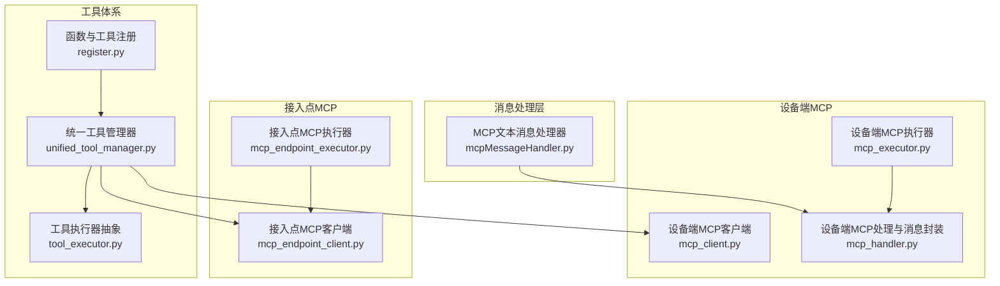
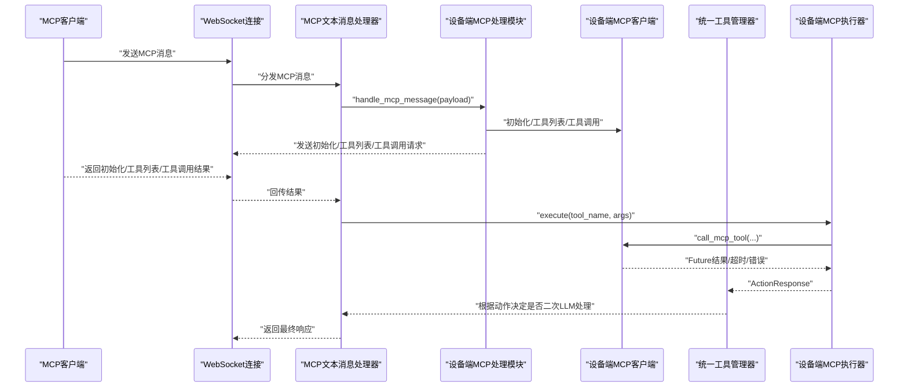
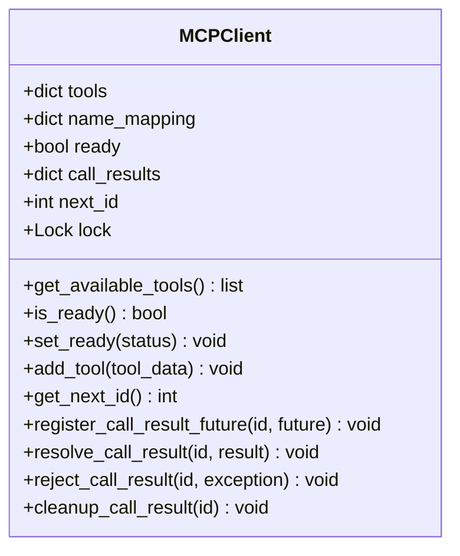
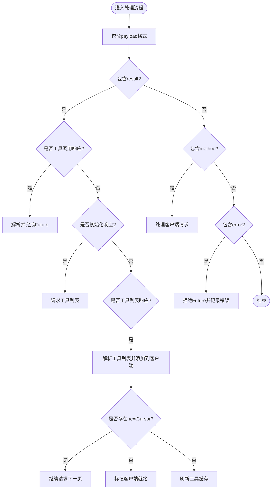
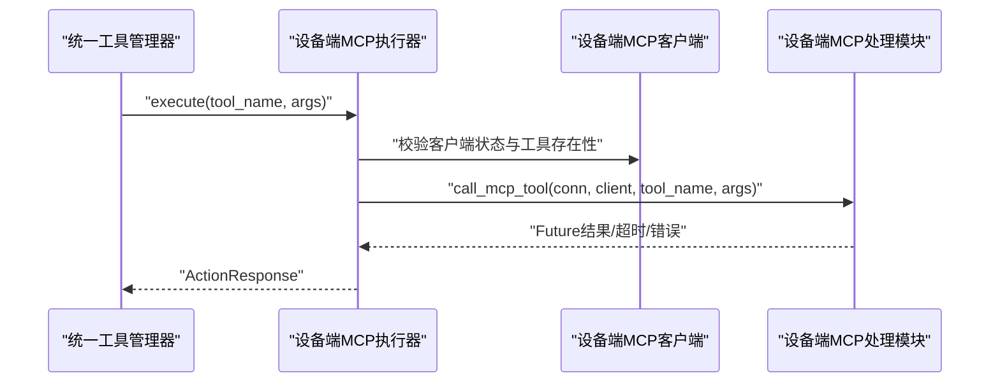
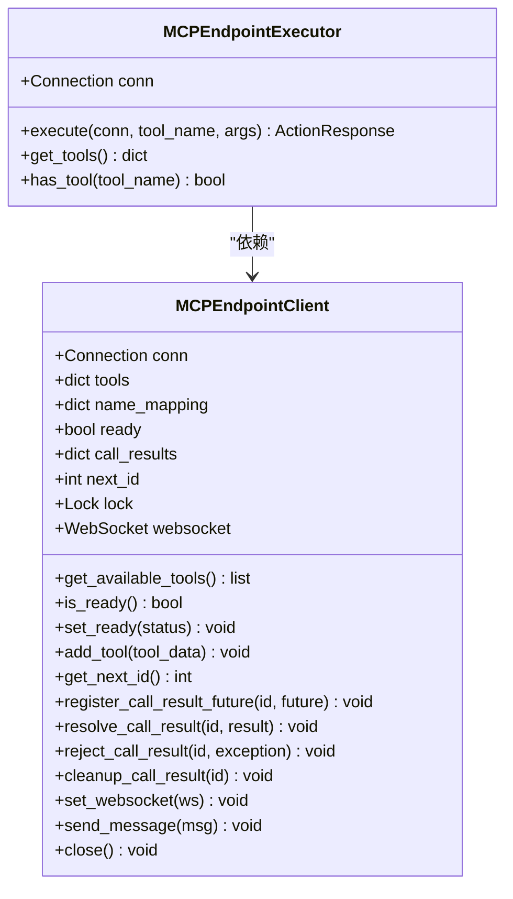
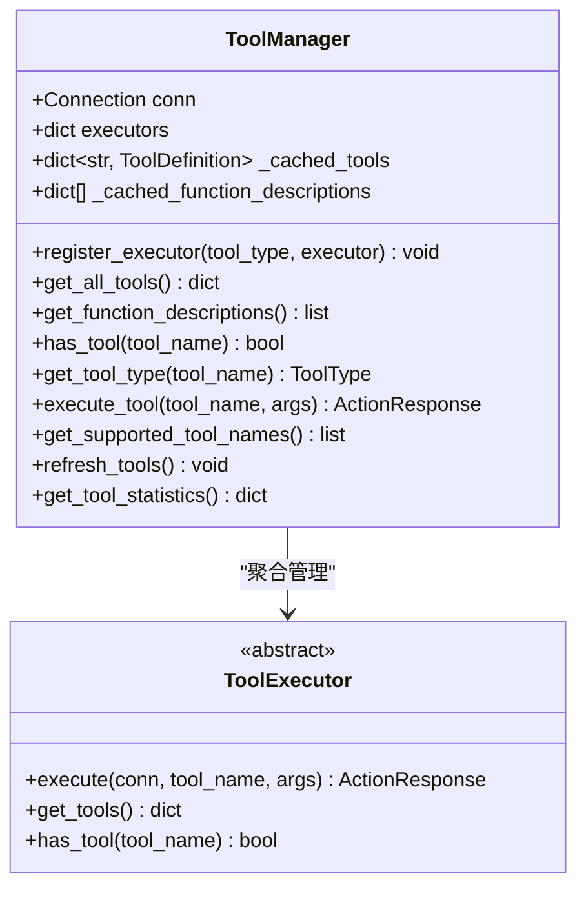
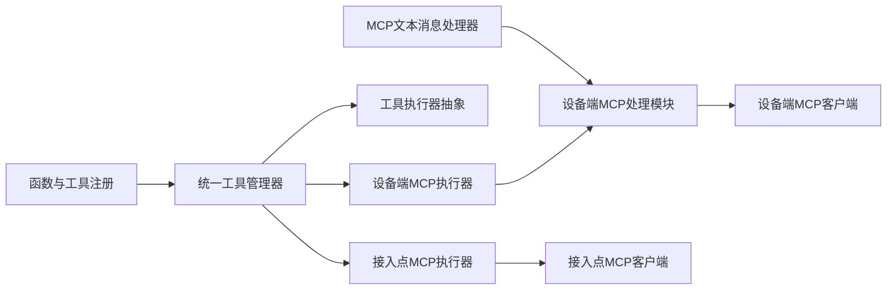

# MCP协议集成

<cite>
**本文引用的文件**
- [mcpMessageHandler.py](file://main/xiaozhi-server/core/handle/textHandler/mcpMessageHandler.py)
- [unified_tool_manager.py](file://main/xiaozhi-server/core/providers/tools/unified_tool_manager.py)
- [register.py](file://main/xiaozhi-server/plugins_func/register.py)
- [tool_executor.py](file://main/xiaozhi-server/core/providers/tools/base/tool_executor.py)
- [mcp_client.py](file://main/xiaozhi-server/core/providers/tools/device_mcp/mcp_client.py)
- [mcp_executor.py](file://main/xiaozhi-server/core/providers/tools/device_mcp/mcp_executor.py)
- [mcp_handler.py](file://main/xiaozhi-server/core/providers/tools/device_mcp/mcp_handler.py)
- [mcp_endpoint_client.py](file://main/xiaozhi-server/core/providers/tools/mcp_endpoint/mcp_endpoint_client.py)
- [mcp_endpoint_executor.py](file://main/xiaozhi-server/core/providers/tools/mcp_endpoint/mcp_endpoint_executor.py)
</cite>

## 目录
1. [简介](#简介)
2. [项目结构](#项目结构)
3. [核心组件](#核心组件)
4. [架构总览](#架构总览)
5. [详细组件分析](#详细组件分析)
6. [依赖关系分析](#依赖关系分析)
7. [性能考虑](#性能考虑)
8. [故障排查指南](#故障排查指南)
9. [结论](#结论)
10. [附录](#附录)

## 简介
本技术文档围绕小智ESP32服务器的MCP（Model Context Protocol）协议集成展开，系统性阐述MCP协议的工作原理、消息格式与通信机制；详细说明设备控制集成的实现细节、命令传输流程与状态同步机制；解释工具函数扩展的开发指南、插件注册机制与动态加载策略；阐明MCP接入点协议的架构设计、服务发现与负载均衡思路；并提供MCP客户端开发指南、SDK使用方法与最佳实践，以及协议调试工具、错误处理策略与性能优化技巧。

## 项目结构
MCP集成主要分布在以下模块：
- 文本消息处理层：负责识别与分发MCP消息至相应处理逻辑
- 工具体系与统一管理：提供工具注册、执行器抽象与统一工具管理
- 设备端MCP客户端与执行器：封装MCP初始化、工具列表拉取、工具调用与结果回传
- 接入点MCP客户端与执行器：面向外部MCP接入点的工具调用与消息转发
- 插件与注册：提供函数注册、动作响应与工具类型枚举

**图表来源**
- [mcpMessageHandler.py:1-22](file://main/xiaozhi-server/core/handle/textHandler/mcpMessageHandler.py#L1-L22)
- [unified_tool_manager.py:1-125](file://main/xiaozhi-server/core/providers/tools/unified_tool_manager.py#L1-L125)
- [register.py:1-142](file://main/xiaozhi-server/plugins_func/register.py#L1-L142)
- [tool_executor.py:1-28](file://main/xiaozhi-server/core/providers/tools/base/tool_executor.py#L1-L28)
- [mcp_client.py:1-94](file://main/xiaozhi-server/core/providers/tools/device_mcp/mcp_client.py#L1-L94)
- [mcp_executor.py:1-93](file://main/xiaozhi-server/core/providers/tools/device_mcp/mcp_executor.py#L1-L93)
- [mcp_handler.py:1-404](file://main/xiaozhi-server/core/providers/tools/device_mcp/mcp_handler.py#L1-L404)
- [mcp_endpoint_client.py:1-113](file://main/xiaozhi-server/core/providers/tools/mcp_endpoint/mcp_endpoint_client.py#L1-L113)
- [mcp_endpoint_executor.py:1-98](file://main/xiaozhi-server/core/providers/tools/mcp_endpoint/mcp_endpoint_executor.py#L1-L98)

**章节来源**
- [mcpMessageHandler.py:1-22](file://main/xiaozhi-server/core/handle/textHandler/mcpMessageHandler.py#L1-L22)
- [unified_tool_manager.py:1-125](file://main/xiaozhi-server/core/providers/tools/unified_tool_manager.py#L1-L125)
- [register.py:1-142](file://main/xiaozhi-server/plugins_func/register.py#L1-L142)
- [tool_executor.py:1-28](file://main/xiaozhi-server/core/providers/tools/base/tool_executor.py#L1-L28)
- [mcp_client.py:1-94](file://main/xiaozhi-server/core/providers/tools/device_mcp/mcp_client.py#L1-L94)
- [mcp_executor.py:1-93](file://main/xiaozhi-server/core/providers/tools/device_mcp/mcp_executor.py#L1-L93)
- [mcp_handler.py:1-404](file://main/xiaozhi-server/core/providers/tools/device_mcp/mcp_handler.py#L1-L404)
- [mcp_endpoint_client.py:1-113](file://main/xiaozhi-server/core/providers/tools/mcp_endpoint/mcp_endpoint_client.py#L1-L113)
- [mcp_endpoint_executor.py:1-98](file://main/xiaozhi-server/core/providers/tools/mcp_endpoint/mcp_endpoint_executor.py#L1-L98)

## 核心组件
- MCP文本消息处理器：识别MCP消息类型，将payload交由设备端MCP处理模块异步执行
- 统一工具管理器：聚合各类工具执行器，提供工具查询、函数描述导出、执行与缓存管理
- 工具执行器抽象：定义execute与get_tools接口，约束具体执行器行为
- 函数与工具注册：提供工具类型枚举、动作响应、函数注册表与设备类型注册表
- 设备端MCP客户端：维护可用工具列表、调用ID、结果Future、并发安全与缓存
- 设备端MCP执行器：校验客户端状态与工具存在性，封装工具调用并根据返回动作决定后续流程
- 设备端MCP处理与消息封装：负责初始化、工具列表拉取、工具调用与结果回传的完整流程
- 接入点MCP客户端：面向外部接入点的工具调用与WebSocket消息转发
- 接入点MCP执行器：对接入点工具的执行封装与动作响应

**章节来源**
- [mcpMessageHandler.py:11-22](file://main/xiaozhi-server/core/handle/textHandler/mcpMessageHandler.py#L11-L22)
- [unified_tool_manager.py:9-125](file://main/xiaozhi-server/core/providers/tools/unified_tool_manager.py#L9-L125)
- [tool_executor.py:9-28](file://main/xiaozhi-server/core/providers/tools/base/tool_executor.py#L9-L28)
- [register.py:9-142](file://main/xiaozhi-server/plugins_func/register.py#L9-L142)
- [mcp_client.py:12-94](file://main/xiaozhi-server/core/providers/tools/device_mcp/mcp_client.py#L12-L94)
- [mcp_executor.py:12-93](file://main/xiaozhi-server/core/providers/tools/device_mcp/mcp_executor.py#L12-L93)
- [mcp_handler.py:19-404](file://main/xiaozhi-server/core/providers/tools/device_mcp/mcp_handler.py#L19-L404)
- [mcp_endpoint_client.py:12-113](file://main/xiaozhi-server/core/providers/tools/mcp_endpoint/mcp_endpoint_client.py#L12-L113)
- [mcp_endpoint_executor.py:9-98](file://main/xiaozhi-server/core/providers/tools/mcp_endpoint/mcp_endpoint_executor.py#L9-L98)

## 架构总览
MCP协议在小智ESP32服务器中的集成采用“消息分发—工具管理—客户端执行”的分层架构。WebSocket接收到来自客户端的MCP消息后，由MCP文本消息处理器识别并转交给设备端MCP处理模块；设备端MCP处理模块负责初始化、工具列表拉取与工具调用；工具调用结果通过Future机制异步回传，最终由统一工具管理器与执行器决定是否需要二次LLM处理或直接返回。

**图表来源**
- [mcpMessageHandler.py:18-22](file://main/xiaozhi-server/core/handle/textHandler/mcpMessageHandler.py#L18-L22)
- [mcp_handler.py:118-237](file://main/xiaozhi-server/core/providers/tools/device_mcp/mcp_handler.py#L118-L237)
- [mcp_executor.py:18-66](file://main/xiaozhi-server/core/providers/tools/device_mcp/mcp_executor.py#L18-L66)
- [unified_tool_manager.py:73-102](file://main/xiaozhi-server/core/providers/tools/unified_tool_manager.py#L73-L102)

## 详细组件分析

### MCP消息处理与分发
- 消息类型识别：MCP文本消息处理器将消息标记为MCP类型，并将payload交由设备端MCP处理模块
- 异步处理：使用异步任务避免阻塞主线程，提升并发处理能力
- 错误兜底：当payload缺失或格式异常时，记录日志并忽略处理

**章节来源**
- [mcpMessageHandler.py:11-22](file://main/xiaozhi-server/core/handle/textHandler/mcpMessageHandler.py#L11-L22)

### 设备端MCP客户端与状态管理
- 工具缓存：维护可用工具列表，支持缓存失效与重建
- 并发安全：使用锁保护工具增删与结果Future注册
- 调用ID与结果回传：为每次工具调用分配递增ID，通过Future等待结果或超时
- 名称映射：对工具名进行清洗与映射，保证描述与调用的一致性

**图表来源**
- [mcp_client.py:12-94](file://main/xiaozhi-server/core/providers/tools/device_mcp/mcp_client.py#L12-L94)

**章节来源**
- [mcp_client.py:12-94](file://main/xiaozhi-server/core/providers/tools/device_mcp/mcp_client.py#L12-L94)

### 设备端MCP处理与消息封装
- 初始化流程：构造初始化消息，包含协议版本、能力声明与客户端信息
- 工具列表拉取：首次请求工具列表，支持游标分页继续拉取
- 工具调用：将工具名与参数封装为JSON-RPC 2.0格式，等待Future结果
- 结果解析：支持多种返回格式，必要时提取文本内容或抛出错误
- 错误处理：捕获超时、参数解析失败与工具不存在等异常

**图表来源**
- [mcp_handler.py:118-237](file://main/xiaozhi-server/core/providers/tools/device_mcp/mcp_handler.py#L118-L237)

**章节来源**
- [mcp_handler.py:118-237](file://main/xiaozhi-server/core/providers/tools/device_mcp/mcp_handler.py#L118-L237)

### 设备端MCP执行器与工具调用
- 客户端状态校验：确保MCP客户端已初始化且就绪
- 参数处理：支持字符串与字典两种参数形式，自动解析与合并JSON对象
- 动作响应：根据返回的动作类型决定是否直接回复或请求二次LLM处理
- 错误处理：对工具不存在、参数解析失败与通用异常进行分类处理

**图表来源**
- [mcp_executor.py:18-66](file://main/xiaozhi-server/core/providers/tools/device_mcp/mcp_executor.py#L18-L66)
- [mcp_handler.py:296-404](file://main/xiaozhi-server/core/providers/tools/device_mcp/mcp_handler.py#L296-L404)

**章节来源**
- [mcp_executor.py:12-93](file://main/xiaozhi-server/core/providers/tools/device_mcp/mcp_executor.py#L12-L93)
- [mcp_handler.py:296-404](file://main/xiaozhi-server/core/providers/tools/device_mcp/mcp_handler.py#L296-L404)

### 接入点MCP客户端与执行器
- 接入点客户端：维护工具列表、调用ID、结果Future与WebSocket连接
- 执行器：封装接入点工具调用，支持动作响应与错误处理
- 消息转发：通过WebSocket向接入点发送消息并关闭连接

**图表来源**
- [mcp_endpoint_client.py:12-113](file://main/xiaozhi-server/core/providers/tools/mcp_endpoint/mcp_endpoint_client.py#L12-L113)
- [mcp_endpoint_executor.py:9-98](file://main/xiaozhi-server/core/providers/tools/mcp_endpoint/mcp_endpoint_executor.py#L9-L98)

**章节来源**
- [mcp_endpoint_client.py:12-113](file://main/xiaozhi-server/core/providers/tools/mcp_endpoint/mcp_endpoint_client.py#L12-L113)
- [mcp_endpoint_executor.py:9-98](file://main/xiaozhi-server/core/providers/tools/mcp_endpoint/mcp_endpoint_executor.py#L9-L98)

### 统一工具管理器与插件注册
- 执行器注册：按工具类型注册执行器，支持缓存失效与统计
- 工具聚合：遍历各执行器获取工具定义，处理名称冲突
- 函数描述导出：输出OpenAI兼容的函数描述列表
- 动态刷新：支持刷新工具缓存，确保新工具及时生效
- 插件注册：提供函数注册装饰器与设备类型注册表，支撑动态加载

**图表来源**
- [unified_tool_manager.py:9-125](file://main/xiaozhi-server/core/providers/tools/unified_tool_manager.py#L9-L125)
- [tool_executor.py:9-28](file://main/xiaozhi-server/core/providers/tools/base/tool_executor.py#L9-L28)

**章节来源**
- [unified_tool_manager.py:9-125](file://main/xiaozhi-server/core/providers/tools/unified_tool_manager.py#L9-L125)
- [tool_executor.py:9-28](file://main/xiaozhi-server/core/providers/tools/base/tool_executor.py#L9-L28)
- [register.py:83-142](file://main/xiaozhi-server/plugins_func/register.py#L83-L142)

## 依赖关系分析
- 消息处理依赖设备端MCP处理模块，后者依赖设备端MCP客户端
- 统一工具管理器聚合各类工具执行器，设备端MCP执行器与接入点MCP执行器均继承自工具执行器抽象
- 插件注册模块为统一工具管理器提供函数注册与动作响应能力
- 设备端MCP处理模块与接入点MCP客户端分别面向不同通信场景（WebSocket与外部接入点）

**图表来源**
- [mcpMessageHandler.py:1-22](file://main/xiaozhi-server/core/handle/textHandler/mcpMessageHandler.py#L1-L22)
- [mcp_handler.py:1-404](file://main/xiaozhi-server/core/providers/tools/device_mcp/mcp_handler.py#L1-L404)
- [mcp_client.py:1-94](file://main/xiaozhi-server/core/providers/tools/device_mcp/mcp_client.py#L1-L94)
- [unified_tool_manager.py:1-125](file://main/xiaozhi-server/core/providers/tools/unified_tool_manager.py#L1-L125)
- [tool_executor.py:1-28](file://main/xiaozhi-server/core/providers/tools/base/tool_executor.py#L1-L28)
- [mcp_executor.py:1-93](file://main/xiaozhi-server/core/providers/tools/device_mcp/mcp_executor.py#L1-L93)
- [mcp_endpoint_client.py:1-113](file://main/xiaozhi-server/core/providers/tools/mcp_endpoint/mcp_endpoint_client.py#L1-L113)
- [mcp_endpoint_executor.py:1-98](file://main/xiaozhi-server/core/providers/tools/mcp_endpoint/mcp_endpoint_executor.py#L1-L98)
- [register.py:1-142](file://main/xiaozhi-server/plugins_func/register.py#L1-L142)

**章节来源**
- [mcpMessageHandler.py:1-22](file://main/xiaozhi-server/core/handle/textHandler/mcpMessageHandler.py#L1-L22)
- [mcp_handler.py:1-404](file://main/xiaozhi-server/core/providers/tools/device_mcp/mcp_handler.py#L1-L404)
- [mcp_client.py:1-94](file://main/xiaozhi-server/core/providers/tools/device_mcp/mcp_client.py#L1-L94)
- [unified_tool_manager.py:1-125](file://main/xiaozhi-server/core/providers/tools/unified_tool_manager.py#L1-L125)
- [tool_executor.py:1-28](file://main/xiaozhi-server/core/providers/tools/base/tool_executor.py#L1-L28)
- [mcp_executor.py:1-93](file://main/xiaozhi-server/core/providers/tools/device_mcp/mcp_executor.py#L1-L93)
- [mcp_endpoint_client.py:1-113](file://main/xiaozhi-server/core/providers/tools/mcp_endpoint/mcp_endpoint_client.py#L1-L113)
- [mcp_endpoint_executor.py:1-98](file://main/xiaozhi-server/core/providers/tools/mcp_endpoint/mcp_endpoint_executor.py#L1-L98)
- [register.py:1-142](file://main/xiaozhi-server/plugins_func/register.py#L1-L142)

## 性能考虑
- 异步处理：消息处理与工具调用均采用异步模式，减少阻塞，提升吞吐
- 缓存策略：设备端MCP客户端对可用工具列表进行缓存，避免重复构建
- 并发安全：使用锁保护共享状态，防止竞态条件
- 参数解析：对复杂字符串参数进行正则匹配与合并，提高容错性
- 超时控制：工具调用设置超时时间，避免长时间占用资源

[本节为通用性能建议，无需特定文件来源]

## 故障排查指南
- 初始化失败：确认客户端是否支持MCP特性，检查初始化消息是否正确发送
- 工具列表为空：验证工具列表请求与游标分页逻辑，确保所有工具均已加载
- 工具调用超时：检查网络延迟与外部服务响应时间，适当调整超时阈值
- 参数解析错误：核对参数格式，确保为有效JSON或可解析的字符串
- 动作响应异常：根据返回的动作类型判断是否需要二次LLM处理或直接回复

**章节来源**
- [mcp_handler.py:103-116](file://main/xiaozhi-server/core/providers/tools/device_mcp/mcp_handler.py#L103-L116)
- [mcp_handler.py:296-404](file://main/xiaozhi-server/core/providers/tools/device_mcp/mcp_handler.py#L296-L404)
- [mcp_executor.py:18-66](file://main/xiaozhi-server/core/providers/tools/device_mcp/mcp_executor.py#L18-L66)

## 结论
小智ESP32服务器的MCP协议集成为设备控制与外部接入点提供了标准化、可扩展的工具调用框架。通过消息分发、工具管理与客户端执行的分层设计，系统实现了高并发、强容错与良好的可维护性。未来可在服务发现与负载均衡方面进一步完善，以支持更大规模的接入点集群。

[本节为总结性内容，无需特定文件来源]

## 附录
- MCP消息格式要点
  - JSON-RPC 2.0：使用id、method与params字段
  - 初始化：包含协议版本与能力声明
  - 工具列表：支持游标分页
  - 工具调用：携带工具名与参数
- 开发与调试建议
  - 使用日志级别区分调试与生产环境
  - 对关键路径增加超时与重试策略
  - 在统一工具管理器中定期刷新工具缓存，确保新工具及时生效

[本节为概念性内容，无需特定文件来源]