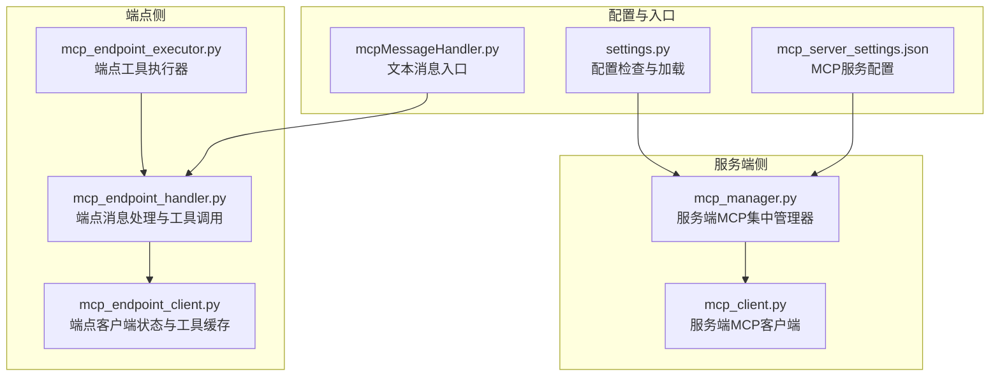
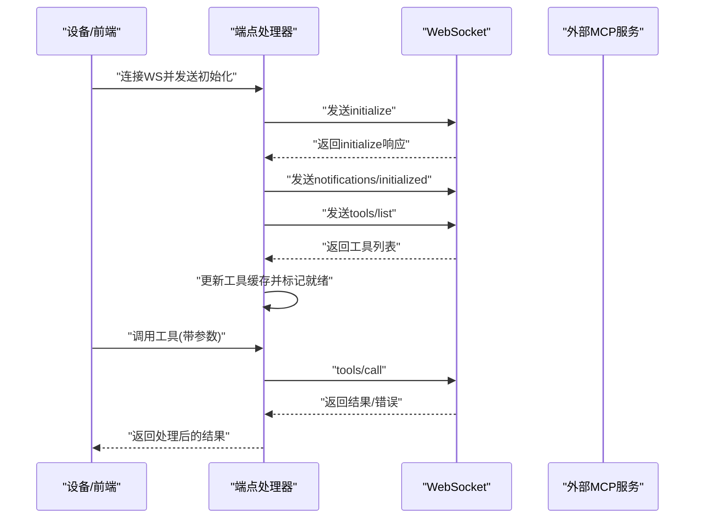
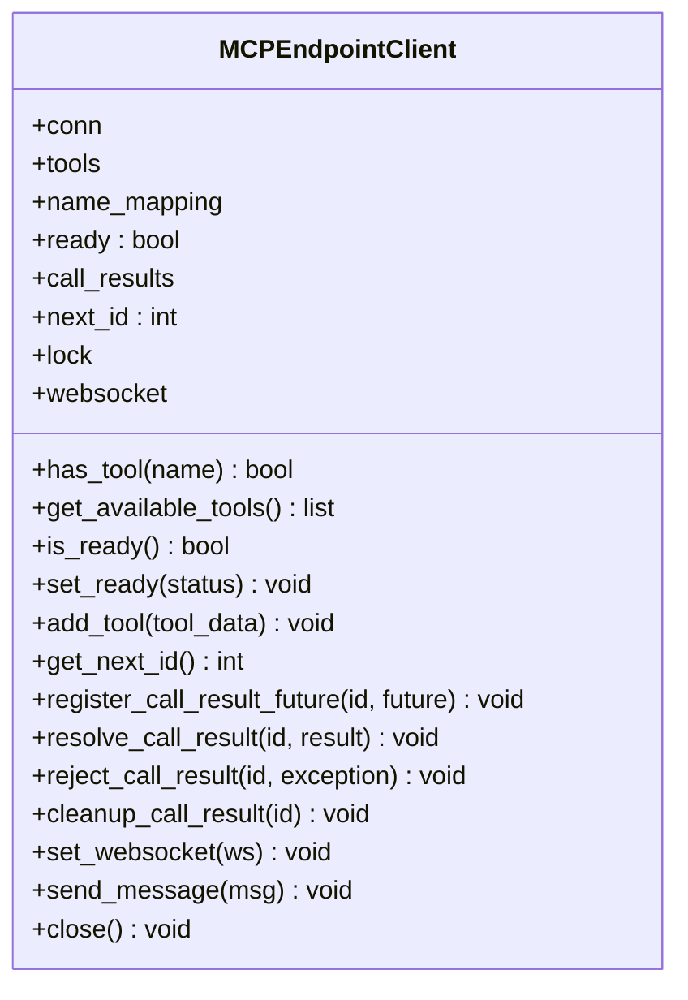
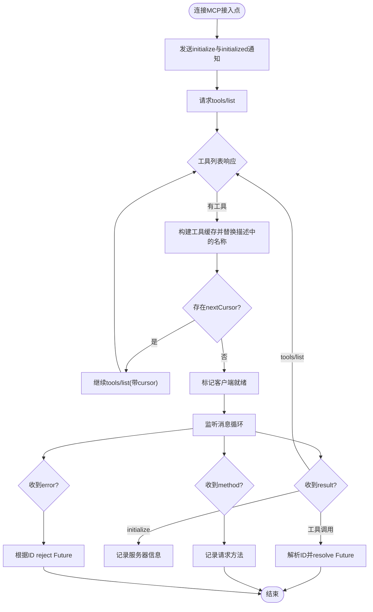
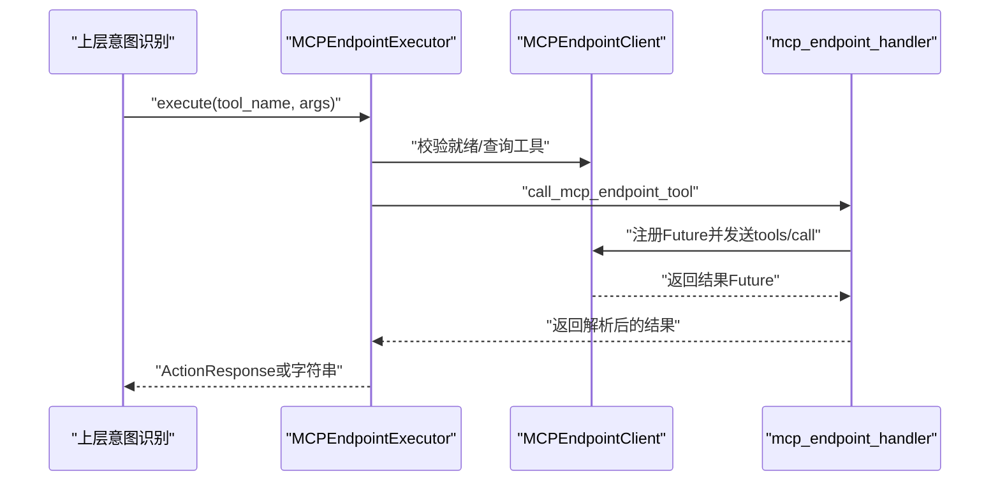
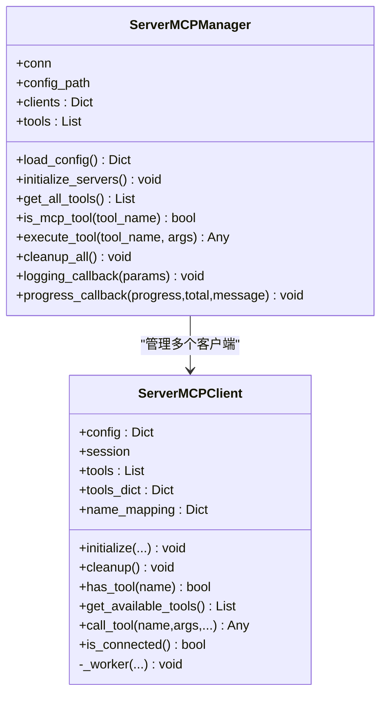
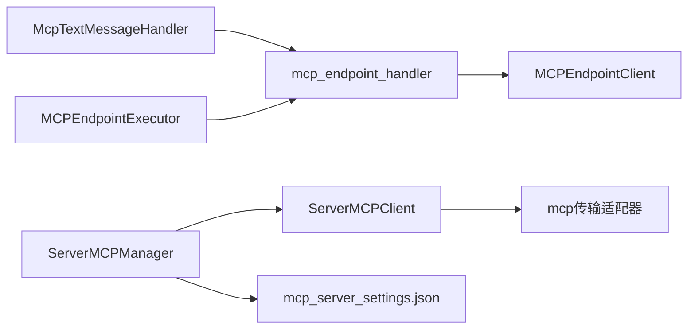

# MCP端点协议

<cite>
**本文引用的文件**
- [mcp_endpoint_handler.py](file://main/xiaozhi-server/core/providers/tools/mcp_endpoint/mcp_endpoint_handler.py)
- [mcp_endpoint_client.py](file://main/xiaozhi-server/core/providers/tools/mcp_endpoint/mcp_endpoint_client.py)
- [mcp_endpoint_executor.py](file://main/xiaozhi-server/core/providers/tools/mcp_endpoint/mcp_endpoint_executor.py)
- [mcp_server_settings.json](file://main/xiaozhi-server/mcp_server_settings.json)
- [settings.py](file://main/xiaozhi-server/config/settings.py)
- [mcp_manager.py](file://main/xiaozhi-server/core/providers/tools/server_mcp/mcp_manager.py)
- [mcp_client.py](file://main/xiaozhi-server/core/providers/tools/server_mcp/mcp_client.py)
- [mcpMessageHandler.py](file://main/xiaozhi-server/core/handle/textHandler/mcpMessageHandler.py)
- [mcp-endpoint-integration.md](file://docs/mcp-endpoint-integration.md)
- [global-tool-manager.md](file://main/xiaozhi-server/docs/refactor/global-tool-manager.md)
</cite>

## 目录
1. [简介](#简介)
2. [项目结构](#项目结构)
3. [核心组件](#核心组件)
4. [架构总览](#架构总览)
5. [详细组件分析](#详细组件分析)
6. [依赖关系分析](#依赖关系分析)
7. [性能考量](#性能考量)
8. [故障排查指南](#故障排查指南)
9. [结论](#结论)
10. [附录](#附录)

## 简介
本文件系统性阐述MCP（Model Context Protocol）端点协议在本项目中的实现与应用，覆盖架构设计、服务发现与负载均衡策略、端点客户端的连接管理与会话维护、断线重连机制、端点处理器的消息路由与协议转换、安全与访问控制、配置与性能调优、监控方案、典型应用场景以及调试与日志分析方法。文档面向不同层次读者，既提供高层概览，也给出代码级细节与可视化图示，帮助快速理解与落地实施。

## 项目结构
围绕MCP端点协议的关键代码主要分布在以下位置：
- 端点客户端与处理器：core/providers/tools/mcp_endpoint
- 服务端MCP管理与客户端：core/providers/tools/server_mcp
- 配置与设置：mcp_server_settings.json、config/settings.py
- 文本消息入口与路由：core/handle/textHandler/mcpMessageHandler.py
- 集成与使用指南：docs/mcp-endpoint-integration.md
- 工具管理重构文档：docs/refactor/global-tool-manager.md

**图表来源**
- [mcp_endpoint_handler.py:1-393](file://main/xiaozhi-server/core/providers/tools/mcp_endpoint/mcp_endpoint_handler.py#L1-L393)
- [mcp_endpoint_client.py:1-113](file://main/xiaozhi-server/core/providers/tools/mcp_endpoint/mcp_endpoint_client.py#L1-L113)
- [mcp_endpoint_executor.py:1-98](file://main/xiaozhi-server/core/providers/tools/mcp_endpoint/mcp_endpoint_executor.py#L1-L98)
- [mcp_manager.py:1-194](file://main/xiaozhi-server/core/providers/tools/server_mcp/mcp_manager.py#L1-L194)
- [mcp_client.py:1-262](file://main/xiaozhi-server/core/providers/tools/server_mcp/mcp_client.py#L1-L262)
- [mcp_server_settings.json:1-57](file://main/xiaozhi-server/mcp_server_settings.json#L1-L57)
- [settings.py:1-34](file://main/xiaozhi-server/config/settings.py#L1-L34)
- [mcpMessageHandler.py:1-22](file://main/xiaozhi-server/core/handle/textHandler/mcpMessageHandler.py#L1-L22)

**章节来源**
- [mcp_endpoint_handler.py:1-393](file://main/xiaozhi-server/core/providers/tools/mcp_endpoint/mcp_endpoint_handler.py#L1-L393)
- [mcp_endpoint_client.py:1-113](file://main/xiaozhi-server/core/providers/tools/mcp_endpoint/mcp_endpoint_client.py#L1-L113)
- [mcp_endpoint_executor.py:1-98](file://main/xiaozhi-server/core/providers/tools/mcp_endpoint/mcp_endpoint_executor.py#L1-L98)
- [mcp_manager.py:1-194](file://main/xiaozhi-server/core/providers/tools/server_mcp/mcp_manager.py#L1-L194)
- [mcp_client.py:1-262](file://main/xiaozhi-server/core/providers/tools/server_mcp/mcp_client.py#L1-L262)
- [mcp_server_settings.json:1-57](file://main/xiaozhi-server/mcp_server_settings.json#L1-L57)
- [settings.py:1-34](file://main/xiaozhi-server/config/settings.py#L1-L34)
- [mcpMessageHandler.py:1-22](file://main/xiaozhi-server/core/handle/textHandler/mcpMessageHandler.py#L1-L22)

## 核心组件
- 端点客户端（MCPEndpointClient）：负责维护WebSocket连接、工具缓存、消息ID分配、工具调用结果的异步等待与解析、就绪状态管理。
- 端点处理器（mcp_endpoint_handler）：负责连接MCP端点、发送初始化与通知、拉取工具列表、处理端点返回的工具与错误消息、封装工具调用流程。
- 端点工具执行器（MCPEndpointExecutor）：将MCP端点工具暴露为统一工具接口，供上层意图识别与对话流程调用。
- 服务端MCP管理器（ServerMCPManager）：集中管理多个服务端MCP服务，提供工具聚合、重连与超时控制、回调与清理。
- 服务端MCP客户端（ServerMCPClient）：支持stdio、SSE、Streamable HTTP三种传输模式，负责工具发现、会话生命周期与工具调用。
- 文本消息入口（McpTextMessageHandler）：将来自设备端的MCP消息转发至端点处理器。
- 配置与设置（mcp_server_settings.json、settings.py）：提供MCP服务清单与配置校验。

**章节来源**
- [mcp_endpoint_client.py:12-113](file://main/xiaozhi-server/core/providers/tools/mcp_endpoint/mcp_endpoint_client.py#L12-L113)
- [mcp_endpoint_handler.py:14-393](file://main/xiaozhi-server/core/providers/tools/mcp_endpoint/mcp_endpoint_handler.py#L14-L393)
- [mcp_endpoint_executor.py:9-98](file://main/xiaozhi-server/core/providers/tools/mcp_endpoint/mcp_endpoint_executor.py#L9-L98)
- [mcp_manager.py:18-194](file://main/xiaozhi-server/core/providers/tools/server_mcp/mcp_manager.py#L18-L194)
- [mcp_client.py:26-262](file://main/xiaozhi-server/core/providers/tools/server_mcp/mcp_client.py#L26-L262)
- [mcpMessageHandler.py:11-22](file://main/xiaozhi-server/core/handle/textHandler/mcpMessageHandler.py#L11-L22)
- [mcp_server_settings.json:1-57](file://main/xiaozhi-server/mcp_server_settings.json#L1-L57)
- [settings.py:9-34](file://main/xiaozhi-server/config/settings.py#L9-L34)

## 架构总览
MCP端点协议在本项目中采用“端点侧”与“服务端侧”双通道协同：
- 端点侧：设备/前端通过WebSocket连接到本项目的MCP接入点，由端点处理器完成初始化、工具列表拉取、工具调用与错误处理。
- 服务端侧：本项目作为MCP客户端，连接外部MCP服务（stdio/SSE/Streamable HTTP），聚合工具并提供统一调用能力；同时支持多实例与重连策略。

**图表来源**
- [mcp_endpoint_handler.py:14-393](file://main/xiaozhi-server/core/providers/tools/mcp_endpoint/mcp_endpoint_handler.py#L14-L393)
- [mcp_endpoint_client.py:12-113](file://main/xiaozhi-server/core/providers/tools/mcp_endpoint/mcp_endpoint_client.py#L12-L113)

**章节来源**
- [mcp_endpoint_handler.py:14-393](file://main/xiaozhi-server/core/providers/tools/mcp_endpoint/mcp_endpoint_handler.py#L14-L393)
- [mcp_endpoint_client.py:12-113](file://main/xiaozhi-server/core/providers/tools/mcp_endpoint/mcp_endpoint_client.py#L12-L113)

## 详细组件分析

### 端点客户端（MCPEndpointClient）
- 连接与状态：持有WebSocket实例，维护就绪标志位，提供异步锁保证并发安全。
- 工具缓存：以“净化后的工具名”为键缓存工具定义，支持动态刷新与描述替换。
- 调用管理：为每个工具调用分配递增ID，注册Future等待结果，支持超时清理与错误回传。
- 发送与关闭：统一封装消息发送与连接关闭逻辑。

**图表来源**
- [mcp_endpoint_client.py:12-113](file://main/xiaozhi-server/core/providers/tools/mcp_endpoint/mcp_endpoint_client.py#L12-L113)

**章节来源**
- [mcp_endpoint_client.py:12-113](file://main/xiaozhi-server/core/providers/tools/mcp_endpoint/mcp_endpoint_client.py#L12-L113)

### 端点处理器（mcp_endpoint_handler）
- 连接与初始化：建立WebSocket连接，发送initialize与notifications/initialized，随后请求tools/list。
- 工具列表处理：解析工具数组，构建输入Schema，更新工具缓存并标记就绪；支持分页cursor继续拉取。
- 方法与错误处理：区分result/method/error路径，对工具调用响应与端点主动请求分别处理；错误消息携带ID时回传给对应Future。
- 工具调用：构造tools/call请求，解析返回的文本内容或通用结果，支持超时与异常处理。

**图表来源**
- [mcp_endpoint_handler.py:45-222](file://main/xiaozhi-server/core/providers/tools/mcp_endpoint/mcp_endpoint_handler.py#L45-L222)

**章节来源**
- [mcp_endpoint_handler.py:45-222](file://main/xiaozhi-server/core/providers/tools/mcp_endpoint/mcp_endpoint_handler.py#L45-L222)

### 端点工具执行器（MCPEndpointExecutor）
- 工具暴露：从端点客户端读取可用工具，构造统一工具定义。
- 执行流程：校验客户端就绪状态，序列化参数，调用端点工具，解析返回结果（优先ActionResponse），否则回退到二次LLM处理。
- 错误处理：捕获未找到与异常，返回标准化错误响应。

**图表来源**
- [mcp_endpoint_executor.py:15-66](file://main/xiaozhi-server/core/providers/tools/mcp_endpoint/mcp_endpoint_executor.py#L15-L66)
- [mcp_endpoint_handler.py:286-393](file://main/xiaozhi-server/core/providers/tools/mcp_endpoint/mcp_endpoint_handler.py#L286-L393)
- [mcp_endpoint_client.py:74-96](file://main/xiaozhi-server/core/providers/tools/mcp_endpoint/mcp_endpoint_client.py#L74-L96)

**章节来源**
- [mcp_endpoint_executor.py:15-66](file://main/xiaozhi-server/core/providers/tools/mcp_endpoint/mcp_endpoint_executor.py#L15-L66)
- [mcp_endpoint_handler.py:286-393](file://main/xiaozhi-server/core/providers/tools/mcp_endpoint/mcp_endpoint_handler.py#L286-L393)
- [mcp_endpoint_client.py:74-96](file://main/xiaozhi-server/core/providers/tools/mcp_endpoint/mcp_endpoint_client.py#L74-L96)

### 服务端MCP管理器与客户端
- 管理器职责：加载配置、并发初始化多个服务端MCP客户端、聚合工具、执行工具调用并具备重试与重连能力。
- 客户端能力：支持stdio、SSE、Streamable HTTP三种传输；自动发现工具、维护名称映射、提供工具调用与清理。
- 回调与监控：提供日志与进度回调，便于集成监控与可观测性。

**图表来源**
- [mcp_manager.py:18-194](file://main/xiaozhi-server/core/providers/tools/server_mcp/mcp_manager.py#L18-L194)
- [mcp_client.py:26-262](file://main/xiaozhi-server/core/providers/tools/server_mcp/mcp_client.py#L26-L262)

**章节来源**
- [mcp_manager.py:18-194](file://main/xiaozhi-server/core/providers/tools/server_mcp/mcp_manager.py#L18-L194)
- [mcp_client.py:26-262](file://main/xiaozhi-server/core/providers/tools/server_mcp/mcp_client.py#L26-L262)

### 文本消息入口与路由
- 入口处理器：识别MCP消息类型，将payload交由端点消息处理逻辑异步执行，避免阻塞主消息循环。

**章节来源**
- [mcpMessageHandler.py:11-22](file://main/xiaozhi-server/core/handle/textHandler/mcpMessageHandler.py#L11-L22)

### 配置与设置
- MCP服务配置：通过JSON文件声明多种MCP服务（命令行、SSE、Streamable HTTP），支持headers与transport类型。
- 配置检查：启动时校验配置文件存在性与来源，防止混用本地与API配置导致冲突。

**章节来源**
- [mcp_server_settings.json:1-57](file://main/xiaozhi-server/mcp_server_settings.json#L1-L57)
- [settings.py:9-34](file://main/xiaozhi-server/config/settings.py#L9-L34)

## 依赖关系分析
- 端点侧依赖：端点处理器依赖端点客户端与websockets库；工具执行器依赖端点处理器与统一工具框架。
- 服务端侧依赖：管理器依赖客户端与配置加载；客户端依赖mcp库与传输适配器（stdio/sse/streamable-http）。
- 入口依赖：文本消息处理器依赖端点消息处理逻辑。

**图表来源**
- [mcpMessageHandler.py:18-22](file://main/xiaozhi-server/core/handle/textHandler/mcpMessageHandler.py#L18-L22)
- [mcp_endpoint_handler.py:14-393](file://main/xiaozhi-server/core/providers/tools/mcp_endpoint/mcp_endpoint_handler.py#L14-L393)
- [mcp_endpoint_client.py:12-113](file://main/xiaozhi-server/core/providers/tools/mcp_endpoint/mcp_endpoint_client.py#L12-L113)
- [mcp_endpoint_executor.py:15-66](file://main/xiaozhi-server/core/providers/tools/mcp_endpoint/mcp_endpoint_executor.py#L15-L66)
- [mcp_manager.py:18-194](file://main/xiaozhi-server/core/providers/tools/server_mcp/mcp_manager.py#L18-L194)
- [mcp_client.py:26-262](file://main/xiaozhi-server/core/providers/tools/server_mcp/mcp_client.py#L26-L262)
- [mcp_server_settings.json:1-57](file://main/xiaozhi-server/mcp_server_settings.json#L1-L57)

**章节来源**
- [mcpMessageHandler.py:11-22](file://main/xiaozhi-server/core/handle/textHandler/mcpMessageHandler.py#L11-L22)
- [mcp_endpoint_handler.py:14-393](file://main/xiaozhi-server/core/providers/tools/mcp_endpoint/mcp_endpoint_handler.py#L14-L393)
- [mcp_endpoint_client.py:12-113](file://main/xiaozhi-server/core/providers/tools/mcp_endpoint/mcp_endpoint_client.py#L12-L113)
- [mcp_endpoint_executor.py:15-66](file://main/xiaozhi-server/core/providers/tools/mcp_endpoint/mcp_endpoint_executor.py#L15-L66)
- [mcp_manager.py:18-194](file://main/xiaozhi-server/core/providers/tools/server_mcp/mcp_manager.py#L18-L194)
- [mcp_client.py:26-262](file://main/xiaozhi-server/core/providers/tools/server_mcp/mcp_client.py#L26-L262)
- [mcp_server_settings.json:1-57](file://main/xiaozhi-server/mcp_server_settings.json#L1-L57)

## 性能考量
- 并发与锁：端点客户端使用异步锁保护共享状态，避免竞态；工具缓存按需失效与重建，降低重复计算。
- 异步等待与超时：工具调用采用Future与超时机制，防止长时间阻塞；错误发生时及时清理挂起调用。
- 并行初始化：服务端管理器并发初始化多个MCP客户端，缩短启动时间。
- 传输优化：服务端客户端支持Streamable HTTP，适合生产环境的高吞吐场景；SSE提供兼容性与可观察性。
- 日志与回调：通过回调输出进度与日志，便于性能监控与问题定位。

[本节为通用性能指导，无需特定文件引用]

## 故障排查指南
- 连接失败
  - 检查MCP接入点URL与token有效性；确认网络可达与防火墙放行。
  - 查看端点处理器的日志，关注连接关闭与异常堆栈。
- 工具不可用
  - 确认tools/list响应格式正确且包含工具；检查名称映射与缓存刷新。
  - 若存在nextCursor，确认继续请求流程已执行。
- 调用超时
  - 提升超时阈值或优化下游MCP服务性能；检查Future清理逻辑。
- 服务端MCP异常
  - 使用管理器的重试与重连策略；核对配置文件与传输类型。
  - 通过日志回调与进度回调定位耗时环节。

**章节来源**
- [mcp_endpoint_handler.py:40-42](file://main/xiaozhi-server/core/providers/tools/mcp_endpoint/mcp_endpoint_handler.py#L40-L42)
- [mcp_endpoint_handler.py:215-222](file://main/xiaozhi-server/core/providers/tools/mcp_endpoint/mcp_endpoint_handler.py#L215-L222)
- [mcp_manager.py:115-176](file://main/xiaozhi-server/core/providers/tools/server_mcp/mcp_manager.py#L115-L176)

## 结论
本项目通过端点侧与服务端侧的MCP协议实现，提供了灵活的工具扩展能力与良好的可运维性。端点侧聚焦于设备/前端的实时交互与工具调用，服务端侧则承担多源MCP服务的聚合与治理。配合完善的配置、监控与重试机制，可在多服务器部署、集群管理与高可用架构中稳定运行。

[本节为总结性内容，无需特定文件引用]

## 附录

### 安全机制、身份验证与访问控制
- 认证与授权
  - 端点侧：接入点地址通常携带token参数，用于设备端鉴权；建议结合网关或反向代理限制来源IP与速率。
  - 服务端侧：MCP服务可通过headers传递Authorization，支持Bearer Token；注意敏感信息的环境变量注入与最小权限原则。
- 数据安全
  - 建议在生产环境使用TLS加密传输（WS/WSS、HTTP/HTTPS）。
  - 对工具参数进行严格校验与白名单过滤，避免注入风险。
- 访问控制
  - 在网关层实现基于角色的访问控制（RBAC），限制对MCP接入点与服务端MCP的访问范围。

[本节为通用安全指导，无需特定文件引用]

### 配置指南与最佳实践
- 端点侧配置
  - 在设备端或前端配置正确的MCP接入点地址与token；确保初始化与工具列表请求顺序正确。
- 服务端侧配置
  - 在配置文件中声明MCP服务，选择合适的传输模式（SSE/Streamable HTTP）；为每个服务设置合理的超时与重试参数。
- 工具管理
  - 使用工具缓存与名称映射，避免重复加载；定期刷新工具列表以适应动态变化。

**章节来源**
- [mcp_server_settings.json:1-57](file://main/xiaozhi-server/mcp_server_settings.json#L1-L57)
- [settings.py:9-34](file://main/xiaozhi-server/config/settings.py#L9-L34)
- [mcp_endpoint_handler.py:177-189](file://main/xiaozhi-server/core/providers/tools/mcp_endpoint/mcp_endpoint_handler.py#L177-L189)

### 性能调优与监控
- 调优要点
  - 合理设置工具调用超时与重试间隔；并发初始化服务端MCP客户端时注意资源上限。
  - 传输模式选择：生产环境优先考虑Streamable HTTP；SSE便于调试与低延迟场景。
- 监控方案
  - 通过日志回调与进度回调输出关键指标（连接状态、工具调用耗时、错误率）。
  - 集成APM/日志平台，对异常与慢调用进行告警。

**章节来源**
- [mcp_manager.py:189-194](file://main/xiaozhi-server/core/providers/tools/server_mcp/mcp_manager.py#L189-L194)
- [mcp_client.py:204-226](file://main/xiaozhi-server/core/providers/tools/server_mcp/mcp_client.py#L204-L226)

### 实际应用场景
- 多服务器部署
  - 通过服务端MCP管理器统一管理多个MCP服务实例，实现横向扩展与故障隔离。
- 集群管理
  - 结合负载均衡与健康检查，确保MCP服务高可用；利用重连与重试提升稳定性。
- 高可用架构
  - 端点侧与服务端侧均支持断线重连与超时控制，满足生产级SLA要求。

**章节来源**
- [mcp_manager.py:78-100](file://main/xiaozhi-server/core/providers/tools/server_mcp/mcp_manager.py#L78-L100)
- [mcp_client.py:165-262](file://main/xiaozhi-server/core/providers/tools/server_mcp/mcp_client.py#L165-L262)

### 调试工具与日志分析
- 调试入口
  - 使用文档提供的MCP接入点使用指南，快速验证端点连接与工具可用性。
- 日志分析
  - 关注端点处理器与服务端客户端的关键日志节点（初始化、工具列表、调用结果、错误与重连）。
  - 结合回调输出的进度与日志，定位性能瓶颈与异常路径。

**章节来源**
- [mcp-endpoint-integration.md:1-94](file://docs/mcp-endpoint-integration.md#L1-L94)
- [mcp_endpoint_handler.py:215-222](file://main/xiaozhi-server/core/providers/tools/mcp_endpoint/mcp_endpoint_handler.py#L215-L222)
- [mcp_manager.py:189-194](file://main/xiaozhi-server/core/providers/tools/server_mcp/mcp_manager.py#L189-L194)