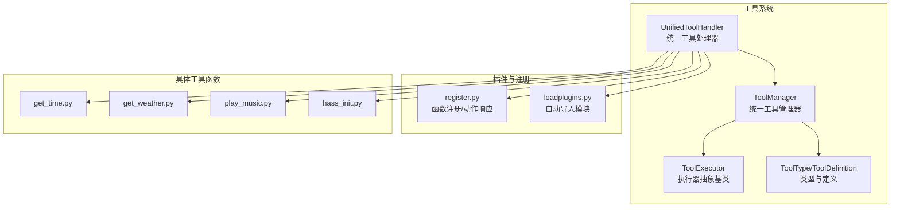
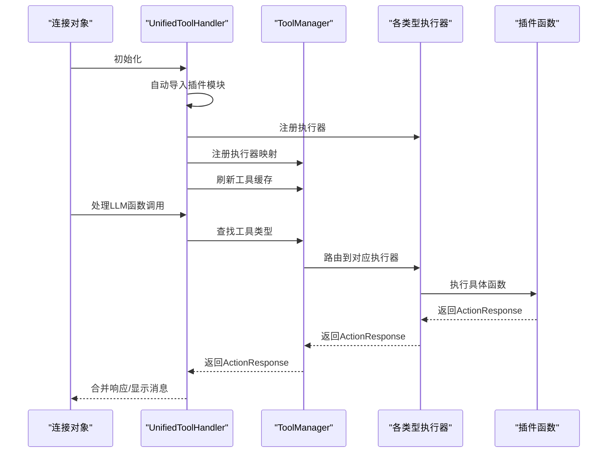
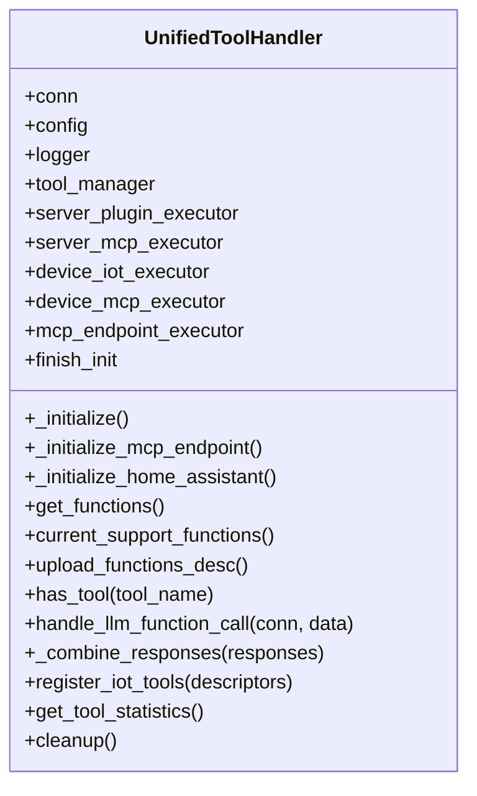
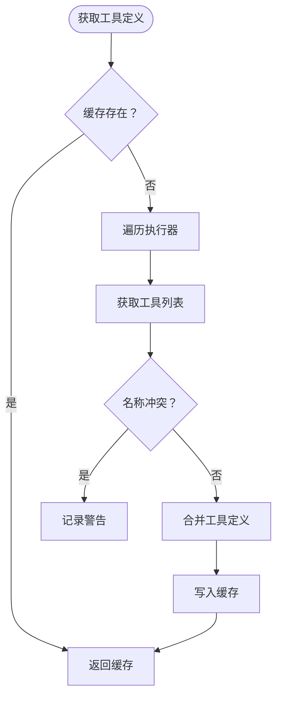
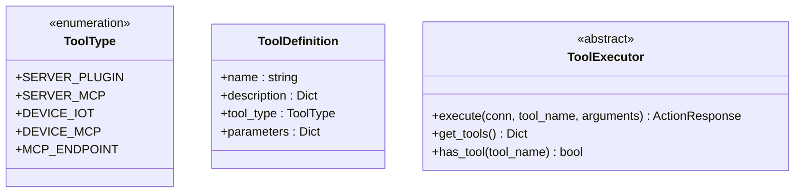
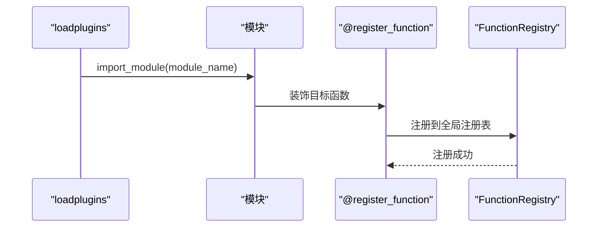
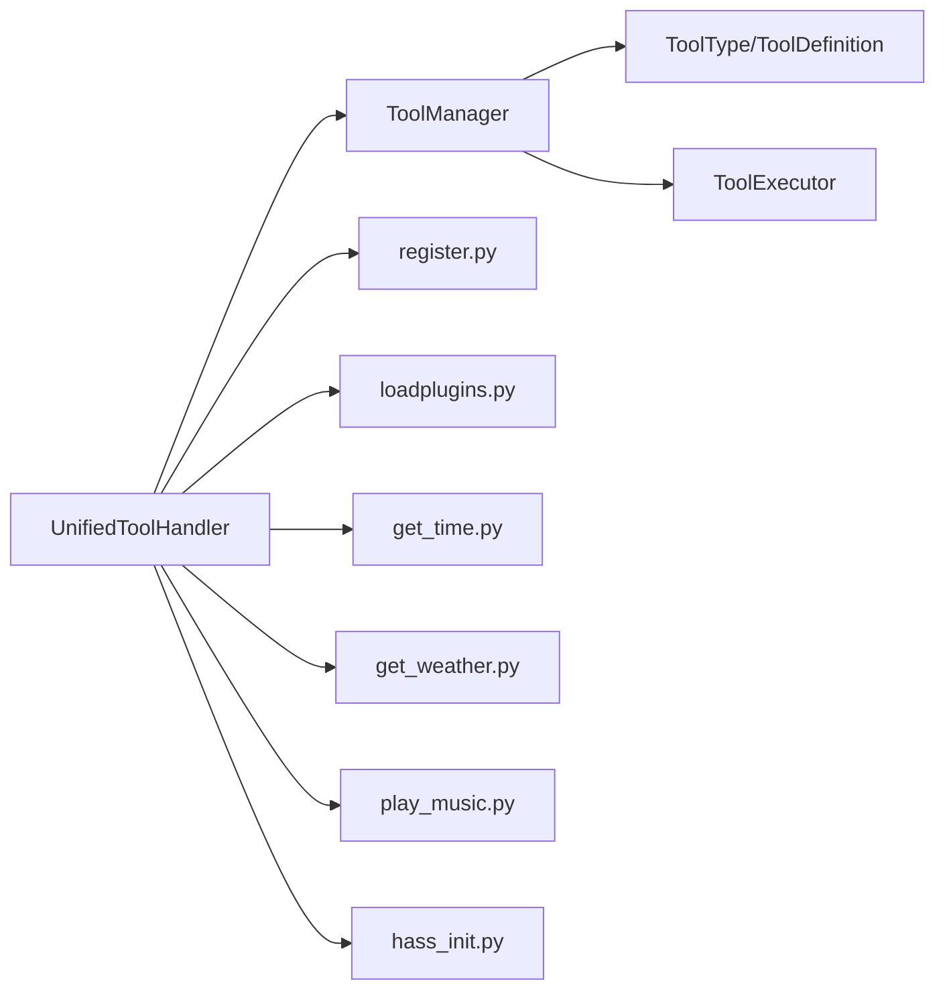

# 工具函数扩展

<cite>
**本文引用的文件**
- [unified_tool_handler.py](file://main/xiaozhi-server/core/providers/tools/unified_tool_handler.py)
- [unified_tool_manager.py](file://main/xiaozhi-server/core/providers/tools/unified_tool_manager.py)
- [tool_types.py](file://main/xiaozhi-server/core/providers/tools/base/tool_types.py)
- [tool_executor.py](file://main/xiaozhi-server/core/providers/tools/base/tool_executor.py)
- [register.py](file://main/xiaozhi-server/plugins_func/register.py)
- [loadplugins.py](file://main/xiaozhi-server/plugins_func/loadplugins.py)
- [get_time.py](file://main/xiaozhi-server/plugins_func/functions/get_time.py)
- [get_weather.py](file://main/xiaozhi-server/plugins_func/functions/get_weather.py)
- [play_music.py](file://main/xiaozhi-server/plugins_func/functions/play_music.py)
- [hass_init.py](file://main/xiaozhi-server/plugins_func/functions/hass_init.py)
- [global-tool-manager.md](file://main/xiaozhi-server/docs/refactor/global-tool-manager.md)
- [工具函数注册机制详解.md](file://main/xiaozhi-server/docs/llm/工具函数注册机制详解.md)
</cite>

## 目录
1. [简介](#简介)
2. [项目结构](#项目结构)
3. [核心组件](#核心组件)
4. [架构总览](#架构总览)
5. [详细组件分析](#详细组件分析)
6. [依赖分析](#依赖分析)
7. [性能考量](#性能考量)
8. [故障排查指南](#故障排查指南)
9. [结论](#结论)
10. [附录](#附录)

## 简介
本指南面向希望在MCP协议生态中扩展工具函数的开发者，系统讲解工具函数的注册机制、生命周期管理、动态加载策略、统一工具处理器设计模式、工具接口规范与参数传递机制、工具分类与优先级管理、冲突解决策略，以及从接口定义、实现规范、测试验证到部署发布的完整开发流程。文档还提供系统命令执行、文件操作、网络请求、数据处理等常见工具函数的开发示例，并说明安全考虑、权限控制与资源限制机制。

## 项目结构
工具函数扩展位于服务端Python工程的工具子系统中，核心围绕统一工具处理器与统一工具管理器展开，配合插件注册与自动加载机制，形成可扩展的工具生态。关键目录与文件如下：
- 统一工具层：统一工具处理器与统一工具管理器
- 工具类型与执行器：工具类型枚举、工具定义、执行器抽象基类
- 插件注册与加载：函数注册装饰器、插件自动导入
- 具体工具函数：时间查询、天气查询、音乐播放、Home Assistant集成等
- 重构文档：全局工具管理器与连接工具管理器的单例化与作用域分离方案

图表来源
- [unified_tool_handler.py:19-52](file://main/xiaozhi-server/core/providers/tools/unified_tool_handler.py#L19-L52)
- [unified_tool_manager.py:9-28](file://main/xiaozhi-server/core/providers/tools/unified_tool_manager.py#L9-L28)
- [tool_types.py:10-28](file://main/xiaozhi-server/core/providers/tools/base/tool_types.py#L10-L28)
- [tool_executor.py:9-28](file://main/xiaozhi-server/core/providers/tools/base/tool_executor.py#L9-L28)
- [register.py:38-142](file://main/xiaozhi-server/plugins_func/register.py#L38-L142)
- [loadplugins.py:9-25](file://main/xiaozhi-server/plugins_func/loadplugins.py#L9-L25)
- [get_time.py:1-128](file://main/xiaozhi-server/plugins_func/functions/get_time.py#L1-L128)
- [get_weather.py:1-229](file://main/xiaozhi-server/plugins_func/functions/get_weather.py#L1-L229)
- [play_music.py:1-258](file://main/xiaozhi-server/plugins_func/functions/play_music.py#L1-L258)
- [hass_init.py:1-55](file://main/xiaozhi-server/plugins_func/functions/hass_init.py#L1-L55)

章节来源
- [unified_tool_handler.py:19-52](file://main/xiaozhi-server/core/providers/tools/unified_tool_handler.py#L19-L52)
- [unified_tool_manager.py:9-28](file://main/xiaozhi-server/core/providers/tools/unified_tool_manager.py#L9-L28)
- [tool_types.py:10-28](file://main/xiaozhi-server/core/providers/tools/base/tool_types.py#L10-L28)
- [tool_executor.py:9-28](file://main/xiaozhi-server/core/providers/tools/base/tool_executor.py#L9-L28)
- [register.py:38-142](file://main/xiaozhi-server/plugins_func/register.py#L38-L142)
- [loadplugins.py:9-25](file://main/xiaozhi-server/plugins_func/loadplugins.py#L9-L25)
- [get_time.py:1-128](file://main/xiaozhi-server/plugins_func/functions/get_time.py#L1-L128)
- [get_weather.py:1-229](file://main/xiaozhi-server/plugins_func/functions/get_weather.py#L1-L229)
- [play_music.py:1-258](file://main/xiaozhi-server/plugins_func/functions/play_music.py#L1-L258)
- [hass_init.py:1-55](file://main/xiaozhi-server/plugins_func/functions/hass_init.py#L1-L55)

## 核心组件
- 统一工具处理器：负责初始化各类执行器、动态加载插件、处理LLM函数调用、合并多工具响应、注册IoT工具、清理资源。
- 统一工具管理器：集中管理所有工具，按类型分发给对应执行器，提供缓存与统计功能。
- 工具类型与定义：定义工具类型枚举与工具描述结构，确保OpenAI函数调用格式一致。
- 执行器抽象基类：约束工具执行器的统一接口，便于扩展新类型工具。
- 插件注册与加载：提供函数注册装饰器与自动导入模块能力，实现动态加载与发现。

章节来源
- [unified_tool_handler.py:19-52](file://main/xiaozhi-server/core/providers/tools/unified_tool_handler.py#L19-L52)
- [unified_tool_handler.py:139-217](file://main/xiaozhi-server/core/providers/tools/unified_tool_handler.py#L139-L217)
- [unified_tool_manager.py:9-28](file://main/xiaozhi-server/core/providers/tools/unified_tool_manager.py#L9-L28)
- [unified_tool_manager.py:73-102](file://main/xiaozhi-server/core/providers/tools/unified_tool_manager.py#L73-L102)
- [tool_types.py:10-28](file://main/xiaozhi-server/core/providers/tools/base/tool_types.py#L10-L28)
- [tool_executor.py:9-28](file://main/xiaozhi-server/core/providers/tools/base/tool_executor.py#L9-L28)
- [register.py:83-142](file://main/xiaozhi-server/plugins_func/register.py#L83-L142)
- [loadplugins.py:9-25](file://main/xiaozhi-server/plugins_func/loadplugins.py#L9-L25)

## 架构总览
统一工具处理器在初始化阶段自动导入插件模块，注册各类执行器（服务端插件、服务端MCP、设备端IoT、设备端MCP、MCP接入点），并通过统一工具管理器聚合所有工具，对外提供OpenAI格式的函数描述列表。工具调用时，根据工具名称定位类型，路由到对应执行器执行，并将结果封装为标准动作响应。

图表来源
- [unified_tool_handler.py:57-80](file://main/xiaozhi-server/core/providers/tools/unified_tool_handler.py#L57-L80)
- [unified_tool_handler.py:139-184](file://main/xiaozhi-server/core/providers/tools/unified_tool_handler.py#L139-L184)
- [unified_tool_manager.py:73-102](file://main/xiaozhi-server/core/providers/tools/unified_tool_manager.py#L73-L102)

章节来源
- [unified_tool_handler.py:57-80](file://main/xiaozhi-server/core/providers/tools/unified_tool_handler.py#L57-L80)
- [unified_tool_handler.py:139-184](file://main/xiaozhi-server/core/providers/tools/unified_tool_handler.py#L139-L184)
- [unified_tool_manager.py:73-102](file://main/xiaozhi-server/core/providers/tools/unified_tool_manager.py#L73-L102)

## 详细组件分析

### 统一工具处理器（UnifiedToolHandler）
- 初始化流程：自动导入插件模块、初始化服务端MCP、初始化MCP接入点、初始化Home Assistant提示词。
- 函数调用处理：支持单次与多次函数调用，自动解析参数字符串为JSON，发送工具调用显示消息，执行工具并合并响应。
- 工具注册：支持动态注册IoT设备工具，刷新工具缓存。
- 生命周期管理：提供清理资源接口，关闭MCP接入点连接。

图表来源
- [unified_tool_handler.py:19-52](file://main/xiaozhi-server/core/providers/tools/unified_tool_handler.py#L19-L52)
- [unified_tool_handler.py:139-217](file://main/xiaozhi-server/core/providers/tools/unified_tool_handler.py#L139-L217)
- [unified_tool_handler.py:228-243](file://main/xiaozhi-server/core/providers/tools/unified_tool_handler.py#L228-L243)

章节来源
- [unified_tool_handler.py:19-52](file://main/xiaozhi-server/core/providers/tools/unified_tool_handler.py#L19-L52)
- [unified_tool_handler.py:139-217](file://main/xiaozhi-server/core/providers/tools/unified_tool_handler.py#L139-L217)
- [unified_tool_handler.py:228-243](file://main/xiaozhi-server/core/providers/tools/unified_tool_handler.py#L228-L243)

### 统一工具管理器（ToolManager）
- 注册执行器：将工具类型与执行器建立映射，并失效缓存。
- 工具聚合：遍历所有执行器获取工具定义，处理名称冲突并缓存结果。
- 执行路由：根据工具名称获取类型，路由到对应执行器执行。
- 统计与刷新：提供工具数量统计与缓存刷新能力。

图表来源
- [unified_tool_manager.py:30-60](file://main/xiaozhi-server/core/providers/tools/unified_tool_manager.py#L30-L60)
- [unified_tool_manager.py:73-102](file://main/xiaozhi-server/core/providers/tools/unified_tool_manager.py#L73-L102)

章节来源
- [unified_tool_manager.py:30-60](file://main/xiaozhi-server/core/providers/tools/unified_tool_manager.py#L30-L60)
- [unified_tool_manager.py:73-102](file://main/xiaozhi-server/core/providers/tools/unified_tool_manager.py#L73-L102)

### 工具类型与执行器抽象
- 工具类型枚举：SERVER_PLUGIN、SERVER_MCP、DEVICE_IOT、DEVICE_MCP、MCP_ENDPOINT。
- 工具定义：包含名称、OpenAI函数描述、类型与可选参数。
- 执行器抽象：定义execute与get_tools两个核心接口，保证不同类型的工具具备一致的调用契约。

图表来源
- [tool_types.py:10-28](file://main/xiaozhi-server/core/providers/tools/base/tool_types.py#L10-L28)
- [tool_executor.py:9-28](file://main/xiaozhi-server/core/providers/tools/base/tool_executor.py#L9-L28)

章节来源
- [tool_types.py:10-28](file://main/xiaozhi-server/core/providers/tools/base/tool_types.py#L10-L28)
- [tool_executor.py:9-28](file://main/xiaozhi-server/core/providers/tools/base/tool_executor.py#L9-L28)

### 插件注册与动态加载
- 函数注册装饰器：将函数注册到全局注册表，支持类型标注与描述。
- 插件自动导入：扫描指定包内模块并导入，触发装饰器注册逻辑。
- 动作响应：统一返回动作类型、结果与直接回复内容，便于上层处理。

图表来源
- [loadplugins.py:9-25](file://main/xiaozhi-server/plugins_func/loadplugins.py#L9-L25)
- [register.py:83-142](file://main/xiaozhi-server/plugins_func/register.py#L83-L142)

章节来源
- [loadplugins.py:9-25](file://main/xiaozhi-server/plugins_func/loadplugins.py#L9-L25)
- [register.py:83-142](file://main/xiaozhi-server/plugins_func/register.py#L83-L142)

### 常用工具函数示例

#### 时间查询工具（get_time）
- 接口规范：函数名为固定名称，参数包含日期与查询内容，返回ActionResponse。
- 实现要点：使用农历库生成黄历信息，结合缓存管理提升性能。
- 安全与健壮性：参数校验与异常捕获，返回REQLLM动作类型供LLM进一步处理。

章节来源
- [get_time.py:14-30](file://main/xiaozhi-server/plugins_func/functions/get_time.py#L14-L30)
- [get_time.py:33-128](file://main/xiaozhi-server/plugins_func/functions/get_time.py#L33-L128)

#### 天气查询工具（get_weather）
- 接口规范：函数名为固定名称，参数包含地点与语言，返回ActionResponse。
- 实现要点：通过IP解析定位默认地点，抓取网页解析天气数据，缓存完整报告。
- 安全与健壮性：API密钥与主机配置从连接配置读取，异常时返回友好提示。

章节来源
- [get_weather.py:14-38](file://main/xiaozhi-server/plugins_func/functions/get_weather.py#L14-L38)
- [get_weather.py:161-229](file://main/xiaozhi-server/plugins_func/functions/get_weather.py#L161-L229)

#### 音乐播放工具（play_music）
- 接口规范：函数名为固定名称，参数包含歌曲名称（支持random），返回ActionResponse。
- 实现要点：异步任务调度，本地音乐文件匹配与播放，TTS队列推送播放提示。
- 安全与健壮性：事件循环状态检查，异常捕获与日志记录，防止阻塞主线程。

章节来源
- [play_music.py:21-37](file://main/xiaozhi-server/plugins_func/functions/play_music.py#L21-L37)
- [play_music.py:40-77](file://main/xiaozhi-server/plugins_func/functions/play_music.py#L40-L77)
- [play_music.py:149-258](file://main/xiaozhi-server/plugins_func/functions/play_music.py#L149-L258)

#### Home Assistant初始化（hass_init）
- 接口规范：向系统提示词追加设备列表，统一检查API密钥。
- 实现要点：根据配置来源（home_assistant或hass_get_state）读取设备信息，更新系统消息。

章节来源
- [hass_init.py:8-28](file://main/xiaozhi-server/plugins_func/functions/hass_init.py#L8-L28)
- [hass_init.py:30-55](file://main/xiaozhi-server/plugins_func/functions/hass_init.py#L30-L55)

### 工具函数开发流程
- 接口定义：编写函数描述（OpenAI格式），定义参数Schema与必填字段。
- 实现规范：使用装饰器注册函数，遵循ActionResponse返回约定，合理使用缓存与异常处理。
- 测试验证：单元测试覆盖参数解析、缓存命中、异常分支与边界条件。
- 部署发布：通过自动导入机制加载模块，刷新工具缓存，确保工具列表可见。

章节来源
- [get_time.py:14-30](file://main/xiaozhi-server/plugins_func/functions/get_time.py#L14-L30)
- [get_weather.py:14-38](file://main/xiaozhi-server/plugins_func/functions/get_weather.py#L14-L38)
- [play_music.py:21-37](file://main/xiaozhi-server/plugins_func/functions/play_music.py#L21-L37)
- [register.py:83-142](file://main/xiaozhi-server/plugins_func/register.py#L83-L142)
- [loadplugins.py:9-25](file://main/xiaozhi-server/plugins_func/loadplugins.py#L9-L25)

### 工具分类体系、优先级与冲突解决
- 分类体系：按执行域分为服务端插件、服务端MCP、设备端IoT、设备端MCP、MCP接入点。
- 冲突解决：工具名称冲突时记录警告并保留后注册项，建议采用命名空间或前缀区分。
- 优先级管理：当前实现未显式设置优先级，可通过工具类型路由与缓存策略间接影响调用顺序。

章节来源
- [tool_types.py:10-18](file://main/xiaozhi-server/core/providers/tools/base/tool_types.py#L10-L18)
- [unified_tool_manager.py:40-42](file://main/xiaozhi-server/core/providers/tools/unified_tool_manager.py#L40-L42)

### 生命周期管理与动态加载策略
- 初始化：统一工具处理器在首次使用前完成插件导入与执行器注册。
- 动态加载：通过自动导入模块扫描包内函数并触发注册装饰器。
- 刷新与清理：支持刷新工具缓存与清理MCP接入点连接，保障运行期可维护性。

章节来源
- [unified_tool_handler.py:57-80](file://main/xiaozhi-server/core/providers/tools/unified_tool_handler.py#L57-L80)
- [unified_tool_handler.py:130-134](file://main/xiaozhi-server/core/providers/tools/unified_tool_handler.py#L130-L134)
- [unified_tool_handler.py:228-243](file://main/xiaozhi-server/core/providers/tools/unified_tool_handler.py#L228-L243)
- [loadplugins.py:9-25](file://main/xiaozhi-server/plugins_func/loadplugins.py#L9-L25)

### 统一工具处理器设计模式
- 路由模式：根据工具名称定位类型，路由到对应执行器。
- 组合模式：支持多次函数调用，合并响应内容与动作类型。
- 观察者模式：通过日志回调与进度回调实现跨组件通信。

章节来源
- [unified_tool_handler.py:139-217](file://main/xiaozhi-server/core/providers/tools/unified_tool_handler.py#L139-L217)
- [unified_tool_manager.py:73-102](file://main/xiaozhi-server/core/providers/tools/unified_tool_manager.py#L73-L102)

### 参数传递机制
- 参数解析：支持字符串形式参数，自动尝试JSON解析；否则作为空参数处理。
- OpenAI格式：工具描述严格遵循OpenAI函数调用格式，便于LLM识别与调用。

章节来源
- [unified_tool_handler.py:158-168](file://main/xiaozhi-server/core/providers/tools/unified_tool_handler.py#L158-L168)
- [get_time.py:14-30](file://main/xiaozhi-server/plugins_func/functions/get_time.py#L14-L30)
- [get_weather.py:14-38](file://main/xiaozhi-server/plugins_func/functions/get_weather.py#L14-L38)
- [play_music.py:21-37](file://main/xiaozhi-server/plugins_func/functions/play_music.py#L21-L37)

### 安全考虑、权限控制与资源限制
- 权限控制：Home Assistant初始化时统一检查API密钥，避免未授权访问。
- 资源限制：音乐播放与网络请求均进行异常捕获与日志记录，防止资源泄露。
- 配置驱动：工具参数与行为通过连接配置与插件配置控制，降低硬编码风险。

章节来源
- [hass_init.py:49-54](file://main/xiaozhi-server/plugins_func/functions/hass_init.py#L49-L54)
- [play_music.py:48-76](file://main/xiaozhi-server/plugins_func/functions/play_music.py#L48-L76)
- [get_weather.py:161-229](file://main/xiaozhi-server/plugins_func/functions/get_weather.py#L161-L229)

## 依赖分析
工具系统内部依赖清晰，统一工具处理器依赖统一工具管理器与各类执行器；统一工具管理器依赖工具类型与执行器抽象；插件注册与自动导入贯穿于初始化与运行期。

图表来源
- [unified_tool_handler.py:19-52](file://main/xiaozhi-server/core/providers/tools/unified_tool_handler.py#L19-L52)
- [unified_tool_manager.py:9-28](file://main/xiaozhi-server/core/providers/tools/unified_tool_manager.py#L9-L28)
- [tool_types.py:10-28](file://main/xiaozhi-server/core/providers/tools/base/tool_types.py#L10-L28)
- [tool_executor.py:9-28](file://main/xiaozhi-server/core/providers/tools/base/tool_executor.py#L9-L28)
- [register.py:38-142](file://main/xiaozhi-server/plugins_func/register.py#L38-L142)
- [loadplugins.py:9-25](file://main/xiaozhi-server/plugins_func/loadplugins.py#L9-L25)
- [get_time.py:1-128](file://main/xiaozhi-server/plugins_func/functions/get_time.py#L1-L128)
- [get_weather.py:1-229](file://main/xiaozhi-server/plugins_func/functions/get_weather.py#L1-L229)
- [play_music.py:1-258](file://main/xiaozhi-server/plugins_func/functions/play_music.py#L1-L258)
- [hass_init.py:1-55](file://main/xiaozhi-server/plugins_func/functions/hass_init.py#L1-L55)

章节来源
- [unified_tool_handler.py:19-52](file://main/xiaozhi-server/core/providers/tools/unified_tool_handler.py#L19-L52)
- [unified_tool_manager.py:9-28](file://main/xiaozhi-server/core/providers/tools/unified_tool_manager.py#L9-L28)
- [tool_types.py:10-28](file://main/xiaozhi-server/core/providers/tools/base/tool_types.py#L10-L28)
- [tool_executor.py:9-28](file://main/xiaozhi-server/core/providers/tools/base/tool_executor.py#L9-L28)
- [register.py:38-142](file://main/xiaozhi-server/plugins_func/register.py#L38-L142)
- [loadplugins.py:9-25](file://main/xiaozhi-server/plugins_func/loadplugins.py#L9-L25)
- [get_time.py:1-128](file://main/xiaozhi-server/plugins_func/functions/get_time.py#L1-L128)
- [get_weather.py:1-229](file://main/xiaozhi-server/plugins_func/functions/get_weather.py#L1-L229)
- [play_music.py:1-258](file://main/xiaozhi-server/plugins_func/functions/play_music.py#L1-L258)
- [hass_init.py:1-55](file://main/xiaozhi-server/plugins_func/functions/hass_init.py#L1-L55)

## 性能考量
- 缓存策略：工具函数普遍采用缓存管理器缓存结果，减少重复计算与网络请求。
- 并发与异步：音乐播放通过事件循环异步调度，避免阻塞主线程。
- 资源复用：重构方案建议引入全局工具管理器，服务端MCP与插件仅初始化一次，降低重复连接与内存占用。

章节来源
- [get_time.py:60-64](file://main/xiaozhi-server/plugins_func/functions/get_time.py#L60-L64)
- [get_weather.py:191-196](file://main/xiaozhi-server/plugins_func/functions/get_weather.py#L191-L196)
- [play_music.py:48-76](file://main/xiaozhi-server/plugins_func/functions/play_music.py#L48-L76)
- [global-tool-manager.md:14-54](file://main/xiaozhi-server/docs/refactor/global-tool-manager.md#L14-L54)

## 故障排查指南
- 初始化失败：检查MCP接入点URL与配置，查看日志输出的错误信息。
- 工具未找到：确认工具名称与描述一致，检查插件自动导入是否成功。
- 参数解析错误：确认参数为合法JSON字符串，或为空对象。
- 资源清理失败：确保清理流程中关闭MCP接入点连接并记录错误日志。

章节来源
- [unified_tool_handler.py:78-80](file://main/xiaozhi-server/core/providers/tools/unified_tool_handler.py#L78-L80)
- [unified_tool_handler.py:162-168](file://main/xiaozhi-server/core/providers/tools/unified_tool_handler.py#L162-L168)
- [unified_tool_handler.py:241-243](file://main/xiaozhi-server/core/providers/tools/unified_tool_handler.py#L241-L243)

## 结论
本指南系统阐述了MCP协议下工具函数的注册机制、生命周期管理与动态加载策略，给出了统一工具处理器与管理器的设计模式、工具接口规范与参数传递机制，并提供了常见工具函数的开发示例与安全、权限、资源限制建议。结合重构文档中的全局工具管理器方案，可在多连接场景下显著降低资源消耗与初始化开销，提升整体性能与可维护性。

## 附录
- 相关文档：工具函数注册机制详解、全局工具管理器重构方案。

章节来源
- [工具函数注册机制详解.md](file://main/xiaozhi-server/docs/llm/工具函数注册机制详解.md)
- [global-tool-manager.md](file://main/xiaozhi-server/docs/refactor/global-tool-manager.md)