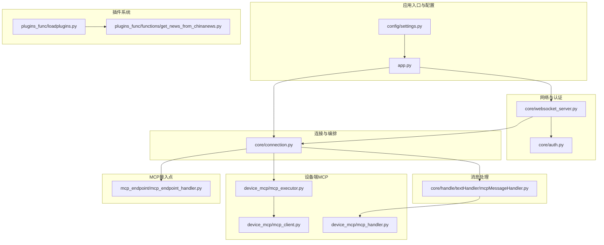
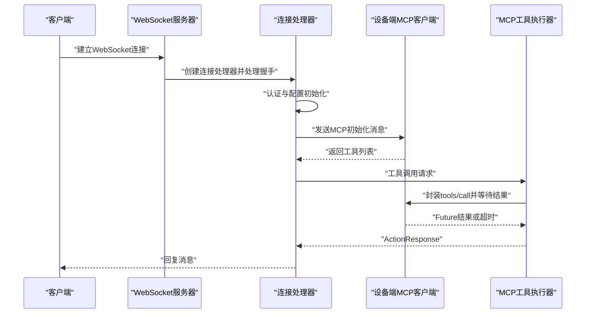
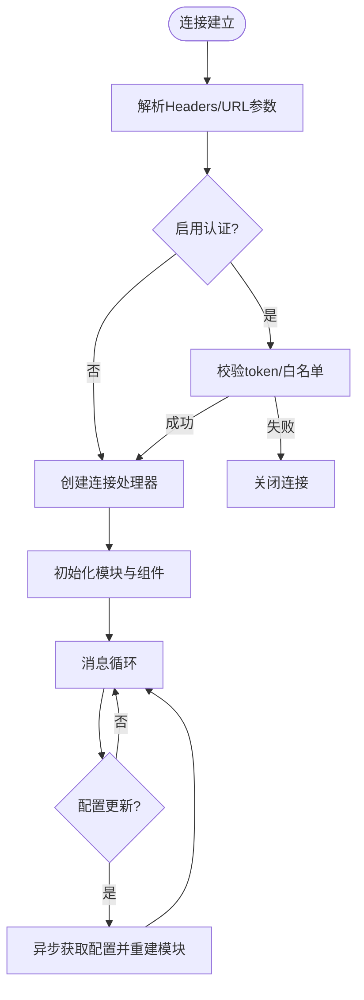
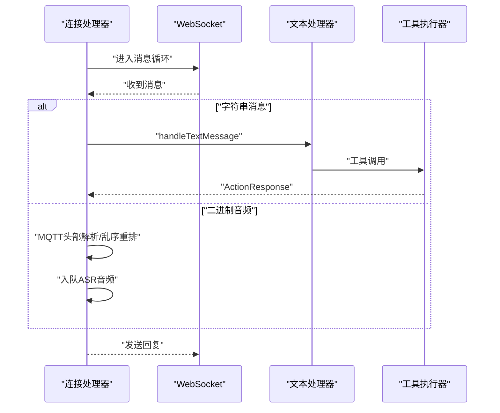
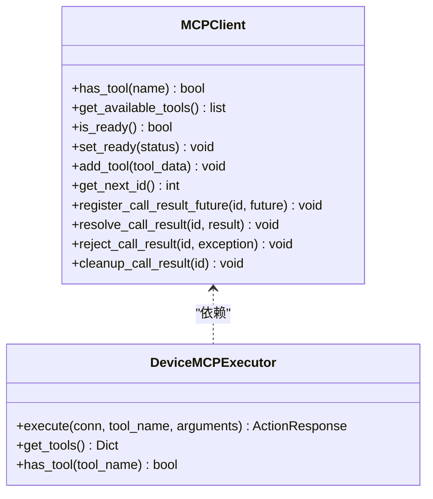
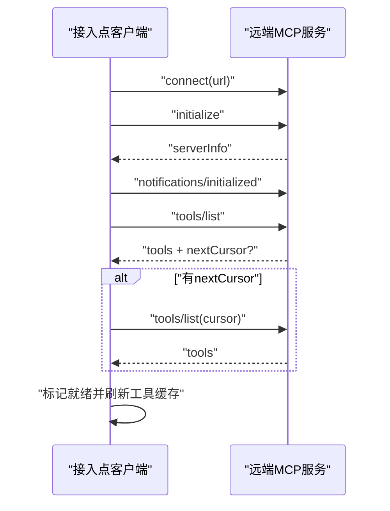
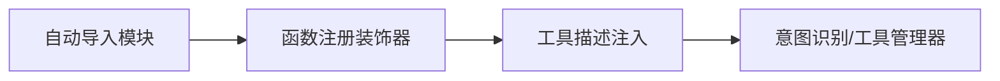
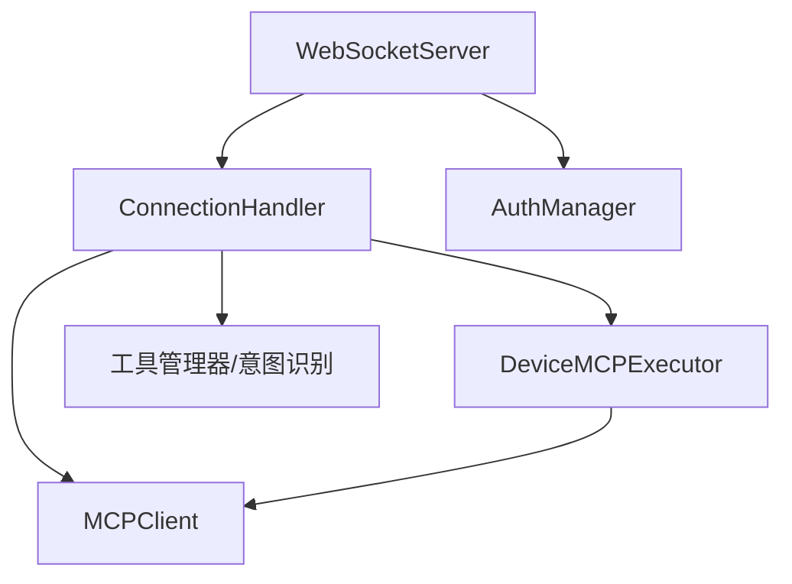

# 服务器端MCP

<cite>
**本文档引用的文件**
- [app.py](file://main/xiaozhi-server/app.py)
- [settings.py](file://main/xiaozhi-server/config/settings.py)
- [websocket_server.py](file://main/xiaozhi-server/core/websocket_server.py)
- [connection.py](file://main/xiaozhi-server/core/connection.py)
- [mcpMessageHandler.py](file://main/xiaozhi-server/core/handle/textHandler/mcpMessageHandler.py)
- [mcp_client.py](file://main/xiaozhi-server/core/providers/tools/device_mcp/mcp_client.py)
- [mcp_executor.py](file://main/xiaozhi-server/core/providers/tools/device_mcp/mcp_executor.py)
- [mcp_handler.py](file://main/xiaozhi-server/core/providers/tools/device_mcp/mcp_handler.py)
- [mcp_endpoint_handler.py](file://main/xiaozhi-server/core/providers/tools/mcp_endpoint/mcp_endpoint_handler.py)
- [auth.py](file://main/xiaozhi-server/core/auth.py)
- [mcp_server_settings.json](file://main/xiaozhi-server/mcp_server_settings.json)
- [loadplugins.py](file://main/xiaozhi-server/plugins_func/loadplugins.py)
- [get_news_from_chinanews.py](file://main/xiaozhi-server/plugins_func/functions/get_news_from_chinanews.py)
</cite>

## 目录
1. [简介](#简介)
2. [项目结构](#项目结构)
3. [核心组件](#核心组件)
4. [架构总览](#架构总览)
5. [详细组件分析](#详细组件分析)
6. [依赖分析](#依赖分析)
7. [性能考虑](#性能考虑)
8. [故障排查指南](#故障排查指南)
9. [结论](#结论)
10. [附录](#附录)

## 简介
本文件面向服务器端MCP（Model Context Protocol）实现，系统性阐述服务器端MCP管理器的设计架构、服务编排与资源调度机制；详细说明服务器端MCP客户端的连接池管理、并发控制与超时处理策略；解释设备信息获取、状态同步与配置管理功能；梳理插件系统、扩展机制与第三方集成方案；提供部署指南、配置参数与性能优化建议；并给出设备监控、远程诊断与批量管理等实际应用案例，以及错误处理、异常恢复与安全防护措施。

## 项目结构
服务器端MCP实现位于 main/xiaozhi-server 目录，采用分层与功能域结合的组织方式：
- 应用入口与配置：app.py、config/settings.py
- WebSocket与认证：core/websocket_server.py、core/auth.py
- 连接生命周期与业务编排：core/connection.py
- 文本消息与MCP消息处理：core/handle/textHandler/mcpMessageHandler.py
- 设备端MCP客户端与执行器：core/providers/tools/device_mcp/*
- MCP接入点客户端：core/providers/tools/mcp_endpoint/*
- 插件与函数注册：plugins_func/*

**图表来源**
- [app.py:1-160](file://main/xiaozhi-server/app.py#L1-L160)
- [websocket_server.py:1-228](file://main/xiaozhi-server/core/websocket_server.py#L1-L228)
- [connection.py:1-800](file://main/xiaozhi-server/core/connection.py#L1-L800)
- [mcpMessageHandler.py:1-22](file://main/xiaozhi-server/core/handle/textHandler/mcpMessageHandler.py#L1-L22)
- [mcp_client.py:1-94](file://main/xiaozhi-server/core/providers/tools/device_mcp/mcp_client.py#L1-L94)
- [mcp_executor.py:1-93](file://main/xiaozhi-server/core/providers/tools/device_mcp/mcp_executor.py#L1-L93)
- [mcp_handler.py:1-404](file://main/xiaozhi-server/core/providers/tools/device_mcp/mcp_handler.py#L1-L404)
- [mcp_endpoint_handler.py:1-393](file://main/xiaozhi-server/core/providers/tools/mcp_endpoint/mcp_endpoint_handler.py#L1-L393)
- [loadplugins.py:1-25](file://main/xiaozhi-server/plugins_func/loadplugins.py#L1-L25)
- [get_news_from_chinanews.py:1-259](file://main/xiaozhi-server/plugins_func/functions/get_news_from_chinanews.py#L1-L259)

**章节来源**
- [app.py:46-160](file://main/xiaozhi-server/app.py#L46-L160)
- [settings.py:9-34](file://main/xiaozhi-server/config/settings.py#L9-L34)

## 核心组件
- 应用入口与生命周期管理：负责配置加载、插件描述初始化、全局GC管理、HTTP与WebSocket服务启动、优雅退出与资源回收。
- WebSocket服务器：统一处理升级握手、认证、并发连接、配置热更新与组件重建。
- 连接处理器：维护每个客户端的生命周期、音频/文本处理、超时检测、内存与标题持久化、工具注册与调用。
- 设备端MCP客户端：管理工具清单、调用结果Future、并发安全、工具调用超时与错误处理。
- MCP接入点客户端：连接远端MCP服务、工具清单拉取、方法调用与结果回调。
- 认证管理器：基于HMAC-SHA256的三元组认证（client_id、username、时间戳），支持过期控制。
- 插件系统：自动扫描与导入插件模块，注册函数描述，支持动态工具注入。

**章节来源**
- [app.py:46-160](file://main/xiaozhi-server/app.py#L46-L160)
- [websocket_server.py:42-228](file://main/xiaozhi-server/core/websocket_server.py#L42-L228)
- [connection.py:77-800](file://main/xiaozhi-server/core/connection.py#L77-L800)
- [mcp_client.py:12-94](file://main/xiaozhi-server/core/providers/tools/device_mcp/mcp_client.py#L12-L94)
- [mcp_endpoint_handler.py:14-393](file://main/xiaozhi-server/core/providers/tools/mcp_endpoint/mcp_endpoint_handler.py#L14-L393)
- [auth.py:13-73](file://main/xiaozhi-server/core/auth.py#L13-L73)
- [loadplugins.py:9-25](file://main/xiaozhi-server/plugins_func/loadplugins.py#L9-L25)

## 架构总览
服务器端MCP采用“事件驱动 + 并发安全 + 动态配置”的架构：
- 入口层：app.py 启动HTTP与WebSocket服务，初始化全局GC与认证密钥。
- 网络层：WebSocketServer统一处理连接、认证与配置热更新。
- 业务层：ConnectionHandler管理单连接生命周期，路由文本与音频消息，协调各子系统。
- MCP层：设备端MCP客户端与接入点客户端分别对接本地/远端MCP服务，实现工具发现与调用。
- 插件层：自动导入插件函数，动态注入工具描述，扩展能力边界。

**图表来源**
- [websocket_server.py:71-145](file://main/xiaozhi-server/core/websocket_server.py#L71-L145)
- [connection.py:193-264](file://main/xiaozhi-server/core/connection.py#L193-L264)
- [mcp_handler.py:118-220](file://main/xiaozhi-server/core/providers/tools/device_mcp/mcp_handler.py#L118-L220)
- [mcp_executor.py:18-67](file://main/xiaozhi-server/core/providers/tools/device_mcp/mcp_executor.py#L18-L67)

## 详细组件分析

### WebSocket服务器与认证
- 连接处理：统一处理HTTP升级与普通HTTP响应；从请求头或URL参数提取device-id、client-id与Authorization。
- 认证策略：支持白名单直通与JWT校验；过期时间可配置；过滤无效握手日志。
- 配置热更新：异步从API获取最新配置，对比VAD/ASR变更后重建模块实例，保证运行时平滑切换。

**图表来源**
- [websocket_server.py:81-145](file://main/xiaozhi-server/core/websocket_server.py#L81-L145)
- [websocket_server.py:155-204](file://main/xiaozhi-server/core/websocket_server.py#L155-L204)
- [auth.py:52-73](file://main/xiaozhi-server/core/auth.py#L52-L73)

**章节来源**
- [websocket_server.py:42-228](file://main/xiaozhi-server/core/websocket_server.py#L42-L228)
- [auth.py:13-73](file://main/xiaozhi-server/core/auth.py#L13-L73)

### 连接生命周期与消息路由
- 生命周期：记录首次与最后活动时间，超时检测任务；聊天结束可选择关闭连接。
- 消息路由：区分文本与音频；音频消息支持MQTT网关头部解析与乱序重排；绑定状态与提示播放策略。
- 内存与持久化：保存对话历史与生成标题；线程池异步写入，超时保护。
- 工具调用：动态构建few-shot示例，注入工具调用模式；支持直接回复与真实工具调用。

**图表来源**
- [connection.py:193-264](file://main/xiaozhi-server/core/connection.py#L193-L264)
- [connection.py:340-406](file://main/xiaozhi-server/core/connection.py#L340-L406)
- [mcpMessageHandler.py:18-22](file://main/xiaozhi-server/core/handle/textHandler/mcpMessageHandler.py#L18-L22)

**章节来源**
- [connection.py:193-800](file://main/xiaozhi-server/core/connection.py#L193-L800)
- [mcpMessageHandler.py:11-22](file://main/xiaozhi-server/core/handle/textHandler/mcpMessageHandler.py#L11-L22)

### 设备端MCP客户端与执行器
- 客户端职责：维护工具清单缓存、并发安全、调用ID分配、Future结果管理、就绪状态与错误处理。
- 执行器职责：校验客户端状态与工具存在性；封装参数为JSON；将结果转换为ActionResponse；支持直接回复与二次LLM处理。
- 调用流程：发送initialize与tools/list；工具调用时等待Future结果或超时；解析结果格式并返回。

**图表来源**
- [mcp_client.py:12-94](file://main/xiaozhi-server/core/providers/tools/device_mcp/mcp_client.py#L12-L94)
- [mcp_executor.py:12-93](file://main/xiaozhi-server/core/providers/tools/device_mcp/mcp_executor.py#L12-L93)

**章节来源**
- [mcp_client.py:12-94](file://main/xiaozhi-server/core/providers/tools/device_mcp/mcp_client.py#L12-L94)
- [mcp_executor.py:12-93](file://main/xiaozhi-server/core/providers/tools/device_mcp/mcp_executor.py#L12-L93)
- [mcp_handler.py:118-404](file://main/xiaozhi-server/core/providers/tools/device_mcp/mcp_handler.py#L118-L404)

### MCP接入点客户端
- 连接与初始化：建立WebSocket连接，发送initialize与notifications/initialized，随后请求tools/list。
- 工具发现：支持分页cursor，逐批拉取工具清单，替换描述中的工具名，完成后标记就绪。
- 工具调用：参数解析与合并、超时等待Future、错误包装与返回格式标准化。

**图表来源**
- [mcp_endpoint_handler.py:14-56](file://main/xiaozhi-server/core/providers/tools/mcp_endpoint/mcp_endpoint_handler.py#L14-L56)
- [mcp_endpoint_handler.py:58-222](file://main/xiaozhi-server/core/providers/tools/mcp_endpoint/mcp_endpoint_handler.py#L58-L222)

**章节来源**
- [mcp_endpoint_handler.py:14-393](file://main/xiaozhi-server/core/providers/tools/mcp_endpoint/mcp_endpoint_handler.py#L14-L393)

### 插件系统与扩展机制
- 自动导入：遍历plugins_func.functions包，动态导入模块，触发函数注册。
- 函数注册：通过装饰器注册工具描述与类型，支持系统控制类工具；动态注入到意图识别与工具管理器。
- 第三方集成：通过MCP接入点或设备端MCP客户端对接外部服务，统一以工具形式暴露。

**图表来源**
- [loadplugins.py:9-25](file://main/xiaozhi-server/plugins_func/loadplugins.py#L9-L25)
- [get_news_from_chinanews.py:146-259](file://main/xiaozhi-server/plugins_func/functions/get_news_from_chinanews.py#L146-L259)

**章节来源**
- [loadplugins.py:9-25](file://main/xiaozhi-server/plugins_func/loadplugins.py#L9-L25)
- [get_news_from_chinanews.py:146-259](file://main/xiaozhi-server/plugins_func/functions/get_news_from_chinanews.py#L146-L259)

## 依赖分析
- 组件耦合：WebSocketServer与ConnectionHandler强耦合；ConnectionHandler依赖MCP客户端与执行器；MCP执行器依赖工具管理器。
- 外部依赖：websockets、asyncio、ThreadPoolExecutor、HMAC签名、JSON-RPC 2.0。
- 循环依赖：未发现直接循环；MCP客户端与执行器通过ConnectionHandler间接交互。

**图表来源**
- [websocket_server.py:42-70](file://main/xiaozhi-server/core/websocket_server.py#L42-L70)
- [connection.py:77-142](file://main/xiaozhi-server/core/connection.py#L77-L142)
- [mcp_executor.py:15-17](file://main/xiaozhi-server/core/providers/tools/device_mcp/mcp_executor.py#L15-L17)
- [mcp_client.py:15-22](file://main/xiaozhi-server/core/providers/tools/device_mcp/mcp_client.py#L15-L22)
- [auth.py:13-28](file://main/xiaozhi-server/core/auth.py#L13-L28)

**章节来源**
- [websocket_server.py:42-70](file://main/xiaozhi-server/core/websocket_server.py#L42-L70)
- [connection.py:77-142](file://main/xiaozhi-server/core/connection.py#L77-L142)
- [mcp_executor.py:15-17](file://main/xiaozhi-server/core/providers/tools/device_mcp/mcp_executor.py#L15-L17)
- [mcp_client.py:15-22](file://main/xiaozhi-server/core/providers/tools/device_mcp/mcp_client.py#L15-L22)
- [auth.py:13-28](file://main/xiaozhi-server/core/auth.py#L13-L28)

## 性能考虑
- 并发与线程池：ConnectionHandler使用ThreadPoolExecutor限制最大工作线程数，避免CPU密集任务阻塞事件循环。
- 异步I/O：WebSocket与工具调用均采用async/await，减少阻塞；Future用于工具调用结果等待。
- 缓存与懒加载：MCP客户端缓存工具清单；组件延迟初始化；配置热更新时仅重建变更模块。
- 资源回收：全局GC管理器定期清理；连接关闭时确保线程与Future清理，避免资源泄漏。
- 音频乱序与缓冲：MQTT网关音频包按时间戳排序，限制缓冲大小，平衡实时性与稳定性。

[本节为通用性能建议，无需具体文件分析]

## 故障排查指南
- 认证失败：检查Authorization头格式与签名时间戳；确认白名单配置；核对设备ID与client-ID一致性。
- MCP初始化失败：确认mcp_endpoint配置正确且可达；检查服务器信息返回；关注工具列表分页与缓存刷新。
- 工具调用超时：调整超时阈值；检查远端MCP服务性能；查看Future清理与错误传播。
- 配置热更新异常：确认异步获取配置成功；核对VAD/ASR类型变更；观察模块重建日志。
- 日志过滤：WebSocket握手无效日志已被过滤，关注业务日志与错误堆栈。

**章节来源**
- [websocket_server.py:206-228](file://main/xiaozhi-server/core/websocket_server.py#L206-L228)
- [mcp_handler.py:398-404](file://main/xiaozhi-server/core/providers/tools/device_mcp/mcp_handler.py#L398-L404)
- [mcp_endpoint_handler.py:286-393](file://main/xiaozhi-server/core/providers/tools/mcp_endpoint/mcp_endpoint_handler.py#L286-L393)

## 结论
服务器端MCP实现通过清晰的分层设计与并发安全机制，实现了设备端MCP客户端与MCP接入点的统一编排。配合插件系统与动态配置，能够灵活扩展第三方能力；通过严格的认证与超时控制保障安全性与稳定性。建议在生产环境中结合日志与监控完善可观测性，并持续优化工具调用与音频处理的性能瓶颈。

[本节为总结性内容，无需具体文件分析]

## 附录

### 部署指南与配置参数
- 配置文件：data/.config.yaml；支持从API读取配置；配置校验与错误提示。
- 认证密钥：优先使用配置文件server.auth_key，否则回退至manager-api.secret，否则自动生成。
- MCP接入点：支持SSE与Streamable HTTP两种传输模式；可在mcp_server_settings.json中配置常用服务。
- 端口与地址：WebSocket默认端口8000；HTTP OTA接口端口由server.http_port决定；打印本地IP与访问地址。

**章节来源**
- [settings.py:9-34](file://main/xiaozhi-server/config/settings.py#L9-L34)
- [app.py:57-130](file://main/xiaozhi-server/app.py#L57-L130)
- [mcp_server_settings.json:1-57](file://main/xiaozhi-server/mcp_server_settings.json#L1-L57)

### 实际应用案例
- 设备监控：通过MCP接入点获取设备状态与指标，结合工具调用实现远程诊断。
- 远程诊断：在连接处理器中注入诊断工具，调用远端MCP服务进行问题定位。
- 批量管理：利用插件系统批量注册工具，统一通过工具管理器调度。

[本节为概念性应用说明，无需具体文件分析]

### 安全防护措施
- 认证：HMAC-SHA256签名，时间戳过期控制；白名单直通策略。
- 授权：设备ID与client-ID分离，Authorization头Bearer令牌。
- 日志：过滤无效握手日志，避免敏感信息泄露。
- 超时与限流：工具调用超时与Future清理，线程池最大并发限制。

**章节来源**
- [auth.py:13-73](file://main/xiaozhi-server/core/auth.py#L13-L73)
- [websocket_server.py:8-31](file://main/xiaozhi-server/core/websocket_server.py#L8-L31)
- [connection.py:121](file://main/xiaozhi-server/core/connection.py#L121)