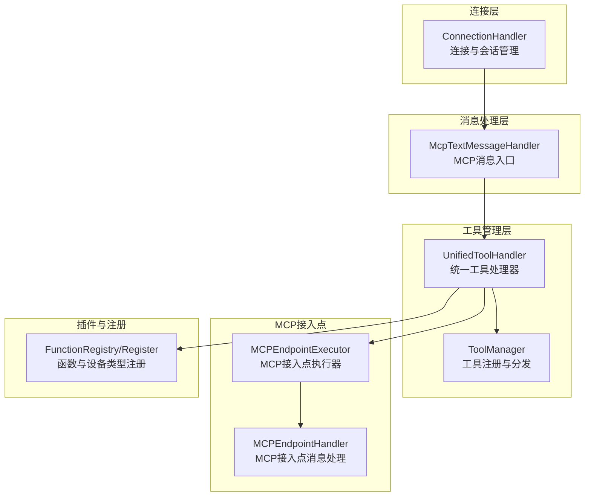
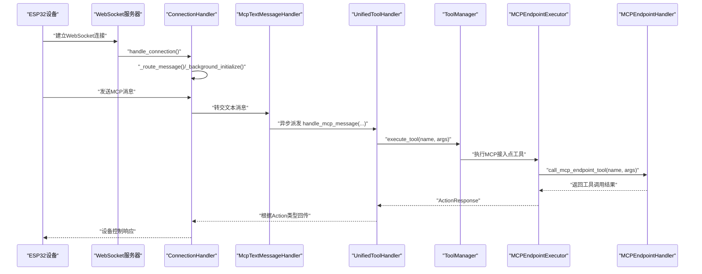
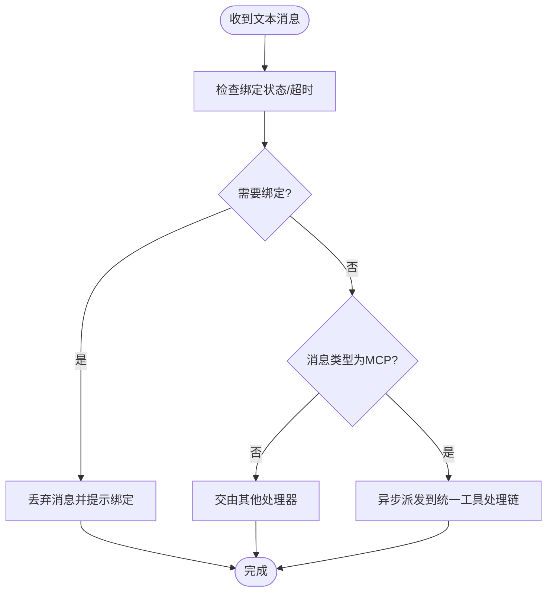
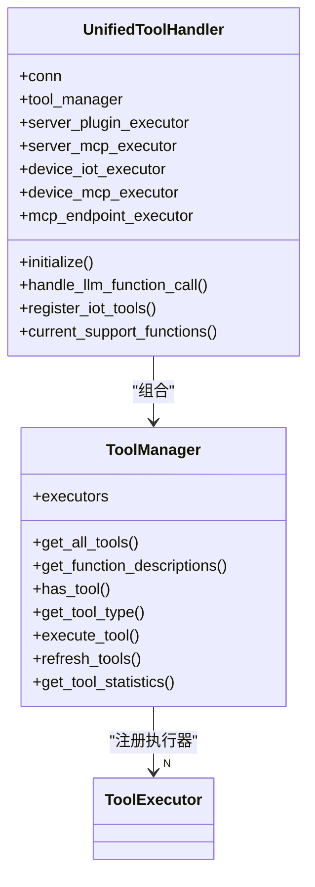
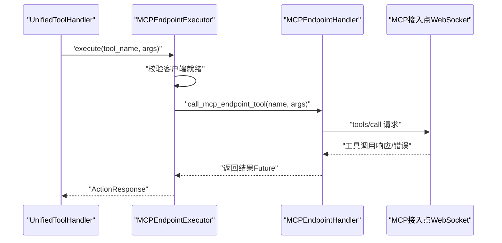
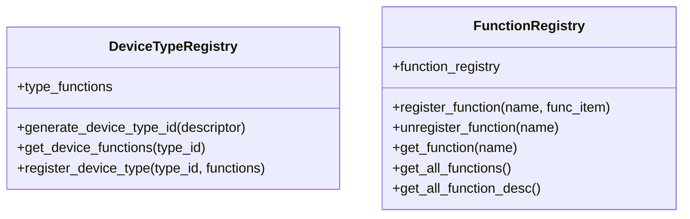
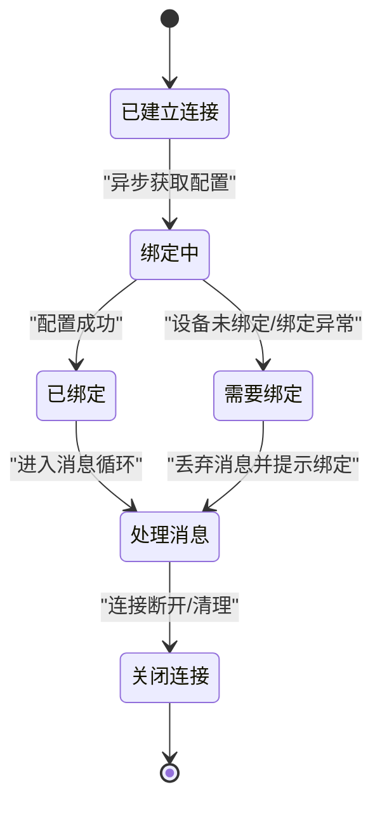
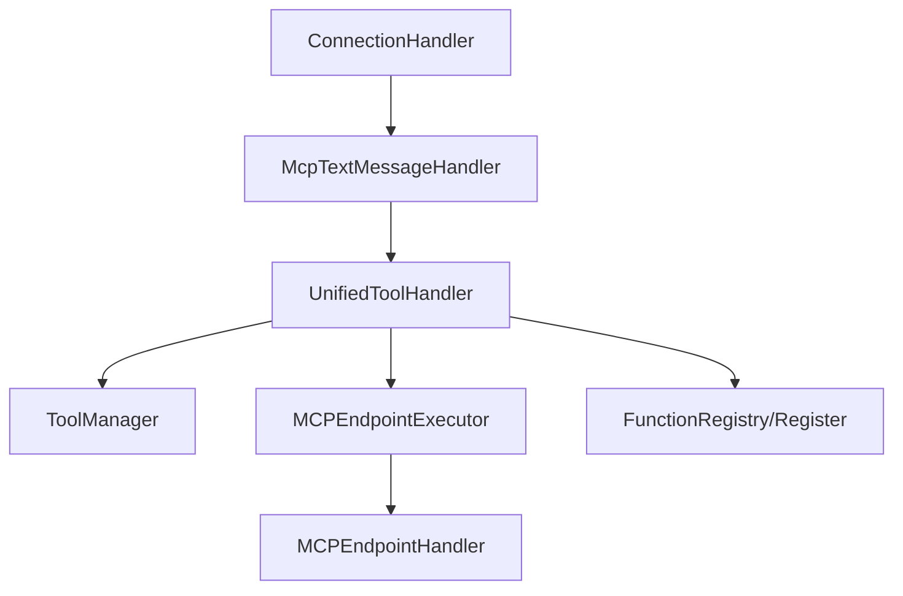

# 设备控制集成

<cite>
**本文档引用的文件**
- [mcpMessageHandler.py](file://main/xiaozhi-server/core/handle/textHandler/mcpMessageHandler.py)
- [unified_tool_handler.py](file://main/xiaozhi-server/core/providers/tools/unified_tool_handler.py)
- [unified_tool_manager.py](file://main/xiaozhi-server/core/providers/tools/unified_tool_manager.py)
- [mcp_endpoint_executor.py](file://main/xiaozhi-server/core/providers/tools/mcp_endpoint/mcp_endpoint_executor.py)
- [mcp_endpoint_handler.py](file://main/xiaozhi-server/core/providers/tools/mcp_endpoint/mcp_endpoint_handler.py)
- [connection.py](file://main/xiaozhi-server/core/connection.py)
- [register.py](file://main/xiaozhi-server/plugins_func/register.py)
</cite>

## 目录
1. [引言](#引言)
2. [项目结构](#项目结构)
3. [核心组件](#核心组件)
4. [架构总览](#架构总览)
5. [详细组件分析](#详细组件分析)
6. [依赖分析](#依赖分析)
7. [性能考虑](#性能考虑)
8. [故障排查指南](#故障排查指南)
9. [结论](#结论)
10. [附录](#附录)

## 引言
本技术文档面向设备控制集成场景，聚焦ESP32设备在本项目中的MCP（Model Context Protocol）协议实现与应用。文档系统性阐述以下主题：
- MCP协议在ESP32设备控制中的实现机制：设备发现、连接建立、命令执行与状态管理
- MCP处理器架构设计：消息路由、工具分发与状态管理
- IoT设备描述符定义、设备能力声明与功能映射机制
- MCP执行器工作原理：命令解析、设备响应处理与错误处理
- 实际设备控制案例：智能家居设备、传感器设备与执行器设备的集成方法
- 错误处理、重连机制与性能优化策略

## 项目结构
围绕设备控制与MCP集成的关键目录与文件如下：
- 核心连接与消息路由：core/connection.py
- 文本消息与MCP消息处理：core/handle/textHandler/mcpMessageHandler.py
- 统一工具管理与执行：core/providers/tools/unified_tool_handler.py、unified_tool_manager.py
- MCP接入点工具执行与消息处理：core/providers/tools/mcp_endpoint/mcp_endpoint_executor.py、mcp_endpoint_handler.py
- 插件与函数注册：plugins_func/register.py

**图表来源**
- [connection.py:77-264](file://main/xiaozhi-server/core/connection.py#L77-L264)
- [mcpMessageHandler.py:11-22](file://main/xiaozhi-server/core/handle/textHandler/mcpMessageHandler.py#L11-L22)
- [unified_tool_handler.py:19-52](file://main/xiaozhi-server/core/providers/tools/unified_tool_handler.py#L19-L52)
- [unified_tool_manager.py:9-47](file://main/xiaozhi-server/core/providers/tools/unified_tool_manager.py#L9-L47)
- [mcp_endpoint_executor.py:9-98](file://main/xiaozhi-server/core/providers/tools/mcp_endpoint/mcp_endpoint_executor.py#L9-L98)
- [mcp_endpoint_handler.py:14-42](file://main/xiaozhi-server/core/providers/tools/mcp_endpoint/mcp_endpoint_handler.py#L14-L42)
- [register.py:53-101](file://main/xiaozhi-server/plugins_func/register.py#L53-L101)

**章节来源**
- [connection.py:77-264](file://main/xiaozhi-server/core/connection.py#L77-L264)
- [mcpMessageHandler.py:11-22](file://main/xiaozhi-server/core/handle/textHandler/mcpMessageHandler.py#L11-L22)
- [unified_tool_handler.py:19-52](file://main/xiaozhi-server/core/providers/tools/unified_tool_handler.py#L19-L52)
- [unified_tool_manager.py:9-47](file://main/xiaozhi-server/core/providers/tools/unified_tool_manager.py#L9-L47)
- [mcp_endpoint_executor.py:9-98](file://main/xiaozhi-server/core/providers/tools/mcp_endpoint/mcp_endpoint_executor.py#L9-L98)
- [mcp_endpoint_handler.py:14-42](file://main/xiaozhi-server/core/providers/tools/mcp_endpoint/mcp_endpoint_handler.py#L14-L42)
- [register.py:53-101](file://main/xiaozhi-server/plugins_func/register.py#L53-L101)

## 核心组件
- 连接处理器（ConnectionHandler）：负责WebSocket连接生命周期、消息路由、绑定状态管理、组件初始化与清理。
- MCP文本消息处理器（McpTextMessageHandler）：识别并转发MCP消息至统一工具处理链。
- 统一工具处理器（UnifiedToolHandler）：聚合多种工具执行器（含MCP接入点），负责工具注册、函数描述刷新与执行。
- 工具管理器（ToolManager）：维护工具注册表、按名称分发执行、缓存与统计。
- MCP接入点执行器（MCPEndpointExecutor）：封装MCP接入点客户端，提供工具查询与调用。
- MCP接入点处理器（MCPEndpointHandler）：负责与MCP接入点建立连接、初始化、工具列表拉取与消息监听。

**章节来源**
- [connection.py:77-264](file://main/xiaozhi-server/core/connection.py#L77-L264)
- [mcpMessageHandler.py:11-22](file://main/xiaozhi-server/core/handle/textHandler/mcpMessageHandler.py#L11-L22)
- [unified_tool_handler.py:19-52](file://main/xiaozhi-server/core/providers/tools/unified_tool_handler.py#L19-L52)
- [unified_tool_manager.py:9-47](file://main/xiaozhi-server/core/providers/tools/unified_tool_manager.py#L9-L47)
- [mcp_endpoint_executor.py:9-98](file://main/xiaozhi-server/core/providers/tools/mcp_endpoint/mcp_endpoint_executor.py#L9-L98)
- [mcp_endpoint_handler.py:14-42](file://main/xiaozhi-server/core/providers/tools/mcp_endpoint/mcp_endpoint_handler.py#L14-L42)

## 架构总览
下图展示从连接建立到MCP消息处理、工具分发与MCP接入点交互的端到端流程。

**图表来源**
- [connection.py:193-264](file://main/xiaozhi-server/core/connection.py#L193-L264)
- [mcpMessageHandler.py:18-22](file://main/xiaozhi-server/core/handle/textHandler/mcpMessageHandler.py#L18-L22)
- [unified_tool_handler.py:139-183](file://main/xiaozhi-server/core/providers/tools/unified_tool_handler.py#L139-L183)
- [unified_tool_manager.py:73-102](file://main/xiaozhi-server/core/providers/tools/unified_tool_manager.py#L73-L102)
- [mcp_endpoint_executor.py:15-65](file://main/xiaozhi-server/core/providers/tools/mcp_endpoint/mcp_endpoint_executor.py#L15-L65)
- [mcp_endpoint_handler.py:286-392](file://main/xiaozhi-server/core/providers/tools/mcp_endpoint/mcp_endpoint_handler.py#L286-L392)

## 详细组件分析

### MCP消息入口与路由
- 入口类：McpTextMessageHandler
  - 识别消息类型为MCP
  - 将payload交给统一工具处理链，采用异步任务派发，避免阻塞主线程
- 路由与绑定状态：ConnectionHandler在消息到达前检查绑定状态与超时，必要时丢弃消息并提示绑定

**图表来源**
- [connection.py:340-356](file://main/xiaozhi-server/core/connection.py#L340-L356)
- [mcpMessageHandler.py:14-22](file://main/xiaozhi-server/core/handle/textHandler/mcpMessageHandler.py#L14-L22)

**章节来源**
- [mcpMessageHandler.py:11-22](file://main/xiaozhi-server/core/handle/textHandler/mcpMessageHandler.py#L11-L22)
- [connection.py:340-356](file://main/xiaozhi-server/core/connection.py#L340-L356)

### 统一工具处理器与管理器
- 统一工具处理器（UnifiedToolHandler）
  - 聚合多种执行器（ServerPlugin、ServerMCP、DeviceIoT、DeviceMCP、MCPEndpoint）
  - 异步初始化MCP接入点客户端，注入Home Assistant提示词
  - 处理LLM函数调用：支持单/多函数调用、参数解析、显示消息通知、响应合并
  - 提供函数描述刷新与统计
- 工具管理器（ToolManager）
  - 注册执行器、缓存工具集合与函数描述
  - 按名称查找工具类型并分发执行
  - 统计各类型工具数量，支持刷新缓存

**图表来源**
- [unified_tool_handler.py:19-52](file://main/xiaozhi-server/core/providers/tools/unified_tool_handler.py#L19-L52)
- [unified_tool_manager.py:9-47](file://main/xiaozhi-server/core/providers/tools/unified_tool_manager.py#L9-L47)

**章节来源**
- [unified_tool_handler.py:19-52](file://main/xiaozhi-server/core/providers/tools/unified_tool_handler.py#L19-L52)
- [unified_tool_handler.py:139-183](file://main/xiaozhi-server/core/providers/tools/unified_tool_handler.py#L139-L183)
- [unified_tool_manager.py:9-47](file://main/xiaozhi-server/core/providers/tools/unified_tool_manager.py#L9-L47)
- [unified_tool_manager.py:73-102](file://main/xiaozhi-server/core/providers/tools/unified_tool_manager.py#L73-L102)

### MCP接入点执行器与消息处理
- 执行器（MCPEndpointExecutor）
  - 校验MCP接入点客户端存在与就绪状态
  - 将参数序列化为JSON字符串，调用接入点工具
  - 解析返回结果，区分Action类型（REQLLM/ERROR/NOTFOUND等）
  - 支持工具清单查询与存在性检查
- 接入点处理器（MCPEndpointHandler）
  - 建立WebSocket连接，发送initialize与tools/list请求
  - 监听接入点消息，处理工具列表、工具调用响应与错误
  - 维护工具名称映射与客户端就绪状态，刷新工具缓存

**图表来源**
- [mcp_endpoint_executor.py:15-65](file://main/xiaozhi-server/core/providers/tools/mcp_endpoint/mcp_endpoint_executor.py#L15-L65)
- [mcp_endpoint_handler.py:286-392](file://main/xiaozhi-server/core/providers/tools/mcp_endpoint/mcp_endpoint_handler.py#L286-L392)

**章节来源**
- [mcp_endpoint_executor.py:9-98](file://main/xiaozhi-server/core/providers/tools/mcp_endpoint/mcp_endpoint_executor.py#L9-L98)
- [mcp_endpoint_handler.py:14-42](file://main/xiaozhi-server/core/providers/tools/mcp_endpoint/mcp_endpoint_handler.py#L14-L42)
- [mcp_endpoint_handler.py:58-222](file://main/xiaozhi-server/core/providers/tools/mcp_endpoint/mcp_endpoint_handler.py#L58-L222)

### IoT设备描述符与功能映射
- 设备类型注册表（DeviceTypeRegistry）
  - 通过设备描述符的name、properties、methods生成类型签名
  - 维护设备类型到函数集合的映射，便于按能力自动派发工具
- 函数注册（FunctionRegistry）
  - 维护函数注册表，支持按名称注册/注销/查询
  - 提供函数描述列表，用于工具清单与LLM提示

**图表来源**
- [register.py:53-101](file://main/xiaozhi-server/plugins_func/register.py#L53-L101)

**章节来源**
- [register.py:53-101](file://main/xiaozhi-server/plugins_func/register.py#L53-L101)

### 连接生命周期与状态管理
- 连接建立：解析Header、获取设备ID、初始化超时任务
- 绑定状态：异步获取差异化配置，处理设备未绑定/绑定码异常
- 消息路由：在绑定完成前丢弃消息并提示绑定；绑定完成后按类型分发
- 清理：保存记忆、关闭连接、清理MCP接入点连接

**图表来源**
- [connection.py:193-264](file://main/xiaozhi-server/core/connection.py#L193-L264)
- [connection.py:340-356](file://main/xiaozhi-server/core/connection.py#L340-L356)
- [connection.py:678-800](file://main/xiaozhi-server/core/connection.py#L678-L800)

**章节来源**
- [connection.py:193-264](file://main/xiaozhi-server/core/connection.py#L193-L264)
- [connection.py:340-356](file://main/xiaozhi-server/core/connection.py#L340-L356)
- [connection.py:678-800](file://main/xiaozhi-server/core/connection.py#L678-L800)

## 依赖分析
- 组件耦合
  - ConnectionHandler依赖WebSocket与工具处理链，负责消息路由与绑定状态
  - UnifiedToolHandler聚合多种执行器，ToolManager集中管理工具注册与分发
  - MCPEndpointExecutor依赖MCPEndpointHandler提供的客户端与消息处理能力
- 外部依赖
  - MCP接入点通过WebSocket连接，遵循JSON-RPC 2.0语义
  - 插件函数通过注册表动态注入，支持按需扩展

**图表来源**
- [connection.py:77-264](file://main/xiaozhi-server/core/connection.py#L77-L264)
- [mcpMessageHandler.py:11-22](file://main/xiaozhi-server/core/handle/textHandler/mcpMessageHandler.py#L11-L22)
- [unified_tool_handler.py:19-52](file://main/xiaozhi-server/core/providers/tools/unified_tool_handler.py#L19-L52)
- [unified_tool_manager.py:9-47](file://main/xiaozhi-server/core/providers/tools/unified_tool_manager.py#L9-L47)
- [mcp_endpoint_executor.py:9-98](file://main/xiaozhi-server/core/providers/tools/mcp_endpoint/mcp_endpoint_executor.py#L9-L98)
- [mcp_endpoint_handler.py:14-42](file://main/xiaozhi-server/core/providers/tools/mcp_endpoint/mcp_endpoint_handler.py#L14-L42)
- [register.py:53-101](file://main/xiaozhi-server/plugins_func/register.py#L53-L101)

**章节来源**
- [unified_tool_handler.py:19-52](file://main/xiaozhi-server/core/providers/tools/unified_tool_handler.py#L19-L52)
- [unified_tool_manager.py:9-47](file://main/xiaozhi-server/core/providers/tools/unified_tool_manager.py#L9-L47)
- [mcp_endpoint_executor.py:9-98](file://main/xiaozhi-server/core/providers/tools/mcp_endpoint/mcp_endpoint_executor.py#L9-L98)
- [mcp_endpoint_handler.py:14-42](file://main/xiaozhi-server/core/providers/tools/mcp_endpoint/mcp_endpoint_handler.py#L14-L42)
- [register.py:53-101](file://main/xiaozhi-server/plugins_func/register.py#L53-L101)

## 性能考虑
- 异步与并发
  - MCP消息与工具调用均采用异步任务派发，避免阻塞主线程
  - 工具管理器缓存工具集合与函数描述，减少重复查询
- 连接与资源
  - 连接层使用线程池与事件循环分离，降低阻塞风险
  - MCP接入点客户端在清理阶段主动关闭连接，释放资源
- 参数解析与容错
  - 对工具参数进行严格JSON解析与合并，提升鲁棒性
  - 工具调用超时控制与错误传播，避免长时间挂起

[本节为通用性能建议，不直接分析具体文件]

## 故障排查指南
- 绑定与认证
  - 若出现“需要绑定”状态，检查设备ID与绑定码，确认差异化配置获取流程
- MCP接入点连接
  - 检查MCP接入点URL配置，确认WebSocket连接建立与初始化消息发送
  - 关注工具列表获取与客户端就绪状态，确保工具缓存刷新
- 工具调用
  - 校验工具名称与参数格式，关注ActionResponse中的错误类型
  - 对超时与JSON解析失败进行日志定位与参数修正
- 日志与监控
  - 利用统一日志接口查看关键路径（初始化、消息处理、工具执行）

**章节来源**
- [connection.py:678-800](file://main/xiaozhi-server/core/connection.py#L678-L800)
- [mcp_endpoint_handler.py:58-222](file://main/xiaozhi-server/core/providers/tools/mcp_endpoint/mcp_endpoint_handler.py#L58-L222)
- [mcp_endpoint_executor.py:62-65](file://main/xiaozhi-server/core/providers/tools/mcp_endpoint/mcp_endpoint_executor.py#L62-L65)
- [unified_tool_manager.py:100-102](file://main/xiaozhi-server/core/providers/tools/unified_tool_manager.py#L100-L102)

## 结论
本项目通过ConnectionHandler、McpTextMessageHandler、UnifiedToolHandler与ToolManager构建了清晰的MCP消息处理与工具分发体系；借助MCPEndpointExecutor与MCPEndpointHandler实现了与MCP接入点的稳定交互。结合DeviceTypeRegistry与FunctionRegistry，系统具备良好的扩展性与可维护性。针对设备控制集成，建议优先完善设备描述符与能力声明，确保工具映射准确，同时强化错误处理与性能优化，保障在ESP32等资源受限环境下的稳定性与实时性。

[本节为总结性内容，不直接分析具体文件]

## 附录
- 设备控制集成实践要点
  - 智能家居设备：基于设备描述符声明能力，通过MCPEndpointExecutor调用对应工具
  - 传感器设备：注册只读工具，提供状态查询与阈值告警
  - 执行器设备：注册可写工具，确保参数校验与安全防护
- 错误处理与重连
  - WebSocket断开后延迟重连，重新初始化MCP接入点客户端
  - 工具调用失败时记录错误并回退到REQLLM或直接回复
- 性能优化建议
  - 缓存工具清单与函数描述，减少重复查询
  - 控制工具调用超时与并发度，避免资源争用

[本节为通用指导，不直接分析具体文件]