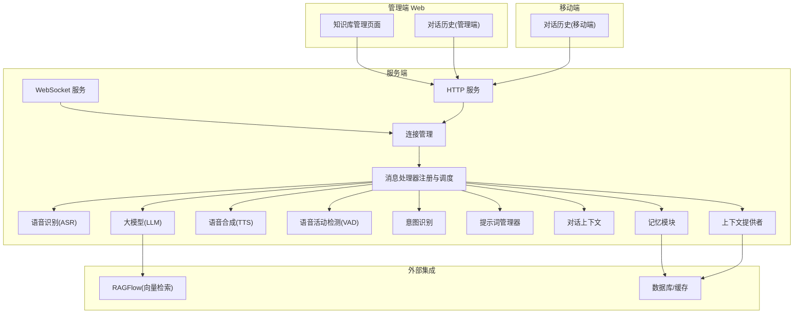
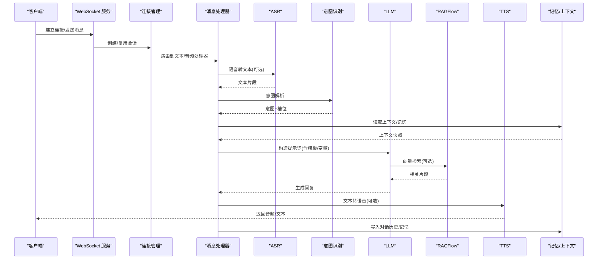
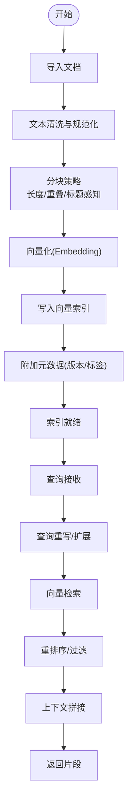
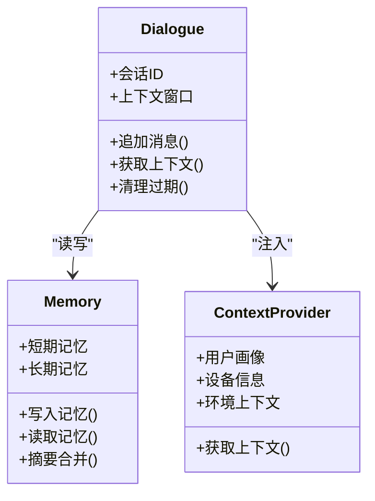
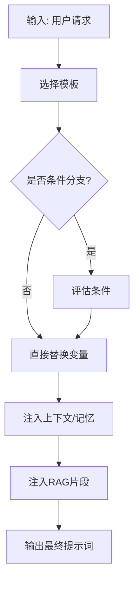
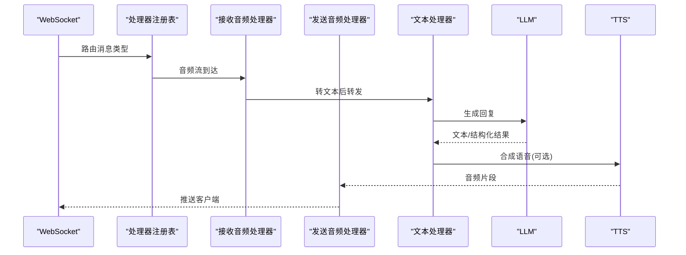
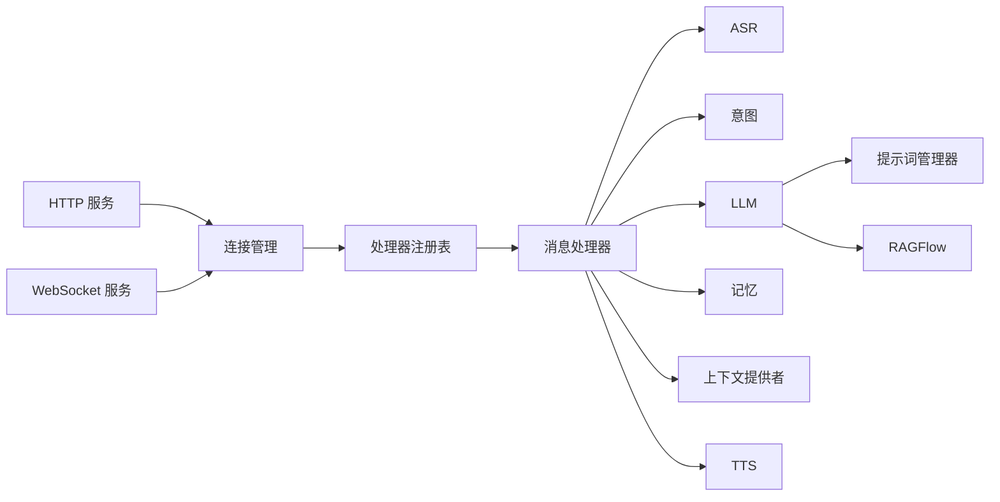

# 内容管理

<cite>
**本文引用的文件**   
- [README.md](file://README.md)
- [app.py](file://main/xiaozhi-server/app.py)
- [http_server.py](file://main/xiaozhi-server/core/http_server.py)
- [websocket_server.py](file://main/xiaozhi-server/core/websocket_server.py)
- [connection.py](file://main/xiaozhi-server/core/connection.py)
- [prompt_manager.py](file://main/xiaozhi-server/core/utils/prompt_manager.py)
- [dialogue.py](file://main/xiaozhi-server/core/utils/dialogue.py)
- [memory.py](file://main/xiaozhi-server/core/utils/memory.py)
- [context_provider.py](file://main/xiaozhi-server/core/utils/context_provider.py)
- [llm.py](file://main/xiaozhi-server/core/utils/llm.py)
- [asr.py](file://main/xiaozhi-server/core/utils/asr.py)
- [tts.py](file://main/xiaozhi-server/core/utils/tts.py)
- [vad.py](file://main/xiaozhi-server/core/utils/vad.py)
- [intent.py](file://main/xiaozhi-server/core/utils/intent.py)
- [textMessageHandlerRegistry.py](file://main/xiaozhi-server/core/handle/textMessageHandlerRegistry.py)
- [textMessageProcessor.py](file://main/xiaozhi-server/core/handle/textMessageProcessor.py)
- [receiveAudioHandle.py](file://main/xiaozhi-server/core/handle/receiveAudioHandle.py)
- [sendAudioHandle.py](file://main/xiaozhi-server/core/handle/sendAudioHandle.py)
- [textHandle.py](file://main/xiaozhi-server/core/handle/textHandle.py)
- [knowledge_base_item.vue](file://main/manager-web/src/views/KnowledgeBaseItem.vue)
- [knowledge_base_management.vue](file://main/manager-web/src/views/KnowledgeBaseManagement.vue)
- [chat_history_api.js](file://main/manager-mobile/src/api/chat-history/chat_history_api.js)
- [chat_history_page.vue](file://main/manager-mobile/src/pages/chat-history/index.vue)
- [ragflow-integration.md](file://docs/ragflow-integration.md)
- [Memory_System_Architecture_Blueprint.md](file://main/xiaozhi-server/docs/architecture/Memory_System_Architecture_Blueprint.md)
</cite>

## 目录
1. [简介](#简介)
2. [项目结构](#项目结构)
3. [核心组件](#核心组件)
4. [架构总览](#架构总览)
5. [详细组件分析](#详细组件分析)
6. [依赖关系分析](#依赖关系分析)
7. [性能考量](#性能考量)
8. [故障排查指南](#故障排查指南)
9. [结论](#结论)
10. [附录：API 接口文档](#附录api-接口文档)

## 简介
本技术文档面向内容管理系统，围绕知识库构建与检索、对话管理与记忆持久化、提示词管理与模板引擎、以及内容版本控制、多语言支持与审核等能力进行系统化说明。文档同时给出 API 参考，覆盖知识库管理、对话历史查询、提示词模板更新等关键操作，并介绍内容推荐、个性化定制、智能问答等高级特性在系统中的集成方式。

## 项目结构
系统由多个子系统组成：
- 服务端（Python）：负责 WebSocket/HTTP 服务、ASR/TTS/VAD、LLM 调用、意图识别、上下文与记忆管理、消息处理管线等。
- 管理端 Web（Vue）：提供知识库管理、设备管理、模型配置、参数管理等界面。
- 移动端（UniApp）：提供聊天历史查看、语音通话、用户设置等功能。
- 文档与部署：包含 RAGFlow 集成、内存体系蓝图、Docker 部署等。

图表来源
- [http_server.py](file://main/xiaozhi-server/core/http_server.py)
- [websocket_server.py](file://main/xiaozhi-server/core/websocket_server.py)
- [connection.py](file://main/xiaozhi-server/core/connection.py)
- [textMessageHandlerRegistry.py](file://main/xiaozhi-server/core/handle/textMessageHandlerRegistry.py)
- [textMessageProcessor.py](file://main/xiaozhi-server/core/handle/textMessageProcessor.py)
- [ragflow-integration.md](file://docs/ragflow-integration.md)

章节来源
- [README.md](file://README.md)
- [http_server.py](file://main/xiaozhi-server/core/http_server.py)
- [websocket_server.py](file://main/xiaozhi-server/core/websocket_server.py)
- [connection.py](file://main/xiaozhi-server/core/connection.py)

## 核心组件
- 知识库与检索
  - 通过 RAGFlow 集成实现向量检索与语义搜索；支持文档切片、向量化、索引构建与召回。
  - 管理端提供知识库条目编辑与列表管理界面。
- 对话管理与记忆
  - 对话上下文维护、会话状态存储、记忆持久化（短期/长期记忆）。
  - 支持按会话维度查询历史消息。
- 提示词管理
  - 动态提示词生成、模板引擎、变量替换，结合上下文与用户画像注入。
- 内容版本控制与多语言
  - 知识库条目版本管理、变更审计；多语言资源与 i18n 配置。
- 内容审核与推荐
  - 基于规则或模型的审核流程；结合用户偏好与知识图谱的个性化推荐。

章节来源
- [ragflow-integration.md](file://docs/ragflow-integration.md)
- [knowledge_base_item.vue](file://main/manager-web/src/views/KnowledgeBaseItem.vue)
- [knowledge_base_management.vue](file://main/manager-web/src/views/KnowledgeBaseManagement.vue)
- [dialogue.py](file://main/xiaozhi-server/core/utils/dialogue.py)
- [memory.py](file://main/xiaozhi-server/core/utils/memory.py)
- [prompt_manager.py](file://main/xiaozhi-server/core/utils/prompt_manager.py)
- [context_provider.py](file://main/xiaozhi-server/core/utils/context_provider.py)

## 架构总览
系统采用“接入层 + 处理管线 + 能力模块”的分层架构：
- 接入层：HTTP/WS 服务统一入口，鉴权与会话绑定。
- 处理管线：文本/音频消息路由到对应处理器，串联 ASR、VAD、意图、LLM、TTS。
- 能力模块：提示词管理、对话上下文、记忆、上下文提供者、RAG 检索等。

图表来源
- [websocket_server.py](file://main/xiaozhi-server/core/websocket_server.py)
- [connection.py](file://main/xiaozhi-server/core/connection.py)
- [textMessageHandlerRegistry.py](file://main/xiaozhi-server/core/handle/textMessageHandlerRegistry.py)
- [textMessageProcessor.py](file://main/xiaozhi-server/core/handle/textMessageProcessor.py)
- [receiveAudioHandle.py](file://main/xiaozhi-server/core/handle/receiveAudioHandle.py)
- [sendAudioHandle.py](file://main/xiaozhi-server/core/handle/sendAudioHandle.py)
- [textHandle.py](file://main/xiaozhi-server/core/handle/textHandle.py)
- [ragflow-integration.md](file://docs/ragflow-integration.md)

## 详细组件分析

### 知识库与检索（RAG）
- 构建流程
  - 文档导入与清洗 → 分块策略 → 向量化 → 索引入库 → 元数据标注（版本、作者、时间戳）。
- 检索流程
  - 查询重写/扩展 → 向量检索 → 重排序 → 上下文拼接 → 返回给 LLM。
- 管理端
  - 知识库条目增删改查、批量导入、版本回滚、预览与校验。

图表来源
- [ragflow-integration.md](file://docs/ragflow-integration.md)
- [knowledge_base_item.vue](file://main/manager-web/src/views/KnowledgeBaseItem.vue)
- [knowledge_base_management.vue](file://main/manager-web/src/views/KnowledgeBaseManagement.vue)

章节来源
- [ragflow-integration.md](file://docs/ragflow-integration.md)
- [knowledge_base_item.vue](file://main/manager-web/src/views/KnowledgeBaseItem.vue)
- [knowledge_base_management.vue](file://main/manager-web/src/views/KnowledgeBaseManagement.vue)

### 对话管理与记忆
- 上下文维护
  - 会话级上下文窗口、滑动窗口策略、关键信息抽取与摘要。
- 记忆持久化
  - 短期记忆（会话内）、长期记忆（跨会话），支持结构化与非结构化存储。
- 历史查询
  - 按会话/时间范围/关键词检索，分页与增量同步。

图表来源
- [dialogue.py](file://main/xiaozhi-server/core/utils/dialogue.py)
- [memory.py](file://main/xiaozhi-server/core/utils/memory.py)
- [context_provider.py](file://main/xiaozhi-server/core/utils/context_provider.py)

章节来源
- [dialogue.py](file://main/xiaozhi-server/core/utils/dialogue.py)
- [memory.py](file://main/xiaozhi-server/core/utils/memory.py)
- [context_provider.py](file://main/xiaozhi-server/core/utils/context_provider.py)
- [Memory_System_Architecture_Blueprint.md](file://main/xiaozhi-server/docs/architecture/Memory_System_Architecture_Blueprint.md)

### 提示词管理（动态生成与模板引擎）
- 模板系统
  - 支持多模板、条件分支、变量替换、富文本/结构化字段。
- 动态生成
  - 根据用户画像、设备、时间、意图、检索结果动态拼装提示词。
- 版本与回滚
  - 模板版本化管理，灰度发布与快速回滚。

图表来源
- [prompt_manager.py](file://main/xiaozhi-server/core/utils/prompt_manager.py)
- [context_provider.py](file://main/xiaozhi-server/core/utils/context_provider.py)
- [ragflow-integration.md](file://docs/ragflow-integration.md)

章节来源
- [prompt_manager.py](file://main/xiaozhi-server/core/utils/prompt_manager.py)
- [context_provider.py](file://main/xiaozhi-server/core/utils/context_provider.py)

### 消息处理管线（文本/音频）
- 文本处理
  - 路由到文本处理器，执行意图识别、提示词组装、LLM 调用、TTS 合成。
- 音频处理
  - VAD 断句 → ASR 转写 → 文本处理 → 响应合成。

图表来源
- [textMessageHandlerRegistry.py](file://main/xiaozhi-server/core/handle/textMessageHandlerRegistry.py)
- [textMessageProcessor.py](file://main/xiaozhi-server/core/handle/textMessageProcessor.py)
- [receiveAudioHandle.py](file://main/xiaozhi-server/core/handle/receiveAudioHandle.py)
- [sendAudioHandle.py](file://main/xiaozhi-server/core/handle/sendAudioHandle.py)
- [textHandle.py](file://main/xiaozhi-server/core/handle/textHandle.py)

章节来源
- [textMessageHandlerRegistry.py](file://main/xiaozhi-server/core/handle/textMessageHandlerRegistry.py)
- [textMessageProcessor.py](file://main/xiaozhi-server/core/handle/textMessageProcessor.py)
- [receiveAudioHandle.py](file://main/xiaozhi-server/core/handle/receiveAudioHandle.py)
- [sendAudioHandle.py](file://main/xiaozhi-server/core/handle/sendAudioHandle.py)
- [textHandle.py](file://main/xiaozhi-server/core/handle/textHandle.py)

### 多模态能力（ASR/TTS/VAD/意图）
- ASR：实时/离线语音转文本，支持多引擎与回退。
- TTS：多音色、语速/语调控制，流式播放。
- VAD：端点检测，减少无效音频处理。
- 意图：领域意图分类与槽位抽取，驱动后续动作。

章节来源
- [asr.py](file://main/xiaozhi-server/core/utils/asr.py)
- [tts.py](file://main/xiaozhi-server/core/utils/tts.py)
- [vad.py](file://main/xiaozhi-server/core/utils/vad.py)
- [intent.py](file://main/xiaozhi-server/core/utils/intent.py)

## 依赖关系分析
- 服务入口
  - HTTP/WS 服务依赖连接管理与消息处理器注册表。
- 能力模块
  - LLM 依赖提示词管理器、上下文提供者、RAG 检索。
  - 记忆模块依赖数据库/缓存，对话上下文依赖记忆与上下文提供者。
- 前端依赖
  - 管理端与移动端通过 HTTP API 访问后端服务。

图表来源
- [http_server.py](file://main/xiaozhi-server/core/http_server.py)
- [websocket_server.py](file://main/xiaozhi-server/core/websocket_server.py)
- [connection.py](file://main/xiaozhi-server/core/connection.py)
- [textMessageHandlerRegistry.py](file://main/xiaozhi-server/core/handle/textMessageHandlerRegistry.py)
- [prompt_manager.py](file://main/xiaozhi-server/core/utils/prompt_manager.py)
- [ragflow-integration.md](file://docs/ragflow-integration.md)

章节来源
- [http_server.py](file://main/xiaozhi-server/core/http_server.py)
- [websocket_server.py](file://main/xiaozhi-server/core/websocket_server.py)
- [connection.py](file://main/xiaozhi-server/core/connection.py)
- [textMessageHandlerRegistry.py](file://main/xiaozhi-server/core/handle/textMessageHandlerRegistry.py)

## 性能考量
- 流式处理
  - 音频流 VAD 切分、ASR/TTS 流式传输，降低端到端延迟。
- 并发与缓冲
  - 合理队列与线程池配置，避免背压导致卡顿。
- 缓存与索引
  - 热点片段缓存、向量索引分区与预加载。
- 资源隔离
  - LLM/RAG/ASR/TTS 独立进程或容器，弹性扩缩容。
- 监控与降级
  - 指标采集、错误率告警、自动降级与重试策略。

[本节为通用指导，不直接分析具体文件]

## 故障排查指南
- 常见问题定位
  - 连接失败：检查 WS/HTTP 端口、鉴权、证书。
  - 语音异常：确认 ASR/TTS 引擎可用性、采样率与编码格式。
  - 检索为空：检查 RAG 索引构建状态、分块策略与相似度阈值。
  - 提示词错误：核对模板语法、变量注入顺序与上下文完整性。
- 日志与调试
  - 启用详细日志，关注处理器链路耗时与错误堆栈。
  - 使用管理端工具查看对话历史与记忆快照。

章节来源
- [http_server.py](file://main/xiaozhi-server/core/http_server.py)
- [websocket_server.py](file://main/xiaozhi-server/core/websocket_server.py)
- [connection.py](file://main/xiaozhi-server/core/connection.py)
- [ragflow-integration.md](file://docs/ragflow-integration.md)

## 结论
本系统以模块化与可扩展为核心，将知识库检索、对话记忆、提示词管理与多模态能力有机整合，形成从接入到响应的完整闭环。通过 RAG 增强语义理解、通过记忆与上下文提升个性化体验、通过模板引擎保障提示词的灵活性与可维护性。建议在生产环境完善监控、缓存与降级策略，持续优化检索质量与端到端时延。

[本节为总结性内容，不直接分析具体文件]

## 附录：API 接口文档

### 知识库管理
- 新增/更新知识库条目
  - 方法：POST /api/knowledge-base/items
  - 请求体：{ title, content, tags, version, author }
  - 响应：{ id, status, message }
- 删除知识库条目
  - 方法：DELETE /api/knowledge-base/items/{id}
  - 响应：{ status, message }
- 查询知识库条目列表
  - 方法：GET /api/knowledge-base/items?page=1&size=20
  - 响应：{ items, total }
- 重建索引
  - 方法：POST /api/knowledge-base/reindex
  - 响应：{ job_id, status }

章节来源
- [knowledge_base_management.vue](file://main/manager-web/src/views/KnowledgeBaseManagement.vue)
- [knowledge_base_item.vue](file://main/manager-web/src/views/KnowledgeBaseItem.vue)
- [ragflow-integration.md](file://docs/ragflow-integration.md)

### 对话历史查询
- 查询会话历史
  - 方法：GET /api/chat-history?session_id={id}&start_time=&end_time=&keyword=
  - 响应：{ messages, pagination }
- 导出对话历史
  - 方法：GET /api/chat-history/export?session_id={id}&format=json|csv
  - 响应：文件下载流

章节来源
- [chat_history_api.js](file://main/manager-mobile/src/api/chat-history/chat_history_api.js)
- [chat_history_page.vue](file://main/manager-mobile/src/pages/chat-history/index.vue)

### 提示词模板管理
- 获取模板列表
  - 方法：GET /api/prompts/templates
  - 响应：{ templates }
- 创建/更新模板
  - 方法：POST /api/prompts/templates
  - 请求体：{ id, name, template, variables, conditions }
  - 响应：{ id, status }
- 应用模板（测试渲染）
  - 方法：POST /api/prompts/render
  - 请求体：{ template_id, context, variables }
  - 响应：{ rendered_prompt }

章节来源
- [prompt_manager.py](file://main/xiaozhi-server/core/utils/prompt_manager.py)
- [context_provider.py](file://main/xiaozhi-server/core/utils/context_provider.py)

### 智能问答（RAG）
- 语义检索
  - 方法：POST /api/rag/query
  - 请求体：{ query, top_k, filters }
  - 响应：{ results, score }
- 构建/更新索引
  - 方法：POST /api/rag/rebuild
  - 请求体：{ source, strategy }
  - 响应：{ job_id, status }

章节来源
- [ragflow-integration.md](file://docs/ragflow-integration.md)

### 内容审核与推荐（扩展）
- 内容审核
  - 方法：POST /api/content/moderate
  - 请求体：{ text, media_url, policy }
  - 响应：{ verdict, reasons }
- 个性化推荐
  - 方法：POST /api/recommend
  - 请求体：{ user_profile, context, domain }
  - 响应：{ recommendations, confidence }

[本节为概念性接口定义，便于扩展落地]