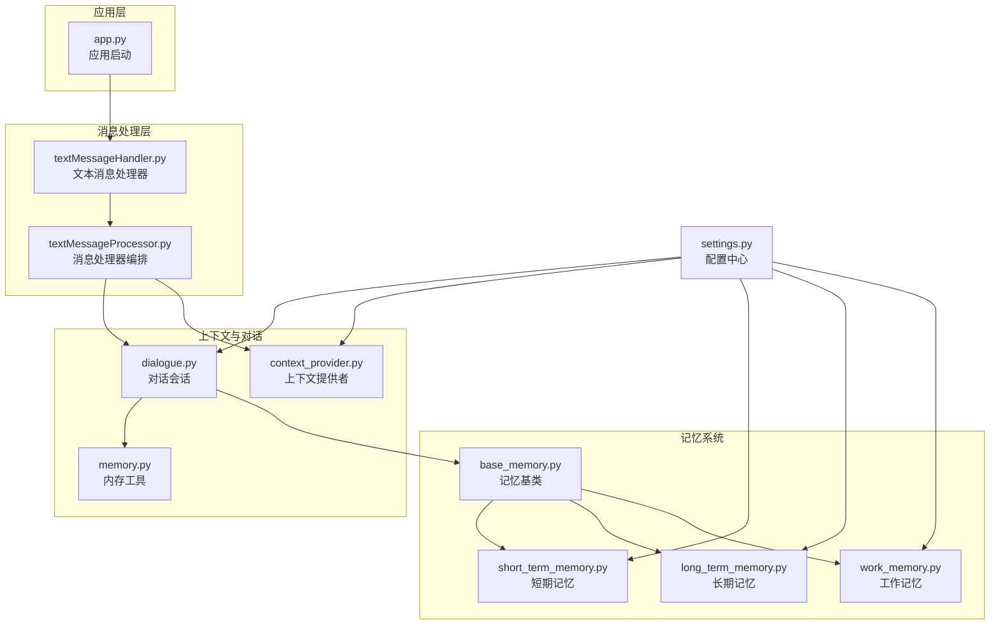
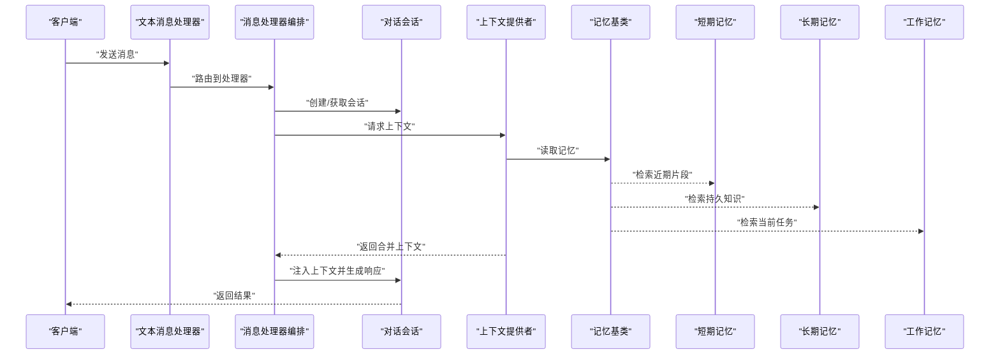
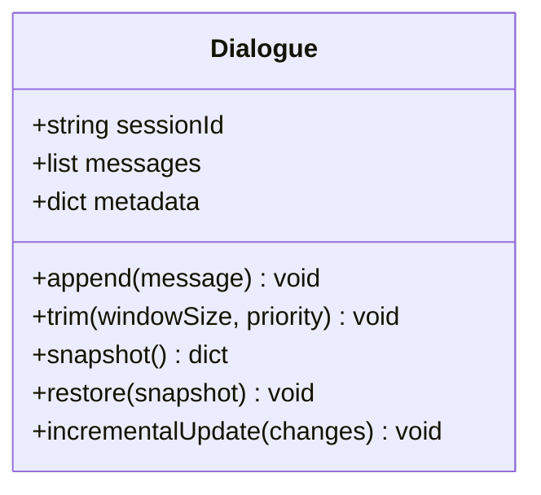
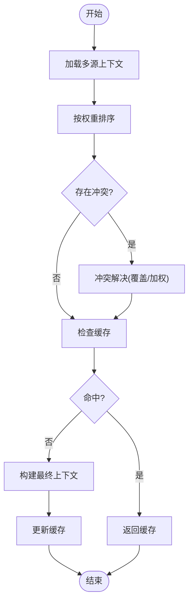
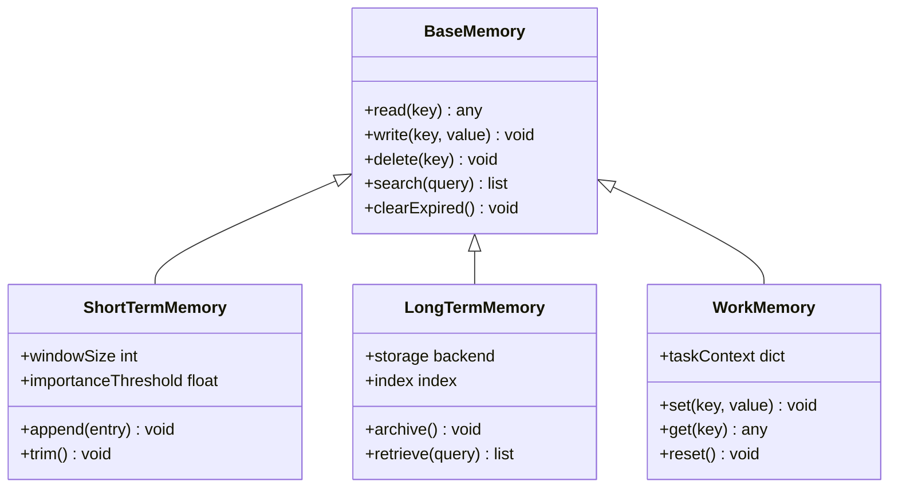
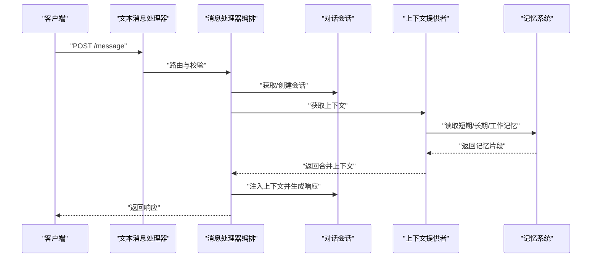
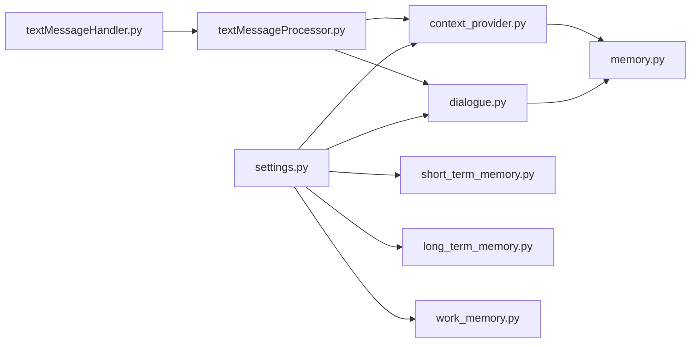

# 上下文管理机制

<cite>
**本文引用的文件**   
- [xiaozhi-server/core/utils/dialogue.py](file://main/xiaozhi-server/core/utils/dialogue.py)
- [xiaozhi-server/core/utils/memory.py](file://main/xiaozhi-server/core/utils/memory.py)
- [xiaozhi-server/core/utils/context_provider.py](file://main/xiaozhi-server/core/utils/context_provider.py)
- [xiaozhi-server/core/handle/textMessageHandler.py](file://main/xiaozhi-server/core/handle/textMessageHandler.py)
- [xiaozhi-server/core/handle/textMessageProcessor.py](file://main/xiaozhi-server/core/handle/textMessageProcessor.py)
- [xiaozhi-server/core/providers/memory/short_term_memory.py](file://main/xiaozhi-server/core/providers/memory/short_term_memory.py)
- [xiaozhi-server/core/providers/memory/long_term_memory.py](file://main/xiaozhi-server/core/providers/memory/long_term_memory.py)
- [xiaozhi-server/core/providers/memory/work_memory.py](file://main/xiaozhi-server/core/providers/memory/work_memory.py)
- [xiaozhi-server/core/providers/memory/base_memory.py](file://main/xiaozhi-server/core/providers/memory/base_memory.py)
- [xiaozhi-server/config/settings.py](file://main/xiaozhi-server/config/settings.py)
- [xiaozhi-server/app.py](file://main/xiaozhi-server/app.py)
</cite>

## 目录
1. [简介](#简介)
2. [项目结构](#项目结构)
3. [核心组件](#核心组件)
4. [架构总览](#架构总览)
5. [详细组件分析](#详细组件分析)
6. [依赖关系分析](#依赖关系分析)
7. [性能考量](#性能考量)
8. [故障排查指南](#故障排查指南)
9. [结论](#结论)
10. [附录：API 参考](#附录api-参考)

## 简介
本技术文档聚焦于对话上下文管理机制，围绕上下文窗口设计、消息历史管理、长度控制与重要信息保留策略展开；深入解析记忆系统架构（短期记忆、长期记忆、工作记忆）及其协作方式；说明上下文的序列化与反序列化机制以支持跨服务、跨实例共享；阐述上下文优先级管理（用户偏好、系统提示、业务规则）的权重分配；提供上下文操作的 API 接口，涵盖获取上下文、更新状态、清理过期数据；并覆盖上下文压缩、摘要生成、增量更新等高级特性。

## 项目结构
本项目将上下文与记忆能力集中在 xiaozhi-server 模块中，关键目录与职责如下：
- core/utils：对话与上下文工具层，包含对话会话、上下文提供者、通用内存工具等
- core/handle：消息处理入口，负责文本消息路由与处理器编排
- core/providers/memory：记忆系统实现，包括短期、长期与工作记忆的具体实现及基类
- config：配置中心，集中管理上下文窗口大小、保留策略、序列化格式等
- app：应用启动与模块装配

图表来源
- [app.py](file://main/xiaozhi-server/app.py)
- [textMessageHandler.py](file://main/xiaozhi-server/core/handle/textMessageHandler.py)
- [textMessageProcessor.py](file://main/xiaozhi-server/core/handle/textMessageProcessor.py)
- [dialogue.py](file://main/xiaozhi-server/core/utils/dialogue.py)
- [context_provider.py](file://main/xiaozhi-server/core/utils/context_provider.py)
- [memory.py](file://main/xiaozhi-server/core/utils/memory.py)
- [base_memory.py](file://main/xiaozhi-server/core/providers/memory/base_memory.py)
- [short_term_memory.py](file://main/xiaozhi-server/core/providers/memory/short_term_memory.py)
- [long_term_memory.py](file://main/xiaozhi-server/core/providers/memory/long_term_memory.py)
- [work_memory.py](file://main/xiaozhi-server/core/providers/memory/work_memory.py)
- [settings.py](file://main/xiaozhi-server/config/settings.py)

章节来源
- [app.py](file://main/xiaozhi-server/app.py)
- [settings.py](file://main/xiaozhi-server/config/settings.py)

## 核心组件
- 对话与会话管理：维护单次对话的生命周期、消息历史、时间戳与元数据
- 上下文提供者：聚合多源上下文（系统提示、用户偏好、业务规则），按优先级合并
- 记忆系统：短期记忆（近期对话片段）、长期记忆（持久化知识/画像）、工作记忆（当前任务上下文）
- 上下文工具：长度控制、压缩、摘要、增量更新、序列化/反序列化
- 配置中心：统一参数（窗口大小、保留策略、序列化格式、优先级权重）

章节来源
- [dialogue.py](file://main/xiaozhi-server/core/utils/dialogue.py)
- [context_provider.py](file://main/xiaozhi-server/core/utils/context_provider.py)
- [memory.py](file://main/xiaozhi-server/core/utils/memory.py)
- [base_memory.py](file://main/xiaozhi-server/core/providers/memory/base_memory.py)
- [short_term_memory.py](file://main/xiaozhi-server/core/providers/memory/short_term_memory.py)
- [long_term_memory.py](file://main/xiaozhi-server/core/providers/memory/long_term_memory.py)
- [work_memory.py](file://main/xiaozhi-server/core/providers/memory/work_memory.py)
- [settings.py](file://main/xiaozhi-server/config/settings.py)

## 架构总览
上下文管理机制采用分层与插件化设计：消息处理层调用对话与会话对象，通过上下文提供者聚合多源上下文，再由记忆系统按需检索与更新。配置中心驱动各组件行为，确保一致性与可配置性。

图表来源
- [textMessageHandler.py](file://main/xiaozhi-server/core/handle/textMessageHandler.py)
- [textMessageProcessor.py](file://main/xiaozhi-server/core/handle/textMessageProcessor.py)
- [dialogue.py](file://main/xiaozhi-server/core/utils/dialogue.py)
- [context_provider.py](file://main/xiaozhi-server/core/utils/context_provider.py)
- [base_memory.py](file://main/xiaozhi-server/core/providers/memory/base_memory.py)
- [short_term_memory.py](file://main/xiaozhi-server/core/providers/memory/short_term_memory.py)
- [long_term_memory.py](file://main/xiaozhi-server/core/providers/memory/long_term_memory.py)
- [work_memory.py](file://main/xiaozhi-server/core/providers/memory/work_memory.py)

## 详细组件分析

### 对话与会话（Dialogue）
- 职责：维护会话 ID、消息历史、时间线、上下文快照、生命周期事件
- 关键能力：
  - 消息追加与裁剪：基于窗口大小与重要性评分进行裁剪
  - 上下文快照：在关键节点保存快照用于恢复或回溯
  - 增量更新：仅对新增或变更部分进行合并，减少开销
- 复杂度：消息历史为 O(n)，裁剪与快照为 O(k)（k 为窗口大小）

图表来源
- [dialogue.py](file://main/xiaozhi-server/core/utils/dialogue.py)

章节来源
- [dialogue.py](file://main/xiaozhi-server/core/utils/dialogue.py)

### 上下文提供者（Context Provider）
- 职责：聚合系统提示、用户偏好、业务规则等多源上下文，按权重合并
- 关键能力：
  - 优先级排序：系统提示 > 业务规则 > 用户偏好（可配置）
  - 冲突解决：后者优先级高时覆盖前者，或采用加权融合
  - 缓存与失效：对稳定上下文进行缓存，设置 TTL 与失效策略
- 复杂度：合并与排序为 O(m log m)（m 为上下文片段数）

图表来源
- [context_provider.py](file://main/xiaozhi-server/core/utils/context_provider.py)
- [settings.py](file://main/xiaozhi-server/config/settings.py)

章节来源
- [context_provider.py](file://main/xiaozhi-server/core/utils/context_provider.py)
- [settings.py](file://main/xiaozhi-server/config/settings.py)

### 记忆系统（Memory System）
- 短期记忆（Short-Term Memory）
  - 存储近期对话片段，支持滑动窗口与重要性评分裁剪
  - 快速读写，适合高频访问
- 长期记忆（Long-Term Memory）
  - 持久化存储用户画像、领域知识、历史摘要
  - 支持检索增强（关键词/向量）与定期归档
- 工作记忆（Work Memory）
  - 当前任务相关的临时上下文，如工具调用结果、中间状态
  - 生命周期短，随任务完成而清理

图表来源
- [base_memory.py](file://main/xiaozhi-server/core/providers/memory/base_memory.py)
- [short_term_memory.py](file://main/xiaozhi-server/core/providers/memory/short_term_memory.py)
- [long_term_memory.py](file://main/xiaozhi-server/core/providers/memory/long_term_memory.py)
- [work_memory.py](file://main/xiaozhi-server/core/providers/memory/work_memory.py)

章节来源
- [base_memory.py](file://main/xiaozhi-server/core/providers/memory/base_memory.py)
- [short_term_memory.py](file://main/xiaozhi-server/core/providers/memory/short_term_memory.py)
- [long_term_memory.py](file://main/xiaozhi-server/core/providers/memory/long_term_memory.py)
- [work_memory.py](file://main/xiaozhi-server/core/providers/memory/work_memory.py)

### 消息处理与编排（Text Message Handler & Processor）
- 文本消息处理器：接收消息，校验与路由至对应处理器
- 消息处理器编排：协调对话、上下文、记忆与响应生成，保证一致性

图表来源
- [textMessageHandler.py](file://main/xiaozhi-server/core/handle/textMessageHandler.py)
- [textMessageProcessor.py](file://main/xiaozhi-server/core/handle/textMessageProcessor.py)
- [dialogue.py](file://main/xiaozhi-server/core/utils/dialogue.py)
- [context_provider.py](file://main/xiaozhi-server/core/utils/context_provider.py)
- [memory.py](file://main/xiaozhi-server/core/utils/memory.py)

章节来源
- [textMessageHandler.py](file://main/xiaozhi-server/core/handle/textMessageHandler.py)
- [textMessageProcessor.py](file://main/xiaozhi-server/core/handle/textMessageProcessor.py)

## 依赖关系分析
- 低耦合：记忆系统与对话、上下文提供者通过基类与接口解耦
- 可配置：所有关键参数（窗口大小、权重、TTL）集中于 settings.py
- 可扩展：新增记忆类型或上下文源只需实现基类与注册

图表来源
- [settings.py](file://main/xiaozhi-server/config/settings.py)
- [dialogue.py](file://main/xiaozhi-server/core/utils/dialogue.py)
- [context_provider.py](file://main/xiaozhi-server/core/utils/context_provider.py)
- [memory.py](file://main/xiaozhi-server/core/utils/memory.py)
- [short_term_memory.py](file://main/xiaozhi-server/core/providers/memory/short_term_memory.py)
- [long_term_memory.py](file://main/xiaozhi-server/core/providers/memory/long_term_memory.py)
- [work_memory.py](file://main/xiaozhi-server/core/providers/memory/work_memory.py)
- [textMessageHandler.py](file://main/xiaozhi-server/core/handle/textMessageHandler.py)
- [textMessageProcessor.py](file://main/xiaozhi-server/core/handle/textMessageProcessor.py)

章节来源
- [settings.py](file://main/xiaozhi-server/config/settings.py)
- [dialogue.py](file://main/xiaozhi-server/core/utils/dialogue.py)
- [context_provider.py](file://main/xiaozhi-server/core/utils/context_provider.py)
- [memory.py](file://main/xiaozhi-server/core/utils/memory.py)
- [textMessageHandler.py](file://main/xiaozhi-server/core/handle/textMessageHandler.py)
- [textMessageProcessor.py](file://main/xiaozhi-server/core/handle/textMessageProcessor.py)

## 性能考量
- 窗口裁剪：使用重要性评分与滑动窗口降低 O(n) 写入成本，保持 O(k) 查询
- 上下文缓存：对稳定上下文启用缓存与 TTL，减少重复计算
- 增量更新：仅合并变更片段，避免全量重建
- 记忆检索：短期记忆本地缓存，长期记忆索引加速，工作记忆内存直读
- 序列化：采用高效格式（如 JSON/Protobuf）与压缩策略，降低网络与存储开销

[本节为通用指导，不直接分析具体文件]

## 故障排查指南
- 上下文缺失或不完整
  - 检查上下文提供者是否成功加载多源上下文
  - 确认缓存未过期且无并发写冲突
- 窗口溢出或丢失重要信息
  - 调整窗口大小与重要性阈值
  - 审查裁剪策略与快照点
- 记忆检索缓慢
  - 优化短期记忆索引与长期记忆检索算法
  - 增加缓存命中率与预热策略
- 序列化失败
  - 验证数据结构兼容性与版本迁移
  - 检查跨服务传输编码与压缩配置

章节来源
- [context_provider.py](file://main/xiaozhi-server/core/utils/context_provider.py)
- [dialogue.py](file://main/xiaozhi-server/core/utils/dialogue.py)
- [memory.py](file://main/xiaozhi-server/core/utils/memory.py)

## 结论
本项目的上下文管理机制通过分层设计与插件化架构，实现了灵活的上下文窗口管理、高效的记忆系统与稳定的序列化共享。通过配置中心统一管理参数，结合重要性评分、缓存与增量更新，有效平衡了性能与准确性。未来可进一步引入更智能的摘要生成与自适应权重调整，以提升用户体验与系统鲁棒性。

[本节为总结，不直接分析具体文件]

## 附录：API 参考
- 获取上下文
  - 接口：GET /context/{sessionId}
  - 描述：返回指定会话的当前上下文快照
  - 参数：sessionId（必填）
  - 返回：上下文 JSON（含系统提示、用户偏好、业务规则、记忆片段）
- 更新状态
  - 接口：POST /context/{sessionId}/update
  - 描述：增量更新会话上下文（追加消息、修改偏好、刷新记忆）
  - 参数：sessionId（必填），changes（变更体）
  - 返回：更新结果与新的上下文哈希
- 清理过期数据
  - 接口：DELETE /context/{sessionId}/cleanup
  - 描述：清理过期记忆与缓存，释放资源
  - 参数：sessionId（必填），policy（可选，清理策略）
  - 返回：清理统计与状态码

[本节为概念性 API 定义，不直接映射具体代码文件]