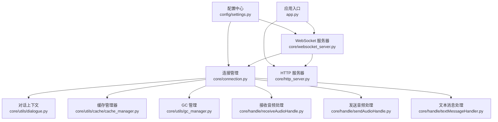
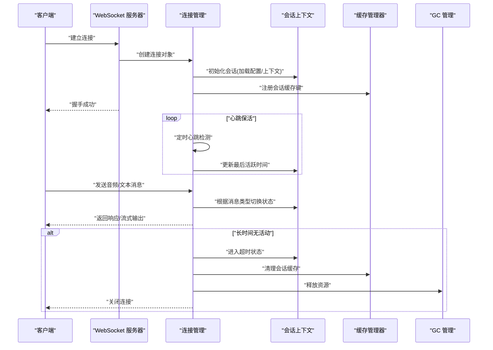
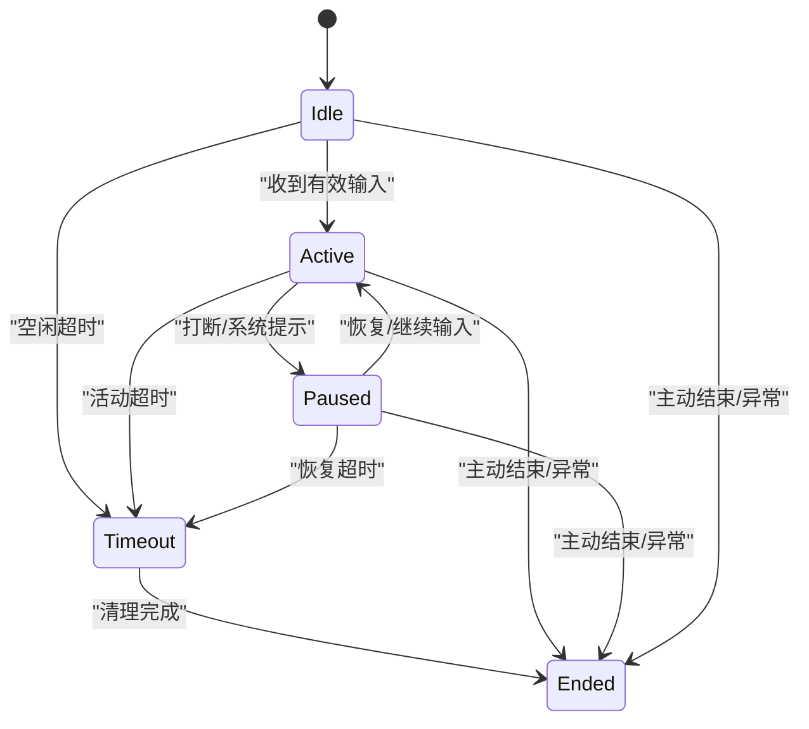
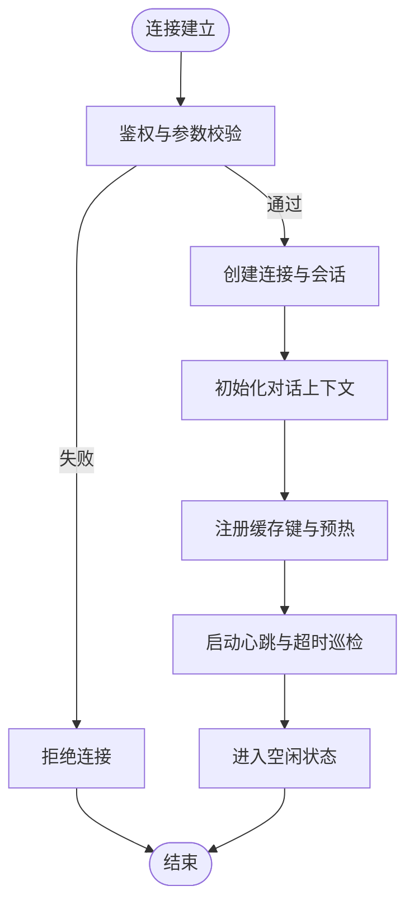
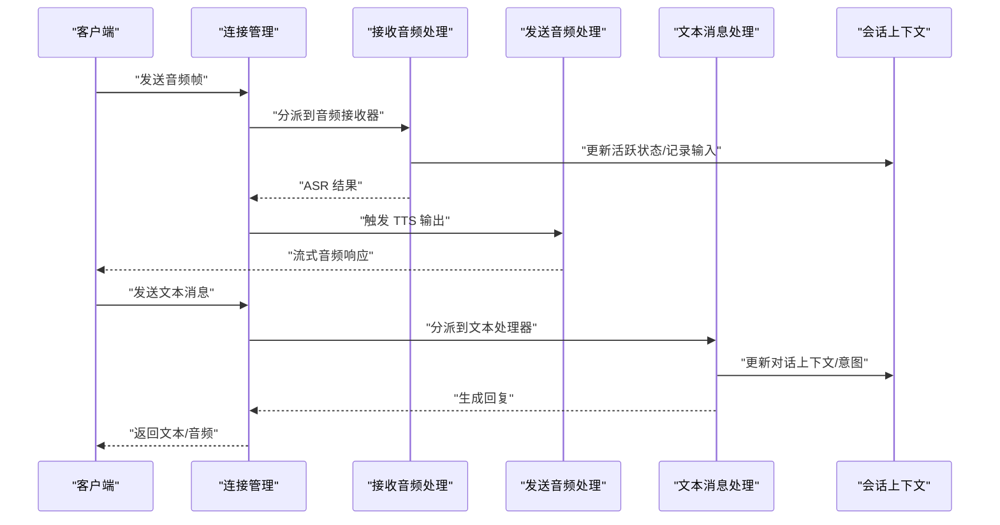
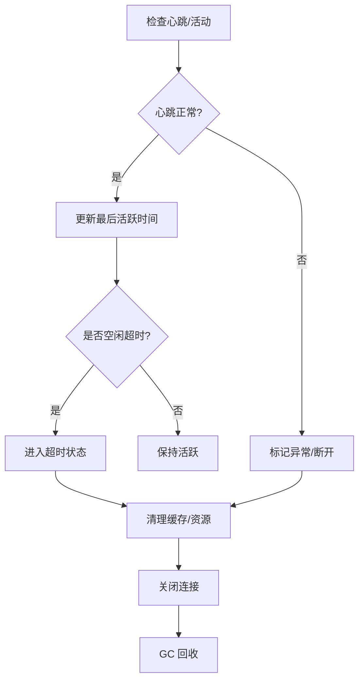
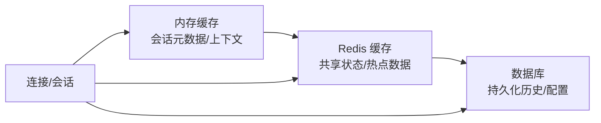
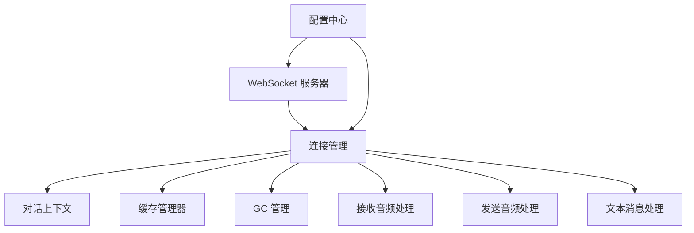

# 会话生命周期管理

<cite>
**本文引用的文件**   
- [app.py](file://main/xiaozhi-server/app.py)
- [websocket_server.py](file://main/xiaozhi-server/core/websocket_server.py)
- [connection.py](file://main/xiaozhi-server/core/connection.py)
- [http_server.py](file://main/xiaozhi-server/core/http_server.py)
- [dialogue.py](file://main/xiaozhi-server/core/utils/dialogue.py)
- [cache_manager.py](file://main/xiaozhi-server/core/utils/cache/cache_manager.py)
- [gc_manager.py](file://main/xiaozhi-server/core/utils/gc_manager.py)
- [receiveAudioHandle.py](file://main/xiaozhi-server/core/handle/receiveAudioHandle.py)
- [sendAudioHandle.py](file://main/xiaozhi-server/core/handle/sendAudioHandle.py)
- [textMessageHandler.py](file://main/xiaozhi-server/core/handle/textMessageHandler.py)
- [settings.py](file://main/xiaozhi-server/config/settings.py)
</cite>

## 目录
1. [简介](#简介)
2. [项目结构](#项目结构)
3. [核心组件](#核心组件)
4. [架构总览](#架构总览)
5. [详细组件分析](#详细组件分析)
6. [依赖关系分析](#依赖关系分析)
7. [性能考虑](#性能考虑)
8. [故障排查指南](#故障排查指南)
9. [结论](#结论)
10. [附录：API 接口文档](#附录api-接口文档)

## 简介
本技术文档聚焦于对话会话的生命周期管理，覆盖会话的创建、初始化、状态转换与销毁全流程；阐述会话状态机设计（空闲、活跃、暂停、超时等）及转换条件；说明会话超时机制的实现（心跳检测、自动清理策略、资源释放流程）；梳理会话数据的持久化策略（内存缓存、数据库存储、Redis 缓存的使用场景）；提供会话管理的 API 接口文档（创建会话、查询状态、更新配置、删除会话）；并给出并发安全、内存泄漏防护与性能优化建议。

## 项目结构
本项目为多模块服务，会话生命周期主要位于 xiaozhi-server 后端：
- WebSocket 接入层负责连接建立、鉴权与会话绑定
- 连接管理层维护连接对象与会话上下文
- 业务处理层按消息类型路由到不同处理器（音频/文本）
- 工具层提供对话上下文、缓存与 GC 管理
- 配置层提供超时、心跳、缓存等运行时参数

**图表来源** 
- [websocket_server.py](file://main/xiaozhi-server/core/websocket_server.py)
- [connection.py](file://main/xiaozhi-server/core/connection.py)
- [dialogue.py](file://main/xiaozhi-server/core/utils/dialogue.py)
- [cache_manager.py](file://main/xiaozhi-server/core/utils/cache/cache_manager.py)
- [gc_manager.py](file://main/xiaozhi-server/core/utils/gc_manager.py)
- [receiveAudioHandle.py](file://main/xiaozhi-server/core/handle/receiveAudioHandle.py)
- [sendAudioHandle.py](file://main/xiaozhi-server/core/handle/sendAudioHandle.py)
- [textMessageHandler.py](file://main/xiaozhi-server/core/handle/textMessageHandler.py)
- [http_server.py](file://main/xiaozhi-server/core/http_server.py)
- [app.py](file://main/xiaozhi-server/app.py)
- [settings.py](file://main/xiaozhi-server/config/settings.py)

**章节来源**
- [app.py](file://main/xiaozhi-server/app.py)
- [websocket_server.py](file://main/xiaozhi-server/core/websocket_server.py)
- [connection.py](file://main/xiaozhi-server/core/connection.py)
- [http_server.py](file://main/xiaozhi-server/core/http_server.py)
- [settings.py](file://main/xiaozhi-server/config/settings.py)

## 核心组件
- WebSocket 服务器：负责监听端口、接受连接、鉴权与会话绑定，启动心跳与超时巡检任务。
- 连接管理：封装单个连接的读写循环、消息分发、状态切换、资源释放。
- 对话上下文：维护当前会话的对话历史、意图、TTS/ASR 状态、VAD 状态等。
- 缓存管理器：提供内存/Redis 多级缓存能力，用于会话元数据、临时结果与热点数据。
- GC 管理：统一回收会话相关资源，避免内存泄漏。
- 业务处理器：音频接收/发送、文本消息处理等，驱动会话状态流转。
- 配置中心：集中管理超时、心跳间隔、缓存策略等运行参数。

**章节来源**
- [websocket_server.py](file://main/xiaozhi-server/core/websocket_server.py)
- [connection.py](file://main/xiaozhi-server/core/connection.py)
- [dialogue.py](file://main/xiaozhi-server/core/utils/dialogue.py)
- [cache_manager.py](file://main/xiaozhi-server/core/utils/cache/cache_manager.py)
- [gc_manager.py](file://main/xiaozhi-server/core/utils/gc_manager.py)
- [receiveAudioHandle.py](file://main/xiaozhi-server/core/handle/receiveAudioHandle.py)
- [sendAudioHandle.py](file://main/xiaozhi-server/core/handle/sendAudioHandle.py)
- [textMessageHandler.py](file://main/xiaozhi-server/core/handle/textMessageHandler.py)
- [settings.py](file://main/xiaozhi-server/config/settings.py)

## 架构总览
下图展示从客户端连接到会话销毁的整体流程，包括握手、鉴权、会话创建、心跳保活、业务处理与超时清理。

**图表来源** 
- [websocket_server.py](file://main/xiaozhi-server/core/websocket_server.py)
- [connection.py](file://main/xiaozhi-server/core/connection.py)
- [dialogue.py](file://main/xiaozhi-server/core/utils/dialogue.py)
- [cache_manager.py](file://main/xiaozhi-server/core/utils/cache/cache_manager.py)
- [gc_manager.py](file://main/xiaozhi-server/core/utils/gc_manager.py)

## 详细组件分析

### 会话状态机设计
会话状态定义与转换条件如下：
- 空闲（Idle）：连接已建立但未开始对话，等待首条消息或唤醒指令。
- 活跃（Active）：正在进行语音/文本交互，处于 VAD/ASR/TTS 流水线中。
- 暂停（Paused）：因外部事件（如用户打断、系统提示）暂时挂起，可恢复。
- 超时（Timeout）：超过最大空闲时长未收到有效消息，进入清理流程。
- 结束（Ended）：主动结束或异常退出，资源释放完毕。

状态转换规则：
- Idle → Active：收到有效输入（音频帧/文本消息），完成鉴权后进入。
- Active → Paused：触发打断、系统提示或外部控制命令。
- Paused → Active：恢复指令或继续输入。
- Active/Idle → Timeout：心跳/活动检测失败或超过空闲阈值。
- Any → Ended：正常关闭、错误退出或强制销毁。

**图表来源** 
- [connection.py](file://main/xiaozhi-server/core/connection.py)
- [dialogue.py](file://main/xiaozhi-server/core/utils/dialogue.py)
- [receiveAudioHandle.py](file://main/xiaozhi-server/core/handle/receiveAudioHandle.py)
- [sendAudioHandle.py](file://main/xiaozhi-server/core/handle/sendAudioHandle.py)
- [textMessageHandler.py](file://main/xiaozhi-server/core/handle/textMessageHandler.py)

**章节来源**
- [connection.py](file://main/xiaozhi-server/core/connection.py)
- [dialogue.py](file://main/xiaozhi-server/core/utils/dialogue.py)
- [receiveAudioHandle.py](file://main/xiaozhi-server/core/handle/receiveAudioHandle.py)
- [sendAudioHandle.py](file://main/xiaozhi-server/core/handle/sendAudioHandle.py)
- [textMessageHandler.py](file://main/xiaozhi-server/core/handle/textMessageHandler.py)

### 会话创建与初始化
- 连接建立：WebSocket 服务器接受连接，校验协议与鉴权信息。
- 会话实例化：创建连接对象并初始化会话上下文（用户标识、设备信息、模型配置）。
- 资源准备：加载对话历史、初始化缓存键、注册回调与定时器。
- 状态设置：初始化为空闲状态，启动心跳与超时巡检。

**图表来源** 
- [websocket_server.py](file://main/xiaozhi-server/core/websocket_server.py)
- [connection.py](file://main/xiaozhi-server/core/connection.py)
- [dialogue.py](file://main/xiaozhi-server/core/utils/dialogue.py)
- [cache_manager.py](file://main/xiaozhi-server/core/utils/cache/cache_manager.py)
- [settings.py](file://main/xiaozhi-server/config/settings.py)

**章节来源**
- [websocket_server.py](file://main/xiaozhi-server/core/websocket_server.py)
- [connection.py](file://main/xiaozhi-server/core/connection.py)
- [dialogue.py](file://main/xiaozhi-server/core/utils/dialogue.py)
- [cache_manager.py](file://main/xiaozhi-server/core/utils/cache/cache_manager.py)
- [settings.py](file://main/xiaozhi-server/config/settings.py)

### 会话状态转换与业务处理
- 音频输入：接收音频帧，经 VAD/ASR 处理后进入活跃状态，驱动 TTS 输出。
- 文本输入：解析文本消息，更新对话上下文，必要时触发工具调用或意图识别。
- 中断与恢复：支持打断当前输出，切换到暂停状态，等待恢复指令。
- 状态同步：每次状态变更需更新会话上下文与缓存，确保一致性。

**图表来源** 
- [connection.py](file://main/xiaozhi-server/core/connection.py)
- [receiveAudioHandle.py](file://main/xiaozhi-server/core/handle/receiveAudioHandle.py)
- [sendAudioHandle.py](file://main/xiaozhi-server/core/handle/sendAudioHandle.py)
- [textMessageHandler.py](file://main/xiaozhi-server/core/handle/textMessageHandler.py)
- [dialogue.py](file://main/xiaozhi-server/core/utils/dialogue.py)

**章节来源**
- [connection.py](file://main/xiaozhi-server/core/connection.py)
- [receiveAudioHandle.py](file://main/xiaozhi-server/core/handle/receiveAudioHandle.py)
- [sendAudioHandle.py](file://main/xiaozhi-server/core/handle/sendAudioHandle.py)
- [textMessageHandler.py](file://main/xiaozhi-server/core/handle/textMessageHandler.py)
- [dialogue.py](file://main/xiaozhi-server/core/utils/dialogue.py)

### 会话超时机制与自动清理
- 心跳检测：周期性发送心跳，客户端需按时响应；未响应则标记为异常。
- 空闲超时：统计最近活动时间，超过阈值进入超时状态。
- 自动清理：超时后触发清理流程，释放连接、清空缓存、回收资源。
- 资源释放：关闭 I/O、取消定时器、解除引用，交由 GC 回收。

**图表来源** 
- [connection.py](file://main/xiaozhi-server/core/connection.py)
- [gc_manager.py](file://main/xiaozhi-server/core/utils/gc_manager.py)
- [cache_manager.py](file://main/xiaozhi-server/core/utils/cache/cache_manager.py)
- [settings.py](file://main/xiaozhi-server/config/settings.py)

**章节来源**
- [connection.py](file://main/xiaozhi-server/core/connection.py)
- [gc_manager.py](file://main/xiaozhi-server/core/utils/gc_manager.py)
- [cache_manager.py](file://main/xiaozhi-server/core/utils/cache/cache_manager.py)
- [settings.py](file://main/xiaozhi-server/config/settings.py)

### 会话数据持久化策略
- 内存缓存：会话元数据、短期上下文、中间结果使用内存缓存，低延迟高吞吐。
- Redis 缓存：跨进程共享的会话状态、热点配置、分布式锁与限流计数。
- 数据库存储：长期对话历史、审计日志、用户偏好与设备信息。
- 缓存一致性：写路径先更新内存，再异步落盘；读路径优先内存，缺失回源。

**图表来源** 
- [cache_manager.py](file://main/xiaozhi-server/core/utils/cache/cache_manager.py)
- [dialogue.py](file://main/xiaozhi-server/core/utils/dialogue.py)
- [settings.py](file://main/xiaozhi-server/config/settings.py)

**章节来源**
- [cache_manager.py](file://main/xiaozhi-server/core/utils/cache/cache_manager.py)
- [dialogue.py](file://main/xiaozhi-server/core/utils/dialogue.py)
- [settings.py](file://main/xiaozhi-server/config/settings.py)

### 并发安全与资源管理
- 并发安全：会话对象加锁保护关键段（状态切换、上下文写入），避免竞态条件。
- 线程模型：I/O 与业务处理分离，使用队列缓冲消息，防止阻塞。
- 资源管理：显式释放连接、缓冲区与第三方资源句柄，减少内存占用。
- 监控指标：暴露活跃会话数、平均时延、错误率、缓存命中率等指标。

**章节来源**
- [connection.py](file://main/xiaozhi-server/core/connection.py)
- [gc_manager.py](file://main/xiaozhi-server/core/utils/gc_manager.py)
- [cache_manager.py](file://main/xiaozhi-server/core/utils/cache/cache_manager.py)

## 依赖关系分析
- WebSocket 服务器依赖连接管理与配置中心。
- 连接管理依赖对话上下文、缓存管理器与 GC 管理。
- 业务处理器依赖连接管理与对话上下文。
- 配置中心影响所有组件的行为（超时、心跳、缓存策略）。

**图表来源** 
- [websocket_server.py](file://main/xiaozhi-server/core/websocket_server.py)
- [connection.py](file://main/xiaozhi-server/core/connection.py)
- [dialogue.py](file://main/xiaozhi-server/core/utils/dialogue.py)
- [cache_manager.py](file://main/xiaozhi-server/core/utils/cache/cache_manager.py)
- [gc_manager.py](file://main/xiaozhi-server/core/utils/gc_manager.py)
- [receiveAudioHandle.py](file://main/xiaozhi-server/core/handle/receiveAudioHandle.py)
- [sendAudioHandle.py](file://main/xiaozhi-server/core/handle/sendAudioHandle.py)
- [textMessageHandler.py](file://main/xiaozhi-server/core/handle/textMessageHandler.py)
- [settings.py](file://main/xiaozhi-server/config/settings.py)

**章节来源**
- [websocket_server.py](file://main/xiaozhi-server/core/websocket_server.py)
- [connection.py](file://main/xiaozhi-server/core/connection.py)
- [settings.py](file://main/xiaozhi-server/config/settings.py)

## 性能考虑
- 心跳间隔与超时阈值调优：平衡实时性与资源消耗，避免频繁清理。
- 缓存命中率提升：热点会话预加载，合理设置 TTL 与淘汰策略。
- 流式处理：音频/文本采用流式传输，降低端到端时延。
- 背压与限流：在高并发下限制单会话速率，保障整体稳定性。
- 监控与告警：基于指标进行容量规划与问题定位。

[本节为通用指导，不直接分析具体文件]

## 故障排查指南
- 连接异常：检查鉴权失败、网络抖动、证书问题。
- 心跳超时：确认客户端心跳实现与服务端配置一致。
- 内存泄漏：关注未释放的连接、缓冲区与第三方资源。
- 缓存不一致：核对写路径顺序与回源逻辑。
- 状态卡死：检查状态机转换条件与异常分支。

**章节来源**
- [connection.py](file://main/xiaozhi-server/core/connection.py)
- [gc_manager.py](file://main/xiaozhi-server/core/utils/gc_manager.py)
- [cache_manager.py](file://main/xiaozhi-server/core/utils/cache/cache_manager.py)

## 结论
会话生命周期管理通过清晰的状态机、稳健的心跳与超时机制、多级缓存与统一的资源回收，实现了高可用、低时延的对话体验。建议在部署中结合监控指标持续优化参数，确保在大规模并发下的稳定性与性能。

[本节为总结性内容，不直接分析具体文件]

## 附录：API 接口文档
以下为会话管理的常用 API 示例（以 HTTP 为主，WebSocket 用于实时通信）：
- 创建会话
  - 方法：POST /api/session/create
  - 请求体：{ "user_id": "...", "device_id": "...", "model_config": {...} }
  - 响应：{ "session_id": "...", "status": "idle" }
- 查询状态
  - 方法：GET /api/session/{session_id}/status
  - 响应：{ "status": "active|paused|timeout|ended", "last_active": "..." }
- 更新配置
  - 方法：PUT /api/session/{session_id}/config
  - 请求体：{ "heartbeat_interval": 30, "timeout_seconds": 120, "cache_policy": "memory|redis" }
  - 响应：{ "updated": true }
- 删除会话
  - 方法：DELETE /api/session/{session_id}
  - 响应：{ "deleted": true }

注意：
- 所有接口需携带鉴权头（如 Authorization）。
- 超时与心跳参数应与服务端配置保持一致。
- 删除会话会触发清理流程，释放缓存与资源。

[本节为概念性接口说明，不直接映射具体代码文件]