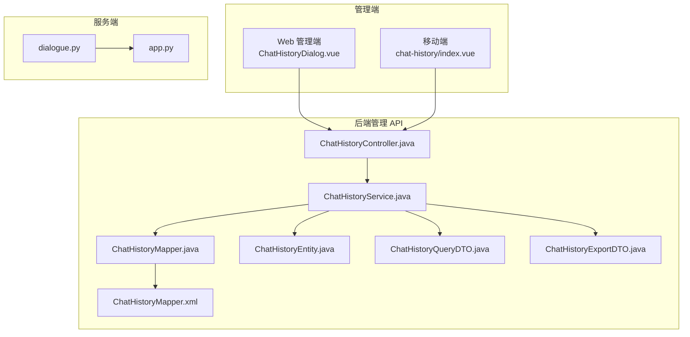
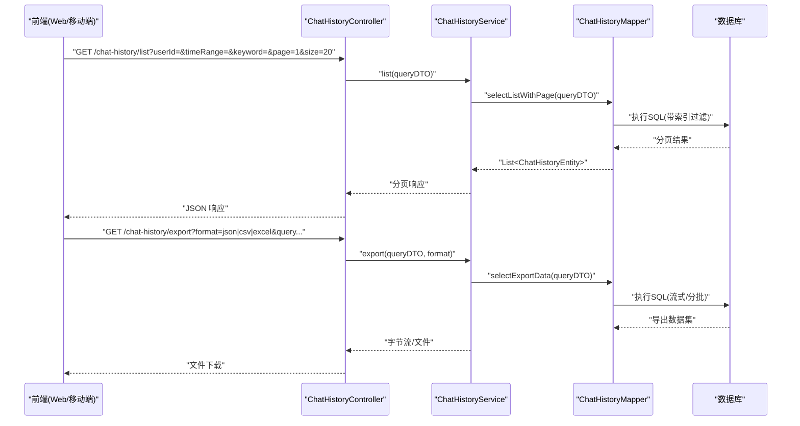
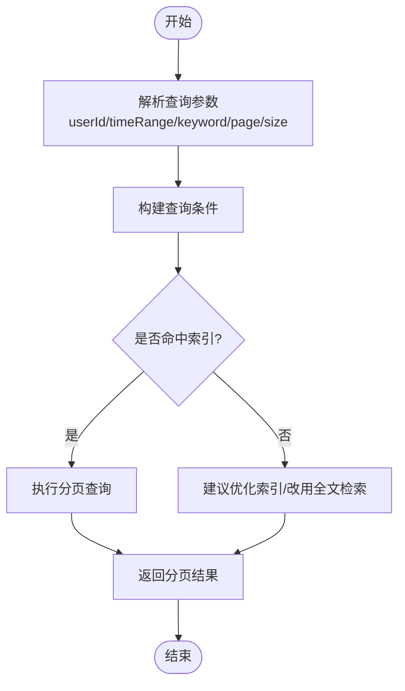
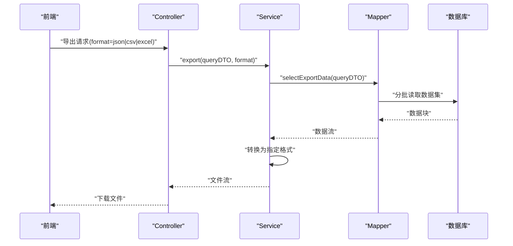
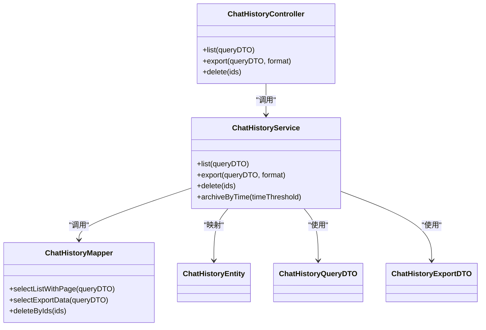

# 对话历史管理

<cite>
**本文引用的文件**   
- [manager-api/src/main/java/xiaozhi/controller/ChatHistoryController.java](file://main/manager-api/src/main/java/xiaozhi/controller/ChatHistoryController.java)
- [manager-api/src/main/java/xiaozhi/service/ChatHistoryService.java](file://main/manager-api/src/main/java/xiaozhi/service/ChatHistoryService.java)
- [manager-api/src/main/java/xiaozhi/mapper/ChatHistoryMapper.java](file://main/manager-api/src/main/java/xiaozhi/mapper/ChatHistoryMapper.java)
- [manager-api/src/main/resources/mapper/ChatHistoryMapper.xml](file://main/manager-api/src/main/resources/mapper/ChatHistoryMapper.xml)
- [manager-api/src/main/java/xiaozhi/model/entity/ChatHistoryEntity.java](file://main/manager-api/src/main/java/xiaozhi/model/entity/ChatHistoryEntity.java)
- [manager-api/src/main/java/xiaozhi/model/dto/ChatHistoryQueryDTO.java](file://main/manager-api/src/main/java/xiaozhi/model/dto/ChatHistoryQueryDTO.java)
- [manager-api/src/main/java/xiaozhi/model/dto/ChatHistoryExportDTO.java](file://main/manager-api/src/main/java/xiaozhi/model/dto/ChatHistoryExportDTO.java)
- [manager-web/src/components/ChatHistoryDialog.vue](file://main/manager-web/src/components/ChatHistoryDialog.vue)
- [manager-web/src/apis/module/chat-history.js](file://main/manager-web/src/apis/module/chat-history.js)
- [manager-mobile/src/api/chat-history/index.ts](file://main/manager-mobile/src/api/chat-history/index.ts)
- [manager-mobile/src/pages/chat-history/index.vue](file://main/manager-mobile/src/pages/chat-history/index.vue)
- [xiaozhi-server/core/utils/dialogue.py](file://main/xiaozhi-server/core/utils/dialogue.py)
- [xiaozhi-server/app.py](file://main/xiaozhi-server/app.py)
</cite>

## 目录
1. [简介](#简介)
2. [项目结构](#项目结构)
3. [核心组件](#核心组件)
4. [架构总览](#架构总览)
5. [详细组件分析](#详细组件分析)
6. [依赖关系分析](#依赖关系分析)
7. [性能与存储优化](#性能与存储优化)
8. [故障排查指南](#故障排查指南)
9. [结论](#结论)
10. [附录：API 接口文档](#附录api-接口文档)

## 简介
本技术文档围绕“对话历史管理”展开，覆盖数据模型设计、查询与维护能力、导出功能以及前后端 API 的完整说明。目标是为开发者提供从数据库到前端页面的端到端参考，帮助快速理解并扩展对话历史模块。

## 项目结构
对话历史管理涉及后端管理 API（Java）、Web 管理端（Vue）、移动端（UniApp）以及服务端对话处理（Python）。整体分层如下：
- 后端管理 API：控制器、服务层、数据访问层（MyBatis Mapper + XML）
- Web 管理端：对话框组件与 API 调用封装
- 移动端：页面与 API 调用封装
- 服务端：对话上下文与持久化入口

图表来源 
- [manager-web/src/components/ChatHistoryDialog.vue](file://main/manager-web/src/components/ChatHistoryDialog.vue)
- [manager-mobile/src/pages/chat-history/index.vue](file://main/manager-mobile/src/pages/chat-history/index.vue)
- [manager-api/src/main/java/xiaozhi/controller/ChatHistoryController.java](file://main/manager-api/src/main/java/xiaozhi/controller/ChatHistoryController.java)
- [manager-api/src/main/java/xiaozhi/service/ChatHistoryService.java](file://main/manager-api/src/main/java/xiaozhi/service/ChatHistoryService.java)
- [manager-api/src/main/java/xiaozhi/mapper/ChatHistoryMapper.java](file://main/manager-api/src/main/java/xiaozhi/mapper/ChatHistoryMapper.java)
- [manager-api/src/main/resources/mapper/ChatHistoryMapper.xml](file://main/manager-api/src/main/resources/mapper/ChatHistoryMapper.xml)
- [xiaozhi-server/core/utils/dialogue.py](file://main/xiaozhi-server/core/utils/dialogue.py)
- [xiaozhi-server/app.py](file://main/xiaozhi-server/app.py)

章节来源
- [manager-api/src/main/java/xiaozhi/controller/ChatHistoryController.java](file://main/manager-api/src/main/java/xiaozhi/controller/ChatHistoryController.java)
- [manager-api/src/main/java/xiaozhi/service/ChatHistoryService.java](file://main/manager-api/src/main/java/xiaozhi/service/ChatHistoryService.java)
- [manager-api/src/main/resources/mapper/ChatHistoryMapper.xml](file://main/manager-api/src/main/resources/mapper/ChatHistoryMapper.xml)
- [manager-web/src/components/ChatHistoryDialog.vue](file://main/manager-web/src/components/ChatHistoryDialog.vue)
- [manager-mobile/src/pages/chat-history/index.vue](file://main/manager-mobile/src/pages/chat-history/index.vue)
- [xiaozhi-server/core/utils/dialogue.py](file://main/xiaozhi-server/core/utils/dialogue.py)
- [xiaozhi-server/app.py](file://main/xiaozhi-server/app.py)

## 核心组件
- ChatHistoryController：对外暴露 REST 接口，负责参数校验、分页与导出流程编排。
- ChatHistoryService：业务编排层，封装查询条件构建、分页、导出格式转换、删除与归档等逻辑。
- ChatHistoryMapper / ChatHistoryMapper.xml：数据访问层，定义 SQL 查询、分页、统计与导出所需的数据集。
- ChatHistoryEntity：实体映射，对应数据库表字段。
- ChatHistoryQueryDTO / ChatHistoryExportDTO：请求与导出数据传输对象。
- 前端组件：Web 管理端的对话框与移动端页面，负责展示、筛选、分页与导出触发。
- 服务端对话处理：对话上下文与写入入口，为后续持久化提供数据源。

章节来源
- [manager-api/src/main/java/xiaozhi/controller/ChatHistoryController.java](file://main/manager-api/src/main/java/xiaozhi/controller/ChatHistoryController.java)
- [manager-api/src/main/java/xiaozhi/service/ChatHistoryService.java](file://main/manager-api/src/main/java/xiaozhi/service/ChatHistoryService.java)
- [manager-api/src/main/java/xiaozhi/mapper/ChatHistoryMapper.java](file://main/manager-api/src/main/java/xiaozhi/mapper/ChatHistoryMapper.java)
- [manager-api/src/main/resources/mapper/ChatHistoryMapper.xml](file://main/manager-api/src/main/resources/mapper/ChatHistoryMapper.xml)
- [manager-api/src/main/java/xiaozhi/model/entity/ChatHistoryEntity.java](file://main/manager-api/src/main/java/xiaozhi/model/entity/ChatHistoryEntity.java)
- [manager-api/src/main/java/xiaozhi/model/dto/ChatHistoryQueryDTO.java](file://main/manager-api/src/main/java/xiaozhi/model/dto/ChatHistoryQueryDTO.java)
- [manager-api/src/main/java/xiaozhi/model/dto/ChatHistoryExportDTO.java](file://main/manager-api/src/main/java/xiaozhi/model/dto/ChatHistoryExportDTO.java)
- [manager-web/src/components/ChatHistoryDialog.vue](file://main/manager-web/src/components/ChatHistoryDialog.vue)
- [manager-mobile/src/pages/chat-history/index.vue](file://main/manager-mobile/src/pages/chat-history/index.vue)
- [xiaozhi-server/core/utils/dialogue.py](file://main/xiaozhi-server/core/utils/dialogue.py)

## 架构总览
对话历史管理的典型调用链：
- 前端发起查询或导出请求
- Controller 接收并校验参数，调用 Service
- Service 组装查询条件，调用 Mapper 获取数据
- Mapper 通过 XML 执行 SQL 查询数据库
- 返回结果给前端进行渲染或下载

图表来源 
- [manager-api/src/main/java/xiaozhi/controller/ChatHistoryController.java](file://main/manager-api/src/main/java/xiaozhi/controller/ChatHistoryController.java)
- [manager-api/src/main/java/xiaozhi/service/ChatHistoryService.java](file://main/manager-api/src/main/java/xiaozhi/service/ChatHistoryService.java)
- [manager-api/src/main/java/xiaozhi/mapper/ChatHistoryMapper.java](file://main/manager-api/src/main/java/xiaozhi/mapper/ChatHistoryMapper.java)
- [manager-api/src/main/resources/mapper/ChatHistoryMapper.xml](file://main/manager-api/src/main/resources/mapper/ChatHistoryMapper.xml)

## 详细组件分析

### 数据模型与表结构设计
- 实体 ChatHistoryEntity：包含用户标识、会话标识、消息内容、角色、时间戳、状态等字段。
- 建议表结构要点：
  - 主键：自增 ID 或 UUID
  - 索引：userId、createdAt、sessionId、status
  - 分区策略：按时间范围（如按月）分区，便于清理与归档
  - 文本字段：content 使用合适的字符集与压缩存储
- 复杂度与空间：大文本字段建议分表或外置对象存储，仅保留引用路径

章节来源
- [manager-api/src/main/java/xiaozhi/model/entity/ChatHistoryEntity.java](file://main/manager-api/src/main/java/xiaozhi/model/entity/ChatHistoryEntity.java)

### 查询功能实现
- 支持按用户、时间范围、关键词搜索、分页查询
- Service 层构建动态条件，Mapper 层在 XML 中拼装 SQL，确保索引命中
- 关键词搜索建议使用全文索引或搜索引擎（如 ES），避免 LIKE 全表扫描

图表来源 
- [manager-api/src/main/java/xiaozhi/service/ChatHistoryService.java](file://main/manager-api/src/main/java/xiaozhi/service/ChatHistoryService.java)
- [manager-api/src/main/resources/mapper/ChatHistoryMapper.xml](file://main/manager-api/src/main/resources/mapper/ChatHistoryMapper.xml)

章节来源
- [manager-api/src/main/java/xiaozhi/service/ChatHistoryService.java](file://main/manager-api/src/main/java/xiaozhi/service/ChatHistoryService.java)
- [manager-api/src/main/resources/mapper/ChatHistoryMapper.xml](file://main/manager-api/src/main/resources/mapper/ChatHistoryMapper.xml)

### 维护操作（清理、归档、备份恢复）
- 清理：基于时间阈值或用户配置，定期删除过期记录
- 归档：将历史数据迁移至冷存储（如对象存储或归档库），原表保留摘要信息
- 备份恢复：使用数据库原生工具或第三方方案，结合分区策略提升效率

章节来源
- [manager-api/src/main/java/xiaozhi/service/ChatHistoryService.java](file://main/manager-api/src/main/java/xiaozhi/service/ChatHistoryService.java)

### 导出功能（JSON、CSV、Excel）
- 支持多格式导出，Service 层统一数据转换，Controller 层输出文件流
- 大数据量场景采用流式导出，避免内存溢出

图表来源 
- [manager-api/src/main/java/xiaozhi/controller/ChatHistoryController.java](file://main/manager-api/src/main/java/xiaozhi/controller/ChatHistoryController.java)
- [manager-api/src/main/java/xiaozhi/service/ChatHistoryService.java](file://main/manager-api/src/main/java/xiaozhi/service/ChatHistoryService.java)
- [manager-api/src/main/java/xiaozhi/mapper/ChatHistoryMapper.java](file://main/manager-api/src/main/java/xiaozhi/mapper/ChatHistoryMapper.java)
- [manager-api/src/main/resources/mapper/ChatHistoryMapper.xml](file://main/manager-api/src/main/resources/mapper/ChatHistoryMapper.xml)

章节来源
- [manager-api/src/main/java/xiaozhi/controller/ChatHistoryController.java](file://main/manager-api/src/main/java/xiaozhi/controller/ChatHistoryController.java)
- [manager-api/src/main/java/xiaozhi/service/ChatHistoryService.java](file://main/manager-api/src/main/java/xiaozhi/service/ChatHistoryService.java)
- [manager-api/src/main/java/xiaozhi/model/dto/ChatHistoryExportDTO.java](file://main/manager-api/src/main/java/xiaozhi/model/dto/ChatHistoryExportDTO.java)

### 前端交互（Web 与移动端）
- Web：ChatHistoryDialog 组件提供筛选、分页、导出按钮
- 移动端：chat-history 页面提供列表展示与基础操作
- 两者均通过各自 API 模块调用后端接口

章节来源
- [manager-web/src/components/ChatHistoryDialog.vue](file://main/manager-web/src/components/ChatHistoryDialog.vue)
- [manager-web/src/apis/module/chat-history.js](file://main/manager-web/src/apis/module/chat-history.js)
- [manager-mobile/src/api/chat-history/index.ts](file://main/manager-mobile/src/api/chat-history/index.ts)
- [manager-mobile/src/pages/chat-history/index.vue](file://main/manager-mobile/src/pages/chat-history/index.vue)

### 服务端对话处理
- dialogue.py 负责对话上下文管理与写入入口，为持久化提供数据源
- app.py 作为应用启动与路由配置，承载外部接口与服务集成

章节来源
- [xiaozhi-server/core/utils/dialogue.py](file://main/xiaozhi-server/core/utils/dialogue.py)
- [xiaozhi-server/app.py](file://main/xiaozhi-server/app.py)

## 依赖关系分析
- Controller 依赖 Service，Service 依赖 Mapper 与 DTO/Entity
- Mapper 依赖 XML 中的 SQL 定义
- 前端依赖后端 API，移动端与 Web 端分别封装各自的请求模块

图表来源 
- [manager-api/src/main/java/xiaozhi/controller/ChatHistoryController.java](file://main/manager-api/src/main/java/xiaozhi/controller/ChatHistoryController.java)
- [manager-api/src/main/java/xiaozhi/service/ChatHistoryService.java](file://main/manager-api/src/main/java/xiaozhi/service/ChatHistoryService.java)
- [manager-api/src/main/java/xiaozhi/mapper/ChatHistoryMapper.java](file://main/manager-api/src/main/java/xiaozhi/mapper/ChatHistoryMapper.java)
- [manager-api/src/main/java/xiaozhi/model/entity/ChatHistoryEntity.java](file://main/manager-api/src/main/java/xiaozhi/model/entity/ChatHistoryEntity.java)
- [manager-api/src/main/java/xiaozhi/model/dto/ChatHistoryQueryDTO.java](file://main/manager-api/src/main/java/xiaozhi/model/dto/ChatHistoryQueryDTO.java)
- [manager-api/src/main/java/xiaozhi/model/dto/ChatHistoryExportDTO.java](file://main/manager-api/src/main/java/xiaozhi/model/dto/ChatHistoryExportDTO.java)

章节来源
- [manager-api/src/main/java/xiaozhi/controller/ChatHistoryController.java](file://main/manager-api/src/main/java/xiaozhi/controller/ChatHistoryController.java)
- [manager-api/src/main/java/xiaozhi/service/ChatHistoryService.java](file://main/manager-api/src/main/java/xiaozhi/service/ChatHistoryService.java)
- [manager-api/src/main/java/xiaozhi/mapper/ChatHistoryMapper.java](file://main/manager-api/src/main/java/xiaozhi/mapper/ChatHistoryMapper.java)
- [manager-api/src/main/java/xiaozhi/model/entity/ChatHistoryEntity.java](file://main/manager-api/src/main/java/xiaozhi/model/entity/ChatHistoryEntity.java)
- [manager-api/src/main/java/xiaozhi/model/dto/ChatHistoryQueryDTO.java](file://main/manager-api/src/main/java/xiaozhi/model/dto/ChatHistoryQueryDTO.java)
- [manager-api/src/main/java/xiaozhi/model/dto/ChatHistoryExportDTO.java](file://main/manager-api/src/main/java/xiaozhi/model/dto/ChatHistoryExportDTO.java)

## 性能与存储优化
- 索引优化：为 userId、createdAt、sessionId、status 建立复合索引；关键词搜索引入全文索引或搜索引擎
- 分页策略：严格限制 page size，避免一次性加载过多数据
- 分区策略：按时间分区（月/季度），便于清理与归档
- 导出优化：流式导出、分批读取，降低内存占用
- 存储管理：大文本外置对象存储，表内仅存引用；冷热数据分离
- 缓存策略：热点查询可加 Redis 缓存，注意失效与一致性

[本节为通用指导，不直接分析具体文件]

## 故障排查指南
- 查询慢：检查执行计划、索引命中情况；避免 LIKE 前缀模糊匹配
- 导出失败：确认数据量与内存限制；启用流式导出
- 权限问题：确认鉴权与用户隔离逻辑
- 数据不一致：核对写入入口与事务边界

章节来源
- [manager-api/src/main/resources/mapper/ChatHistoryMapper.xml](file://main/manager-api/src/main/resources/mapper/ChatHistoryMapper.xml)
- [manager-api/src/main/java/xiaozhi/service/ChatHistoryService.java](file://main/manager-api/src/main/java/xiaozhi/service/ChatHistoryService.java)

## 结论
对话历史管理模块在后端以清晰的三层架构组织，配合合理的索引与分区策略，能够支撑高并发与大数据量场景。前端提供友好的交互体验，导出功能满足多样化需求。建议在关键词搜索与海量数据导出方面持续优化，以提升整体性能与用户体验。

[本节为总结性内容，不直接分析具体文件]

## 附录：API 接口文档
- 列表查询
  - 方法：GET
  - 路径：/chat-history/list
  - 参数：userId、timeRange(start,end)、keyword、page、size
  - 返回：分页数据（records、total、page、size）
- 导出
  - 方法：GET
  - 路径：/chat-history/export
  - 参数：format=json|csv|excel、query 同列表
  - 返回：文件流下载
- 删除
  - 方法：DELETE
  - 路径：/chat-history/delete
  - 参数：ids（数组）
  - 返回：操作结果

章节来源
- [manager-api/src/main/java/xiaozhi/controller/ChatHistoryController.java](file://main/manager-api/src/main/java/xiaozhi/controller/ChatHistoryController.java)
- [manager-api/src/main/java/xiaozhi/service/ChatHistoryService.java](file://main/manager-api/src/main/java/xiaozhi/service/ChatHistoryService.java)
- [manager-api/src/main/resources/mapper/ChatHistoryMapper.xml](file://main/manager-api/src/main/resources/mapper/ChatHistoryMapper.xml)