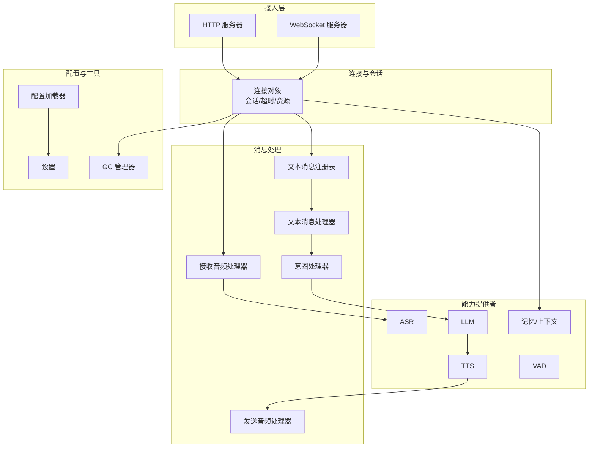
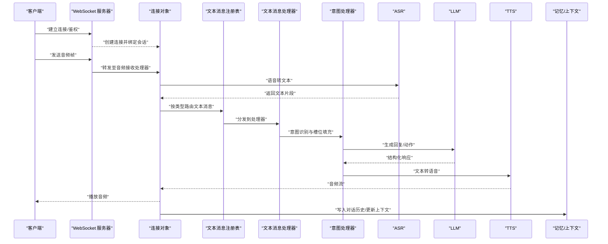
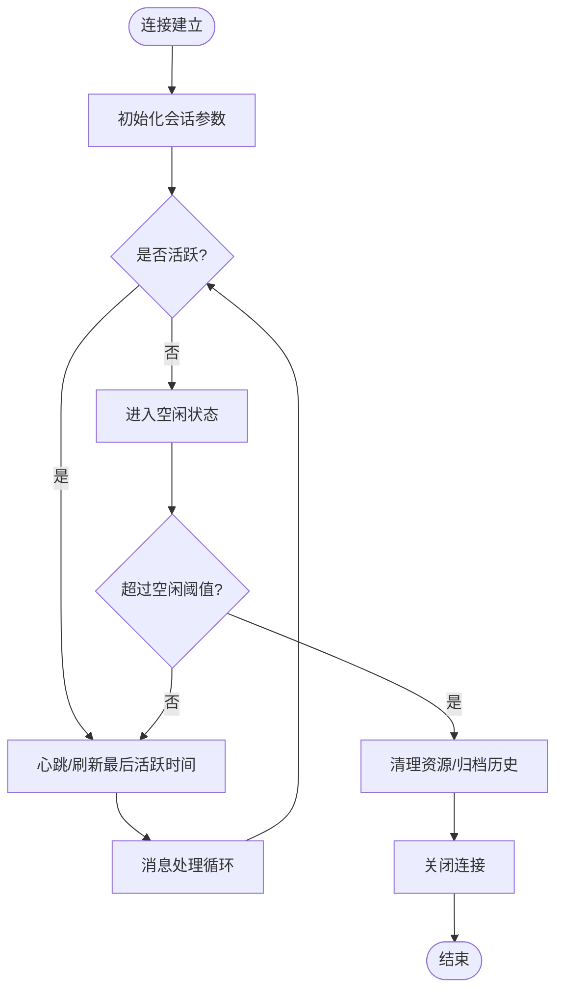
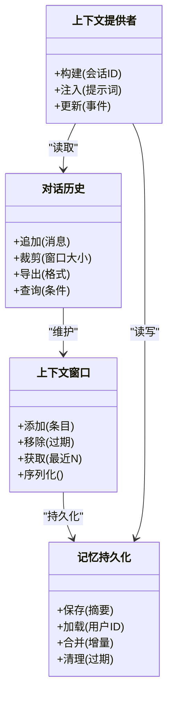
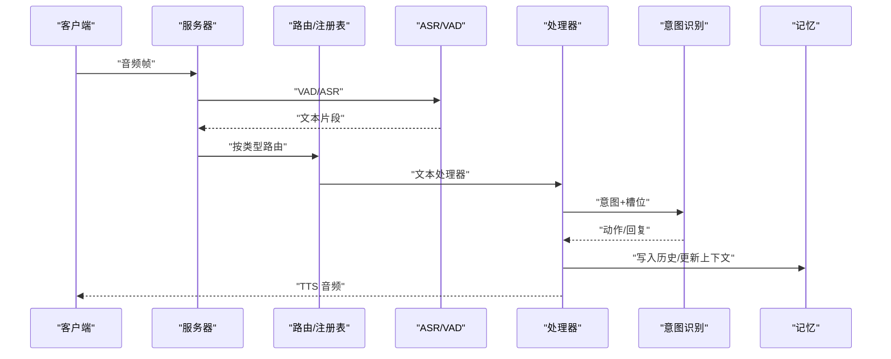
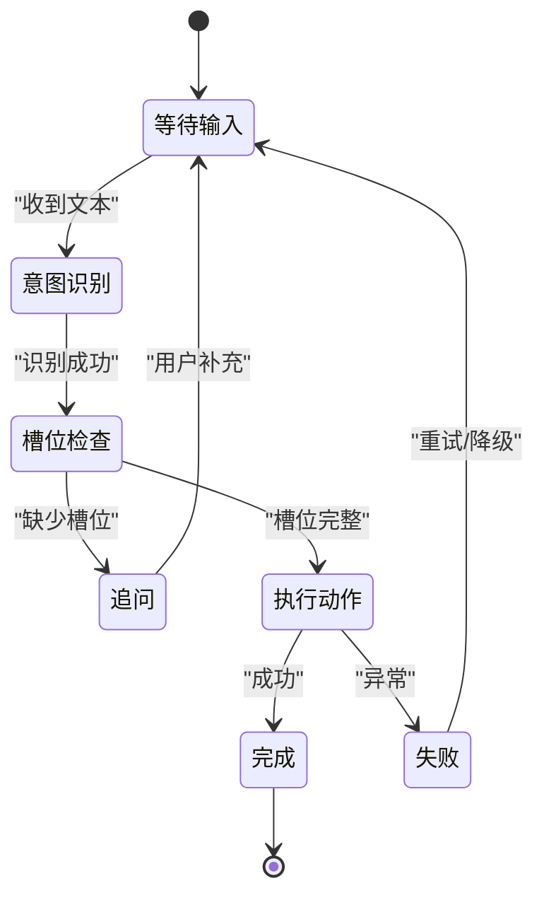
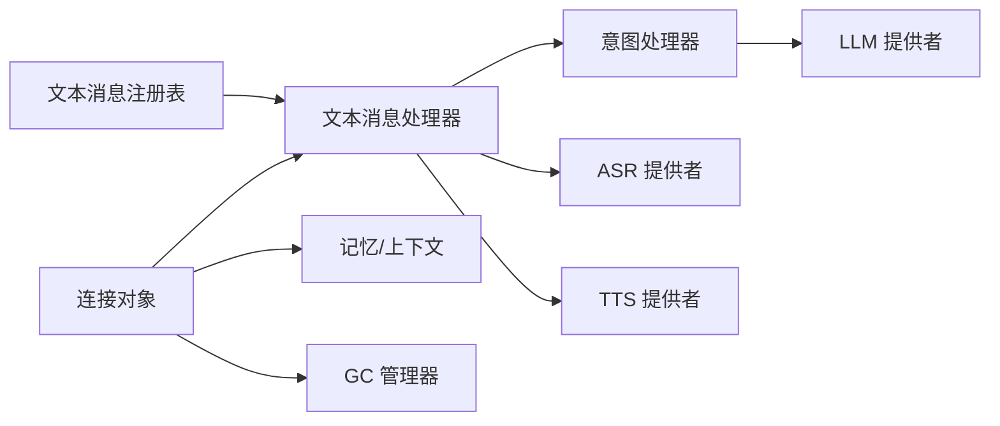

# 对话管理

<cite>
**本文引用的文件**   
- [app.py](file://main/xiaozhi-server/app.py)
- [websocket_server.py](file://main/xiaozhi-server/core/websocket_server.py)
- [connection.py](file://main/xiaozhi-server/core/connection.py)
- [http_server.py](file://main/xiaozhi-server/core/http_server.py)
- [dialogue.py](file://main/xiaozhi-server/core/utils/dialogue.py)
- [memory.py](file://main/xiaozhi-server/core/utils/memory.py)
- [context_provider.py](file://main/xiaozhi-server/core/utils/context_provider.py)
- [textMessageHandlerRegistry.py](file://main/xiaozhi-server/core/handle/textMessageHandlerRegistry.py)
- [textMessageProcessor.py](file://main/xiaozhi-server/core/handle/textMessageProcessor.py)
- [intentHandler.py](file://main/xiaozhi-server/core/handle/intentHandler.py)
- [receiveAudioHandle.py](file://main/xiaozhi-server/core/handle/receiveAudioHandle.py)
- [sendAudioHandle.py](file://main/xiaozhi-server/core/handle/sendAudioHandle.py)
- [asr.py](file://main/xiaozhi-server/core/utils/asr.py)
- [llm.py](file://main/xiaozhi-server/core/utils/llm.py)
- [tts.py](file://main/xiaozhi-server/core/utils/tts.py)
- [vad.py](file://main/xiaozhi-server/core/utils/vad.py)
- [gc_manager.py](file://main/xiaozhi-server/core/utils/gc_manager.py)
- [settings.py](file://main/xiaozhi-server/config/settings.py)
- [config_loader.py](file://main/xiaozhi-server/config/config_loader.py)
- [Memory_System_Architecture_Blueprint.md](file://main/xiaozhi-server/docs/architecture/Memory_System_Architecture_Blueprint.md)
- [cache-implementation.md](file://main/xiaozhi-server/docs/cache-implementation.md)
</cite>

## 目录
1. [简介](#简介)
2. [项目结构](#项目结构)
3. [核心组件](#核心组件)
4. [架构总览](#架构总览)
5. [详细组件分析](#详细组件分析)
6. [依赖关系分析](#依赖关系分析)
7. [性能考量](#性能考量)
8. [故障排查指南](#故障排查指南)
9. [结论](#结论)
10. [附录：API 接口文档](#附录api-接口文档)

## 简介
本技术文档面向对话管理系统，围绕会话生命周期、上下文与记忆、消息处理流程、对话状态机、历史查询与导出、并发与内存优化、数据迁移等主题进行系统化说明。目标是帮助开发者快速理解系统架构与关键实现路径，并为运维与扩展提供可操作的指导。

## 项目结构
本项目采用多模块组织方式，核心对话能力集中在 xiaozhi-server 子项目中：
- 服务层：WebSocket/HTTP 服务器负责连接接入与请求路由
- 连接层：连接对象维护会话上下文、超时与资源清理
- 处理层：文本/音频消息处理器、意图识别、工具调用
- 能力提供者：ASR、LLM、TTS、VAD、记忆等插件化实现
- 配置与工具：设置加载、日志、缓存、GC 管理等

图表来源
- [websocket_server.py:1-200](file://main/xiaozhi-server/core/websocket_server.py#L1-L200)
- [http_server.py:1-200](file://main/xiaozhi-server/core/http_server.py#L1-L200)
- [connection.py:1-200](file://main/xiaozhi-server/core/connection.py#L1-L200)
- [textMessageHandlerRegistry.py:1-200](file://main/xiaozhi-server/core/handle/textMessageHandlerRegistry.py#L1-L200)
- [textMessageProcessor.py:1-200](file://main/xiaozhi-server/core/handle/textMessageProcessor.py#L1-L200)
- [intentHandler.py:1-200](file://main/xiaozhi-server/core/handle/intentHandler.py#L1-L200)
- [receiveAudioHandle.py:1-200](file://main/xiaozhi-server/core/handle/receiveAudioHandle.py#L1-L200)
- [sendAudioHandle.py:1-200](file://main/xiaozhi-server/core/handle/sendAudioHandle.py#L1-L200)
- [asr.py:1-200](file://main/xiaozhi-server/core/utils/asr.py#L1-L200)
- [llm.py:1-200](file://main/xiaozhi-server/core/utils/llm.py#L1-L200)
- [tts.py:1-200](file://main/xiaozhi-server/core/utils/tts.py#L1-L200)
- [vad.py:1-200](file://main/xiaozhi-server/core/utils/vad.py#L1-L200)
- [memory.py:1-200](file://main/xiaozhi-server/core/utils/memory.py#L1-200)
- [gc_manager.py:1-200](file://main/xiaozhi-server/core/utils/gc_manager.py#L1-200)
- [settings.py:1-200](file://main/xiaozhi-server/config/settings.py#L1-200)
- [config_loader.py:1-200](file://main/xiaozhi-server/config/config_loader.py#L1-200)

章节来源
- [app.py:1-200](file://main/xiaozhi-server/app.py#L1-L200)
- [websocket_server.py:1-200](file://main/xiaozhi-server/core/websocket_server.py#L1-L200)
- [http_server.py:1-200](file://main/xiaozhi-server/core/http_server.py#L1-L200)
- [connection.py:1-200](file://main/xiaozhi-server/core/connection.py#L1-L200)

## 核心组件
- WebSocket/HTTP 服务器：负责接入、鉴权、路由到连接对象与处理器
- 连接对象：封装会话生命周期（创建、活跃、空闲、关闭）、心跳与超时、资源释放
- 消息处理管线：文本消息注册表与处理器、音频接收/发送处理器、意图识别与工具调用
- 能力提供者：ASR（语音转文本）、LLM（大模型推理）、TTS（文本转语音）、VAD（语音活动检测）
- 记忆与上下文：对话历史存储、上下文窗口、持久化策略
- 配置与工具：设置加载、日志、GC 管理、缓存

章节来源
- [websocket_server.py:1-200](file://main/xiaozhi-server/core/websocket_server.py#L1-L200)
- [http_server.py:1-200](file://main/xiaozhi-server/core/http_server.py#L1-L200)
- [connection.py:1-200](file://main/xiaozhi-server/core/connection.py#L1-L200)
- [textMessageHandlerRegistry.py:1-200](file://main/xiaozhi-server/core/handle/textMessageHandlerRegistry.py#L1-L200)
- [textMessageProcessor.py:1-200](file://main/xiaozhi-server/core/handle/textMessageProcessor.py#L1-L200)
- [intentHandler.py:1-200](file://main/xiaozhi-server/core/handle/intentHandler.py#L1-L200)
- [receiveAudioHandle.py:1-200](file://main/xiaozhi-server/core/handle/receiveAudioHandle.py#L1-L200)
- [sendAudioHandle.py:1-200](file://main/xiaozhi-server/core/handle/sendAudioHandle.py#L1-L200)
- [asr.py:1-200](file://main/xiaozhi-server/core/utils/asr.py#L1-L200)
- [llm.py:1-200](file://main/xiaozhi-server/core/utils/llm.py#L1-L200)
- [tts.py:1-200](file://main/xiaozhi-server/core/utils/tts.py#L1-L200)
- [vad.py:1-200](file://main/xiaozhi-server/core/utils/vad.py#L1-L200)
- [memory.py:1-200](file://main/xiaozhi-server/core/utils/memory.py#L1-200)
- [gc_manager.py:1-200](file://main/xiaozhi-server/core/utils/gc_manager.py#L1-200)
- [settings.py:1-200](file://main/xiaozhi-server/config/settings.py#L1-200)
- [config_loader.py:1-200](file://main/xiaozhi-server/config/config_loader.py#L1-200)

## 架构总览
对话系统的整体架构以“接入-连接-处理-能力”分层设计，通过插件化的能力提供者实现可扩展的语音交互链路。

图表来源
- [websocket_server.py:1-200](file://main/xiaozhi-server/core/websocket_server.py#L1-L200)
- [connection.py:1-200](file://main/xiaozhi-server/core/connection.py#L1-L200)
- [textMessageHandlerRegistry.py:1-200](file://main/xiaozhi-server/core/handle/textMessageHandlerRegistry.py#L1-L200)
- [textMessageProcessor.py:1-200](file://main/xiaozhi-server/core/handle/textMessageProcessor.py#L1-L200)
- [intentHandler.py:1-200](file://main/xiaozhi-server/core/handle/intentHandler.py#L1-L200)
- [receiveAudioHandle.py:1-200](file://main/xiaozhi-server/core/handle/receiveAudioHandle.py#L1-L200)
- [sendAudioHandle.py:1-200](file://main/xiaozhi-server/core/handle/sendAudioHandle.py#L1-L200)
- [asr.py:1-200](file://main/xiaozhi-server/core/utils/asr.py#L1-L200)
- [llm.py:1-200](file://main/xiaozhi-server/core/utils/llm.py#L1-L200)
- [tts.py:1-200](file://main/xiaozhi-server/core/utils/tts.py#L1-L200)
- [memory.py:1-200](file://main/xiaozhi-server/core/utils/memory.py#L1-200)

## 详细组件分析

### 会话生命周期管理
- 创建：WebSocket/HTTP 接入后创建连接对象，初始化会话标识、权限、配置、计时器
- 活跃：心跳保活、消息收发、上下文更新、资源引用计数
- 空闲/超时：基于配置的超时阈值触发清理，包括断开连接、释放资源、归档历史
- 关闭：显式关闭或异常退出时执行清理，确保无泄漏

章节来源
- [connection.py:1-200](file://main/xiaozhi-server/core/connection.py#L1-L200)
- [websocket_server.py:1-200](file://main/xiaozhi-server/core/websocket_server.py#L1-L200)
- [http_server.py:1-200](file://main/xiaozhi-server/core/http_server.py#L1-L200)
- [gc_manager.py:1-200](file://main/xiaozhi-server/core/utils/gc_manager.py#L1-200)
- [settings.py:1-200](file://main/xiaozhi-server/config/settings.py#L1-200)

### 上下文管理与记忆持久化
- 对话历史：按用户/会话维度追加消息，支持滑动窗口裁剪与压缩
- 上下文窗口：控制最近 N 轮或 Token 上限，避免超出模型输入限制
- 记忆持久化：将关键摘要、实体、偏好写入持久化存储，跨会话恢复
- 上下文提供者：为 LLM/意图识别提供结构化上下文注入

章节来源
- [memory.py:1-200](file://main/xiaozhi-server/core/utils/memory.py#L1-200)
- [context_provider.py:1-200](file://main/xiaozhi-server/core/utils/context_provider.py#L1-200)
- [Memory_System_Architecture_Blueprint.md:1-200](file://main/xiaozhi-server/docs/architecture/Memory_System_Architecture_Blueprint.md#L1-L200)
- [cache-implementation.md:1-200](file://main/xiaozhi-server/docs/cache-implementation.md#L1-L200)

### 消息处理流程
- 路由：根据消息类型（文本/音频/控制）分发到对应处理器
- 转换：音频经 VAD/ASR 转为文本；文本经 LLM/TTS 转为音频
- 错误处理：网络异常、模型超时、格式错误均捕获并回退

章节来源
- [textMessageHandlerRegistry.py:1-200](file://main/xiaozhi-server/core/handle/textMessageHandlerRegistry.py#L1-L200)
- [textMessageProcessor.py:1-200](file://main/xiaozhi-server/core/handle/textMessageProcessor.py#L1-L200)
- [receiveAudioHandle.py:1-200](file://main/xiaozhi-server/core/handle/receiveAudioHandle.py#L1-L200)
- [sendAudioHandle.py:1-200](file://main/xiaozhi-server/core/handle/sendAudioHandle.py#L1-L200)
- [asr.py:1-200](file://main/xiaozhi-server/core/utils/asr.py#L1-L200)
- [vad.py:1-200](file://main/xiaozhi-server/core/utils/vad.py#L1-L200)
- [intentHandler.py:1-200](file://main/xiaozhi-server/core/handle/intentHandler.py#L1-L200)
- [memory.py:1-200](file://main/xiaozhi-server/core/utils/memory.py#L1-200)

### 对话状态管理（意图识别、槽位填充、多轮状态机）
- 意图识别：从文本提取用户意图，结合上下文消歧
- 槽位填充：抽取关键参数，缺失时发起追问
- 多轮状态机：定义会话状态（等待输入、确认、执行、完成、失败），驱动流程推进

章节来源
- [intentHandler.py:1-200](file://main/xiaozhi-server/core/handle/intentHandler.py#L1-L200)
- [textMessageProcessor.py:1-200](file://main/xiaozhi-server/core/handle/textMessageProcessor.py#L1-L200)
- [memory.py:1-200](file://main/xiaozhi-server/core/utils/memory.py#L1-200)

### 对话历史查询与导出
- 查询：支持按用户 ID、会话 ID、时间范围、关键词筛选
- 导出：支持 JSON/CSV/Markdown 等格式，便于分析与审计
- 分页与索引：大数据量下使用分页与索引提升查询性能

章节来源
- [memory.py:1-200](file://main/xiaozhi-server/core/utils/memory.py#L1-200)
- [cache-implementation.md:1-200](file://main/xiaozhi-server/docs/cache-implementation.md#L1-L200)

## 依赖关系分析
- 低耦合高内聚：处理器与能力提供者通过接口解耦，便于替换与扩展
- 外部依赖：ASR/LLM/TTS 可通过配置切换不同供应商
- 潜在循环依赖：通过注册表与工厂模式避免直接导入

图表来源
- [textMessageHandlerRegistry.py:1-200](file://main/xiaozhi-server/core/handle/textMessageHandlerRegistry.py#L1-L200)
- [textMessageProcessor.py:1-200](file://main/xiaozhi-server/core/handle/textMessageProcessor.py#L1-L200)
- [intentHandler.py:1-200](file://main/xiaozhi-server/core/handle/intentHandler.py#L1-L200)
- [asr.py:1-200](file://main/xiaozhi-server/core/utils/asr.py#L1-L200)
- [llm.py:1-200](file://main/xiaozhi-server/core/utils/llm.py#L1-L200)
- [tts.py:1-200](file://main/xiaozhi-server/core/utils/tts.py#L1-L200)
- [connection.py:1-200](file://main/xiaozhi-server/core/connection.py#L1-L200)
- [memory.py:1-200](file://main/xiaozhi-server/core/utils/memory.py#L1-200)
- [gc_manager.py:1-200](file://main/xiaozhi-server/core/utils/gc_manager.py#L1-200)

章节来源
- [app.py:1-200](file://main/xiaozhi-server/app.py#L1-L200)
- [websocket_server.py:1-200](file://main/xiaozhi-server/core/websocket_server.py#L1-L200)
- [http_server.py:1-200](file://main/xiaozhi-server/core/http_server.py#L1-L200)

## 性能考量
- 并发处理：使用异步 I/O 与线程池隔离 CPU 密集任务（如 ASR/TTS）
- 内存优化：滑动窗口裁剪、流式传输、对象复用、及时释放引用
- 缓存策略：热点上下文与结果缓存，减少重复计算
- GC 管理：定期回收临时对象，避免内存抖动
- 限流与降级：对上游模型调用进行速率限制与熔断

章节来源
- [gc_manager.py:1-200](file://main/xiaozhi-server/core/utils/gc_manager.py#L1-200)
- [cache-implementation.md:1-200](file://main/xiaozhi-server/docs/cache-implementation.md#L1-L200)
- [settings.py:1-200](file://main/xiaozhi-server/config/settings.py#L1-200)

## 故障排查指南
- 连接中断：检查心跳与超时配置，查看网络连接与防火墙规则
- 模型超时：调整超时阈值，启用重试与降级策略
- 内存泄漏：监控进程内存，定位未释放对象与循环引用
- 消息丢失：检查队列长度与背压机制，确认消费者处理能力
- 历史查询慢：增加索引、分页、聚合查询

章节来源
- [connection.py:1-200](file://main/xiaozhi-server/core/connection.py#L1-L200)
- [gc_manager.py:1-200](file://main/xiaozhi-server/core/utils/gc_manager.py#L1-200)
- [memory.py:1-200](file://main/xiaozhi-server/core/utils/memory.py#L1-200)

## 结论
本对话管理系统以清晰的层次化架构与插件化能力提供者实现了高可扩展的语音交互链路。通过完善的会话生命周期、上下文与记忆管理、健壮的消息处理流程以及高效的并发与内存优化策略，能够满足复杂场景下的稳定运行需求。建议在生产环境中结合监控与告警持续优化性能与可靠性。

## 附录：API 接口文档
以下为常用 API 操作示例（概念性描述，具体字段与实现请参考对应处理器与服务端代码）：
- 管理对话会话
  - 创建会话：POST /api/session/create
  - 更新会话状态：PUT /api/session/{id}/status
  - 关闭会话：DELETE /api/session/{id}
- 查询历史记录
  - 列表查询：GET /api/history?user_id=&start_time=&end_time=&keyword=
  - 详情查询：GET /api/history/{id}
  - 导出：GET /api/history/export?format=json|csv&filters=...
- 清理过期数据
  - 定时清理：POST /api/cleanup/expired
  - 手动清理：POST /api/cleanup/manual?retention_days=

章节来源
- [http_server.py:1-200](file://main/xiaozhi-server/core/http_server.py#L1-L200)
- [memory.py:1-200](file://main/xiaozhi-server/core/utils/memory.py#L1-200)
- [gc_manager.py:1-200](file://main/xiaozhi-server/core/utils/gc_manager.py#L1-200)