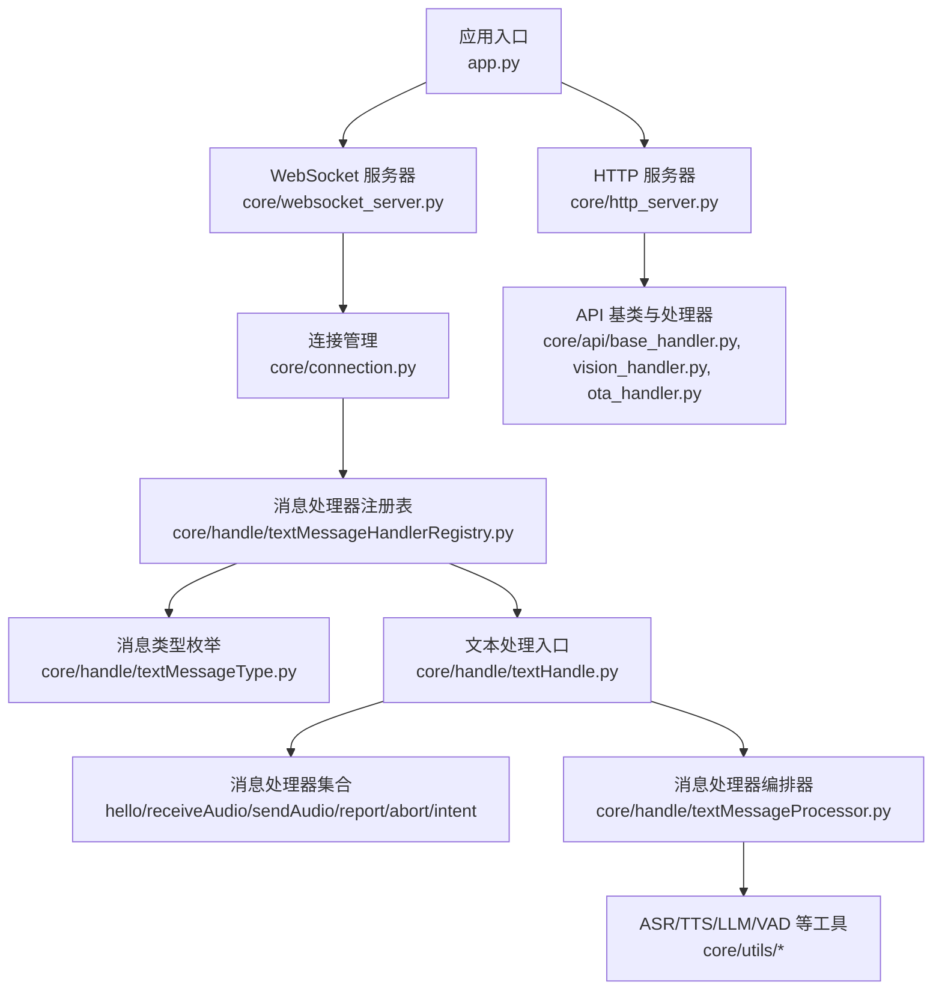
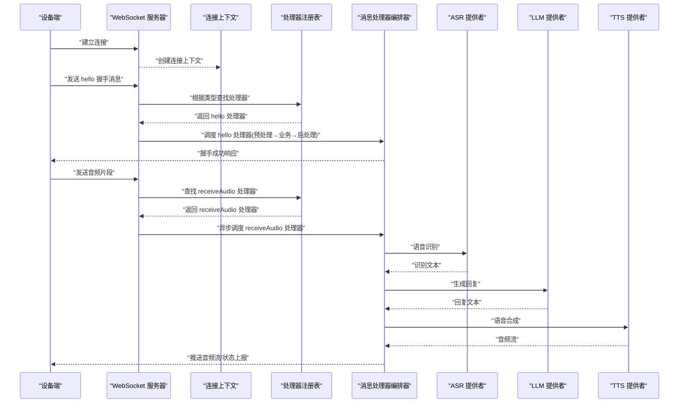
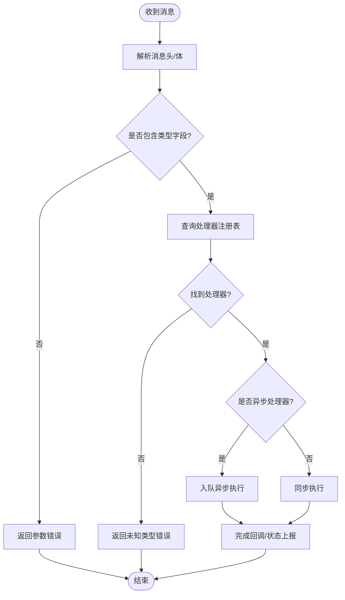
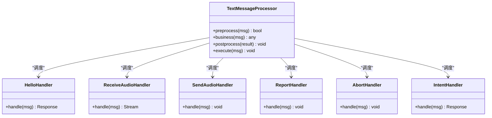
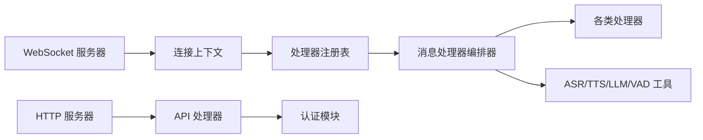

# 消息处理流程

<cite>
**本文引用的文件**   
- [app.py](file://main/xiaozhi-server/app.py)
- [websocket_server.py](file://main/xiaozhi-server/core/websocket_server.py)
- [connection.py](file://main/xiaozhi-server/core/connection.py)
- [textMessageHandlerRegistry.py](file://main/xiaozhi-server/core/handle/textMessageHandlerRegistry.py)
- [textMessageType.py](file://main/xiaozhi-server/core/handle/textMessageType.py)
- [textHandle.py](file://main/xiaozhi-server/core/handle/textHandle.py)
- [textMessageProcessor.py](file://main/xiaozhi-server/core/handle/textMessageProcessor.py)
- [helloHandle.py](file://main/xiaozhi-server/core/handle/helloHandle.py)
- [receiveAudioHandle.py](file://main/xiaozhi-server/core/handle/receiveAudioHandle.py)
- [sendAudioHandle.py](file://main/xiaozhi-server/core/handle/sendAudioHandle.py)
- [reportHandle.py](file://main/xiaozhi-server/core/handle/reportHandle.py)
- [abortHandle.py](file://main/xiaozhi-server/core/handle/abortHandle.py)
- [intentHandler.py](file://main/xiaozhi-server/core/handle/intentHandler.py)
- [http_server.py](file://main/xiaozhi-server/core/http_server.py)
- [base_handler.py](file://main/xiaozhi-server/core/api/base_handler.py)
- [vision_handler.py](file://main/xiaozhi-server/core/api/vision_handler.py)
- [ota_handler.py](file://main/xiaozhi-server/core/api/ota_handler.py)
- [auth.py](file://main/xiaozhi-server/core/auth.py)
- [dialogue.py](file://main/xiaozhi-server/core/utils/dialogue.py)
- [llm.py](file://main/xiaozhi-server/core/utils/llm.py)
- [tts.py](file://main/xiaozhi-server/core/utils/tts.py)
- [asr.py](file://main/xiaozhi-server/core/utils/asr.py)
- [vad.py](file://main/xiaozhi-server/core/utils/vad.py)
- [prompt_manager.py](file://main/xiaozhi-server/core/utils/prompt_manager.py)
- [modules_initialize.py](file://main/xiaozhi-server/core/utils/modules_initialize.py)
</cite>

## 目录
1. [简介](#简介)
2. [项目结构](#项目结构)
3. [核心组件](#核心组件)
4. [架构总览](#架构总览)
5. [详细组件分析](#详细组件分析)
6. [依赖关系分析](#依赖关系分析)
7. [性能考量](#性能考量)
8. [故障排查指南](#故障排查指南)
9. [结论](#结论)
10. [附录：API 参考与消息格式规范](#附录api-参考与消息格式规范)

## 简介
本技术文档围绕对话消息处理流程展开，重点阐述消息路由机制（类型识别、处理器选择、异步队列）、消息格式规范（请求结构、响应格式、错误码定义）、处理管道设计（预处理、业务处理、后处理）、验证与过滤机制（输入校验、安全过滤、格式转换），以及可靠性保障（错误处理策略、重试机制、日志记录）。读者可据此理解从设备接入到语音/文本消息的端到端处理链路。

## 项目结构
本项目采用分层与按功能模块组织相结合的结构：
- 服务入口与连接管理：WebSocket/HTTP 服务器、连接生命周期管理
- 消息路由与处理器注册：消息类型枚举、处理器注册表、处理器实现
- 业务处理管道：ASR/TTS/LLM/VAD 等能力提供者与工具模块
- API 层：面向外部系统的 HTTP API（OTA、视觉等）
- 配置与初始化：模块初始化、提示词管理、认证等

**图表来源** 
- [app.py](file://main/xiaozhi-server/app.py)
- [websocket_server.py](file://main/xiaozhi-server/core/websocket_server.py)
- [connection.py](file://main/xiaozhi-server/core/connection.py)
- [textMessageHandlerRegistry.py](file://main/xiaozhi-server/core/handle/textMessageHandlerRegistry.py)
- [textMessageType.py](file://main/xiaozhi-server/core/handle/textMessageType.py)
- [textHandle.py](file://main/xiaozhi-server/core/handle/textHandle.py)
- [textMessageProcessor.py](file://main/xiaozhi-server/core/handle/textMessageProcessor.py)
- [http_server.py](file://main/xiaozhi-server/core/http_server.py)
- [base_handler.py](file://main/xiaozhi-server/core/api/base_handler.py)
- [vision_handler.py](file://main/xiaozhi-server/core/api/vision_handler.py)
- [ota_handler.py](file://main/xiaozhi-server/core/api/ota_handler.py)

**章节来源**
- [app.py](file://main/xiaozhi-server/app.py)
- [websocket_server.py](file://main/xiaozhi-server/core/websocket_server.py)
- [connection.py](file://main/xiaozhi-server/core/connection.py)
- [textMessageHandlerRegistry.py](file://main/xiaozhi-server/core/handle/textMessageHandlerRegistry.py)
- [textMessageType.py](file://main/xiaozhi-server/core/handle/textMessageType.py)
- [textHandle.py](file://main/xiaozhi-server/core/handle/textHandle.py)
- [textMessageProcessor.py](file://main/xiaozhi-server/core/handle/textMessageProcessor.py)
- [http_server.py](file://main/xiaozhi-server/core/http_server.py)
- [base_handler.py](file://main/xiaozhi-server/core/api/base_handler.py)
- [vision_handler.py](file://main/xiaozhi-server/core/api/vision_handler.py)
- [ota_handler.py](file://main/xiaozhi-server/core/api/ota_handler.py)

## 核心组件
- WebSocket 服务器：负责建立连接、接收帧、分发至连接上下文与消息路由。
- 连接管理：维护会话状态、用户上下文、发送通道与资源清理。
- 消息处理器注册表：集中注册各类型消息处理器，提供按类型查找与调用。
- 消息类型枚举：统一定义消息类型标识，确保路由一致性。
- 文本处理入口：对文本消息进行统一解析、校验与分派。
- 消息处理器编排器：串联预处理、业务处理、后处理阶段，支持异步执行与错误回传。
- 能力提供者（ASR/TTS/LLM/VAD）：封装语音识别、文本转语音、大模型推理、语音活动检测等能力。
- HTTP API：对外暴露 OTA、视觉等接口，遵循统一的基类与错误约定。

**章节来源**
- [websocket_server.py](file://main/xiaozhi-server/core/websocket_server.py)
- [connection.py](file://main/xiaozhi-server/core/connection.py)
- [textMessageHandlerRegistry.py](file://main/xiaozhi-server/core/handle/textMessageHandlerRegistry.py)
- [textMessageType.py](file://main/xiaozhi-server/core/handle/textMessageType.py)
- [textHandle.py](file://main/xiaozhi-server/core/handle/textHandle.py)
- [textMessageProcessor.py](file://main/xiaozhi-server/core/handle/textMessageProcessor.py)
- [asr.py](file://main/xiaozhi-server/core/utils/asr.py)
- [tts.py](file://main/xiaozhi-server/core/utils/tts.py)
- [llm.py](file://main/xiaozhi-server/core/utils/llm.py)
- [vad.py](file://main/xiaozhi-server/core/utils/vad.py)
- [base_handler.py](file://main/xiaozhi-server/core/api/base_handler.py)

## 架构总览
下图展示了从设备接入到消息处理的端到端流程，包括握手、消息路由、异步处理与结果回写。

**图表来源** 
- [websocket_server.py](file://main/xiaozhi-server/core/websocket_server.py)
- [connection.py](file://main/xiaozhi-server/core/connection.py)
- [textMessageHandlerRegistry.py](file://main/xiaozhi-server/core/handle/textMessageHandlerRegistry.py)
- [textMessageProcessor.py](file://main/xiaozhi-server/core/handle/textMessageProcessor.py)
- [asr.py](file://main/xiaozhi-server/core/utils/asr.py)
- [llm.py](file://main/xiaozhi-server/core/utils/llm.py)
- [tts.py](file://main/xiaozhi-server/core/utils/tts.py)

## 详细组件分析

### 消息路由机制
- 类型识别：通过消息类型枚举统一定义，处理器注册表以类型为键映射处理器实例。
- 处理器选择：收到消息后，解析类型字段，查表获取对应处理器；未命中则走默认错误或降级路径。
- 异步处理：对耗时操作（如 ASR/LLM/TTS）使用异步任务或线程池，避免阻塞主循环。
- 错误回传：处理器内部捕获异常并转换为标准错误响应，经连接上下文写回设备。

**图表来源** 
- [textMessageType.py](file://main/xiaozhi-server/core/handle/textMessageType.py)
- [textMessageHandlerRegistry.py](file://main/xiaozhi-server/core/handle/textMessageHandlerRegistry.py)
- [textHandle.py](file://main/xiaozhi-server/core/handle/textHandle.py)
- [textMessageProcessor.py](file://main/xiaozhi-server/core/handle/textMessageProcessor.py)

**章节来源**
- [textMessageType.py](file://main/xiaozhi-server/core/handle/textMessageType.py)
- [textMessageHandlerRegistry.py](file://main/xiaozhi-server/core/handle/textMessageHandlerRegistry.py)
- [textHandle.py](file://main/xiaozhi-server/core/handle/textHandle.py)
- [textMessageProcessor.py](file://main/xiaozhi-server/core/handle/textMessageProcessor.py)

### 消息处理管道（预处理 → 业务处理 → 后处理）
- 预处理：参数校验、鉴权检查、上下文注入（用户信息、会话 ID、能力开关）。
- 业务处理：调用具体处理器逻辑（如 hello 握手、音频接收与识别、意图解析、报告上报、中断控制）。
- 后处理：结果格式化、状态上报、资源释放、日志记录、指标统计。

**图表来源** 
- [textMessageProcessor.py](file://main/xiaozhi-server/core/handle/textMessageProcessor.py)
- [helloHandle.py](file://main/xiaozhi-server/core/handle/helloHandle.py)
- [receiveAudioHandle.py](file://main/xiaozhi-server/core/handle/receiveAudioHandle.py)
- [sendAudioHandle.py](file://main/xiaozhi-server/core/handle/sendAudioHandle.py)
- [reportHandle.py](file://main/xiaozhi-server/core/handle/reportHandle.py)
- [abortHandle.py](file://main/xiaozhi-server/core/handle/abortHandle.py)
- [intentHandler.py](file://main/xiaozhi-server/core/handle/intentHandler.py)

**章节来源**
- [textMessageProcessor.py](file://main/xiaozhi-server/core/handle/textMessageProcessor.py)
- [helloHandle.py](file://main/xiaozhi-server/core/handle/helloHandle.py)
- [receiveAudioHandle.py](file://main/xiaozhi-server/core/handle/receiveAudioHandle.py)
- [sendAudioHandle.py](file://main/xiaozhi-server/core/handle/sendAudioHandle.py)
- [reportHandle.py](file://main/xiaozhi-server/core/handle/reportHandle.py)
- [abortHandle.py](file://main/xiaozhi-server/core/handle/abortHandle.py)
- [intentHandler.py](file://main/xiaozhi-server/core/handle/intentHandler.py)

### 消息格式规范
- 请求结构：每条消息应包含类型字段、时间戳、会话标识、负载数据；音频类消息需携带编码格式、采样率、分片序号等元数据。
- 响应格式：统一包含状态码、消息体、可选的错误详情；音频流响应为分片二进制或事件通知。
- 错误码定义：分为协议级错误（如参数缺失、类型未知）、业务级错误（如识别失败、模型不可用）、系统级错误（如超时、资源不足）。

说明：具体字段名与取值范围由各处理器实现与枚举定义约束，详见对应处理器与类型定义文件。

**章节来源**
- [textMessageType.py](file://main/xiaozhi-server/core/handle/textMessageType.py)
- [helloHandle.py](file://main/xiaozhi-server/core/handle/helloHandle.py)
- [receiveAudioHandle.py](file://main/xiaozhi-server/core/handle/receiveAudioHandle.py)
- [sendAudioHandle.py](file://main/xiaozhi-server/core/handle/sendAudioHandle.py)
- [reportHandle.py](file://main/xiaozhi-server/core/handle/reportHandle.py)
- [abortHandle.py](file://main/xiaozhi-server/core/handle/abortHandle.py)
- [intentHandler.py](file://main/xiaozhi-server/core/handle/intentHandler.py)

### 验证与过滤机制
- 输入校验：类型必填、字段类型与长度限制、数值范围校验、签名校验（如需）。
- 安全过滤：敏感词过滤、注入攻击防护、权限校验（基于连接上下文与会话令牌）。
- 格式转换：音频编码格式标准化、文本编码统一、时间戳与时区规范化。

**章节来源**
- [auth.py](file://main/xiaozhi-server/core/auth.py)
- [connection.py](file://main/xiaozhi-server/core/connection.py)
- [textHandle.py](file://main/xiaozhi-server/core/handle/textHandle.py)

### 异步处理队列
- 队列模型：基于内存队列或线程池，按优先级或工作线程数限制并发。
- 背压与限流：当队列积压时，触发丢弃策略或延迟处理，避免雪崩。
- 任务生命周期：入队→执行→回调→清理；异常统一捕获并上报。

**章节来源**
- [textMessageProcessor.py](file://main/xiaozhi-server/core/handle/textMessageProcessor.py)
- [websocket_server.py](file://main/xiaozhi-server/core/websocket_server.py)

### 可靠性保障
- 错误处理策略：区分可恢复与不可恢复错误，记录堆栈与上下文，必要时触发告警。
- 重试机制：对瞬时失败（网络抖动、第三方服务限流）实施指数退避重试，设置最大重试次数与超时。
- 日志记录：结构化日志（请求 ID、会话 ID、耗时、关键指标），分级输出便于追踪。

**章节来源**
- [textMessageProcessor.py](file://main/xiaozhi-server/core/handle/textMessageProcessor.py)
- [connection.py](file://main/xiaozhi-server/core/connection.py)
- [http_server.py](file://main/xiaozhi-server/core/http_server.py)

## 依赖关系分析
- 低耦合高内聚：处理器按职责拆分，注册表解耦类型与实现；工具模块（ASR/TTS/LLM/VAD）独立封装。
- 直接依赖：
  - WebSocket 服务器依赖连接管理与消息路由
  - 消息处理器编排器依赖各处理器与工具模块
  - HTTP API 依赖基类与认证模块
- 潜在循环依赖：应避免在处理器中反向依赖服务器层，保持单向调用链。

**图表来源** 
- [websocket_server.py](file://main/xiaozhi-server/core/websocket_server.py)
- [connection.py](file://main/xiaozhi-server/core/connection.py)
- [textMessageHandlerRegistry.py](file://main/xiaozhi-server/core/handle/textMessageHandlerRegistry.py)
- [textMessageProcessor.py](file://main/xiaozhi-server/core/handle/textMessageProcessor.py)
- [http_server.py](file://main/xiaozhi-server/core/http_server.py)
- [base_handler.py](file://main/xiaozhi-server/core/api/base_handler.py)
- [auth.py](file://main/xiaozhi-server/core/auth.py)

**章节来源**
- [websocket_server.py](file://main/xiaozhi-server/core/websocket_server.py)
- [connection.py](file://main/xiaozhi-server/core/connection.py)
- [textMessageHandlerRegistry.py](file://main/xiaozhi-server/core/handle/textMessageHandlerRegistry.py)
- [textMessageProcessor.py](file://main/xiaozhi-server/core/handle/textMessageProcessor.py)
- [http_server.py](file://main/xiaozhi-server/core/http_server.py)
- [base_handler.py](file://main/xiaozhi-server/core/api/base_handler.py)
- [auth.py](file://main/xiaozhi-server/core/auth.py)

## 性能考量
- 流式处理：音频分片边收边处理，减少缓冲与延迟。
- 并发控制：限制 ASR/LLM/TTS 并发度，避免资源争用。
- 缓存策略：对热点提示词、模型配置进行缓存，降低冷启动开销。
- 监控指标：记录处理耗时、队列长度、错误率，支撑容量规划。

[本节为通用指导，不直接分析具体文件]

## 故障排查指南
- 常见问题定位：
  - 握手失败：检查 hello 处理器与认证模块配置
  - 音频识别失败：查看 ASR 提供者状态与网络连通性
  - 语音合成失败：确认 TTS 服务可用性与音频格式匹配
  - 意图解析异常：核对意图处理器与上下文注入
- 日志与调试：
  - 开启结构化日志，关注请求 ID 与耗时分布
  - 使用性能测试工具评估 ASR/TTS/LLM 吞吐与延迟
- 恢复策略：
  - 自动重试与降级（如切换备用 TTS 提供商）
  - 熔断与隔离，防止级联故障

**章节来源**
- [helloHandle.py](file://main/xiaozhi-server/core/handle/helloHandle.py)
- [asr.py](file://main/xiaozhi-server/core/utils/asr.py)
- [tts.py](file://main/xiaozhi-server/core/utils/tts.py)
- [intentHandler.py](file://main/xiaozhi-server/core/handle/intentHandler.py)
- [modules_initialize.py](file://main/xiaozhi-server/core/utils/modules_initialize.py)

## 结论
本系统通过清晰的消息路由与处理器编排，实现了可扩展、高可靠的对话消息处理流水线。结合严格的验证与过滤、完善的错误处理与重试机制，能够在复杂环境下稳定运行。建议持续优化并发控制与缓存策略，完善监控与告警体系，进一步提升用户体验与运维效率。

[本节为总结性内容，不直接分析具体文件]

## 附录：API 参考与消息格式规范

### WebSocket 消息类型与处理器
- hello：握手与能力协商
- receiveAudio：音频分片上传与识别
- sendAudio：音频流下发与播放控制
- report：状态上报与遥测
- abort：中断当前处理流程
- intent：意图解析与动作执行

**章节来源**
- [textMessageType.py](file://main/xiaozhi-server/core/handle/textMessageType.py)
- [helloHandle.py](file://main/xiaozhi-server/core/handle/helloHandle.py)
- [receiveAudioHandle.py](file://main/xiaozhi-server/core/handle/receiveAudioHandle.py)
- [sendAudioHandle.py](file://main/xiaozhi-server/core/handle/sendAudioHandle.py)
- [reportHandle.py](file://main/xiaozhi-server/core/handle/reportHandle.py)
- [abortHandle.py](file://main/xiaozhi-server/core/handle/abortHandle.py)
- [intentHandler.py](file://main/xiaozhi-server/core/handle/intentHandler.py)

### HTTP API（示例）
- base_handler：统一基类，定义请求解析、鉴权、响应封装
- vision_handler：视觉相关接口（如图像识别、OCR）
- ota_handler：固件升级接口（版本检查、下载、校验）

**章节来源**
- [base_handler.py](file://main/xiaozhi-server/core/api/base_handler.py)
- [vision_handler.py](file://main/xiaozhi-server/core/api/vision_handler.py)
- [ota_handler.py](file://main/xiaozhi-server/core/api/ota_handler.py)

### 错误码与响应约定
- 协议级错误：参数缺失、类型未知、签名无效
- 业务级错误：识别失败、模型不可用、意图解析失败
- 系统级错误：超时、资源不足、服务不可用

**章节来源**
- [textMessageProcessor.py](file://main/xiaozhi-server/core/handle/textMessageProcessor.py)
- [base_handler.py](file://main/xiaozhi-server/core/api/base_handler.py)

### 处理管道最佳实践
- 预处理：严格校验与鉴权，尽早失败
- 业务处理：幂等设计，避免重复执行副作用
- 后处理：统一格式化与上报，确保资源释放

**章节来源**
- [textMessageProcessor.py](file://main/xiaozhi-server/core/handle/textMessageProcessor.py)
- [connection.py](file://main/xiaozhi-server/core/connection.py)