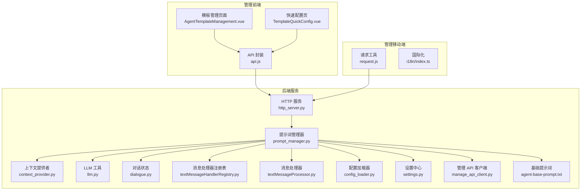
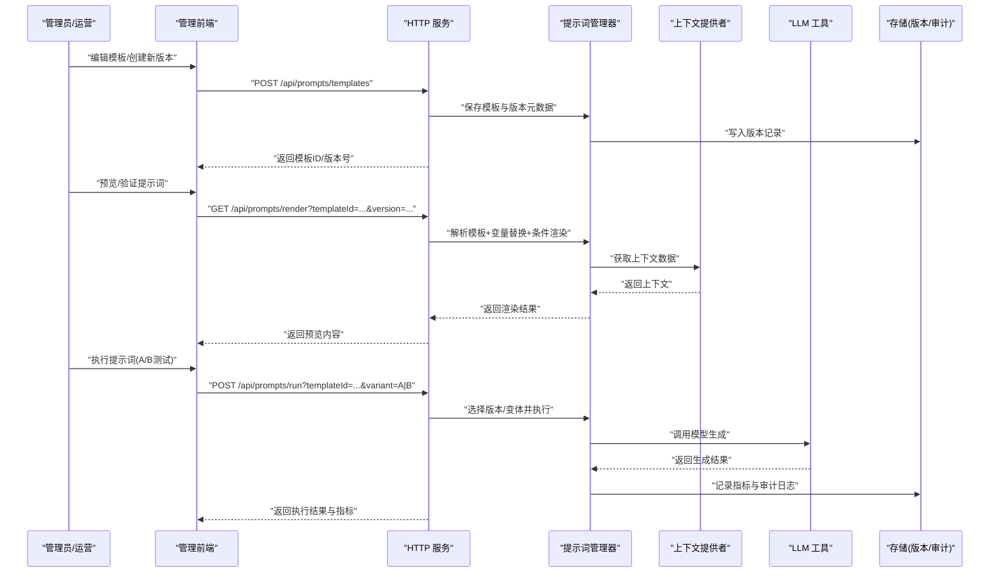
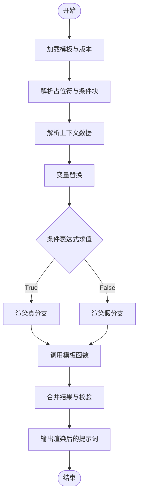
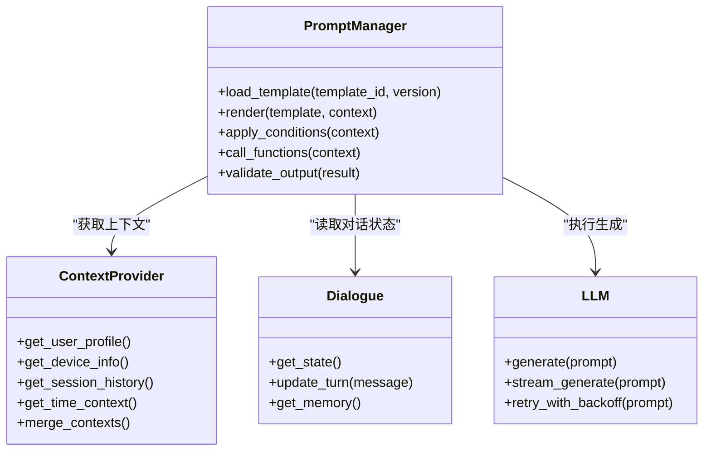
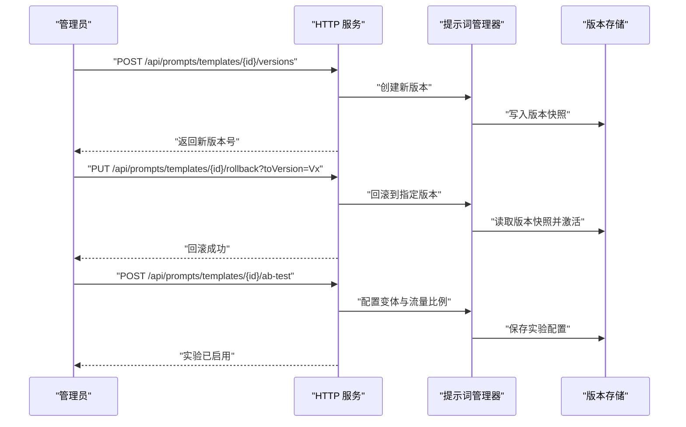
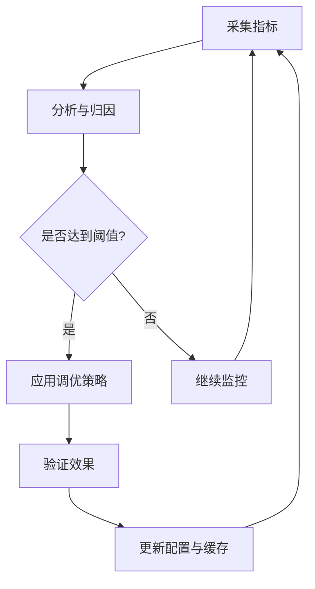
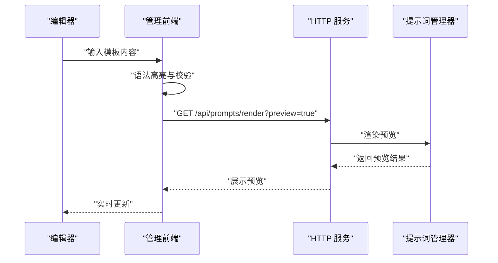
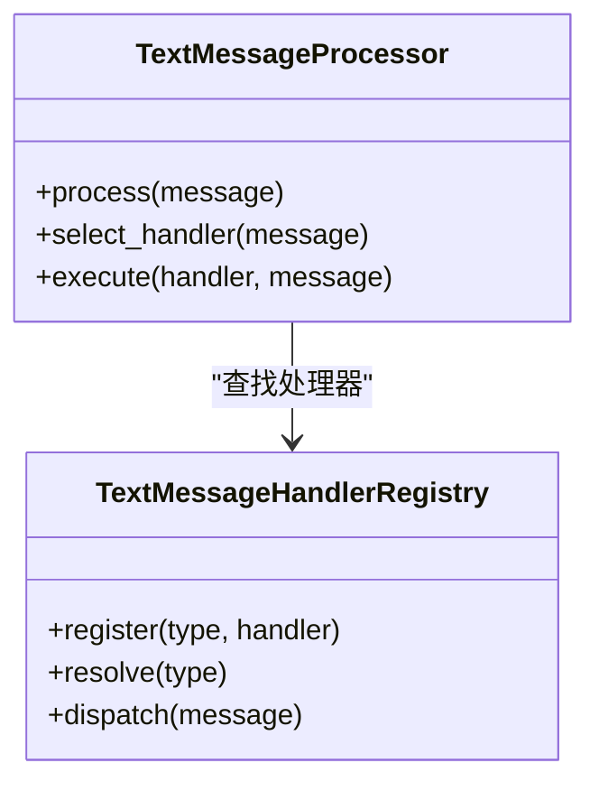
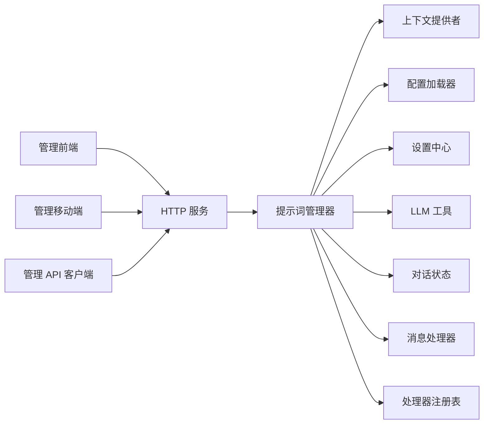

# 提示词管理

<cite>
**本文档引用的文件**   
- [prompt_manager.py](file://main/xiaozhi-server/core/utils/prompt_manager.py)
- [context_provider.py](file://main/xiaozhi-server/core/utils/context_provider.py)
- [llm.py](file://main/xiaozhi-server/core/utils/llm.py)
- [dialogue.py](file://main/xiaozhi-server/core/utils/dialogue.py)
- [textMessageHandlerRegistry.py](file://main/xiaozhi-server/core/handle/textMessageHandlerRegistry.py)
- [textMessageProcessor.py](file://main/xiaozhi-server/core/handle/textMessageProcessor.py)
- [agent-base-prompt.txt](file://main/xiaozhi-server/agent-base-prompt.txt)
- [config_loader.py](file://main/xiaozhi-server/config/config_loader.py)
- [settings.py](file://main/xiaozhi-server/config/settings.py)
- [http_server.py](file://main/xiaozhi-server/core/http_server.py)
- [manage_api_client.py](file://main/xiaozhi-server/config/manage_api_client.py)
- [AgentTemplateManagement.vue](file://main/manager-web/src/views/AgentTemplateManagement.vue)
- [TemplateQuickConfig.vue](file://main/manager-web/src/views/TemplateQuickConfig.vue)
- [api.js](file://main/manager-web/src/apis/api.js)
- [request.js](file://main/manager-mobile/src/utils/request.js)
- [index.ts](file://main/manager-mobile/src/i18n/index.ts)
</cite>

## 目录
1. [简介](#简介)
2. [项目结构](#项目结构)
3. [核心组件](#核心组件)
4. [架构总览](#架构总览)
5. [详细组件分析](#详细组件分析)
6. [依赖关系分析](#依赖关系分析)
7. [性能考量](#性能考量)
8. [故障排查指南](#故障排查指南)
9. [结论](#结论)
10. [附录：API 接口文档](#附录api-接口文档)

## 简介
本技术文档面向“提示词管理系统”，围绕提示词模板引擎、动态提示词生成、版本管理与优化策略、编辑器能力、以及企业级特性（国际化、权限控制、审计日志）进行系统化说明。系统基于 Python 后端与 Web/移动端管理端，提供模板管理、上下文注入、条件渲染、函数调用、版本回滚、A/B 测试、效果评估与自动调优等能力，并通过 HTTP API 暴露管理能力。

## 项目结构
- 后端服务（Python）
  - 提示词管理与上下文注入：core/utils/prompt_manager.py、core/utils/context_provider.py
  - LLM 调用与对话状态：core/utils/llm.py、core/utils/dialogue.py
  - 文本消息处理管线：core/handle/textMessageHandlerRegistry.py、core/handle/textMessageProcessor.py
  - 配置加载与设置：config/config_loader.py、config/settings.py
  - HTTP 服务与外部管理 API 客户端：core/http_server.py、config/manage_api_client.py
  - 基础提示词模板文件：agent-base-prompt.txt
- 管理前端（Web）
  - 提示词模板管理页面：src/views/AgentTemplateManagement.vue
  - 快速模板配置页：src/views/TemplateQuickConfig.vue
  - API 请求封装：src/apis/api.js
- 管理移动端（UniApp）
  - 请求工具：src/utils/request.js
  - 国际化配置：src/i18n/index.ts

**图表来源** 
- [prompt_manager.py](file://main/xiaozhi-server/core/utils/prompt_manager.py)
- [context_provider.py](file://main/xiaozhi-server/core/utils/context_provider.py)
- [llm.py](file://main/xiaozhi-server/core/utils/llm.py)
- [dialogue.py](file://main/xiaozhi-server/core/utils/dialogue.py)
- [textMessageHandlerRegistry.py](file://main/xiaozhi-server/core/handle/textMessageHandlerRegistry.py)
- [textMessageProcessor.py](file://main/xiaozhi-server/core/handle/textMessageProcessor.py)
- [config_loader.py](file://main/xiaozhi-server/config/config_loader.py)
- [settings.py](file://main/xiaozhi-server/config/settings.py)
- [http_server.py](file://main/xiaozhi-server/core/http_server.py)
- [manage_api_client.py](file://main/xiaozhi-server/config/manage_api_client.py)
- [agent-base-prompt.txt](file://main/xiaozhi-server/agent-base-prompt.txt)
- [AgentTemplateManagement.vue](file://main/manager-web/src/views/AgentTemplateManagement.vue)
- [TemplateQuickConfig.vue](file://main/manager-web/src/views/TemplateQuickConfig.vue)
- [api.js](file://main/manager-web/src/apis/api.js)
- [request.js](file://main/manager-mobile/src/utils/request.js)
- [index.ts](file://main/manager-mobile/src/i18n/index.ts)

**章节来源**
- [prompt_manager.py](file://main/xiaozhi-server/core/utils/prompt_manager.py)
- [context_provider.py](file://main/xiaozhi-server/core/utils/context_provider.py)
- [llm.py](file://main/xiaozhi-server/core/utils/llm.py)
- [dialogue.py](file://main/xiaozhi-server/core/utils/dialogue.py)
- [textMessageHandlerRegistry.py](file://main/xiaozhi-server/core/handle/textMessageHandlerRegistry.py)
- [textMessageProcessor.py](file://main/xiaozhi-server/core/handle/textMessageProcessor.py)
- [config_loader.py](file://main/xiaozhi-server/config/config_loader.py)
- [settings.py](file://main/xiaozhi-server/config/settings.py)
- [http_server.py](file://main/xiaozhi-server/core/http_server.py)
- [manage_api_client.py](file://main/xiaozhi-server/config/manage_api_client.py)
- [agent-base-prompt.txt](file://main/xiaozhi-server/agent-base-prompt.txt)
- [AgentTemplateManagement.vue](file://main/manager-web/src/views/AgentTemplateManagement.vue)
- [TemplateQuickConfig.vue](file://main/manager-web/src/views/TemplateQuickConfig.vue)
- [api.js](file://main/manager-web/src/apis/api.js)
- [request.js](file://main/manager-mobile/src/utils/request.js)
- [index.ts](file://main/manager-mobile/src/i18n/index.ts)

## 核心组件
- 提示词管理器（PromptManager）
  - 负责模板解析、变量替换、条件渲染、函数调用、版本选择与缓存。
  - 支持从基础模板与业务模板组合生成最终提示词。
- 上下文提供者（ContextProvider）
  - 聚合用户偏好、设备信息、会话历史、时间戳等上下文数据，供模板渲染使用。
- LLM 工具（LLM）
  - 封装模型调用、流式响应、重试与超时控制，为提示词执行提供推理能力。
- 对话状态（Dialogue）
  - 维护多轮对话上下文、记忆与状态机，驱动提示词的动态生成。
- 消息处理管线（TextMessageHandlerRegistry / TextMessageProcessor）
  - 注册并调度不同文本消息类型的处理器，将提示词结果转化为动作或回复。
- 配置与设置（ConfigLoader / Settings）
  - 加载运行时配置、功能开关、模型参数、模板路径等。
- HTTP 服务与管理 API 客户端（HTTP Server / ManageApiClient）
  - 对外暴露模板管理、版本操作、验证与执行的 API；对内访问远端管理服务。
- 基础提示词模板（agent-base-prompt.txt）
  - 定义通用角色、约束、输出格式与全局变量占位符。

**章节来源**
- [prompt_manager.py](file://main/xiaozhi-server/core/utils/prompt_manager.py)
- [context_provider.py](file://main/xiaozhi-server/core/utils/context_provider.py)
- [llm.py](file://main/xiaozhi-server/core/utils/llm.py)
- [dialogue.py](file://main/xiaozhi-server/core/utils/dialogue.py)
- [textMessageHandlerRegistry.py](file://main/xiaozhi-server/core/handle/textMessageHandlerRegistry.py)
- [textMessageProcessor.py](file://main/xiaozhi-server/core/handle/textMessageProcessor.py)
- [config_loader.py](file://main/xiaozhi-server/config/config_loader.py)
- [settings.py](file://main/xiaozhi-server/config/settings.py)
- [http_server.py](file://main/xiaozhi-server/core/http_server.py)
- [manage_api_client.py](file://main/xiaozhi-server/config/manage_api_client.py)
- [agent-base-prompt.txt](file://main/xiaozhi-server/agent-base-prompt.txt)

## 架构总览
提示词管理系统采用“模板引擎 + 上下文注入 + 执行管线”的分层架构。模板引擎负责解析与渲染，上下文提供者提供动态数据，执行管线负责调用 LLM 并处理结果。管理端通过 HTTP API 对模板进行增删改查、版本管理与 A/B 测试。

**图表来源** 
- [http_server.py](file://main/xiaozhi-server/core/http_server.py)
- [prompt_manager.py](file://main/xiaozhi-server/core/utils/prompt_manager.py)
- [context_provider.py](file://main/xiaozhi-server/core/utils/context_provider.py)
- [llm.py](file://main/xiaozhi-server/core/utils/llm.py)

## 详细组件分析

### 提示词模板引擎（变量替换、条件渲染、函数调用）
- 变量替换
  - 支持在模板中使用占位符（如 {{var}}），由上下文提供者填充。
  - 支持嵌套对象与数组的展开，默认值与缺失键的安全处理。
- 条件渲染
  - 模板中可使用条件表达式（如 if/else）控制片段显示。
  - 条件基于上下文布尔值、枚举或范围判断。
- 函数调用
  - 模板可调用内置函数（如格式化日期、计算长度、拼接字符串）。
  - 支持扩展自定义函数，通过注册表注入。

**图表来源** 
- [prompt_manager.py](file://main/xiaozhi-server/core/utils/prompt_manager.py)
- [context_provider.py](file://main/xiaozhi-server/core/utils/context_provider.py)

**章节来源**
- [prompt_manager.py](file://main/xiaozhi-server/core/utils/prompt_manager.py)
- [context_provider.py](file://main/xiaozhi-server/core/utils/context_provider.py)

### 动态提示词生成（上下文注入、用户偏好适配、场景化定制）
- 上下文注入
  - 从会话状态、设备信息、时间、用户画像等多源聚合数据。
  - 支持按需过滤与优先级覆盖。
- 用户偏好适配
  - 根据用户语言、风格、专业度、交互模式调整提示词结构与语气。
- 场景化定制
  - 按业务场景（如客服、教育、娱乐）切换模板变体与约束规则。

**图表来源** 
- [context_provider.py](file://main/xiaozhi-server/core/utils/context_provider.py)
- [prompt_manager.py](file://main/xiaozhi-server/core/utils/prompt_manager.py)
- [dialogue.py](file://main/xiaozhi-server/core/utils/dialogue.py)
- [llm.py](file://main/xiaozhi-server/core/utils/llm.py)

**章节来源**
- [context_provider.py](file://main/xiaozhi-server/core/utils/context_provider.py)
- [prompt_manager.py](file://main/xiaozhi-server/core/utils/prompt_manager.py)
- [dialogue.py](file://main/xiaozhi-server/core/utils/dialogue.py)
- [llm.py](file://main/xiaozhi-server/core/utils/llm.py)

### 提示词版本管理（版本控制、回滚机制、A/B 测试）
- 版本控制
  - 每次保存模板生成新版本号，保留变更历史与元数据（作者、时间、描述）。
- 回滚机制
  - 支持将模板恢复到指定版本，并触发重新渲染与缓存更新。
- A/B 测试
  - 同一模板可定义多个变体，按流量比例分发，收集指标对比效果。

**图表来源** 
- [http_server.py](file://main/xiaozhi-server/core/http_server.py)
- [prompt_manager.py](file://main/xiaozhi-server/core/utils/prompt_manager.py)

**章节来源**
- [http_server.py](file://main/xiaozhi-server/core/http_server.py)
- [prompt_manager.py](file://main/xiaozhi-server/core/utils/prompt_manager.py)

### 提示词优化策略（性能监控、效果评估、自动调优）
- 性能监控
  - 记录渲染耗时、LLM 调用延迟、失败率与资源占用。
- 效果评估
  - 基于业务指标（满意度、转化率、任务完成率）评估不同版本/变体的效果。
- 自动调优
  - 结合指标反馈自动调整参数（如温度、最大长度、上下文窗口大小）。

**图表来源** 
- [prompt_manager.py](file://main/xiaozhi-server/core/utils/prompt_manager.py)
- [llm.py](file://main/xiaozhi-server/core/utils/llm.py)

**章节来源**
- [prompt_manager.py](file://main/xiaozhi-server/core/utils/prompt_manager.py)
- [llm.py](file://main/xiaozhi-server/core/utils/llm.py)

### 提示词编辑器（语法高亮、实时预览、协作编辑）
- 语法高亮
  - 前端模板编辑器支持占位符与条件块的高亮显示。
- 实时预览
  - 输入时即时渲染预览，支持错误定位与修复建议。
- 协作编辑
  - 多用户并发编辑，冲突检测与合并策略。

**图表来源** 
- [AgentTemplateManagement.vue](file://main/manager-web/src/views/AgentTemplateManagement.vue)
- [TemplateQuickConfig.vue](file://main/manager-web/src/views/TemplateQuickConfig.vue)
- [api.js](file://main/manager-web/src/apis/api.js)
- [http_server.py](file://main/xiaozhi-server/core/http_server.py)
- [prompt_manager.py](file://main/xiaozhi-server/core/utils/prompt_manager.py)

**章节来源**
- [AgentTemplateManagement.vue](file://main/manager-web/src/views/AgentTemplateManagement.vue)
- [TemplateQuickConfig.vue](file://main/manager-web/src/views/TemplateQuickConfig.vue)
- [api.js](file://main/manager-web/src/apis/api.js)
- [http_server.py](file://main/xiaozhi-server/core/http_server.py)
- [prompt_manager.py](file://main/xiaozhi-server/core/utils/prompt_manager.py)

### 消息处理管线（提示词执行与结果处理）
- 处理器注册表
  - 按消息类型注册处理器，支持插件化扩展。
- 处理器执行
  - 根据上下文与提示词结果选择合适处理器，执行业务逻辑。

**图表来源** 
- [textMessageHandlerRegistry.py](file://main/xiaozhi-server/core/handle/textMessageHandlerRegistry.py)
- [textMessageProcessor.py](file://main/xiaozhi-server/core/handle/textMessageProcessor.py)

**章节来源**
- [textMessageHandlerRegistry.py](file://main/xiaozhi-server/core/handle/textMessageHandlerRegistry.py)
- [textMessageProcessor.py](file://main/xiaozhi-server/core/handle/textMessageProcessor.py)

## 依赖关系分析
- 模块内聚与耦合
  - 提示词管理器高度内聚于模板解析与渲染，依赖上下文提供者与配置中心。
  - 消息处理管线与 LLM 工具解耦，便于替换与扩展。
- 外部依赖
  - HTTP 服务暴露 RESTful API，管理端通过 api.js 与 request.js 调用。
  - 管理 API 客户端用于与远端管理服务通信（如模板同步、指标上报）。

**图表来源** 
- [prompt_manager.py](file://main/xiaozhi-server/core/utils/prompt_manager.py)
- [context_provider.py](file://main/xiaozhi-server/core/utils/context_provider.py)
- [config_loader.py](file://main/xiaozhi-server/config/config_loader.py)
- [settings.py](file://main/xiaozhi-server/config/settings.py)
- [llm.py](file://main/xiaozhi-server/core/utils/llm.py)
- [dialogue.py](file://main/xiaozhi-server/core/utils/dialogue.py)
- [textMessageProcessor.py](file://main/xiaozhi-server/core/handle/textMessageProcessor.py)
- [textMessageHandlerRegistry.py](file://main/xiaozhi-server/core/handle/textMessageHandlerRegistry.py)
- [http_server.py](file://main/xiaozhi-server/core/http_server.py)
- [manage_api_client.py](file://main/xiaozhi-server/config/manage_api_client.py)
- [api.js](file://main/manager-web/src/apis/api.js)
- [request.js](file://main/manager-mobile/src/utils/request.js)

**章节来源**
- [prompt_manager.py](file://main/xiaozhi-server/core/utils/prompt_manager.py)
- [context_provider.py](file://main/xiaozhi-server/core/utils/context_provider.py)
- [config_loader.py](file://main/xiaozhi-server/config/config_loader.py)
- [settings.py](file://main/xiaozhi-server/config/settings.py)
- [llm.py](file://main/xiaozhi-server/core/utils/llm.py)
- [dialogue.py](file://main/xiaozhi-server/core/utils/dialogue.py)
- [textMessageProcessor.py](file://main/xiaozhi-server/core/handle/textMessageProcessor.py)
- [textMessageHandlerRegistry.py](file://main/xiaozhi-server/core/handle/textMessageHandlerRegistry.py)
- [http_server.py](file://main/xiaozhi-server/core/http_server.py)
- [manage_api_client.py](file://main/xiaozhi-server/config/manage_api_client.py)
- [api.js](file://main/manager-web/src/apis/api.js)
- [request.js](file://main/manager-mobile/src/utils/request.js)

## 性能考量
- 渲染缓存
  - 对模板渲染结果进行缓存，减少重复计算。
- 异步与流式
  - LLM 调用支持流式响应，提升用户体验与吞吐。
- 资源限制
  - 设置上下文窗口大小、最大生成长度与超时时间，避免资源耗尽。
- 监控与告警
  - 关键指标（延迟、错误率、内存）监控与告警，及时发现问题。

[本节为通用指导，不直接分析具体文件]

## 故障排查指南
- 常见问题
  - 模板解析失败：检查占位符语法与变量名一致性。
  - 上下文缺失：确认上下文提供者是否正确聚合数据。
  - LLM 调用失败：检查网络、密钥、模型参数与限流策略。
- 调试步骤
  - 启用详细日志，查看渲染与调用链路。
  - 使用预览接口验证模板与上下文。
  - 通过版本回滚恢复稳定状态。

**章节来源**
- [prompt_manager.py](file://main/xiaozhi-server/core/utils/prompt_manager.py)
- [context_provider.py](file://main/xiaozhi-server/core/utils/context_provider.py)
- [llm.py](file://main/xiaozhi-server/core/utils/llm.py)

## 结论
提示词管理系统以模板引擎为核心，结合上下文注入与执行管线，实现了灵活的动态提示词生成与版本化管理。通过管理端与 API 的协同，支持 A/B 测试、效果评估与自动调优，满足企业级需求。未来可进一步扩展函数库、增强协作编辑与审计能力。

[本节为总结性内容，不直接分析具体文件]

## 附录：API 接口文档
- 模板管理
  - POST /api/prompts/templates
    - 作用：创建或更新模板
    - 请求体：{ id, name, content, version, metadata }
    - 响应：{ templateId, version }
  - GET /api/prompts/templates/{id}
    - 作用：获取模板详情
    - 响应：{ id, name, versions[] }
  - PUT /api/prompts/templates/{id}/versions
    - 作用：创建新版本
    - 请求体：{ version, content, metadata }
    - 响应：{ version }
  - PUT /api/prompts/templates/{id}/rollback
    - 作用：回滚到指定版本
    - 查询参数：toVersion
    - 响应：{ status }
- 渲染与验证
  - GET /api/prompts/render
    - 作用：渲染提示词（预览）
    - 查询参数：templateId, version, context
    - 响应：{ rendered_prompt }
  - POST /api/prompts/validate
    - 作用：验证模板语法与上下文
    - 请求体：{ templateId, version, context }
    - 响应：{ valid, errors[] }
- 执行与 A/B 测试
  - POST /api/prompts/run
    - 作用：执行提示词（可选变体）
    - 查询参数：templateId, variant
    - 请求体：{ context }
    - 响应：{ result, metrics }
  - POST /api/prompts/templates/{id}/ab-test
    - 作用：配置 A/B 测试
    - 请求体：{ variants[], weights[] }
    - 响应：{ experimentId }

[本节为接口概览，不直接分析具体文件]