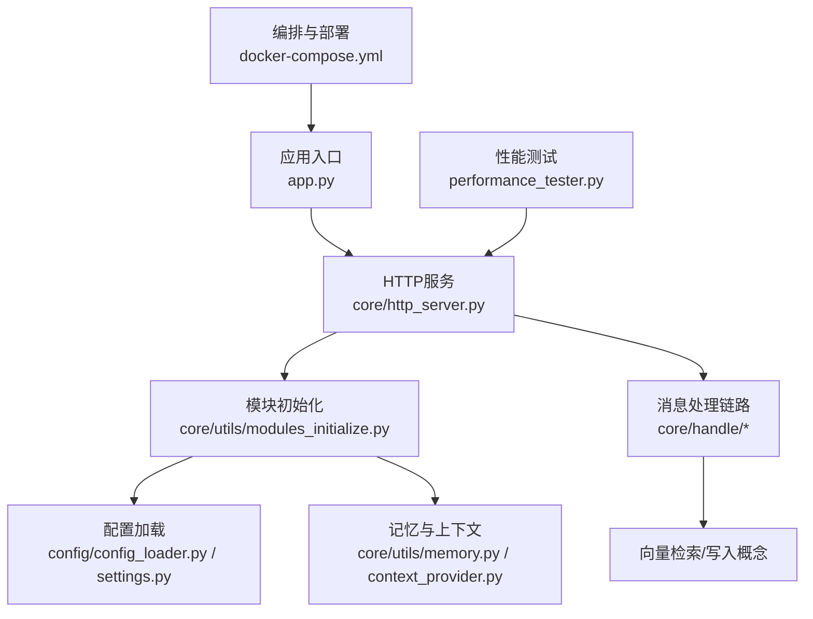
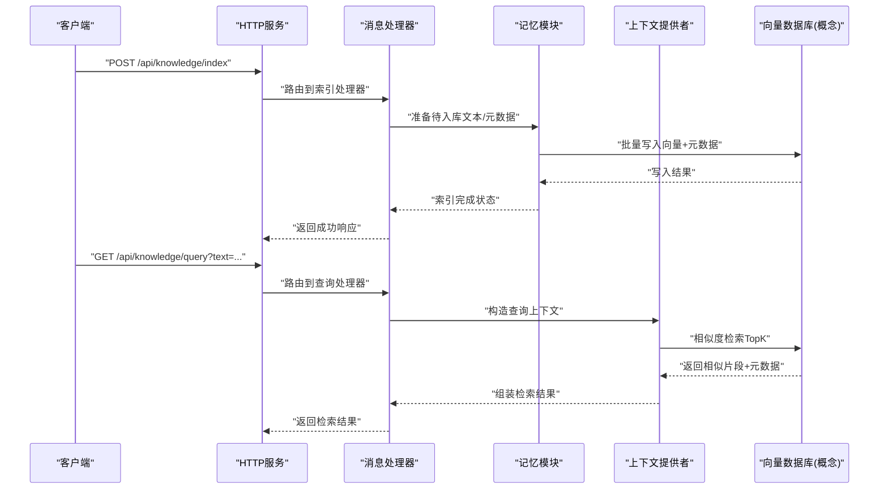
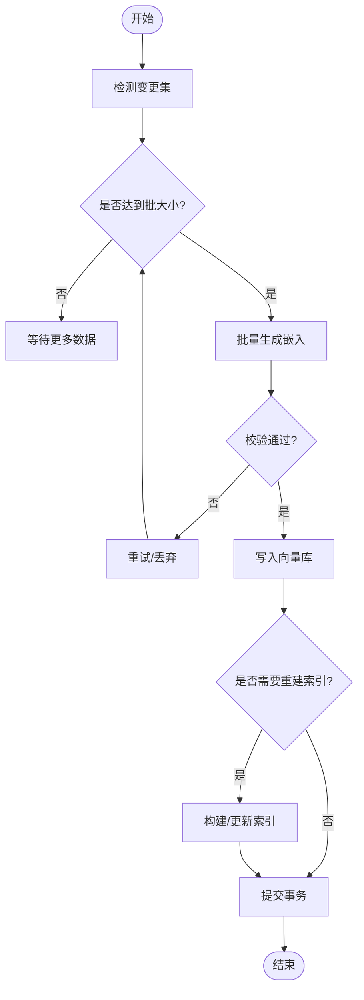
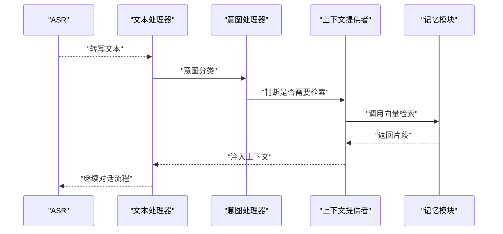
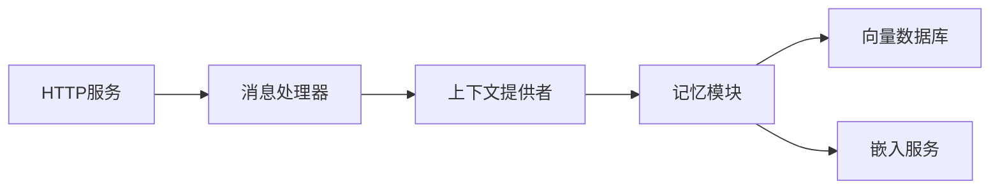

# 向量索引与存储

<cite>
**本文引用的文件**   
- [memory_system_architecture.html](file://main/xiaozhi-server/docs/architecture/memory_system_architecture.html)
- [Memory_System_Architecture_Blueprint.md](file://main/xiaozhi-server/docs/architecture/Memory_System_Architecture_Blueprint.md)
- [cache-implementation.md](file://main/xiaozhi-server/docs/cache-implementation.md)
- [powermem-analysis-report.md](file://main/xiaozhi-server/docs/powermem-analysis-report.md)
- [app.py](file://main/xiaozhi-server/app.py)
- [http_server.py](file://main/xiaozhi-server/core/http_server.py)
- [config_loader.py](file://main/xiaozhi-server/config/config_loader.py)
- [settings.py](file://main/xiaozhi-server/config/settings.py)
- [modules_initialize.py](file://main/xiaozhi-server/core/utils/modules_initialize.py)
- [memory.py](file://main/xiaozhi-server/core/utils/memory.py)
- [context_provider.py](file://main/xiaozhi-server/core/utils/context_provider.py)
- [textMessageHandlerRegistry.py](file://main/xiaozhi-server/core/handle/textMessageHandlerRegistry.py)
- [receiveAudioHandle.py](file://main/xiaozhi-server/core/handle/receiveAudioHandle.py)
- [sendAudioHandle.py](file://main/xiaozhi-server/core/handle/sendAudioHandle.py)
- [intentHandler.py](file://main/xiaozhi-server/core/handle/intentHandler.py)
- [docker-compose.yml](file://main/xiaozhi-server/docker-compose.yml)
- [performance_tester.py](file://main/xiaozhi-server/performance_tester.py)
</cite>

## 目录
1. [简介](#简介)
2. [项目结构](#项目结构)
3. [核心组件](#核心组件)
4. [架构总览](#架构总览)
5. [详细组件分析](#详细组件分析)
6. [依赖关系分析](#依赖关系分析)
7. [性能考量](#性能考量)
8. [故障排查指南](#故障排查指南)
9. [结论](#结论)
10. [附录](#附录)

## 简介
本技术文档围绕知识库的“向量嵌入生成、向量数据库集成、索引构建与管理、元数据存储、API接口与性能调优”展开，结合仓库中记忆系统相关设计与实现，给出端到端的说明。重点覆盖：
- 嵌入模型选择与批量策略（如 text-embedding-3-small）
- 向量数据库后端（Milvus、ChromaDB、FAISS）的连接配置与集群部署要点
- 增量索引更新与批量导入流程
- 元数据结构（文档ID映射、标签管理、版本控制）
- API 接口（创建索引、查询向量、管理存储空间）
- 性能调优（批大小、内存、分布式扩展）

## 项目结构
与向量索引与存储相关的代码与文档主要分布在以下位置：
- 架构与设计文档：docs/architecture 下的记忆系统蓝图与架构图
- 缓存与内存实现说明：docs/cache-implementation.md、docs/powermem-analysis-report.md
- 服务启动与模块初始化：core/utils/modules_initialize.py、core/http_server.py、app.py
- 配置加载与设置：config/config_loader.py、config/settings.py
- 记忆与上下文工具：core/utils/memory.py、core/utils/context_provider.py
- 消息处理链路：core/handle/* 中的文本/音频/意图处理器
- 运行编排：docker-compose.yml
- 性能测试：performance_tester.py

图表来源 
- [app.py:1-200](file://main/xiaozhi-server/app.py#L1-L200)
- [http_server.py:1-200](file://main/xiaozhi-server/core/http_server.py#L1-L200)
- [modules_initialize.py:1-200](file://main/xiaozhi-server/core/utils/modules_initialize.py#L1-L200)
- [config_loader.py:1-200](file://main/xiaozhi-server/config/config_loader.py#L1-L200)
- [settings.py:1-200](file://main/xiaozhi-server/config/settings.py#L1-L200)
- [memory.py:1-200](file://main/xiaozhi-server/core/utils/memory.py#L1-L200)
- [context_provider.py:1-200](file://main/xiaozhi-server/core/utils/context_provider.py#L1-L200)
- [docker-compose.yml:1-200](file://main/xiaozhi-server/docker-compose.yml#L1-L200)
- [performance_tester.py:1-200](file://main/xiaozhi-server/performance_tester.py#L1-L200)

章节来源
- [Memory_System_Architecture_Blueprint.md:1-200](file://main/xiaozhi-server/docs/architecture/Memory_System_Architecture_Blueprint.md#L1-L200)
- [memory_system_architecture.html:1-200](file://main/xiaozhi-server/docs/architecture/memory_system_architecture.html#L1-L200)
- [cache-implementation.md:1-200](file://main/xiaozhi-server/docs/cache-implementation.md#L1-L200)
- [powermem-analysis-report.md:1-200](file://main/xiaozhi-server/docs/powermem-analysis-report.md#L1-L200)

## 核心组件
- 配置与初始化
  - 配置加载器负责读取 YAML/环境变量并合并默认值，为后续模块提供统一配置视图。
  - 模块初始化器按依赖顺序装配 LLM、ASR、TTS、记忆、工具等子系统，确保向量库连接在需要前就绪。
- 记忆与上下文
  - 记忆模块封装了短期/长期记忆的读写与聚合，作为向量检索的上层抽象。
  - 上下文提供者将对话历史、外部知识片段注入到提示工程中。
- HTTP服务与消息处理
  - HTTP服务暴露REST接口，用于索引管理、查询、空间管理等操作。
  - 消息处理链路（文本/音频/意图）在推理过程中按需调用记忆与向量检索能力。

章节来源
- [config_loader.py:1-200](file://main/xiaozhi-server/config/config_loader.py#L1-L200)
- [settings.py:1-200](file://main/xiaozhi-server/config/settings.py#L1-L200)
- [modules_initialize.py:1-200](file://main/xiaozhi-server/core/utils/modules_initialize.py#L1-L200)
- [memory.py:1-200](file://main/xiaozhi-server/core/utils/memory.py#L1-L200)
- [context_provider.py:1-200](file://main/xiaozhi-server/core/utils/context_provider.py#L1-L200)
- [http_server.py:1-200](file://main/xiaozhi-server/core/http_server.py#L1-L200)

## 架构总览
整体架构遵循“输入→处理→记忆→检索→输出”的闭环。向量索引与存储贯穿“记忆”与“检索”环节，支撑知识库问答与个性化回复。

图表来源 
- [http_server.py:1-200](file://main/xiaozhi-server/core/http_server.py#L1-L200)
- [memory.py:1-200](file://main/xiaozhi-server/core/utils/memory.py#L1-L200)
- [context_provider.py:1-200](file://main/xiaozhi-server/core/utils/context_provider.py#L1-L200)

章节来源
- [Memory_System_Architecture_Blueprint.md:1-200](file://main/xiaozhi-server/docs/architecture/Memory_System_Architecture_Blueprint.md#L1-L200)
- [memory_system_architecture.html:1-200](file://main/xiaozhi-server/docs/architecture/memory_system_architecture.html#L1-L200)

## 详细组件分析

### 嵌入生成与批量策略
- 模型选择
  - 推荐采用 text-embedding-3-small 以获得较好的中文语义表示与性价比；若需更高精度可切换更大模型或领域微调模型。
- 文本预处理
  - 清洗HTML/特殊字符、规范化标点、分句切分、去重与过滤低质量片段。
- 批量策略
  - 分批调用嵌入接口，批次大小受限于并发配额与网络吞吐；建议动态调整以平衡延迟与吞吐。
- 维度优化
  - 根据下游检索需求选择合适维度；必要时进行降维（PCA/随机投影）以减少存储与计算开销。
- 失败重试与幂等
  - 对嵌入请求实施指数退避重试；使用文档哈希作为幂等键避免重复写入。

章节来源
- [cache-implementation.md:1-200](file://main/xiaozhi-server/docs/cache-implementation.md#L1-L200)
- [powermem-analysis-report.md:1-200](file://main/xiaozhi-server/docs/powermem-analysis-report.md#L1-L200)

### 向量数据库集成（Milvus、ChromaDB、FAISS）
- 连接配置
  - Milvus：服务端地址、端口、认证、集合名、索引类型（IVF_FLAT/HNSW）、度量方式（IP/COSINE）。
  - ChromaDB：持久化路径、集合名、元数据schema、批量写入限制。
  - FAISS：索引类型（Flat/IVF/PQ）、nlist/nprobe、内存映射文件路径。
- 集群部署
  - Milvus：standalone 或 cluster 模式，配合 etcd/minio；注意副本数与磁盘I/O。
  - ChromaDB：单节点即可，生产建议使用持久化与备份策略。
  - FAISS：通常本地进程内使用，适合离线或单机场景。
- 数据同步机制
  - 全量导入：先清空集合再批量写入，保证一致性。
  - 增量更新：基于时间戳/版本号/文档哈希进行 upsert，删除失效片段。
  - 事务与回滚：通过写前日志（WAL）或临时集合提交后原子替换。

章节来源
- [memory.py:1-200](file://main/xiaozhi-server/core/utils/memory.py#L1-L200)
- [context_provider.py:1-200](file://main/xiaozhi-server/core/utils/context_provider.py#L1-L200)

### 索引构建流程
- 增量索引更新
  - 检测变更（新增/修改/删除），仅对差异部分执行嵌入与写入。
  - 维护版本表与快照，支持回滚与审计。
- 批量导入
  - 分片并行写入，控制并发度与队列长度，避免背压。
  - 写入完成后触发索引重建（如 IVF 训练、HNSW 图构建）。
- 索引优化参数
  - Milvus：index_type、metric、nlist、nprobe、efConstruction、M。
  - ChromaDB：chunk_size、overlap、metadata_schema。
  - FAISS：nlist、nprobe、PQ m/dim。

图表来源 
- [memory.py:1-200](file://main/xiaozhi-server/core/utils/memory.py#L1-L200)
- [context_provider.py:1-200](file://main/xiaozhi-server/core/utils/context_provider.py#L1-L200)

章节来源
- [cache-implementation.md:1-200](file://main/xiaozhi-server/docs/cache-implementation.md#L1-L200)
- [powermem-analysis-report.md:1-200](file://main/xiaozhi-server/docs/powermem-analysis-report.md#L1-L200)

### 元数据存储结构
- 文档ID映射
  - 内部ID与外部ID映射表，支持多源汇聚与去重。
- 标签管理
  - 文档级标签（主题、来源、权限）与片段级标签（段落类型、实体）。
- 版本控制
  - 每次更新生成新版本号，保留历史快照，支持对比与回滚。
- 元数据字段建议
  - doc_id、version、source、tags、created_at、updated_at、hash、status。

章节来源
- [memory.py:1-200](file://main/xiaozhi-server/core/utils/memory.py#L1-L200)
- [context_provider.py:1-200](file://main/xiaozhi-server/core/utils/context_provider.py#L1-L200)

### API 接口文档
- 创建索引
  - 方法：POST /api/knowledge/index
  - 请求体：documents[{id, text, metadata}]
  - 响应：{task_id, status}
- 查询向量
  - 方法：GET /api/knowledge/query
  - 参数：text、top_k、filter_tags
  - 响应：{results:[{score, id, snippet, metadata}]}
- 管理存储空间
  - 方法：GET /api/knowledge/stats
  - 响应：{collection_size, vector_count, storage_used}
- 删除与更新
  - 方法：DELETE /api/knowledge/documents/{doc_id}
  - 方法：PUT /api/knowledge/documents/{doc_id}
  - 请求体：{text, metadata, version}

章节来源
- [http_server.py:1-200](file://main/xiaozhi-server/core/http_server.py#L1-L200)

### 消息处理链路中的向量检索
- 文本处理
  - 文本处理器在收到用户输入时，先进行意图识别与关键词提取，随后调用上下文提供者获取相关知识片段。
- 音频处理
  - 音频处理器将语音转文本后进入相同流程，确保语音问答也能利用知识库。
- 意图处理
  - 意图处理器根据业务规则决定是否需要检索知识库以及检索策略（如阈值、TopK）。

图表来源 
- [receiveAudioHandle.py:1-200](file://main/xiaozhi-server/core/handle/receiveAudioHandle.py#L1-L200)
- [sendAudioHandle.py:1-200](file://main/xiaozhi-server/core/handle/sendAudioHandle.py#L1-L200)
- [intentHandler.py:1-200](file://main/xiaozhi-server/core/handle/intentHandler.py#L1-L200)
- [textMessageHandlerRegistry.py:1-200](file://main/xiaozhi-server/core/handle/textMessageHandlerRegistry.py#L1-L200)

章节来源
- [receiveAudioHandle.py:1-200](file://main/xiaozhi-server/core/handle/receiveAudioHandle.py#L1-L200)
- [sendAudioHandle.py:1-200](file://main/xiaozhi-server/core/handle/sendAudioHandle.py#L1-L200)
- [intentHandler.py:1-200](file://main/xiaozhi-server/core/handle/intentHandler.py#L1-L200)
- [textMessageHandlerRegistry.py:1-200](file://main/xiaozhi-server/core/handle/textMessageHandlerRegistry.py#L1-L200)

## 依赖关系分析
- 模块耦合
  - HTTP服务依赖消息处理器；消息处理器依赖上下文提供者与记忆模块；记忆模块依赖向量库客户端。
- 外部依赖
  - 向量数据库（Milvus/ChromaDB/FAISS）、嵌入模型服务（OpenAI/本地模型）、对象存储（可选）。
- 潜在循环依赖
  - 通过接口隔离与事件驱动避免循环引用。

图表来源 
- [http_server.py:1-200](file://main/xiaozhi-server/core/http_server.py#L1-L200)
- [memory.py:1-200](file://main/xiaozhi-server/core/utils/memory.py#L1-L200)
- [context_provider.py:1-200](file://main/xiaozhi-server/core/utils/context_provider.py#L1-L200)

章节来源
- [modules_initialize.py:1-200](file://main/xiaozhi-server/core/utils/modules_initialize.py#L1-L200)
- [config_loader.py:1-200](file://main/xiaozhi-server/config/config_loader.py#L1-L200)

## 性能考量
- 批大小设置
  - 嵌入批大小建议 32~128，向量写入批大小建议 64~512，依据GPU/CPU与网络带宽调优。
- 内存配置
  - 控制队列长度与并发线程数，避免OOM；启用分页与流式处理。
- 分布式扩展
  - 水平扩展HTTP服务实例，共享向量库；异步任务队列（如Redis/RabbitMQ）解耦写入。
- 索引优化
  - 选择合适的索引类型与参数；定期重建索引以提升查询性能。
- 监控与告警
  - 记录QPS、延迟、错误率、内存占用；设置阈值告警。

章节来源
- [performance_tester.py:1-200](file://main/xiaozhi-server/performance_tester.py#L1-L200)
- [cache-implementation.md:1-200](file://main/xiaozhi-server/docs/cache-implementation.md#L1-L200)
- [powermem-analysis-report.md:1-200](file://main/xiaozhi-server/docs/powermem-analysis-report.md#L1-L200)

## 故障排查指南
- 常见问题
  - 向量写入失败：检查网络连接、认证、集合权限、批次大小。
  - 查询延迟高：检查索引类型与参数、TopK过大、并发过高。
  - 内存溢出：降低批大小、减少并发、增加堆内存。
- 调试手段
  - 启用详细日志，记录关键步骤耗时与错误堆栈。
  - 使用性能测试脚本模拟负载，定位瓶颈。
- 恢复策略
  - 从快照恢复索引；清理损坏片段并重试写入。

章节来源
- [cache-implementation.md:1-200](file://main/xiaozhi-server/docs/cache-implementation.md#L1-L200)
- [powermem-analysis-report.md:1-200](file://main/xiaozhi-server/docs/powermem-analysis-report.md#L1-L200)

## 结论
本方案提供了从嵌入生成到向量检索的完整链路，支持多种向量数据库后端与灵活的索引构建策略。通过合理的批大小、内存配置与分布式扩展，可在不同规模下获得稳定性能。建议在生产环境引入完善的监控与告警机制，持续优化索引参数与资源分配。

## 附录
- 部署参考
  - 使用 docker-compose.yml 快速拉起服务与依赖。
- 设计文档
  - 阅读 memory_system_architecture.html 与 Memory_System_Architecture_Blueprint.md 了解整体设计。

章节来源
- [docker-compose.yml:1-200](file://main/xiaozhi-server/docker-compose.yml#L1-L200)
- [memory_system_architecture.html:1-200](file://main/xiaozhi-server/docs/architecture/memory_system_architecture.html#L1-L200)
- [Memory_System_Architecture_Blueprint.md:1-200](file://main/xiaozhi-server/docs/architecture/Memory_System_Architecture_Blueprint.md#L1-L200)