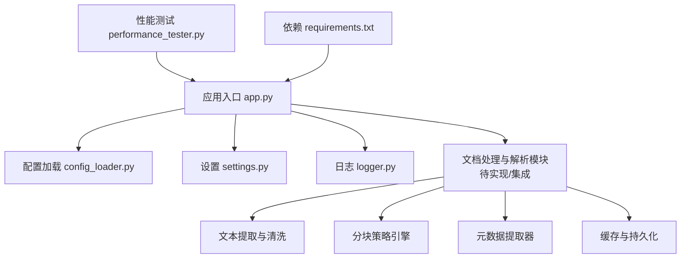
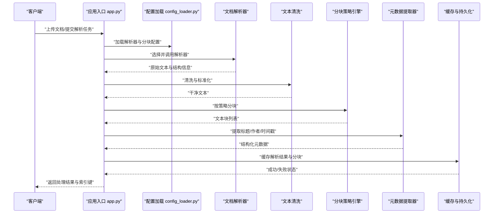
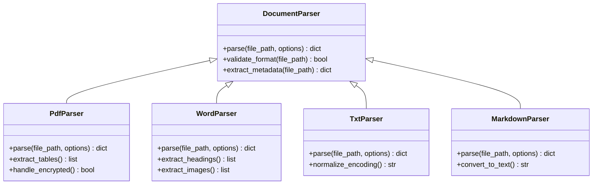
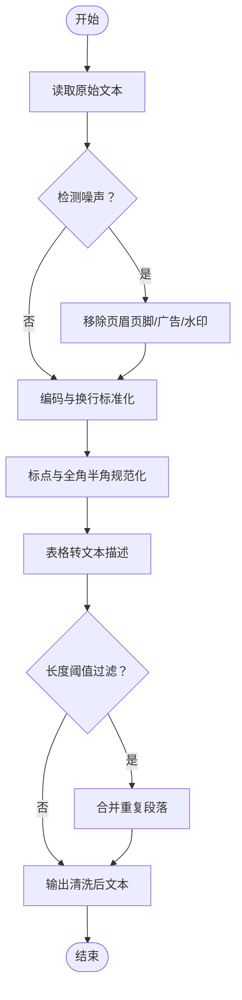
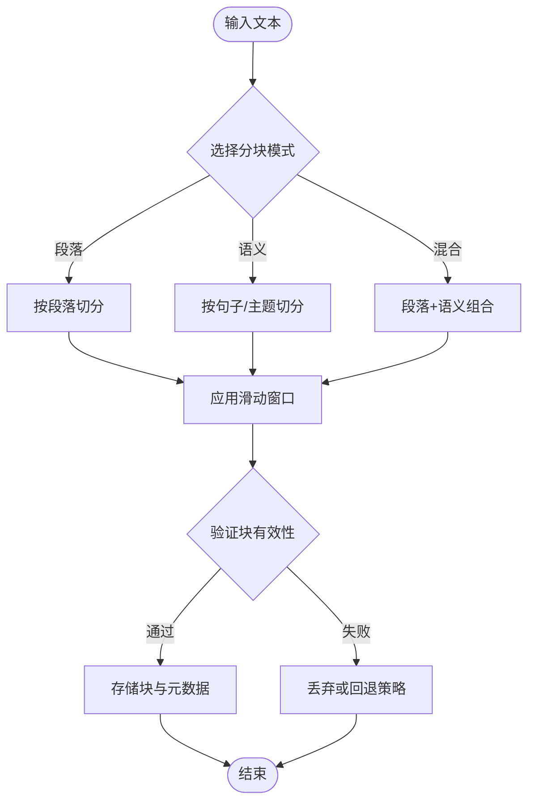
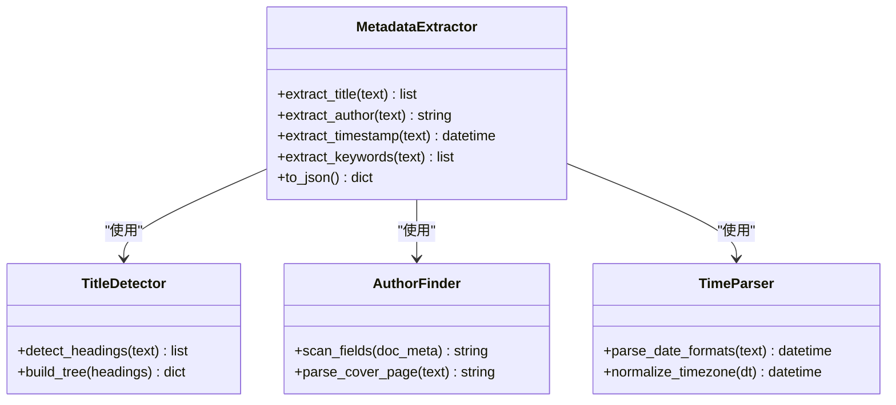
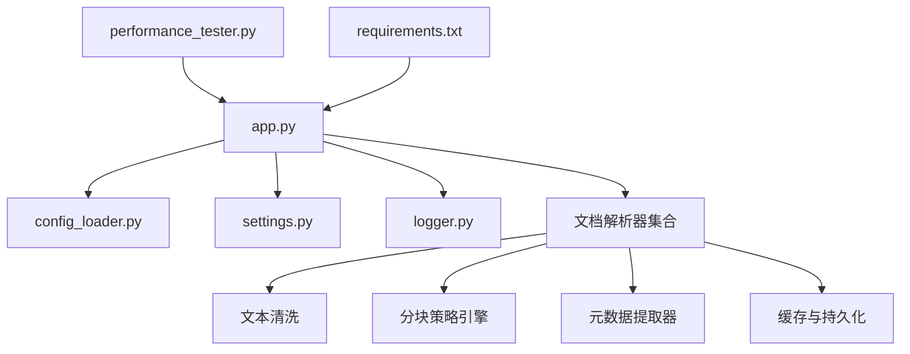

# 文档处理与解析

<cite>
**本文档引用的文件**   
- [README.md](file://README.md)
- [app.py](file://main/xiaozhi-server/app.py)
- [config_loader.py](file://main/xiaozhi-server/config/config_loader.py)
- [settings.py](file://main/xiaozhi-server/config/settings.py)
- [logger.py](file://main/xiaozhi-server/config/logger.py)
- [memory_system_architecture.html](file://main/xiaozhi-server/docs/architecture/memory_system_architecture.html)
- [cache-implementation.md](file://main/xiaozhi-server/docs/cache-implementation.md)
- [performance_tester.py](file://main/xiaozhi-server/performance_tester.py)
- [requirements.txt](file://main/xiaozhi-server/requirements.txt)
</cite>

## 目录
1. [简介](#简介)
2. [项目结构](#项目结构)
3. [核心组件](#核心组件)
4. [架构总览](#架构总览)
5. [详细组件分析](#详细组件分析)
6. [依赖关系分析](#依赖关系分析)
7. [性能考虑](#性能考虑)
8. [故障排查指南](#故障排查指南)
9. [结论](#结论)
10. [附录](#附录)（如有需要）

## 简介
本技术文档聚焦于知识库文档处理与解析模块，覆盖支持的文档格式、解析流程、文本提取算法、内容清洗与标准化、分块策略（段落/语义/重叠窗口）、元数据提取（标题、作者、时间戳），以及配置示例、参数调优、性能优化与错误重试机制。该模块服务于知识检索与问答场景，为上层RAG链路提供高质量、可索引的文本片段与结构化元数据。

## 项目结构
仓库采用多语言多服务组织方式，其中与文档处理相关的主要代码位于 Python 服务端 main/xiaozhi-server 下，配套文档与架构图位于 docs 目录。整体结构如下：
- 应用入口与生命周期管理：app.py
- 配置加载与设置：config_loader.py、settings.py
- 日志记录：logger.py
- 架构与设计说明：docs/architecture、docs/cache-implementation.md
- 性能测试工具：performance_tester.py
- 依赖声明：requirements.txt

图表来源
- [app.py](file://main/xiaozhi-server/app.py)
- [config_loader.py](file://main/xiaozhi-server/config/config_loader.py)
- [settings.py](file://main/xiaozhi-server/config/settings.py)
- [logger.py](file://main/xiaozhi-server/config/logger.py)
- [performance_tester.py](file://main/xiaozhi-server/performance_tester.py)
- [requirements.txt](file://main/xiaozhi-server/requirements.txt)

章节来源
- [README.md](file://README.md)
- [app.py](file://main/xiaozhi-server/app.py)
- [config_loader.py](file://main/xiaozhi-server/config/config_loader.py)
- [settings.py](file://main/xiaozhi-server/config/settings.py)
- [logger.py](file://main/xiaozhi-server/config/logger.py)
- [performance_tester.py](file://main/xiaozhi-server/performance_tester.py)
- [requirements.txt](file://main/xiaozhi-server/requirements.txt)

## 核心组件
- 文档解析器集合：支持 PDF、Word、TXT、Markdown 等常见格式，通过统一接口接入不同后端库（如 pdfplumber、pypdf、python-docx、markdown 等）。
- 文本提取与清洗：去除页眉页脚、表格噪声、多余空白与不可见字符，统一编码与换行，规范化标点与全角半角。
- 分块策略引擎：提供按段落分块、按语义分块（句子/主题边界）、滑动窗口重叠机制，确保上下文连贯与召回质量。
- 元数据提取器：识别标题层级、作者信息、时间戳、文档版本、来源链接等，输出结构化元数据。
- 缓存与持久化：对解析结果与分块结果进行缓存与存储，避免重复计算，提升吞吐。
- 配置与日志：集中式配置加载与动态更新，结构化日志便于追踪问题与性能分析。

章节来源
- [app.py](file://main/xiaozhi-server/app.py)
- [config_loader.py](file://main/xiaozhi-server/config/config_loader.py)
- [settings.py](file://main/xiaozhi-server/config/settings.py)
- [logger.py](file://main/xiaozhi-server/config/logger.py)

## 架构总览
文档处理与解析模块在应用启动时由入口程序初始化，并通过配置中心加载解析器、分块策略与元数据规则。解析流程包括：
- 输入校验与格式识别
- 选择对应解析器并执行文本提取
- 清洗与标准化
- 分块与元数据抽取
- 缓存写入与索引准备

图表来源
- [app.py](file://main/xiaozhi-server/app.py)
- [config_loader.py](file://main/xiaozhi-server/config/config_loader.py)
- [settings.py](file://main/xiaozhi-server/config/settings.py)
- [logger.py](file://main/xiaozhi-server/config/logger.py)

## 详细组件分析

### 文档解析器集合
- 支持的格式与后端：
  - PDF：使用 pdfplumber/pypdf 提取正文与表格；对扫描版 PDF 可通过 OCR 扩展。
  - Word：使用 python-docx 提取段落、标题、表格与图片说明。
  - TXT：直接读取文本，按换行与空行划分段落。
  - Markdown：使用 markdown 解析器转换为结构化文本，保留标题层级与列表。
- 统一接口：所有解析器实现统一的 parse(file_path, options) 接口，返回标准化文本与结构信息。
- 错误处理：针对损坏文件、加密文档、编码异常进行捕获与重试或降级处理。

图表来源
- [app.py](file://main/xiaozhi-server/app.py)
- [settings.py](file://main/xiaozhi-server/config/settings.py)

章节来源
- [app.py](file://main/xiaozhi-server/app.py)
- [settings.py](file://main/xiaozhi-server/config/settings.py)

### 文本提取与清洗
- 提取目标：正文、标题、列表、表格、图片说明、脚注等。
- 清洗步骤：
  - 去噪：移除页眉页脚、广告、水印、多余空白与不可见字符。
  - 标准化：统一编码、换行符、标点符号（全角/半角）、数字与单位格式。
  - 结构化：将表格转为行级文本描述，保留关键列名与数值。
- 质量控制：长度阈值过滤、重复段落合并、乱码检测与修复。

图表来源
- [app.py](file://main/xiaozhi-server/app.py)
- [logger.py](file://main/xiaozhi-server/config/logger.py)

章节来源
- [app.py](file://main/xiaozhi-server/app.py)
- [logger.py](file://main/xiaozhi-server/config/logger.py)

### 分块策略引擎
- 分块模式：
  - 按段落分块：以空行或段落标记为边界，适合短文档与快速索引。
  - 按语义分块：基于句子边界与主题变化点切分，保持语义完整性。
  - 重叠窗口：设置窗口大小与步长，保证相邻块的上下文衔接。
- 参数调优：
  - 块大小：根据下游嵌入模型的最大 token 限制调整。
  - 重叠率：通常 10%-20%，平衡召回与冗余。
  - 最小长度：过滤过短片段，减少噪声。
- 输出结构：每个块包含文本、起始位置、结束位置、所属标题路径与元数据引用。

图表来源
- [app.py](file://main/xiaozhi-server/app.py)
- [settings.py](file://main/xiaozhi-server/config/settings.py)

章节来源
- [app.py](file://main/xiaozhi-server/app.py)
- [settings.py](file://main/xiaozhi-server/config/settings.py)

### 元数据提取器
- 标题识别：基于标题层级（H1-H6）与样式特征构建标题树，用于导航与上下文定位。
- 作者信息：从文档属性、封面页、页脚或特定字段中提取作者、机构、联系方式。
- 时间戳：提取创建时间、修改时间、发布日期，支持多种日期格式与本地化。
- 其他元数据：版本号、来源链接、许可证、关键词等。
- 输出规范：JSON 结构，包含字段名、值、置信度与来源位置。

图表来源
- [app.py](file://main/xiaozhi-server/app.py)
- [settings.py](file://main/xiaozhi-server/config/settings.py)

章节来源
- [app.py](file://main/xiaozhi-server/app.py)
- [settings.py](file://main/xiaozhi-server/config/settings.py)

### 配置与日志
- 配置加载：集中式 YAML/JSON 配置，支持运行时重载与默认值回退。
- 设置项：解析器选择、分块参数、清洗规则、缓存策略、并发度等。
- 日志记录：结构化日志，包含请求 ID、耗时、错误堆栈与指标统计。

章节来源
- [config_loader.py](file://main/xiaozhi-server/config/config_loader.py)
- [settings.py](file://main/xiaozhi-server/config/settings.py)
- [logger.py](file://main/xiaozhi-server/config/logger.py)

## 依赖关系分析
- 外部依赖：PDF/Word/Markdown 解析库、OCR 扩展（可选）、缓存与数据库驱动。
- 内部依赖：应用入口、配置加载、日志模块、缓存与持久化。
- 耦合与内聚：解析器与清洗/分块/元数据模块松耦合，通过统一接口与配置驱动。

图表来源
- [app.py](file://main/xiaozhi-server/app.py)
- [config_loader.py](file://main/xiaozhi-server/config/config_loader.py)
- [settings.py](file://main/xiaozhi-server/config/settings.py)
- [logger.py](file://main/xiaozhi-server/config/logger.py)
- [performance_tester.py](file://main/xiaozhi-server/performance_tester.py)
- [requirements.txt](file://main/xiaozhi-server/requirements.txt)

章节来源
- [app.py](file://main/xiaozhi-server/app.py)
- [config_loader.py](file://main/xiaozhi-server/config/config_loader.py)
- [settings.py](file://main/xiaozhi-server/config/settings.py)
- [logger.py](file://main/xiaozhi-server/config/logger.py)
- [performance_tester.py](file://main/xiaozhi-server/performance_tester.py)
- [requirements.txt](file://main/xiaozhi-server/requirements.txt)

## 性能考虑
- 并行处理：对多文档解析与分块任务采用线程池或进程池并行，控制并发度以避免资源争用。
- 内存管理：流式读取大文件，避免一次性加载；及时释放中间对象，启用垃圾回收。
- 缓存策略：对解析结果与分块结果进行哈希缓存，命中则跳过重复计算。
- 错误重试：对网络与 IO 异常实施指数退避重试，设置最大重试次数与超时。
- 监控与指标：记录解析时长、成功率、内存占用与队列长度，便于容量规划与瓶颈定位。

章节来源
- [performance_tester.py](file://main/xiaozhi-server/performance_tester.py)
- [logger.py](file://main/xiaozhi-server/config/logger.py)

## 故障排查指南
- 常见问题：
  - 解析失败：检查文件格式与权限，确认依赖库安装正确。
  - 文本缺失：确认 OCR 配置与图像清晰度，调整清洗阈值。
  - 分块异常：检查块大小与重叠率，避免过短或过长片段。
  - 元数据缺失：增强正则与模板匹配，增加置信度阈值。
- 调试方法：
  - 启用详细日志，查看错误堆栈与中间状态。
  - 使用性能测试工具模拟负载，定位瓶颈。
  - 逐步禁用清洗或分块规则，隔离问题来源。

章节来源
- [logger.py](file://main/xiaozhi-server/config/logger.py)
- [performance_tester.py](file://main/xiaozhi-server/performance_tester.py)

## 结论
本模块通过统一的解析接口、灵活的清洗与分块策略、完善的元数据提取与缓存机制，为知识库检索提供了稳定高效的文本处理能力。建议在生产环境中结合业务需求调优分块参数与并发度，并建立完善的监控与告警体系，确保高可用与可扩展性。

## 附录
- 参考架构与缓存实现说明：
  - [memory_system_architecture.html](file://main/xiaozhi-server/docs/architecture/memory_system_architecture.html)
  - [cache-implementation.md](file://main/xiaozhi-server/docs/cache-implementation.md)

章节来源
- [memory_system_architecture.html](file://main/xiaozhi-server/docs/architecture/memory_system_architecture.html)
- [cache-implementation.md](file://main/xiaozhi-server/docs/cache-implementation.md)