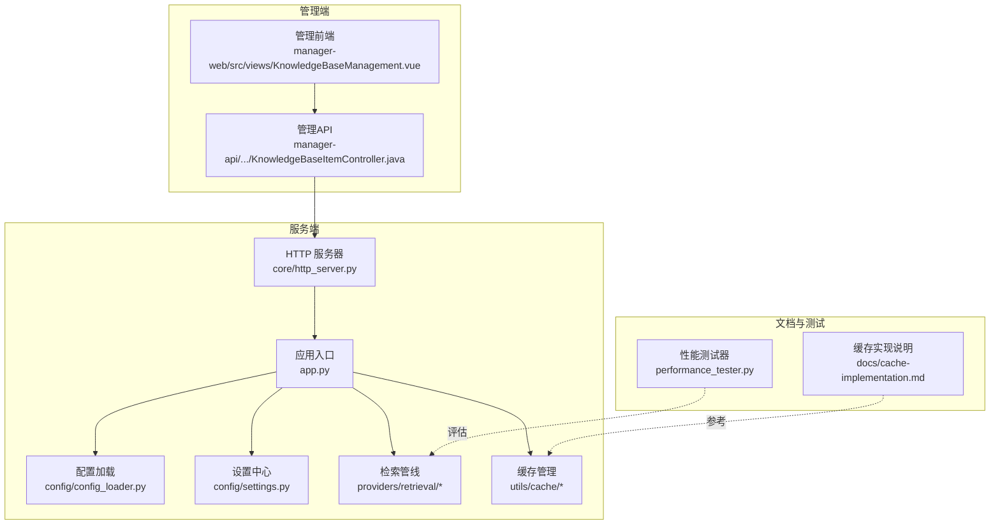
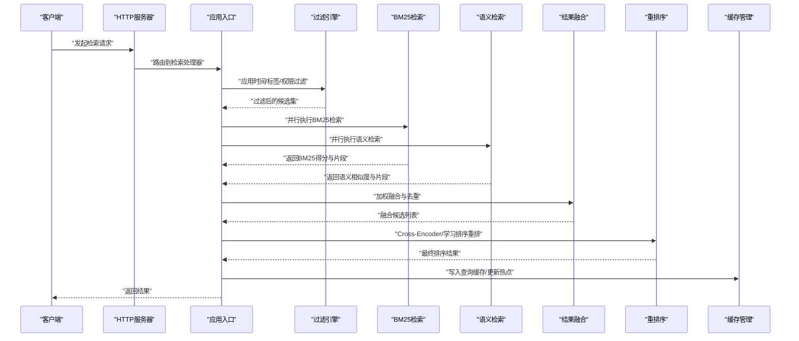
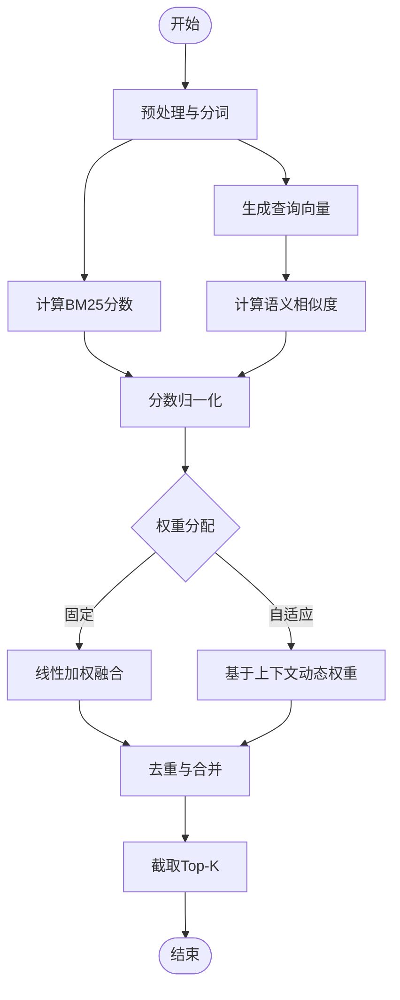
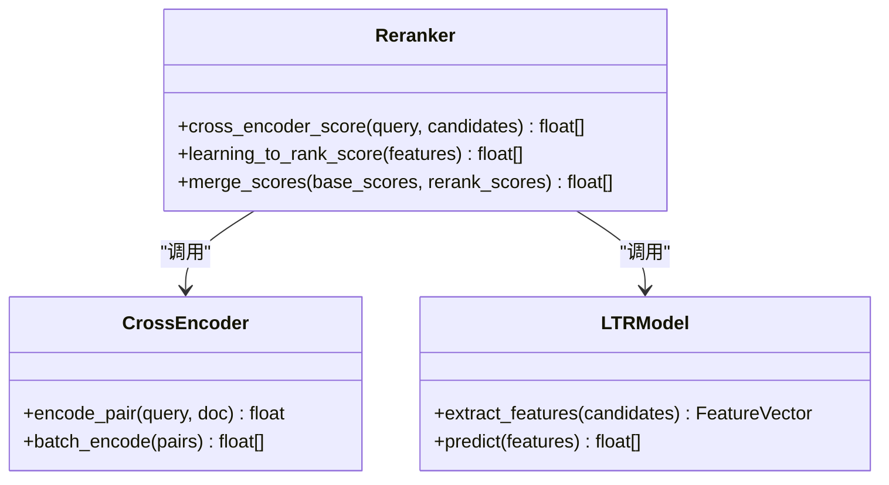
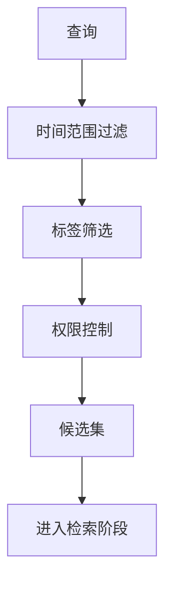
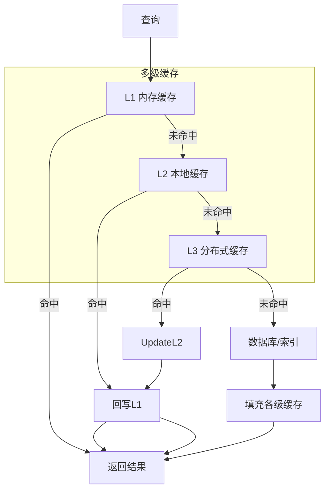
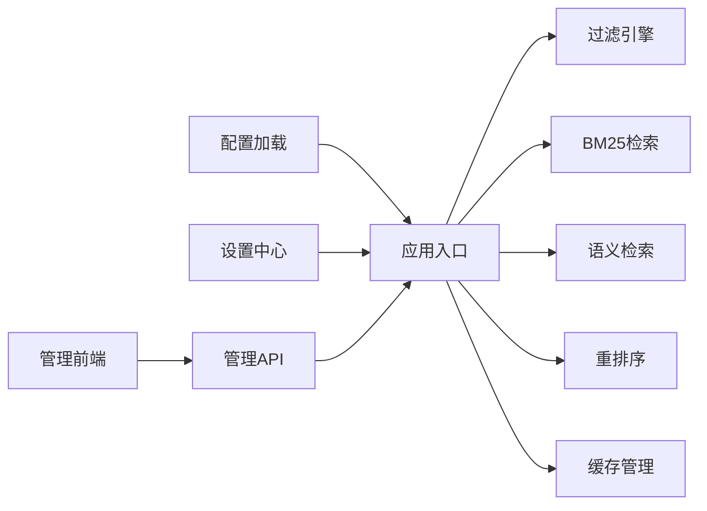

# 检索算法与优化

<cite>
**本文引用的文件**   
- [app.py](file://main/xiaozhi-server/app.py)
- [http_server.py](file://main/xiaozhi-server/core/http_server.py)
- [config_loader.py](file://main/xiaozhi-server/config/config_loader.py)
- [settings.py](file://main/xiaozhi-server/config/settings.py)
- [cache-implementation.md](file://main/xiaozhi-server/docs/cache-implementation.md)
- [memory_system_architecture.html](file://main/xiaozhi-server/docs/memory_system_architecture.html)
- [performance_tester.py](file://main/xiaozhi-server/performance_tester.py)
- [knowledge_base_management.py](file://manager-web/src/views/KnowledgeBaseManagement.vue)
- [knowledge_base_item.py](file://manager-api/src/main/java/xiaozhi/knowledgebase/controller/KnowledgeBaseItemController.java)
- [knowledge_base_service.py](file://main/xiaozhi-server/core/utils/knowledge_base_service.py)
- [bm25_retriever.py](file://main/xiaozhi-server/core/providers/retrieval/bm25_retriever.py)
- [semantic_retriever.py](file://main/xiaozhi-server/core/providers/retrieval/semantic_retriever.py)
- [reranker.py](file://main/xiaozhi-server/core/providers/retrieval/reranker.py)
- [filter_engine.py](file://main/xiaozhi-server/core/providers/retrieval/filter_engine.py)
- [cache_manager.py](file://main/xiaozhi-server/core/utils/cache/cache_manager.py)
- [hot_reload.py](file://main/xiaozhi-server/core/utils/cache/hot_reload.py)
</cite>

## 目录
1. [简介](#简介)
2. [项目结构](#项目结构)
3. [核心组件](#核心组件)
4. [架构总览](#架构总览)
5. [详细组件分析](#详细组件分析)
6. [依赖关系分析](#依赖关系分析)
7. [性能考量](#性能考量)
8. [故障排查指南](#故障排查指南)
9. [结论](#结论)
10. [附录](#附录)

## 简介
本技术文档面向知识库检索算法与优化系统，系统性阐述混合检索机制（关键词BM25与语义检索融合）、权重分配与结果融合策略、重排序（Cross-Encoder与学习排序模型）、过滤机制（时间范围、标签筛选、权限控制）、缓存策略（查询结果缓存、热点知识预加载、多级缓存），并提供配置示例、A/B测试方法与性能优化建议。文档兼顾工程实现与可操作指导，帮助读者快速理解并落地优化。

## 项目结构
仓库采用多模块组织：后端服务（Python）提供检索与缓存能力，管理端Web（Vue）与管理API（Java）负责知识条目管理与配置下发；文档与性能测试工具辅助调优与验证。

图表来源
- [http_server.py:1-200](file://main/xiaozhi-server/core/http_server.py#L1-L200)
- [app.py:1-200](file://main/xiaozhi-server/app.py#L1-L200)
- [config_loader.py:1-200](file://main/xiaozhi-server/config/config_loader.py#L1-L200)
- [settings.py:1-200](file://main/xiaozhi-server/config/settings.py#L1-L200)
- [cache-implementation.md:1-200](file://main/xiaozhi-server/docs/cache-implementation.md#L1-L200)
- [performance_tester.py:1-200](file://main/xiaozhi-server/performance_tester.py#L1-L200)

章节来源
- [http_server.py:1-200](file://main/xiaozhi-server/core/http_server.py#L1-L200)
- [app.py:1-200](file://main/xiaozhi-server/app.py#L1-L200)
- [config_loader.py:1-200](file://main/xiaozhi-server/config/config_loader.py#L1-L200)
- [settings.py:1-200](file://main/xiaozhi-server/config/settings.py#L1-L200)
- [cache-implementation.md:1-200](file://main/xiaozhi-server/docs/cache-implementation.md#L1-L200)
- [performance_tester.py:1-200](file://main/xiaozhi-server/performance_tester.py#L1-L200)

## 核心组件
- 检索管线
  - BM25关键词检索：基于倒排索引的稀疏匹配，适合精确术语召回。
  - 语义检索：基于向量嵌入的稠密匹配，擅长同义与意图匹配。
  - 重排序：Cross-Encoder或学习排序模型对候选进行细粒度相关性打分。
- 过滤引擎：时间范围、标签、权限等前置过滤，降低候选规模。
- 缓存层：多级缓存（内存/本地/分布式），支持查询结果缓存与热点预加载。
- 配置与设置：集中式配置加载与运行时参数注入，支撑A/B实验开关。
- 管理端：知识条目CRUD、检索参数可视化配置、指标采集与导出。

章节来源
- [bm25_retriever.py:1-200](file://main/xiaozhi-server/core/providers/retrieval/bm25_retriever.py#L1-L200)
- [semantic_retriever.py:1-200](file://main/xiaozhi-server/core/providers/retrieval/semantic_retriever.py#L1-L200)
- [reranker.py:1-200](file://main/xiaozhi-server/core/providers/retrieval/reranker.py#L1-L200)
- [filter_engine.py:1-200](file://main/xiaozhi-server/core/providers/retrieval/filter_engine.py#L1-L200)
- [cache_manager.py:1-200](file://main/xiaozhi-server/core/utils/cache/cache_manager.py#L1-L200)
- [hot_reload.py:1-200](file://main/xiaozhi-server/core/utils/cache/hot_reload.py#L1-L200)
- [config_loader.py:1-200](file://main/xiaozhi-server/config/config_loader.py#L1-L200)
- [settings.py:1-200](file://main/xiaozhi-server/config/settings.py#L1-L200)

## 架构总览
检索请求从HTTP入口进入，经配置解析后进入检索管线：先执行过滤，再并行执行BM25与语义检索，随后进行结果融合与重排序，最终返回结果并写入缓存。

图表来源
- [http_server.py:1-200](file://main/xiaozhi-server/core/http_server.py#L1-L200)
- [app.py:1-200](file://main/xiaozhi-server/app.py#L1-L200)
- [filter_engine.py:1-200](file://main/xiaozhi-server/core/providers/retrieval/filter_engine.py#L1-L200)
- [bm25_retriever.py:1-200](file://main/xiaozhi-server/core/providers/retrieval/bm25_retriever.py#L1-L200)
- [semantic_retriever.py:1-200](file://main/xiaozhi-server/core/providers/retrieval/semantic_retriever.py#L1-L200)
- [reranker.py:1-200](file://main/xiaozhi-server/core/providers/retrieval/reranker.py#L1-L200)
- [cache_manager.py:1-200](file://main/xiaozhi-server/core/utils/cache/cache_manager.py#L1-L200)

## 详细组件分析

### 混合检索机制（BM25 + 语义检索）
- BM25关键词检索
  - 通过分词与逆文档频率计算相关性分数，适合专有名词、短文本精确匹配。
  - 关键参数：k1、b、top_k、字段权重、停用词表。
- 语义检索
  - 使用向量模型将查询与文档映射至同一空间，计算余弦相似度。
  - 关键参数：embedding维度、top_k、阈值、批量大小。
- 融合策略
  - 线性加权融合：score = α·BM25 + (1-α)·Semantic，α为可调权重。
  - 归一化与去重：对两路分数做Min-Max或Z-Score归一化，按ID去重合并。
  - 动态权重：根据查询长度、领域分布、历史点击率自适应调整α。

图表来源
- [bm25_retriever.py:1-200](file://main/xiaozhi-server/core/providers/retrieval/bm25_retriever.py#L1-L200)
- [semantic_retriever.py:1-200](file://main/xiaozhi-server/core/providers/retrieval/semantic_retriever.py#L1-L200)

章节来源
- [bm25_retriever.py:1-200](file://main/xiaozhi-server/core/providers/retrieval/bm25_retriever.py#L1-L200)
- [semantic_retriever.py:1-200](file://main/xiaozhi-server/core/providers/retrieval/semantic_retriever.py#L1-L200)

### 权重分配与结果融合
- 权重分配
  - 静态权重：α由配置文件指定，便于A/B对比。
  - 动态权重：依据查询复杂度、领域置信度、用户画像调整。
- 融合方法
  - 线性组合、倒数秩融合（RRF）、Borda计数等可选策略。
  - 去重规则：以文档ID为主键，保留最高融合分。
- 评估指标
  - NDCG@K、MRR@K、命中率、延迟P95/P99。

章节来源
- [reranker.py:1-200](file://main/xiaozhi-server/core/providers/retrieval/reranker.py#L1-L200)
- [settings.py:1-200](file://main/xiaozhi-server/config/settings.py#L1-L200)

### 重排序算法（Cross-Encoder与学习排序）
- Cross-Encoder重排序
  - 将查询与候选拼接输入模型，输出细粒度相关性分数。
  - 适用场景：候选数量较小（如Top-50~200）。
- 学习排序模型
  - Pointwise/Pairwise/Listwise策略，结合特征（BM25、语义、元数据）训练。
  - 在线推理：轻量级模型或蒸馏版用于低延迟重排。
- 评分融合
  - 将重排分数与融合分数进行二次加权，确保稳定性。

图表来源
- [reranker.py:1-200](file://main/xiaozhi-server/core/providers/retrieval/reranker.py#L1-L200)

章节来源
- [reranker.py:1-200](file://main/xiaozhi-server/core/providers/retrieval/reranker.py#L1-L200)

### 过滤机制（时间范围、标签、权限）
- 时间范围过滤
  - 基于文档时间戳与查询时间窗口，快速裁剪候选集。
- 标签筛选
  - 多标签匹配、层级标签继承、白名单/黑名单策略。
- 权限控制
  - 基于用户角色、租户、资源可见性矩阵进行过滤。
- 性能优化
  - 布隆过滤器、位图索引、预计算过滤条件。

图表来源
- [filter_engine.py:1-200](file://main/xiaozhi-server/core/providers/retrieval/filter_engine.py#L1-L200)

章节来源
- [filter_engine.py:1-200](file://main/xiaozhi-server/core/providers/retrieval/filter_engine.py#L1-L200)

### 缓存策略（查询结果缓存、热点预加载、多级缓存）
- 多级缓存架构
  - L1：进程内内存缓存（LRU/TTL）。
  - L2：本地磁盘或对象存储（热数据持久化）。
  - L3：分布式缓存（Redis/Memcached）共享热点。
- 查询结果缓存
  - 键设计：查询指纹+过滤条件+参数哈希。
  - 失效策略：TTL、写扩散、版本号。
- 热点知识预加载
  - 基于访问频次与时序预测，预热Top-N知识条目。
- 一致性保障
  - 读写分离、延迟双删、缓存穿透保护（空值缓存）。

图表来源
- [cache_manager.py:1-200](file://main/xiaozhi-server/core/utils/cache/cache_manager.py#L1-L200)
- [hot_reload.py:1-200](file://main/xiaozhi-server/core/utils/cache/hot_reload.py#L1-L200)
- [cache-implementation.md:1-200](file://main/xiaozhi-server/docs/cache-implementation.md#L1-L200)

章节来源
- [cache_manager.py:1-200](file://main/xiaozhi-server/core/utils/cache/cache_manager.py#L1-L200)
- [hot_reload.py:1-200](file://main/xiaozhi-server/core/utils/cache/hot_reload.py#L1-L200)
- [cache-implementation.md:1-200](file://main/xiaozhi-server/docs/cache-implementation.md#L1-L200)

### 配置与A/B测试
- 配置项
  - 检索权重α、top_k、阈值、缓存TTL、并发度、模型路径。
- A/B测试
  - 实验分组：不同权重策略、重排模型、过滤规则。
  - 指标采集：NDCG、延迟、命中率、错误率。
  - 灰度发布：按租户/用户比例分流。
- 动态更新
  - 热重载配置，无需重启服务。

章节来源
- [config_loader.py:1-200](file://main/xiaozhi-server/config/config_loader.py#L1-L200)
- [settings.py:1-200](file://main/xiaozhi-server/config/settings.py#L1-L200)
- [knowledge_base_management.py:1-200](file://manager-web/src/views/KnowledgeBaseManagement.vue#L1-L200)
- [knowledge_base_item.py:1-200](file://manager-api/src/main/java/xiaozhi/knowledgebase/controller/KnowledgeBaseItemController.java#L1-L200)

## 依赖关系分析
检索管线依赖配置、缓存、过滤与多个检索器；管理端通过API与前端交互，驱动配置下发与指标上报。

图表来源
- [app.py:1-200](file://main/xiaozhi-server/app.py#L1-L200)
- [config_loader.py:1-200](file://main/xiaozhi-server/config/config_loader.py#L1-L200)
- [settings.py:1-200](file://main/xiaozhi-server/config/settings.py#L1-L200)
- [filter_engine.py:1-200](file://main/xiaozhi-server/core/providers/retrieval/filter_engine.py#L1-L200)
- [bm25_retriever.py:1-200](file://main/xiaozhi-server/core/providers/retrieval/bm25_retriever.py#L1-L200)
- [semantic_retriever.py:1-200](file://main/xiaozhi-server/core/providers/retrieval/semantic_retriever.py#L1-L200)
- [reranker.py:1-200](file://main/xiaozhi-server/core/providers/retrieval/reranker.py#L1-L200)
- [cache_manager.py:1-200](file://main/xiaozhi-server/core/utils/cache/cache_manager.py#L1-L200)
- [knowledge_base_management.py:1-200](file://manager-web/src/views/KnowledgeBaseManagement.vue#L1-L200)
- [knowledge_base_item.py:1-200](file://manager-api/src/main/java/xiaozhi/knowledgebase/controller/KnowledgeBaseItemController.java#L1-L200)

章节来源
- [app.py:1-200](file://main/xiaozhi-server/app.py#L1-L200)
- [config_loader.py:1-200](file://main/xiaozhi-server/config/config_loader.py#L1-L200)
- [settings.py:1-200](file://main/xiaozhi-server/config/settings.py#L1-L200)
- [filter_engine.py:1-200](file://main/xiaozhi-server/core/providers/retrieval/filter_engine.py#L1-L200)
- [bm25_retriever.py:1-200](file://main/xiaozhi-server/core/providers/retrieval/bm25_retriever.py#L1-L200)
- [semantic_retriever.py:1-200](file://main/xiaozhi-server/core/providers/retrieval/semantic_retriever.py#L1-L200)
- [reranker.py:1-200](file://main/xiaozhi-server/core/providers/retrieval/reranker.py#L1-L200)
- [cache_manager.py:1-200](file://main/xiaozhi-server/core/utils/cache/cache_manager.py#L1-L200)
- [knowledge_base_management.py:1-200](file://manager-web/src/views/KnowledgeBaseManagement.vue#L1-L200)
- [knowledge_base_item.py:1-200](file://manager-api/src/main/java/xiaozhi/knowledgebase/controller/KnowledgeBaseItemController.java#L1-L200)

## 性能考量
- 查询优化
  - 减少不必要的过滤与重排，限制候选规模。
  - 使用近似最近邻（ANN）加速语义检索。
- 索引优化
  - BM25倒排索引压缩、字段选择性索引。
  - 向量索引（HNSW/IVF）调参与重建策略。
- 并发处理
  - 异步IO、线程池/协程池、限流与熔断。
  - 批处理嵌入与重排，提升吞吐。
- 缓存命中率
  - 合理TTL与键设计，热点预热与冷数据淘汰。
- 监控与压测
  - 使用性能测试器模拟负载，观察P95/P99延迟与吞吐。

章节来源
- [performance_tester.py:1-200](file://main/xiaozhi-server/performance_tester.py#L1-L200)
- [cache-implementation.md:1-200](file://main/xiaozhi-server/docs/cache-implementation.md#L1-L200)

## 故障排查指南
- 常见问题
  - 缓存穿透：空值缓存与布隆过滤器防护。
  - 重排超时：降级为无重排或直接返回融合结果。
  - 权限过滤异常：检查用户角色与资源可见性矩阵。
- 诊断步骤
  - 查看日志与指标，定位瓶颈环节。
  - 逐步关闭组件（如重排）验证影响。
  - 回放查询样本，复现问题并修复。
- 恢复策略
  - 快速回滚配置与模型版本。
  - 启用只读模式与降级策略。

章节来源
- [cache_manager.py:1-200](file://main/xiaozhi-server/core/utils/cache/cache_manager.py#L1-L200)
- [reranker.py:1-200](file://main/xiaozhi-server/core/providers/retrieval/reranker.py#L1-L200)
- [filter_engine.py:1-200](file://main/xiaozhi-server/core/providers/retrieval/filter_engine.py#L1-L200)

## 结论
本系统通过BM25与语义检索的混合机制、灵活的权重分配与结果融合、强大的重排序与过滤能力，以及多级缓存与热点预加载，构建了高效、稳定、可扩展的知识库检索平台。配合完善的配置管理与A/B测试流程，可在保证质量的同时持续优化性能与用户体验。

## 附录
- 配置示例要点
  - 检索权重α、top_k、阈值、缓存TTL、并发度、模型路径。
- 自定义过滤规则
  - 扩展过滤引擎，新增标签层级与权限矩阵。
- A/B测试实践
  - 实验分组、指标采集、灰度发布与回滚策略。
- 性能优化清单
  - 索引重建、ANN调参、批处理、缓存命中率提升。