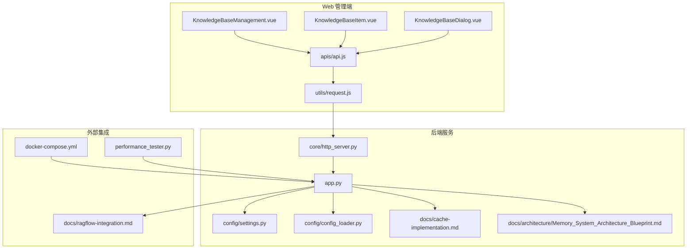
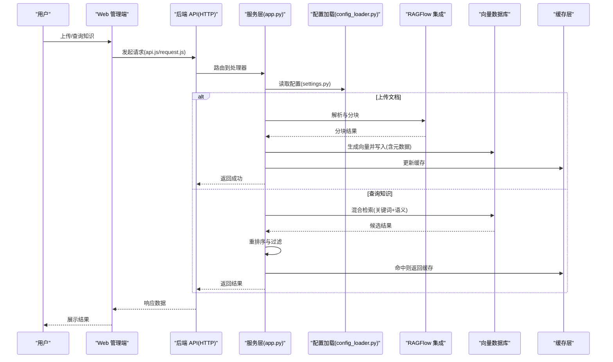
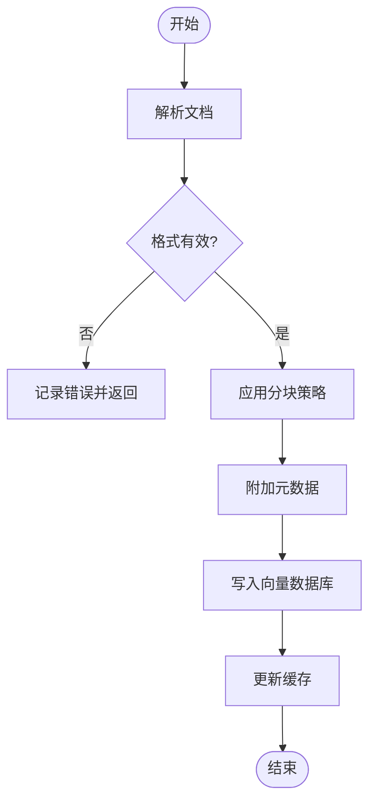
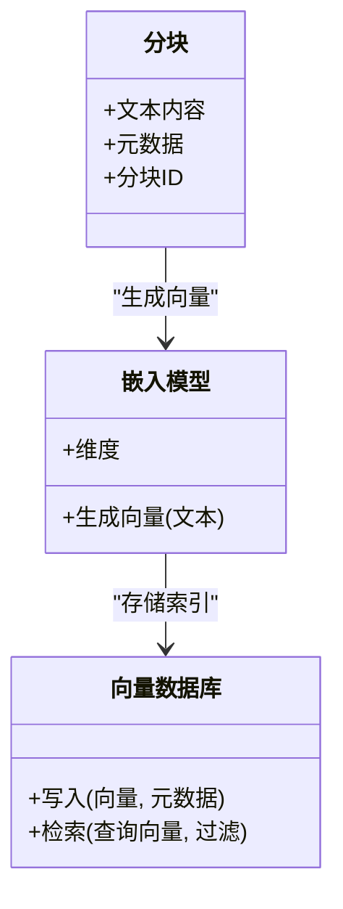
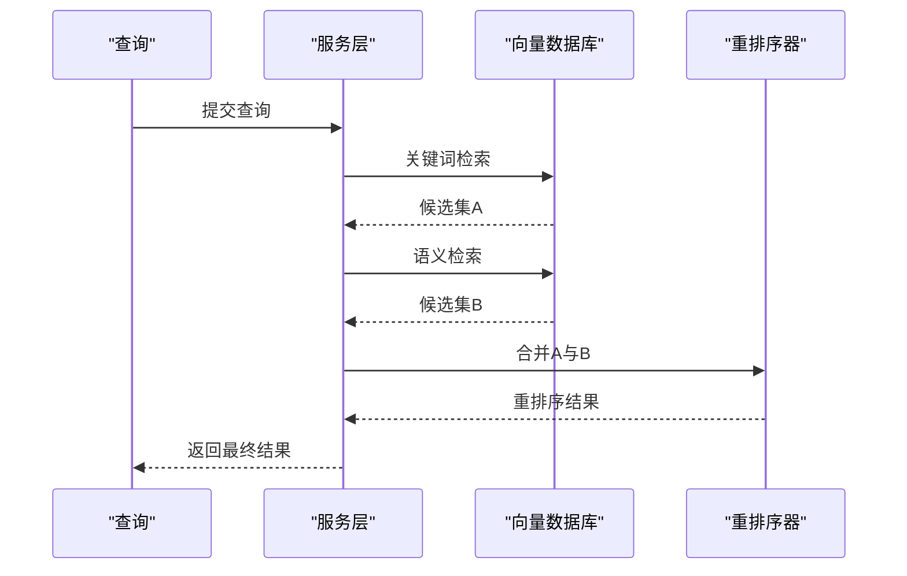
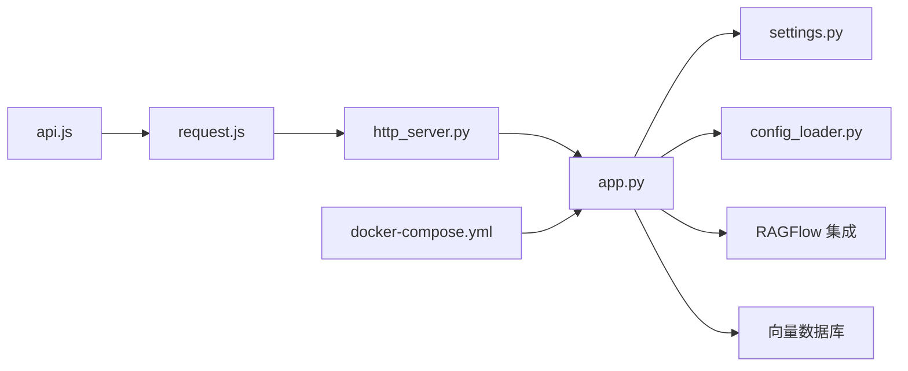

# 知识库管理

<cite>
**本文引用的文件**   
- [README.md](file://README.md)
- [ragflow-integration.md](file://docs/ragflow-integration.md)
- [memory_system_architecture_Blueprint.md](file://main/xiaozhi-server/docs/architecture/Memory_System_Architecture_Blueprint.md)
- [cache-implementation.md](file://main/xiaozhi-server/docs/cache-implementation.md)
- [app.py](file://main/xiaozhi-server/app.py)
- [http_server.py](file://main/xiaozhi-server/core/http_server.py)
- [settings.py](file://main/xiaozhi-server/config/settings.py)
- [config_loader.py](file://main/xiaozhi-server/config/config_loader.py)
- [knowledge-base-management.vue](file://main/manager-web/src/views/KnowledgeBaseManagement.vue)
- [knowledge-base-item.vue](file://main/manager-web/src/views/KnowledgeBaseItem.vue)
- [KnowledgeBaseDialog.vue](file://main/manager-web/src/components/KnowledgeBaseDialog.vue)
- [api.js](file://main/manager-web/src/apis/api.js)
- [request.js](file://main/manager-web/src/utils/request.js)
- [docker-compose.yml](file://main/xiaozhi-server/docker-compose.yml)
- [performance_tester.py](file://main/xiaozhi-server/performance_tester.py)
</cite>

## 目录
1. [简介](#简介)
2. [项目结构](#项目结构)
3. [核心组件](#核心组件)
4. [架构总览](#架构总览)
5. [详细组件分析](#详细组件分析)
6. [依赖关系分析](#依赖关系分析)
7. [性能考量](#性能考量)
8. [故障排查指南](#故障排查指南)
9. [结论](#结论)
10. [附录：API 接口文档](#附录api-接口文档)

## 简介
本技术文档面向“知识库管理系统”，围绕知识构建、索引与检索、更新策略、API 使用与性能优化进行系统化说明。结合仓库中的 RAGFlow 集成文档、记忆系统架构蓝图、缓存实现说明以及前后端代码，梳理从文档解析、分块、向量嵌入到语义检索与重排序的完整链路，并给出可操作的部署与优化建议。

## 项目结构
本项目为多模块工程，知识库相关能力主要分布在以下位置：
- 后端服务（Python）：提供 HTTP API、配置加载、缓存与内存管理等核心逻辑
- Web 管理端（Vue）：提供知识库条目管理、上传、查询等前端界面
- 文档与架构说明：RAGFlow 集成、记忆系统架构、缓存实现等
- 容器编排与测试：Docker Compose 编排、性能测试脚本

图表来源
- [knowledge-base-management.vue](file://main/manager-web/src/views/KnowledgeBaseManagement.vue)
- [knowledge-base-item.vue](file://main/manager-web/src/views/KnowledgeBaseItem.vue)
- [KnowledgeBaseDialog.vue](file://main/manager-web/src/components/KnowledgeBaseDialog.vue)
- [api.js](file://main/manager-web/src/apis/api.js)
- [request.js](file://main/manager-web/src/utils/request.js)
- [app.py](file://main/xiaozhi-server/app.py)
- [http_server.py](file://main/xiaozhi-server/core/http_server.py)
- [settings.py](file://main/xiaozhi-server/config/settings.py)
- [config_loader.py](file://main/xiaozhi-server/config/config_loader.py)
- [cache-implementation.md](file://main/xiaozhi-server/docs/cache-implementation.md)
- [memory_system_architecture_Blueprint.md](file://main/xiaozhi-server/docs/architecture/Memory_System_Architecture_Blueprint.md)
- [ragflow-integration.md](file://docs/ragflow-integration.md)
- [docker-compose.yml](file://main/xiaozhi-server/docker-compose.yml)
- [performance_tester.py](file://main/xiaozhi-server/performance_tester.py)

章节来源
- [README.md](file://README.md)
- [ragflow-integration.md](file://docs/ragflow-integration.md)
- [memory_system_architecture_Blueprint.md](file://main/xiaozhi-server/docs/architecture/Memory_System_Architecture_Blueprint.md)
- [cache-implementation.md](file://main/xiaozhi-server/docs/cache-implementation.md)

## 核心组件
- 文档解析与分块
  - 通过 RAGFlow 集成完成文档解析与分块策略配置，支持多种格式与切分规则
  - 分块粒度与重叠策略影响召回质量与上下文完整性
- 向量嵌入生成
  - 调用嵌入模型将文本片段转换为向量，用于语义检索
  - 嵌入维度与模型选择直接影响检索精度与性能
- 索引机制
  - 向量数据库集成（如 Milvus、ChromaDB），存储向量与元数据
  - 语义索引与元数据过滤协同提升检索效果
- 检索算法
  - 混合检索：关键词匹配 + 语义相似度
  - 重排序：基于相关性或业务规则对候选结果排序
  - 结果过滤：按元数据、权限、版本等条件筛选
- 知识更新策略
  - 增量更新：仅处理变更的分块与向量
  - 版本控制：记录知识条目版本，支持回滚与对比
  - 冲突解决：基于时间戳、哈希或合并策略处理并发更新

章节来源
- [ragflow-integration.md](file://docs/ragflow-integration.md)
- [memory_system_architecture_Blueprint.md](file://main/xiaozhi-server/docs/architecture/Memory_System_Architecture_Blueprint.md)
- [cache-implementation.md](file://main/xiaozhi-server/docs/cache-implementation.md)

## 架构总览
知识库系统采用前后端分离架构，Web 管理端通过 API 与后端服务交互；后端服务负责配置加载、HTTP 路由、缓存与记忆系统协调，并通过 RAGFlow 集成完成文档处理与向量检索。

图表来源
- [api.js](file://main/manager-web/src/apis/api.js)
- [request.js](file://main/manager-web/src/utils/request.js)
- [app.py](file://main/xiaozhi-server/app.py)
- [config_loader.py](file://main/xiaozhi-server/config/config_loader.py)
- [ragflow-integration.md](file://docs/ragflow-integration.md)
- [cache-implementation.md](file://main/xiaozhi-server/docs/cache-implementation.md)

## 详细组件分析

### 文档解析与分块
- 解析流程
  - 接收文档后，交由 RAGFlow 进行格式识别与内容提取
  - 根据配置执行分块策略（按段落、句子、固定长度等）
- 分块策略
  - 支持重叠窗口以减少边界信息丢失
  - 元数据附加（来源、时间戳、作者等）便于后续过滤
- 错误处理
  - 对不支持格式或损坏文件进行异常捕获与日志记录
  - 重试与降级策略确保稳定性

图表来源
- [ragflow-integration.md](file://docs/ragflow-integration.md)
- [cache-implementation.md](file://main/xiaozhi-server/docs/cache-implementation.md)

章节来源
- [ragflow-integration.md](file://docs/ragflow-integration.md)

### 向量嵌入与索引
- 嵌入生成
  - 对每个分块调用嵌入模型，得到向量表示
  - 可选择不同模型以平衡精度与速度
- 索引存储
  - 向量与元数据存入向量数据库（Milvus/ChromaDB）
  - 建立语义索引，支持近似最近邻搜索
- 元数据管理
  - 维护来源、版本、权限等字段，支持细粒度过滤

图表来源
- [memory_system_architecture_Blueprint.md](file://main/xiaozhi-server/docs/architecture/Memory_System_Architecture_Blueprint.md)
- [ragflow-integration.md](file://docs/ragflow-integration.md)

章节来源
- [memory_system_architecture_Blueprint.md](file://main/xiaozhi-server/docs/architecture/Memory_System_Architecture_Blueprint.md)

### 检索算法与重排序
- 混合检索
  - 关键词检索：快速定位相关片段
  - 语义检索：基于向量相似度召回
  - 融合策略：加权或双路召回后合并
- 重排序
  - 使用排序模型或规则对候选结果重新打分
  - 考虑上下文连贯性与业务权重
- 结果过滤
  - 按元数据（来源、版本、权限）过滤
  - 去重与截断控制返回数量

图表来源
- [memory_system_architecture_Blueprint.md](file://main/xiaozhi-server/docs/architecture/Memory_System_Architecture_Blueprint.md)
- [cache-implementation.md](file://main/xiaozhi-server/docs/cache-implementation.md)

章节来源
- [memory_system_architecture_Blueprint.md](file://main/xiaozhi-server/docs/architecture/Memory_System_Architecture_Blueprint.md)

### 知识更新策略
- 增量更新
  - 检测文档变更（哈希或时间戳）
  - 仅更新差异分块与对应向量
- 版本控制
  - 为每个知识条目维护版本号
  - 支持历史版本查询与回滚
- 冲突解决
  - 基于时间戳优先或合并策略
  - 记录冲突日志并提供人工介入入口

章节来源
- [ragflow-integration.md](file://docs/ragflow-integration.md)
- [memory_system_architecture_Blueprint.md](file://main/xiaozhi-server/docs/architecture/Memory_System_Architecture_Blueprint.md)

### 前端管理界面
- 知识库管理页面
  - 列表展示、新增、编辑、删除操作
  - 批量导入与导出
- 知识条目详情
  - 查看分块内容与元数据
  - 手动调整分块与标签
- 对话框组件
  - 封装上传、编辑等交互逻辑
  - 统一表单校验与反馈

章节来源
- [knowledge-base-management.vue](file://main/manager-web/src/views/KnowledgeBaseManagement.vue)
- [knowledge-base-item.vue](file://main/manager-web/src/views/KnowledgeBaseItem.vue)
- [KnowledgeBaseDialog.vue](file://main/manager-web/src/components/KnowledgeBaseDialog.vue)

## 依赖关系分析
- 前端依赖
  - api.js 定义接口路径与参数
  - request.js 封装 HTTP 请求与拦截器
- 后端依赖
  - app.py 作为主入口，注册路由与中间件
  - http_server.py 提供 HTTP 服务基础能力
  - settings.py 与 config_loader.py 管理配置加载
- 外部依赖
  - RAGFlow 集成用于文档处理与检索
  - 向量数据库（Milvus/ChromaDB）存储索引
  - Docker Compose 编排服务

图表来源
- [api.js](file://main/manager-web/src/apis/api.js)
- [request.js](file://main/manager-web/src/utils/request.js)
- [http_server.py](file://main/xiaozhi-server/core/http_server.py)
- [app.py](file://main/xiaozhi-server/app.py)
- [settings.py](file://main/xiaozhi-server/config/settings.py)
- [config_loader.py](file://main/xiaozhi-server/config/config_loader.py)
- [docker-compose.yml](file://main/xiaozhi-server/docker-compose.yml)

章节来源
- [api.js](file://main/manager-web/src/apis/api.js)
- [request.js](file://main/manager-web/src/utils/request.js)
- [http_server.py](file://main/xiaozhi-server/core/http_server.py)
- [app.py](file://main/xiaozhi-server/app.py)
- [settings.py](file://main/xiaozhi-server/config/settings.py)
- [config_loader.py](file://main/xiaozhi-server/config/config_loader.py)
- [docker-compose.yml](file://main/xiaozhi-server/docker-compose.yml)

## 性能考量
- 缓存策略
  - 热点查询结果缓存，减少重复计算与 IO
  - 缓存失效策略与一致性保证
- 批量处理
  - 文档上传与向量生成支持批量操作
  - 异步任务队列提高吞吐
- 分布式部署
  - 水平扩展服务实例
  - 向量数据库集群化部署
- 监控与压测
  - 使用性能测试脚本评估瓶颈
  - 关键指标：延迟、吞吐量、资源利用率

章节来源
- [cache-implementation.md](file://main/xiaozhi-server/docs/cache-implementation.md)
- [performance_tester.py](file://main/xiaozhi-server/performance_tester.py)

## 故障排查指南
- 常见问题
  - 文档解析失败：检查文件格式与编码
  - 向量检索超时：确认向量数据库连接与负载
  - 缓存不一致：清理缓存并重建索引
- 调试方法
  - 启用详细日志，定位错误堆栈
  - 使用性能测试脚本模拟高负载场景
- 恢复步骤
  - 回滚到稳定版本
  - 重新执行增量更新任务

章节来源
- [cache-implementation.md](file://main/xiaozhi-server/docs/cache-implementation.md)
- [performance_tester.py](file://main/xiaozhi-server/performance_tester.py)

## 结论
本知识库管理系统通过 RAGFlow 集成与向量数据库实现了高效的文档解析、分块、嵌入与检索能力。结合缓存、批量处理与分布式部署策略，可满足大规模知识管理与实时查询需求。建议持续优化分块策略与重排序算法，提升检索准确率与用户体验。

## 附录：API 接口文档
- 上传文档
  - 路径：POST /api/knowledge/upload
  - 请求体：multipart/form-data，包含文件与元数据
  - 响应：任务 ID 与状态
- 查询知识
  - 路径：GET /api/knowledge/query
  - 参数：query、top_k、filters
  - 响应：结果列表与得分
- 管理知识条目
  - 路径：PUT /api/knowledge/{id}
  - 请求体：更新字段（标题、内容、元数据）
  - 响应：更新后的条目信息
- 删除知识条目
  - 路径：DELETE /api/knowledge/{id}
  - 响应：成功标志

章节来源
- [api.js](file://main/manager-web/src/apis/api.js)
- [request.js](file://main/manager-web/src/utils/request.js)
- [http_server.py](file://main/xiaozhi-server/core/http_server.py)
- [app.py](file://main/xiaozhi-server/app.py)