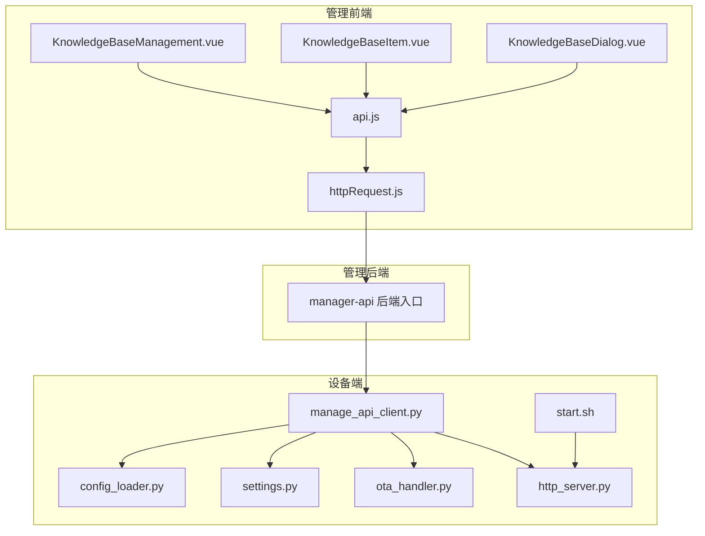
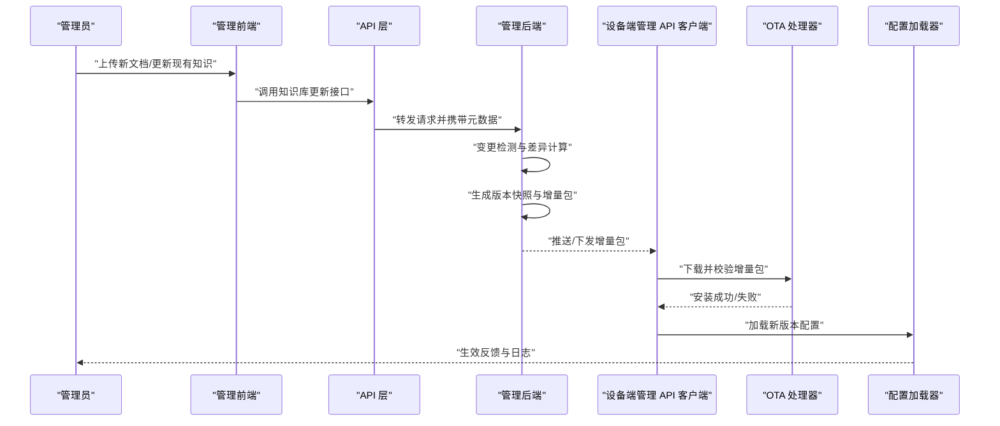
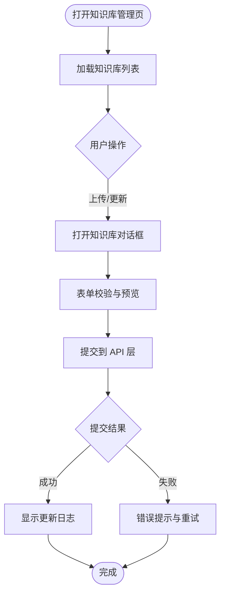
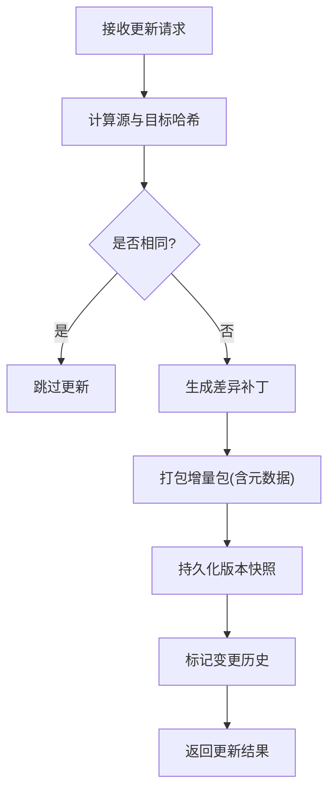
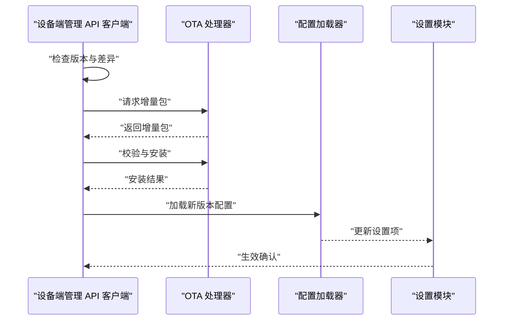
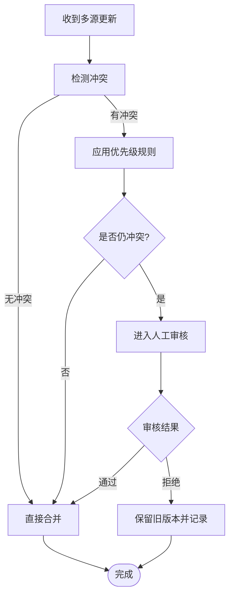
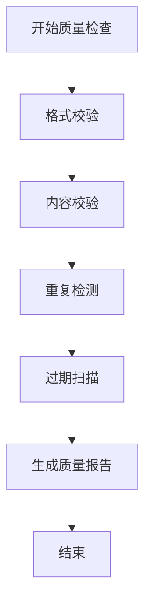
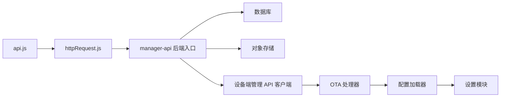

# 知识更新与维护

<cite>
**本文引用的文件**   
- [KnowledgeBaseManagement.vue](file://main/manager-web/src/views/KnowledgeBaseManagement.vue)
- [KnowledgeBaseItem.vue](file://main/manager-web/src/views/KnowledgeBaseItem.vue)
- [KnowledgeBaseDialog.vue](file://main/manager-web/src/components/KnowledgeBaseDialog.vue)
- [api.js](file://main/manager-web/src/apis/api.js)
- [httpRequest.js](file://main/manager-web/src/apis/httpRequest.js)
- [knowledge-base 目录](file://main/manager-web/src/assets/knowledge-base)
- [manager-api 后端入口](file://main/manager-api/src/main/java/xiaozhi/)
- [配置加载器](file://main/xiaozhi-server/config/config_loader.py)
- [设置模块](file://main/xiaozhi-server/config/settings.py)
- [管理 API 客户端](file://main/xiaozhi-server/config/manage_api_client.py)
- [OTA 处理器](file://main/xiaozhi-server/core/api/ota_handler.py)
- [HTTP 服务器](file://main/xiaozhi-server/core/http_server.py)
- [设备端启动脚本](file://main/xiaozhi-server/start.sh)
</cite>

## 目录
1. [简介](#简介)
2. [项目结构](#项目结构)
3. [核心组件](#核心组件)
4. [架构总览](#架构总览)
5. [详细组件分析](#详细组件分析)
6. [依赖关系分析](#依赖关系分析)
7. [性能考量](#性能考量)
8. [故障排查指南](#故障排查指南)
9. [结论](#结论)
10. [附录](#附录)

## 简介
本技术文档面向“知识库更新与维护系统”，围绕增量更新机制、版本控制（快照与回滚）、冲突解决策略、质量监控以及管理界面操作与维护最佳实践进行系统化说明。文档基于仓库中的管理前端、后端接口与设备端能力，给出端到端的实现思路与落地建议，帮助读者理解并完善知识库的持续演进流程。

## 项目结构
本项目包含管理端 Web 应用、管理 API 后端、设备端服务与相关脚本。知识库更新与维护涉及以下关键位置：
- 管理前端：知识库管理页面、对话框组件、API 封装与请求工具
- 管理后端：Java 服务（提供知识库相关接口）
- 设备端：配置加载、管理 API 客户端、OTA 处理与 HTTP 服务

**图表来源** 
- [KnowledgeBaseManagement.vue](file://main/manager-web/src/views/KnowledgeBaseManagement.vue)
- [KnowledgeBaseItem.vue](file://main/manager-web/src/views/KnowledgeBaseItem.vue)
- [KnowledgeBaseDialog.vue](file://main/manager-web/src/components/KnowledgeBaseDialog.vue)
- [api.js](file://main/manager-web/src/apis/api.js)
- [httpRequest.js](file://main/manager-web/src/apis/httpRequest.js)
- [manager-api 后端入口](file://main/manager-api/src/main/java/xiaozhi/)
- [配置加载器](file://main/xiaozhi-server/config/config_loader.py)
- [设置模块](file://main/xiaozhi-server/config/settings.py)
- [管理 API 客户端](file://main/xiaozhi-server/config/manage_api_client.py)
- [OTA 处理器](file://main/xiaozhi-server/core/api/ota_handler.py)
- [HTTP 服务器](file://main/xiaozhi-server/core/http_server.py)
- [设备端启动脚本](file://main/xiaozhi-server/start.sh)

**章节来源**
- [KnowledgeBaseManagement.vue](file://main/manager-web/src/views/KnowledgeBaseManagement.vue)
- [KnowledgeBaseItem.vue](file://main/manager-web/src/views/KnowledgeBaseItem.vue)
- [KnowledgeBaseDialog.vue](file://main/manager-web/src/components/KnowledgeBaseDialog.vue)
- [api.js](file://main/manager-web/src/apis/api.js)
- [httpRequest.js](file://main/manager-web/src/apis/httpRequest.js)
- [manager-api 后端入口](file://main/manager-api/src/main/java/xiaozhi/)
- [配置加载器](file://main/xiaozhi-server/config/config_loader.py)
- [设置模块](file://main/xiaozhi-server/config/settings.py)
- [管理 API 客户端](file://main/xiaozhi-server/config/manage_api_client.py)
- [OTA 处理器](file://main/xiaozhi-server/core/api/ota_handler.py)
- [HTTP 服务器](file://main/xiaozhi-server/core/http_server.py)
- [设备端启动脚本](file://main/xiaozhi-server/start.sh)

## 核心组件
- 管理前端知识库管理页：负责展示知识库条目、触发上传与更新操作、查看日志与状态
- 知识库对话框组件：封装新增/编辑表单、校验逻辑、提交到后端
- API 层：统一封装知识库相关接口调用与错误处理
- 管理后端：接收前端请求，执行知识库变更、版本记录、差异计算与合并
- 设备端管理 API 客户端：拉取/推送配置与知识库增量包，协调本地缓存与生效流程
- 配置加载与设置：读取最新知识库版本、热重载或重启后加载
- OTA 处理器：处理知识库更新包的下载、校验、安装与回滚
- HTTP 服务器：对外暴露配置与更新接口，供设备端与管理端交互

**章节来源**
- [KnowledgeBaseManagement.vue](file://main/manager-web/src/views/KnowledgeBaseManagement.vue)
- [KnowledgeBaseDialog.vue](file://main/manager-web/src/components/KnowledgeBaseDialog.vue)
- [api.js](file://main/manager-web/src/apis/api.js)
- [httpRequest.js](file://main/manager-web/src/apis/httpRequest.js)
- [manager-api 后端入口](file://main/manager-api/src/main/java/xiaozhi/)
- [配置加载器](file://main/xiaozhi-server/config/config_loader.py)
- [设置模块](file://main/xiaozhi-server/config/settings.py)
- [管理 API 客户端](file://main/xiaozhi-server/config/manage_api_client.py)
- [OTA 处理器](file://main/xiaozhi-server/core/api/ota_handler.py)
- [HTTP 服务器](file://main/xiaozhi-server/core/http_server.py)

## 架构总览
知识库更新与维护采用“管理端发起—后端编排—设备端执行”的分层架构。前端通过 API 层调用管理后端；后端完成变更检测、差异计算、版本快照与合并策略；设备端通过管理 API 客户端拉取增量包，由 OTA 处理器执行安装与回滚，最终由配置加载器生效。

**图表来源** 
- [api.js](file://main/manager-web/src/apis/api.js)
- [httpRequest.js](file://main/manager-web/src/apis/httpRequest.js)
- [manager-api 后端入口](file://main/manager-api/src/main/java/xiaozhi/)
- [管理 API 客户端](file://main/xiaozhi-server/config/manage_api_client.py)
- [OTA 处理器](file://main/xiaozhi-server/core/api/ota_handler.py)
- [配置加载器](file://main/xiaozhi-server/config/config_loader.py)

## 详细组件分析

### 管理前端：知识库管理页与对话框
- 功能要点
  - 列表展示知识库条目、版本信息与状态
  - 支持上传新文档、更新现有知识、删除与批量操作
  - 对话框封装表单校验、预览与提交
  - 查看更新日志与操作历史
- 交互流程
  - 用户选择文件或输入内容 → 前端校验 → 调用 API 层 → 显示结果与日志
- 关键点
  - 使用统一的请求工具处理错误与重试
  - 对大文件分片上传与进度反馈
  - 版本信息展示与回滚入口

**图表来源** 
- [KnowledgeBaseManagement.vue](file://main/manager-web/src/views/KnowledgeBaseManagement.vue)
- [KnowledgeBaseItem.vue](file://main/manager-web/src/views/KnowledgeBaseItem.vue)
- [KnowledgeBaseDialog.vue](file://main/manager-web/src/components/KnowledgeBaseDialog.vue)
- [api.js](file://main/manager-web/src/apis/api.js)
- [httpRequest.js](file://main/manager-web/src/apis/httpRequest.js)

**章节来源**
- [KnowledgeBaseManagement.vue](file://main/manager-web/src/views/KnowledgeBaseManagement.vue)
- [KnowledgeBaseItem.vue](file://main/manager-web/src/views/KnowledgeBaseItem.vue)
- [KnowledgeBaseDialog.vue](file://main/manager-web/src/components/KnowledgeBaseDialog.vue)
- [api.js](file://main/manager-web/src/apis/api.js)
- [httpRequest.js](file://main/manager-web/src/apis/httpRequest.js)

### 管理后端：变更检测、差异计算与版本控制
- 变更检测算法
  - 基于文件哈希与时间戳的增量检测，识别新增、修改、删除
  - 文本内容的语义级差异对比（如段落级 diff），减少冗余传输
- 差异计算
  - 生成最小化增量包，包含补丁与元数据（版本号、签名、依赖）
  - 支持部分重建策略：仅重建受影响的知识片段，避免全量重建
- 版本控制
  - 知识快照：每次发布生成不可变快照，记录完整状态
  - 版本回滚：支持按版本号回滚至历史快照
  - 变更历史追踪：记录操作人、时间、影响范围与审核状态

**图表来源** 
- [manager-api 后端入口](file://main/manager-api/src/main/java/xiaozhi/)

**章节来源**
- [manager-api 后端入口](file://main/manager-api/src/main/java/xiaozhi/)

### 设备端：增量拉取、安装与回滚
- 管理 API 客户端
  - 主动拉取增量包，校验签名与完整性
  - 断点续传与重试机制，保证弱网环境可靠性
- OTA 处理器
  - 下载、解压、校验、安装增量包
  - 安装前创建临时工作区，成功后原子切换，失败自动回滚
- 配置加载器与设置
  - 加载最新版本配置，支持热重载或按需重启
  - 维护本地缓存与失效策略，确保一致性

**图表来源** 
- [管理 API 客户端](file://main/xiaozhi-server/config/manage_api_client.py)
- [OTA 处理器](file://main/xiaozhi-server/core/api/ota_handler.py)
- [配置加载器](file://main/xiaozhi-server/config/config_loader.py)
- [设置模块](file://main/xiaozhi-server/config/settings.py)

**章节来源**
- [管理 API 客户端](file://main/xiaozhi-server/config/manage_api_client.py)
- [OTA 处理器](file://main/xiaozhi-server/core/api/ota_handler.py)
- [配置加载器](file://main/xiaozhi-server/config/config_loader.py)
- [设置模块](file://main/xiaozhi-server/config/settings.py)

### 冲突解决策略：多源数据合并、优先级规则与人工审核
- 多源数据合并
  - 字段级合并：按键值覆盖策略，保留未冲突字段
  - 冲突检测：当同一键存在不同值时，标记为冲突并进入审核流程
- 优先级规则
  - 定义来源优先级（如官方 > 企业 > 个人），高优先级覆盖低优先级
  - 时间戳优先：同优先级下以较新版本为准
- 人工审核流程
  - 冲突条目进入待审队列，通知审核人员
  - 审核通过后自动合并，拒绝则保留旧版本并记录原因

[本图为概念性流程图，不直接映射具体源码文件]

### 质量监控：有效性检查、重复检测与过时清理
- 知识有效性检查
  - 格式校验：JSON/YAML/Markdown 等结构的合法性
  - 内容校验：必填字段、引用完整性、链接可达性
- 重复内容检测
  - 相似度阈值检测（如余弦相似度、MinHash），去重与合并
  - 指纹库维护，快速识别重复条目
- 过时内容清理
  - 基于时间窗口的过期策略，定期扫描并标记
  - 归档与清理任务，释放存储并优化检索性能

[本图为概念性流程图，不直接映射具体源码文件]

### 管理界面操作指南
- 上传新文档
  - 在知识库管理页点击“新增”，选择文件或粘贴内容
  - 填写标题、标签、版本说明，提交后查看日志
- 更新现有知识
  - 在列表中选中条目，点击“编辑”，修改内容后保存
  - 系统自动生成差异并提示影响范围
- 查看更新日志
  - 在条目详情页或全局日志面板查看操作历史、版本快照与回滚记录

**章节来源**
- [KnowledgeBaseManagement.vue](file://main/manager-web/src/views/KnowledgeBaseManagement.vue)
- [KnowledgeBaseItem.vue](file://main/manager-web/src/views/KnowledgeBaseItem.vue)
- [KnowledgeBaseDialog.vue](file://main/manager-web/src/components/KnowledgeBaseDialog.vue)

### 维护最佳实践
- 定期维护计划
  - 每周扫描过期与重复内容，每月进行一次全量校验
  - 季度审计：评估知识库覆盖率与质量指标
- 备份策略
  - 每日快照备份，保留最近 N 个版本
  - 异地容灾：将快照同步至对象存储或备份中心
- 灾难恢复方案
  - 制定回滚 SOP：从快照恢复、验证一致性、灰度发布
  - 演练与复盘：定期进行恢复演练，优化恢复时长与成功率

[本节为通用指导，不直接分析具体文件]

## 依赖关系分析
- 前端依赖
  - api.js 与 httpRequest.js 构成稳定的请求层，屏蔽底层细节
  - 组件间通过 props/events 通信，保持高内聚低耦合
- 后端依赖
  - manager-api 作为核心服务，依赖数据库与对象存储
  - 版本控制与差异计算模块需保证幂等性与可观测性
- 设备端依赖
  - manage_api_client 与 ota_handler 协作，确保增量包可靠安装
  - config_loader 与 settings 保障配置一致性与热更新

**图表来源** 
- [api.js](file://main/manager-web/src/apis/api.js)
- [httpRequest.js](file://main/manager-web/src/apis/httpRequest.js)
- [manager-api 后端入口](file://main/manager-api/src/main/java/xiaozhi/)
- [管理 API 客户端](file://main/xiaozhi-server/config/manage_api_client.py)
- [OTA 处理器](file://main/xiaozhi-server/core/api/ota_handler.py)
- [配置加载器](file://main/xiaozhi-server/config/config_loader.py)
- [设置模块](file://main/xiaozhi-server/config/settings.py)

**章节来源**
- [api.js](file://main/manager-web/src/apis/api.js)
- [httpRequest.js](file://main/manager-web/src/apis/httpRequest.js)
- [manager-api 后端入口](file://main/manager-api/src/main/java/xiaozhi/)
- [管理 API 客户端](file://main/xiaozhi-server/config/manage_api_client.py)
- [OTA 处理器](file://main/xiaozhi-server/core/api/ota_handler.py)
- [配置加载器](file://main/xiaozhi-server/config/config_loader.py)
- [设置模块](file://main/xiaozhi-server/config/settings.py)

## 性能考量
- 增量更新
  - 使用差异补丁与分块传输，降低带宽占用与延迟
  - 并行校验与解压，提升安装速度
- 版本快照
  - 快照压缩与索引化，加速回滚与查询
  - 冷热分层存储，热点版本常驻内存或高速存储
- 并发与幂等
  - 更新接口幂等设计，避免重复执行导致不一致
  - 限流与熔断保护，防止雪崩效应

[本节为通用指导，不直接分析具体文件]

## 故障排查指南
- 常见问题
  - 增量包校验失败：检查签名与完整性，确认网络与权限
  - 安装失败：查看临时工作区日志，确认磁盘空间与权限
  - 配置未生效：检查加载顺序与热重载机制，必要时重启服务
- 诊断步骤
  - 前端：查看请求日志与错误码，确认参数与权限
  - 后端：检查差异计算与快照生成日志，定位冲突与异常
  - 设备端：查看 OTA 安装日志与配置加载日志，确认生效状态

**章节来源**
- [OTA 处理器](file://main/xiaozhi-server/core/api/ota_handler.py)
- [配置加载器](file://main/xiaozhi-server/config/config_loader.py)
- [设置模块](file://main/xiaozhi-server/config/settings.py)
- [管理 API 客户端](file://main/xiaozhi-server/config/manage_api_client.py)

## 结论
本知识库更新与维护系统通过前后端协同与设备端执行，实现了高效的增量更新、严格的版本控制与可靠的冲突解决。结合质量监控与维护最佳实践，可有效保障知识库的准确性、时效性与可用性。建议在后续迭代中持续优化差异算法、增强审核流程与完善监控告警，以提升整体运维效率与用户体验。

[本节为总结性内容，不直接分析具体文件]

## 附录
- 相关文件路径
  - 管理前端：main/manager-web/src/views、main/manager-web/src/components、main/manager-web/src/apis
  - 管理后端：main/manager-api/src/main/java/xiaozhi/
  - 设备端：main/xiaozhi-server/config、main/xiaozhi-server/core/api
- 术语表
  - 增量更新：仅传输变化部分的更新方式
  - 版本快照：某一时刻知识库状态的不可变副本
  - 差异计算：比较两个版本之间的变化并生成补丁
  - 冲突解决：处理多源更新导致的值冲突的策略

[本节为补充信息，不直接分析具体文件]