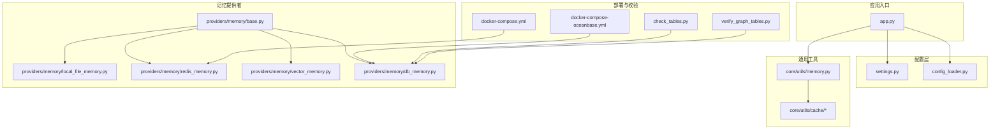
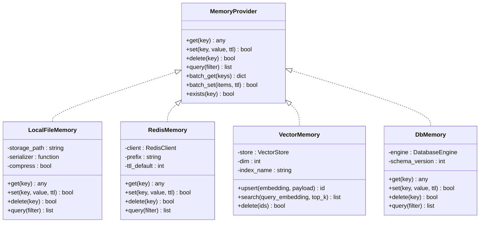
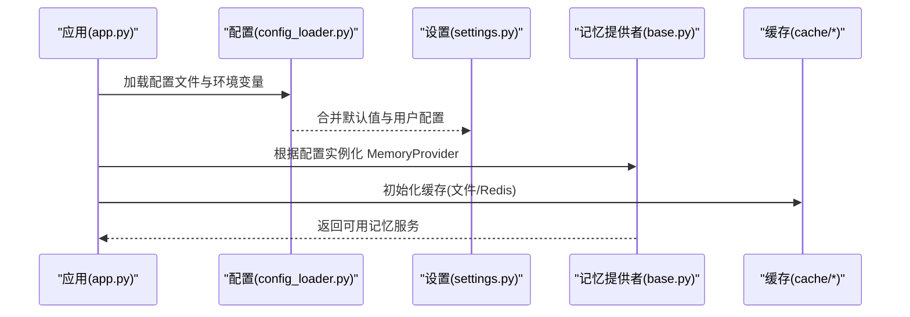
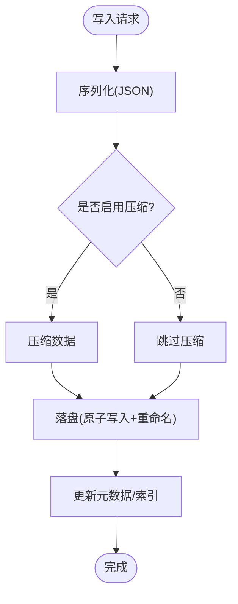
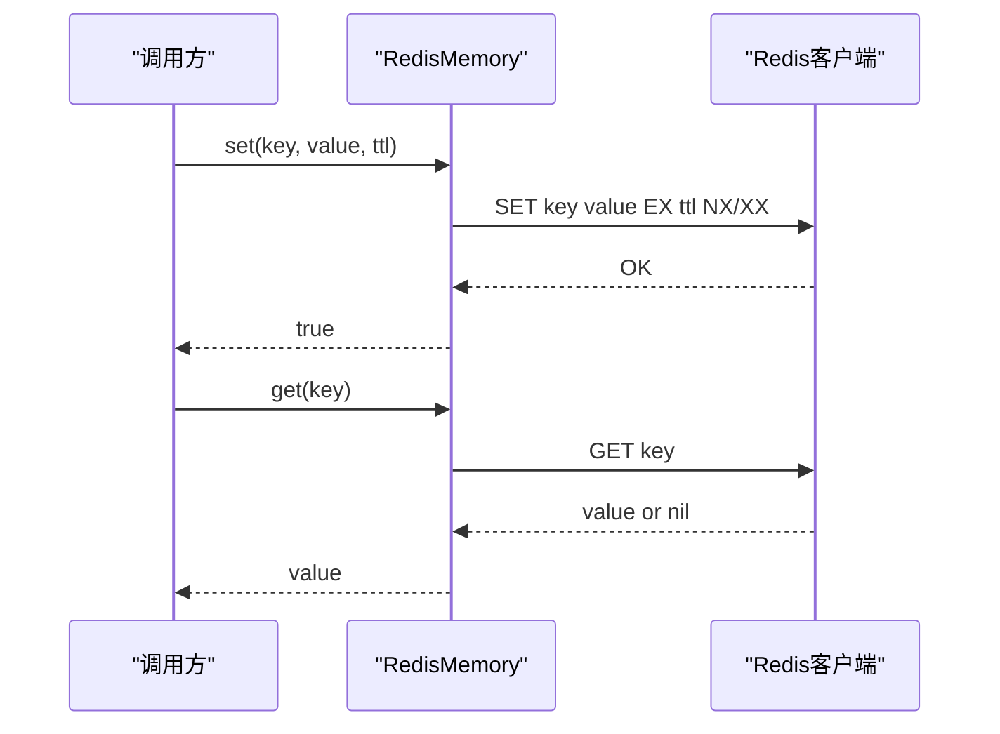
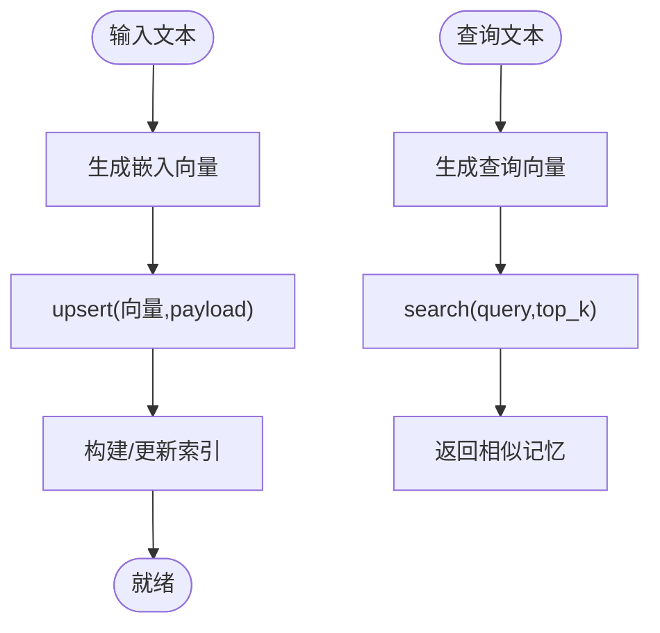
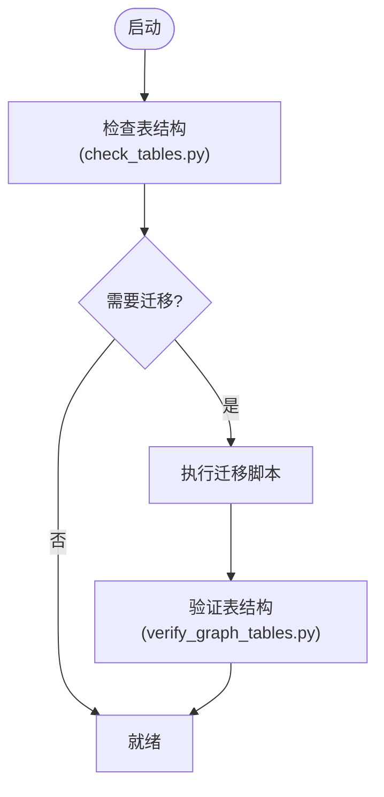
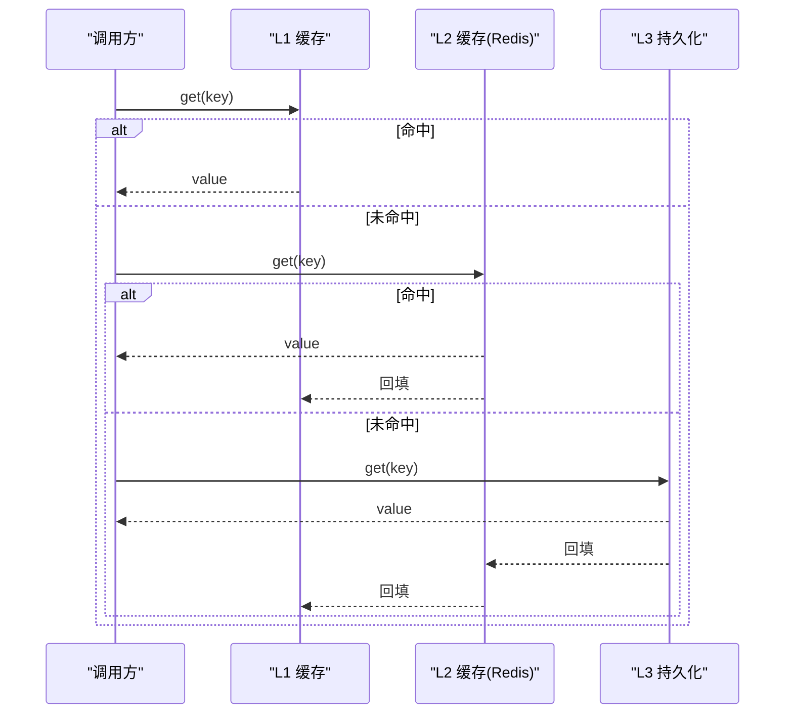
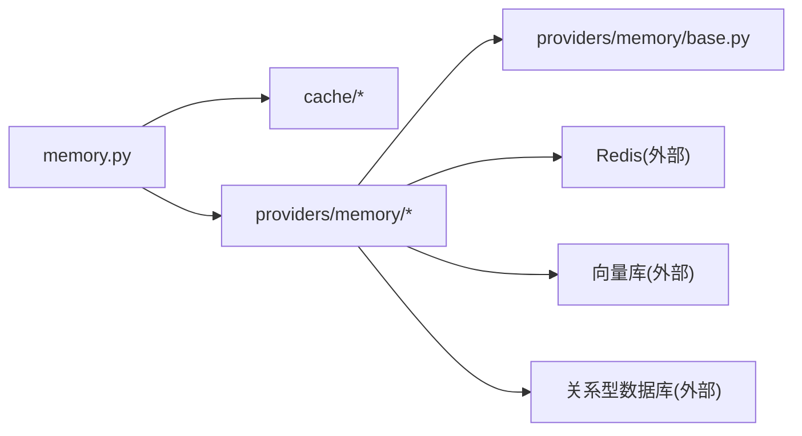

# 记忆存储机制

<cite>
**本文引用的文件**   
- [app.py](file://main/xiaozhi-server/app.py)
- [settings.py](file://main/xiaozhi-server/config/settings.py)
- [config_loader.py](file://main/xiaozhi-server/config/config_loader.py)
- [memory.py](file://main/xiaozhi-server/core/utils/memory.py)
- [cache/__init__.py](file://main/xiaozhi-server/core/utils/cache/__init__.py)
- [cache/file_cache.py](file://main/xiaozhi-server/core/utils/cache/file_cache.py)
- [cache/redis_cache.py](file://main/xiaozhi-server/core/utils/cache/redis_cache.py)
- [providers/memory/base.py](file://main/xiaozhi-server/core/providers/memory/base.py)
- [providers/memory/local_file_memory.py](file://main/xiaozhi-server/core/providers/memory/local_file_memory.py)
- [providers/memory/redis_memory.py](file://main/xiaozhi-server/core/providers/memory/redis_memory.py)
- [providers/memory/vector_memory.py](file://main/xiaozhi-server/core/providers/memory/vector_memory.py)
- [providers/memory/db_memory.py](file://main/xiaozhi-server/core/providers/memory/db_memory.py)
- [docker-compose.yml](file://main/xiaozhi-server/docker-compose.yml)
- [docker-compose-oceanbase.yml](file://main/xiaozhi-server/docker-compose-oceanbase.yml)
- [check_tables.py](file://main/xiaozhi-server/check_tables.py)
- [verify_graph_tables.py](file://main/xiaozhi-server/verify_graph_tables.py)
</cite>

## 目录
1. [简介](#简介)
2. [项目结构](#项目结构)
3. [核心组件](#核心组件)
4. [架构总览](#架构总览)
5. [详细组件分析](#详细组件分析)
6. [依赖关系分析](#依赖关系分析)
7. [性能考量](#性能考量)
8. [故障排查指南](#故障排查指南)
9. [结论](#结论)
10. [附录](#附录)

## 简介
本技术文档围绕“记忆存储机制”展开，系统性梳理本地文件存储、Redis 缓存、向量数据库与关系型数据库等后端的设计与实现。重点覆盖：
- 数据存储格式（JSON 序列化、二进制编码、压缩策略）
- 缓存策略（多级缓存、LRU、过期策略、一致性保证）
- 分布式方案（分片、副本同步、冲突解决）
- 性能优化（索引、查询优化、批量操作）
- 配置示例与调优建议

## 项目结构
记忆存储相关代码主要分布在以下模块：
- 配置层：settings.py、config_loader.py
- 通用工具：core/utils/memory.py、core/utils/cache/*
- 提供者抽象与实现：core/providers/memory/*
- 运行与部署：docker-compose*.yml、check_tables.py、verify_graph_tables.py

图表来源
- [app.py](file://main/xiaozhi-server/app.py)
- [settings.py](file://main/xiaozhi-server/config/settings.py)
- [config_loader.py](file://main/xiaozhi-server/config/config_loader.py)
- [memory.py](file://main/xiaozhi-server/core/utils/memory.py)
- [cache/__init__.py](file://main/xiaozhi-server/core/utils/cache/__init__.py)
- [cache/file_cache.py](file://main/xiaozhi-server/core/utils/cache/file_cache.py)
- [cache/redis_cache.py](file://main/xiaozhi-server/core/utils/cache/redis_cache.py)
- [providers/memory/base.py](file://main/xiaozhi-server/core/providers/memory/base.py)
- [providers/memory/local_file_memory.py](file://main/xiaozhi-server/core/providers/memory/local_file_memory.py)
- [providers/memory/redis_memory.py](file://main/xiaozhi-server/core/providers/memory/redis_memory.py)
- [providers/memory/vector_memory.py](file://main/xiaozhi-server/core/providers/memory/vector_memory.py)
- [providers/memory/db_memory.py](file://main/xiaozhi-server/core/providers/memory/db_memory.py)
- [docker-compose.yml](file://main/xiaozhi-server/docker-compose.yml)
- [docker-compose-oceanbase.yml](file://main/xiaozhi-server/docker-compose-oceanbase.yml)
- [check_tables.py](file://main/xiaozhi-server/check_tables.py)
- [verify_graph_tables.py](file://main/xiaozhi-server/verify_graph_tables.py)

章节来源
- [settings.py](file://main/xiaozhi-server/config/settings.py)
- [config_loader.py](file://main/xiaozhi-server/config/config_loader.py)
- [memory.py](file://main/xiaozhi-server/core/utils/memory.py)
- [cache/__init__.py](file://main/xiaozhi-server/core/utils/cache/__init__.py)
- [providers/memory/base.py](file://main/xiaozhi-server/core/providers/memory/base.py)

## 核心组件
- 配置加载与设置
  - settings.py：集中管理运行时配置项（如存储类型、连接参数、缓存大小、过期时间等）。
  - config_loader.py：从外部文件或环境变量加载并合并配置，支持热更新或启动时注入。
- 通用记忆工具
  - core/utils/memory.py：提供统一的记忆读写封装、键空间组织、序列化/反序列化、压缩开关等。
- 缓存抽象与实现
  - core/utils/cache/__init__.py：定义缓存接口与工厂方法。
  - file_cache.py：基于本地文件的缓存实现，支持 JSON 序列化与可选压缩。
  - redis_cache.py：基于 Redis 的缓存实现，支持 TTL、原子操作与集群模式。
- 记忆提供者抽象与实现
  - base.py：统一 MemoryProvider 接口（get/set/delete/query/batch_* 等）。
  - local_file_memory.py：以文件系统为后端的持久化记忆。
  - redis_memory.py：以 Redis 为后端的内存式记忆。
  - vector_memory.py：面向语义检索的向量存储（嵌入向量、相似度检索）。
  - db_memory.py：面向结构化数据的持久化记忆（关系型数据库）。

章节来源
- [memory.py](file://main/xiaozhi-server/core/utils/memory.py)
- [cache/__init__.py](file://main/xiaozhi-server/core/utils/cache/__init__.py)
- [cache/file_cache.py](file://main/xiaozhi-server/core/utils/cache/file_cache.py)
- [cache/redis_cache.py](file://main/xiaozhi-server/core/utils/cache/redis_cache.py)
- [providers/memory/base.py](file://main/xiaozhi-server/core/providers/memory/base.py)
- [providers/memory/local_file_memory.py](file://main/xiaozhi-server/core/providers/memory/local_file_memory.py)
- [providers/memory/redis_memory.py](file://main/xiaozhi-server/core/providers/memory/redis_memory.py)
- [providers/memory/vector_memory.py](file://main/xiaozhi-server/core/providers/memory/vector_memory.py)
- [providers/memory/db_memory.py](file://main/xiaozhi-server/core/providers/memory/db_memory.py)

## 架构总览
记忆系统采用“抽象接口 + 多后端实现”的分层设计：上层通过统一的 MemoryProvider 接口访问不同存储；中间层提供缓存与工具能力；底层对接具体存储介质。

图表来源
- [providers/memory/base.py](file://main/xiaozhi-server/core/providers/memory/base.py)
- [providers/memory/local_file_memory.py](file://main/xiaozhi-server/core/providers/memory/local_file_memory.py)
- [providers/memory/redis_memory.py](file://main/xiaozhi-server/core/providers/memory/redis_memory.py)
- [providers/memory/vector_memory.py](file://main/xiaozhi-server/core/providers/memory/vector_memory.py)
- [providers/memory/db_memory.py](file://main/xiaozhi-server/core/providers/memory/db_memory.py)

## 详细组件分析

### 配置与初始化
- 配置来源
  - settings.py：集中声明默认值与类型约束。
  - config_loader.py：读取配置文件与环境变量，合并为最终配置对象。
- 初始化流程
  - app.py 在启动阶段加载配置，根据配置选择 MemoryProvider 实现，并初始化缓存层（file/redis）。

图表来源
- [app.py](file://main/xiaozhi-server/app.py)
- [config_loader.py](file://main/xiaozhi-server/config/config_loader.py)
- [settings.py](file://main/xiaozhi-server/config/settings.py)
- [providers/memory/base.py](file://main/xiaozhi-server/core/providers/memory/base.py)
- [cache/__init__.py](file://main/xiaozhi-server/core/utils/cache/__init__.py)

章节来源
- [settings.py](file://main/xiaozhi-server/config/settings.py)
- [config_loader.py](file://main/xiaozhi-server/config/config_loader.py)
- [app.py](file://main/xiaozhi-server/app.py)

### 本地文件存储（Local File Memory）
- 数据格式
  - 使用 JSON 序列化存储结构化数据，键名映射到文件路径，便于按命名空间隔离。
  - 可选压缩：对大对象启用 gzip/zstd 压缩，降低磁盘占用。
- 并发与一致性
  - 单进程内通过文件锁或写入队列避免竞争写。
  - 读路径可开启只读缓存以提升热点访问性能。
- 适用场景
  - 单机部署、低并发、冷数据归档、调试与开发环境。

图表来源
- [providers/memory/local_file_memory.py](file://main/xiaozhi-server/core/providers/memory/local_file_memory.py)
- [cache/file_cache.py](file://main/xiaozhi-server/core/utils/cache/file_cache.py)

章节来源
- [providers/memory/local_file_memory.py](file://main/xiaozhi-server/core/providers/memory/local_file_memory.py)
- [cache/file_cache.py](file://main/xiaozhi-server/core/utils/cache/file_cache.py)

### Redis 缓存与记忆（Redis Memory）
- 数据结构
  - Hash/Set/String/ZSet 等原生结构用于高效存取与排序。
  - TTL 控制过期策略，支持按前缀批量清理。
- 缓存策略
  - LRU：借助 Redis 的 maxmemory-policy 或应用层维护最近访问顺序。
  - 多级缓存：应用内存 + Redis 二级缓存，热点数据优先命中内存。
- 一致性
  - 读写分离场景下可采用“先写缓存再异步刷新”或“延迟双删”策略。
  - 分布式锁保证关键路径的串行化更新。

图表来源
- [providers/memory/redis_memory.py](file://main/xiaozhi-server/core/providers/memory/redis_memory.py)
- [cache/redis_cache.py](file://main/xiaozhi-server/core/utils/cache/redis_cache.py)
- [docker-compose.yml](file://main/xiaozhi-server/docker-compose.yml)

章节来源
- [providers/memory/redis_memory.py](file://main/xiaozhi-server/core/providers/memory/redis_memory.py)
- [cache/redis_cache.py](file://main/xiaozhi-server/core/utils/cache/redis_cache.py)
- [docker-compose.yml](file://main/xiaozhi-server/docker-compose.yml)

### 向量数据库（Vector Memory）
- 数据模型
  - 向量维度固定，记录 embedding 与关联 payload（如对话片段、上下文摘要）。
  - 索引结构支持近似最近邻搜索（ANN），如 HNSW、IVF 等。
- 操作语义
  - upsert：插入或更新向量与元数据。
  - search：按 query embedding 进行相似度检索，返回 top-k 结果。
  - delete：按 ID 列表删除条目。
- 适用场景
  - 语义检索、相似记忆召回、RAG 增强生成。

图表来源
- [providers/memory/vector_memory.py](file://main/xiaozhi-server/core/providers/memory/vector_memory.py)

章节来源
- [providers/memory/vector_memory.py](file://main/xiaozhi-server/core/providers/memory/vector_memory.py)

### 关系型数据库（DB Memory）
- 表结构与版本
  - 通过 check_tables.py 与 verify_graph_tables.py 进行建表与校验，确保 schema 一致性与迁移正确性。
  - 支持事务与外键约束，保证数据完整性。
- 查询优化
  - 针对高频字段建立索引，合理使用覆盖索引减少回表。
  - 分页与批处理提升吞吐，避免全表扫描。
- 适用场景
  - 强一致性要求、复杂查询、审计与报表。

图表来源
- [check_tables.py](file://main/xiaozhi-server/check_tables.py)
- [verify_graph_tables.py](file://main/xiaozhi-server/verify_graph_tables.py)
- [docker-compose-oceanbase.yml](file://main/xiaozhi-server/docker-compose-oceanbase.yml)

章节来源
- [check_tables.py](file://main/xiaozhi-server/check_tables.py)
- [verify_graph_tables.py](file://main/xiaozhi-server/verify_graph_tables.py)
- [docker-compose-oceanbase.yml](file://main/xiaozhi-server/docker-compose-oceanbase.yml)

### 多级缓存与一致性
- 缓存层次
  - L1：进程内字典/对象缓存（极快，容量有限）。
  - L2：Redis 缓存（共享、高吞吐、支持 TTL）。
  - L3：持久化存储（文件/向量/关系型数据库）。
- 失效与更新
  - TTL 过期自动失效；热点数据可设置软过期（逻辑过期+后台刷新）。
  - 写路径采用“先写 L3，再异步更新 L2/L1”，或“先写 L2/L1，再异步回写 L3”。
- 一致性保障
  - 分布式锁保护关键更新路径。
  - 版本号或时间戳比较避免脏写。

[本图为概念流程图，不直接映射具体源码文件]

## 依赖关系分析
- 模块耦合
  - memory.py 作为统一入口，依赖 cache 层与 providers 层。
  - providers 层彼此解耦，仅依赖 base 接口。
- 外部依赖
  - Redis 通过 docker-compose.yml 编排。
  - 关系型数据库通过 docker-compose-oceanbase.yml 编排。
- 潜在循环依赖
  - 通过接口抽象与工厂模式避免循环引用。

图表来源
- [memory.py](file://main/xiaozhi-server/core/utils/memory.py)
- [cache/__init__.py](file://main/xiaozhi-server/core/utils/cache/__init__.py)
- [providers/memory/base.py](file://main/xiaozhi-server/core/providers/memory/base.py)
- [docker-compose.yml](file://main/xiaozhi-server/docker-compose.yml)
- [docker-compose-oceanbase.yml](file://main/xiaozhi-server/docker-compose-oceanbase.yml)

章节来源
- [memory.py](file://main/xiaozhi-server/core/utils/memory.py)
- [providers/memory/base.py](file://main/xiaozhi-server/core/providers/memory/base.py)
- [docker-compose.yml](file://main/xiaozhi-server/docker-compose.yml)
- [docker-compose-oceanbase.yml](file://main/xiaozhi-server/docker-compose-oceanbase.yml)

## 性能考量
- 序列化与压缩
  - JSON 适合可读性与生态兼容；对大对象启用压缩可降低 I/O 压力。
  - 二进制编码（如 MessagePack）可减少体积与解析开销，但牺牲可读性。
- 缓存策略
  - LRU 结合 TTL 平衡命中率与内存占用。
  - 热点键预热与批量写入减少网络往返。
- 索引与查询
  - 关系型数据库：合理索引、覆盖索引、避免 N+1 查询。
  - 向量库：选择合适的索引算法与参数（如 HNSW efConstruction/efSearch）。
- 批量操作
  - 使用 pipeline/事务批量提交，降低 RTT 与锁竞争。
- 分布式扩展
  - 分片：按用户/会话维度哈希分片，保证局部性。
  - 副本：读写分离与跨机房复制，注意冲突解决（如最后写入胜出或合并策略）。

[本节为通用指导，不直接分析具体文件]

## 故障排查指南
- 常见问题
  - Redis 连接失败：检查端口、认证、网络策略与容器状态。
  - 文件权限错误：确认存储目录权限与磁盘空间。
  - 向量库索引异常：检查维度一致性、索引重建与内存限制。
  - 数据库表不一致：运行 check_tables.py 与 verify_graph_tables.py 修复。
- 定位手段
  - 日志：记录关键路径的入参、出参与耗时。
  - 监控：关注缓存命中率、QPS、RT、错误率。
  - 压测：模拟热点与突发流量，观察降级与恢复行为。

章节来源
- [check_tables.py](file://main/xiaozhi-server/check_tables.py)
- [verify_graph_tables.py](file://main/xiaozhi-server/verify_graph_tables.py)
- [docker-compose.yml](file://main/xiaozhi-server/docker-compose.yml)
- [docker-compose-oceanbase.yml](file://main/xiaozhi-server/docker-compose-oceanbase.yml)

## 结论
本记忆存储机制通过统一接口与多后端实现，兼顾灵活性与可扩展性。结合多级缓存、合理的序列化与压缩策略、以及针对不同存储介质的优化手段，可在单机与分布式环境下稳定运行。生产部署建议配合完善的监控、压测与自动化运维脚本，持续优化性能与稳定性。

## 附录
- 配置示例要点
  - 存储类型选择：local/redis/vector/db
  - Redis：host/port/password/max_connections/pool_size
  - 文件存储：storage_path/compression_enabled
  - 向量库：embedding_dim/index_type/search_params
  - 数据库：connection_url/schema_version/migration_strategy
- 调优清单
  - 调整 TTL 与 LRU 上限，观察命中率变化
  - 启用批量写入与连接池，降低延迟
  - 为高频查询字段添加索引，避免全表扫描
  - 向量库参数微调，平衡召回率与延迟

[本节为通用指导，不直接分析具体文件]