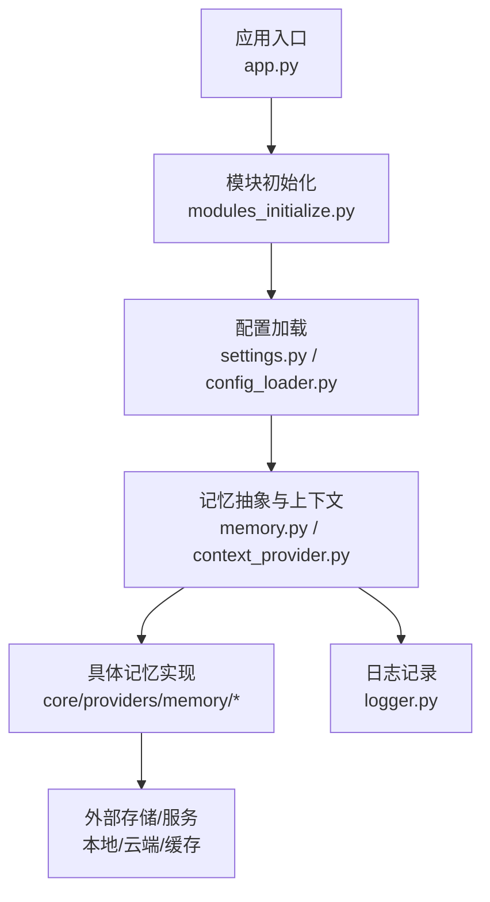
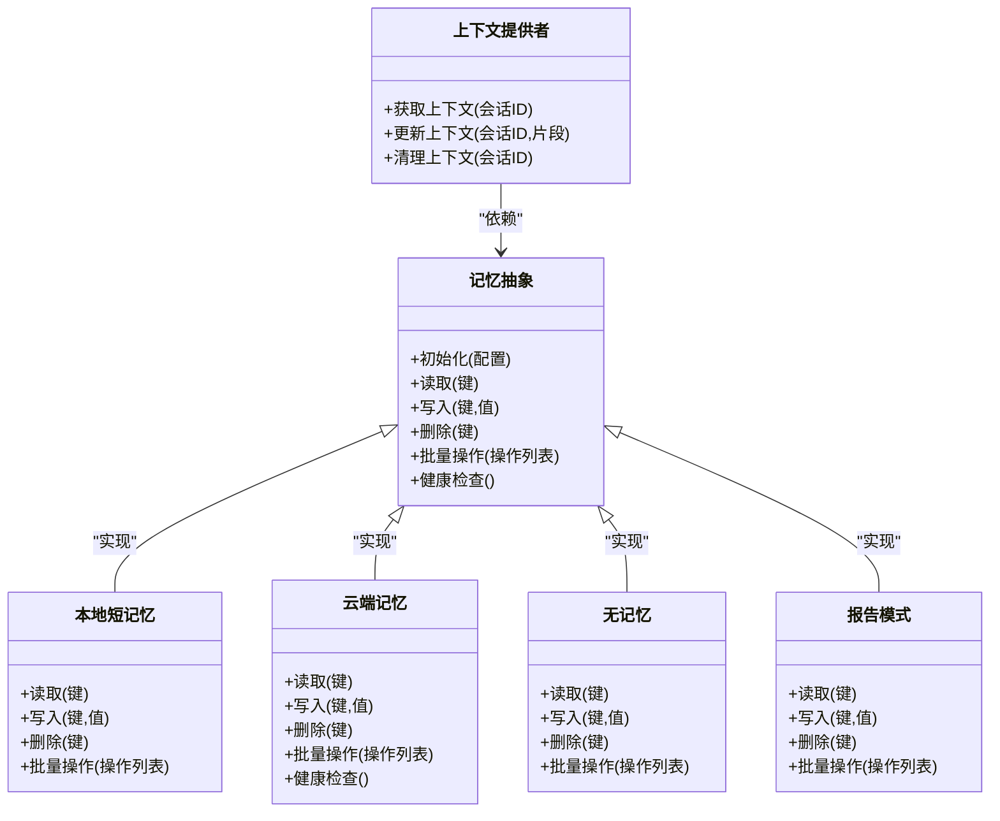
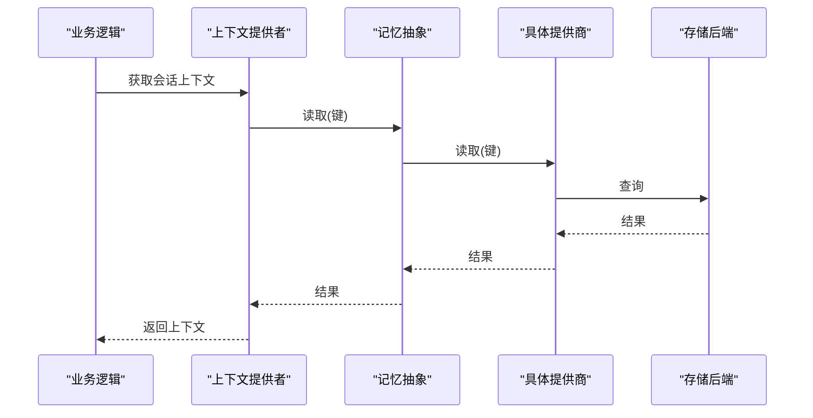
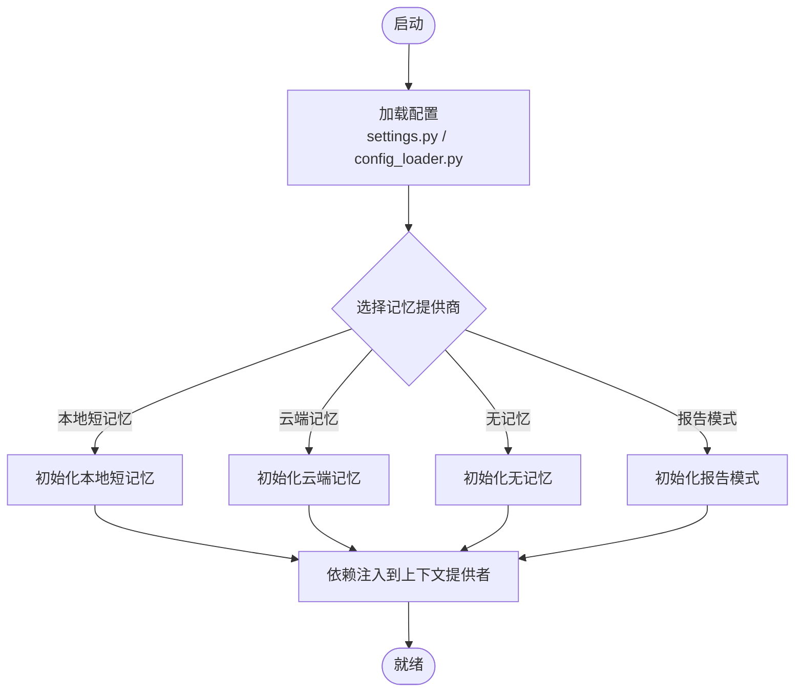
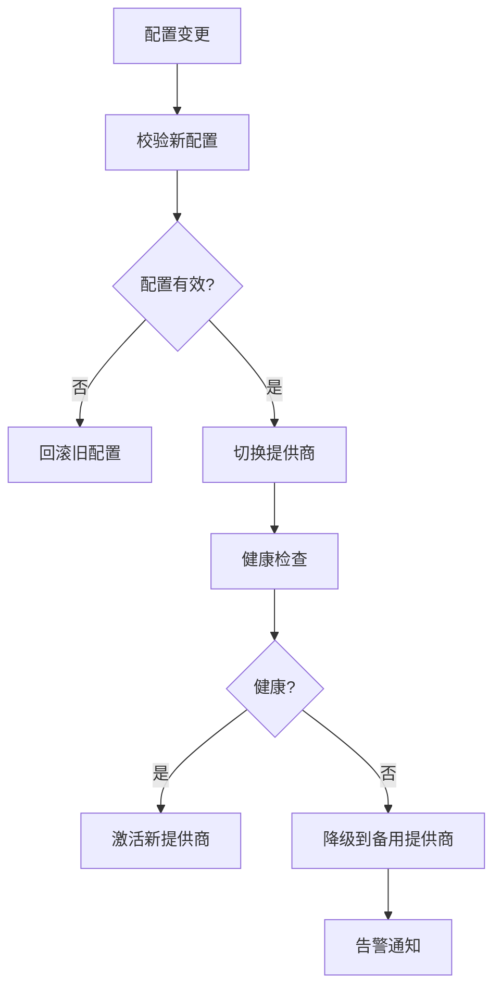
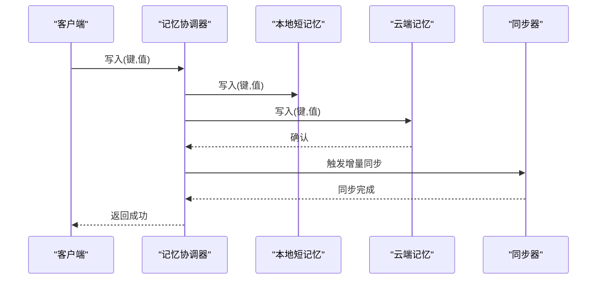
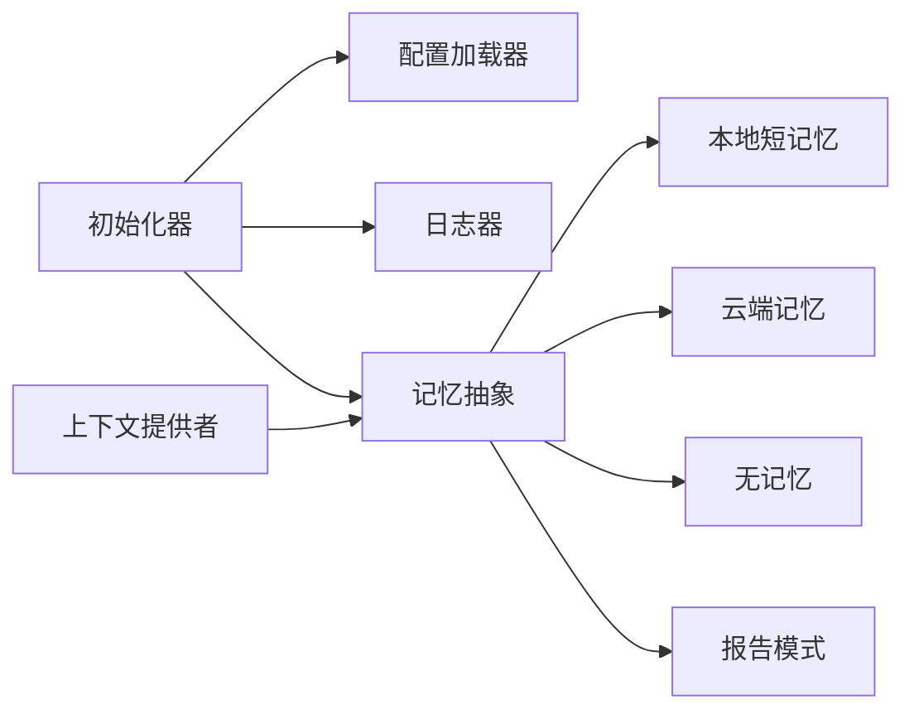

# 记忆提供商

<cite>
**本文引用的文件**   
- [memory.py](file://main/xiaozhi-server/core/utils/memory.py)
- [context_provider.py](file://main/xiaozhi-server/core/utils/context_provider.py)
- [modules_initialize.py](file://main/xiaozhi-server/core/utils/modules_initialize.py)
- [settings.py](file://main/xiaozhi-server/config/settings.py)
- [config_loader.py](file://main/xiaozhi-server/config/config_loader.py)
- [logger.py](file://main/xiaozhi-server/config/logger.py)
- [Memory_System_Architecture_Blueprint.md](file://main/xiaozhi-server/docs/architecture/Memory_System_Architecture_Blueprint.md)
- [cache-implementation.md](file://main/xiaozhi-server/docs/cache-implementation.md)
- [powermem-analysis-report.md](file://main/xiaozhi-server/docs/powermem-analysis-report.md)
- [production-readiness-assessment.md](file://main/xiaozhi-server/docs/production-readiness-assessment.md)
- [app.py](file://main/xiaozhi-server/app.py)
</cite>

## 目录
1. [简介](#简介)
2. [项目结构](#项目结构)
3. [核心组件](#核心组件)
4. [架构总览](#架构总览)
5. [详细组件分析](#详细组件分析)
6. [依赖关系分析](#依赖关系分析)
7. [性能考量](#性能考量)
8. [故障排查指南](#故障排查指南)
9. [结论](#结论)
10. [附录](#附录)

## 简介
本文件面向“记忆提供商”的实现与使用，覆盖本地短记忆、云端记忆、无记忆、报告模式等常见场景；阐述提供商接口规范（初始化配置、CRUD、批量处理、错误处理）；说明提供商切换机制（动态加载、配置热更新、降级策略）；解释混合记忆方案（多提供商协同、数据同步、负载均衡）；并提供自定义提供商开发指南（接口实现、插件注册、依赖注入）以及选型建议与性能对比。

## 项目结构
记忆相关能力集中在 xiaozhi-server 的 core/utils 与 config 模块中，并通过文档进行架构与设计说明：
- 运行时记忆抽象与上下文管理位于 core/utils/memory.py 与 context_provider.py
- 模块初始化与配置加载位于 core/utils/modules_initialize.py 与 config/settings.py、config/config_loader.py
- 日志与可观测性通过 config/logger.py 提供
- 架构蓝图与缓存实现细节见 docs 下的 Memory 系统蓝图与缓存实现文档

图表来源
- [app.py:1-200](file://main/xiaozhi-server/app.py#L1-L200)
- [modules_initialize.py:1-200](file://main/xiaozhi-server/core/utils/modules_initialize.py#L1-L200)
- [settings.py:1-200](file://main/xiaozhi-server/config/settings.py#L1-L200)
- [config_loader.py:1-200](file://main/xiaozhi-server/config/config_loader.py#L1-L200)
- [memory.py:1-200](file://main/xiaozhi-server/core/utils/memory.py#L1-L200)
- [context_provider.py:1-200](file://main/xiaozhi-server/core/utils/context_provider.py#L1-L200)
- [logger.py:1-200](file://main/xiaozhi-server/config/logger.py#L1-L200)

章节来源
- [Memory_System_Architecture_Blueprint.md](file://main/xiaozhi-server/docs/architecture/Memory_System_Architecture_Blueprint.md)
- [cache-implementation.md](file://main/xiaozhi-server/docs/cache-implementation.md)

## 核心组件
- 记忆抽象层：定义统一的记忆读写接口、会话上下文、生命周期管理与错误语义，屏蔽底层存储差异。
- 上下文提供者：负责在对话流程中注入/提取记忆上下文，支持按会话维度隔离与合并。
- 模块初始化器：根据配置选择并实例化具体记忆提供商，完成依赖注入与启动钩子。
- 配置与日志：集中式配置加载与日志输出，保障可观测性与可维护性。

章节来源
- [memory.py:1-200](file://main/xiaozhi-server/core/utils/memory.py#L1-L200)
- [context_provider.py:1-200](file://main/xiaozhi-server/core/utils/context_provider.py#L1-L200)
- [modules_initialize.py:1-200](file://main/xiaozhi-server/core/utils/modules_initialize.py#L1-L200)
- [settings.py:1-200](file://main/xiaozhi-server/config/settings.py#L1-L200)
- [config_loader.py:1-200](file://main/xiaozhi-server/config/config_loader.py#L1-L200)
- [logger.py:1-200](file://main/xiaozhi-server/config/logger.py#L1-L200)

## 架构总览
记忆系统采用“抽象接口 + 多实现 + 上下文注入”的分层架构：
- 上层业务仅依赖记忆抽象接口，不感知具体实现
- 中间层由上下文提供者统一装配，按会话维度组织记忆片段
- 下层为多种记忆提供商（本地短记忆、云端记忆、无记忆、报告模式等），按需启用与组合

图表来源
- [memory.py:1-200](file://main/xiaozhi-server/core/utils/memory.py#L1-L200)
- [context_provider.py:1-200](file://main/xiaozhi-server/core/utils/context_provider.py#L1-L200)

## 详细组件分析

### 记忆抽象与上下文提供者
- 记忆抽象定义了统一的 CRUD、批量操作与健康检查方法，确保各实现具备一致的行为契约。
- 上下文提供者封装了会话维度的记忆存取，支持片段合并、过期策略与并发安全。
- 典型调用链：业务请求 → 上下文提供者 → 记忆抽象 → 具体提供商 → 存储后端。

图表来源
- [memory.py:1-200](file://main/xiaozhi-server/core/utils/memory.py#L1-L200)
- [context_provider.py:1-200](file://main/xiaozhi-server/core/utils/context_provider.py#L1-L200)

章节来源
- [memory.py:1-200](file://main/xiaozhi-server/core/utils/memory.py#L1-L200)
- [context_provider.py:1-200](file://main/xiaozhi-server/core/utils/context_provider.py#L1-L200)

### 模块初始化与配置加载
- 模块初始化器依据配置选择并实例化记忆提供商，完成依赖注入与启动钩子。
- 配置加载器从 settings 与外部配置源合并参数，支持热更新与回滚。
- 日志器统一输出关键事件与错误，便于问题定位与审计。

图表来源
- [modules_initialize.py:1-200](file://main/xiaozhi-server/core/utils/modules_initialize.py#L1-L200)
- [settings.py:1-200](file://main/xiaozhi-server/config/settings.py#L1-L200)
- [config_loader.py:1-200](file://main/xiaozhi-server/config/config_loader.py#L1-L200)

章节来源
- [modules_initialize.py:1-200](file://main/xiaozhi-server/core/utils/modules_initialize.py#L1-L200)
- [settings.py:1-200](file://main/xiaozhi-server/config/settings.py#L1-L200)
- [config_loader.py:1-200](file://main/xiaozhi-server/config/config_loader.py#L1-L200)
- [logger.py:1-200](file://main/xiaozhi-server/config/logger.py#L1-L200)

### 本地短记忆
- 特点：低延迟、进程内或本地持久化、适合短期会话状态与热点数据。
- 使用场景：对话片段缓存、临时令牌、用户偏好快速访问。
- 性能：读写字节流小、并发可控、内存占用需监控。
- 错误处理：超时重试、容量限制、一致性校验。

章节来源
- [cache-implementation.md](file://main/xiaozhi-server/docs/cache-implementation.md)
- [memory.py:1-200](file://main/xiaozhi-server/core/utils/memory.py#L1-L200)

### 云端记忆
- 特点：高可用、可扩展、跨节点共享、适合长期记忆与全局知识。
- 使用场景：用户画像、历史对话归档、知识库检索。
- 性能：网络开销与序列化成本较高，需结合缓存与批处理优化。
- 错误处理：重试退避、熔断降级、幂等写入、版本冲突解决。

章节来源
- [powermem-analysis-report.md](file://main/xiaozhi-server/docs/powermem-analysis-report.md)
- [memory.py:1-200](file://main/xiaozhi-server/core/utils/memory.py#L1-L200)

### 无记忆
- 特点：不持久化任何状态，每次请求独立。
- 使用场景：隐私敏感、无需上下文的工具型调用。
- 性能：零 I/O 开销，但无法利用历史上下文。
- 错误处理：输入校验与边界条件保护。

章节来源
- [memory.py:1-200](file://main/xiaozhi-server/core/utils/memory.py#L1-L200)

### 报告模式
- 特点：将写入操作转为异步上报或落盘，适合审计与离线分析。
- 使用场景：合规审计、行为追踪、慢路径写入。
- 性能：写入吞吐高，但实时读取受限。
- 错误处理：队列积压告警、重试与丢弃策略。

章节来源
- [memory.py:1-200](file://main/xiaozhi-server/core/utils/memory.py#L1-L200)

### 提供商切换机制
- 动态加载：基于配置项选择提供商，支持运行时切换。
- 配置热更新：监听配置变更，重新初始化目标提供商并无缝切换。
- 降级策略：主提供商不可用时自动切换到备用（如无记忆或本地短记忆）。

图表来源
- [modules_initialize.py:1-200](file://main/xiaozhi-server/core/utils/modules_initialize.py#L1-L200)
- [config_loader.py:1-200](file://main/xiaozhi-server/config/config_loader.py#L1-L200)

章节来源
- [modules_initialize.py:1-200](file://main/xiaozhi-server/core/utils/modules_initialize.py#L1-L200)
- [config_loader.py:1-200](file://main/xiaozhi-server/config/config_loader.py#L1-L200)

### 混合记忆方案
- 多提供商协同：读优先本地短记忆，写同时落盘云端与本地，保证速度与一致性。
- 数据同步：增量同步与全量对齐，冲突以版本号或时间戳解决。
- 负载均衡：按会话哈希或权重路由到不同后端，避免单点瓶颈。

图表来源
- [memory.py:1-200](file://main/xiaozhi-server/core/utils/memory.py#L1-L200)
- [context_provider.py:1-200](file://main/xiaozhi-server/core/utils/context_provider.py#L1-L200)

章节来源
- [powermem-analysis-report.md](file://main/xiaozhi-server/docs/powermem-analysis-report.md)
- [cache-implementation.md](file://main/xiaozhi-server/docs/cache-implementation.md)

### 自定义提供商开发指南
- 接口实现：遵循记忆抽象的 CRUD、批量操作与健康检查方法。
- 插件注册：在初始化阶段向上下文提供者注册新提供商。
- 依赖注入：通过配置注入连接信息、认证凭据与限流策略。
- 测试与验证：单元测试覆盖正常路径与异常路径，集成测试验证端到端一致性。

章节来源
- [memory.py:1-200](file://main/xiaozhi-server/core/utils/memory.py#L1-200)
- [modules_initialize.py:1-200](file://main/xiaozhi-server/core/utils/modules_initialize.py#L1-200)

## 依赖关系分析
- 记忆抽象对具体提供商解耦，通过工厂或配置选择实现
- 上下文提供者依赖记忆抽象，屏蔽会话级细节
- 初始化器依赖配置加载器与日志器，确保稳定启动与可观测性

图表来源
- [modules_initialize.py:1-200](file://main/xiaozhi-server/core/utils/modules_initialize.py#L1-200)
- [memory.py:1-200](file://main/xiaozhi-server/core/utils/memory.py#L1-200)
- [context_provider.py:1-200](file://main/xiaozhi-server/core/utils/context_provider.py#L1-200)
- [config_loader.py:1-200](file://main/xiaozhi-server/config/config_loader.py#L1-200)
- [logger.py:1-200](file://main/xiaozhi-server/config/logger.py#L1-200)

章节来源
- [modules_initialize.py:1-200](file://main/xiaozhi-server/core/utils/modules_initialize.py#L1-200)
- [memory.py:1-200](file://main/xiaozhi-server/core/utils/memory.py#L1-200)
- [context_provider.py:1-200](file://main/xiaozhi-server/core/utils/context_provider.py#L1-200)
- [config_loader.py:1-200](file://main/xiaozhi-server/config/config_loader.py#L1-200)
- [logger.py:1-200](file://main/xiaozhi-server/config/logger.py#L1-200)

## 性能考量
- 本地短记忆：读延迟低，适合热点数据；注意内存上限与淘汰策略。
- 云端记忆：高可用与扩展性强；需关注网络延迟、序列化与批处理。
- 无记忆：零 I/O 开销，但不支持上下文复用。
- 报告模式：写入吞吐高，读取延迟大；适合审计与离线分析。
- 混合方案：读路径优先本地，写路径并行落盘，配合同步与冲突解决提升整体吞吐与一致性。

章节来源
- [cache-implementation.md](file://main/xiaozhi-server/docs/cache-implementation.md)
- [powermem-analysis-report.md](file://main/xiaozhi-server/docs/powermem-analysis-report.md)

## 故障排查指南
- 常见问题：
  - 配置加载失败：检查配置文件语法与必填字段
  - 提供商初始化失败：核对连接信息与权限
  - 读写超时：检查网络与后端负载，调整超时与重试策略
  - 数据不一致：查看同步日志与版本号冲突
- 诊断步骤：
  - 启用详细日志，定位错误堆栈
  - 健康检查接口确认提供商状态
  - 回放关键请求，复现问题
  - 检查资源使用率（CPU、内存、磁盘、网络）

章节来源
- [logger.py:1-200](file://main/xiaozhi-server/config/logger.py#L1-200)
- [production-readiness-assessment.md](file://main/xiaozhi-server/docs/production-readiness-assessment.md)

## 结论
记忆提供商通过抽象接口与上下文提供者实现了灵活、可扩展的记忆能力。本地短记忆、云端记忆、无记忆与报告模式覆盖多样场景；通过动态加载、热更新与降级策略保障稳定性；混合方案在多提供商协同下兼顾性能与一致性。开发者可按指南实现自定义提供商并纳入统一生态。

## 附录
- 架构图参考：Memory System Architecture Blueprint
- 缓存实现细节：cache-implementation.md
- 性能分析与生产就绪评估：powermem-analysis-report.md、production-readiness-assessment.md